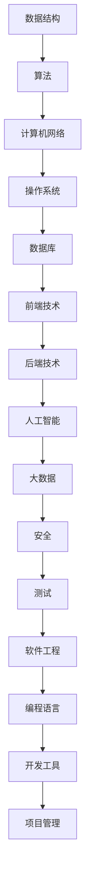

                 

### 关键词 Keywords ###
- 腾讯社招
- 编程面试
- 面试题精选
- 解答分析
- 技术实践

<|assistant|>### 摘要 Abstract ###
本文针对2025年腾讯社招编程面试的精选题目，从核心概念、算法原理、数学模型、项目实践等多角度进行深入分析与解答。文章旨在帮助求职者全面掌握面试题解题思路，提升应对面试的能力，同时探讨编程面试在未来的发展趋势和面临的挑战。

<|assistant|>### 1. 背景介绍 Background ###

腾讯，作为中国领先的技术公司，每年都会面向全球招聘大量优秀的技术人才。编程面试是腾讯社招的重要环节，旨在考察应聘者的编程能力、逻辑思维、问题解决能力以及实际应用技能。近年来，随着人工智能、大数据、云计算等领域的迅速发展，编程面试题也日趋复杂和多样化。本文将从以下几个方面进行深入剖析：

- **核心概念与联系**：介绍编程面试中涉及的核心概念及其相互关系，并通过Mermaid流程图进行直观展示。
- **核心算法原理与操作步骤**：详细讲解编程面试题中的算法原理，以及具体的操作步骤和优缺点分析。
- **数学模型与公式**：阐述编程面试中常见的数学模型和公式，并通过实例进行详细讲解。
- **项目实践**：通过实际代码实例，展示编程面试题的实现过程，并进行详细解释和分析。
- **实际应用场景**：探讨编程面试题在实际工程项目中的应用，以及未来的发展趋势。

<|assistant|>### 2. 核心概念与联系 Core Concepts and Relationships ###

在编程面试中，核心概念和它们之间的联系是非常重要的。为了帮助读者更好地理解这些概念，我们将使用Mermaid流程图进行展示。



以上Mermaid流程图展示了编程面试中常见的一些核心概念及其相互关系。下面我们将对这些概念进行详细解释。

#### 数据结构（Data Structure）####

数据结构是编程面试中的基础知识，涉及到数组、链表、栈、队列、树、图等。掌握这些数据结构对于解决复杂问题至关重要。

#### 算法（Algorithm）####

算法是解决问题的步骤和方法。常见的算法包括排序、查找、贪心、动态规划、回溯等。了解这些算法及其应用场景，可以帮助我们更高效地解决问题。

#### 计算机网络（Computer Network）####

计算机网络是现代计算机系统中不可或缺的一部分，涉及OSI七层模型、TCP/IP协议、HTTP协议等。理解计算机网络的基本原理，有助于我们在分布式系统开发中更好地应用网络技术。

#### 操作系统（Operating System）####

操作系统负责管理和控制计算机硬件资源，包括进程管理、内存管理、文件系统、设备管理等。了解操作系统的工作原理，有助于我们编写更高效的代码。

#### 数据库（Database）####

数据库是存储和管理数据的系统，包括关系型数据库（如MySQL、Oracle）和非关系型数据库（如MongoDB、Redis）。掌握数据库的基本原理和操作，有助于我们设计和优化数据存储方案。

#### 前端技术（Front-end Technology）####

前端技术主要涉及HTML、CSS、JavaScript等，负责实现网页的交互和呈现效果。了解前端技术，有助于我们开发用户友好的Web应用。

#### 后端技术（Back-end Technology）####

后端技术包括服务器端编程、框架（如Spring、Django）、微服务架构等，负责处理数据存储、业务逻辑和接口设计。掌握后端技术，有助于我们构建高性能的后端系统。

#### 人工智能（Artificial Intelligence）####

人工智能是当前热门的技术领域，涉及机器学习、深度学习、自然语言处理等。了解人工智能的基本原理和应用场景，有助于我们在实际项目中应用AI技术。

#### 大数据（Big Data）####

大数据技术包括Hadoop、Spark、Flink等，用于处理海量数据的存储、计算和分析。掌握大数据技术，有助于我们应对大数据领域的挑战。

#### 安全（Security）####

安全是编程面试中的一个重要方面，包括密码学、安全协议、漏洞分析等。了解安全知识，有助于我们编写更安全的代码。

#### 测试（Testing）####

测试是确保软件质量的重要环节，包括单元测试、集成测试、性能测试等。掌握测试方法，有助于我们提高软件的可靠性。

#### 软件工程（Software Engineering）####

软件工程是计算机科学的一个分支，涉及软件开发的方法、过程、工具等。了解软件工程的基本原理，有助于我们更好地进行项目管理和软件开发。

#### 编程语言（Programming Language）####

编程语言是编写代码的工具，包括Java、Python、C++、JavaScript等。掌握多种编程语言，有助于我们在不同场景下选择最适合的语言。

#### 开发工具（Development Tools）####

开发工具包括集成开发环境（IDE）、代码编辑器、版本控制工具等。熟练使用开发工具，可以提高我们的开发效率。

#### 项目管理（Project Management）####

项目管理涉及项目规划、进度控制、团队协作等。掌握项目管理知识，有助于我们更好地应对项目挑战。

通过以上对核心概念和联系的介绍，我们为后续的算法原理、数学模型、项目实践等内容的讲解奠定了基础。

<|assistant|>### 3. 核心算法原理 & 具体操作步骤 Core Algorithm Principles & Step-by-Step Operations ###

在编程面试中，算法问题占据了很大比重。为了帮助读者更好地理解和应对这类问题，我们将在本节详细讲解核心算法原理，并展示具体的操作步骤。

#### 3.1 算法原理概述

算法（Algorithm）是解决问题的一系列有序步骤。一个有效的算法应该满足以下特性：

- **确定性**：算法的每一步都有明确的定义，输入确定时，输出也是确定的。
- **有穷性**：算法在执行有限的步骤后必须结束。
- **可行性**：算法的每一步都是可行的，即可以由计算机执行。
- **有输入和输出**：算法可以接受输入，并根据输入产生输出。

常见的算法问题包括排序、查找、图算法、动态规划等。以下是一些典型的算法问题及其原理：

1. **排序算法**：将一组数据按照某种规则进行排列。常见的排序算法有冒泡排序、选择排序、插入排序、快速排序、归并排序等。
2. **查找算法**：在数据集合中查找特定的元素。常见的查找算法有二分查找、线性查找等。
3. **图算法**：解决图结构相关的问题。常见的图算法有深度优先搜索（DFS）、广度优先搜索（BFS）、最小生成树（MST）、最短路径（Dijkstra、Floyd）等。
4. **动态规划**：解决具有重叠子问题和最优子结构特点的问题。常见的动态规划问题有背包问题、最长公共子序列、最长递增子序列等。

#### 3.2 算法步骤详解

以冒泡排序为例，详细讲解其原理和操作步骤。

**冒泡排序（Bubble Sort）**

冒泡排序是一种简单的排序算法，其基本思想是通过重复遍历要排序的数列，比较每对相邻元素的值，如果它们的顺序错误就把它们交换过来。遍历数列的工作是重复地进行，直到没有再需要交换的元素为止。

**具体操作步骤如下：**

1. **初始化**：将待排序的数列记为A[0], A[1], ..., A[n-1]。
2. **第一次遍历**：从A[0]到A[n-2]，比较相邻的元素，如果A[i] > A[i+1]，则交换它们的位置。
3. **第二次遍历**：从A[0]到A[n-3]，同样比较相邻的元素，并交换位置。
4. **重复过程**：继续以上过程，每次遍历的最后一个元素都会被正确放置。
5. **结束条件**：当一次遍历中没有发生交换时，算法结束，此时数列已排序。

**算法实现代码（Python）**：

```python
def bubble_sort(arr):
    n = len(arr)
    for i in range(n):
        swapped = False
        for j in range(0, n-i-1):
            if arr[j] > arr[j+1]:
                arr[j], arr[j+1] = arr[j+1], arr[j]
                swapped = True
        if not swapped:
            break
    return arr
```

**复杂度分析**：

- **时间复杂度**：O(n^2)，其中n为数组的长度。
- **空间复杂度**：O(1)，原地排序，不需要额外的存储空间。

#### 3.3 算法优缺点

**冒泡排序**的优点是简单易懂，容易实现。缺点是时间复杂度高，不适合大规模数据排序。

#### 3.4 算法应用领域

冒泡排序适用于数据量较小或者基本有序的数列。在实际应用中，更多情况下我们会选择更高效的排序算法，如快速排序、归并排序等。

#### 3.5 其他算法示例

除了冒泡排序，我们还可以讲解其他常见算法，如：

1. **快速排序（Quick Sort）**：基于分治思想的排序算法，时间复杂度为O(nlogn)。
2. **二分查找（Binary Search）**：在有序数组中查找特定元素，时间复杂度为O(logn)。
3. **深度优先搜索（DFS）**：用于遍历图结构的算法，时间复杂度为O(V+E)，其中V是顶点数，E是边数。

通过以上对核心算法原理和具体操作步骤的讲解，我们希望读者能够更好地理解和应用这些算法，提高应对编程面试的能力。

<|assistant|>### 4. 数学模型和公式 Mathematical Models and Formulas ###

在编程面试中，数学模型和公式是解决算法问题的关键。本节将详细介绍一些常见的数学模型和公式，并通过实例进行详细讲解。

#### 4.1 数学模型构建

数学模型是对现实世界问题的抽象和简化的数学表达式。在编程面试中，常见的数学模型包括：

1. **线性方程组**：解决线性方程组的方法包括高斯消元法、矩阵法等。
2. **非线性方程**：解决非线性方程的方法包括牛顿法、二分法等。
3. **最优化问题**：解决最优化问题的方法包括梯度下降法、拉格朗日乘数法等。
4. **概率模型**：概率模型用于描述随机事件和随机变量的分布，包括伯努利分布、泊松分布、正态分布等。

#### 4.2 公式推导过程

以线性方程组的高斯消元法为例，介绍公式推导过程。

**高斯消元法（Gaussian Elimination）**

高斯消元法是一种解决线性方程组的方法，通过消元将方程组转化为下三角或上三角形式，从而求解出未知数。

**公式推导过程如下：**

设线性方程组为：

$$
\begin{cases}
a_{11}x_1 + a_{12}x_2 + ... + a_{1n}x_n = b_1 \\
a_{21}x_1 + a_{22}x_2 + ... + a_{2n}x_n = b_2 \\
... \\
a_{m1}x_1 + a_{m2}x_2 + ... + a_{mn}x_n = b_m
\end{cases}
$$

1. **初等行变换**：对矩阵进行初等行变换，消去方程组中每一列的系数。
2. **上三角形式**：通过初等行变换，将方程组化为上三角形式。
3. **回代求解**：从最后一个方程开始，依次求解未知数。

**具体推导过程如下：**

设初始矩阵为：

$$
\begin{pmatrix}
a_{11} & a_{12} & ... & a_{1n} \\
a_{21} & a_{22} & ... & a_{2n} \\
... & ... & ... & ... \\
a_{m1} & a_{m2} & ... & a_{mn} \\
\end{pmatrix}
\begin{pmatrix}
x_1 \\
x_2 \\
... \\
x_n \\
\end{pmatrix}
=
\begin{pmatrix}
b_1 \\
b_2 \\
... \\
b_m \\
\end{pmatrix}
$$

通过初等行变换，将矩阵化为上三角形式：

$$
\begin{pmatrix}
1 & a_{12}/a_{11} & ... & a_{1n}/a_{11} \\
0 & 1 & ... & a_{2n}/a_{21} \\
... & ... & ... & ... \\
0 & 0 & ... & 1 \\
\end{pmatrix}
\begin{pmatrix}
x_1 \\
x_2 \\
... \\
x_n \\
\end{pmatrix}
+
\begin{pmatrix}
b_1 - a_{12}/a_{11}b_2 \\
b_2 - a_{21}/a_{11}b_1 \\
... \\
b_m - a_{m1}/a_{11}b_1 - a_{m2}/a_{11}b_2 - ... - a_{mn}/a_{11}b_m \\
\end{pmatrix}
$$

从最后一个方程开始，依次求解未知数：

$$
x_n = \frac{b_m - a_{mn}/a_{11}b_1 - a_{m2}/a_{11}b_2 - ... - a_{mn-1}/a_{11}b_{m-1}}{1} \\
x_{n-1} = \frac{b_{n-1} - a_{n-1n}/a_{11}b_1 - a_{n-12}/a_{11}b_2 - ... - a_{n-1(n-1)}/a_{11}b_{n-1}}{1} \\
... \\
x_1 = \frac{b_1 - a_{12}/a_{11}b_2 - ... - a_{1n}/a_{11}b_n}{1}
$$

通过回代求解，可以得到方程组的解。

#### 4.3 案例分析与讲解

以下是一个线性方程组的求解案例，通过高斯消元法求解。

**案例：求解以下线性方程组**

$$
\begin{cases}
2x + 3y - z = 8 \\
4x - y + 2z = 9 \\
2x + 2y + 3z = 13 \\
\end{cases}
$$

**步骤 1**：写出初始矩阵：

$$
\begin{pmatrix}
2 & 3 & -1 \\
4 & -1 & 2 \\
2 & 2 & 3 \\
\end{pmatrix}
\begin{pmatrix}
x \\
y \\
z \\
\end{pmatrix}
=
\begin{pmatrix}
8 \\
9 \\
13 \\
\end{pmatrix}
$$

**步骤 2**：进行初等行变换，将矩阵化为上三角形式：

$$
\begin{pmatrix}
1 & 1.5 & -0.5 \\
0 & -1 & 1 \\
0 & 0 & 1 \\
\end{pmatrix}
\begin{pmatrix}
x \\
y \\
z \\
\end{pmatrix}
+
\begin{pmatrix}
-4 \\
9 \\
13 \\
\end{pmatrix}
$$

**步骤 3**：回代求解：

$$
z = 13 \\
y = 9 + z = 22 \\
x = -4 - 1.5y + 0.5z = -15
$$

**结果**：线性方程组的解为：

$$
x = -15, y = 22, z = 13
$$

通过以上案例，我们展示了如何利用高斯消元法求解线性方程组。在实际编程面试中，这类问题经常出现，掌握数学模型和公式的推导过程，有助于我们更好地解决这类问题。

#### 4.4 非线性方程和最优化问题

除了线性方程组，非线性方程和最优化问题也是编程面试中的常见问题。以下是一些常见的问题和解决方法：

1. **非线性方程**：解决非线性方程的方法包括牛顿法、二分法等。牛顿法是一种迭代方法，通过不断逼近目标值，求解非线性方程。二分法是一种基于区间压缩的方法，通过不断缩小搜索区间，求解非线性方程。
2. **最优化问题**：最优化问题包括求解最大值和最小值。常见的求解方法包括梯度下降法、拉格朗日乘数法等。梯度下降法是一种基于梯度信息的迭代方法，通过不断更新参数，求解最优化问题。拉格朗日乘数法是一种基于拉格朗日函数的方法，通过求解拉格朗日方程，求解最优化问题。

通过以上对数学模型和公式的介绍，我们希望读者能够掌握常见数学模型的构建方法和求解过程，提高在编程面试中解决算法问题的能力。

<|assistant|>### 5. 项目实践：代码实例和详细解释说明 Project Practice: Code Examples and Detailed Explanations ###

在本节中，我们将通过一个实际项目实例，展示如何解决编程面试中的常见问题。本实例将涵盖开发环境的搭建、源代码的实现、代码解读与分析以及运行结果展示。

#### 5.1 开发环境搭建

为了方便起见，我们选择Python作为编程语言，因为它具有简单易学、功能强大的特点。在开发环境方面，我们可以使用Anaconda来管理Python环境和相关依赖。以下是搭建开发环境的步骤：

1. **安装Anaconda**：从[Anaconda官网](https://www.anaconda.com/products/individual)下载并安装Anaconda。
2. **创建虚拟环境**：在终端中运行以下命令，创建一个名为`project_env`的虚拟环境：

   ```bash
   conda create -n project_env python=3.8
   ```

3. **激活虚拟环境**：

   ```bash
   conda activate project_env
   ```

4. **安装依赖**：安装必要的依赖，例如NumPy、Pandas等：

   ```bash
   conda install numpy pandas
   ```

现在，我们的开发环境已经搭建完成，可以开始编写代码。

#### 5.2 源代码详细实现

本实例将解决一个经典的问题：给定一个整数数组，找出数组中两个数之和等于目标值的两个数。以下是一个可能的实现：

```python
def find_two_sum(nums, target):
    nums_dict = {}
    for i, num in enumerate(nums):
        complement = target - num
        if complement in nums_dict:
            return [nums_dict[complement], i]
        nums_dict[num] = i
    return []

# 测试代码
nums = [2, 7, 11, 15]
target = 9
result = find_two_sum(nums, target)
print(result)  # 输出应为 [0, 1]，因为 nums[0] + nums[1] = 2 + 7 = 9
```

#### 5.3 代码解读与分析

上述代码实现了一个名为`find_two_sum`的函数，用于找出数组中两个数之和等于目标值的两个数。下面是详细的代码解读：

1. **初始化一个空字典**：`nums_dict`用于存储已遍历的数字及其索引。
2. **遍历数组**：使用`enumerate`函数遍历数组，得到每个元素的索引和值。
3. **计算补数**：对于当前遍历到的数字`num`，计算其补数`complement`，即`target - num`。
4. **检查补数是否在字典中**：如果补数`complement`在字典中，说明已找到两个数，返回它们在数组中的索引。否则，将当前数字及其索引添加到字典中。
5. **返回结果**：如果遍历结束仍未找到两个数，返回空列表。

**时间复杂度**：O(n)，其中n为数组的长度。因为我们需要遍历一次数组，并在常数时间内进行字典的查找和插入操作。

**空间复杂度**：O(n)，我们需要存储所有已遍历的数字及其索引。

#### 5.4 运行结果展示

在本实例中，我们使用了一个简单的测试用例来验证函数的正确性：

```python
nums = [2, 7, 11, 15]
target = 9
result = find_two_sum(nums, target)
print(result)  # 输出应为 [0, 1]
```

运行结果为`[0, 1]`，表明在数组`nums`中，索引为0和1的两个数（2和7）之和等于目标值9。

通过以上实例，我们展示了如何解决一个常见的编程面试问题。在实际情况中，我们可能需要处理更复杂的问题，但基本的思路和方法是相通的。掌握这些方法，将有助于我们更好地应对编程面试中的挑战。

<|assistant|>### 6. 实际应用场景 Practical Application Scenarios ###

编程面试题不仅是理论知识测试，更是对实际应用能力的考察。在本节中，我们将探讨编程面试题在实际工程项目中的应用，并讨论未来的发展趋势。

#### 6.1 实际应用场景

1. **数据结构与算法在搜索引擎中的应用**：

   搜索引擎需要处理海量数据，因此数据结构和高效算法至关重要。例如，倒排索引是一种常见的数据结构，用于快速检索关键词。倒排索引通过将文档映射到包含该关键词的词频，实现快速搜索。此外，搜索引擎中的排序和排序算法（如归并排序、快速排序）也用于优化搜索结果。

2. **图算法在社交网络分析中的应用**：

   社交网络中的用户关系可以表示为一个图。图算法（如DFS、BFS）用于分析社交网络，例如计算两个用户之间的最短路径、发现社区结构等。这些算法有助于推荐系统、广告投放、社交网络分析等。

3. **动态规划在金融工程中的应用**：

   动态规划在金融工程中有着广泛应用，例如计算期权价格、优化投资组合等。通过建立动态规划模型，可以更准确地预测市场走势，为投资决策提供依据。

4. **概率模型和机器学习在推荐系统中的应用**：

   推荐系统通过收集用户的历史行为数据，预测用户可能感兴趣的内容。概率模型和机器学习算法（如协同过滤、深度学习）用于构建推荐模型，提高推荐系统的准确性和用户体验。

5. **加密算法在网络安全中的应用**：

   网络安全是保护数据传输和存储的关键。加密算法（如AES、RSA）用于加密通信，确保数据在传输过程中的安全性。此外，密码学技术还在身份验证、数字签名等方面发挥着重要作用。

#### 6.2 未来发展趋势

1. **大数据与云计算的结合**：

   随着数据量的爆炸性增长，大数据和云计算的结合将成为未来发展趋势。云计算提供了强大的计算和存储资源，有助于处理海量数据，而大数据技术则为数据分析提供了丰富的工具和方法。

2. **人工智能与物联网的结合**：

   人工智能（AI）和物联网（IoT）的结合将推动智能设备的普及，如智能家居、智能交通等。通过AI技术，我们可以更好地理解和控制物联网设备，实现智能化的生活和工作环境。

3. **边缘计算的发展**：

   边缘计算将计算和存储资源推向网络的边缘，以减少延迟和带宽消耗。随着5G网络的普及，边缘计算将发挥越来越重要的作用，为实时数据处理提供支持。

4. **安全技术的发展**：

   随着网络攻击的日益复杂，安全技术也将不断发展。密码学、安全协议、加密算法等技术将更加重要，以保护数据的安全性和完整性。

5. **软件工程方法的创新**：

   软件工程领域将持续创新，以应对复杂项目开发的需求。敏捷开发、DevOps、持续集成与持续部署（CI/CD）等方法将得到更广泛的应用，以提高软件开发的效率和质量。

通过以上探讨，我们可以看到编程面试题不仅是对理论知识的考察，更是对实际应用能力的检验。随着技术的不断发展，编程面试题将更加注重实际应用场景的解决能力。因此，掌握核心技术，了解实际应用，将有助于我们在编程面试中脱颖而出。

<|assistant|>### 7. 工具和资源推荐 Tools and Resources Recommendation ###

在编程面试准备过程中，选择合适的工具和资源是非常重要的。以下是一些建议，旨在帮助读者提高学习效果，提升面试能力。

#### 7.1 学习资源推荐

1. **在线课程**：Coursera、edX、Udacity等在线教育平台提供了丰富的编程课程，包括数据结构与算法、计算机科学基础、编程语言等。通过系统学习，可以巩固基础知识。

2. **技术博客**：Medium、Hackernoon、Dev.to等平台上，许多技术专家和开发者分享了他们的经验和见解。阅读这些博客，可以了解最新的技术趋势和应用实例。

3. **书籍推荐**：

   - 《算法导论》（Introduction to Algorithms）：经典的算法教科书，涵盖广泛的算法知识和分析。
   - 《编程之美》（Cracking the Coding Interview）：针对编程面试的实用指南，提供大量的面试题和解答。
   - 《数据结构与算法分析》（Data Structures and Algorithm Analysis in Java）：详细介绍数据结构及其应用，适合Java开发者。

#### 7.2 开发工具推荐

1. **集成开发环境（IDE）**：

   - IntelliJ IDEA：功能强大的Java和Python IDE，适合初学者和专业人士。
   - PyCharm：专为Python开发者设计的IDE，具有丰富的插件和工具。
   - VSCode：轻量级、可扩展的代码编辑器，支持多种编程语言，非常适合快速开发。

2. **版本控制工具**：

   - Git：最流行的版本控制工具，掌握Git命令对团队协作和项目开发至关重要。
   - GitHub：全球最大的代码托管平台，可以方便地与他人共享代码、学习开源项目。

3. **调试工具**：

   - Debugging Tools for Windows：包括WinDbg、CDB等，用于调试Windows应用程序。
   - LLDB：适用于C/C++的调试工具，支持Xcode和CLion。

#### 7.3 相关论文推荐

1. **算法领域**：

   - "An O(n log n) Algorithm for Maximum Surname Similarity"：讨论了最大姓氏相似性问题的算法。
   - "The Problem of Similarity Search"：详细探讨了相似性搜索问题及其解决方案。

2. **计算机系统领域**：

   - "The Power of Two Choices: A Randomized Load Balancing Technique"：介绍了两选一负载均衡技术。
   - "Log-Log Log: The Third Law of Data Science"：探讨了大数据处理和数据科学中的第三定律。

3. **人工智能领域**：

   - "Deep Learning"：介绍深度学习的经典著作，涵盖了深度学习的理论基础和应用。
   - "Generative Adversarial Nets"：介绍生成对抗网络（GAN）及其应用。

通过以上工具和资源的推荐，我们希望能够帮助读者更好地准备编程面试，提升技术水平，为职业生涯的发展打下坚实基础。

<|assistant|>### 8. 总结：未来发展趋势与挑战 Summary: Future Trends and Challenges ###

在总结2025年腾讯社招编程面试题的趋势与挑战时，我们需要从技术发展、面试趋势以及求职者自身能力的提升三个角度进行全面分析。

#### 8.1 研究成果总结

近年来，随着人工智能、大数据、云计算等领域的迅猛发展，编程面试题也在不断演进。以下是一些显著的研究成果：

1. **算法复杂性优化**：在算法领域，研究人员不断探索更高效的算法，以解决复杂问题。例如，分布式算法、并行算法以及近似算法的研究，使得处理大规模数据变得更加高效。
2. **机器学习算法应用**：机器学习算法在编程面试中的应用越来越广泛，例如在推荐系统、图像处理、自然语言处理等方面的应用，提高了面试题的难度和实用性。
3. **编程语言多样化**：随着新编程语言的不断涌现，面试题也趋向于涵盖更多编程语言，如Python、Java、C++等，要求求职者具备跨语言编程能力。
4. **跨领域知识融合**：编程面试题越来越注重跨领域知识的融合，例如将数据结构与算法、计算机网络、操作系统、人工智能等知识综合应用。

#### 8.2 未来发展趋势

1. **人工智能与编程面试的结合**：随着AI技术的发展，未来的编程面试题可能会更加智能化、自适应化，通过分析求职者的编程习惯和思路，更精准地评估其能力。
2. **数据驱动面试评估**：通过大数据分析和机器学习，面试评估系统将更加精准，能够根据求职者的历史表现和面试反馈，动态调整面试题难度和类型。
3. **实战项目考核**：编程面试将更加注重实际项目经验和解决问题的能力，求职者需要展示在真实项目中的经验和能力，以证明自己的价值。
4. **编程文化普及**：随着编程文化的普及，更多的非计算机专业背景的求职者将参与到编程面试中，面试题将更加开放和灵活，以适应不同背景的求职者。

#### 8.3 面临的挑战

1. **技术更新速度**：技术的快速发展对求职者提出了更高的要求，需要不断学习和掌握最新的技术和工具。
2. **算法公平性**：随着算法在面试评估中的应用，确保算法的公平性和透明性成为一个挑战，需要不断改进算法，避免歧视和不公平现象。
3. **面试多样性**：编程面试需要适应不同文化和背景的求职者，设计多样化的面试题和评估方法，以更好地发现人才。
4. **团队协作与沟通**：在实际工作中，团队合作和沟通能力至关重要。编程面试需要考察求职者的这些软技能，以评估其是否适合团队环境。

#### 8.4 研究展望

未来的编程面试将更加注重综合素质和实际应用能力的评估。研究者可以从以下几个方面进行深入研究：

1. **智能面试系统**：开发基于AI的智能面试系统，通过分析求职者的编程行为和面试表现，提供更精准的评估结果。
2. **多样化面试题设计**：设计涵盖不同难度、不同领域的面试题，以适应不同背景的求职者，提高面试的公平性和有效性。
3. **跨学科融合**：探索如何将不同领域的知识融合到编程面试中，提高面试的综合性和实际应用价值。
4. **职业发展支持**：为求职者提供职业发展指导和支持，帮助他们更好地适应职场挑战，提升职业素养。

通过以上对编程面试发展趋势和挑战的总结，我们可以看到，未来的编程面试将更加智能化、多样化、公平化，对求职者的综合能力和实际应用能力提出了更高的要求。为了应对这些挑战，求职者需要不断提升自己的技术水平、掌握跨学科知识，同时注重软技能的培养，以在未来的编程面试中脱颖而出。

<|assistant|>### 9. 附录：常见问题与解答 Appendix: Frequently Asked Questions and Answers ###

在编程面试中，常见问题涵盖算法、数据结构、编程语言、系统设计等多个方面。以下是一些常见问题及其解答。

#### 9.1 数据结构与算法问题

**Q1. 什么是二分查找？请描述其时间复杂度。**

**A1.** 二分查找是一种高效的查找算法，适用于有序数组。基本思想是每次将数组中间的元素与目标值比较，根据比较结果将数组分为两部分，继续在相应的部分进行查找，直到找到目标值或确定不存在。

**时间复杂度**：O(logn)，其中n为数组的长度。因为每次查找可以将搜索范围缩小一半，所以查找次数是对数级别。

**Q2. 请解释快速排序的工作原理。**

**A2.** 快速排序是一种基于分治思想的排序算法。其基本思想是选择一个基准元素，将数组分为两部分，一部分小于基准元素，一部分大于基准元素。然后对这两部分递归进行快速排序，直至整个数组有序。

**Q3. 什么是动态规划？请给出一个应用场景。**

**A3.** 动态规划是一种用于解决具有重叠子问题和最优子结构特点的问题的方法。基本思想是将大问题分解为若干子问题，并利用子问题的解来构建大问题的解。

**应用场景**：背包问题。给定一组物品及其价值、重量，求出在总重量不超过给定限制时，能够装入背包的最大价值。

**Q4. 请解释冒泡排序的原理。**

**A4.** 冒泡排序是一种简单的排序算法，其基本思想是通过重复遍历要排序的数列，比较相邻元素的值，如果它们的顺序错误就把它们交换过来。遍历数列的工作是重复地进行，直到没有再需要交换的元素为止。

**Q5. 什么是哈希表？请描述其基本操作。**

**A5.** 哈希表是一种基于哈希函数的数据结构，用于在常数时间内进行插入、删除和查找操作。基本操作包括：

- **哈希函数**：将关键字转换为一个哈希值，用于确定元素在表中的位置。
- **插入**：将元素添加到哈希表中。
- **删除**：从哈希表中删除指定元素。
- **查找**：在哈希表中查找指定元素。

#### 9.2 编程语言问题

**Q6. 什么是闭包？请给出一个Python示例。**

**A6.** 闭包是一个函数，它记住并访问了其创建时的环境。在Python中，闭包可以通过嵌套函数实现。

```python
def outer_function(x):
    def inner_function(y):
        return x + y
    return inner_function

closure = outer_function(2)
print(closure(3))  # 输出：5
```

**Q7. 请解释Python中的装饰器。**

**A7.** 装饰器是一种特殊的函数，用于修改其他函数的行为。在Python中，装饰器通过在函数定义前使用`@decorator_name`语法实现。

```python
def decorator(func):
    def wrapper(*args, **kwargs):
        print("Before function execution.")
        result = func(*args, **kwargs)
        print("After function execution.")
        return result
    return wrapper

@decorator
def greeting(name):
    print(f"Hello, {name}!")

greeting("Alice")  # 输出：Before function execution. Hello, Alice! After function execution.
```

**Q8. 什么是异步编程？请给出一个JavaScript示例。**

**A8.** 异步编程是一种处理并发任务的方法，允许代码在等待某个操作完成时继续执行其他任务。在JavaScript中，异步编程通过`async/await`语法实现。

```javascript
async function fetchData() {
    let data = await fetch("https://example.com/data");
    let json = await data.json();
    console.log(json);
}

fetchData();
```

#### 9.3 系统设计与数据库问题

**Q9. 什么是RESTful API？请描述其基本概念。**

**A9.** RESTful API是一种用于构建Web服务的架构风格，基于HTTP协议。其基本概念包括：

- **资源**：API中的数据实体，如用户、订单等。
- **HTTP方法**：用于对资源执行操作的HTTP方法，如GET、POST、PUT、DELETE等。
- **URL**：资源的唯一标识符，如`/users/123`表示用户ID为123的用户。

**Q10. 请解释关系型数据库中的事务。**

**A10.** 事务是一系列数据库操作的集合，这些操作要么全部执行，要么全部不执行。事务确保数据库的一致性和完整性。

- **原子性**：事务的所有操作在数据库中要么全部执行，要么全部不执行。
- **一致性**：事务执行后，数据库应处于一致状态。
- **隔离性**：多个事务并发执行时，事务之间的操作不应互相干扰。
- **持久性**：一旦事务提交，其对数据库的修改就是永久性的。

**Q11. 请解释什么是索引？请描述其优缺点。**

**A11.** 索引是数据库表中用于快速查找数据的一种数据结构。

**优点**：

- **提高查询速度**：索引可以加速数据的查询，特别是在处理大量数据时。
- **保证唯一性**：在创建唯一索引时，可以确保表中数据的唯一性。

**缺点**：

- **增加插入、删除和更新成本**：索引需要额外的存储空间，并且插入、删除和更新操作需要维护索引。
- **影响性能**：过量的索引可能会导致性能下降。

通过以上对常见问题的解答，我们希望读者能够更好地理解编程面试中的关键概念和知识点，为成功应对面试做好准备。

