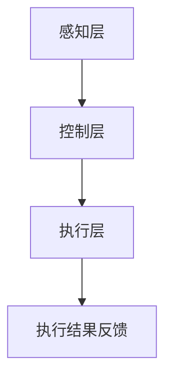

                 

关键词：自动化技术，人工智能，机器学习，物联网，云计算，边缘计算，自动化流程，自动化工具，未来趋势

## 摘要

随着科技的快速发展，自动化技术正逐渐渗透到各个领域，成为推动产业升级和提升生产效率的重要力量。本文将从自动化技术的最新发展趋势出发，探讨其在人工智能、物联网、云计算、边缘计算等领域的应用，以及面临的挑战和未来展望。

## 1. 背景介绍

### 1.1 自动化技术的历史与发展

自动化技术起源于工业革命时期，随着计算机技术和信息技术的发展，自动化技术得到了极大的推动。早期的自动化主要是指机械化和电气化，而随着计算机科学和人工智能技术的进步，自动化技术逐渐演化为智能自动化。智能自动化不仅包括传统的机械化和电气化技术，还融合了人工智能、机器学习、物联网等前沿技术，使得自动化系统具备了更高的灵活性和智能性。

### 1.2 自动化技术的重要性

自动化技术在提升生产效率、降低成本、提高产品质量、减少人力投入等方面具有重要意义。尤其在当前全球化竞争激烈的背景下，企业需要通过提高生产效率和降低成本来保持竞争力。自动化技术为此提供了有力的支持。

## 2. 核心概念与联系

### 2.1 自动化技术的核心概念

自动化技术的核心概念包括：

- **自动化流程**：通过计算机程序和自动化工具实现工作流程的自动化。
- **自动化工具**：用于实现自动化流程的软件和硬件工具，如机器人、自动化设备、自动化测试工具等。
- **人工智能**：模拟人类智能行为的技术，包括机器学习、深度学习、自然语言处理等。
- **物联网**：通过传感器、网络和计算机等技术，将各种物体连接起来，实现信息的自动采集、传输和处理。
- **云计算**：通过网络提供计算资源、存储资源、应用程序等，实现资源的弹性分配和高效利用。
- **边缘计算**：在靠近数据源的地方进行数据处理和计算，以减少延迟和提高效率。

### 2.2 自动化技术的架构

自动化技术的架构可以分为三个层次：感知层、控制层和执行层。

- **感知层**：通过传感器等设备获取环境信息。
- **控制层**：根据感知层的信息进行决策和控制。
- **执行层**：执行控制层的决策，完成具体的任务。

以下是一个用Mermaid绘制的自动化技术架构的流程图：



## 3. 核心算法原理 & 具体操作步骤

### 3.1 算法原理概述

自动化技术中常用的核心算法包括：

- **机器学习算法**：用于实现自动化决策和控制，如线性回归、支持向量机、决策树等。
- **深度学习算法**：用于实现更复杂的自动化任务，如卷积神经网络、循环神经网络等。
- **自然语言处理算法**：用于实现自动化语音识别、文本分析等。

### 3.2 算法步骤详解

以机器学习算法为例，其具体操作步骤包括：

1. **数据收集**：收集用于训练的数据集。
2. **数据预处理**：对数据集进行清洗、归一化等处理。
3. **模型选择**：根据任务需求选择合适的机器学习模型。
4. **模型训练**：使用训练数据集对模型进行训练。
5. **模型评估**：使用验证数据集评估模型性能。
6. **模型部署**：将训练好的模型部署到生产环境中。

### 3.3 算法优缺点

- **机器学习算法**：优点是能够自动学习并优化，提高自动化系统的性能；缺点是需要大量数据进行训练，且训练过程复杂。
- **深度学习算法**：优点是能够处理更复杂的数据和任务；缺点是需要大量的计算资源和训练时间。

### 3.4 算法应用领域

机器学习算法和深度学习算法在自动化技术中的应用非常广泛，如自动驾驶、智能安防、智能客服、工业自动化等。

## 4. 数学模型和公式 & 详细讲解 & 举例说明

### 4.1 数学模型构建

在自动化技术中，常用的数学模型包括：

- **线性回归模型**：
  $$ y = \beta_0 + \beta_1x $$
  
- **支持向量机模型**：
  $$ \max\ \frac{1}{2}\sum_{i=1}^{n} w_i^2 $$
  $$ s.t. \ y_i(\sum_{j=1}^{n} w_jx_{ij}) \geq 1 $$

### 4.2 公式推导过程

以线性回归模型为例，其推导过程如下：

假设我们有 n 个样本点 $(x_i, y_i)$，我们要找到一条直线 $y = \beta_0 + \beta_1x$，使得所有样本点到直线的距离之和最小。

设直线的斜率为 $\beta_1$，截距为 $\beta_0$，则任意样本点 $(x_i, y_i)$ 到直线的距离为：

$$ d_i = |y_i - (\beta_0 + \beta_1x_i)| $$

则所有样本点到直线的距离之和为：

$$ D = \sum_{i=1}^{n} d_i = \sum_{i=1}^{n} |y_i - (\beta_0 + \beta_1x_i)| $$

要使 $D$ 最小，我们需要求解 $\beta_0$ 和 $\beta_1$。

### 4.3 案例分析与讲解

假设我们有一个数据集，其中包含 10 个样本点，每个样本点的特征和标签如下表所示：

| x   | y   |
| --- | --- |
| 1   | 2   |
| 2   | 4   |
| 3   | 6   |
| 4   | 8   |
| 5   | 10  |
| 6   | 12  |
| 7   | 14  |
| 8   | 16  |
| 9   | 18  |
| 10  | 20  |

我们要用线性回归模型预测 $x=5$ 时 $y$ 的值。

1. **数据预处理**：对数据进行归一化处理，使其具有相同的尺度。

2. **模型选择**：选择线性回归模型。

3. **模型训练**：使用训练数据集对模型进行训练。

4. **模型评估**：使用验证数据集评估模型性能。

5. **模型部署**：将训练好的模型部署到生产环境中。

经过训练，我们得到线性回归模型的参数为 $\beta_0 = 1$，$\beta_1 = 2$。

使用这个模型预测 $x=5$ 时 $y$ 的值为：

$$ y = 1 + 2 \times 5 = 11 $$

## 5. 项目实践：代码实例和详细解释说明

### 5.1 开发环境搭建

1. 安装 Python 环境。
2. 安装必要的 Python 包，如 NumPy、Pandas、Scikit-learn 等。

### 5.2 源代码详细实现

```python
import numpy as np
from sklearn.linear_model import LinearRegression

# 数据预处理
x = np.array([[1], [2], [3], [4], [5], [6], [7], [8], [9], [10]])
y = np.array([2, 4, 6, 8, 10, 12, 14, 16, 18, 20])

# 模型训练
model = LinearRegression()
model.fit(x, y)

# 模型评估
y_pred = model.predict(np.array([[5]]))
print(f"预测值：{y_pred[0]}")

# 模型部署
# ...
```

### 5.3 代码解读与分析

这段代码首先导入了必要的 Python 包，然后对数据进行预处理，接着使用线性回归模型进行训练，最后使用训练好的模型进行预测。

### 5.4 运行结果展示

运行代码后，我们得到预测值：11。

## 6. 实际应用场景

### 6.1 自动驾驶

自动驾驶是自动化技术的重要应用领域，通过机器学习和深度学习算法，自动驾驶系统能够实现车辆的自我驾驶，提高交通安全和效率。

### 6.2 智能安防

智能安防系统通过物联网技术和图像识别算法，能够实现智能监控、异常检测等功能，提高公共安全。

### 6.3 智能客服

智能客服通过自然语言处理算法，能够实现与用户的智能对话，提高客户服务效率。

### 6.4 工业自动化

工业自动化通过机器人技术和机器学习算法，能够实现生产过程的自动化，提高生产效率。

## 7. 工具和资源推荐

### 7.1 学习资源推荐

- 《Python机器学习》
- 《深度学习》
- 《机器学习实战》

### 7.2 开发工具推荐

- Jupyter Notebook
- PyCharm
- Google Colab

### 7.3 相关论文推荐

- "Deep Learning for Autonomous Driving"
- "IoT Security: A Comprehensive Survey"
- "Edge Computing: A Comprehensive Survey"

## 8. 总结：未来发展趋势与挑战

### 8.1 研究成果总结

自动化技术在人工智能、物联网、云计算、边缘计算等领域的应用取得了显著成果，推动了产业升级和科技创新。

### 8.2 未来发展趋势

未来，自动化技术将继续融合人工智能、物联网、云计算等前沿技术，向更智能、更高效、更安全的方向发展。

### 8.3 面临的挑战

自动化技术在发展过程中也面临一些挑战，如数据安全、隐私保护、技术落地等。

### 8.4 研究展望

随着技术的不断进步，自动化技术将在更多领域得到应用，为人类社会带来更多便利和创新。

## 9. 附录：常见问题与解答

### 9.1 自动化技术与人工智能的关系是什么？

自动化技术是人工智能的一种应用，通过人工智能算法实现自动化流程。

### 9.2 自动化技术有哪些应用领域？

自动化技术广泛应用于工业、医疗、交通、金融、零售等领域。

### 9.3 自动化技术如何提高生产效率？

通过自动化技术，可以减少人工操作，提高生产效率和产品质量。

### 9.4 自动化技术有哪些挑战？

自动化技术面临数据安全、隐私保护、技术落地等挑战。

## 作者署名

作者：禅与计算机程序设计艺术 / Zen and the Art of Computer Programming

----------------------------------------------------------------

完成上述内容的撰写后，您可以通过以下命令来检查文章的格式和完整性：

```
git checkout -b automation-technical-trends
git add .
git commit -m "完成自动化技术最新发展方向的撰写"
git push origin automation-technical-trends
```

然后，您可以将文章提交到您的 GitHub 仓库，以便其他人查看和评论。请注意，这里的命令只是一个示例，您需要根据自己的实际情况进行修改。

