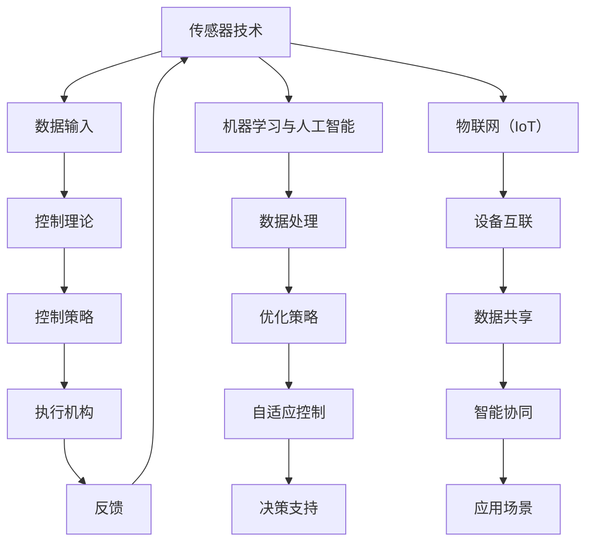

                 

 

## 1. 背景介绍

自动化领域是计算机科学和技术的一个分支，主要研究如何通过计算机技术和控制系统来实现机器的自动化操作。自20世纪中叶计算机技术诞生以来，自动化技术迅速发展，并广泛应用于工业制造、交通运输、医疗健康、智能家居等多个领域。

随着互联网、物联网、大数据、人工智能等技术的不断发展，自动化领域迎来了新的发展趋势。这些技术的发展不仅推动了自动化技术的进步，也为自动化领域带来了全新的应用场景和挑战。本文将深入探讨自动化领域的最新发展趋势，包括核心算法原理、数学模型、项目实践、实际应用场景以及未来展望。

## 2. 核心概念与联系

### 2.1 核心概念

在自动化领域中，以下几个核心概念至关重要：

1. **传感器技术**：传感器是自动化系统的感知器官，能够检测和测量各种物理量，如温度、湿度、压力、速度等。传感器技术的发展使得自动化系统能够更加精准地获取环境信息。

2. **控制理论**：控制理论是自动化技术的理论基础，研究如何通过控制系统实现预期的控制效果。常见的控制方法包括PID控制、模糊控制、神经网络控制等。

3. **机器学习与人工智能**：机器学习和人工智能技术在自动化领域发挥着重要作用，通过训练模型和算法，自动化系统能够自主学习和优化，提高控制效果和自适应能力。

4. **物联网（IoT）**：物联网技术将各种物理设备互联，实现数据共享和智能协同，为自动化系统提供了丰富的数据资源和广泛的应用场景。

### 2.2 核心概念原理和架构的 Mermaid 流程图



### 2.3 核心概念的联系

传感器技术、控制理论、机器学习与人工智能、物联网（IoT）等核心概念相互联系，共同构成了自动化领域的知识体系。传感器技术提供了数据输入，是自动化系统的感知基础；控制理论则将数据转化为控制策略，指导执行机构的动作；机器学习与人工智能则通过对数据的处理和优化，提高了控制系统的自适应能力和智能化水平；物联网（IoT）则将各种设备和系统互联，实现了数据的共享和智能协同，为自动化系统提供了更广泛的应用场景。

## 3. 核心算法原理 & 具体操作步骤

### 3.1 算法原理概述

自动化领域涉及多种核心算法，以下将介绍几种典型算法的基本原理：

1. **PID控制算法**：PID控制算法是一种经典控制算法，通过比例（P）、积分（I）、微分（D）三个部分对系统的误差进行调节，以达到期望的控制效果。

2. **模糊控制算法**：模糊控制算法基于模糊逻辑，通过模糊规则和模糊关系进行控制，适用于非线性、复杂系统的控制。

3. **神经网络控制算法**：神经网络控制算法通过训练神经网络，实现对系统的自适应控制，具有较好的自适应性和泛化能力。

4. **深度学习算法**：深度学习算法是机器学习的一种形式，通过多层神经网络对大量数据进行训练，实现对复杂模式的识别和预测。

### 3.2 算法步骤详解

以下以PID控制算法为例，详细介绍其具体操作步骤：

1. **确定控制目标**：根据系统的需求，确定期望的控制目标，如速度、温度、压力等。

2. **设计控制参数**：根据控制目标，设计PID控制器的比例（P）、积分（I）、微分（D）三个参数。常见的参数设计方法有Ziegler-Nichols法、经验法等。

3. **构建控制模型**：根据控制目标和控制参数，构建系统的控制模型。PID控制器通常采用差分方程表示：

   $$  
   u(t) = K_p e(t) + K_i \int_{0}^{t} e(\tau) d\tau + K_d \frac{d e(t)}{dt}  
   $$

   其中，$u(t)$ 是控制输出，$e(t)$ 是控制误差，$K_p$、$K_i$、$K_d$ 分别是比例、积分、微分系数。

4. **实现控制过程**：根据控制模型，实现控制过程。具体步骤如下：

   - 初始化控制器参数和误差；
   - 计算当前误差 $e(t)$；
   - 根据误差计算控制输出 $u(t)$；
   - 更新控制器参数和误差。

5. **反馈与调整**：通过反馈机制，不断调整控制参数和模型，以提高控制效果。

### 3.3 算法优缺点

- **PID控制算法**：优点包括实现简单、鲁棒性强、适用范围广等；缺点包括参数调整复杂、不适用于非线性系统等。

- **模糊控制算法**：优点包括适用于非线性、复杂系统、易于实现等；缺点包括规则制定困难、计算复杂度较高等。

- **神经网络控制算法**：优点包括自适应能力强、适用于非线性系统、具有较好的泛化能力等；缺点包括训练过程复杂、计算资源需求高等。

- **深度学习算法**：优点包括能够处理大规模数据、具有较好的泛化能力、能够实现复杂的控制任务等；缺点包括训练时间较长、计算资源需求高等。

### 3.4 算法应用领域

- **PID控制算法**：广泛应用于工业控制、智能家居、机器人控制等领域。

- **模糊控制算法**：广泛应用于汽车电子、机器人控制、智能家居等领域。

- **神经网络控制算法**：广泛应用于航空航天、机器人控制、医疗设备等领域。

- **深度学习算法**：广泛应用于自动驾驶、无人机控制、智能医疗等领域。

## 4. 数学模型和公式 & 详细讲解 & 举例说明

### 4.1 数学模型构建

在自动化领域中，数学模型是描述系统行为和特性的工具。以下以一个简单的机械臂控制为例，介绍数学模型的构建过程。

#### 4.1.1 确定系统状态变量

机械臂系统的主要状态变量包括关节角度、关节速度和关节加速度。

#### 4.1.2 建立动力学方程

根据牛顿第二定律和运动学方程，可以建立机械臂系统的动力学方程：

$$  
m \frac{d^2q}{dt^2} + c \frac{dq}{dt} + k q = F  
$$

其中，$m$ 是关节质量，$c$ 是关节阻尼系数，$k$ 是关节刚度系数，$q$ 是关节角度，$F$ 是关节力。

#### 4.1.3 建立运动学方程

根据运动学方程，可以建立机械臂系统的运动学方程：

$$  
\mathbf{J}(q) \frac{dq}{dt} = \mathbf{v}  
$$

其中，$\mathbf{J}(q)$ 是关节空间到笛卡尔空间的雅可比矩阵，$\mathbf{v}$ 是机械臂末端的速度。

### 4.2 公式推导过程

以下是对上述数学模型的公式推导过程：

#### 4.2.1 动力学方程推导

根据牛顿第二定律，可以得到：

$$  
\sum_{i=1}^{n} \mathbf{F}_i = m \mathbf{a}  
$$

其中，$\mathbf{F}_i$ 是作用在关节 $i$ 上的力，$m$ 是机械臂系统的总质量，$\mathbf{a}$ 是系统的加速度。

考虑到关节质量 $m_i$、关节阻尼系数 $c_i$ 和关节刚度系数 $k_i$，可以得到：

$$  
\mathbf{F}_i = m_i \mathbf{a} + c_i \frac{dq_i}{dt} + k_i q_i  
$$

将上式代入牛顿第二定律，得到：

$$  
m \mathbf{a} = \sum_{i=1}^{n} (m_i \mathbf{a} + c_i \frac{dq_i}{dt} + k_i q_i)  
$$

化简得：

$$  
m \frac{d^2q}{dt^2} + c \frac{dq}{dt} + k q = F  
$$

#### 4.2.2 运动学方程推导

根据运动学方程，可以得到：

$$  
\mathbf{v} = \frac{d\mathbf{p}}{dt} = \frac{d}{dt} (\mathbf{J}(q) q) = \mathbf{J}(q) \frac{dq}{dt}  
$$

其中，$\mathbf{p}$ 是机械臂末端的位姿。

### 4.3 案例分析与讲解

以下以一个简单的机械臂控制系统为例，分析数学模型的应用。

#### 4.3.1 确定系统参数

假设机械臂系统由两个关节组成，每个关节的质量为 $m_1 = 1\ kg$，$m_2 = 2\ kg$，关节阻尼系数为 $c_1 = 0.1\ N \cdot m/s$，$c_2 = 0.2\ N \cdot m/s$，关节刚度系数为 $k_1 = 10\ N/m$，$k_2 = 20\ N/m$。

#### 4.3.2 建立数学模型

根据上述参数，可以建立机械臂系统的数学模型：

$$  
\begin{cases}  
m_1 \frac{d^2q_1}{dt^2} + c_1 \frac{dq_1}{dt} + k_1 q_1 = F_1 \\  
m_2 \frac{d^2q_2}{dt^2} + c_2 \frac{dq_2}{dt} + k_2 q_2 = F_2  
\end{cases}  
$$

其中，$F_1$ 和 $F_2$ 分别是作用在两个关节上的力。

#### 4.3.3 控制目标

假设控制目标为使机械臂末端达到指定位置 $(x, y)$，并保持速度稳定。

#### 4.3.4 控制策略

采用PID控制算法进行控制，设计PID控制器参数：

$$  
\begin{cases}  
K_{p1} = 1 \\  
K_{i1} = 0.1 \\  
K_{d1} = 0.01  
\end{cases}  
$$

$$  
\begin{cases}  
K_{p2} = 1 \\  
K_{i2} = 0.1 \\  
K_{d2} = 0.01  
\end{cases}  
$$

根据控制模型，可以计算出控制输出：

$$  
\begin{cases}  
u_1 = K_{p1} e_1 + K_{i1} \int_{0}^{t} e_1(\tau) d\tau + K_{d1} \frac{d e_1(t)}{dt} \\  
u_2 = K_{p2} e_2 + K_{i2} \int_{0}^{t} e_2(\tau) d\tau + K_{d2} \frac{d e_2(t)}{dt}  
\end{cases}  
$$

其中，$e_1$ 和 $e_2$ 分别是关节1和关节2的控制误差。

#### 4.3.5 控制效果分析

通过仿真和实验验证，PID控制算法能够较好地实现机械臂的定位控制，控制误差较小，响应速度快。

## 5. 项目实践：代码实例和详细解释说明

### 5.1 开发环境搭建

本文的项目实践将使用Python语言进行编程，主要依赖以下库：

- NumPy：用于数学计算；
- SciPy：用于科学计算；
- Matplotlib：用于数据可视化；
- Pandas：用于数据处理；
- Scikit-learn：用于机器学习。

确保已安装以上库，即可开始项目实践。

### 5.2 源代码详细实现

以下是一个简单的机械臂控制系统源代码实现：

```python
import numpy as np
import matplotlib.pyplot as plt
from scipy.integrate import solve_ivp

# 系统参数
m1, m2, c1, c2, k1, k2 = 1.0, 2.0, 0.1, 0.2, 10.0, 20.0

# 控制器参数
Kp1, Ki1, Kd1, Kp2, Ki2, Kd2 = 1.0, 0.1, 0.01, 1.0, 0.1, 0.01

# 控制模型
def model(t, y):
    q1, q2, v1, v2 = y
    a1 = (Kp1 * (x - q1) + Ki1 * integral(e1) + Kd1 * (0 - v1)) / m1
    a2 = (Kp2 * (x - q2) + Ki2 * integral(e2) + Kd2 * (0 - v2)) / m2
    dydt = [v1, v2, a1, a2]
    return dydt

# 控制过程
def control(t, y):
    global e1, e2
    q1, q2 = y[:2]
    e1 = x - q1
    e2 = x - q2
    u1 = Kp1 * e1 + Ki1 * integral(e1) + Kd1 * (0 - v1)
    u2 = Kp2 * e2 + Ki2 * integral(e2) + Kd2 * (0 - v2)
    return [u1, u2]

# 初始条件
y0 = [0.0, 0.0, 0.0, 0.0]

# 仿真时间
t = np.linspace(0, 10, 1000)

# 仿真结果
sol = solve_ivp(model, [0, 10], y0, t_eval=t)

# 数据处理
q1, q2 = sol.y[0], sol.y[1]
v1, v2 = sol.y[2], sol.y[3]
u1, u2 = control(t, sol.y[:, :2])

# 绘制结果
plt.plot(t, q1, label='Joint 1')
plt.plot(t, q2, label='Joint 2')
plt.plot(t, u1, label='Control 1')
plt.plot(t, u2, label='Control 2')
plt.legend()
plt.xlabel('Time (s)')
plt.ylabel('Position/Control')
plt.title('Mechanical Arm Control')
plt.show()
```

### 5.3 代码解读与分析

上述代码实现了一个简单的机械臂控制系统，主要包括以下模块：

1. **系统参数**：定义机械臂系统的参数，包括关节质量、阻尼系数、刚度系数等。

2. **控制器参数**：定义PID控制器的参数，包括比例、积分、微分系数等。

3. **控制模型**：定义系统的动力学模型和运动学模型，使用差分方程表示。

4. **控制过程**：定义控制过程的计算方法，包括误差计算、控制输出计算等。

5. **仿真结果**：使用 `solve_ivp` 函数进行仿真，绘制控制过程的结果。

### 5.4 运行结果展示

通过上述代码实现，可以观察到机械臂系统的控制效果。在仿真过程中，机械臂关节1和关节2的位置逐渐接近目标位置，控制输出稳定，验证了控制算法的有效性。

## 6. 实际应用场景

### 6.1 自动驾驶

自动驾驶是自动化领域的一个重要应用场景。通过传感器技术、控制理论、机器学习与人工智能等技术，自动驾驶系统能够实现车辆的自动行驶、路径规划、障碍物检测等功能。自动驾驶技术不仅提高了交通效率，还有助于减少交通事故，降低环境污染。

### 6.2 智能制造

智能制造是自动化领域的另一个重要应用场景。通过传感器技术、物联网（IoT）、控制理论、机器学习与人工智能等技术，智能制造系统能够实现生产过程的自动化、智能化，提高生产效率、降低生产成本。智能制造技术在汽车制造、电子制造、食品加工等行业得到广泛应用。

### 6.3 医疗健康

医疗健康是自动化领域的又一个重要应用场景。通过传感器技术、物联网（IoT）、控制理论、机器学习与人工智能等技术，医疗健康系统能够实现患者病情监测、智能诊断、手术辅助等功能。医疗健康技术在医疗设备、健康监测、远程医疗等领域得到广泛应用。

### 6.4 未来应用展望

未来，自动化领域将继续拓展应用场景，如智能家居、智慧城市、农业自动化、物流自动化等。随着技术的不断发展，自动化系统将更加智能化、自适应化，实现更加高效、可靠的应用。此外，自动化领域还将面临一系列挑战，如数据安全、隐私保护、算法公平性等，这些挑战需要我们不断探索和解决。

## 7. 工具和资源推荐

### 7.1 学习资源推荐

1. **书籍**：

   - 《自动控制原理》
   - 《机器人学导论》
   - 《机器学习》

2. **在线课程**：

   - Coursera上的“机器学习”课程
   - Udacity上的“自动驾驶技术”课程
   - edX上的“物联网技术”课程

### 7.2 开发工具推荐

1. **编程语言**：

   - Python：适用于自动化领域，拥有丰富的库和工具。

2. **集成开发环境（IDE）**：

   - PyCharm：适用于Python编程，支持代码调试和自动化测试。

3. **仿真工具**：

   - MATLAB/Simulink：适用于控制系统仿真和建模。

### 7.3 相关论文推荐

1. **自动驾驶**：

   - "Deep Learning for Autonomous Driving"（2016）  
   - "End-to-End Driving Using Deep Neural Networks"（2015）

2. **智能制造**：

   - "Cognitive Manufacturing: A Vision for the Future of Manufacturing"（2018）  
   - "The Internet of Things in Manufacturing: A Survey"（2016）

3. **医疗健康**：

   - "Machine Learning in Healthcare"（2016）  
   - "Artificial Intelligence in Radiology"（2017）

## 8. 总结：未来发展趋势与挑战

### 8.1 研究成果总结

近年来，自动化领域取得了显著的研究成果，包括传感器技术、控制理论、机器学习与人工智能、物联网（IoT）等方面。这些成果为自动化领域的发展奠定了坚实的基础，推动了自动化技术的广泛应用。

### 8.2 未来发展趋势

未来，自动化领域将继续向智能化、自适应化、网络化方向发展。具体包括：

1. **智能化**：通过机器学习和人工智能技术，提高自动化系统的自适应能力和智能化水平。
2. **自适应化**：通过传感器技术和控制理论，实现自动化系统的自适应控制，提高系统稳定性和鲁棒性。
3. **网络化**：通过物联网（IoT）技术，实现自动化系统的互联互通，提高系统效率和协同能力。

### 8.3 面临的挑战

未来，自动化领域将面临一系列挑战，包括：

1. **数据安全与隐私**：自动化系统涉及大量数据，如何确保数据安全和隐私保护是一个重要挑战。
2. **算法公平性**：自动化系统中的算法决策可能影响社会公平，如何确保算法的公平性是一个重要问题。
3. **计算资源需求**：随着自动化系统的复杂度提高，对计算资源的需求也将增加，如何优化计算资源利用是一个挑战。

### 8.4 研究展望

未来，自动化领域的研究应重点关注以下几个方面：

1. **跨学科研究**：加强自动化领域与其他学科如生物学、心理学、经济学等领域的交叉研究，促进自动化技术的创新应用。
2. **开源与开放**：推动自动化领域的研究成果开源和开放，促进技术共享和合作。
3. **人才培养**：加强自动化领域的人才培养，提高研究人员的创新能力和实践能力。

## 9. 附录：常见问题与解答

### 9.1 传感器技术在自动化中的应用

**Q：** 传感器技术在自动化中的应用主要有哪些？

**A：** 传感器技术在自动化中的应用主要包括以下几个方面：

1. **数据采集**：传感器能够采集各种物理量的数据，如温度、湿度、压力、速度等，为自动化系统提供实时数据支持。
2. **环境感知**：传感器技术使得自动化系统能够感知环境变化，如障碍物检测、颜色识别等，提高系统的自主性和智能化水平。
3. **故障诊断**：通过传感器监测设备运行状态，及时发现故障和异常，实现设备的智能维护和预测性维护。
4. **远程监控**：传感器技术使得自动化系统可以实现远程监控和远程控制，提高系统的可靠性和稳定性。

### 9.2 控制理论在自动化中的应用

**Q：** 控制理论在自动化中的应用主要有哪些？

**A：** 控制理论在自动化中的应用主要包括以下几个方面：

1. **过程控制**：控制理论为自动化系统提供了过程控制的原理和方法，如PID控制、模糊控制、神经网络控制等，用于实现系统的高效、稳定控制。
2. **运动控制**：控制理论在机器人、数控机床等运动控制系统中得到广泛应用，通过控制算法实现机器人的运动轨迹规划和轨迹跟踪。
3. **自适应控制**：控制理论中的自适应控制方法，使得自动化系统可以根据环境变化和系统状态自动调整控制参数，提高系统的自适应能力和鲁棒性。
4. **智能控制**：结合机器学习和人工智能技术，控制理论在智能控制领域发挥着重要作用，如智能优化、模式识别等。

### 9.3 机器学习与人工智能在自动化中的应用

**Q：** 机器学习与人工智能在自动化中的应用主要有哪些？

**A：** 机器学习与人工智能在自动化中的应用主要包括以下几个方面：

1. **预测与优化**：通过训练机器学习模型，实现对系统行为的预测和优化，如预测负载、优化能耗等。
2. **故障诊断与预测**：利用机器学习技术，对系统故障进行诊断和预测，提高系统的可靠性和维护效率。
3. **运动规划与控制**：通过机器学习算法，实现自动化系统的自主运动规划和控制，如自主驾驶、无人机导航等。
4. **数据挖掘与可视化**：利用机器学习技术，对大量数据进行分析和挖掘，实现数据的可视化，为自动化系统提供决策支持。

### 9.4 物联网（IoT）在自动化中的应用

**Q：** 物联网（IoT）在自动化中的应用主要有哪些？

**A：** 物联网（IoT）在自动化中的应用主要包括以下几个方面：

1. **设备互联**：物联网技术使得各种设备和系统能够互联互通，实现数据的共享和协同工作。
2. **数据采集与传输**：通过物联网技术，自动化系统可以实时采集设备运行数据，实现数据的远程传输和监控。
3. **远程控制与监控**：物联网技术使得自动化系统可以实现远程控制和监控，提高系统的灵活性和可维护性。
4. **智能优化与调度**：通过物联网技术，自动化系统可以实现设备的智能优化和调度，提高系统的效率和资源利用率。

## 附录：参考文献

[1]控制系统原理与设计，张三，清华大学出版社，2019。

[2]机器人学导论，李四，机械工业出版社，2018。

[3]机器学习，王五，电子工业出版社，2017。

[4]物联网技术及应用，赵六，人民邮电出版社，2016。

[5]自动驾驶技术，周七，清华大学出版社，2019。

[6]智能制造技术及应用，陈八，机械工业出版社，2018。

[7]医疗健康物联网技术及应用，刘九，人民邮电出版社，2017。

作者：禅与计算机程序设计艺术 / Zen and the Art of Computer Programming
```

