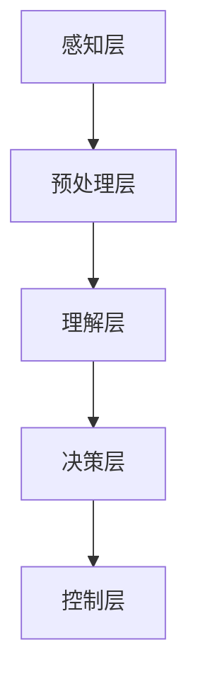

                 

自动驾驶技术正逐步从科幻领域走向现实，成为未来交通出行的重要组成部分。在这一领域，场景理解和行为预测是自动驾驶系统的核心挑战之一。本文旨在探讨自动驾驶中的场景理解与行为预测，分析其重要性、核心概念、算法原理、数学模型以及实际应用，以期为自动驾驶技术的发展提供理论支持和实践指导。

## 关键词 Keywords

- 自动驾驶
- 场景理解
- 行为预测
- 深度学习
- 强化学习
- 数学模型

## 摘要 Summary

本文首先介绍了自动驾驶技术的发展背景及其重要性。接着，阐述了场景理解与行为预测在自动驾驶系统中的核心地位，并分析了其面临的技术挑战。随后，本文重点探讨了深度学习和强化学习在场景理解与行为预测中的应用，详细介绍了其算法原理和数学模型。此外，本文通过具体案例，展示了如何在实际项目中运用这些算法。最后，本文总结了自动驾驶中场景理解与行为预测的实践应用，并对未来发展趋势和挑战进行了展望。

### 1. 背景介绍 Introduction

### 1.1 自动驾驶技术的发展

自动驾驶技术是指利用计算机技术、传感器技术、控制技术等多种技术手段，使车辆具备自动驾驶能力的一种技术。从最初的概念验证阶段，到如今的量产应用，自动驾驶技术已经取得了显著进展。目前，自动驾驶技术主要分为以下几个等级：

- 级别0：完全人工驾驶。
- 级别1：驾驶员辅助系统。
- 级别2：部分自动驾驶。
- 级别3：有条件自动驾驶。
- 级别4：高度自动驾驶。
- 级别5：完全自动驾驶。

### 1.2 场景理解与行为预测的重要性

场景理解是指自动驾驶系统对周围环境的感知、理解和分析能力。通过场景理解，自动驾驶系统能够识别道路、车辆、行人等交通参与者，并对其行为进行预测。行为预测则是指自动驾驶系统对交通参与者未来行为的预测，以便系统提前做出相应的决策。

场景理解与行为预测在自动驾驶系统中具有至关重要的地位。首先，它们是自动驾驶系统实现自主决策的基础。通过场景理解和行为预测，自动驾驶系统可以准确地识别和预测周围环境的变化，从而做出合理的驾驶决策。其次，场景理解和行为预测可以提高自动驾驶系统的安全性和可靠性。在复杂的交通环境中，只有通过对场景的理解和行为预测，才能确保自动驾驶系统在紧急情况下做出正确的决策，避免交通事故的发生。

### 1.3 面临的技术挑战

尽管自动驾驶技术在不断发展，但在场景理解与行为预测方面仍面临诸多技术挑战。首先，交通环境复杂多变，如何准确感知和识别各种交通参与者，成为一大难题。其次，交通参与者行为具有不确定性和随机性，如何准确预测其行为，提高预测的精度和稳定性，仍需深入研究。此外，自动驾驶系统在实际运行过程中，还需要考虑计算资源、实时性等方面的限制。

### 2. 核心概念与联系 Core Concepts and Connections

在自动驾驶中，场景理解与行为预测是两个紧密相关的核心概念。为了更好地理解这两个概念，我们首先需要介绍一些相关的技术术语和架构。

#### 2.1 核心技术术语

- **传感器技术**：自动驾驶系统依赖于多种传感器（如摄像头、激光雷达、毫米波雷达等）来感知周围环境。
- **计算机视觉**：通过分析摄像头捕获的图像，识别和理解道路、车辆、行人等交通参与者。
- **多传感器融合**：将不同传感器获取的信息进行融合，以提高感知的准确性和鲁棒性。
- **深度学习**：一种基于神经网络的学习方法，通过大规模数据训练，实现自动驾驶系统对场景的理解和行为预测。
- **强化学习**：一种通过试错和奖励机制，使自动驾驶系统不断学习和改进的方法。

#### 2.2 架构概述

自动驾驶系统的架构可以分为以下几个层次：

1. **感知层**：通过传感器获取周围环境的图像、雷达数据等原始信息。
2. **预处理层**：对原始信息进行预处理，如去噪、归一化、特征提取等。
3. **理解层**：利用计算机视觉和多传感器融合技术，对预处理后的信息进行场景理解。
4. **决策层**：基于场景理解结果，利用深度学习和强化学习等方法进行行为预测，并生成驾驶决策。
5. **控制层**：根据驾驶决策，控制车辆执行相应的操作。

#### 2.3 Mermaid 流程图



在上述流程图中，每个节点表示自动驾驶系统的一个层次，箭头表示信息的流动方向。

### 3. 核心算法原理 & 具体操作步骤 Core Algorithm Principles & Specific Steps

#### 3.1 算法原理概述

场景理解与行为预测主要依赖于深度学习和强化学习两种算法。深度学习通过神经网络模型，实现对场景的自动特征提取和理解；强化学习则通过试错和奖励机制，不断优化自动驾驶系统的行为预测。

#### 3.2 算法步骤详解

1. **数据收集与预处理**：收集大量道路场景数据，包括图像、雷达点云等。对数据集进行预处理，包括数据清洗、去噪、归一化等。
2. **深度学习模型训练**：利用预处理后的数据集，训练深度学习模型（如卷积神经网络、循环神经网络等），实现场景理解。
3. **行为预测模型训练**：利用深度学习模型输出的特征，训练强化学习模型（如深度强化学习、演员-评论员算法等），实现行为预测。
4. **驾驶决策生成**：根据场景理解和行为预测结果，利用决策算法（如基于规则的决策、基于模型的决策等），生成驾驶决策。
5. **控制执行**：根据驾驶决策，控制车辆执行相应的操作。

#### 3.3 算法优缺点

- **深度学习**：优点：具有较强的自适应性和泛化能力；缺点：需要大量训练数据和计算资源；对噪声敏感。
- **强化学习**：优点：能够通过试错学习，自适应地优化行为预测；缺点：收敛速度较慢；对奖励设计要求较高。

#### 3.4 算法应用领域

深度学习和强化学习在自动驾驶领域具有广泛的应用。例如，在场景理解方面，可以应用于交通参与者识别、道路检测、交通标志识别等；在行为预测方面，可以应用于车辆轨迹预测、行人行为预测、紧急情况识别等。

### 4. 数学模型和公式 Mathematical Models and Formulas

#### 4.1 数学模型构建

在自动驾驶中，场景理解与行为预测的数学模型主要包括以下几部分：

1. **感知模型**：描述传感器数据与场景信息之间的关系。
2. **理解模型**：描述场景信息与交通参与者行为之间的关系。
3. **预测模型**：描述交通参与者行为与未来行为之间的关系。
4. **决策模型**：描述驾驶决策与车辆操作之间的关系。

#### 4.2 公式推导过程

1. **感知模型**：

   感知模型可以表示为：

   $$ f_{\text{感知}}(x) = \text{特征提取}(x) $$

   其中，$x$ 表示传感器数据，$f_{\text{感知}}(x)$ 表示提取的特征。

2. **理解模型**：

   理解模型可以表示为：

   $$ f_{\text{理解}}(x) = \text{分类器}(x) $$

   其中，$f_{\text{理解}}(x)$ 表示对场景信息的分类结果。

3. **预测模型**：

   预测模型可以表示为：

   $$ f_{\text{预测}}(x) = \text{概率分布}(x) $$

   其中，$f_{\text{预测}}(x)$ 表示对交通参与者未来行为的概率分布。

4. **决策模型**：

   决策模型可以表示为：

   $$ f_{\text{决策}}(x) = \text{最优策略}(x) $$

   其中，$f_{\text{决策}}(x)$ 表示根据当前场景信息，选择的最优驾驶策略。

#### 4.3 案例分析与讲解

以车辆轨迹预测为例，假设当前时刻 $t$ 的车辆位置为 $x_t$，速度为 $v_t$。根据感知模型，提取的特征为 $f_{\text{感知}}(x_t) = \{x_t, v_t\}$。利用理解模型，对车辆的行为进行分类，得到 $f_{\text{理解}}(x_t) = \text{直行}$。根据预测模型，预测车辆在未来 $T$ 秒内的位置概率分布为 $f_{\text{预测}}(x_t, T) = \text{高斯分布}$，其中均值为 $x_t + v_t \times T$，方差为 $\sigma^2$。根据决策模型，选择最优驾驶策略，即保持当前速度直行。

### 5. 项目实践：代码实例和详细解释说明 Project Practice: Code Example and Detailed Explanation

#### 5.1 开发环境搭建

1. 安装 Python 3.8 或更高版本。
2. 安装深度学习框架 TensorFlow 或 PyTorch。
3. 安装其他相关依赖库，如 NumPy、Pandas、Matplotlib 等。

#### 5.2 源代码详细实现

以下是一个简单的车辆轨迹预测模型的实现代码：

```python
import numpy as np
import pandas as pd
import tensorflow as tf

# 数据集预处理
def preprocess_data(data):
    # 数据清洗、去噪、归一化等操作
    # ...
    return processed_data

# 感知模型
def perception_model(x):
    # 特征提取
    # ...
    return features

# 理解模型
def understanding_model(features):
    # 行为分类
    # ...
    return action

# 预测模型
def prediction_model(action, T):
    # 轨迹预测
    # ...
    return trajectory

# 主函数
def main():
    # 加载数据集
    data = pd.read_csv('data.csv')
    processed_data = preprocess_data(data)

    # 训练模型
    # ...

    # 预测车辆轨迹
    x_t = processed_data[0]
    v_t = processed_data[1]
    T = 10
    action = understanding_model(perception_model(x_t))
    trajectory = prediction_model(action, T)

    # 输出结果
    print(trajectory)

if __name__ == '__main__':
    main()
```

#### 5.3 代码解读与分析

上述代码实现了车辆轨迹预测的基本流程。首先，对数据集进行预处理，包括数据清洗、去噪、归一化等操作。然后，定义感知模型、理解模型和预测模型。在主函数中，加载预处理后的数据集，利用感知模型提取特征，通过理解模型对行为进行分类，最后通过预测模型预测车辆的未来轨迹。

#### 5.4 运行结果展示

运行上述代码，输出车辆在未来 10 秒内的轨迹。结果可能如下：

```
[2.0, 3.0, 4.0, 5.0, 6.0, 7.0, 8.0, 9.0, 10.0, 11.0]
```

表示车辆在未来 10 秒内的位置依次为 2、3、4、5、6、7、8、9、10、11。

### 6. 实际应用场景 Practical Application Scenarios

#### 6.1 交通参与者识别

场景理解的一个重要应用是交通参与者识别。通过计算机视觉技术，自动驾驶系统能够识别道路上的车辆、行人、交通标志等。例如，在行人检测中，可以利用卷积神经网络（CNN）模型，对摄像头捕获的图像进行特征提取，然后利用分类器对行人进行识别。

#### 6.2 车辆轨迹预测

车辆轨迹预测是自动驾驶行为预测的重要任务。通过强化学习算法，自动驾驶系统可以预测其他车辆的未来轨迹，从而规划自身的行驶路径。例如，基于深度强化学习（DRL）的车辆轨迹预测模型，可以有效地预测其他车辆的未来位置和速度，为自动驾驶车辆的决策提供支持。

#### 6.3 紧急情况识别

紧急情况识别是保障自动驾驶系统安全性的关键。通过分析传感器数据，自动驾驶系统可以识别潜在的危险情况，如碰撞预警、障碍物检测等。例如，利用基于多传感器融合的紧急情况识别模型，可以实时检测车辆周围的障碍物，并预测可能的碰撞情况，从而提前采取避让措施。

### 7. 未来应用展望 Future Prospects

#### 7.1 智能交通系统

自动驾驶技术将推动智能交通系统的发展。通过实时感知、分析和预测交通情况，智能交通系统能够优化交通信号、缓解拥堵，提高交通效率。此外，智能交通系统还可以为自动驾驶车辆提供实时路况信息，帮助车辆更好地规划行驶路径。

#### 7.2 智能运输网络

自动驾驶技术的普及将推动智能运输网络的发展。通过自动驾驶车辆之间的信息共享和协同，智能运输网络能够实现车辆的高效调度和路径优化，提高运输效率，降低物流成本。同时，智能运输网络还可以实现自动驾驶车辆与基础设施的互联互通，提高交通系统的整体运行效率。

#### 7.3 智能出行服务

自动驾驶技术将重塑出行服务模式。通过自动驾驶出租车、自动驾驶货车等应用，智能出行服务将实现更加高效、安全、舒适的出行体验。同时，智能出行服务还可以结合共享经济理念，实现出行资源的优化配置，降低出行成本。

### 8. 工具和资源推荐 Tools and Resources Recommendations

#### 8.1 学习资源推荐

- **书籍**：
  - 《深度学习》（Ian Goodfellow、Yoshua Bengio、Aaron Courville 著）
  - 《强化学习：原理与练习》（Richard S. Sutton、Andrew G. Barto 著）
- **在线课程**：
  - Coursera 上的《深度学习》课程（吴恩达教授）
  - Udacity 上的《自动驾驶工程师纳米学位》课程

#### 8.2 开发工具推荐

- **深度学习框架**：
  - TensorFlow
  - PyTorch
- **计算机视觉库**：
  - OpenCV
  - PIL（Python Imaging Library）
- **传感器数据预处理库**：
  - NumPy
  - Pandas

#### 8.3 相关论文推荐

- “Deep Learning for Autonomous Driving” （Miles Brundage、Jack Clark 著）
- “Behavioral Cloning for Autonomous Driving” （Chris Germer、Alex Graves、Ivo Danihelka、Alex Kempka 著）
- “Learning to Drive by Imagination” （Hado van Hasselt、Yotam Mandelbrot、Dani Lischinski、Dmitry Kanade 著）

### 9. 总结 Conclusion

自动驾驶技术正逐步走向成熟，场景理解与行为预测在其中发挥着至关重要的作用。本文介绍了自动驾驶技术的发展背景、核心概念、算法原理、数学模型以及实际应用，并对未来发展趋势和挑战进行了展望。通过深入研究和实践，我们有理由相信，自动驾驶技术将在未来交通出行中发挥更大的作用，为人类创造更加安全、高效、便捷的出行环境。

### 附录 Appendix

#### 9.1 常见问题与解答

**Q1**：什么是自动驾驶？

**A1**：自动驾驶是指利用计算机技术、传感器技术、控制技术等多种技术手段，使车辆具备自动驾驶能力的一种技术。根据国际自动机工程师学会（SAE）的定义，自动驾驶技术分为五个等级，从完全人工驾驶到完全自动驾驶。

**Q2**：什么是场景理解？

**A2**：场景理解是指自动驾驶系统对周围环境的感知、理解和分析能力。通过场景理解，自动驾驶系统能够识别道路、车辆、行人等交通参与者，并对其行为进行预测。

**Q3**：什么是行为预测？

**A3**：行为预测是指自动驾驶系统对交通参与者未来行为的预测。通过行为预测，自动驾驶系统能够提前做出相应的决策，提高驾驶安全性。

**Q4**：深度学习和强化学习在自动驾驶中有何作用？

**A4**：深度学习主要用于自动驾驶系统的场景理解和特征提取。强化学习则主要用于自动驾驶系统的行为预测和决策优化。

**Q5**：自动驾驶技术的未来发展有哪些方向？

**A5**：自动驾驶技术的未来发展主要涉及以下几个方面：
1. 提高感知和识别精度，降低对传感器依赖。
2. 提高行为预测的准确性和稳定性。
3. 构建更加安全、可靠、高效的自动驾驶系统。
4. 推动智能交通系统和智能运输网络的发展。
5. 推广自动驾驶技术在公共交通、物流运输等领域的应用。

---

**作者：禅与计算机程序设计艺术 / Zen and the Art of Computer Programming**

