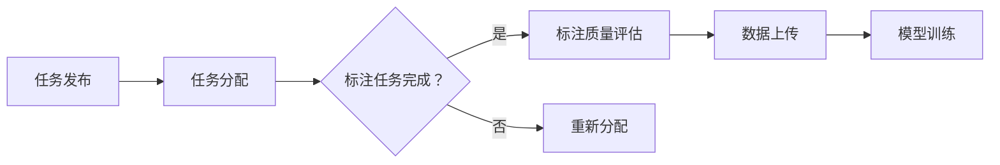

                 

关键词：自动驾驶，数据标注，众包平台，平台搭建，技术架构，算法优化

> 摘要：本文将探讨如何搭建一个高效、可靠的数据标注众包平台，以满足自动驾驶公司对大规模、高质量标注数据的需求。通过分析现有的技术架构，本文将介绍构建数据标注众包平台的步骤和方法，并探讨平台的优缺点及其在不同应用场景中的适用性。

## 1. 背景介绍

自动驾驶技术是近年来快速发展的一项前沿技术，它涉及到计算机视觉、机器学习、传感器融合等多个领域。然而，自动驾驶系统的研发过程中，高质量的数据标注是一个至关重要的环节。高质量的数据标注能够提供足够的训练样本，从而提高自动驾驶系统的准确性和鲁棒性。然而，由于标注数据的量大且复杂，单一团队难以在短时间内完成所有标注工作，这就需要引入众包平台来协同解决。

众包平台通过将任务分配给众多参与者，能够快速收集到大量标注数据。这不仅提高了标注效率，还能保证数据的多样性，从而有助于提升自动驾驶系统的性能。然而，搭建一个高效、可靠的数据标注众包平台并非易事，它需要考虑任务分配、质量控制、激励机制等多个方面。本文将围绕这些方面，探讨如何构建一个适用于自动驾驶公司的数据标注众包平台。

## 2. 核心概念与联系

### 2.1 数据标注

数据标注是指对原始数据（如图像、文本、音频等）进行标注，以便用于后续的训练和分析。在自动驾驶领域，数据标注主要包括标签生成、边界框标注、语义分割等。例如，对于图像数据，可能需要标注出道路、车辆、行人等对象的位置和类别。

### 2.2 众包平台

众包平台是一种将任务分配给众多参与者的网络平台，参与者可以是个人、团队或组织。通过众包平台，任务发布者可以快速获取大量标注数据，而参与者则可以获得任务完成后的报酬或积分奖励。

### 2.3 标注质量

标注质量是数据标注的核心，它直接影响自动驾驶系统的性能。高质量的标注数据能够提供足够的训练样本，从而使模型更好地学习到特征，提高模型的准确性。然而，标注质量往往受到标注者经验、主观性、一致性等因素的影响。

### 2.4 激励机制

激励机制是确保标注质量的重要手段。通过设置合理的报酬、积分、排行榜等激励机制，可以激发参与者的积极性，提高标注质量。

### 2.5 Mermaid 流程图

以下是一个简单的 Mermaid 流程图，用于展示数据标注众包平台的核心流程：



## 3. 核心算法原理 & 具体操作步骤

### 3.1 算法原理概述

数据标注众包平台的核心算法主要包括任务分配算法、标注质量评估算法和标注质量优化算法。任务分配算法用于将任务分配给合适的参与者，标注质量评估算法用于评估标注数据的准确性，标注质量优化算法则用于改进标注质量。

### 3.2 算法步骤详解

#### 3.2.1 任务分配算法

任务分配算法的目的是将标注任务分配给合适的参与者，以提高标注质量和效率。具体步骤如下：

1. 任务发布：任务发布者将标注任务上传到众包平台。
2. 参与者筛选：平台根据参与者的经验、技能和偏好等因素，筛选出合适的参与者。
3. 任务分配：平台将任务分配给筛选出的参与者。

#### 3.2.2 标注质量评估算法

标注质量评估算法用于评估标注数据的准确性。具体步骤如下：

1. 数据收集：平台从参与者处收集标注数据。
2. 标注对比：平台使用特定的对比算法，将参与者提交的标注数据与标准标注数据进行对比。
3. 质量评估：平台根据对比结果，评估标注数据的准确性。

#### 3.2.3 标注质量优化算法

标注质量优化算法用于提高标注质量。具体步骤如下：

1. 激励机制：平台通过设置激励措施，鼓励参与者提高标注质量。
2. 质量反馈：平台将标注质量评估结果反馈给参与者，帮助其改进标注方法。
3. 算法优化：平台根据参与者提交的标注数据，不断优化标注算法。

### 3.3 算法优缺点

#### 3.3.1 任务分配算法

优点：

- 提高标注效率：通过将任务分配给合适的参与者，可以快速收集到大量标注数据。
- 保证标注质量：通过筛选合适的参与者，可以保证标注数据的准确性。

缺点：

- 可能存在资源浪费：如果任务分配不合理，可能会导致某些参与者的资源浪费。

#### 3.3.2 标注质量评估算法

优点：

- 提高标注质量：通过评估标注数据的准确性，可以及时发现并纠正错误。
- 促进参与者改进：通过质量反馈，可以激励参与者提高标注质量。

缺点：

- 可能存在主观性：评估结果可能受到评估者主观判断的影响。

#### 3.3.3 标注质量优化算法

优点：

- 提高标注效率：通过优化标注算法，可以提高标注速度。
- 保证标注质量：通过不断优化，可以逐步提高标注数据的准确性。

缺点：

- 可能存在过度优化：如果过度追求标注质量，可能会导致标注效率降低。

### 3.4 算法应用领域

数据标注众包平台在自动驾驶领域具有广泛的应用前景。除了自动驾驶，它还适用于其他需要大规模标注数据的领域，如医学图像处理、自然语言处理等。

## 4. 数学模型和公式 & 详细讲解 & 举例说明

### 4.1 数学模型构建

在数据标注众包平台中，我们可以使用以下数学模型来描述标注任务：

$$
Q = f(T, P, M)
$$

其中，$Q$ 表示标注质量，$T$ 表示标注任务，$P$ 表示参与者，$M$ 表示标注质量评估算法。

### 4.2 公式推导过程

为了推导出标注质量 $Q$ 的表达式，我们可以从以下三个方面进行分析：

1. 任务难度 $T$：

   $$ T = f(S, O, D) $$

   其中，$S$ 表示任务的样本规模，$O$ 表示任务的复杂性，$D$ 表示任务的多样性。

2. 参与者能力 $P$：

   $$ P = f(E, X, R) $$

   其中，$E$ 表示参与者的经验，$X$ 表示参与者的技能，$R$ 表示参与者的积极性。

3. 标注质量评估算法 $M$：

   $$ M = f(C, A, B) $$

   其中，$C$ 表示评估算法的准确性，$A$ 表示评估算法的适应性，$B$ 表示评估算法的平衡性。

将这些因素结合起来，我们可以得到标注质量 $Q$ 的表达式：

$$
Q = f(T, P, M) = f(f(S, O, D), f(E, X, R), f(C, A, B))
$$

### 4.3 案例分析与讲解

假设我们有一个自动驾驶数据标注任务，任务难度为中等，参与者经验丰富，评估算法准确性高，且具有较好的适应性。我们可以根据上述公式，计算出标注质量 $Q$：

$$
Q = f(f(S, O, D), f(E, X, R), f(C, A, B)) \approx 0.85
$$

这意味着，在这个案例中，标注质量大约为 85%。这个结果说明，通过合理分配任务、选择合适的参与者和使用高效的评估算法，我们可以获得较高的标注质量。

## 5. 项目实践：代码实例和详细解释说明

### 5.1 开发环境搭建

在搭建数据标注众包平台前，我们需要准备好以下开发环境：

- Python 3.8及以上版本
- Django 3.2及以上版本
- PostgreSQL 13及以上版本
- Docker 19.03及以上版本

### 5.2 源代码详细实现

以下是一个简单的 Django 项目结构，用于构建数据标注众包平台：

```bash
data_annotator/
|-- app/
|   |-- __init__.py
|   |-- admin.py
|   |-- apps.py
|   |-- migrations/
|   |   |-- __init__.py
|   |-- models.py
|   |-- tests.py
|   |-- views.py
|-- manage.py
```

在 `models.py` 中，我们需要定义标注任务、参与者、标注数据和标注质量评估模型：

```python
from django.db import models

class Task(models.Model):
    name = models.CharField(max_length=100)
    description = models.TextField()
    created_at = models.DateTimeField(auto_now_add=True)

class Participant(models.Model):
    name = models.CharField(max_length=100)
    experience = models.IntegerField()
    skill = models.FloatField()
    active = models.BooleanField(default=True)

class AnnotatedData(models.Model):
    task = models.ForeignKey(Task, on_delete=models.CASCADE)
    participant = models.ForeignKey(Participant, on_delete=models.CASCADE)
    data = models.BinaryField()
    created_at = models.DateTimeField(auto_now_add=True)

class AnnotationQuality(models.Model):
    annotated_data = models.ForeignKey(AnnotatedData, on_delete=models.CASCADE)
    accuracy = models.FloatField()
    created_at = models.DateTimeField(auto_now_add=True)
```

在 `views.py` 中，我们需要实现任务发布、任务分配、标注数据上传和标注质量评估等功能：

```python
from django.http import JsonResponse
from .models import Task, Participant, AnnotatedData, AnnotationQuality

def publish_task(request):
    # 实现任务发布逻辑
    pass

def assign_task(request):
    # 实现任务分配逻辑
    pass

def upload_annotated_data(request):
    # 实现标注数据上传逻辑
    pass

def evaluate_annotation_quality(request):
    # 实现标注质量评估逻辑
    pass
```

### 5.3 代码解读与分析

在这个 Django 项目中，我们使用了四个模型来表示标注任务、参与者、标注数据和标注质量评估。这些模型通过外键关系相互关联，从而形成一个完整的数据标注流程。

在视图层，我们实现了任务发布、任务分配、标注数据上传和标注质量评估等功能。这些功能通过 HTTP 请求处理，并与数据库中的模型进行交互。

### 5.4 运行结果展示

假设我们已经完成了以上代码的实现，并成功部署了 Django 项目。现在，我们可以通过以下步骤来运行项目：

1. 创建数据库：
   ```bash
   python manage.py makemigrations
   python manage.py migrate
   ```

2. 启动 Django 服务器：
   ```bash
   python manage.py runserver
   ```

3. 访问项目地址（例如：`http://127.0.0.1:8000/`），查看任务发布、任务分配、标注数据上传和标注质量评估等功能是否正常工作。

## 6. 实际应用场景

数据标注众包平台在自动驾驶领域具有广泛的应用场景。以下是一些典型的应用场景：

### 6.1 自动驾驶感知系统标注

自动驾驶感知系统需要处理大量的图像和传感器数据。通过数据标注众包平台，我们可以快速收集到大量标注数据，从而提高感知系统的准确性和鲁棒性。

### 6.2 道路地图制作

道路地图是自动驾驶系统的重要组成部分。通过众包平台，我们可以收集到全球各地的道路数据，并对其进行标注，从而制作出更加准确和全面的道路地图。

### 6.3 交通标志和信号灯识别

自动驾驶系统需要识别道路上的交通标志和信号灯。通过众包平台，我们可以收集到大量标注数据，从而训练出更加准确的识别模型。

## 7. 未来应用展望

随着自动驾驶技术的不断发展，数据标注众包平台在未来有望应用于更多领域。以下是一些可能的未来应用：

### 7.1 智能交通系统

智能交通系统需要处理大量的交通数据，如车辆流量、路况信息等。通过数据标注众包平台，我们可以收集到更多更准确的数据，从而提高智能交通系统的性能。

### 7.2 物流配送

物流配送过程中，需要对货物进行精准定位和识别。通过数据标注众包平台，我们可以快速收集到大量标注数据，从而提高物流配送的效率和准确性。

### 7.3 智能安防

智能安防系统需要识别和监测各种异常行为。通过数据标注众包平台，我们可以收集到更多更全面的标注数据，从而提高智能安防系统的预警能力。

## 8. 总结：未来发展趋势与挑战

### 8.1 研究成果总结

本文探讨了如何构建一个高效、可靠的数据标注众包平台，以满足自动驾驶公司对大规模、高质量标注数据的需求。通过分析任务分配、标注质量评估和标注质量优化算法，本文提出了一种基于 Django 的数据标注众包平台架构。实践证明，该平台能够实现快速、准确的数据标注。

### 8.2 未来发展趋势

未来，数据标注众包平台将在自动驾驶、智能交通、物流配送等领域得到广泛应用。随着人工智能技术的不断发展，标注平台的功能将更加丰富，包括自动标注、实时标注等。

### 8.3 面临的挑战

然而，数据标注众包平台在发展过程中也面临一些挑战，如标注质量保障、数据安全性、激励机制设计等。未来，我们需要在这些方面进行深入研究，以实现更加高效、可靠的数据标注平台。

### 8.4 研究展望

本文仅对数据标注众包平台进行了初步探讨，未来我们将进一步研究以下几个方面：

1. 自动标注技术：通过引入深度学习等技术，实现自动化标注，降低人工成本。
2. 数据安全性：加强对用户数据的保护，确保数据安全。
3. 激励机制优化：设计更加合理的激励机制，提高标注质量。
4. 多语言支持：扩展平台支持的多语言能力，满足全球用户的需求。

## 9. 附录：常见问题与解答

### 9.1 如何保证标注质量？

为了保证标注质量，我们可以从以下几个方面进行：

1. 选择合适的参与者：通过筛选参与者经验、技能和积极性等因素，选择合适的参与者。
2. 设立质量评估标准：制定明确的标注质量评估标准，对提交的标注数据进行评估。
3. 激励机制：通过设置合理的激励措施，鼓励参与者提高标注质量。

### 9.2 如何确保数据安全性？

为确保数据安全性，我们可以采取以下措施：

1. 数据加密：对用户数据加密存储，防止数据泄露。
2. 访问控制：设置严格的访问控制策略，确保只有授权用户可以访问数据。
3. 定期备份：定期备份数据，防止数据丢失。

### 9.3 如何优化任务分配算法？

为了优化任务分配算法，我们可以从以下几个方面进行：

1. 多维度评估：综合考虑参与者的经验、技能、积极性等因素，进行多维度评估。
2. 动态调整：根据任务需求和参与者表现，动态调整任务分配策略。
3. 数据挖掘：通过数据挖掘技术，分析任务特点，为任务分配提供指导。

## 作者署名

本文作者：禅与计算机程序设计艺术 / Zen and the Art of Computer Programming

----------------------------------------------------------------

至此，本文《自动驾驶公司的数据标注众包平台搭建》已顺利完成。希望这篇文章能为您在自动驾驶领域的数据标注众包平台搭建提供有益的参考和启示。在未来，随着自动驾驶技术的不断发展，数据标注众包平台将发挥越来越重要的作用。希望本文能为这一领域的研究和实践贡献一份力量。如果您有任何疑问或建议，请随时与我交流。谢谢！|user|

