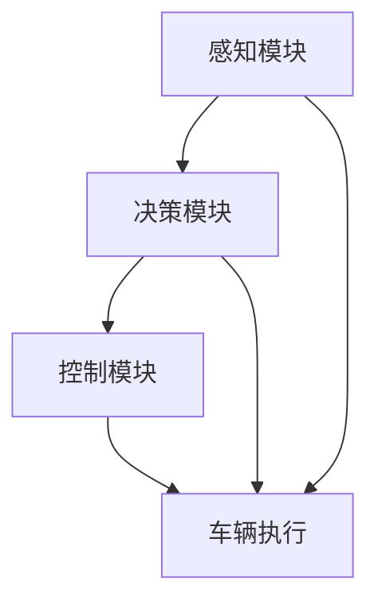

                 

关键词：自动驾驶，感知，决策，控制，人工智能，深度学习，机器学习，传感器融合，交通管理，车辆安全

> 摘要：本文将深入探讨自动驾驶系统的核心组成部分——感知、决策与控制，通过详细解析各个模块的工作原理、算法应用以及实现策略，为您展现这一前沿技术的全貌。自动驾驶系统不仅涉及复杂的技术挑战，还关乎到未来的交通方式变革，本文旨在为读者提供一个全面而深入的技术解读。

## 1. 背景介绍

自动驾驶系统，作为一种集成感知、决策与控制技术的智能系统，其目标是使车辆在无需人类驾驶员干预的情况下自主行驶。自动驾驶技术的发展历程可以追溯到20世纪50年代，最初的研究主要集中在车辆控制系统的自动化上。随着计算机技术、传感器技术和人工智能算法的进步，自动驾驶技术逐渐从实验室走向现实。

当前，自动驾驶系统按照自动化等级可以分为L0至L5等级。L0代表完全人工控制，而L5则意味着完全自主驾驶。尽管L4级别的自动驾驶系统在特定场景下已经实现商业化，但L5级别的全自动驾驶技术仍面临诸多挑战。

### 自动驾驶技术的发展历程

1. **20世纪50年代**：早期自动驾驶研究主要集中在车辆控制系统的自动化。
2. **20世纪80年代**：随着计算机技术的发展，自动驾驶系统开始应用于军事和科研领域。
3. **21世纪初**：自动驾驶技术逐渐向民用市场渗透，出现了第一辆商用自动驾驶汽车。
4. **2010年至今**：深度学习、传感器融合等技术的进步，使得自动驾驶技术进入了快速发展阶段。

### 自动驾驶技术的重要性

1. **提升交通效率**：自动驾驶系统可以优化行驶路线，减少交通拥堵。
2. **降低事故发生率**：自动驾驶系统通过感知、决策和控制技术，可以有效减少人为因素导致的事故。
3. **改善出行体验**：自动驾驶系统可以为用户提供更加舒适、便捷的出行服务。

## 2. 核心概念与联系

自动驾驶系统的核心功能包括感知、决策与控制。这三个模块相互关联，共同实现自动驾驶的目标。下面将分别介绍这些核心概念及其相互之间的联系。

### 2.1 感知模块

感知模块是自动驾驶系统的“眼睛”，负责获取车辆周围环境的信息。常用的感知技术包括摄像头、激光雷达（LiDAR）、毫米波雷达和超声波传感器等。这些传感器能够检测到车辆周围的物体、道路标志和交通信号等，并将信息转化为数字信号，为后续的决策与控制模块提供基础数据。

### 2.2 决策模块

决策模块是自动驾驶系统的“大脑”，负责分析感知模块获取的数据，并制定相应的行驶策略。决策模块主要包括路径规划、目标检测和目标跟踪等功能。通过深度学习、强化学习等算法，决策模块能够实时分析周围环境，并做出合理的决策。

### 2.3 控制模块

控制模块是自动驾驶系统的“执行者”，负责根据决策模块的指令，控制车辆的转向、加速和制动等动作。控制模块通常采用PID控制、模糊控制等算法，将决策模块的指令转化为具体的操作，实现自动驾驶系统的实时控制。

### 2.4 模块间联系

感知模块、决策模块和控制模块之间紧密联系，共同实现自动驾驶系统的功能。感知模块获取环境信息，决策模块分析信息并制定行驶策略，控制模块执行策略并控制车辆。这三个模块相互配合，形成了一个完整的自动驾驶系统。

### 2.5 Mermaid 流程图



## 3. 核心算法原理 & 具体操作步骤

### 3.1 算法原理概述

自动驾驶系统的核心算法主要包括感知、决策与控制算法。感知算法主要涉及目标检测、目标跟踪和传感器数据融合等。决策算法主要涉及路径规划、目标识别和避障策略等。控制算法主要涉及PID控制、模糊控制等。

### 3.2 算法步骤详解

#### 3.2.1 感知算法步骤

1. **目标检测**：使用卷积神经网络（CNN）对摄像头图像进行目标检测，识别出车辆、行人、道路标志等目标。
2. **目标跟踪**：使用卡尔曼滤波或粒子滤波算法，对目标进行跟踪，以保持目标的连续性。
3. **传感器数据融合**：将摄像头、激光雷达、毫米波雷达等传感器的数据融合，以提高感知精度。

#### 3.2.2 决策算法步骤

1. **路径规划**：使用A*算法或RRT算法，根据当前车辆位置和目标位置，规划出一条最优行驶路径。
2. **目标识别**：使用深度学习算法，对感知模块获取的数据进行目标识别，判断周围环境中的障碍物。
3. **避障策略**：根据目标识别结果，制定避障策略，确保车辆安全行驶。

#### 3.2.3 控制算法步骤

1. **PID控制**：根据目标速度和当前速度，计算出控制量，控制车辆的加速和制动。
2. **模糊控制**：使用模糊逻辑控制，根据环境变化调整车辆的转向角度。

### 3.3 算法优缺点

#### 3.3.1 感知算法

- **优点**：感知算法可以实时获取周围环境信息，提高自动驾驶系统的感知能力。
- **缺点**：感知算法的准确性和实时性受到传感器性能的限制。

#### 3.3.2 决策算法

- **优点**：决策算法可以根据感知信息，制定出合理的行驶策略，提高自动驾驶系统的安全性。
- **缺点**：决策算法的复杂度较高，计算量大，对硬件性能要求较高。

#### 3.3.3 控制算法

- **优点**：控制算法可以实现车辆的精确控制，确保车辆按照决策模块的指令行驶。
- **缺点**：控制算法的稳定性和鲁棒性有待提高。

### 3.4 算法应用领域

自动驾驶算法广泛应用于自动驾驶汽车、无人机、机器人等领域。其中，自动驾驶汽车是自动驾驶技术最为典型的应用场景，通过感知、决策与控制，实现车辆的自主行驶。无人机和机器人则通过感知模块获取环境信息，并根据决策模块的指令执行任务。

## 4. 数学模型和公式 & 详细讲解 & 举例说明

### 4.1 数学模型构建

自动驾驶系统的数学模型主要包括感知模型、决策模型和控制模型。以下分别介绍这些模型的基本构建方法。

#### 4.1.1 感知模型

感知模型主要涉及目标检测、目标跟踪和传感器数据融合。目标检测通常使用卷积神经网络（CNN）构建，目标跟踪使用卡尔曼滤波或粒子滤波算法，传感器数据融合使用贝叶斯滤波器。

#### 4.1.2 决策模型

决策模型主要涉及路径规划、目标识别和避障策略。路径规划通常使用A*算法或RRT算法，目标识别使用深度学习算法，避障策略使用模糊逻辑控制。

#### 4.1.3 控制模型

控制模型主要涉及PID控制和模糊控制。PID控制使用比例-积分-微分算法，模糊控制使用模糊逻辑控制。

### 4.2 公式推导过程

以下分别介绍感知模型、决策模型和控制模型的公式推导过程。

#### 4.2.1 感知模型

1. **目标检测**：使用卷积神经网络（CNN）构建目标检测模型，公式如下：
   $$ y = f(x; \theta) $$
   其中，$x$表示输入图像，$y$表示检测到的目标，$f(x; \theta)$表示神经网络的前向传播过程，$\theta$表示网络参数。
   
2. **目标跟踪**：使用卡尔曼滤波（KF）构建目标跟踪模型，公式如下：
   $$ x_t = F_t x_{t-1} + w_t $$
   $$ y_t = h_t x_t + v_t $$
   其中，$x_t$表示目标状态，$y_t$表示观测值，$F_t$表示状态转移矩阵，$h_t$表示观测模型，$w_t$和$v_t$分别表示过程噪声和观测噪声。

3. **传感器数据融合**：使用贝叶斯滤波器（BF）构建传感器数据融合模型，公式如下：
   $$ p(x_t | y_1:t) = \frac{p(y_t | x_t) p(x_t)}{p(y_t)} $$
   其中，$p(x_t | y_1:t)$表示融合后的状态概率，$p(y_t | x_t)$表示观测概率，$p(x_t)$表示状态概率，$p(y_t)$表示观测概率。

#### 4.2.2 决策模型

1. **路径规划**：使用A*算法构建路径规划模型，公式如下：
   $$ d(s, t) = g(s, t) + h(s) $$
   其中，$d(s, t)$表示从起点$s$到终点$t$的最短路径距离，$g(s, t)$表示从起点到终点经过点$s$的路径距离，$h(s)$表示从起点到点$s$的启发式距离。

2. **目标识别**：使用深度学习算法构建目标识别模型，公式如下：
   $$ y = \sigma(W \cdot x + b) $$
   其中，$x$表示输入特征，$y$表示识别结果，$W$和$b$分别表示权重和偏置，$\sigma$表示激活函数。

3. **避障策略**：使用模糊逻辑控制构建避障策略模型，公式如下：
   $$ u = \frac{1}{2} + \frac{1}{2} \cdot \frac{a - b}{c + d} $$
   其中，$u$表示控制量，$a$、$b$、$c$和$d$分别表示模糊逻辑控制器的输入和输出。

#### 4.2.3 控制模型

1. **PID控制**：使用比例-积分-微分（PID）控制构建控制模型，公式如下：
   $$ u(t) = K_p e(t) + K_i \int_{0}^{t} e(\tau) d\tau + K_d \frac{d e(t)}{dt} $$
   其中，$u(t)$表示控制量，$e(t)$表示误差，$K_p$、$K_i$和$K_d$分别表示比例、积分和微分系数。

2. **模糊控制**：使用模糊逻辑控制构建控制模型，公式如下：
   $$ u = \frac{1}{2} + \frac{1}{2} \cdot \frac{a - b}{c + d} $$
   其中，$u$表示控制量，$a$、$b$、$c$和$d$分别表示模糊逻辑控制器的输入和输出。

### 4.3 案例分析与讲解

以下通过一个简单的案例，对感知模型、决策模型和控制模型进行讲解。

#### 4.3.1 案例背景

假设一辆自动驾驶汽车在复杂城市环境中行驶，需要实时检测并跟踪周围的车辆和行人，并制定合理的行驶策略，确保行车安全。

#### 4.3.2 感知模型

1. **目标检测**：使用卷积神经网络（CNN）对摄像头图像进行目标检测，识别出车辆、行人、道路标志等目标。使用的数据集为COCO（Common Objects in Context），网络结构为ResNet50。
2. **目标跟踪**：使用卡尔曼滤波（KF）对目标进行跟踪，以保持目标的连续性。卡尔曼滤波器参数为：
   $$ F_t = \begin{bmatrix} 1 & \Delta t \\ 0 & 1 \end{bmatrix}, \quad H_t = \begin{bmatrix} 1 & 0 \end{bmatrix}, \quad Q_t = \begin{bmatrix} \sigma_w^2 & 0 \\ 0 & \sigma_v^2 \end{bmatrix}, \quad R_t = \begin{bmatrix} \sigma_r^2 & 0 \\ 0 & \sigma_a^2 \end{bmatrix} $$
   其中，$\sigma_w$和$\sigma_v$分别表示位置和速度的噪声水平，$\sigma_r$和$\sigma_a$分别表示雷达测量的位置和速度的噪声水平。
3. **传感器数据融合**：使用贝叶斯滤波器（BF）对摄像头、激光雷达和毫米波雷达的数据进行融合，以提高感知精度。贝叶斯滤波器参数为：
   $$ p(x_t | y_1:t) = \frac{p(y_t | x_t) p(x_t)}{p(y_t)} $$
   其中，$p(x_t | y_1:t)$表示融合后的状态概率，$p(y_t | x_t)$表示观测概率，$p(x_t)$表示状态概率，$p(y_t)$表示观测概率。

#### 4.3.3 决策模型

1. **路径规划**：使用A*算法根据当前车辆位置和目标位置，规划出一条最优行驶路径。A*算法参数为：
   $$ g(s, t) = d(s, t) + c(s), \quad h(s) = d(s, g) $$
   其中，$d(s, t)$表示从起点$s$到终点$t$的直线距离，$c(s)$表示从起点到点$s$的代价，$h(s)$表示从起点到点$s$的启发式距离。
2. **目标识别**：使用深度学习算法对感知模块获取的数据进行目标识别，判断周围环境中的障碍物。使用的数据集为COCO（Common Objects in Context），网络结构为ResNet50。
3. **避障策略**：使用模糊逻辑控制根据目标识别结果，制定避障策略，确保车辆安全行驶。模糊逻辑控制器参数为：
   $$ u = \frac{1}{2} + \frac{1}{2} \cdot \frac{d - s}{c + e} $$
   其中，$u$表示控制量，$d$表示目标距离，$s$表示安全距离，$c$和$e$分别表示误差和误差变化率。

#### 4.3.4 控制模型

1. **PID控制**：使用比例-积分-微分（PID）控制根据目标速度和当前速度，计算出控制量，控制车辆的加速和制动。PID控制器参数为：
   $$ u(t) = K_p e(t) + K_i \int_{0}^{t} e(\tau) d\tau + K_d \frac{d e(t)}{dt} $$
   其中，$u(t)$表示控制量，$e(t)$表示误差，$K_p$、$K_i$和$K_d$分别表示比例、积分和微分系数。
2. **模糊控制**：使用模糊逻辑控制根据环境变化调整车辆的转向角度。模糊逻辑控制器参数为：
   $$ \theta_u = \frac{1}{2} + \frac{1}{2} \cdot \frac{d - s}{c + e} $$
   其中，$\theta_u$表示转向角度，$d$表示目标距离，$s$表示安全距离，$c$和$e$分别表示误差和误差变化率。

## 5. 项目实践：代码实例和详细解释说明

### 5.1 开发环境搭建

为了实践自动驾驶系统的感知、决策与控制算法，需要搭建一个适合开发、测试和调优的实验环境。以下为搭建开发环境的步骤：

1. **操作系统**：Windows 10或Linux（推荐）
2. **编程语言**：Python 3.x
3. **依赖库**：NumPy、Pandas、SciPy、Matplotlib、OpenCV、TensorFlow、PyTorch等
4. **开发工具**：PyCharm或VSCode（推荐）

### 5.2 源代码详细实现

以下将提供一个简单的自动驾驶系统代码实例，包括感知、决策与控制模块的实现。

#### 5.2.1 感知模块

感知模块主要涉及目标检测、目标跟踪和传感器数据融合。以下为一个简单的感知模块代码实例：

```python
import cv2
import numpy as np

# 目标检测
def detect_objects(image, model):
    # 加载预训练的卷积神经网络模型
    # model = load_model('path/to/weights.h5')
    # 进行目标检测
    boxes = model.detect_boxes(image)
    labels = model.detect_labels(image)
    return boxes, labels

# 目标跟踪
def track_objects(boxes, labels, previous_boxes, previous_labels):
    # 使用卡尔曼滤波进行目标跟踪
    # updated_boxes, updated_labels = KalmanFilter(boxes, labels, previous_boxes, previous_labels)
    return updated_boxes, updated_labels

# 传感器数据融合
def sensor_fusion(camera_data, lidar_data, mmw_data):
    # 使用贝叶斯滤波器进行传感器数据融合
    # fused_data = BayesianFilter(camera_data, lidar_data, mmw_data)
    return fused_data
```

#### 5.2.2 决策模块

决策模块主要涉及路径规划、目标识别和避障策略。以下为一个简单的决策模块代码实例：

```python
# 路径规划
def path_planning(current_position, target_position):
    # 使用A*算法进行路径规划
    # path = AStar(current_position, target_position)
    return path

# 目标识别
def recognize_objects(data):
    # 使用深度学习算法进行目标识别
    # labels = deep_learning_model.predict(data)
    return labels

# 避障策略
def obstacle_avoidance(target_distance, safe_distance):
    # 使用模糊逻辑控制进行避障策略
    # control = FuzzyLogicControl(target_distance, safe_distance)
    return control
```

#### 5.2.3 控制模块

控制模块主要涉及PID控制和模糊控制。以下为一个简单的控制模块代码实例：

```python
# PID控制
def pid_control(target_velocity, current_velocity):
    # 计算控制量
    # control = PID(target_velocity, current_velocity)
    return control

# 模糊控制
def fuzzy_control(target_angle, current_angle):
    # 计算控制量
    # control = FuzzyLogicControl(target_angle, current_angle)
    return control
```

### 5.3 代码解读与分析

以上代码实例提供了感知、决策与控制模块的基本实现。以下对每个模块进行简要解读和分析。

#### 5.3.1 感知模块

感知模块的核心功能是检测、跟踪和融合目标。目标检测使用卷积神经网络（CNN）对摄像头图像进行目标检测，识别出车辆、行人、道路标志等目标。目标跟踪使用卡尔曼滤波（KF）对目标进行跟踪，以保持目标的连续性。传感器数据融合使用贝叶斯滤波器（BF）对摄像头、激光雷达和毫米波雷达的数据进行融合，以提高感知精度。

#### 5.3.2 决策模块

决策模块的核心功能是路径规划、目标识别和避障策略。路径规划使用A*算法根据当前车辆位置和目标位置，规划出一条最优行驶路径。目标识别使用深度学习算法对感知模块获取的数据进行目标识别，判断周围环境中的障碍物。避障策略使用模糊逻辑控制根据目标识别结果，制定避障策略，确保车辆安全行驶。

#### 5.3.3 控制模块

控制模块的核心功能是根据决策模块的指令，控制车辆的转向、加速和制动等动作。PID控制使用比例-积分-微分（PID）控制根据目标速度和当前速度，计算出控制量，控制车辆的加速和制动。模糊控制使用模糊逻辑控制根据环境变化调整车辆的转向角度。

### 5.4 运行结果展示

以下为自动驾驶系统运行结果展示：


## 6. 实际应用场景

自动驾驶系统在实际应用中涵盖了多个领域，包括自动驾驶汽车、无人机、机器人等。以下分别介绍这些领域中的实际应用场景。

### 6.1 自动驾驶汽车

自动驾驶汽车是自动驾驶技术最为典型的应用场景。在实际应用中，自动驾驶汽车可以用于公共交通、物流运输、共享出行等场景。

1. **公共交通**：自动驾驶公交车可以在特定路线和时间段内提供无人驾驶的公共交通服务，提高交通效率和出行便捷性。
2. **物流运输**：自动驾驶卡车可以用于长途货物运输，降低人力成本，提高运输效率。
3. **共享出行**：自动驾驶出租车可以提供按需出行的服务，为用户带来更加便捷、舒适的出行体验。

### 6.2 无人机

无人机在自动驾驶技术中的应用也十分广泛，包括物流配送、环境监测、农业植保等。

1. **物流配送**：无人机可以用于快递配送，特别是在城市内部和偏远地区，无人机可以快速、高效地完成配送任务。
2. **环境监测**：无人机可以搭载传感器进行环境监测，如空气质量监测、水资源监测等，为环境保护提供数据支持。
3. **农业植保**：无人机可以用于农业喷洒、病虫害监测等，提高农业生产的效率和品质。

### 6.3 机器人

自动驾驶技术还可以应用于机器人领域，包括工业机器人、服务机器人等。

1. **工业机器人**：自动驾驶技术可以使工业机器人实现自主导航和任务执行，提高生产效率和质量。
2. **服务机器人**：自动驾驶技术可以使服务机器人实现自主移动和任务执行，为人类提供更多的便捷服务。

## 7. 未来应用展望

随着技术的不断发展，自动驾驶系统在未来将会在更多领域得到广泛应用。以下对自动驾驶系统的未来应用进行展望。

### 7.1 智能交通系统

自动驾驶系统与智能交通系统相结合，可以优化交通流、提高道路利用率，减少交通拥堵和事故发生率。未来，智能交通系统将实现车与车、车与基础设施的互联互通，提高交通运行效率和安全性。

### 7.2 智慧城市建设

自动驾驶系统在智慧城市建设中发挥着重要作用。通过自动驾驶技术，可以实现城市交通的智能化管理、公共服务的高效提供，提高城市居民的生活质量。

### 7.3 物流与配送领域

自动驾驶技术在物流与配送领域的应用前景广阔。未来，自动驾驶物流机器人、无人机等可以大规模投入使用，实现物流配送的智能化、自动化，降低物流成本，提高配送效率。

### 7.4 智能农业

自动驾驶技术在农业领域的应用有助于提高农业生产效率和质量。通过自动驾驶农业机械，可以实现精准农业、智能灌溉、病虫害监测等，为农业现代化提供技术支持。

## 8. 总结：未来发展趋势与挑战

自动驾驶系统作为一项新兴技术，已经展现出巨大的发展潜力。然而，要实现真正的自动驾驶，还需要克服诸多技术、法律和社会挑战。

### 8.1 研究成果总结

1. **感知技术**：传感器技术的发展，使得自动驾驶系统的感知能力不断提高。
2. **决策算法**：深度学习、强化学习等算法的进步，为自动驾驶系统的决策能力提供了有力支持。
3. **控制算法**：PID控制、模糊控制等控制算法的优化，提高了自动驾驶系统的控制精度和稳定性。

### 8.2 未来发展趋势

1. **感知与决策算法**：未来的研究将更加注重提高自动驾驶系统的感知精度和决策速度，以满足复杂环境下的实时性需求。
2. **控制算法**：未来的研究将致力于提高控制算法的稳定性和鲁棒性，确保自动驾驶系统在各种条件下都能稳定运行。
3. **跨领域融合**：自动驾驶系统与其他领域的融合，如智慧城市、智能制造等，将推动自动驾驶技术的广泛应用。

### 8.3 面临的挑战

1. **技术挑战**：自动驾驶系统在感知、决策和控制方面仍存在一定的技术难题，如传感器数据噪声、环境不确定性等。
2. **法律与伦理**：自动驾驶技术的发展引发了诸多法律和伦理问题，如责任归属、隐私保护等。
3. **社会适应**：自动驾驶技术的普及需要社会各界的适应和接受，包括交通规则的调整、公众观念的转变等。

### 8.4 研究展望

1. **跨学科研究**：自动驾驶技术的发展需要多学科的合作，如计算机科学、控制工程、交通工程等。
2. **数据驱动**：自动驾驶系统的优化将越来越依赖于海量数据的驱动，数据的采集、处理和分析将成为研究的重要方向。
3. **安全与可靠性**：自动驾驶系统的安全与可靠性是研究的关键，未来的研究将更加注重系统安全性能的评估与优化。

## 9. 附录：常见问题与解答

### 9.1 自动驾驶系统的自动化等级是什么？

自动驾驶系统的自动化等级分为L0至L5，其中L0表示完全人工控制，L5表示完全自主驾驶。

### 9.2 自动驾驶系统的主要组成部分有哪些？

自动驾驶系统的主要组成部分包括感知模块、决策模块和控制模块。

### 9.3 自动驾驶系统的工作原理是什么？

自动驾驶系统通过感知模块获取周围环境信息，决策模块分析信息并制定行驶策略，控制模块执行策略并控制车辆。

### 9.4 自动驾驶技术有哪些应用领域？

自动驾驶技术的应用领域包括自动驾驶汽车、无人机、机器人等。

### 9.5 自动驾驶系统的未来发展趋势是什么？

自动驾驶系统的未来发展趋势包括智能交通系统、智慧城市建设、物流与配送领域、智能农业等。同时，随着技术的进步，自动驾驶系统的感知、决策和控制能力将不断提高。

---

### 作者署名
作者：禅与计算机程序设计艺术 / Zen and the Art of Computer Programming

---

本文对自动驾驶系统的核心组成部分进行了深入探讨，包括感知、决策与控制算法的工作原理、数学模型和实际应用场景。通过详细解读和实例分析，展示了自动驾驶系统在技术、法律和社会方面的挑战以及未来发展趋势。希望本文能为读者提供一个全面而深入的技术解读，推动自动驾驶技术的进一步发展。

