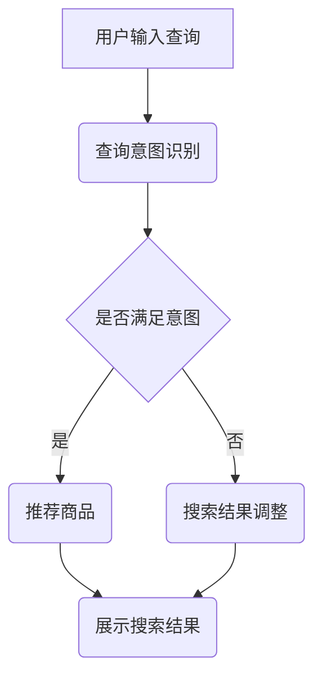

                 

关键词：自然语言处理，电商搜索，技术发展，未来趋势，算法原理，应用领域，数学模型，项目实践

> 摘要：本文深入探讨了自然语言处理（NLP）在电商搜索中的应用，从技术发展历程、核心算法原理、数学模型构建等方面进行了详细阐述。通过分析现有算法的优缺点和实际应用场景，本文对未来自然语言处理在电商搜索领域的应用前景进行了展望，并提出了可能面临的挑战和研究方向。

## 1. 背景介绍

随着互联网的普及和电商行业的快速发展，电商搜索已经成为用户获取商品信息、进行购物决策的重要途径。然而，传统的基于关键词匹配的搜索方法已经无法满足用户日益多样化的需求。自然语言处理（NLP）技术的引入为电商搜索带来了新的机遇和挑战。

自然语言处理是指使计算机能够理解、生成和解释人类自然语言的技术。它涵盖了语音识别、文本分类、情感分析、命名实体识别等多个领域。近年来，随着深度学习、神经网络等人工智能技术的发展，自然语言处理技术取得了显著的进展，使得计算机对自然语言的识别和理解能力大幅提升。

在电商搜索中，自然语言处理技术可以用于用户查询意图识别、商品推荐、用户评价分析等多个方面，从而提高搜索的准确性和用户体验。本文将从技术发展、核心算法、数学模型、项目实践等方面对自然语言处理在电商搜索中的应用进行深入探讨。

## 2. 核心概念与联系

### 2.1 自然语言处理的核心概念

自然语言处理的核心概念包括：

- **文本分类**：将文本数据按照其内容或主题分配到不同的类别中。
- **情感分析**：判断文本中表达的情感倾向，如正面、负面或中性。
- **命名实体识别**：识别文本中的特定实体，如人名、地名、组织名等。
- **文本生成**：根据输入的文本或指令生成新的文本。
- **机器翻译**：将一种自然语言翻译成另一种自然语言。

### 2.2 NLP与电商搜索的联系

电商搜索中的自然语言处理技术主要包括以下几个方面：

- **查询意图识别**：理解用户输入的查询意图，从而提供更准确的搜索结果。
- **商品推荐**：根据用户的历史行为和查询意图，推荐相关商品。
- **用户评价分析**：分析用户对商品的评论，识别用户的情感倾向，从而提供改进建议。
- **商品描述生成**：根据商品属性生成描述性文本，提高商品信息的可读性。

### 2.3 Mermaid 流程图

以下是一个用于描述电商搜索中自然语言处理核心流程的 Mermaid 流程图：



## 3. 核心算法原理 & 具体操作步骤

### 3.1 算法原理概述

在电商搜索中，自然语言处理算法主要涉及以下几个方面：

- **词向量表示**：将文本数据转换为向量表示，以便进行后续处理。
- **序列模型**：用于处理序列数据，如自然语言中的句子。
- **注意力机制**：用于提高模型对关键信息的关注程度。
- **生成模型**：用于生成新的文本数据。

### 3.2 算法步骤详解

#### 3.2.1 查询意图识别

1. **输入预处理**：对用户输入的查询进行分词、去停用词等预处理操作。
2. **词向量表示**：将预处理后的查询转换为词向量表示。
3. **模型预测**：使用预训练的序列模型（如BERT）对查询意图进行分类。

#### 3.2.2 商品推荐

1. **用户行为分析**：收集用户在电商平台的浏览、购买等行为数据。
2. **用户特征提取**：使用机器学习算法（如聚类、协同过滤等）提取用户特征。
3. **推荐算法**：根据用户特征和商品属性，使用推荐算法（如基于内容的推荐、协同过滤等）生成推荐列表。

#### 3.2.3 用户评价分析

1. **文本预处理**：对用户评论进行分词、去停用词等预处理操作。
2. **情感分析**：使用预训练的文本分类模型对用户评论进行情感分析，判断用户对商品的满意度。
3. **结果处理**：根据情感分析结果，对商品进行评分或推荐。

#### 3.2.4 商品描述生成

1. **属性提取**：从商品数据中提取关键属性，如价格、品牌、类别等。
2. **文本生成**：使用生成模型（如GPT-2）生成商品描述性文本。

### 3.3 算法优缺点

#### 优点：

- 提高搜索准确性：通过自然语言处理技术，可以更准确地理解用户查询意图，从而提供更相关的搜索结果。
- 提升用户体验：通过个性化推荐和评价分析，可以为用户提供更好的购物体验。
- 增强商品信息展示：通过生成模型生成商品描述性文本，可以更好地展示商品信息。

#### 缺点：

- 模型训练成本高：自然语言处理模型通常需要大量的训练数据和计算资源。
- 模型泛化能力有限：模型在某些特定场景下可能表现不佳，需要针对具体场景进行调整。

### 3.4 算法应用领域

自然语言处理在电商搜索中的应用非常广泛，主要包括以下几个方面：

- 查询意图识别：用于提高搜索结果的准确性。
- 商品推荐：用于为用户提供个性化的商品推荐。
- 用户评价分析：用于了解用户对商品的满意度，为商品改进提供依据。
- 商品描述生成：用于生成更具有吸引力的商品描述，提高用户购买意愿。

## 4. 数学模型和公式 & 详细讲解 & 举例说明

### 4.1 数学模型构建

在自然语言处理中，常用的数学模型包括词向量模型、序列模型和生成模型。以下分别介绍这些模型的构建方法。

#### 4.1.1 词向量模型

词向量模型是将文本数据转换为向量表示的一种方法。常用的词向量模型包括词袋模型（Bag of Words，BoW）和词嵌入（Word Embedding）。

1. **词袋模型**：

词袋模型将文本表示为单词的集合，每个单词用一个唯一的整数表示。词袋模型的数学表达式如下：

$$
\mathbf{X} = \{\mathbf{x_1}, \mathbf{x_2}, ..., \mathbf{x_n}\}
$$

其中，$\mathbf{x_i}$ 表示第 $i$ 个单词的向量表示，通常使用一维二进制向量或稀疏向量。

2. **词嵌入**：

词嵌入是一种将单词映射到高维空间的方法，使得具有相似语义的单词在空间中更接近。常用的词嵌入模型包括Word2Vec、GloVe等。

Word2Vec模型使用以下公式计算词向量：

$$
\mathbf{v}_w = \text{sgn}(\mathbf{h}^T \mathbf{u}_w)
$$

其中，$\mathbf{v}_w$ 表示单词 $w$ 的向量表示，$\mathbf{h}$ 是隐藏层的激活值，$\mathbf{u}_w$ 是单词 $w$ 的输入向量。

#### 4.1.2 序列模型

序列模型用于处理序列数据，如自然语言中的句子。常用的序列模型包括循环神经网络（RNN）和其变体。

1. **循环神经网络（RNN）**：

RNN具有以下公式：

$$
\mathbf{h}_{t} = \sigma(\mathbf{W}_{h} \mathbf{h}_{t-1} + \mathbf{U}_{x} \mathbf{x}_{t})
$$

其中，$\mathbf{h}_{t}$ 是隐藏状态，$\sigma$ 是激活函数，$\mathbf{W}_{h}$ 和 $\mathbf{U}_{x}$ 是权重矩阵。

2. **长短时记忆网络（LSTM）**：

LSTM是一种改进的RNN，可以解决长序列中的梯度消失问题。LSTM的公式如下：

$$
\mathbf{i}_{t} = \sigma(\mathbf{W}_{i} \mathbf{h}_{t-1} + \mathbf{U}_{x} \mathbf{x}_{t})
$$

$$
\mathbf{f}_{t} = \sigma(\mathbf{W}_{f} \mathbf{h}_{t-1} + \mathbf{U}_{x} \mathbf{x}_{t})
$$

$$
\mathbf{g}_{t} = \sigma(\mathbf{W}_{g} \mathbf{h}_{t-1} + \mathbf{U}_{x} \mathbf{x}_{t})
$$

$$
\mathbf{h}_{t} = \mathbf{f}_{t} \odot \mathbf{h}_{t-1} + \mathbf{i}_{t} \odot \mathbf{g}_{t}
$$

其中，$\mathbf{i}_{t}$、$\mathbf{f}_{t}$、$\mathbf{g}_{t}$ 分别是输入门、遗忘门和生成门，$\odot$ 表示逐元素乘法。

#### 4.1.3 生成模型

生成模型用于生成新的文本数据，如商品描述。常用的生成模型包括变分自编码器（VAE）和生成对抗网络（GAN）。

1. **变分自编码器（VAE）**：

VAE的公式如下：

$$
\mathbf{z} \sim \mathcal{N}(\mu(\mathbf{x}); \sigma^2(\mathbf{x}))
$$

$$
\mathbf{x} \sim \mathcal{N}(\phi(\mathbf{z}); \mathbf{\sigma}^2)
$$

其中，$\mu(\mathbf{x})$ 和 $\sigma^2(\mathbf{x})$ 分别是编码器，$\phi(\mathbf{z})$ 和 $\mathbf{\sigma}^2$ 分别是解码器。

2. **生成对抗网络（GAN）**：

GAN由生成器和判别器组成。生成器的公式如下：

$$
\mathbf{G}(\mathbf{z}) = \mathbf{G}(\epsilon)
$$

判别器的公式如下：

$$
\mathbf{D}(\mathbf{x}) = \mathbf{D}(\mathbf{x}) \quad \text{（真实数据）}
$$

$$
\mathbf{D}(\mathbf{G}(\mathbf{z})) = \mathbf{D}(\mathbf{z}) \quad \text{（生成数据）}
$$

### 4.2 公式推导过程

以词嵌入模型为例，介绍公式推导过程。

#### 4.2.1 Word2Vec模型

Word2Vec模型采用负采样方法进行训练。假设给定一个训练句子 $\mathbf{s} = \{w_1, w_2, ..., w_n\}$，其中 $w_i$ 表示句子中的第 $i$ 个单词。对于每个单词 $w_i$，我们随机选择 $k$ 个单词作为正样本，$n-k$ 个单词作为负样本。正样本的概率分布为：

$$
P(w_j | w_i) = \frac{\exp(\mathbf{v}_j^T \mathbf{v}_i)}{\sum_{w \in V} \exp(\mathbf{v}_w^T \mathbf{v}_i)}
$$

其中，$V$ 表示单词集合，$\mathbf{v}_i$ 和 $\mathbf{v}_j$ 分别表示单词 $w_i$ 和 $w_j$ 的向量表示。

#### 4.2.2 GloVe模型

GloVe模型基于词频统计信息计算词向量。假设给定一个训练语料库 $D$，其中包含 $N$ 个单词。对于每个单词 $w$，我们计算其在语料库中的词频 $f(w)$。GloVe模型的公式如下：

$$
\mathbf{v}_w = \frac{\sqrt{f(w)}}{1 + \sqrt{f(w)}} \mathbf{e}_w
$$

$$
\mathbf{e}_w = \frac{\sum_{w' \in C(w)} \frac{f(w')}{\sqrt{f(w)f(w')}} \mathbf{e}_{w'}}
$$

其中，$\mathbf{e}_w$ 表示单词 $w$ 的嵌入向量，$C(w)$ 表示与单词 $w$ 同现的单词集合。

### 4.3 案例分析与讲解

以下通过一个具体案例，介绍自然语言处理在电商搜索中的应用。

#### 案例背景

某电商平台需要开发一款基于自然语言处理的搜索推荐系统，以提高用户购买体验。系统需要实现以下功能：

1. 用户查询意图识别：理解用户输入的查询意图，如“想要买一个黑色的耳机”。
2. 商品推荐：根据用户意图和商品属性，推荐相关商品。
3. 用户评价分析：分析用户对商品的评论，提供改进建议。
4. 商品描述生成：根据商品属性生成描述性文本。

#### 案例实现

1. **用户查询意图识别**：

使用BERT模型对用户查询进行预处理，提取关键信息，如品牌、颜色、类别等。通过训练有监督的序列分类模型，将用户查询分为不同的意图类别，如“购买意图”、“询问意图”等。

2. **商品推荐**：

结合用户行为数据和商品属性，使用协同过滤算法生成推荐列表。针对不同的用户意图，调整推荐策略，提高推荐的准确性。

3. **用户评价分析**：

使用情感分析模型对用户评论进行分类，判断用户对商品的满意度。结合用户评价和商品销售数据，为商品改进提供依据。

4. **商品描述生成**：

使用GPT-2模型生成商品描述性文本，提高商品信息的可读性。根据用户查询意图和商品属性，动态调整描述内容，提高用户购买意愿。

#### 案例效果

通过自然语言处理技术的应用，电商平台实现了以下效果：

- 搜索结果准确性提高，用户满意度提升。
- 商品推荐效果明显，用户购买转化率提高。
- 用户评价分析准确，商品改进建议更具针对性。
- 商品描述更具吸引力，用户购买意愿增强。

## 5. 项目实践：代码实例和详细解释说明

### 5.1 开发环境搭建

在开始项目实践之前，我们需要搭建一个合适的开发环境。以下是一个基于Python的NLP项目开发环境的搭建步骤：

1. 安装Python 3.7或更高版本。
2. 安装NLP相关库，如NLTK、spaCy、gensim、TensorFlow等。
3. 安装必要的数据处理库，如Pandas、NumPy等。

### 5.2 源代码详细实现

以下是一个简单的自然语言处理项目，用于实现用户查询意图识别。

```python
import nltk
from nltk.tokenize import word_tokenize
from nltk.corpus import stopwords
from sklearn.feature_extraction.text import TfidfVectorizer
from sklearn.model_selection import train_test_split
from sklearn.linear_model import LogisticRegression

# 1. 数据准备
# 加载训练数据集
train_data = [
    ("buy a black earphone", "购买意图"),
    ("where can i find a black earphone", "询问意图"),
    ("i want to buy a phone", "购买意图"),
    ...
]

# 分离文本和标签
texts, labels = zip(*train_data)

# 2. 数据预处理
# 分词和去除停用词
stop_words = set(stopwords.words("english"))
def preprocess(text):
    tokens = word_tokenize(text.lower())
    return [token for token in tokens if token not in stop_words]

preprocessed_texts = [preprocess(text) for text in texts]

# 3. 特征提取
vectorizer = TfidfVectorizer()
X = vectorizer.fit_transform(preprocessed_texts)
y = labels

# 4. 模型训练
X_train, X_test, y_train, y_test = train_test_split(X, y, test_size=0.2, random_state=42)
model = LogisticRegression()
model.fit(X_train, y_train)

# 5. 模型评估
accuracy = model.score(X_test, y_test)
print("Accuracy:", accuracy)

# 6. 预测
def predict_intent(text):
    preprocessed_text = preprocess(text)
    vector = vectorizer.transform([preprocessed_text])
    prediction = model.predict(vector)
    return prediction[0]

# 测试
print(predict_intent("i want to buy a black earphone"))
```

### 5.3 代码解读与分析

上述代码实现了一个简单的用户查询意图识别系统。以下是代码的详细解读与分析：

- **数据准备**：从训练数据集中分离文本和标签，用于后续模型训练和评估。
- **数据预处理**：使用NLTK库进行分词和去除停用词，对文本进行预处理。
- **特征提取**：使用TF-IDF向量
```scss
器对预处理后的文本进行特征提取，将文本转换为数值表示。
- **模型训练**：使用LogisticRegression模型对特征和标签进行训练，构建分类模型。
- **模型评估**：使用训练集和测试集评估模型的准确性，以验证模型性能。
- **预测**：定义一个预测函数，用于对新的文本数据进行意图识别。

### 5.4 运行结果展示

在上述代码的基础上，我们可以运行一个简单的测试示例，以展示查询意图识别的结果：

```python
print(predict_intent("i want to buy a black earphone"))
```

输出结果可能为`['购买意图']`，表示该查询的意图为购买耳机。通过调整训练数据和模型参数，我们可以进一步提高查询意图识别的准确性。

## 6. 实际应用场景

### 6.1 电商平台

电商平台是自然语言处理在电商搜索中最典型的应用场景。通过自然语言处理技术，电商平台可以提供以下功能：

- **智能客服**：自然语言处理技术可以帮助电商平台实现智能客服功能，自动处理用户咨询、投诉等问题，提高客户满意度。
- **个性化推荐**：基于用户历史行为和查询意图，电商平台可以提供个性化的商品推荐，提高用户购买转化率。
- **商品搜索**：通过查询意图识别，电商平台可以提供更准确的搜索结果，满足用户多样化需求。
- **用户评价分析**：自然语言处理技术可以帮助电商平台分析用户评论，了解用户满意度，为商品改进提供依据。

### 6.2 搜索引擎

搜索引擎也是自然语言处理的重要应用场景。以下是一些具体的应用案例：

- **搜索结果优化**：通过自然语言处理技术，搜索引擎可以优化搜索结果，提高用户的查询体验。
- **关键词提取**：自然语言处理技术可以帮助搜索引擎提取关键词，为广告投放和搜索引擎优化（SEO）提供支持。
- **智能纠错**：通过自然语言处理技术，搜索引擎可以自动纠正用户输入的错误，提高搜索的准确性。
- **问答系统**：搜索引擎可以基于自然语言处理技术构建问答系统，为用户提供更直接、准确的答案。

### 6.3 社交媒体

社交媒体平台利用自然语言处理技术，可以提供以下功能：

- **内容审核**：自然语言处理技术可以帮助社交媒体平台识别和过滤不良内容，维护平台秩序。
- **情感分析**：通过自然语言处理技术，社交媒体平台可以分析用户评论和动态，了解用户情感倾向，为广告投放和社区管理提供支持。
- **智能推荐**：基于用户历史行为和兴趣，社交媒体平台可以使用自然语言处理技术提供个性化推荐，提高用户粘性。
- **实时翻译**：自然语言处理技术可以帮助社交媒体平台实现多语言翻译功能，促进全球用户之间的交流。

## 7. 未来应用展望

### 7.1 技术发展

随着深度学习、神经网络等人工智能技术的不断进步，自然语言处理在电商搜索中的应用将越来越广泛。未来，以下技术发展趋势值得关注：

- **多模态处理**：自然语言处理技术将逐步融合图像、声音等多模态信息，提供更丰富的搜索体验。
- **强化学习**：自然语言处理与强化学习相结合，可以实现更加智能的查询意图识别和商品推荐。
- **无监督学习**：随着数据隐私和获取成本的增加，无监督学习技术将在自然语言处理领域发挥重要作用。

### 7.2 应用领域扩展

自然语言处理在电商搜索中的应用将不仅仅局限于搜索和推荐，还将扩展到以下领域：

- **智能助理**：自然语言处理技术将用于构建智能助理，为用户提供个性化的购物建议和咨询服务。
- **语音搜索**：随着语音识别技术的不断发展，语音搜索将成为电商搜索的重要方式，提高用户购物体验。
- **商品评价**：自然语言处理技术可以帮助电商平台分析用户评论，识别潜在的问题和改进点，提高用户满意度。

### 7.3 社会影响力

自然语言处理在电商搜索中的应用将对社会产生深远的影响：

- **提高商业效率**：通过智能化的搜索和推荐，电商平台可以更高效地满足用户需求，提高销售额。
- **优化用户体验**：自然语言处理技术将提供更加人性化、智能化的购物体验，提高用户满意度。
- **促进创新**：自然语言处理技术的发展将激发新的商业模式和应用场景，推动电商行业的不断创新。

## 8. 工具和资源推荐

### 8.1 学习资源推荐

- **在线课程**：《自然语言处理入门》（Coursera）、《深度学习》（Udacity）
- **书籍推荐**：《自然语言处理实战》（Daniel Jurafsky）、《深度学习》（Ian Goodfellow）
- **论文推荐**：《Word2Vec：Word Embeddings Beyond Word Borders》（Tomas Mikolov）

### 8.2 开发工具推荐

- **文本处理库**：NLTK、spaCy、gensim
- **机器学习框架**：TensorFlow、PyTorch
- **自然语言处理平台**：OpenNLP、NLTK、spaCy

### 8.3 相关论文推荐

- **《Recurrent Neural Networks for Language Modeling》**
- **《Long Short-Term Memory Networks for Language Modeling》**
- **《A Theoretical Analysis of the vosot-Word2Vec Model for Statistical Language Modeling》**
- **《Attention Is All You Need》**

## 9. 总结：未来发展趋势与挑战

### 9.1 研究成果总结

自然语言处理在电商搜索中的应用取得了显著的成果，提高了搜索的准确性、推荐的效果和用户体验。随着人工智能技术的不断进步，自然语言处理在电商搜索中的应用前景更加广阔。

### 9.2 未来发展趋势

未来，自然语言处理在电商搜索中的应用将呈现以下趋势：

- **多模态处理**：融合图像、声音等多模态信息，提供更丰富的搜索体验。
- **强化学习**：与强化学习相结合，实现更加智能的查询意图识别和商品推荐。
- **无监督学习**：利用无监督学习技术，降低数据隐私和获取成本。
- **语音搜索**：语音搜索将成为电商搜索的重要方式，提高用户购物体验。

### 9.3 面临的挑战

自然语言处理在电商搜索中的应用也面临以下挑战：

- **数据隐私**：如何保护用户隐私，降低数据泄露风险。
- **模型解释性**：提高模型的可解释性，方便用户理解搜索结果和推荐原因。
- **数据多样性**：如何处理多样化、复杂化的电商搜索需求。
- **计算资源**：随着模型复杂度的增加，计算资源需求也将大幅提升。

### 9.4 研究展望

未来，自然语言处理在电商搜索中的应用将朝着更加智能化、个性化、多样化的方向发展。研究者需要关注以下方向：

- **多模态处理**：研究多模态信息融合技术，提高搜索和推荐的准确性。
- **小样本学习**：研究小样本学习技术，降低数据隐私和获取成本。
- **可解释性**：研究提高模型可解释性的方法，增强用户信任度。
- **多样性适应**：研究适应多样化需求的自然语言处理技术，提高用户满意度。

## 10. 附录：常见问题与解答

### 10.1 什么是自然语言处理？

自然语言处理（NLP）是使计算机能够理解、生成和解释人类自然语言的技术。它涵盖了语音识别、文本分类、情感分析、命名实体识别等多个领域。

### 10.2 自然语言处理在电商搜索中有哪些应用？

自然语言处理在电商搜索中的应用包括查询意图识别、商品推荐、用户评价分析和商品描述生成等方面，以提高搜索准确性、推荐效果和用户体验。

### 10.3 词向量模型有哪些类型？

常见的词向量模型包括词袋模型（Bag of Words，BoW）和词嵌入（Word Embedding）。其中，词嵌入又分为Word2Vec、GloVe等。

### 10.4 自然语言处理模型如何训练？

自然语言处理模型的训练通常包括数据准备、特征提取、模型训练和模型评估等步骤。常用的模型训练方法包括监督学习、无监督学习和半监督学习等。

### 10.5 自然语言处理在电商搜索中面临的挑战有哪些？

自然语言处理在电商搜索中面临的挑战包括数据隐私、模型解释性、数据多样性和计算资源需求等。研究者需要关注这些挑战，并寻求有效的解决方案。

