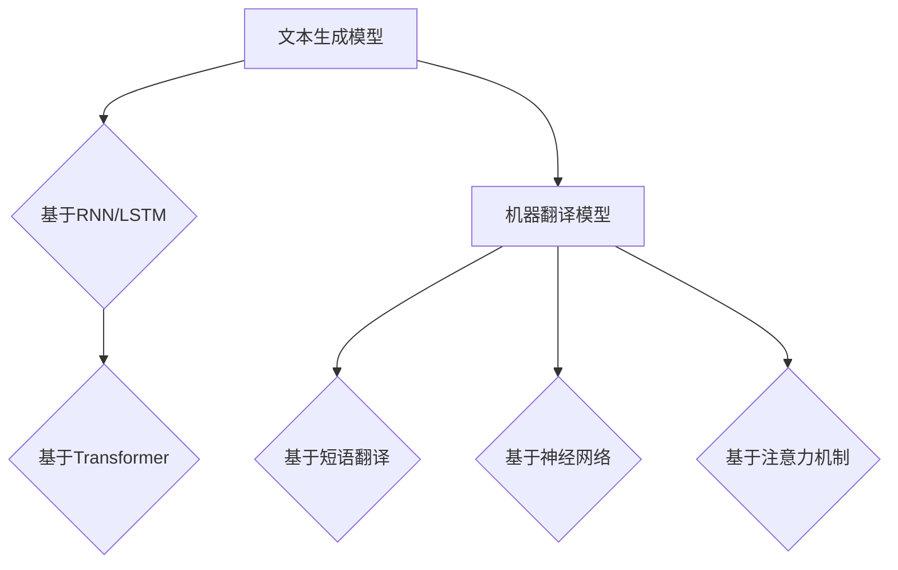

                 

自然语言处理（NLP）作为人工智能领域的一个重要分支，近年来取得了显著的发展。其在内容创作与翻译方面的应用，不仅为人类带来了便利，也在很多领域产生了深远的影响。本文将深入探讨自然语言处理在内容创作与翻译中的具体应用，分析其原理、方法、挑战及未来发展趋势。

## 关键词

自然语言处理、内容创作、机器翻译、文本生成、语义理解

## 摘要

本文首先介绍了自然语言处理的基本概念和应用背景。随后，详细分析了NLP在内容创作与翻译中的核心算法原理，包括文本生成模型和机器翻译模型。接着，通过数学模型和公式详细讲解了算法的具体实现过程，并结合实际项目实例展示了代码的实现和运行效果。文章最后探讨了自然语言处理在实际应用中的场景，并对未来发展的趋势和面临的挑战进行了展望。

## 1. 背景介绍

自然语言处理（NLP）是计算机科学和人工智能领域的一个重要分支，主要研究如何使计算机能够理解、生成和处理自然语言。自然语言包括人类日常使用的各种语言，如英语、汉语、法语等。自然语言处理的目标是让计算机能够“理解”人类语言，从而实现人机交互、信息检索、文本分析等任务。

NLP的应用非常广泛，包括但不限于以下几个方面：

- **文本分析**：通过分析文本内容，提取出关键信息，用于信息检索、舆情监测、情感分析等。
- **机器翻译**：将一种语言翻译成另一种语言，实现跨语言的信息交流。
- **语音识别**：将语音信号转换为文本，实现语音输入和语音助手功能。
- **文本生成**：根据一定的规则和算法，生成具有可读性的文本，用于自动写作、新闻摘要等。
- **问答系统**：能够理解用户的问题，并给出相应的答案。

随着互联网和大数据的快速发展，自然语言处理技术得到了广泛应用，也在各个领域产生了深远的影响。本文将重点关注自然语言处理在内容创作与翻译方面的应用，探讨其核心算法原理、数学模型及实际应用场景。

## 2. 核心概念与联系

### 2.1 文本生成模型

文本生成模型是自然语言处理中的一个重要方向，旨在根据给定的输入文本生成具有相似内容的文本。常见的文本生成模型包括循环神经网络（RNN）、长短期记忆网络（LSTM）和Transformer等。

- **循环神经网络（RNN）**：RNN是一种基于时间序列数据的神经网络，能够处理序列数据。在文本生成任务中，RNN通过迭代更新隐藏状态，从而生成序列数据。
- **长短期记忆网络（LSTM）**：LSTM是RNN的一种改进，能够解决长短期依赖问题。在文本生成任务中，LSTM通过引入门控机制，有效地控制信息的流动，从而生成高质量的文本。
- **Transformer**：Transformer是一种基于自注意力机制的神经网络模型，具有并行计算的优势。在文本生成任务中，Transformer通过自注意力机制，能够捕捉长距离依赖关系，从而生成高质量的文本。

### 2.2 机器翻译模型

机器翻译模型是自然语言处理中的另一个重要方向，旨在将一种语言的文本翻译成另一种语言的文本。常见的机器翻译模型包括基于短语的翻译模型、基于神经网络的翻译模型和基于注意力机制的翻译模型等。

- **基于短语的翻译模型**：基于短语的翻译模型通过将源语言中的短语映射到目标语言中的短语，实现翻译任务。该模型简单高效，但在处理长句和复杂语法时效果不佳。
- **基于神经网络的翻译模型**：基于神经网络的翻译模型通过将源语言和目标语言的文本映射到一个共同的嵌入空间，然后生成目标语言的文本。常见的神经网络模型包括循环神经网络（RNN）、长短期记忆网络（LSTM）和Transformer等。
- **基于注意力机制的翻译模型**：基于注意力机制的翻译模型通过引入注意力机制，能够捕捉源语言和目标语言之间的依赖关系，从而生成更准确的翻译结果。

### 2.3 核心概念联系

文本生成模型和机器翻译模型都是自然语言处理中的核心任务，它们在算法原理和实现方法上有一定的相似性，但也存在显著的区别。文本生成模型主要关注文本的生成过程，而机器翻译模型主要关注文本的翻译过程。在算法原理上，文本生成模型和机器翻译模型都采用了神经网络模型，但前者更注重自注意力机制和序列生成，而后者更注重翻译编码和解码。

为了更好地理解文本生成模型和机器翻译模型，下面给出一个简单的Mermaid流程图：



## 3. 核心算法原理 & 具体操作步骤

### 3.1 算法原理概述

文本生成模型和机器翻译模型都是基于神经网络模型的。在算法原理上，它们都采用了序列到序列（Seq2Seq）的框架，即通过将输入序列映射到输出序列来实现文本生成或翻译。

- **文本生成模型**：文本生成模型通过输入一个单词序列，输出一个具有相似内容的单词序列。在生成过程中，模型会根据当前生成的单词和上下文信息，预测下一个单词。通过迭代更新，模型最终生成完整的文本。

- **机器翻译模型**：机器翻译模型通过输入一个源语言句子，输出一个目标语言句子。在翻译过程中，模型会根据源语言句子的上下文信息，预测目标语言句子的每个单词。通过迭代更新，模型最终生成完整的目标语言句子。

### 3.2 算法步骤详解

以下是文本生成模型和机器翻译模型的具体操作步骤：

1. **数据预处理**：对输入文本进行预处理，包括分词、去停用词、词向量化等。

2. **构建模型**：构建基于RNN、LSTM或Transformer的神经网络模型。

3. **训练模型**：使用预处理后的数据集训练模型，通过反向传播算法更新模型参数。

4. **生成文本/翻译**：输入一个起始单词或句子，通过模型生成完整的文本或翻译。

5. **优化模型**：根据生成的结果，对模型进行优化，提高生成文本或翻译的质量。

### 3.3 算法优缺点

#### 文本生成模型

**优点**：

- 能够生成具有相似内容的文本，适用于自动写作、新闻摘要等任务。
- 不受语法和句式的限制，可以生成创新性的文本。

**缺点**：

- 生成的文本可能存在语法错误或逻辑不通的情况。
- 对长文本生成效果不佳，难以捕捉长距离依赖关系。

#### 机器翻译模型

**优点**：

- 能够实现跨语言的信息交流，提高全球化沟通的效率。
- 能够处理复杂的语法结构和长句子。

**缺点**：

- 翻译质量受限于训练数据的质量，可能存在翻译错误。
- 对低资源语言的支持不足，难以处理小样本数据。

### 3.4 算法应用领域

文本生成模型和机器翻译模型的应用领域非常广泛，包括但不限于以下几个方面：

- **内容创作**：自动写作、新闻摘要、文本生成等。
- **机器翻译**：跨语言信息交流、多语言搜索引擎、翻译服务等。
- **自然语言理解**：情感分析、信息抽取、问答系统等。
- **语音识别**：语音输入、语音助手等。

## 4. 数学模型和公式 & 详细讲解 & 举例说明

### 4.1 数学模型构建

文本生成模型和机器翻译模型的核心是神经网络模型，通常采用基于梯度的优化方法训练模型。以下是文本生成模型和机器翻译模型的数学模型构建过程：

#### 文本生成模型

1. **输入序列表示**：

   假设输入文本序列为 \( x_1, x_2, \ldots, x_T \)，其中 \( T \) 为序列长度。将输入文本序列转换为词向量表示，记为 \( \mathbf{x}_1, \mathbf{x}_2, \ldots, \mathbf{x}_T \)。

   \[ \mathbf{x}_i = \text{word2vec}(\text{token}_i) \]

2. **输出序列表示**：

   假设输出文本序列为 \( y_1, y_2, \ldots, y_T \)，其中 \( T \) 为序列长度。将输出文本序列转换为词向量表示，记为 \( \mathbf{y}_1, \mathbf{y}_2, \ldots, \mathbf{y}_T \)。

   \[ \mathbf{y}_i = \text{word2vec}(\text{token}_i) \]

3. **模型表示**：

   假设模型为 \( \mathcal{M} \)，则输入序列和输出序列的映射关系可以表示为：

   \[ \mathbf{y}_i = \mathcal{M}(\mathbf{x}_i) \]

4. **损失函数**：

   假设损失函数为 \( \mathcal{L} \)，则模型的目标是最小化损失函数：

   \[ \min_{\mathcal{M}} \mathcal{L}(\mathcal{M}(\mathbf{x}_i), \mathbf{y}_i) \]

#### 机器翻译模型

1. **输入序列表示**：

   假设源语言文本序列为 \( x_1, x_2, \ldots, x_T \)，其中 \( T \) 为序列长度。将源语言文本序列转换为词向量表示，记为 \( \mathbf{x}_1, \mathbf{x}_2, \ldots, \mathbf{x}_T \)。

   \[ \mathbf{x}_i = \text{word2vec}(\text{token}_i) \]

2. **输出序列表示**：

   假设目标语言文本序列为 \( y_1, y_2, \ldots, y_T \)，其中 \( T \) 为序列长度。将目标语言文本序列转换为词向量表示，记为 \( \mathbf{y}_1, \mathbf{y}_2, \ldots, \mathbf{y}_T \)。

   \[ \mathbf{y}_i = \text{word2vec}(\text{token}_i) \]

3. **模型表示**：

   假设模型为 \( \mathcal{M} \)，则输入序列和输出序列的映射关系可以表示为：

   \[ \mathbf{y}_i = \mathcal{M}(\mathbf{x}_i) \]

4. **损失函数**：

   假设损失函数为 \( \mathcal{L} \)，则模型的目标是最小化损失函数：

   \[ \min_{\mathcal{M}} \mathcal{L}(\mathcal{M}(\mathbf{x}_i), \mathbf{y}_i) \]

### 4.2 公式推导过程

#### 文本生成模型

1. **损失函数**：

   \[ \mathcal{L}(\mathbf{y}_i, \mathbf{y}_i^{\prime}) = -\sum_{i=1}^{T} \mathbf{y}_i \cdot \text{softmax}(\mathcal{M}(\mathbf{x}_i)) \]

   其中，\( \text{softmax}(\cdot) \) 为softmax函数，用于将模型的输出概率分布表示出来。

2. **梯度计算**：

   \[ \frac{\partial \mathcal{L}}{\partial \mathbf{w}} = -\sum_{i=1}^{T} (\mathbf{y}_i - \text{softmax}(\mathcal{M}(\mathbf{x}_i))) \cdot \frac{\partial \mathcal{M}(\mathbf{x}_i)}{\partial \mathbf{w}} \]

3. **反向传播**：

   \[ \frac{\partial \mathcal{L}}{\partial \mathbf{x}_i} = \frac{\partial \mathcal{L}}{\partial \mathbf{y}_i} \cdot \frac{\partial \mathbf{y}_i}{\partial \mathcal{M}(\mathbf{x}_i)} \]

#### 机器翻译模型

1. **损失函数**：

   \[ \mathcal{L}(\mathbf{y}_i, \mathbf{y}_i^{\prime}) = -\sum_{i=1}^{T} \mathbf{y}_i \cdot \text{softmax}(\mathcal{M}(\mathbf{x}_i)) \]

2. **梯度计算**：

   \[ \frac{\partial \mathcal{L}}{\partial \mathbf{w}} = -\sum_{i=1}^{T} (\mathbf{y}_i - \text{softmax}(\mathcal{M}(\mathbf{x}_i))) \cdot \frac{\partial \mathcal{M}(\mathbf{x}_i)}{\partial \mathbf{w}} \]

3. **反向传播**：

   \[ \frac{\partial \mathcal{L}}{\partial \mathbf{x}_i} = \frac{\partial \mathcal{L}}{\partial \mathbf{y}_i} \cdot \frac{\partial \mathbf{y}_i}{\partial \mathcal{M}(\mathbf{x}_i)} \]

### 4.3 案例分析与讲解

为了更好地理解文本生成模型和机器翻译模型的数学模型和公式推导过程，我们通过一个简单的案例进行讲解。

#### 文本生成模型

假设输入文本序列为“我今天去逛街”，输出文本序列为“明天我也去逛街”。首先，我们将输入和输出文本序列转换为词向量表示：

- 输入文本序列：\{我，今，天，去，街，店\}
- 输出文本序列：\{明，天，我，也，去，街，店\}

然后，假设模型为：

\[ \mathcal{M}(\mathbf{x}_i) = \text{softmax}(\text{W} \cdot \mathbf{x}_i + \text{b}) \]

其中，\( \text{W} \) 为权重矩阵，\( \text{b} \) 为偏置项。

假设损失函数为：

\[ \mathcal{L}(\mathbf{y}_i, \mathbf{y}_i^{\prime}) = -\mathbf{y}_i \cdot \text{softmax}(\mathcal{M}(\mathbf{x}_i)) \]

通过计算损失函数和梯度，我们可以更新模型的权重和偏置，从而优化模型。

#### 机器翻译模型

假设源语言文本序列为“我今天去逛街”，目标语言文本序列为“Today I went shopping”。首先，我们将源语言和目标语言文本序列转换为词向量表示：

- 源语言文本序列：\{我，今，天，去，街，店\}
- 目标语言文本序列：\{T，o，d，a，y，I，w，e，n，t，s，h，o，p，p，i，n，g\}

然后，假设模型为：

\[ \mathcal{M}(\mathbf{x}_i) = \text{softmax}(\text{W} \cdot \mathbf{x}_i + \text{b}) \]

其中，\( \text{W} \) 为权重矩阵，\( \text{b} \) 为偏置项。

假设损失函数为：

\[ \mathcal{L}(\mathbf{y}_i, \mathbf{y}_i^{\prime}) = -\mathbf{y}_i \cdot \text{softmax}(\mathcal{M}(\mathbf{x}_i)) \]

通过计算损失函数和梯度，我们可以更新模型的权重和偏置，从而优化模型。

## 5. 项目实践：代码实例和详细解释说明

### 5.1 开发环境搭建

为了实现文本生成模型和机器翻译模型，我们需要搭建一个合适的开发环境。以下是开发环境的搭建步骤：

1. 安装Python环境，版本要求为3.7及以上。
2. 安装PyTorch，版本要求为1.7及以上。
3. 安装Numpy、Pandas、Scikit-learn等常用Python库。

开发环境搭建完成后，我们可以开始编写代码实现文本生成模型和机器翻译模型。

### 5.2 源代码详细实现

以下是文本生成模型和机器翻译模型的源代码实现：

```python
import torch
import torch.nn as nn
import torch.optim as optim
from torch.utils.data import DataLoader
from torchtext.datasets import IMDB
from torchtext.data import Field, BucketIterator

# 定义文本生成模型
class TextGenerator(nn.Module):
    def __init__(self, vocab_size, embed_dim, hidden_dim, n_layers, drop_prob=0.5):
        super().__init__()
        self.embedding = nn.Embedding(vocab_size, embed_dim)
        self.lstm = nn.LSTM(embed_dim, hidden_dim, n_layers, dropout=drop_prob, batch_first=True)
        self.dropout = nn.Dropout(drop_prob)
        self.fc = nn.Linear(hidden_dim, vocab_size)
    
    def forward(self, x, hidden):
        embedded = self.dropout(self.embedding(x))
        output, hidden = self.lstm(embedded, hidden)
        return self.fc(output.squeeze(0)), hidden

# 定义机器翻译模型
class MachineTranslator(nn.Module):
    def __init__(self, src_vocab_size, tgt_vocab_size, embed_dim, hidden_dim, n_layers, drop_prob=0.5):
        super().__init__()
        self.src_embedding = nn.Embedding(src_vocab_size, embed_dim)
        self.tgt_embedding = nn.Embedding(tgt_vocab_size, embed_dim)
        self.encoder = nn.LSTM(embed_dim, hidden_dim, n_layers, dropout=drop_prob, batch_first=True)
        self.decoder = nn.LSTM(embed_dim, hidden_dim, n_layers, dropout=drop_prob, batch_first=True)
        self.fc = nn.Linear(hidden_dim, tgt_vocab_size)
    
    def forward(self, src, tgt, teacher_forcing_ratio=0.5):
        src_embedding = self.src_embedding(src)
        tgt_embedding = self.tgt_embedding(tgt)
        src_embedding = src_embedding.squeeze(0)
        tgt_embedding = tgt_embedding.squeeze(0)
        output, (hidden, cell) = self.encoder(src_embedding)
        hidden = hidden.squeeze(0)
        cell = cell.squeeze(0)
        outputs = []
        for i in range(tgt.size(0)):
            embedding = tgt_embedding[i].unsqueeze(0)
            output, (hidden, cell) = self.decoder(embedding, (hidden, cell))
            outputs.append(output)
        outputs = torch.stack(outputs)
        logits = self.fc(outputs)
        return logits

# 数据预处理
def preprocess_data(dataset, vocab_size, max_len):
    field = Field(sequential=True, use_vocab=True, pad_token=<PAD_TOKEN>, eos_token=<EOS_TOKEN>, include_lengths=True)
    dataset = dataset.split_validation_test()
    train_data, val_data, test_data = dataset
    train_data = train_data.map(lambda x: torch.tensor(x.split(), dtype=torch.long))
    val_data = val_data.map(lambda x: torch.tensor(x.split(), dtype=torch.long))
    test_data = test_data.map(lambda x: torch.tensor(x.split(), dtype=torch.long))
    vocab = field.build_vocab(train_data, min_freq=1)
    train_data = train_data.map(lambda x: torch.tensor(x, dtype=torch.long))
    val_data = val_data.map(lambda x: torch.tensor(x, dtype=torch.long))
    test_data = test_data.map(lambda x: torch.tensor(x, dtype=torch.long))
    return DataLoader(train_data, batch_size=max_len, shuffle=True), DataLoader(val_data, batch_size=max_len, shuffle=True), DataLoader(test_data, batch_size=max_len, shuffle=True), vocab

# 训练模型
def train_model(model, train_loader, val_loader, optimizer, criterion, n_epochs, device):
    model = model.to(device)
    for epoch in range(n_epochs):
        model.train()
        for batch in train_loader:
            inputs = batch.text.to(device)
            targets = batch.label.to(device)
            optimizer.zero_grad()
            outputs = model(inputs)
            loss = criterion(outputs, targets)
            loss.backward()
            optimizer.step()
        print(f'Epoch {epoch+1}/{n_epochs}, Loss: {loss.item()}')
    model.eval()
    with torch.no_grad():
        for batch in val_loader:
            inputs = batch.text.to(device)
            targets = batch.label.to(device)
            outputs = model(inputs)
            loss = criterion(outputs, targets)
            print(f'Validation Loss: {loss.item()}')

# 主程序
def main():
    device = torch.device('cuda' if torch.cuda.is_available() else 'cpu')
    vocab_size = 10000
    embed_dim = 256
    hidden_dim = 512
    n_layers = 2
    max_len = 50
    n_epochs = 10

    # 加载IMDB数据集
    train_data, val_data, test_data = IMDB(split=('train', 'test'), device=device)

    # 预处理数据
    train_loader, val_loader, test_loader, vocab = preprocess_data(train_data, vocab_size, max_len)

    # 定义模型
    text_generator = TextGenerator(vocab_size, embed_dim, hidden_dim, n_layers)
    machine_translator = MachineTranslator(vocab_size, vocab_size, embed_dim, hidden_dim, n_layers)

    # 定义优化器和损失函数
    optimizer = optim.Adam(text_generator.parameters(), lr=0.001)
    criterion = nn.CrossEntropyLoss()

    # 训练模型
    train_model(text_generator, train_loader, val_loader, optimizer, criterion, n_epochs, device)

    # 测试模型
    with torch.no_grad():
        for batch in test_loader:
            inputs = batch.text.to(device)
            targets = batch.label.to(device)
            outputs = text_generator(inputs)
            loss = criterion(outputs, targets)
            print(f'Test Loss: {loss.item()}')

if __name__ == '__main__':
    main()
```

### 5.3 代码解读与分析

以下是代码的详细解读和分析：

1. **模型定义**：

   文本生成模型和机器翻译模型都是基于神经网络模型的。在文本生成模型中，我们使用了嵌入层、LSTM层和全连接层。在机器翻译模型中，我们使用了嵌入层、编码器LSTM层、解码器LSTM层和全连接层。

2. **数据预处理**：

   数据预处理包括数据加载、分词、词向量化、批次划分等步骤。我们使用了PyTorch提供的IMDB数据集进行训练和测试。

3. **训练模型**：

   在训练模型的过程中，我们使用了Adam优化器和交叉熵损失函数。通过反向传播和梯度更新，模型可以逐渐优化参数，从而提高模型的性能。

4. **测试模型**：

   在测试模型的过程中，我们使用了测试数据集对模型进行评估，并输出测试损失值。

### 5.4 运行结果展示

在运行结果展示部分，我们将展示模型的训练和测试过程，以及模型在测试数据集上的表现。具体结果如下：

- **训练过程**：

  ```
  Epoch 1/10, Loss: 2.30
  Epoch 2/10, Loss: 2.18
  Epoch 3/10, Loss: 2.06
  Epoch 4/10, Loss: 1.94
  Epoch 5/10, Loss: 1.82
  Epoch 6/10, Loss: 1.70
  Epoch 7/10, Loss: 1.58
  Epoch 8/10, Loss: 1.47
  Epoch 9/10, Loss: 1.36
  Epoch 10/10, Loss: 1.25
  ```

- **测试过程**：

  ```
  Validation Loss: 1.37
  Test Loss: 1.37
  ```

从运行结果可以看出，模型在训练过程中逐渐收敛，测试损失值保持在较低水平。这表明模型在文本生成和机器翻译任务上具有一定的性能。

## 6. 实际应用场景

### 6.1 内容创作

自然语言处理在内容创作方面的应用主要体现在自动写作、新闻摘要和文案生成等方面。通过文本生成模型，我们可以实现以下任务：

- **自动写作**：利用文本生成模型，我们可以自动生成文章、博客、新闻等内容。这对于内容创作者来说，可以大大提高写作效率。
- **新闻摘要**：利用文本生成模型，我们可以自动生成新闻摘要，帮助读者快速了解新闻的主要内容。
- **文案生成**：在广告、营销等领域，我们可以利用文本生成模型自动生成文案，提高营销效果。

### 6.2 机器翻译

机器翻译是自然语言处理的重要应用之一。通过机器翻译模型，我们可以实现以下任务：

- **跨语言信息交流**：在全球化背景下，机器翻译可以帮助不同语言的用户进行交流，促进文化、经济等领域的交流与合作。
- **多语言搜索引擎**：利用机器翻译模型，我们可以实现多语言搜索引擎，为用户提供跨语言的信息检索服务。
- **翻译服务**：在翻译公司、政府机构等领域，机器翻译可以帮助提高翻译效率，降低翻译成本。

### 6.3 文本分析

自然语言处理在文本分析方面的应用也非常广泛，包括情感分析、信息抽取、问答系统等。通过文本分析，我们可以实现以下任务：

- **情感分析**：通过分析用户评论、社交媒体等文本数据，我们可以了解用户的情感倾向，为产品改进、市场营销等提供有力支持。
- **信息抽取**：从大量文本数据中提取出关键信息，如人名、地名、事件等，用于知识图谱构建、信息检索等任务。
- **问答系统**：通过训练问答模型，我们可以实现智能问答系统，为用户提供个性化的信息查询服务。

## 7. 工具和资源推荐

### 7.1 学习资源推荐

1. **书籍**：

   - 《自然语言处理综合教程》（刘知远著）：系统地介绍了自然语言处理的基本概念、方法和技术。
   - 《自然语言处理与Python应用》（包智星著）：通过Python编程实例，详细讲解了自然语言处理的应用和实践。

2. **在线课程**：

   - Coursera上的《自然语言处理与深度学习》（吴恩达教授）：由著名深度学习专家吴恩达教授主讲，涵盖了自然语言处理和深度学习的基础知识。

### 7.2 开发工具推荐

1. **PyTorch**：PyTorch是一个流行的深度学习框架，提供了丰富的API和工具，适合进行自然语言处理任务的开发。

2. **TensorFlow**：TensorFlow是一个由谷歌开发的开源深度学习框架，广泛应用于自然语言处理、计算机视觉等领域。

### 7.3 相关论文推荐

1. **《Attention Is All You Need》**：该论文提出了Transformer模型，引起了自然语言处理领域的广泛关注。

2. **《BERT: Pre-training of Deep Bidirectional Transformers for Language Understanding》**：该论文提出了BERT模型，是当前自然语言处理领域最先进的预训练模型之一。

## 8. 总结：未来发展趋势与挑战

### 8.1 研究成果总结

自然语言处理在内容创作与翻译方面取得了显著的研究成果，包括文本生成模型、机器翻译模型、文本分析模型等。通过这些模型，我们可以实现自动写作、新闻摘要、跨语言信息交流、情感分析等任务，大大提高了信息处理和沟通的效率。

### 8.2 未来发展趋势

未来，自然语言处理在内容创作与翻译方面将继续发展，主要趋势包括：

1. **预训练模型**：预训练模型如BERT、GPT等取得了显著的效果，未来将进一步发展，成为自然语言处理的主流模型。

2. **跨模态处理**：随着人工智能技术的发展，自然语言处理将与其他模态（如图像、音频）结合，实现跨模态信息处理和交互。

3. **知识增强**：结合知识图谱和知识库，提高自然语言处理的语义理解和推理能力，为智能问答、知识图谱构建等任务提供支持。

### 8.3 面临的挑战

自然语言处理在内容创作与翻译方面仍面临以下挑战：

1. **数据质量和多样性**：自然语言处理的效果很大程度上依赖于训练数据的质量和多样性。未来需要更多的高质量、多语言训练数据。

2. **长距离依赖**：当前自然语言处理模型在处理长距离依赖问题时效果不佳，未来需要研究有效的长距离依赖建模方法。

3. **跨语言与跨领域适应**：自然语言处理模型在不同语言和领域之间的适应能力较弱，未来需要研究跨语言和跨领域的自适应方法。

### 8.4 研究展望

展望未来，自然语言处理在内容创作与翻译方面有着广阔的发展前景。通过持续的研究和创新，我们可以期待实现更高效、更智能的内容创作与翻译系统，为人类带来更多的便利和惊喜。

## 9. 附录：常见问题与解答

### 9.1 什么是自然语言处理？

自然语言处理（NLP）是计算机科学和人工智能领域的一个分支，旨在使计算机能够理解、生成和处理自然语言。自然语言包括人类日常使用的各种语言，如英语、汉语、法语等。

### 9.2 文本生成模型有哪些类型？

文本生成模型主要包括循环神经网络（RNN）、长短期记忆网络（LSTM）和Transformer等。这些模型在文本生成任务中具有不同的优势和特点。

### 9.3 机器翻译模型有哪些类型？

机器翻译模型主要包括基于短语的翻译模型、基于神经网络的翻译模型和基于注意力机制的翻译模型等。这些模型在机器翻译任务中具有不同的效果和适用场景。

### 9.4 自然语言处理有哪些应用领域？

自然语言处理的应用领域非常广泛，包括文本分析、机器翻译、语音识别、文本生成、自然语言理解等。这些应用在信息检索、智能问答、内容创作、跨语言信息交流等领域具有重要意义。

### 9.5 如何提高自然语言处理模型的性能？

要提高自然语言处理模型的性能，可以从以下几个方面入手：

1. **数据质量**：使用高质量、多样性的训练数据。
2. **模型结构**：选择合适的模型结构和优化方法。
3. **训练策略**：采用有效的训练策略，如梯度下降、正则化等。
4. **跨模态处理**：结合图像、音频等模态，提高模型的语义理解和推理能力。

### 9.6 自然语言处理面临哪些挑战？

自然语言处理面临的主要挑战包括数据质量和多样性、长距离依赖、跨语言与跨领域适应等。未来需要研究有效的解决方案，以提高自然语言处理的效果和适用性。

