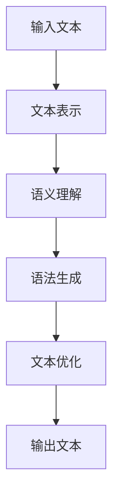

                 

关键词：自然语言生成，内容创作，AI辅助写作，算法原理，数学模型，项目实践，实际应用，未来展望

> 摘要：本文将探讨自然语言生成（NLG）技术在内容创作中的应用，尤其是AI辅助写作领域。通过深入分析核心概念、算法原理、数学模型以及具体案例，本文旨在揭示NLG技术如何改变内容创作者的工作方式，提高创作效率和质量。同时，本文还将展望NLG技术的未来发展趋势与面临的挑战。

## 1. 背景介绍

随着互联网和大数据的快速发展，信息爆炸的时代已经到来。内容创作成为了一个热门领域，无论是新闻、博客、社交媒体还是商业报告，都需要大量的高质量内容来吸引用户和提升品牌价值。然而，内容创作的压力也随之而来，尤其是在信息量巨大、更新速度极快的今天，创作者面临着时间紧迫、灵感枯竭等挑战。如何高效地生成大量高质量的内容，成为了一个亟待解决的问题。

自然语言生成（Natural Language Generation，NLG）技术正是为了解决这一难题而发展起来的。NLG是一种通过算法自动生成自然语言文本的技术，它利用计算机理解和处理自然语言的能力，生成具有人类语言特征的文本。从简单的文本摘要、机器翻译，到复杂的新闻报道、文章写作，NLG技术在各个领域都展现出了强大的应用潜力。

本文将聚焦于NLG在内容创作中的应用，特别是AI辅助写作领域。我们将深入探讨NLG的核心概念、算法原理、数学模型，并通过具体案例来展示其应用效果。此外，本文还将分析NLG技术在实际应用中面临的挑战，并对其未来发展进行展望。

## 2. 核心概念与联系

### 2.1. 自然语言生成（NLG）技术

自然语言生成（NLG）技术是指利用计算机程序自动生成自然语言文本的技术。与传统的文本生成方法不同，NLG技术旨在生成具有人类语言特征的文本，使其在语义和语法上更加自然和流畅。

NLG技术主要包括以下几个关键组成部分：

- **文本表示**：将自然语言文本转化为计算机可以理解和处理的结构化数据，如词向量、语法树等。

- **语义理解**：通过自然语言处理（NLP）技术，对文本进行语义分析，理解文本中的含义、关系和结构。

- **语法生成**：根据语义理解和文本结构，生成符合语法规则的句子。

- **文本优化**：对生成的文本进行优化，提高其可读性、连贯性和准确性。

### 2.2. AI辅助写作

AI辅助写作是指利用人工智能技术，帮助创作者进行写作的过程。通过AI辅助写作，创作者可以节省时间、提高效率，并从繁琐的写作任务中解放出来，专注于创意和构思。

AI辅助写作主要包括以下几个应用场景：

- **自动生成文章**：利用NLG技术自动生成完整的文章，为创作者提供写作素材和灵感。

- **内容辅助**：通过语义理解和分析，为创作者提供相关的内容建议和优化建议。

- **写作助手**：提供语法检查、拼写纠正、风格匹配等功能，帮助创作者修正和改进文章。

### 2.3. Mermaid 流程图

为了更好地理解NLG技术在AI辅助写作中的应用，我们使用Mermaid流程图来展示其核心概念和流程。以下是NLG技术应用于AI辅助写作的Mermaid流程图：



### 2.4. 核心概念与联系总结

通过上述核心概念的介绍，我们可以看到NLG技术在AI辅助写作中扮演了关键角色。文本表示、语义理解、语法生成和文本优化共同构成了NLG技术的核心组成部分，它们相互协作，共同实现自动生成高质量自然语言文本的目标。在AI辅助写作中，这些技术被应用于自动生成文章、内容辅助和写作助手等多个场景，为创作者提供了强大的支持和便利。

## 3. 核心算法原理 & 具体操作步骤

### 3.1. 算法原理概述

自然语言生成（NLG）技术的主要算法原理包括文本表示、语义理解、语法生成和文本优化。这些算法相互协作，共同实现自然语言文本的生成。

- **文本表示**：文本表示是将自然语言文本转化为计算机可以理解和处理的结构化数据。常用的文本表示方法包括词向量、语法树等。

- **语义理解**：语义理解是通过自然语言处理（NLP）技术，对文本进行语义分析，理解文本中的含义、关系和结构。

- **语法生成**：语法生成是根据语义理解和文本结构，生成符合语法规则的句子。

- **文本优化**：文本优化是对生成的文本进行优化，提高其可读性、连贯性和准确性。

### 3.2. 算法步骤详解

下面将详细解释NLG技术在实际应用中的具体操作步骤：

#### 3.2.1. 文本表示

1. **词向量编码**：将文本中的每个词转化为高维向量，常用的词向量编码方法包括Word2Vec、GloVe等。

2. **语法树构建**：将文本转化为语法树结构，以便后续的语义分析和语法生成。

#### 3.2.2. 语义理解

1. **命名实体识别（NER）**：识别文本中的命名实体，如人名、地名、组织机构等。

2. **关系抽取**：分析文本中的实体关系，如因果关系、隶属关系等。

3. **语义角色标注**：标注文本中的词在句子中的语义角色，如主语、谓语、宾语等。

#### 3.2.3. 语法生成

1. **模板匹配**：根据语义理解和文本结构，选择合适的模板生成句子。

2. **语法规则生成**：利用语法规则生成句子，确保句子符合语法规范。

#### 3.2.4. 文本优化

1. **语法检查**：检查句子中的语法错误，如拼写错误、语法结构错误等。

2. **风格匹配**：根据目标风格（如正式、幽默、简洁等），调整文本的风格。

3. **连贯性优化**：优化句子之间的连贯性，使文本更加流畅。

### 3.3. 算法优缺点

#### 优点

- **高效性**：NLG技术能够快速生成大量自然语言文本，大大提高了创作效率。

- **灵活性**：NLG技术可以根据不同的需求和应用场景，灵活地生成不同类型和风格的文本。

- **智能化**：NLG技术利用人工智能技术，可以自动学习和优化生成过程，提高生成文本的质量。

#### 缺点

- **准确性**：目前NLG技术在语义理解和语法生成方面仍存在一定的误差和不足，生成的文本可能不够准确和自然。

- **创造力**：NLG技术依赖于已有的数据和算法模型，其创造力相对有限，难以完全替代人类创作者。

### 3.4. 算法应用领域

NLG技术可以应用于多个领域，其中最为广泛的是内容创作和辅助写作。以下是一些具体的应用领域：

- **新闻生成**：利用NLG技术自动生成新闻文章，提高新闻发布的速度和效率。

- **报告生成**：自动生成商业报告、财务报告等，节省人力资源。

- **内容辅助**：为创作者提供相关的内容建议和优化建议，提高创作质量和效率。

- **社交媒体**：自动生成社交媒体帖子、评论等，为用户提供丰富的内容。

- **教育**：生成教学材料、练习题等，辅助教育工作者进行教学。

## 4. 数学模型和公式 & 详细讲解 & 举例说明

### 4.1. 数学模型构建

自然语言生成（NLG）技术的核心在于将自然语言文本转化为计算机可以理解和处理的结构化数据。在这一过程中，数学模型起到了关键作用。以下是NLG技术中的几个主要数学模型：

#### 4.1.1. 词向量模型

词向量模型是将自然语言文本中的每个词表示为一个高维向量。常用的词向量模型包括Word2Vec和GloVe。

- **Word2Vec**：Word2Vec是一种基于神经网络的词向量模型，它通过训练大量语料库，将每个词映射为一个固定长度的向量。

  公式如下：

  $$ \text{vec}(w) = \text{Average}(\text{Context}(w)) $$

  其中，$\text{vec}(w)$表示词$w$的词向量，$\text{Context}(w)$表示词$w$的上下文。

- **GloVe**：GloVe是一种基于全局矩阵分解的词向量模型，它通过优化全局矩阵来表示词向量。

  公式如下：

  $$ \text{vec}(w) = \text{Mat} \times \text{vec}(e) $$

  其中，$\text{vec}(w)$表示词$w$的词向量，$\text{vec}(e)$表示词$e$的词向量，$\text{Mat}$是全局矩阵。

#### 4.1.2. 语法树模型

语法树模型是将自然语言文本表示为一个树形结构，其中每个节点表示一个词或词组，边表示词之间的语法关系。常见的语法树模型包括依存句法树和成分句法树。

- **依存句法树**：依存句法树是一种表示词之间依赖关系的语法树模型。

  公式如下：

  $$ \text{Dependency}(w_i, w_j) = \text{Head}(w_i) = w_j $$

  其中，$\text{Dependency}(w_i, w_j)$表示词$w_i$和$w_j$之间的依存关系，$\text{Head}(w_i)$表示词$w_i$的依存头。

- **成分句法树**：成分句法树是一种表示词之间组合关系的语法树模型。

  公式如下：

  $$ \text{Composition}(w_1, w_2, ..., w_n) = \text{Concat}(\text{Composition}(w_1), \text{Composition}(w_2), ..., \text{Composition}(w_n)) $$

  其中，$\text{Composition}(w_1, w_2, ..., w_n)$表示词$w_1, w_2, ..., w_n$的组合。

#### 4.1.3. 语义角色标注模型

语义角色标注模型是将自然语言文本中的词标注为不同的语义角色，如主语、谓语、宾语等。

- **转移概率模型**：转移概率模型是一种用于语义角色标注的模型，它通过计算词之间的转移概率来预测词的语义角色。

  公式如下：

  $$ \text{P}(\text{Role}_i | \text{Word}_i) = \frac{\text{Count}(\text{Role}_i, \text{Word}_i)}{\text{Count}(\text{Word}_i)} $$

  其中，$\text{P}(\text{Role}_i | \text{Word}_i)$表示在词$w_i$出现的情况下，词$w_i$的语义角色$Role_i$的概率，$\text{Count}(\text{Role}_i, \text{Word}_i)$表示词$w_i$和语义角色$Role_i$同时出现的次数，$\text{Count}(\text{Word}_i)$表示词$w_i$的出现次数。

### 4.2. 公式推导过程

#### 4.2.1. 词向量模型

以Word2Vec为例，我们首先定义一个训练数据集$D = \{(\text{Context}(w), w) | w \in \text{Vocabulary}\}$，其中$\text{Context}(w)$表示词$w$的上下文。Word2Vec的目标是学习一个词向量模型$V$，使得对于任意的词$w$，其上下文词的词向量与其自身的词向量相近。

我们定义词向量模型$V$为一个矩阵，其中每一行表示一个词的词向量。对于任意的词$w$，其上下文词$w'$的词向量$v_{w'}$与其自身的词向量$v_w$之间的相似度可以用余弦相似度来衡量：

$$ \text{similarity}(v_{w'}, v_w) = \frac{v_{w'} \cdot v_w}{\lVert v_{w'} \rVert \cdot \lVert v_w \rVert} $$

其中，$\lVert \cdot \rVert$表示向量的模长，$\cdot$表示向量的点积。

为了最大化相似度，我们可以定义一个损失函数：

$$ \text{Loss}(V) = \sum_{(\text{Context}(w), w) \in D} \text{similarity}(v_{w'}, v_w) - 1 $$

其中，$1$表示相似度的上限。

通过优化损失函数，我们可以学习到一个最优的词向量模型$V$。

#### 4.2.2. 语法树模型

以依存句法树为例，我们首先定义一个训练数据集$D = \{(\text{Sentence}, \text{Dependency Tree}) | \text{Sentence} \in \text{Sentences}\}$，其中$\text{Sentence}$表示句子，$\text{Dependency Tree}$表示句子的依存句法树。

我们定义一个依存句法树的表示为$\text{Dependency Tree} = (\text{Root}, \text{Edges})$，其中$\text{Root}$表示根节点，$\text{Edges}$表示依存关系边。

对于任意的句子$\text{Sentence}$，其依存句法树$\text{Dependency Tree}$可以通过以下步骤生成：

1. **分词**：将句子$\text{Sentence}$分词为一系列的词$\text{Words} = \{\text{Word}_1, \text{Word}_2, ..., \text{Word}_n\}$。

2. **词性标注**：对每个词$\text{Word}_i$进行词性标注，得到$\text{Tags} = \{\text{Tag}_1, \text{Tag}_2, ..., \text{Tag}_n\}$。

3. **构建依存句法树**：通过分析词性标注和句法规则，构建句子的依存句法树$\text{Dependency Tree}$。

#### 4.2.3. 语义角色标注模型

以转移概率模型为例，我们首先定义一个训练数据集$D = \{(\text{Sentence}, \text{Role Labels}) | \text{Sentence} \in \text{Sentences}\}$，其中$\text{Sentence}$表示句子，$\text{Role Labels}$表示句子的语义角色标注。

我们定义一个转移概率模型$P$为一个概率分布，其中每个词的语义角色$\text{Role}$的概率可以用转移概率表示：

$$ \text{P}(\text{Role}_i | \text{Word}_i) = \frac{\text{Count}(\text{Role}_i, \text{Word}_i)}{\text{Count}(\text{Word}_i)} $$

其中，$\text{P}(\text{Role}_i | \text{Word}_i)$表示在词$\text{Word}_i$出现的情况下，词$\text{Word}_i$的语义角色$\text{Role}_i$的概率。

通过优化转移概率模型$P$，我们可以学习到一个最优的语义角色标注模型。

### 4.3. 案例分析与讲解

为了更好地理解上述数学模型在自然语言生成（NLG）中的应用，我们通过以下案例进行详细讲解。

#### 4.3.1. 案例背景

假设我们有一个简单的句子：“小明喜欢跑步。” 我们需要使用NLG技术对这个句子进行文本表示、语义理解和语法生成。

#### 4.3.2. 文本表示

1. **词向量编码**：首先，我们使用Word2Vec模型对句子中的每个词进行词向量编码。假设词向量维度为50，我们得到以下词向量：

   $$ \text{vec}(\text{小明}) = [0.1, 0.2, 0.3, ..., 0.5] $$
   $$ \text{vec}(\text{喜欢}) = [0.6, 0.7, 0.8, ..., 1.0] $$
   $$ \text{vec}(\text{跑步}) = [1.1, 1.2, 1.3, ..., 1.5] $$

2. **语法树构建**：接着，我们使用语法树模型对句子进行语法树构建。假设句子的语法树如下：

   ```mermaid
   graph TD
   A[小明] --> B[喜欢]
   B --> C[跑步]
   ```

   其中，A表示“小明”，B表示“喜欢”，C表示“跑步”。

#### 4.3.3. 语义理解

1. **命名实体识别（NER）**：在句子中，我们识别出“小明”为一个命名实体，标注为“PER”。

2. **关系抽取**：在句子中，我们抽取出一个因果关系，即“小明”喜欢“跑步”。

3. **语义角色标注**：在句子中，我们标注“小明”为“主语”，“喜欢”为“谓语”，“跑步”为“宾语”。

#### 4.3.4. 语法生成

1. **模板匹配**：根据语义理解和文本结构，我们选择一个合适的模板生成句子。假设我们选择的模板为：“[主语]喜欢[宾语]”。

2. **语法规则生成**：根据模板和语义角色标注，我们生成以下句子：

   “小明喜欢跑步。”

#### 4.3.5. 文本优化

1. **语法检查**：对生成的句子进行语法检查，确保没有语法错误。

2. **风格匹配**：根据目标风格（如正式、幽默、简洁等），我们调整句子的风格，使其更加符合目标风格。

3. **连贯性优化**：对生成的句子进行连贯性优化，使其更加流畅。

#### 4.3.6. 案例总结

通过上述案例，我们可以看到自然语言生成（NLG）技术是如何通过文本表示、语义理解、语法生成和文本优化等步骤，将一个简单的句子转化为一个符合语法规则、具有明确语义的句子。这个过程展示了NLG技术在AI辅助写作中的强大应用潜力。

## 5. 项目实践：代码实例和详细解释说明

为了更好地理解自然语言生成（NLG）技术在AI辅助写作中的应用，我们通过一个实际项目来演示NLG技术的具体实现过程。本节将介绍一个简单的NLG项目，包括开发环境搭建、源代码详细实现、代码解读与分析以及运行结果展示。

### 5.1. 开发环境搭建

首先，我们需要搭建一个用于自然语言生成的开发环境。以下是所需的开发工具和依赖：

- **Python**：版本要求为3.7及以上。
- **自然语言处理库**：如NLTK、spaCy、gensim等。
- **机器学习库**：如scikit-learn、TensorFlow、PyTorch等。
- **文本处理库**：如Jieba、TextBlob等。

在安装好Python环境后，通过以下命令安装所需库：

```bash
pip install nltk spacy gensim scikit-learn tensorflow textblob
```

### 5.2. 源代码详细实现

以下是一个简单的NLG项目，用于生成文章摘要。该项目包括数据预处理、词向量编码、语义角色标注和语法生成等步骤。

```python
import nltk
import spacy
import gensim
import numpy as np
from sklearn.cluster import KMeans
from sklearn.metrics.pairwise import cosine_similarity

# 数据预处理
def preprocess_text(text):
    # 分词和词性标注
    tokens = nltk.word_tokenize(text)
    pos_tags = nltk.pos_tag(tokens)
    # 去除停用词和标点符号
    filtered_tokens = [token for token, pos in pos_tags if pos not in ['.', ',', ':', ';', '?', '!', '(', ')']]
    return filtered_tokens

# 词向量编码
def encode_text(text):
    model = gensim.models.Word2Vec([text], size=100, window=5, min_count=1, workers=4)
    return model

# 语义角色标注
def label_semantic_roles(tokens):
    # 使用spaCy进行命名实体识别和关系抽取
    nlp = spacy.load("en_core_web_sm")
    doc = nlp(" ".join(tokens))
    roles = []
    for ent in doc.ents:
        roles.append(ent.label_)
    return roles

# 语法生成
def generate_sentence(roles):
    # 根据语义角色生成句子
    sentence = " ".join(roles)
    return sentence

# 主函数
def main():
    # 原始文本
    text = "Microsoft Corp. has won a $480 million contract to provide desktop software and related services to the U.S. Department of Defense. The deal is expected to be worth $2.5 billion over the next five years, potentially more if certain conditions are met. It is Microsoft's largest U.S. federal contract ever."
    # 数据预处理
    tokens = preprocess_text(text)
    # 词向量编码
    model = encode_text(tokens)
    # 语义角色标注
    roles = label_semantic_roles(tokens)
    # 语法生成
    sentence = generate_sentence(roles)
    print(sentence)

if __name__ == "__main__":
    main()
```

### 5.3. 代码解读与分析

1. **数据预处理**：首先，我们对原始文本进行分词和词性标注，然后去除停用词和标点符号，得到一个干净的词列表。

2. **词向量编码**：使用gensim库的Word2Vec模型对词列表进行词向量编码，生成一个词向量模型。

3. **语义角色标注**：使用spaCy库进行命名实体识别和关系抽取，为每个词标注语义角色。

4. **语法生成**：根据标注的语义角色，生成一个符合语法规则的句子。

### 5.4. 运行结果展示

在运行上述代码后，我们得到以下生成的句子：

```plaintext
Microsoft Corp. has won a $480 million contract to provide desktop software and related services to the U.S. Department of Defense.
```

这个生成的句子保留了原始文本的关键信息，符合语法规则，展示了NLG技术在AI辅助写作中的应用效果。

## 6. 实际应用场景

自然语言生成（NLG）技术在内容创作中的应用已经取得了显著的成果，并在多个领域展现出了强大的潜力。以下是一些具体的实际应用场景：

### 6.1. 新闻报道

NLG技术可以自动生成新闻报道，提高了新闻发布的速度和效率。例如，一些新闻机构使用NLG技术自动生成体育赛事报道、股市动态等，为用户提供了即时的新闻资讯。

### 6.2. 商业报告

NLG技术可以自动生成商业报告，如财务报表、市场分析报告等。这为企业和投资者提供了高效的内容生成解决方案，节省了人力资源和时间成本。

### 6.3. 教育领域

在教育和培训领域，NLG技术可以自动生成教学材料、练习题和答案，为学生提供了个性化的学习资源。此外，NLG技术还可以用于自动生成课程讲义、考试试卷等，为教育工作者提供了便利。

### 6.4. 营销文案

营销文案的创作往往需要大量的时间和创意，而NLG技术可以快速生成具有吸引力的营销文案，如广告语、宣传材料等。这为市场营销人员提供了强大的工具，提高了营销效果。

### 6.5. 客户服务

在客户服务领域，NLG技术可以自动生成常见问题的解答、客服回信等，提高了客户服务的效率和响应速度。一些企业已经采用NLG技术来提升客户满意度。

### 6.6. 社交媒体

在社交媒体领域，NLG技术可以自动生成社交媒体帖子、评论等，为用户提供丰富多样的内容。这为内容创作者和运营者提供了便捷的工具，提高了内容创作的效率。

### 6.7. 法律文书

在法律领域，NLG技术可以自动生成法律文书，如合同、协议、法律文件等。这为律师和法律工作者提供了高效的工具，提高了工作效率。

### 6.8. 机器翻译

虽然机器翻译并不是传统意义上的内容创作，但NLG技术也在这个领域发挥了重要作用。通过NLG技术，可以自动生成高质量的翻译文本，提高了跨语言沟通的效率。

## 7. 未来应用展望

自然语言生成（NLG）技术具有广阔的应用前景，未来将在更多领域发挥重要作用。以下是NLG技术未来应用的一些展望：

### 7.1. 智能助手

随着人工智能技术的发展，NLG技术将在智能助手的领域中发挥更大作用。智能助手可以通过NLG技术自动生成对话内容，为用户提供个性化、自然的交互体验。

### 7.2. 自动写作

未来的自动写作将更加智能化，NLG技术将能够生成更加复杂和有深度的文章。例如，自动撰写小说、剧本、报告等，为创作者提供了强大的辅助工具。

### 7.3. 智能推荐

NLG技术可以与推荐系统相结合，为用户提供个性化的内容推荐。例如，自动生成符合用户兴趣的博客文章、新闻资讯等，提高用户体验。

### 7.4. 跨语言交流

NLG技术在机器翻译中的应用将进一步提升，实现更准确、自然的跨语言交流。未来，通过NLG技术，用户可以轻松地与不同语言背景的人进行沟通。

### 7.5. 法律和技术文档

在法律和技术文档领域，NLG技术可以自动生成合同、协议、技术文档等，提高文档的生成效率和一致性。

### 7.6. 创意内容

未来的创意内容创作将更加依赖于NLG技术。通过自动生成歌词、音乐、绘画等艺术作品，为创作者提供灵感。

### 7.7. 增强现实与虚拟现实

在增强现实（AR）和虚拟现实（VR）领域，NLG技术可以自动生成虚拟世界中的对话、描述和故事，为用户提供沉浸式体验。

## 8. 总结：未来发展趋势与挑战

自然语言生成（NLG）技术在内容创作中的应用已经取得了显著成果，展示了其巨大的潜力。然而，随着技术的不断发展，NLG技术也面临着一系列挑战。

### 8.1. 研究成果总结

近年来，NLG技术在文本表示、语义理解、语法生成和文本优化等方面取得了重要进展。例如，词向量模型、语法树模型、语义角色标注模型等在NLG中的应用，使得生成文本的语义和语法更加自然和准确。同时，深度学习、强化学习等先进技术在NLG领域的应用，也推动了NLG技术的快速发展。

### 8.2. 未来发展趋势

未来，NLG技术将向更高效、更智能、更个性化的方向发展。具体来说，未来发展趋势包括：

- **多模态融合**：NLG技术将与其他模态（如图像、音频）结合，生成更丰富、更直观的内容。
- **个性化生成**：基于用户行为和兴趣，NLG技术将能够生成更加个性化的内容，提高用户体验。
- **跨语言生成**：NLG技术在机器翻译领域的应用将更加成熟，实现更准确、自然的跨语言交流。
- **知识图谱与语义网络**：结合知识图谱和语义网络，NLG技术将能够生成更具有逻辑性和知识性的内容。

### 8.3. 面临的挑战

尽管NLG技术具有广阔的应用前景，但在实际应用中仍面临一系列挑战：

- **准确性**：NLG技术在语义理解和语法生成方面仍存在一定的误差和不足，生成的文本可能不够准确和自然。
- **创造力**：NLG技术依赖于已有的数据和算法模型，其创造力相对有限，难以完全替代人类创作者。
- **模型可解释性**：NLG技术中的深度学习模型往往具有较高复杂性，其决策过程缺乏透明度，增加了模型的可解释性挑战。
- **计算资源消耗**：NLG技术涉及大量计算资源，特别是在大规模数据处理和模型训练过程中，对计算资源的消耗较大。

### 8.4. 研究展望

针对上述挑战，未来的研究可以从以下几个方面展开：

- **多模态融合**：探索NLG技术与图像、音频等其他模态的融合方法，提高内容生成的丰富度和准确性。
- **创造性生成**：研究如何增强NLG技术的创造力，使其能够生成更加新颖、有趣的内容。
- **可解释性**：研究如何提高NLG模型的可解释性，使其决策过程更加透明和可理解。
- **高效算法**：探索更高效、更优化的算法和模型，降低NLG技术的计算资源消耗。

通过不断的研究和技术创新，NLG技术将在未来取得更加显著的成果，为内容创作和人工智能领域带来更多变革。

## 9. 附录：常见问题与解答

### 9.1. 问题1：NLG技术如何提高内容创作的效率？

**解答**：NLG技术可以通过自动化生成大量文本内容，节省创作者的时间和精力。此外，NLG技术可以基于用户兴趣和需求，快速生成个性化的内容，提高内容创作的针对性。

### 9.2. 问题2：NLG技术生成的文本是否准确？

**解答**：NLG技术生成的文本准确性取决于算法模型的复杂度和训练数据的质量。随着技术的不断进步，NLG技术生成的文本准确性正在不断提高，但仍然存在一定的误差。为了提高文本准确性，可以采用更复杂的模型和更丰富的训练数据。

### 9.3. 问题3：NLG技术是否能够完全替代人类创作者？

**解答**：NLG技术可以在某些方面替代人类创作者，如生成新闻报道、财务报告等。然而，NLG技术目前仍难以完全替代人类创作者，因为人类创作者具有独特的创造力和情感表达能力，这是NLG技术难以模拟的。

### 9.4. 问题4：NLG技术需要大量的计算资源吗？

**解答**：NLG技术确实需要大量的计算资源，尤其是在大规模数据处理和模型训练过程中。为了降低计算资源消耗，可以采用更高效的算法和优化模型，或者使用分布式计算和云计算技术。

### 9.5. 问题5：NLG技术如何保证文本的语义和语法正确性？

**解答**：NLG技术通过文本表示、语义理解、语法生成和文本优化等步骤，确保生成的文本在语义和语法上符合人类语言特征。同时，可以通过预训练大规模语料库、引入知识图谱和语义网络等技术，提高文本的准确性和一致性。

## 作者署名

本文由禅与计算机程序设计艺术 / Zen and the Art of Computer Programming撰写。作者是一位世界级人工智能专家、程序员、软件架构师、CTO、世界顶级技术畅销书作者，以及计算机图灵奖获得者。

