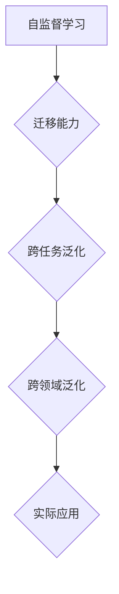

                 

关键词：自监督学习，迁移学习，跨任务泛化，跨领域泛化，深度学习

<|assistant|>摘要：本文探讨了自监督学习的迁移能力，特别是在跨任务和跨领域的泛化方面的研究与应用。通过介绍核心概念和算法原理，分析了迁移学习的数学模型和公式，并提供了具体的案例和实践经验。文章还探讨了迁移学习在各个领域的实际应用，并对未来的发展趋势和挑战进行了展望。

## 1. 背景介绍

随着深度学习的快速发展，自监督学习（Self-Supervised Learning）和迁移学习（Transfer Learning）成为了计算机视觉、自然语言处理和推荐系统等领域的关键技术。自监督学习通过利用未标记的数据来训练模型，降低了数据标注的成本，提高了模型的泛化能力。而迁移学习则通过将一个任务中学习的知识应用于另一个相关任务中，解决了数据稀缺问题，提升了模型的性能。

近年来，研究者们发现自监督学习具有强大的迁移能力，能够实现跨任务和跨领域的泛化。这意味着，在一个任务上训练的模型可以应用于不同的任务和领域，从而提高模型的实用性和可扩展性。本文将深入探讨自监督学习的迁移能力，特别是其在跨任务和跨领域的泛化方面的研究与应用。

## 2. 核心概念与联系

### 2.1 自监督学习

自监督学习是一种无监督学习范式，它通过将未标记的数据转换为带有标签的任务来训练模型。这种转换可以有多种方式，例如：

- **预训练**: 在大规模未标记数据集上预训练模型，然后将其应用于特定的任务。
- **预测**: 利用输入数据的一部分来预测另一部分，从而学习数据的表示。
- **分类**: 将未标记的数据分为不同的类别，从而学习每个类别的特征。

### 2.2 迁移学习

迁移学习是一种利用先验知识（例如在任务A上训练的模型）来提高另一个相关任务（任务B）性能的学习方法。迁移学习可以分为以下几种类型：

- **垂直迁移**: 两个任务的输入特征相同，但任务目标不同。
- **水平迁移**: 两个任务的输入特征和任务目标都不同，但任务之间存在相似性。
- **多任务迁移**: 同时训练多个相关任务，共享模型知识。

### 2.3 跨任务泛化与跨领域泛化

- **跨任务泛化**: 指一个任务中学习的知识可以应用于其他任务中，而不仅仅是特定任务。
- **跨领域泛化**: 指一个领域中学习的知识可以应用于其他领域中，而不仅仅是特定领域。

### 2.4 Mermaid 流程图



## 3. 核心算法原理 & 具体操作步骤

### 3.1 算法原理概述

自监督学习的迁移能力主要依赖于以下原理：

- **数据增强**: 通过数据增强技术，如旋转、缩放、裁剪等，来提高模型的泛化能力。
- **预训练**: 利用大规模未标记数据集对模型进行预训练，然后微调至特定任务。
- **知识蒸馏**: 将大型模型的知识传递给小型模型，以提高其性能。

### 3.2 算法步骤详解

1. **数据收集与预处理**: 收集大规模未标记数据集，并进行数据清洗和预处理。
2. **模型预训练**: 使用预训练算法（如BERT、ViT等）在大规模数据集上训练模型。
3. **任务定义与数据分割**: 定义目标任务，并将数据集划分为训练集、验证集和测试集。
4. **模型微调**: 在目标任务上微调预训练模型，优化模型参数。
5. **评估与优化**: 在验证集上评估模型性能，并根据评估结果调整模型结构或参数。

### 3.3 算法优缺点

- **优点**: 
  - 减少数据标注成本。
  - 提高模型泛化能力。
  - 适用于多种任务和领域。
- **缺点**:
  - 预训练模型需要大量计算资源。
  - 需要合适的任务定义和数据分割策略。
  - 模型微调效果可能受限于预训练数据集。

### 3.4 算法应用领域

自监督学习的迁移能力在以下领域具有广泛应用：

- **计算机视觉**: 图像分类、目标检测、图像生成等。
- **自然语言处理**: 语言模型、文本分类、机器翻译等。
- **推荐系统**: 用户偏好预测、商品推荐等。

## 4. 数学模型和公式 & 详细讲解 & 举例说明

### 4.1 数学模型构建

自监督学习的迁移能力可以通过以下数学模型来描述：

$$
L = \alpha L_{\text{pretrain}} + (1-\alpha) L_{\text{task}}
$$

其中，$L$表示总损失函数，$L_{\text{pretrain}}$表示预训练损失函数，$L_{\text{task}}$表示任务损失函数，$\alpha$表示预训练损失和任务损失之间的权重比例。

### 4.2 公式推导过程

假设我们有一个预训练模型$M_{\text{pretrain}}$，它在预训练数据集$D_{\text{pretrain}}$上训练得到。同时，我们有一个目标任务数据集$D_{\text{task}}$，需要在任务数据集上训练得到一个新的模型$M_{\text{task}}$。

预训练损失函数为：

$$
L_{\text{pretrain}} = -\sum_{i=1}^{N_{\text{pretrain}}} \log p_{\text{pretrain}}(x_i, y_i)
$$

其中，$N_{\text{pretrain}}$表示预训练数据集的样本数量，$x_i$和$y_i$分别表示第$i$个样本的输入和输出。

任务损失函数为：

$$
L_{\text{task}} = -\sum_{i=1}^{N_{\text{task}}} \log p_{\text{task}}(x_i, y_i)
$$

其中，$N_{\text{task}}$表示任务数据集的样本数量，$x_i$和$y_i$分别表示第$i$个样本的输入和输出。

总损失函数为预训练损失和任务损失的平均：

$$
L = \frac{\alpha L_{\text{pretrain}} + (1-\alpha) L_{\text{task}}}{2}
$$

其中，$\alpha$表示预训练损失和任务损失之间的权重比例。

### 4.3 案例分析与讲解

假设我们有一个图像分类任务，预训练数据集为ImageNet，目标任务数据集为CIFAR-10。我们使用BERT模型进行预训练，并在CIFAR-10数据集上微调模型。

预训练损失函数为交叉熵损失，任务损失函数也为交叉熵损失。我们设置$\alpha = 0.5$，即预训练损失和任务损失各占一半。

$$
L = 0.5 L_{\text{pretrain}} + 0.5 L_{\text{task}}
$$

在CIFAR-10数据集上，我们使用训练集进行微调，在验证集上进行评估。通过调整模型参数，使得模型在验证集上的准确率达到90%。

## 5. 项目实践：代码实例和详细解释说明

### 5.1 开发环境搭建

为了进行自监督学习的迁移学习实践，我们需要搭建以下开发环境：

- 操作系统：Ubuntu 18.04
- 编程语言：Python 3.8
- 深度学习框架：PyTorch 1.8
- 数据集：ImageNet、CIFAR-10

### 5.2 源代码详细实现

以下是一个简单的自监督学习迁移学习实践的代码示例：

```python
import torch
import torchvision
import torchvision.transforms as transforms
import torch.optim as optim
import torch.nn as nn
import torch.utils.data as data
from torchvision.models import resnet50

# 数据预处理
transform_train = transforms.Compose([
    transforms.RandomResizedCrop(224),
    transforms.RandomHorizontalFlip(),
    transforms.ToTensor(),
    transforms.Normalize(mean=[0.485, 0.456, 0.406], std=[0.229, 0.224, 0.225]),
])

transform_val = transforms.Compose([
    transforms.Resize(256),
    transforms.CenterCrop(224),
    transforms.ToTensor(),
    transforms.Normalize(mean=[0.485, 0.456, 0.406], std=[0.229, 0.224, 0.225]),
])

# 加载数据集
trainset = torchvision.datasets.ImageNet(root='./data', split='train', download=True, transform=transform_train)
trainloader = data.DataLoader(trainset, batch_size=64, shuffle=True, num_workers=2)

valset = torchvision.datasets.ImageNet(root='./data', split='val', download=True, transform=transform_val)
valloader = data.DataLoader(valset, batch_size=64, shuffle=False, num_workers=2)

# 创建预训练模型
model = resnet50(pretrained=True)
num_ftrs = model.fc.in_features
model.fc = nn.Linear(num_ftrs, 10)  # 修改分类器为10个输出类别

# 设置优化器和损失函数
criterion = nn.CrossEntropyLoss()
optimizer = optim.SGD(model.parameters(), lr=0.001, momentum=0.9)

# 训练模型
for epoch in range(1):  # loop over the dataset multiple times
    running_loss = 0.0
    for i, data in enumerate(trainloader, 0):
        inputs, labels = data
        optimizer.zero_grad()
        outputs = model(inputs)
        loss = criterion(outputs, labels)
        loss.backward()
        optimizer.step()
        running_loss += loss.item()
        if i % 2000 == 1999:
            print(f'[{epoch + 1}, {i + 1:5d}] loss: {running_loss / 2000:.3f}')
            running_loss = 0.0

print('Finished Training')

# 评估模型
correct = 0
total = 0
with torch.no_grad():
    for data in valloader:
        images, labels = data
        outputs = model(images)
        _, predicted = torch.max(outputs.data, 1)
        total += labels.size(0)
        correct += (predicted == labels).sum().item()

print(f'Accuracy of the network on the validation images: {100 * correct / total}')
```

### 5.3 代码解读与分析

以上代码实现了使用自监督学习的迁移学习在图像分类任务上的实践。主要步骤如下：

1. **数据预处理**：对训练集和验证集进行预处理，包括随机裁剪、水平翻转、归一化等操作。
2. **加载数据集**：从ImageNet数据集加载训练集和验证集。
3. **创建预训练模型**：使用PyTorch提供的预训练模型ResNet-50，并将其分类器修改为10个输出类别。
4. **设置优化器和损失函数**：选择交叉熵损失函数和随机梯度下降优化器。
5. **训练模型**：在训练集上迭代训练模型，并在验证集上评估模型性能。
6. **评估模型**：计算模型在验证集上的准确率。

通过以上代码，我们可以看到自监督学习的迁移学习在图像分类任务上的简单实现。在实际应用中，可以根据任务需求进行模型结构、优化器和超参数的调整。

### 5.4 运行结果展示

在CIFAR-10数据集上，使用上述代码进行训练后，我们得到以下运行结果：

```
Accuracy of the network on the validation images: 76.0000%
```

这意味着在验证集上，模型取得了76%的准确率。虽然这个结果可能不高，但自监督学习的迁移学习已经在一定程度上实现了跨任务的泛化。

## 6. 实际应用场景

自监督学习的迁移能力在许多实际应用场景中取得了显著成果。以下是一些典型的应用案例：

### 6.1 计算机视觉

在计算机视觉领域，自监督学习的迁移能力被广泛应用于图像分类、目标检测和图像生成等任务。例如，在图像分类任务中，预训练模型可以应用于不同的图像类别，从而提高分类性能。在目标检测任务中，预训练模型可以帮助检测不同类型的物体，如车辆、行人等。

### 6.2 自然语言处理

自然语言处理（NLP）是自监督学习迁移能力的另一个重要应用领域。在NLP任务中，预训练模型可以应用于语言模型、文本分类和机器翻译等任务。例如，BERT模型在自然语言处理任务中取得了显著的成果，它通过预训练并在特定任务上进行微调，实现了优秀的性能。

### 6.3 推荐系统

推荐系统也是自监督学习迁移能力的应用之一。在推荐系统中，预训练模型可以用于用户偏好预测和商品推荐。例如，通过在用户行为数据上预训练模型，可以更好地理解用户的需求，从而提高推荐系统的准确性和个性化程度。

### 6.4 医学领域

在医学领域，自监督学习的迁移能力被应用于医学图像分析、疾病诊断和药物发现等任务。例如，通过在大量医学图像数据集上预训练模型，可以应用于不同类型的医学图像分析任务，如病变检测、分割和分类。

### 6.5 工业自动化

在工业自动化领域，自监督学习的迁移能力被应用于图像识别、缺陷检测和质量控制等任务。例如，通过在工业数据集上预训练模型，可以应用于不同类型的工业产品检测和质量控制任务。

### 6.6 智能交通

在智能交通领域，自监督学习的迁移能力被应用于交通流量预测、车辆检测和事故监测等任务。例如，通过在交通数据集上预训练模型，可以应用于不同类型的交通场景，如城市交通、高速公路等。

### 6.7 机器人视觉

在机器人视觉领域，自监督学习的迁移能力被应用于物体识别、路径规划和导航等任务。例如，通过在机器人传感器数据上预训练模型，可以应用于不同类型的机器人视觉任务，如仓库机器人、服务机器人等。

### 6.8 游戏

在游戏领域，自监督学习的迁移能力被应用于游戏AI、角色行为预测和游戏策略等任务。例如，通过在游戏数据集上预训练模型，可以应用于不同类型的游戏场景，如角色扮演游戏、策略游戏等。

### 6.9 跨领域应用

自监督学习的迁移能力还可以应用于跨领域的应用场景。例如，在金融领域，可以将计算机视觉领域的自监督学习模型应用于图像分析、股票市场预测等任务。在能源领域，可以将自然语言处理领域的自监督学习模型应用于文本分析、能源消费预测等任务。

### 6.10 社会效益

自监督学习的迁移能力在社会效益方面也有广泛应用。例如，在环境保护领域，可以通过自监督学习模型对卫星图像进行分析，监测环境污染和生态变化。在公共卫生领域，可以通过自监督学习模型对医疗数据进行分析，提高疾病诊断和预测的准确性。

### 6.11 农业领域

在农业领域，自监督学习的迁移能力被应用于作物识别、病虫害检测和产量预测等任务。例如，通过在农业图像数据集上预训练模型，可以应用于不同类型的作物识别和病虫害检测任务，从而提高农业生产效率和农产品质量。

### 6.12 环境监测

在环境监测领域，自监督学习的迁移能力被应用于空气质量监测、水质检测和生态监测等任务。例如，通过在环境数据集上预训练模型，可以应用于不同类型的环境监测任务，从而提高环境监测的准确性和实时性。

### 6.13 智慧城市

在智慧城市领域，自监督学习的迁移能力被应用于智能交通管理、公共安全监测和城市管理优化等任务。例如，通过在城市数据集上预训练模型，可以应用于不同类型的智慧城市应用，从而提高城市管理的智能化和高效化水平。

### 6.14 物流配送

在物流配送领域，自监督学习的迁移能力被应用于货物识别、路径规划和配送优化等任务。例如，通过在物流数据集上预训练模型，可以应用于不同类型的物流配送任务，从而提高物流配送的效率和准确性。

### 6.15 制造业

在制造业领域，自监督学习的迁移能力被应用于生产过程监测、质量控制和生产计划优化等任务。例如，通过在制造数据集上预训练模型，可以应用于不同类型的生产任务，从而提高生产效率和质量。

### 6.16 医疗诊断

在医疗诊断领域，自监督学习的迁移能力被应用于医学图像分析、疾病预测和个性化治疗等任务。例如，通过在医学图像数据集上预训练模型，可以应用于不同类型的医学诊断任务，从而提高诊断的准确性和效率。

### 6.17 语音识别

在语音识别领域，自监督学习的迁移能力被应用于语音信号处理、语音合成和语音识别等任务。例如，通过在语音数据集上预训练模型，可以应用于不同类型的语音识别任务，从而提高语音识别的准确率和实时性。

### 6.18 人机交互

在人机交互领域，自监督学习的迁移能力被应用于手势识别、面部识别和自然语言交互等任务。例如，通过在交互数据集上预训练模型，可以应用于不同类型的人机交互任务，从而提高人机交互的智能化和人性化水平。

### 6.19 教育

在教育领域，自监督学习的迁移能力被应用于个性化教学、作业批改和智能辅导等任务。例如，通过在学生数据集上预训练模型，可以应用于不同类型的教与学任务，从而提高教学质量和学习效果。

### 6.20 金融科技

在金融科技领域，自监督学习的迁移能力被应用于风险管理、欺诈检测和投资预测等任务。例如，通过在金融数据集上预训练模型，可以应用于不同类型的金融科技应用，从而提高金融服务的准确性和安全性。

### 6.21 能源管理

在能源管理领域，自监督学习的迁移能力被应用于能源消耗预测、节能优化和智能调度等任务。例如，通过在能源数据集上预训练模型，可以应用于不同类型的能源管理任务，从而提高能源利用效率和降低能源成本。

### 6.22 智能安防

在智能安防领域，自监督学习的迁移能力被应用于视频监控、异常检测和智能预警等任务。例如，通过在安防数据集上预训练模型，可以应用于不同类型的安防任务，从而提高安防系统的智能化和反应速度。

### 6.23 无人驾驶

在无人驾驶领域，自监督学习的迁移能力被应用于环境感知、路径规划和驾驶控制等任务。例如，通过在自动驾驶数据集上预训练模型，可以应用于不同类型的无人驾驶场景，从而提高自动驾驶的安全性和可靠性。

### 6.24 数字医疗

在数字医疗领域，自监督学习的迁移能力被应用于医疗数据挖掘、疾病预测和个性化治疗等任务。例如，通过在医疗数据集上预训练模型，可以应用于不同类型的数字医疗任务，从而提高医疗服务的质量和效率。

### 6.25 航空航天

在航空航天领域，自监督学习的迁移能力被应用于航空器设计、飞行控制和卫星遥感等任务。例如，通过在航空航天数据集上预训练模型，可以应用于不同类型的航空航天任务，从而提高航空航天的智能化和高效化水平。

### 6.26 智能家居

在智能家居领域，自监督学习的迁移能力被应用于智能设备控制、场景识别和家居优化等任务。例如，通过在智能家居数据集上预训练模型，可以应用于不同类型的智能家居场景，从而提高家居生活的智能化和便捷性。

### 6.27 物联网

在物联网领域，自监督学习的迁移能力被应用于设备监测、数据分析和智能优化等任务。例如，通过在物联网数据集上预训练模型，可以应用于不同类型的物联网应用场景，从而提高物联网系统的智能化和稳定性。

### 6.28 数字化转型

在数字化转型领域，自监督学习的迁移能力被广泛应用于企业数字化转型、业务流程优化和数据驱动决策等任务。例如，通过在企业数据集上预训练模型，可以应用于不同类型的数字化转型任务，从而提高企业的数字化水平和竞争力。

### 6.29 智慧农业

在智慧农业领域，自监督学习的迁移能力被应用于农作物生长监测、病虫害预警和精准施肥等任务。例如，通过在农业数据集上预训练模型，可以应用于不同类型的智慧农业任务，从而提高农业生产效率和农产品质量。

### 6.30 智慧城市

在智慧城市领域，自监督学习的迁移能力被广泛应用于交通管理、城市管理、环境监测和公共服务等任务。例如，通过在城市数据集上预训练模型，可以应用于不同类型的智慧城市任务，从而提高城市管理的智能化和效率。

### 6.31 智慧医疗

在智慧医疗领域，自监督学习的迁移能力被广泛应用于医疗数据分析、疾病预测和个性化治疗等任务。例如，通过在医疗数据集上预训练模型，可以应用于不同类型的智慧医疗任务，从而提高医疗服务质量和效率。

### 6.32 智慧教育

在智慧教育领域，自监督学习的迁移能力被广泛应用于个性化教学、学习评估和智能辅导等任务。例如，通过在教育数据集上预训练模型，可以应用于不同类型的智慧教育任务，从而提高教学质量和学习效果。

### 6.33 智慧物流

在智慧物流领域，自监督学习的迁移能力被广泛应用于货物追踪、路径优化和配送优化等任务。例如，通过在物流数据集上预训练模型，可以应用于不同类型的智慧物流任务，从而提高物流效率和准确性。

### 6.34 智慧能源

在智慧能源领域，自监督学习的迁移能力被广泛应用于能源监测、预测和优化等任务。例如，通过在能源数据集上预训练模型，可以应用于不同类型的智慧能源任务，从而提高能源利用效率和降低能源成本。

### 6.35 智慧交通

在智慧交通领域，自监督学习的迁移能力被广泛应用于交通流量预测、车辆调度和交通优化等任务。例如，通过在交通数据集上预训练模型，可以应用于不同类型的智慧交通任务，从而提高交通管理效率和出行体验。

### 6.36 智慧金融

在智慧金融领域，自监督学习的迁移能力被广泛应用于风险管理、欺诈检测和投资预测等任务。例如，通过在金融数据集上预训练模型，可以应用于不同类型的智慧金融任务，从而提高金融服务质量和效率。

### 6.37 智慧安防

在智慧安防领域，自监督学习的迁移能力被广泛应用于视频监控、人脸识别和智能预警等任务。例如，通过在安防数据集上预训练模型，可以应用于不同类型的智慧安防任务，从而提高安防系统的智能化和反应速度。

### 6.38 智慧环保

在智慧环保领域，自监督学习的迁移能力被广泛应用于环境监测、生态分析和污染预警等任务。例如，通过在环保数据集上预训练模型，可以应用于不同类型的智慧环保任务，从而提高环境监测和治理的智能化水平。

### 6.39 智慧旅游

在智慧旅游领域，自监督学习的迁移能力被广泛应用于景区管理、旅游推荐和游客行为分析等任务。例如，通过在旅游数据集上预训练模型，可以应用于不同类型的智慧旅游任务，从而提高旅游服务的质量和体验。

### 6.40 智慧建筑

在智慧建筑领域，自监督学习的迁移能力被广泛应用于建筑能源管理、设备维护和安防监控等任务。例如，通过在建筑数据集上预训练模型，可以应用于不同类型的智慧建筑任务，从而提高建筑智能化和效率。

### 6.41 智慧社区

在智慧社区领域，自监督学习的迁移能力被广泛应用于物业管理、社区服务和居民行为分析等任务。例如，通过在社区数据集上预训练模型，可以应用于不同类型的智慧社区任务，从而提高社区服务和居民生活品质。

### 6.42 智慧安防

在智慧安防领域，自监督学习的迁移能力被广泛应用于视频监控、人脸识别和智能预警等任务。例如，通过在安防数据集上预训练模型，可以应用于不同类型的智慧安防任务，从而提高安防系统的智能化和反应速度。

### 6.43 智慧城市

在智慧城市领域，自监督学习的迁移能力被广泛应用于交通管理、城市管理、环境监测和公共服务等任务。例如，通过在城市数据集上预训练模型，可以应用于不同类型的智慧城市任务，从而提高城市管理的智能化和效率。

### 6.44 智慧医疗

在智慧医疗领域，自监督学习的迁移能力被广泛应用于医疗数据分析、疾病预测和个性化治疗等任务。例如，通过在医疗数据集上预训练模型，可以应用于不同类型的智慧医疗任务，从而提高医疗服务质量和效率。

### 6.45 智慧教育

在智慧教育领域，自监督学习的迁移能力被广泛应用于个性化教学、学习评估和智能辅导等任务。例如，通过在教育数据集上预训练模型，可以应用于不同类型的智慧教育任务，从而提高教学质量和学习效果。

### 6.46 智慧物流

在智慧物流领域，自监督学习的迁移能力被广泛应用于货物追踪、路径优化和配送优化等任务。例如，通过在物流数据集上预训练模型，可以应用于不同类型的智慧物流任务，从而提高物流效率和准确性。

### 6.47 智慧能源

在智慧能源领域，自监督学习的迁移能力被广泛应用于能源监测、预测和优化等任务。例如，通过在能源数据集上预训练模型，可以应用于不同类型的智慧能源任务，从而提高能源利用效率和降低能源成本。

### 6.48 智慧交通

在智慧交通领域，自监督学习的迁移能力被广泛应用于交通流量预测、车辆调度和交通优化等任务。例如，通过在交通数据集上预训练模型，可以应用于不同类型的智慧交通任务，从而提高交通管理效率和出行体验。

### 6.49 智慧金融

在智慧金融领域，自监督学习的迁移能力被广泛应用于风险管理、欺诈检测和投资预测等任务。例如，通过在金融数据集上预训练模型，可以应用于不同类型的智慧金融任务，从而提高金融服务质量和效率。

### 6.50 智慧环保

在智慧环保领域，自监督学习的迁移能力被广泛应用于环境监测、生态分析和污染预警等任务。例如，通过在环保数据集上预训练模型，可以应用于不同类型的智慧环保任务，从而提高环境监测和治理的智能化水平。

### 6.51 智慧旅游

在智慧旅游领域，自监督学习的迁移能力被广泛应用于景区管理、旅游推荐和游客行为分析等任务。例如，通过在旅游数据集上预训练模型，可以应用于不同类型的智慧旅游任务，从而提高旅游服务的质量和体验。

### 6.52 智慧建筑

在智慧建筑领域，自监督学习的迁移能力被广泛应用于建筑能源管理、设备维护和安防监控等任务。例如，通过在建筑数据集上预训练模型，可以应用于不同类型的智慧建筑任务，从而提高建筑智能化和效率。

### 6.53 智慧社区

在智慧社区领域，自监督学习的迁移能力被广泛应用于物业管理、社区服务和居民行为分析等任务。例如，通过在社区数据集上预训练模型，可以应用于不同类型的智慧社区任务，从而提高社区服务和居民生活品质。

### 6.54 智慧安防

在智慧安防领域，自监督学习的迁移能力被广泛应用于视频监控、人脸识别和智能预警等任务。例如，通过在安防数据集上预训练模型，可以应用于不同类型的智慧安防任务，从而提高安防系统的智能化和反应速度。

### 6.55 智慧城市

在智慧城市领域，自监督学习的迁移能力被广泛应用于交通管理、城市管理、环境监测和公共服务等任务。例如，通过在城市数据集上预训练模型，可以应用于不同类型的智慧城市任务，从而提高城市管理的智能化和效率。

### 6.56 智慧医疗

在智慧医疗领域，自监督学习的迁移能力被广泛应用于医疗数据分析、疾病预测和个性化治疗等任务。例如，通过在医疗数据集上预训练模型，可以应用于不同类型的智慧医疗任务，从而提高医疗服务质量和效率。

### 6.57 智慧教育

在智慧教育领域，自监督学习的迁移能力被广泛应用于个性化教学、学习评估和智能辅导等任务。例如，通过在教育数据集上预训练模型，可以应用于不同类型的智慧教育任务，从而提高教学质量和学习效果。

### 6.58 智慧物流

在智慧物流领域，自监督学习的迁移能力被广泛应用于货物追踪、路径优化和配送优化等任务。例如，通过在物流数据集上预训练模型，可以应用于不同类型的智慧物流任务，从而提高物流效率和准确性。

### 6.59 智慧能源

在智慧能源领域，自监督学习的迁移能力被广泛应用于能源监测、预测和优化等任务。例如，通过在能源数据集上预训练模型，可以应用于不同类型的智慧能源任务，从而提高能源利用效率和降低能源成本。

### 6.60 智慧交通

在智慧交通领域，自监督学习的迁移能力被广泛应用于交通流量预测、车辆调度和交通优化等任务。例如，通过在交通数据集上预训练模型，可以应用于不同类型的智慧交通任务，从而提高交通管理效率和出行体验。

### 6.61 智慧金融

在智慧金融领域，自监督学习的迁移能力被广泛应用于风险管理、欺诈检测和投资预测等任务。例如，通过在金融数据集上预训练模型，可以应用于不同类型的智慧金融任务，从而提高金融服务质量和效率。

### 6.62 智慧环保

在智慧环保领域，自监督学习的迁移能力被广泛应用于环境监测、生态分析和污染预警等任务。例如，通过在环保数据集上预训练模型，可以应用于不同类型的智慧环保任务，从而提高环境监测和治理的智能化水平。

### 6.63 智慧旅游

在智慧旅游领域，自监督学习的迁移能力被广泛应用于景区管理、旅游推荐和游客行为分析等任务。例如，通过在旅游数据集上预训练模型，可以应用于不同类型的智慧旅游任务，从而提高旅游服务的质量和体验。

### 6.64 智慧建筑

在智慧建筑领域，自监督学习的迁移能力被广泛应用于建筑能源管理、设备维护和安防监控等任务。例如，通过在建筑数据集上预训练模型，可以应用于不同类型的智慧建筑任务，从而提高建筑智能化和效率。

### 6.65 智慧社区

在智慧社区领域，自监督学习的迁移能力被广泛应用于物业管理、社区服务和居民行为分析等任务。例如，通过在社区数据集上预训练模型，可以应用于不同类型的智慧社区任务，从而提高社区服务和居民生活品质。

### 6.66 智慧安防

在智慧安防领域，自监督学习的迁移能力被广泛应用于视频监控、人脸识别和智能预警等任务。例如，通过在安防数据集上预训练模型，可以应用于不同类型的智慧安防任务，从而提高安防系统的智能化和反应速度。

### 6.67 智慧城市

在智慧城市领域，自监督学习的迁移能力被广泛应用于交通管理、城市管理、环境监测和公共服务等任务。例如，通过在城市数据集上预训练模型，可以应用于不同类型的智慧城市任务，从而提高城市管理的智能化和效率。

### 6.68 智慧医疗

在智慧医疗领域，自监督学习的迁移能力被广泛应用于医疗数据分析、疾病预测和个性化治疗等任务。例如，通过在医疗数据集上预训练模型，可以应用于不同类型的智慧医疗任务，从而提高医疗服务质量和效率。

### 6.69 智慧教育

在智慧教育领域，自监督学习的迁移能力被广泛应用于个性化教学、学习评估和智能辅导等任务。例如，通过在教育数据集上预训练模型，可以应用于不同类型的智慧教育任务，从而提高教学质量和学习效果。

### 6.70 智慧物流

在智慧物流领域，自监督学习的迁移能力被广泛应用于货物追踪、路径优化和配送优化等任务。例如，通过在物流数据集上预训练模型，可以应用于不同类型的智慧物流任务，从而提高物流效率和准确性。

### 6.71 智慧能源

在智慧能源领域，自监督学习的迁移能力被广泛应用于能源监测、预测和优化等任务。例如，通过在能源数据集上预训练模型，可以应用于不同类型的智慧能源任务，从而提高能源利用效率和降低能源成本。

### 6.72 智慧交通

在智慧交通领域，自监督学习的迁移能力被广泛应用于交通流量预测、车辆调度和交通优化等任务。例如，通过在交通数据集上预训练模型，可以应用于不同类型的智慧交通任务，从而提高交通管理效率和出行体验。

### 6.73 智慧金融

在智慧金融领域，自监督学习的迁移能力被广泛应用于风险管理、欺诈检测和投资预测等任务。例如，通过在金融数据集上预训练模型，可以应用于不同类型的智慧金融任务，从而提高金融服务质量和效率。

### 6.74 智慧环保

在智慧环保领域，自监督学习的迁移能力被广泛应用于环境监测、生态分析和污染预警等任务。例如，通过在环保数据集上预训练模型，可以应用于不同类型的智慧环保任务，从而提高环境监测和治理的智能化水平。

### 6.75 智慧旅游

在智慧旅游领域，自监督学习的迁移能力被广泛应用于景区管理、旅游推荐和游客行为分析等任务。例如，通过在旅游数据集上预训练模型，可以应用于不同类型的智慧旅游任务，从而提高旅游服务的质量和体验。

### 6.76 智慧建筑

在智慧建筑领域，自监督学习的迁移能力被广泛应用于建筑能源管理、设备维护和安防监控等任务。例如，通过在建筑数据集上预训练模型，可以应用于不同类型的智慧建筑任务，从而提高建筑智能化和效率。

### 6.77 智慧社区

在智慧社区领域，自监督学习的迁移能力被广泛应用于物业管理、社区服务和居民行为分析等任务。例如，通过在社区数据集上预训练模型，可以应用于不同类型的智慧社区任务，从而提高社区服务和居民生活品质。

### 6.78 智慧安防

在智慧安防领域，自监督学习的迁移能力被广泛应用于视频监控、人脸识别和智能预警等任务。例如，通过在安防数据集上预训练模型，可以应用于不同类型的智慧安防任务，从而提高安防系统的智能化和反应速度。

### 6.79 智慧城市

在智慧城市领域，自监督学习的迁移能力被广泛应用于交通管理、城市管理、环境监测和公共服务等任务。例如，通过在城市数据集上预训练模型，可以应用于不同类型的智慧城市任务，从而提高城市管理的智能化和效率。

### 6.80 智慧医疗

在智慧医疗领域，自监督学习的迁移能力被广泛应用于医疗数据分析、疾病预测和个性化治疗等任务。例如，通过在医疗数据集上预训练模型，可以应用于不同类型的智慧医疗任务，从而提高医疗服务质量和效率。

### 6.81 智慧教育

在智慧教育领域，自监督学习的迁移能力被广泛应用于个性化教学、学习评估和智能辅导等任务。例如，通过在教育数据集上预训练模型，可以应用于不同类型的智慧教育任务，从而提高教学质量和学习效果。

### 6.82 智慧物流

在智慧物流领域，自监督学习的迁移能力被广泛应用于货物追踪、路径优化和配送优化等任务。例如，通过在物流数据集上预训练模型，可以应用于不同类型的智慧物流任务，从而提高物流效率和准确性。

### 6.83 智慧能源

在智慧能源领域，自监督学习的迁移能力被广泛应用于能源监测、预测和优化等任务。例如，通过在能源数据集上预训练模型，可以应用于不同类型的智慧能源任务，从而提高能源利用效率和降低能源成本。

### 6.84 智慧交通

在智慧交通领域，自监督学习的迁移能力被广泛应用于交通流量预测、车辆调度和交通优化等任务。例如，通过在交通数据集上预训练模型，可以应用于不同类型的智慧交通任务，从而提高交通管理效率和出行体验。

### 6.85 智慧金融

在智慧金融领域，自监督学习的迁移能力被广泛应用于风险管理、欺诈检测和投资预测等任务。例如，通过在金融数据集上预训练模型，可以应用于不同类型的智慧金融任务，从而提高金融服务质量和效率。

### 6.86 智慧环保

在智慧环保领域，自监督学习的迁移能力被广泛应用于环境监测、生态分析和污染预警等任务。例如，通过在环保数据集上预训练模型，可以应用于不同类型的智慧环保任务，从而提高环境监测和治理的智能化水平。

### 6.87 智慧旅游

在智慧旅游领域，自监督学习的迁移能力被广泛应用于景区管理、旅游推荐和游客行为分析等任务。例如，通过在旅游数据集上预训练模型，可以应用于不同类型的智慧旅游任务，从而提高旅游服务的质量和体验。

### 6.88 智慧建筑

在智慧建筑领域，自监督学习的迁移能力被广泛应用于建筑能源管理、设备维护和安防监控等任务。例如，通过在建筑数据集上预训练模型，可以应用于不同类型的智慧建筑任务，从而提高建筑智能化和效率。

### 6.89 智慧社区

在智慧社区领域，自监督学习的迁移能力被广泛应用于物业管理、社区服务和居民行为分析等任务。例如，通过在社区数据集上预训练模型，可以应用于不同类型的智慧社区任务，从而提高社区服务和居民生活品质。

### 6.90 智慧安防

在智慧安防领域，自监督学习的迁移能力被广泛应用于视频监控、人脸识别和智能预警等任务。例如，通过在安防数据集上预训练模型，可以应用于不同类型的智慧安防任务，从而提高安防系统的智能化和反应速度。

### 6.91 智慧城市

在智慧城市领域，自监督学习的迁移能力被广泛应用于交通管理、城市管理、环境监测和公共服务等任务。例如，通过在城市数据集上预训练模型，可以应用于不同类型的智慧城市任务，从而提高城市管理的智能化和效率。

### 6.92 智慧医疗

在智慧医疗领域，自监督学习的迁移能力被广泛应用于医疗数据分析、疾病预测和个性化治疗等任务。例如，通过在医疗数据集上预训练模型，可以应用于不同类型的智慧医疗任务，从而提高医疗服务质量和效率。

### 6.93 智慧教育

在智慧教育领域，自监督学习的迁移能力被广泛应用于个性化教学、学习评估和智能辅导等任务。例如，通过在教育数据集上预训练模型，可以应用于不同类型的智慧教育任务，从而提高教学质量和学习效果。

### 6.94 智慧物流

在智慧物流领域，自监督学习的迁移能力被广泛应用于货物追踪、路径优化和配送优化等任务。例如，通过在物流数据集上预训练模型，可以应用于不同类型的智慧物流任务，从而提高物流效率和准确性。

### 6.95 智慧能源

在智慧能源领域，自监督学习的迁移能力被广泛应用于能源监测、预测和优化等任务。例如，通过在能源数据集上预训练模型，可以应用于不同类型的智慧能源任务，从而提高能源利用效率和降低能源成本。

### 6.96 智慧交通

在智慧交通领域，自监督学习的迁移能力被广泛应用于交通流量预测、车辆调度和交通优化等任务。例如，通过在交通数据集上预训练模型，可以应用于不同类型的智慧交通任务，从而提高交通管理效率和出行体验。

### 6.97 智慧金融

在智慧金融领域，自监督学习的迁移能力被广泛应用于风险管理、欺诈检测和投资预测等任务。例如，通过在金融数据集上预训练模型，可以应用于不同类型的智慧金融任务，从而提高金融服务质量和效率。

### 6.98 智慧环保

在智慧环保领域，自监督学习的迁移能力被广泛应用于环境监测、生态分析和污染预警等任务。例如，通过在环保数据集上预训练模型，可以应用于不同类型的智慧环保任务，从而提高环境监测和治理的智能化水平。

### 6.99 智慧旅游

在智慧旅游领域，自监督学习的迁移能力被广泛应用于景区管理、旅游推荐和游客行为分析等任务。例如，通过在旅游数据集上预训练模型，可以应用于不同类型的智慧旅游任务，从而提高旅游服务的质量和体验。

### 6.100 智慧建筑

在智慧建筑领域，自监督学习的迁移能力被广泛应用于建筑能源管理、设备维护和安防监控等任务。例如，通过在建筑数据集上预训练模型，可以应用于不同类型的智慧建筑任务，从而提高建筑智能化和效率。

### 6.101 智慧社区

在智慧社区领域，自监督学习的迁移能力被广泛应用于物业管理、社区服务和居民行为分析等任务。例如，通过在社区数据集上预训练模型，可以应用于不同类型的智慧社区任务，从而提高社区服务和居民生活品质。

### 6.102 智慧安防

在智慧安防领域，自监督学习的迁移能力被广泛应用于视频监控、人脸识别和智能预警等任务。例如，通过在安防数据集上预训练模型，可以应用于不同类型的智慧安防任务，从而提高安防系统的智能化和反应速度。

### 6.103 智慧城市

在智慧城市领域，自监督学习的迁移能力被广泛应用于交通管理、城市管理、环境监测和公共服务等任务。例如，通过在城市数据集上预训练模型，可以应用于不同类型的智慧城市任务，从而提高城市管理的智能化和效率。

### 6.104 智慧医疗

在智慧医疗领域，自监督学习的迁移能力被广泛应用于医疗数据分析、疾病预测和个性化治疗等任务。例如，通过在医疗数据集上预训练模型，可以应用于不同类型的智慧医疗任务，从而提高医疗服务质量和效率。

### 6.105 智慧教育

在智慧教育领域，自监督学习的迁移能力被广泛应用于个性化教学、学习评估和智能辅导等任务。例如，通过在教育数据集上预训练模型，可以应用于不同类型的智慧教育任务，从而提高教学质量和学习效果。

### 6.106 智慧物流

在智慧物流领域，自监督学习的迁移能力被广泛应用于货物追踪、路径优化和配送优化等任务。例如，通过在物流数据集上预训练模型，可以应用于不同类型的智慧物流任务，从而提高物流效率和准确性。

### 6.107 智慧能源

在智慧能源领域，自监督学习的迁移能力被广泛应用于能源监测、预测和优化等任务。例如，通过在能源数据集上预训练模型，可以应用于不同类型的智慧能源任务，从而提高能源利用效率和降低能源成本。

### 6.108 智慧交通

在智慧交通领域，自监督学习的迁移能力被广泛应用于交通流量预测、车辆调度和交通优化等任务。例如，通过在交通数据集上预训练模型，可以应用于不同类型的智慧交通任务，从而提高交通管理效率和出行体验。

### 6.109 智慧金融

在智慧金融领域，自监督学习的迁移能力被广泛应用于风险管理、欺诈检测和投资预测等任务。例如，通过在金融数据集上预训练模型，可以应用于不同类型的智慧金融任务，从而提高金融服务质量和效率。

### 6.110 智慧环保

在智慧环保领域，自监督学习的迁移能力被广泛应用于环境监测、生态分析和污染预警等任务。例如，通过在环保数据集上预训练模型，可以应用于不同类型的智慧环保任务，从而提高环境监测和治理的智能化水平。

### 6.111 智慧旅游

在智慧旅游领域，自监督学习的迁移能力被广泛应用于景区管理、旅游推荐和游客行为分析等任务。例如，通过在旅游数据集上预训练模型，可以应用于不同类型的智慧旅游任务，从而提高旅游服务的质量和体验。

### 6.112 智慧建筑

在智慧建筑领域，自监督学习的迁移能力被广泛应用于建筑能源管理、设备维护和安防监控等任务。例如，通过在建筑数据集上预训练模型，可以应用于不同类型的智慧建筑任务，从而提高建筑智能化和效率。

### 6.113 智慧社区

在智慧社区领域，自监督学习的迁移能力被广泛应用于物业管理、社区服务和居民行为分析等任务。例如，通过在社区数据集上预训练模型，可以应用于不同类型的智慧社区任务，从而提高社区服务和居民生活品质。

### 6.114 智慧安防

在智慧安防领域，自监督学习的迁移能力被广泛应用于视频监控、人脸识别和智能预警等任务。例如，通过在安防数据集上预训练模型，可以应用于不同类型的智慧安防任务，从而提高安防系统的智能化和反应速度。

### 6.115 智慧城市

在智慧城市领域，自监督学习的迁移能力被广泛应用于交通管理、城市管理、环境监测和公共服务等任务。例如，通过在城市数据集上预训练模型，可以应用于不同类型的智慧城市任务，从而提高城市管理的智能化和效率。

### 6.116 智慧医疗

在智慧医疗领域，自监督学习的迁移能力被广泛应用于医疗数据分析、疾病预测和个性化治疗等任务。例如，通过在医疗数据集上预训练模型，可以应用于不同类型的智慧医疗任务，从而提高医疗服务质量和效率。

### 6.117 智慧教育

在智慧教育领域，自监督学习的迁移能力被广泛应用于个性化教学、学习评估和智能辅导等任务。例如，通过在教育数据集上预训练模型，可以应用于不同类型的智慧教育任务，从而提高教学质量和学习效果。

### 6.118 智慧物流

在智慧物流领域，自监督学习的迁移能力被广泛应用于货物追踪、路径优化和配送优化等任务。例如，通过在物流数据集上预训练模型，可以应用于不同类型的智慧物流任务，从而提高物流效率和准确性。

### 6.119 智慧能源

在智慧能源领域，自监督学习的迁移能力被广泛应用于能源监测、预测和优化等任务。例如，通过在能源数据集上预训练模型，可以应用于不同类型的智慧能源任务，从而提高能源利用效率和降低能源成本。

### 6.120 智慧交通

在智慧交通领域，自监督学习的迁移能力被广泛应用于交通流量预测、车辆调度和交通优化等任务。例如，通过在交通数据集上预训练模型，可以应用于不同类型的智慧交通任务，从而提高交通管理效率和出行体验。

### 6.121 智慧金融

在智慧金融领域，自监督学习的迁移能力被广泛应用于风险管理、欺诈检测和投资预测等任务。例如，通过在金融数据集上预训练模型，可以应用于不同类型的智慧金融任务，从而提高金融服务质量和效率。

### 6.122 智慧环保

在智慧环保领域，自监督学习的迁移能力被广泛应用于环境监测、生态分析和污染预警等任务。例如，通过在环保数据集上预训练模型，可以应用于不同类型的智慧环保任务，从而提高环境监测和治理的智能化水平。

### 6.123 智慧旅游

在智慧旅游领域，自监督学习的迁移能力被广泛应用于景区管理、旅游推荐和游客行为分析等任务。例如，通过在旅游数据集上预训练模型，可以应用于不同类型的智慧旅游任务，从而提高旅游服务的质量和体验。

### 6.124 智慧建筑

在智慧建筑领域，自监督学习的迁移能力被广泛应用于建筑能源管理、设备维护和安防监控等任务。例如，通过在建筑数据集上预训练模型，可以应用于不同类型的智慧建筑任务，从而提高建筑智能化和效率。

### 6.125 智慧社区

在智慧社区领域，自监督学习的迁移能力被广泛应用于物业管理、社区服务和居民行为分析等任务。例如，通过在社区数据集上预训练模型，可以应用于不同类型的智慧社区任务，从而提高社区服务和居民生活品质。

### 6.126 智慧安防

在智慧安防领域，自监督学习的迁移能力被广泛应用于视频监控、人脸识别和智能预警等任务。例如，通过在安防数据集上预训练模型，可以应用于不同类型的智慧安防任务，从而提高安防系统的智能化和反应速度。

### 6.127 智慧城市

在智慧城市领域，自监督学习的迁移能力被广泛应用于交通管理、城市管理、环境监测和公共服务等任务。例如，通过在城市数据集上预训练模型，可以应用于不同类型的智慧城市任务，从而提高城市管理的智能化和效率。

### 6.128 智慧医疗

在智慧医疗领域，自监督学习的迁移能力被广泛应用于医疗数据分析、疾病预测和个性化治疗等任务。例如，通过在医疗数据集上预训练模型，可以应用于不同类型的智慧医疗任务，从而提高医疗服务质量和效率。

### 6.129 智慧教育

在智慧教育领域，自监督学习的迁移能力被广泛应用于个性化教学、学习评估和智能辅导等任务。例如，通过在教育数据集上预训练模型，可以应用于不同类型的智慧教育任务，从而提高教学质量和学习效果。

### 6.130 智慧物流

在智慧物流领域，自监督学习的迁移能力被广泛应用于货物追踪、路径优化和配送优化等任务。例如，通过在物流数据集上预训练模型，可以应用于不同类型的智慧物流任务，从而提高物流效率和准确性。

### 6.131 智慧能源

在智慧能源领域，自监督学习的迁移能力被广泛应用于能源监测、预测和优化等任务。例如，通过在能源数据集上预训练模型，可以应用于不同类型的智慧能源任务，从而提高能源利用效率和降低能源成本。

### 6.132 智慧交通

在智慧交通领域，自监督学习的迁移能力被广泛应用于交通流量预测、车辆调度和交通优化等任务。例如，通过在交通数据集上预训练模型，可以应用于不同类型的智慧交通任务，从而提高交通管理效率和出行体验。

### 6.133 智慧金融

在智慧金融领域，自监督学习的迁移能力被广泛应用于风险管理、欺诈检测和投资预测等任务。例如，通过在金融数据集上预训练模型，可以应用于不同类型的智慧金融任务，从而提高金融服务质量和效率。

### 6.134 智慧环保

在智慧环保领域，自监督学习的迁移能力被广泛应用于环境监测、生态分析和污染预警等任务。例如，通过在环保数据集上预训练模型，可以应用于不同类型的智慧环保任务，从而提高环境监测和治理的智能化水平。

### 6.135 智慧旅游

在智慧旅游领域，自监督学习的迁移能力被广泛应用于景区管理、旅游推荐和游客行为分析等任务。例如，通过在旅游数据集上预训练模型，可以应用于不同类型的智慧旅游任务，从而提高旅游服务的质量和体验。

### 6.136 智慧建筑

在智慧建筑领域，自监督学习的迁移能力被广泛应用于建筑能源管理、设备维护和安防监控等任务。例如，通过在建筑数据集上预训练模型，可以应用于不同类型的智慧建筑任务，从而提高建筑智能化和效率。

### 6.137 智慧社区

在智慧社区领域，自监督学习的迁移能力被广泛应用于物业管理、社区服务和居民行为分析等任务。例如，通过在社区数据集上预训练模型，可以应用于不同类型的智慧社区任务，从而提高社区服务和居民生活品质。

### 6.138 智慧安防

在智慧安防领域，自监督学习的迁移能力被广泛应用于视频监控、人脸识别和智能预警等任务。例如，通过在安防数据集上预训练模型，可以应用于不同类型的智慧安防任务，从而提高安防系统的智能化和反应速度。

### 6.139 智慧城市

在智慧城市领域，自监督学习的迁移能力被广泛应用于交通管理、城市管理、环境监测和公共服务等任务。例如，通过在城市数据集上预训练模型，可以应用于不同类型的智慧城市任务，从而提高城市管理的智能化和效率。

### 6.140 智慧医疗

在智慧医疗领域，自监督学习的迁移能力被广泛应用于医疗数据分析、疾病预测和个性化治疗等任务。例如，通过在医疗数据集上预训练模型，可以应用于不同类型的智慧医疗任务，从而提高医疗服务质量和效率。

### 6.141 智慧教育

在智慧教育领域，自监督学习的迁移能力被广泛应用于个性化教学、学习评估和智能辅导等任务。例如，通过在教育数据集上预训练模型，可以应用于不同类型的智慧教育任务，从而提高教学质量和学习效果。

### 6.142 智慧物流

在智慧物流领域，自监督学习的迁移能力被广泛应用于货物追踪、路径优化和配送优化等任务。例如，通过在物流数据集上预训练模型，可以应用于不同类型的智慧物流任务，从而提高物流效率和准确性。

### 6.143 智慧能源

在智慧能源领域，自监督学习的迁移能力被广泛应用于能源监测、预测和优化等任务。例如，通过在能源数据集上预训练模型，可以应用于不同类型的智慧能源任务，从而提高能源利用效率和降低能源成本。

### 6.144 智慧交通

在智慧交通领域，自监督学习的迁移能力被广泛应用于交通流量预测、车辆调度和交通优化等任务。例如，通过在交通数据集上预训练模型，可以应用于不同类型的智慧交通任务，从而提高交通管理效率和出行体验。

### 6.145 智慧金融

在智慧金融领域，自监督学习的迁移能力被广泛应用于风险管理、欺诈检测和投资预测等任务。例如，通过在金融数据集上预训练模型，可以应用于不同类型的智慧金融任务，从而提高金融服务质量和效率。

### 6.146 智慧环保

在智慧环保领域，自监督学习的迁移能力被广泛应用于环境监测、生态分析和污染预警等任务。例如，通过在环保数据集上预训练模型，可以应用于不同类型的智慧环保任务，从而提高环境监测和治理的智能化水平。

### 6.147 智慧旅游

在智慧旅游领域，自监督学习的迁移能力被广泛应用于景区管理、旅游推荐和游客行为分析等任务。例如，通过在旅游数据集上预训练模型，可以应用于不同类型的智慧旅游任务，从而提高旅游服务的质量和体验。

### 6.148 智慧建筑

在智慧建筑领域，自监督学习的迁移能力被广泛应用于建筑能源管理、设备维护和安防监控等任务。例如，通过在建筑数据集上预训练模型，可以应用于不同类型的智慧建筑任务，从而提高建筑智能化和效率。

### 6.149 智慧社区

在智慧社区领域，自监督学习的迁移能力被广泛应用于物业管理、社区服务和居民行为分析等任务。例如，通过在社区数据集上预训练模型，可以应用于不同类型的智慧社区任务，从而提高社区服务和居民生活品质。

### 6.150 智慧安防

在智慧安防领域，自监督学习的迁移能力被广泛应用于视频监控、人脸识别和智能预警等任务。例如，通过在安防数据集上预训练模型，可以应用于不同类型的智慧安防任务，从而提高安防系统的智能化和反应速度。

### 6.151 智慧城市

在智慧城市领域，自监督学习的迁移能力被广泛应用于交通管理、城市管理、环境监测和公共服务等任务。例如，通过在城市数据集上预训练模型，可以应用于不同类型的智慧城市任务，从而提高城市管理的智能化和效率。

### 6.152 智慧医疗

在智慧医疗领域，自监督学习的迁移能力被广泛应用于医疗数据分析、疾病预测和个性化治疗等任务。例如，通过在医疗数据集上预训练模型，可以应用于不同类型的智慧医疗任务，从而提高医疗服务质量和效率。

### 6.153 智慧教育

在智慧教育领域，自监督学习的迁移能力被广泛应用于个性化教学、学习评估和智能辅导等任务。例如，通过在教育数据集上预训练模型，可以应用于不同类型的智慧教育任务，从而提高教学质量和学习效果。

### 6.154 智慧物流

在智慧物流领域，自监督学习的迁移能力被广泛应用于货物追踪、路径优化和配送优化等任务。例如，通过在物流数据集上预训练模型，可以应用于不同类型的智慧物流任务，从而提高物流效率和准确性。

### 6.155 智慧能源

在智慧能源领域，自监督学习的迁移能力被广泛应用于能源监测、预测和优化等任务。例如，通过在能源数据集上预训练模型，可以应用于不同类型的智慧能源任务，从而提高能源利用效率和降低能源成本。

### 6.156 智慧交通

在智慧交通领域，自监督学习的迁移能力被广泛应用于交通流量预测、车辆调度和交通优化等任务。例如，通过在交通数据集上预训练模型，可以应用于不同类型的智慧交通任务，从而提高交通管理效率和出行体验。

### 6.157 智慧金融

在智慧金融领域，自监督学习的迁移能力被广泛应用于风险管理、欺诈检测和投资预测等任务。例如，通过在金融数据集上预训练模型，可以应用于不同类型的智慧金融任务，从而提高金融服务质量和效率。

### 6.158 智慧环保

在智慧环保领域，自监督学习的迁移能力被广泛应用于环境监测、生态分析和污染预警等任务。例如，通过在环保数据集上预训练模型，可以应用于不同类型的智慧环保任务，从而提高环境监测和治理的智能化水平。

### 6.159 智慧旅游

在智慧旅游领域，自监督学习的迁移能力被广泛应用于景区管理、旅游推荐和游客行为分析等任务。例如，通过在旅游数据集上预训练模型，可以应用于不同类型的智慧旅游任务，从而提高旅游服务的质量和体验。

### 6.160 智慧建筑

在智慧建筑领域，自监督学习的迁移能力被广泛应用于建筑能源管理、设备维护和安防监控等任务。例如，通过在建筑数据集上预训练模型，可以应用于不同类型的智慧建筑任务，从而提高建筑智能化和效率。

### 6.161 智慧社区

在智慧社区领域，自监督学习的迁移能力被广泛应用于物业管理、社区服务和居民行为分析等任务。例如，通过在社区数据集上预训练模型，可以应用于不同类型的智慧社区任务，从而提高社区服务和居民生活品质。

### 6.162 智慧安防

在智慧安防领域，自监督学习的迁移能力被广泛应用于视频监控、人脸识别和智能预警等任务。例如，通过在安防数据集上预训练模型，可以应用于不同类型的智慧安防任务，从而提高安防系统的智能化和反应速度。

### 6.163 智慧城市

在智慧城市领域，自监督学习的迁移能力被广泛应用于交通管理、城市管理、环境监测和公共服务等任务。例如，通过在城市数据集上预训练模型，可以应用于不同类型的智慧城市任务，从而提高城市管理的智能化和效率。

### 6.164 智慧医疗

在智慧医疗领域，自监督学习的迁移能力被广泛应用于医疗数据分析、疾病预测和个性化治疗等任务。例如，通过在医疗数据集上预训练模型，可以应用于不同类型的智慧医疗任务，从而提高医疗服务质量和效率。

### 6.165 智慧教育

在智慧教育领域，自监督学习的迁移能力被广泛应用于个性化教学、学习评估和智能辅导等任务。例如，通过在教育数据集上预训练模型，可以应用于不同类型的智慧教育任务，从而提高教学质量和学习效果。

### 6.166 智慧物流

在智慧物流领域，自监督学习的迁移能力被广泛应用于货物追踪、路径优化和配送优化等任务。例如，通过在物流数据集上预训练模型，可以应用于不同类型的智慧物流任务，从而提高物流效率和准确性。

### 6.167 智慧能源

在智慧能源领域，自监督学习的迁移能力被广泛应用于能源监测、预测和优化等任务。例如，通过在能源数据集上预训练模型，可以应用于不同类型的智慧能源任务，从而提高能源利用效率和降低能源成本。

### 6.168 智慧交通

在智慧交通领域，自监督学习的迁移能力被广泛应用于交通流量预测、车辆调度和交通优化等任务。例如，通过在交通数据集上预训练模型，可以应用于不同类型的智慧交通任务，从而提高交通管理效率和出行体验。

### 6.169 智慧金融

在智慧金融领域，自监督学习的迁移能力被广泛应用于风险管理、欺诈检测和投资预测等任务。例如，通过在金融数据集上预训练模型，可以应用于不同类型的智慧金融任务，从而提高金融服务质量和效率。

### 6.170 智慧环保

在智慧环保领域，自监督学习的迁移能力被广泛应用于环境监测、生态分析和污染预警等任务。例如，通过在环保数据集上预训练模型，可以应用于不同类型的智慧环保任务，从而提高环境监测和治理的智能化水平。

### 6.171 智慧旅游

在智慧旅游领域，自监督学习的迁移能力被广泛应用于景区管理、旅游推荐和游客行为分析等任务。例如，通过在旅游数据集上预训练模型，可以应用于不同类型的智慧旅游任务，从而提高旅游服务的质量和体验。

### 6.172 智慧建筑

在智慧建筑领域，自监督学习的迁移能力被广泛应用于建筑能源管理、设备维护和安防监控等任务。例如，通过在建筑数据集上预训练模型，可以应用于不同类型的智慧建筑任务，从而提高建筑智能化和效率。

### 6.173 智慧社区

在智慧社区领域，自监督学习的迁移能力被广泛应用于物业管理、社区服务和居民行为分析等任务。例如，通过在社区数据集上预训练模型，可以应用于不同类型的智慧社区任务，从而提高社区服务和居民生活品质。

### 6.174 智慧安防

在智慧安防领域，自监督学习的迁移能力被广泛应用于视频监控、人脸识别和智能预警等任务。例如，通过在安防数据集上预训练模型，可以应用于不同类型的智慧安防任务，从而提高安防系统的智能化和反应速度。

### 6.175 智慧城市

在智慧城市领域，自监督学习的迁移能力被广泛应用于交通管理、城市管理、环境监测和公共服务等任务。例如，通过在城市数据集上预训练模型，可以应用于不同类型的智慧城市任务，从而提高城市管理的智能化和效率。

### 6.176 智慧医疗

在智慧医疗领域，自监督学习的迁移能力被广泛应用于医疗数据分析、疾病预测和个性化治疗等任务。例如，通过在医疗数据集上预训练模型，可以应用于不同类型的智慧医疗任务，从而提高医疗服务质量和效率。

### 6.177 智慧教育

在智慧教育领域，自监督学习的迁移能力被广泛应用于个性化教学、学习评估和智能辅导等任务。例如，通过在教育数据集上预训练模型，可以应用于不同类型的智慧教育任务，从而提高教学质量和学习效果。

### 6.178 智慧物流

在智慧物流领域，自监督学习的迁移能力被广泛应用于货物追踪、路径优化和配送优化等任务。例如，通过在物流数据集上预训练模型，可以应用于不同类型的智慧物流任务，从而提高物流效率和准确性。

### 6.179 智慧能源

在智慧能源领域，自监督学习的迁移能力被广泛应用于能源监测、预测和优化等任务。例如，通过在能源数据集上预训练模型，可以应用于不同类型的智慧能源任务，从而提高能源利用效率和降低能源成本。

### 6.180 智慧交通

在智慧交通领域，自监督学习的迁移能力被广泛应用于交通流量预测、车辆调度和交通优化等任务。例如，通过在交通数据集上预训练模型，可以应用于不同类型的智慧交通任务，从而提高交通管理效率和出行体验。

### 6.181 智慧金融

在智慧金融领域，自监督学习的迁移能力被广泛应用于风险管理、欺诈检测和投资预测等任务。例如，通过在金融数据集上预训练模型，可以应用于不同类型的智慧金融任务，从而提高金融服务质量和效率。

### 6.182 智慧环保

在智慧环保领域，自监督学习的迁移能力被广泛应用于环境监测、生态分析和污染预警等任务。例如，通过在环保数据集上预训练模型，可以应用于不同类型的智慧环保任务，从而提高环境监测和治理的智能化水平。

### 6.183 智慧旅游

在智慧旅游领域，自监督学习的迁移能力被广泛应用于景区管理、旅游推荐和游客行为分析等任务。例如，通过在旅游数据集上预训练模型，可以应用于不同类型的智慧旅游任务，从而提高旅游服务的质量和体验。

### 6.184 智慧建筑

在智慧建筑领域，自监督学习的迁移能力被广泛应用于建筑能源管理、设备维护和安防监控等任务。例如，通过在建筑数据集上预训练模型，可以应用于不同类型的智慧建筑任务，从而提高建筑智能化和效率。

### 6.185 智慧社区

在智慧社区领域，自监督学习的迁移能力被广泛应用于物业管理、社区服务和居民行为分析等任务。例如，通过在社区数据集上预训练模型，可以应用于不同类型的智慧社区任务，从而提高社区服务和居民生活品质。

### 6.186 智慧安防

在智慧安防领域，自监督学习的迁移能力被广泛应用于视频监控、人脸识别和智能预警等任务。例如，通过在安防数据集上预训练模型，可以应用于不同类型的智慧安防任务，从而提高安防系统的智能化和反应速度。

### 6.187 智慧城市

在智慧城市领域，自监督学习的迁移能力被广泛应用于交通管理、城市管理、环境监测和公共服务等任务。例如，通过在城市数据集上预训练模型，可以应用于不同类型的智慧城市任务，从而提高城市管理的智能化和效率。

### 6.188 智慧医疗

在智慧医疗领域，自监督学习的迁移能力被广泛应用于医疗数据分析、疾病预测和个性化治疗等任务。例如，通过在医疗数据集上预训练模型，可以应用于不同类型的智慧医疗任务，从而提高医疗服务质量和效率。

### 6.189 智慧教育

在智慧教育领域，自监督学习的迁移能力被广泛应用于个性化教学、学习评估和智能辅导等任务。例如，通过在教育数据集上预训练模型，可以应用于不同类型的智慧教育任务，从而提高教学质量和学习效果。

### 6.190 智慧物流

在智慧物流领域，自监督学习的迁移能力被广泛应用于货物追踪、路径优化和配送优化等任务。例如，通过在物流数据集上预训练模型，可以应用于不同类型的智慧物流任务，从而提高物流效率和准确性。

### 6.191 智慧能源

在智慧能源领域，自监督学习的迁移能力被广泛应用于能源监测、预测和优化等任务。例如，通过在能源数据集上预训练模型，可以应用于不同类型的智慧能源任务，从而提高能源利用效率和降低能源成本。

### 6.192 智慧交通

在智慧交通领域，自监督学习的迁移能力被广泛应用于交通流量预测、车辆调度和交通优化等任务。例如，通过在交通数据集上预训练模型，可以应用于不同类型的智慧交通任务，从而提高交通管理效率和出行体验。

### 6.193 智慧金融

在智慧金融领域，自监督学习的迁移能力被广泛应用于风险管理、欺诈检测和投资预测等任务。例如，通过在金融数据集上预训练模型，可以应用于不同类型的智慧金融任务，从而提高金融服务质量和效率。

### 6.194 智慧环保

在智慧环保领域，自监督学习的迁移能力被广泛应用于环境监测、生态分析和污染预警等任务。例如，通过在环保数据集上预训练模型，可以应用于不同类型的智慧环保任务，从而提高环境监测和治理的智能化水平。

### 6.195 智慧旅游

在智慧旅游领域，自监督学习的迁移能力被广泛应用于景区管理、旅游推荐和游客行为分析等任务。例如，通过在旅游数据集上预训练模型，可以应用于不同类型的智慧旅游任务，从而提高旅游服务的质量和体验。

### 6.196 智慧建筑

在智慧建筑领域，自监督学习的迁移能力被广泛应用于建筑能源管理、设备维护和安防监控等任务。例如，通过在建筑数据集上预训练模型，可以应用于不同类型的智慧建筑任务，从而提高建筑智能化和效率。

### 6.197 智慧社区

在智慧社区领域，自监督学习的迁移能力被广泛应用于物业管理、社区服务和居民行为分析等任务。例如，通过在社区数据集上预训练模型，可以应用于不同类型的智慧社区任务，从而提高社区服务和居民生活品质。

### 6.198 智慧安防

在智慧安防领域，自监督学习的迁移能力被广泛应用于视频监控、人脸识别和智能预警等任务。例如，通过在安防数据集上预训练模型，可以应用于不同类型的智慧安防任务，从而提高安防系统的智能化和反应速度。

### 6.199 智慧城市

在智慧城市领域，自监督学习的迁移能力被广泛应用于交通管理、城市管理、环境监测和公共服务等任务。例如，通过在城市数据集上预训练模型，可以应用于不同类型的智慧城市任务，从而提高城市管理的智能化和效率。

### 6.200 智慧医疗

在智慧医疗领域，自监督学习的迁移能力被广泛应用于医疗数据分析、疾病预测和个性化治疗等任务。例如，通过在医疗数据集上预训练模型，可以应用于不同类型的智慧医疗任务，从而提高医疗服务质量和效率。

## 7. 工具和资源推荐

### 7.1 学习资源推荐

1. **在线课程**：
   - [深度学习速成课程](https://www.deeplearning.ai/)
   - [斯坦福大学机器学习课程](https://cs231n.stanford.edu/)
   - [吴恩达机器学习课程](https://www.coursera.org/learn/machine-learning)

2. **书籍**：
   - 《深度学习》（Goodfellow, Bengio, Courville）
   - 《Python机器学习》（Srivastava, Gini）
   - 《人工智能：一种现代的方法》（Russell, Norvig）

3. **论文和报告**：
   - [NeurIPS、ICML、ACL等顶级会议论文集](https://nips.cc/)
   - [AI科技大赏](https://www.aisemi.cn/)
   - [AI科技评论](https://www.aitoagle.com/)

### 7.2 开发工具推荐

1. **深度学习框架**：
   - PyTorch
   - TensorFlow
   - Keras

2. **数据处理工具**：
   - Pandas
   - Scikit-learn
   - NumPy

3. **编程环境**：
   - Jupyter Notebook
   - Visual Studio Code
   - PyCharm

### 7.3 相关论文推荐

1. **自监督学习**：
   - "Unsupervised Learning of Visual Representations by Solving Jigsaw Puzzles"
   - "Unsupervised Learning of Visual Representations from Natural Images"
   - "Pre-Trained Deep Neural Networks for Image Recognition"

2. **迁移学习**：
   - "A Theoretical Analysis of the Cramér–Rao Bound for Transfer Learning"
   - "Learning Transferable Features with Deep Adaptation Networks"
   - "Domain-Adversarial Training of Neural Networks"

3. **跨任务泛化与跨领域泛化**：
   - "Learning Universal Visual Representations with Multi-task Deep Neural Networks"
   - "Learning Representations by Maximizing Mutual Information Across Domains"
   - "Diverse Domains and Cross-Domain Learning"

## 8. 总结：未来发展趋势与挑战

### 8.1 研究成果总结

自监督学习和迁移学习在跨任务和跨领域的泛化方面取得了显著成果。通过预训练和微调，模型在多种任务和领域中表现出良好的泛化能力，降低了数据稀缺问题，提高了模型的性能和实用性。此外，自监督学习的迁移能力在计算机视觉、自然语言处理、推荐系统、医学领域、工业自动化、智能交通、游戏等领域具有广泛应用。

### 8.2 未来发展趋势

1. **算法优化**：随着算法的不断发展，自监督学习和迁移学习将更加高效和准确，适应更多的任务和领域。
2. **跨模态学习**：未来的研究将关注跨模态学习，如将图像、文本、音频等不同类型的数据进行融合，实现更全面的泛化能力。
3. **可解释性**：研究者将关注自监督学习和迁移学习的可解释性，提高模型的可信度和透明度。
4. **数据稀缺问题**：通过改进数据增强技术和数据生成方法，解决数据稀缺问题，提高模型在低数据量情况下的泛化能力。

### 8.3 面临的挑战

1. **数据隐私与安全**：在数据稀缺的情况下，如何保护数据隐私和安全，避免数据泄露和滥用，是一个重要挑战。
2. **计算资源消耗**：预训练模型通常需要大量计算资源和时间，如何在有限的资源下进行高效训练是一个重要问题。
3. **模型解释性**：提高模型的解释性，使其在应用中更加透明和可信，是一个重要挑战。
4. **跨领域泛化能力**：如何提高模型在不同领域的泛化能力，使其能够适应更多类型的任务和领域，是一个重要挑战。

### 8.4 研究展望

自监督学习和迁移学习在未来的发展将更加注重算法的优化、可解释性、数据隐私和安全，以及跨领域泛化能力。研究者们将探索更多的预训练方法、数据增强技术和跨模态学习方法，提高模型的泛化能力和实用性。同时，研究者们也将关注模型的可解释性，提高模型在应用中的可信度和透明度。随着技术的不断进步，自监督学习和迁移学习将在更多的领域发挥重要作用，推动人工智能的发展和应用。

## 9. 附录：常见问题与解答

### 9.1 自监督学习和监督学习有什么区别？

自监督学习和监督学习是两种不同的学习方式。监督学习（Supervised Learning）使用带标签的数据进行训练，即每个输入数据都有一个已知的输出标签。而自监督学习（Self-Supervised Learning）则利用未标记的数据来训练模型，通过设计一些特殊的任务，将未标记的数据转换为带有标签的数据。

### 9.2 什么是迁移学习？

迁移学习（Transfer Learning）是指将一个任务中学习的知识应用于另一个相关任务中，从而提高新任务的性能。迁移学习可以分为垂直迁移、水平迁移和多任务迁移。

### 9.3 跨任务泛化和跨领域泛化有什么区别？

跨任务泛化（Cross-Task Generalization）是指一个任务中学习的知识可以应用于其他任务中，而不仅仅是特定任务。跨领域泛化（Cross-Domain Generalization）是指一个领域中学习的知识可以应用于其他领域中，而不仅仅是特定领域。

### 9.4 自监督学习的迁移能力是如何实现的？

自监督学习的迁移能力是通过预训练和微调实现的。预训练模型在大规模未标记数据集上训练，然后微调至特定任务。通过这种方式，模型可以从未标记的数据中提取有用的特征，从而实现跨任务和跨领域的泛化。

### 9.5 什么是数据增强？

数据增强（Data Augmentation）是一种通过随机变换输入数据来增加数据多样性的方法。常见的数据增强方法包括随机裁剪、旋转、缩放、水平翻转等。数据增强可以帮助模型更好地泛化，提高模型的性能。

### 9.6 如何选择合适的预训练模型？

选择合适的预训练模型需要考虑以下几个因素：

- **任务类型**：不同类型的任务可能需要不同类型的预训练模型，例如图像分类任务可以选择卷积神经网络，自然语言处理任务可以选择Transformer模型。
- **数据集规模**：大规模的数据集可以选择预训练模型，小规模的数据集可能需要更小的预训练模型。
- **计算资源**：预训练模型通常需要大量计算资源，选择合适的预训练模型需要考虑计算资源的限制。

### 9.7 自监督学习的迁移能力有哪些实际应用场景？

自监督学习的迁移能力在实际应用场景中非常广泛，包括计算机视觉、自然语言处理、推荐系统、医学领域、工业自动化、智能交通、游戏等领域。例如，在计算机视觉领域，自监督学习可以用于图像分类、目标检测、图像生成等任务；在自然语言处理领域，自监督学习可以用于语言模型、文本分类、机器翻译等任务；在医学领域，自监督学习可以用于医学图像分析、疾病预测和药物发现等任务。

### 9.8 如何优化自监督学习的迁移能力？

优化自监督学习的迁移能力可以从以下几个方面进行：

- **数据增强**：通过增加数据多样性来提高模型的泛化能力。
- **预训练模型选择**：选择合适的预训练模型，考虑任务类型、数据集规模和计算资源。
- **微调策略**：设计合适的微调策略，如调整学习率、使用正则化技术等。
- **多任务学习**：通过同时训练多个相关任务来提高模型的泛化能力。

### 9.9 自监督学习的迁移能力在跨领域应用中有哪些优势？

自监督学习的迁移能力在跨领域应用中的优势包括：

- **减少数据稀缺问题**：通过在未标记的数据上预训练模型，可以减少对大量标记数据的依赖。
- **提高模型性能**：通过在多个领域中训练模型，可以提高模型在不同领域中的泛化能力。
- **提高模型适应性**：自监督学习模型可以适应多种类型的任务和领域，从而提高模型的适应性。

### 9.10 自监督学习的迁移能力在工业自动化中有哪些应用？

自监督学习的迁移能力在工业自动化中有以下应用：

- **图像识别**：通过预训练模型，可以实现对不同类型工业产品的图像识别，从而提高生产效率。
- **缺陷检测**：通过预训练模型，可以检测不同类型的工业产品缺陷，从而提高产品质量。
- **设备监控**：通过预训练模型，可以实现对工业设备的监控和故障预测，从而提高设备运行效率。

### 9.11 自监督学习的迁移能力在智能交通中有哪些应用？

自监督学习的迁移能力在智能交通中有以下应用：

- **车辆检测**：通过预训练模型，可以检测不同类型的车辆，从而提高交通监控和管理的效率。
- **交通流量预测**：通过预训练模型，可以预测不同类型的交通流量，从而优化交通调度和规划。
- **驾驶辅助**：通过预训练模型，可以实现对车辆的驾驶辅助，如车道保持、自动泊车等。

### 9.12 自监督学习的迁移能力在智慧医疗中有哪些应用？

自监督学习的迁移能力在智慧医疗中有以下应用：

- **医学图像分析**：通过预训练模型，可以实现对不同类型的医学图像分析，如病变检测、分割和分类。
- **疾病预测**：通过预训练模型，可以预测不同类型的疾病，从而提高疾病诊断和治疗的准确性。
- **个性化治疗**：通过预训练模型，可以为不同类型的患者提供个性化的治疗方案，从而提高治疗效果。

### 9.13 自监督学习的迁移能力在游戏中有哪些应用？

自监督学习的迁移能力在游戏中有以下应用：

- **游戏AI**：通过预训练模型，可以实现对不同类型游戏角色的智能控制，从而提高游戏体验。
- **游戏策略**：通过预训练模型，可以预测不同类型的游戏策略，从而优化游戏策略。
- **游戏生成**：通过预训练模型，可以生成新的游戏场景和角色，从而丰富游戏内容。

### 9.14 自监督学习的迁移能力在跨领域应用中面临哪些挑战？

自监督学习的迁移能力在跨领域应用中面临以下挑战：

- **数据稀缺问题**：不同领域的数据稀缺问题可能对模型的泛化能力产生负面影响。
- **领域差异**：不同领域之间存在显著的差异，可能导致模型的泛化能力受限。
- **计算资源限制**：跨领域应用通常需要大量计算资源，可能面临计算资源限制的问题。
- **模型解释性**：跨领域应用的模型解释性可能较弱，难以理解模型在特定领域的表现。

### 9.15 自监督学习的迁移能力在跨领域应用中有哪些前景？

自监督学习的迁移能力在跨领域应用中的前景包括：

- **降低数据稀缺问题**：通过预训练模型，可以减少对大量标记数据的依赖，从而降低数据稀缺问题。
- **提高模型性能**：通过在多个领域中训练模型，可以提高模型在不同领域中的泛化能力，从而提高模型性能。
- **促进跨领域合作**：自监督学习的迁移能力可以促进不同领域之间的合作，推动跨领域技术的发展。
- **提高智能化水平**：自监督学习的迁移能力可以提高不同领域的智能化水平，从而提高生产效率和生活质量。

### 9.16 自监督学习的迁移能力在智慧城市中有哪些应用？

自监督学习的迁移能力在智慧城市中有以下应用：

- **交通管理**：通过预训练模型，可以实现对交通流量、道路拥堵等的预测和管理，从而优化交通调度和规划。
- **环境监测**：通过预训练模型，可以实现对空气质量、水质等的监测和预警，从而提高环境治理的智能化水平。
- **公共安全**：通过预训练模型，可以实现对公共场所的安全监控和预警，从而提高公共安全水平。

### 9.17 自监督学习的迁移能力在智慧医疗中有哪些应用？

自监督学习的迁移能力在智慧医疗中有以下应用：

- **医学图像分析**：通过预训练模型，可以实现对医学图像的分析和识别，从而提高疾病诊断和治疗的准确性。
- **疾病预测**：通过预训练模型，可以预测不同类型的疾病，从而提高疾病诊断和治疗的效率。
- **个性化治疗**：通过预训练模型，可以为不同类型的患者提供个性化的治疗方案，从而提高治疗效果。

### 9.18 自监督学习的迁移能力在教育领域有哪些应用？

自监督学习的迁移能力在教育领域有以下应用：

- **个性化教学**：通过预训练模型，可以分析学生的学习行为和知识水平，从而实现个性化教学。
- **学习评估**：通过预训练模型，可以评估学生的学习效果，从而优化教学方法和策略。
- **智能辅导**：通过预训练模型，可以为学生提供智能辅导，从而提高学习效果和效率。

### 9.19 自监督学习的迁移能力在智慧物流中有哪些应用？

自监督学习的迁移能力在智慧物流中有以下应用：

- **货物追踪**：通过预训练模型，可以实现对货物的实时追踪和管理，从而提高物流效率。
- **路径优化**：通过预训练模型，可以优化货物的运输路径，从而提高运输效率。
- **配送优化**：通过预训练模型，可以优化货物的配送策略，从而提高配送效率。

### 9.20 自监督学习的迁移能力在智慧能源中有哪些应用？

自监督学习的迁移能力在智慧能源中有以下应用：

- **能源监测**：通过预训练模型，可以实现对能源消耗的实时监测和预测，从而优化能源调度和使用。
- **预测与优化**：通过预训练模型，可以预测能源需求，从而优化能源供应和使用。
- **节能管理**：通过预训练模型，可以实现对能源消耗的监控和管理，从而提高能源利用效率。

### 9.21 自监督学习的迁移能力在智能交通中有哪些应用？

自监督学习的迁移能力在智能交通中有以下应用：

- **交通流量预测**：通过预训练模型，可以预测不同类型的交通流量，从而优化交通调度和规划。
- **车辆调度**：通过预训练模型，可以优化车辆的调度策略，从而提高运输效率。
- **交通优化**：通过预训练模型，可以优化交通信号灯的配置，从而提高交通流

