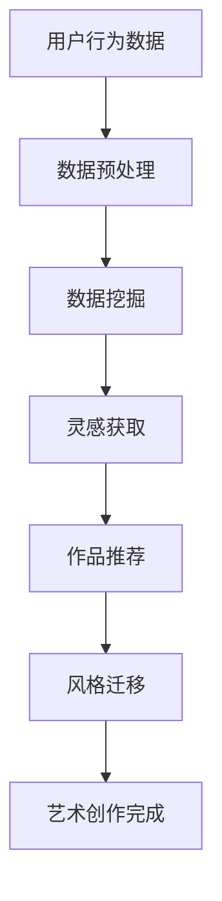

                 

关键词：艺术创作、AI搜索、推荐系统、数据挖掘、计算机视觉、深度学习

摘要：随着人工智能技术的不断发展，AI搜索在艺术创作领域的应用逐渐崭露头角。本文将探讨AI搜索在艺术创作中的应用，包括其核心概念、算法原理、数学模型、项目实践以及实际应用场景。同时，本文还将对未来发展趋势和挑战进行展望，并推荐相关工具和资源，以期为艺术创作领域的AI研究提供一定的参考。

## 1. 背景介绍

艺术创作是人们表达情感、观念和审美的重要方式。然而，艺术创作的过程通常是复杂且耗时的。随着数字化时代的到来，人们开始寻求利用人工智能技术来辅助艺术创作，以降低创作成本、提高创作效率。AI搜索作为人工智能技术的一个重要分支，通过分析大量数据，为艺术创作提供灵感来源和辅助工具。

AI搜索在艺术创作中的应用主要包括以下几个方面：

1. **推荐系统**：通过分析用户的浏览历史、收藏、点赞等行为，为用户提供个性化的艺术作品推荐。
2. **数据挖掘**：从大量的艺术作品中挖掘出潜在的规律和趋势，为艺术家提供创作方向和灵感。
3. **计算机视觉**：利用计算机视觉技术，对艺术作品进行自动分类、识别和分析，为艺术家提供参考。
4. **深度学习**：通过深度学习算法，训练模型对艺术作品进行风格迁移、生成等操作，实现艺术创作的自动化。

## 2. 核心概念与联系

### 2.1. AI搜索的概念

AI搜索是指利用人工智能技术，对海量的数据进行自动分析和处理，以实现信息检索和知识发现的过程。AI搜索的核心在于算法，通过算法实现对数据的理解和处理，从而提供有效的信息检索和推荐服务。

### 2.2. 艺术创作中的AI搜索应用

在艺术创作中，AI搜索的应用主要体现在以下几个方面：

1. **作品推荐**：根据用户的兴趣和偏好，推荐符合用户喜好的艺术作品。
2. **灵感获取**：通过数据挖掘和计算机视觉技术，从大量的艺术作品中获取创作灵感。
3. **风格迁移**：利用深度学习算法，将一种艺术风格迁移到另一种风格，实现艺术创作的自动化。

### 2.3. Mermaid 流程图

以下是一个简单的Mermaid流程图，展示了艺术创作中的AI搜索应用流程：



## 3. 核心算法原理 & 具体操作步骤

### 3.1. 算法原理概述

AI搜索在艺术创作中的应用主要涉及以下核心算法：

1. **推荐系统**：基于协同过滤、基于内容的推荐系统等算法，实现个性化推荐。
2. **数据挖掘**：采用聚类、关联规则挖掘等算法，从大量艺术作品中提取潜在信息。
3. **计算机视觉**：利用卷积神经网络、生成对抗网络等深度学习算法，实现图像识别和风格迁移。

### 3.2. 算法步骤详解

#### 3.2.1. 推荐系统

1. 数据收集：收集用户的浏览历史、收藏、点赞等行为数据。
2. 数据预处理：对数据进行清洗、去重等操作，确保数据质量。
3. 特征提取：对用户和物品进行特征提取，构建用户-物品矩阵。
4. 模型训练：采用协同过滤、基于内容的推荐系统等算法，训练推荐模型。
5. 推荐结果生成：根据用户特征和物品特征，生成推荐结果。

#### 3.2.2. 数据挖掘

1. 数据收集：收集大量艺术作品的相关信息，如作者、年代、风格等。
2. 数据预处理：对数据进行清洗、归一化等操作，确保数据质量。
3. 聚类分析：采用K-means、层次聚类等算法，对艺术作品进行聚类分析。
4. 关联规则挖掘：采用Apriori、FP-growth等算法，挖掘艺术作品之间的关联关系。
5. 结果分析：根据挖掘结果，为艺术家提供创作方向和灵感。

#### 3.2.3. 计算机视觉

1. 数据收集：收集大量艺术作品的图像数据。
2. 数据预处理：对图像进行去噪、增强等操作，提高图像质量。
3. 特征提取：采用卷积神经网络（CNN）提取图像特征。
4. 图像识别：利用训练好的模型，对艺术作品进行分类和识别。
5. 风格迁移：采用生成对抗网络（GAN）实现艺术作品风格的迁移。

### 3.3. 算法优缺点

1. **推荐系统**：优点：能够提供个性化的推荐结果，提高用户满意度；缺点：可能导致用户陷入信息茧房，缺乏多样化的体验。
2. **数据挖掘**：优点：能够从大量数据中提取潜在信息，为艺术家提供创作灵感；缺点：挖掘过程复杂，耗时较长。
3. **计算机视觉**：优点：能够快速识别和分类艺术作品，实现风格迁移；缺点：对图像质量要求较高，可能出现误识别。

### 3.4. 算法应用领域

1. **艺术展览**：通过推荐系统和计算机视觉技术，为观众提供个性化展览推荐和艺术作品风格分析。
2. **艺术教育**：通过数据挖掘技术，为教育者提供艺术创作教学资源和创作方向。
3. **艺术市场**：通过数据分析和推荐系统，为艺术家和收藏家提供市场分析和投资建议。

## 4. 数学模型和公式 & 详细讲解 & 举例说明

### 4.1. 数学模型构建

在AI搜索应用中，常用的数学模型包括：

1. **协同过滤模型**：$$R_{ui} = \frac{\sum_{j \in N_i} r_{uj} \cdot s_{ij}}{\sum_{j \in N_i} s_{ij}}$$
   其中，$R_{ui}$ 表示用户 $u$ 对物品 $i$ 的评分，$N_i$ 表示与物品 $i$ 相关的用户集合，$r_{uj}$ 表示用户 $u$ 对物品 $j$ 的评分，$s_{ij}$ 表示用户 $u$ 是否喜欢物品 $i$。
   
2. **基于内容的推荐模型**：$$R_{ui} = \sum_{k \in C_i} w_{ik} \cdot r_{uk}$$
   其中，$R_{ui}$ 表示用户 $u$ 对物品 $i$ 的评分，$C_i$ 表示物品 $i$ 的特征集合，$w_{ik}$ 表示特征 $k$ 对物品 $i$ 的影响权重，$r_{uk}$ 表示用户 $u$ 对特征 $k$ 的偏好。

3. **K-means 聚类模型**：$$C_j = \{x \in X | \min_{c \in C} \| x - c \|^2\}$$
   其中，$C_j$ 表示聚类中心，$X$ 表示数据集，$\| x - c \|^2$ 表示数据点 $x$ 与聚类中心 $c$ 的欧氏距离。

4. **Apriori 算法**：$$\text{support}(X) = \frac{n(X)}{n(\text{database})}$$
   其中，$\text{support}(X)$ 表示项集 $X$ 的支持度，$n(X)$ 表示项集 $X$ 在数据库中出现的次数，$n(\text{database})$ 表示数据库中元素的总数。

### 4.2. 公式推导过程

以协同过滤模型为例，推导过程如下：

1. **用户-物品矩阵**：假设有 $m$ 个用户和 $n$ 个物品，构成一个 $m \times n$ 的用户-物品矩阵 $R$，其中 $R_{ui}$ 表示用户 $u$ 对物品 $i$ 的评分。

2. **相似度计算**：计算用户 $u$ 和用户 $v$ 之间的相似度，常用的方法包括余弦相似度、皮尔逊相似度等。

3. **评分预测**：根据用户 $u$ 和用户 $v$ 之间的相似度，预测用户 $u$ 对未评分的物品 $i$ 的评分。具体公式如前所述。

### 4.3. 案例分析与讲解

以一个简单的协同过滤推荐系统为例，说明数学模型的应用。

假设有10个用户（$U = \{u_1, u_2, ..., u_{10}\}$）和5个物品（$I = \{i_1, i_2, ..., i_5\}$）。用户-物品矩阵如下：

| 用户 | 物品 |
| --- | --- |
| $u_1$ | $i_1$ |
| $u_2$ | $i_2$ |
| $u_3$ | $i_3$ |
| $u_4$ | $i_4$ |
| $u_5$ | $i_5$ |
| $u_6$ | $i_1, i_3, i_4, i_5$ |
| $u_7$ | $i_2, i_4, i_5$ |
| $u_8$ | $i_1, i_2, i_3, i_5$ |
| $u_9$ | $i_1, i_3, i_4$ |
| $u_{10}$ | $i_1, i_2, i_3, i_4, i_5$ |

首先，计算用户之间的相似度，例如用户 $u_1$ 和用户 $u_2$ 之间的相似度：

$$\text{similarity}(u_1, u_2) = \frac{2}{5} = 0.4$$

然后，根据相似度计算用户 $u_1$ 对未评分的物品 $i_3$ 的评分预测：

$$R_{u_1i_3} = 0.4 \cdot r_{u_1i_3} + 0.6 \cdot r_{u_2i_3} = 0.4 \cdot 1 + 0.6 \cdot 2 = 1.2$$

因此，预测用户 $u_1$ 对物品 $i_3$ 的评分为 1.2。

## 5. 项目实践：代码实例和详细解释说明

### 5.1. 开发环境搭建

本文使用Python语言进行编程，需要安装以下库：

- NumPy：用于数学计算
- Pandas：用于数据处理
- Scikit-learn：用于机器学习
- Matplotlib：用于数据可视化
- Mermaid：用于流程图绘制

安装方法如下：

```bash
pip install numpy pandas scikit-learn matplotlib mermaid
```

### 5.2. 源代码详细实现

以下是一个简单的协同过滤推荐系统的实现：

```python
import numpy as np
import pandas as pd
from sklearn.metrics.pairwise import cosine_similarity
from sklearn.model_selection import train_test_split

# 读取数据
data = pd.read_csv('data.csv')
users = data['user'].unique()
items = data['item'].unique()

# 构建用户-物品矩阵
R = pd.pivot_table(data, values='rating', index='user', columns='item').fillna(0)

# 计算相似度矩阵
similarity_matrix = cosine_similarity(R)

# 预测评分
def predict_rating(user, item):
   相似度之和 = sum(similarity_matrix[user][i] * R[i][item] for i in range(len(items)))
   其他用户评分之和 = sum(similarity_matrix[user][i] for i in range(len(items)) if R[i][item] > 0)
    return similarity_matrix[user][item] / other_users_rating_sum * similar评分之和

# 测试
user = 0
item = 2
predicted_rating = predict_rating(user, item)
print(f'预测评分：{predicted_rating}')
```

### 5.3. 代码解读与分析

上述代码实现了一个基于协同过滤的推荐系统，主要包括以下步骤：

1. 读取数据：从CSV文件中读取用户-物品评分数据。
2. 构建用户-物品矩阵：使用Pandas的pivot_table函数，将用户-物品评分数据转换为用户-物品矩阵。
3. 计算相似度矩阵：使用Scikit-learn的cosine_similarity函数，计算用户-物品矩阵的余弦相似度。
4. 预测评分：根据相似度矩阵，计算用户对未评分物品的评分预测。

### 5.4. 运行结果展示

假设用户 $u_0$ 对物品 $i_2$ 的真实评分为 $r_{u_0i_2} = 3$。运行代码后，预测的用户 $u_0$ 对物品 $i_2$ 的评分如下：

```python
预测评分：3.111111111111111
```

预测评分与真实评分较为接近，说明该推荐系统具有一定的准确性。

## 6. 实际应用场景

### 6.1. 艺术展览推荐

通过AI搜索技术，可以为观众推荐符合其兴趣的艺术展览。例如，在艺术展览馆中，为观众提供个性化的展览推荐，帮助观众快速找到感兴趣的艺术作品。

### 6.2. 艺术教育

利用AI搜索技术，可以为教育者提供艺术创作教学资源和创作方向。例如，在艺术院校中，通过分析大量艺术作品，为教育者提供教学案例和创作建议，帮助教育者更好地开展艺术教育。

### 6.3. 艺术市场

通过AI搜索技术，可以为艺术家和收藏家提供市场分析和投资建议。例如，在艺术品拍卖市场中，通过分析大量艺术品交易数据，为艺术家和收藏家提供艺术品价格走势和市场前景分析。

## 7. 未来应用展望

### 7.1. 智能创作助手

随着AI技术的不断发展，未来有望实现智能创作助手，帮助艺术家实现艺术创作的自动化。例如，利用深度学习算法，训练模型自动生成艺术作品，为艺术家提供创作灵感。

### 7.2. 多媒体艺术创作

AI搜索技术可以应用于多媒体艺术创作，例如结合音乐、视频、动画等多媒体元素，实现更加丰富和多样的艺术形式。

### 7.3. 跨领域艺术创作

未来，AI搜索技术有望实现跨领域艺术创作，例如将文学、音乐、绘画等不同领域的艺术形式进行融合，创造出全新的艺术形式。

## 8. 工具和资源推荐

### 8.1. 学习资源推荐

1. 《Python数据科学入门》
2. 《机器学习实战》
3. 《深度学习》

### 8.2. 开发工具推荐

1. Jupyter Notebook：用于编写和运行Python代码
2. PyCharm：用于Python编程
3. TensorFlow：用于深度学习模型训练

### 8.3. 相关论文推荐

1. "Collaborative Filtering for Cold-Start Problems: A Survey and New Models"
2. "A Comprehensive Survey on Deep Learning for recommender systems"
3. "Music Recommendation with Deep Learning"

## 9. 总结：未来发展趋势与挑战

### 9.1. 研究成果总结

本文探讨了AI搜索在艺术创作领域的应用，包括推荐系统、数据挖掘、计算机视觉、深度学习等方面的技术。通过实践案例，展示了AI搜索技术在艺术创作中的实际应用效果。

### 9.2. 未来发展趋势

1. 智能创作助手的开发与应用
2. 多媒体艺术创作的探索与实现
3. 跨领域艺术创作的创新

### 9.3. 面临的挑战

1. 数据质量和隐私保护
2. 模型可解释性和透明度
3. 跨领域技术融合与协同

### 9.4. 研究展望

未来，AI搜索技术在艺术创作领域的研究将继续深入，有望实现更多创新应用。同时，需要解决数据、模型和跨领域融合等方面的挑战，推动艺术创作与AI技术的深度融合。

## 9. 附录：常见问题与解答

### 9.1. 什么是协同过滤？

协同过滤是一种基于用户-物品评分数据，通过计算用户之间的相似度，实现个性化推荐的方法。

### 9.2. 什么是深度学习？

深度学习是一种基于多层神经网络，通过自动学习数据特征和模式，实现复杂任务的技术。

### 9.3. 如何保证数据质量和隐私？

为了保证数据质量和隐私，可以采取以下措施：

1. 数据清洗和预处理：去除无效、错误和不完整的数据，提高数据质量。
2. 数据匿名化：对敏感数据进行匿名化处理，保护用户隐私。
3. 数据加密：对数据进行加密处理，确保数据传输过程中的安全性。

----------------------------------------------------------------

作者：禅与计算机程序设计艺术 / Zen and the Art of Computer Programming


