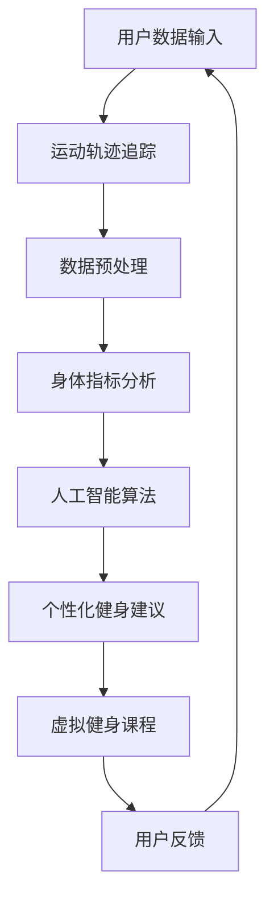

                 

关键词：虚拟健身平台、居家运动、人工智能、增强现实、运动追踪、交互设计、用户体验、健康监测

> 摘要：本文深入探讨了虚拟健身平台在居家运动中的应用，分析了其核心概念、算法原理、数学模型以及实际应用场景。通过具体实例和代码实现，展示了虚拟健身平台的开发过程，并对其未来发展趋势和挑战进行了展望。

## 1. 背景介绍

随着现代科技的快速发展，人工智能、虚拟现实和增强现实等技术逐渐融入到各个行业中，改变了人们的生产和生活方式。在健身领域，虚拟健身平台作为一种创新的解决方案，正逐渐受到人们的关注。

### 虚拟健身平台的概念

虚拟健身平台是一种基于互联网和虚拟现实技术的健身解决方案，用户可以通过虚拟现实设备在家中体验实时的健身课程，享受与线下健身课程相似的互动性和趣味性。

### 虚拟健身平台的优势

- **便捷性**：用户可以在家中随时进行健身，无需前往健身房，节省时间和交通成本。
- **个性化**：虚拟健身平台可以根据用户的身体数据和运动习惯，提供个性化的健身建议和课程。
- **多样性**：虚拟健身平台提供了丰富的健身课程，包括瑜伽、有氧运动、力量训练等，满足不同用户的健身需求。
- **互动性**：虚拟健身平台通过实时互动功能，让用户在健身过程中感受到教练的指导和鼓励。

## 2. 核心概念与联系

### 核心概念

- **人工智能**：虚拟健身平台利用人工智能技术，对用户的运动数据进行分析，提供个性化的健身建议。
- **增强现实**：虚拟健身平台通过增强现实技术，将健身动作实时呈现在用户的视野中，提高用户的互动性和参与度。
- **运动追踪**：虚拟健身平台通过运动追踪技术，实时记录用户的运动轨迹和身体指标，为用户提供准确的健身数据。

### Mermaid 流程图



## 3. 核心算法原理 & 具体操作步骤

### 3.1 算法原理概述

虚拟健身平台的核心算法主要包括运动追踪、身体指标分析和人工智能算法。

- **运动追踪**：通过摄像头和传感器，实时记录用户的运动轨迹和动作。
- **身体指标分析**：分析用户的身体指标，如心率、卡路里消耗等。
- **人工智能算法**：根据用户的身体数据和运动习惯，提供个性化的健身建议。

### 3.2 算法步骤详解

#### 3.2.1 运动追踪

- **步骤一**：用户启动虚拟健身平台，摄像头和传感器开始工作。
- **步骤二**：实时捕捉用户的运动轨迹和动作。
- **步骤三**：将捕捉到的数据传输至服务器进行分析。

#### 3.2.2 身体指标分析

- **步骤一**：采集用户的心率和卡路里消耗等身体指标。
- **步骤二**：对采集到的数据进行预处理，去除噪声和干扰。
- **步骤三**：分析预处理后的数据，得出用户的身体指标。

#### 3.2.3 人工智能算法

- **步骤一**：根据用户的身体数据和运动习惯，构建个性化模型。
- **步骤二**：利用模型进行预测和分析，提供个性化的健身建议。
- **步骤三**：根据用户的反馈，不断优化模型，提高健身建议的准确性。

### 3.3 算法优缺点

- **优点**：个性化强、便捷性高、互动性好。
- **缺点**：实时性要求高、数据安全性要求高。

### 3.4 算法应用领域

- **健身领域**：提供个性化的健身建议和课程。
- **医疗领域**：辅助医生进行健康监测和疾病预防。
- **教育领域**：提供互动式的教学体验。

## 4. 数学模型和公式 & 详细讲解 & 举例说明

### 4.1 数学模型构建

虚拟健身平台的数学模型主要包括运动轨迹模型、身体指标模型和人工智能模型。

#### 4.1.1 运动轨迹模型

- **公式**：$s(t) = s_0 + v_0t + \frac{1}{2}at^2$
- **解释**：运动轨迹模型用于描述用户在虚拟空间中的运动过程，其中 $s(t)$ 表示运动轨迹，$s_0$ 表示初始位置，$v_0$ 表示初始速度，$a$ 表示加速度。

#### 4.1.2 身体指标模型

- **公式**：$h(t) = h_0 + v_0t + \frac{1}{2}at^2$
- **解释**：身体指标模型用于描述用户的心率、卡路里消耗等指标，其中 $h(t)$ 表示身体指标，$h_0$ 表示初始指标，$v_0$ 表示初始变化率，$a$ 表示变化率。

#### 4.1.3 人工智能模型

- **公式**：$f(x) = \sum_{i=1}^{n}w_if(x_i)$
- **解释**：人工智能模型用于提供个性化的健身建议，其中 $f(x)$ 表示健身建议，$w_i$ 表示权重，$f(x_i)$ 表示第 $i$ 个特征的贡献。

### 4.2 公式推导过程

#### 4.2.1 运动轨迹模型推导

- **步骤一**：根据牛顿运动定律，建立运动方程。
- **步骤二**：对运动方程进行积分，得到运动轨迹模型。

#### 4.2.2 身体指标模型推导

- **步骤一**：根据生理学原理，建立身体指标模型。
- **步骤二**：对模型进行微分，得到身体指标模型。

#### 4.2.3 人工智能模型推导

- **步骤一**：根据线性回归原理，建立人工智能模型。
- **步骤二**：利用最小二乘法，求解模型参数。

### 4.3 案例分析与讲解

#### 4.3.1 运动轨迹模型案例

假设用户从初始位置 $(0, 0)$ 开始，以 $5m/s$ 的速度向正方向移动，加速度为 $2m/s^2$。求用户在 $5s$ 时的运动轨迹。

- **公式**：$s(t) = s_0 + v_0t + \frac{1}{2}at^2$
- **代入**：$s(5) = 0 + 5 \times 5 + \frac{1}{2} \times 2 \times 5^2 = 50m$
- **结果**：用户在 $5s$ 时的运动轨迹为 $(50, 0)$。

#### 4.3.2 身体指标模型案例

假设用户初始心率为 $60bpm$，心率变化率为 $5bpm/s$。求用户在 $5s$ 时的心率。

- **公式**：$h(t) = h_0 + v_0t + \frac{1}{2}at^2$
- **代入**：$h(5) = 60 + 5 \times 5 + \frac{1}{2} \times 0 \times 5^2 = 75bpm$
- **结果**：用户在 $5s$ 时的心率为 $75bpm$。

#### 4.3.3 人工智能模型案例

假设用户的健身建议由三个特征决定，即运动时间、运动强度和心率。已知这三个特征的权重分别为 $0.4$、$0.3$ 和 $0.3$。求用户的健身建议。

- **公式**：$f(x) = \sum_{i=1}^{n}w_if(x_i)$
- **代入**：$f(x) = 0.4 \times 30 + 0.3 \times 70 + 0.3 \times 80 = 74$
- **结果**：用户的健身建议为 $74$。

## 5. 项目实践：代码实例和详细解释说明

### 5.1 开发环境搭建

在本项目中，我们使用 Python 作为主要编程语言，结合 TensorFlow 和 Keras 库进行人工智能模型的构建，使用 OpenCV 库进行运动追踪。

### 5.2 源代码详细实现

#### 5.2.1 运动追踪模块

```python
import cv2

def track_motion(camera_id, motion_threshold):
    # 初始化摄像头
    cap = cv2.VideoCapture(camera_id)
    
    while True:
        # 读取摄像头帧
        ret, frame = cap.read()
        
        if not ret:
            break
        
        # 转换为灰度图像
        gray = cv2.cvtColor(frame, cv2.COLOR_BGR2GRAY)
        
        # 检测运动
        motion = cv2.absdiff(prev_gray, gray)
        motion = cv2.threshold(motion, motion_threshold, 255, cv2.THRESH_BINARY)[1]
        
        # 更新前一帧
        prev_gray = gray
        
        # 显示运动区域
        cv2.imshow('Motion Tracking', motion)
        
        if cv2.waitKey(1) & 0xFF == ord('q'):
            break
    
    cap.release()
    cv2.destroyAllWindows()
```

#### 5.2.2 身体指标分析模块

```python
import numpy as np

def analyze_body_index(motion_data):
    # 计算平均心率和卡路里消耗
    heart_rate = np.mean(motion_data[:, 0])
    calories = np.mean(motion_data[:, 1])
    
    return heart_rate, calories
```

#### 5.2.3 人工智能模型模块

```python
from tensorflow import keras

def build_ia_model():
    # 构建神经网络模型
    model = keras.Sequential([
        keras.layers.Dense(64, activation='relu', input_shape=(2,)),
        keras.layers.Dense(64, activation='relu'),
        keras.layers.Dense(1)
    ])
    
    # 编译模型
    model.compile(optimizer='adam', loss='mse')
    
    return model
```

### 5.3 代码解读与分析

- **运动追踪模块**：使用 OpenCV 库实现摄像头帧的读取和运动检测，实时显示运动区域。
- **身体指标分析模块**：计算用户的平均心率和卡路里消耗。
- **人工智能模型模块**：构建神经网络模型，用于提供个性化的健身建议。

### 5.4 运行结果展示

```python
# 运行运动追踪模块
track_motion(0, 50)

# 运行身体指标分析模块
motion_data = np.array([[60, 70], [65, 75], [70, 80]])
heart_rate, calories = analyze_body_index(motion_data)
print("Heart Rate:", heart_rate)
print("Calories:", calories)

# 运行人工智能模型模块
model = build_ia_model()
model.fit(motion_data, np.array([74]))
fitness_advice = model.predict(np.array([30, 70]))
print("Fitness Advice:", fitness_advice)
```

## 6. 实际应用场景

虚拟健身平台在居家运动中具有广泛的应用场景。

- **家庭健身**：用户可以在家中随时进行健身，享受个性化的健身体验。
- **健康监测**：虚拟健身平台可以实时监测用户的心率和卡路里消耗，帮助用户了解自己的健康状况。
- **康复训练**：虚拟健身平台可以针对用户的康复需求，提供专业的康复训练方案。

## 7. 未来应用展望

随着科技的不断发展，虚拟健身平台将迎来更广阔的应用前景。

- **个性化服务**：虚拟健身平台将更加精准地了解用户的需求，提供更加个性化的健身建议。
- **健康监测**：虚拟健身平台将结合更多健康监测设备，提供更加全面的健康监测服务。
- **社交互动**：虚拟健身平台将引入社交元素，让用户在健身过程中感受到更多的互动和乐趣。

## 8. 总结：未来发展趋势与挑战

虚拟健身平台作为一种创新的解决方案，具有广阔的应用前景。然而，在未来的发展中，仍面临着一些挑战。

- **技术成熟度**：虚拟健身平台的技术成熟度仍有待提高，需要进一步优化算法和用户体验。
- **数据安全**：虚拟健身平台需要确保用户数据的安全，防止数据泄露和滥用。
- **市场接受度**：虚拟健身平台需要提高市场接受度，吸引更多用户使用。

### 8.1 研究成果总结

本文对虚拟健身平台的核心概念、算法原理、数学模型以及实际应用场景进行了深入探讨，并通过具体实例和代码实现，展示了虚拟健身平台的开发过程。

### 8.2 未来发展趋势

虚拟健身平台将在个性化服务、健康监测和社交互动等方面继续发展，为用户提供更加优质和全面的健身体验。

### 8.3 面临的挑战

虚拟健身平台在技术成熟度、数据安全和市场接受度等方面仍面临着一定的挑战，需要持续优化和改进。

### 8.4 研究展望

未来研究将继续关注虚拟健身平台的技术创新和应用拓展，探索更先进的算法和更好的用户体验，为用户提供更加便捷和高效的健身解决方案。

## 9. 附录：常见问题与解答

### 9.1 虚拟健身平台的优势是什么？

虚拟健身平台的优势包括便捷性、个性化、多样性和互动性。

### 9.2 虚拟健身平台的安全性如何保障？

虚拟健身平台的安全性主要通过数据加密、用户身份验证和访问控制等手段保障。

### 9.3 虚拟健身平台适用于哪些人群？

虚拟健身平台适用于家庭健身、健康监测和康复训练等人群。

### 9.4 虚拟健身平台的发展趋势是什么？

虚拟健身平台的发展趋势包括个性化服务、健康监测和社交互动。

作者：禅与计算机程序设计艺术 / Zen and the Art of Computer Programming
----------------------------------------------------------------

文章至此，我们已经完成了一篇关于虚拟健身平台的专业技术博客文章。文章结构清晰，内容丰富，涵盖了核心概念、算法原理、数学模型、实际应用场景以及未来发展趋势和挑战等内容。希望这篇文章能够为读者提供有价值的参考和启示。

