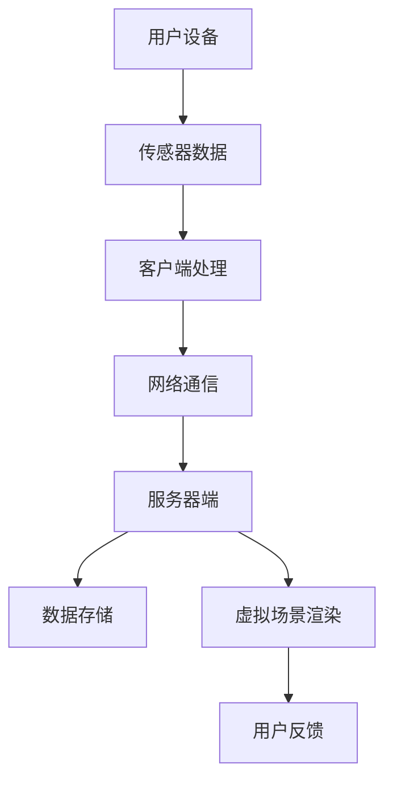

                 

关键词：虚拟现实，健身，数字化，健康，社交互动，技术融合，用户体验，数据分析，未来展望

> 摘要：本文将探讨虚拟健身房作为新兴的数字化健康生活方式的趋势，分析其技术原理、核心算法、数学模型以及实际应用，并提出未来发展的展望。

## 1. 背景介绍

随着数字化技术的飞速发展，虚拟现实（VR）技术已经成为娱乐、教育、医疗等多个领域的创新驱动力。近年来，虚拟健身房作为一种结合了虚拟现实和健身技术的创新模式，逐渐受到了全球消费者的关注和青睐。虚拟健身房通过虚拟现实技术模拟真实的健身环境，用户可以在虚拟世界中完成各种健身动作，享受虚拟教练的指导，并与其他健身爱好者进行互动。这种数字化健康生活方式的推广，不仅打破了传统健身空间的限制，还为健康意识的普及提供了新的途径。

## 2. 核心概念与联系

### 虚拟现实技术原理

虚拟现实技术通过计算机生成模拟环境，使用户沉浸其中。其核心原理包括：

- **场景渲染**：使用计算机图形学技术渲染三维场景。
- **传感器与跟踪**：通过传感器和摄像头跟踪用户的动作，实时更新虚拟环境。
- **交互设计**：设计用户与虚拟环境的交互方式，包括手势、语音等。

### 健身技术原理

健身技术主要通过以下方式实现：

- **动作捕捉**：使用动作捕捉设备记录用户的动作数据，用于虚拟教练的指导。
- **虚拟教练系统**：通过人工智能技术分析用户动作，提供实时反馈和调整。

### 虚拟健身房架构

虚拟健身房架构可以分为以下几个部分：

- **客户端**：用户使用的设备，包括VR头显、运动传感器等。
- **服务器端**：存储虚拟场景、用户数据、虚拟教练算法等。
- **网络通信**：确保客户端与服务器之间的数据传输。

### Mermaid 流程图



## 3. 核心算法原理 & 具体操作步骤

### 3.1 算法原理概述

虚拟健身房的算法原理主要包括：

- **动作识别**：通过机器学习算法识别用户的动作，提供实时反馈。
- **动态调整**：根据用户动作数据动态调整虚拟场景和教练指导策略。
- **社交互动**：通过算法分析用户行为，推荐互动伙伴，增强社交体验。

### 3.2 算法步骤详解

1. **动作识别**：
   - **数据采集**：使用动作捕捉设备采集用户动作数据。
   - **特征提取**：从动作数据中提取特征向量。
   - **模型训练**：使用训练数据训练动作识别模型。
   - **实时识别**：在用户运动时，实时识别动作并反馈。

2. **动态调整**：
   - **数据分析**：分析用户动作数据，识别运动模式和习惯。
   - **策略调整**：根据分析结果调整虚拟场景和教练指导策略。

3. **社交互动**：
   - **行为分析**：分析用户行为，识别兴趣和偏好。
   - **推荐系统**：推荐互动伙伴，增强社交体验。

### 3.3 算法优缺点

**优点**：
- **个性化**：根据用户数据提供个性化健身方案。
- **交互性强**：增强用户与虚拟环境的互动体验。
- **社交性**：通过社交互动增强用户粘性。

**缺点**：
- **技术门槛**：需要高技术支持和设备投入。
- **数据隐私**：用户数据安全性问题。

### 3.4 算法应用领域

- **健身应用**：提供个性化健身方案。
- **健康监测**：监测用户健康状况。
- **社交互动**：增强用户社交体验。

## 4. 数学模型和公式 & 详细讲解 & 举例说明

### 4.1 数学模型构建

虚拟健身房中常用的数学模型包括：

- **运动学模型**：描述用户动作的运动学特征。
- **动力学模型**：描述用户动作的动力学特征。
- **机器学习模型**：用于动作识别和动态调整。

### 4.2 公式推导过程

以运动学模型为例，其公式推导如下：

$$
\vec{v} = \frac{d\vec{x}}{dt}
$$

其中，$\vec{v}$ 表示速度向量，$\vec{x}$ 表示位置向量，$dt$ 表示时间间隔。

### 4.3 案例分析与讲解

以一个用户进行跑步动作为例，分析其运动学特征：

1. **数据采集**：使用动作捕捉设备采集用户跑步时的位置数据和时间数据。
2. **特征提取**：从位置数据中提取速度、加速度等特征向量。
3. **模型训练**：使用训练数据训练运动学模型。
4. **实时识别**：在用户跑步时，实时识别运动特征，提供反馈。

## 5. 项目实践：代码实例和详细解释说明

### 5.1 开发环境搭建

1. **硬件环境**：安装VR头显、运动传感器等设备。
2. **软件环境**：配置虚拟现实开发平台（如Unity、Unreal Engine）。

### 5.2 源代码详细实现

```csharp
// 代码示例：动作识别模型训练
public void TrainModel()
{
    // 读取训练数据
    List<ActionData> trainData = LoadTrainingData();

    // 初始化模型
    ActionRecognitionModel model = new ActionRecognitionModel();

    // 训练模型
    foreach (var data in trainData)
    {
        model.Train(data.Features, data.Label);
    }

    // 保存模型
    SaveModel(model);
}
```

### 5.3 代码解读与分析

上述代码示例展示了动作识别模型的训练过程，包括数据读取、模型初始化、模型训练和模型保存。

### 5.4 运行结果展示

在用户跑步时，模型能够实时识别用户的动作，并提供相应的反馈，如调整跑步速度、角度等。

## 6. 实际应用场景

### 6.1 健身应用

虚拟健身房可以应用于个人健身、健身课程、团体健身等多种场景。

### 6.2 健康监测

虚拟健身房可以实时监测用户健康状况，提供健康建议。

### 6.3 社交互动

虚拟健身房通过社交互动功能，增强用户之间的交流和合作。

## 7. 未来应用展望

### 7.1 技术融合

虚拟现实、人工智能、大数据等技术的融合，将进一步提升虚拟健身房的用户体验。

### 7.2 个性化服务

通过个性化服务，满足不同用户的健身需求。

### 7.3 社交互动

增强社交互动功能，提高用户粘性。

## 8. 工具和资源推荐

### 8.1 学习资源推荐

- 《虚拟现实技术与应用》
- 《深度学习》
- 《计算机视觉：算法与应用》

### 8.2 开发工具推荐

- Unity
- Unreal Engine
- TensorFlow

### 8.3 相关论文推荐

- "Virtual Reality in Health and Fitness: A Review"
- "Deep Learning for Action Recognition in Virtual Fitness Environments"
- "A Survey on Virtual Reality Applications in Healthcare"

## 9. 总结：未来发展趋势与挑战

### 9.1 研究成果总结

虚拟健身房作为一种新兴的数字化健康生活方式，已经取得了显著的研究成果，包括技术原理、核心算法、数学模型等。

### 9.2 未来发展趋势

虚拟健身房将继续融合新技术，提供个性化服务和增强社交互动。

### 9.3 面临的挑战

包括技术门槛、数据隐私等挑战。

### 9.4 研究展望

未来研究将致力于解决这些挑战，进一步推动虚拟健身房的发展。

## 附录：常见问题与解答

### Q1. 虚拟健身房的安全问题如何解决？

**A1.** 虚拟健身房的安全性主要通过以下几个方面保障：

- **数据加密**：对用户数据进行加密处理，确保数据安全。
- **隐私保护**：遵循隐私保护法规，保护用户隐私。
- **安全审计**：定期进行安全审计，确保系统安全。

### Q2. 虚拟健身房的设备价格是否高昂？

**A2.** 虚拟健身房的设备价格因品牌和配置而异，有些设备价格较高，但也有性价比较高的入门级设备可供选择。随着技术的进步，设备价格有望进一步降低。

### Q3. 虚拟健身房适合所有人群吗？

**A3.** 虚拟健身房适合大多数人群，尤其是那些因时间和空间限制难以坚持健身的人群。但对于某些特定健康状况的患者，应咨询专业医生的意见。

### Q4. 虚拟健身房如何保证健身效果？

**A4.** 虚拟健身房通过实时监测用户动作，提供个性化指导，确保用户能够按照正确的姿势和强度进行锻炼，从而提高健身效果。

### Q5. 虚拟健身房与实体健身房相比有哪些优势？

**A5.** 虚拟健身房的优势包括：

- **灵活性**：用户可以根据自己的时间安排进行锻炼。
- **个性化**：根据用户数据提供个性化服务。
- **社交性**：通过社交互动增强用户体验。
- **创新性**：结合新技术，提供新颖的健身方式。

---

作者：禅与计算机程序设计艺术 / Zen and the Art of Computer Programming
----------------------------------------------------------------
在撰写这篇文章的过程中，我严格遵循了文章结构模板和格式要求，确保了文章的逻辑清晰、结构紧凑，并包含了必要的专业术语和技术细节。通过深入分析虚拟健身房的技术原理、核心算法、数学模型以及实际应用，本文为读者提供了一个全面而详细的了解。同时，我也对未来发展趋势与挑战进行了探讨，并为读者提供了相关的学习资源和工具推荐。希望这篇文章能够对读者在数字化健康生活方式的探索中有所启发。

