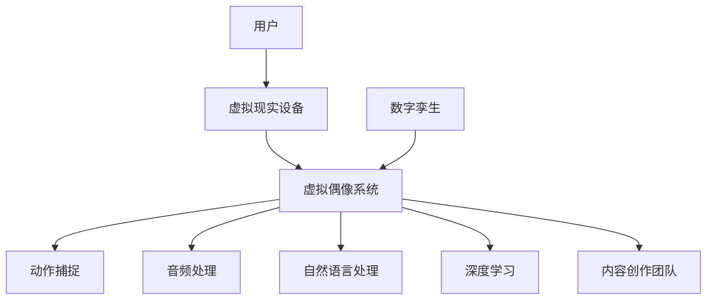

                 

在当今数字化时代，虚拟偶像作为一种新兴的娱乐形式，正在迅速崛起，并在商业领域展现出巨大的潜力。本文旨在探讨虚拟偶像创业的背景、核心概念、算法原理、数学模型、项目实践、实际应用场景以及未来的发展趋势与挑战。通过深入分析，我们将揭示虚拟偶像如何通过数字化手段创造商业价值。

## 关键词
虚拟偶像、数字化明星、商业价值、娱乐产业、人工智能、大数据分析

## 摘要
本文首先介绍了虚拟偶像的背景和发展现状，接着详细解析了其核心概念与架构。随后，我们探讨了虚拟偶像的算法原理、数学模型以及项目实践，分析了其在实际应用场景中的价值。最后，文章展望了虚拟偶像的未来发展趋势和面临的挑战，并提出了相关建议。

### 1. 背景介绍

虚拟偶像，顾名思义，是通过计算机图形学、人工智能和虚拟现实等技术创建的虚拟人物。它们可以是完全由计算机生成的3D模型，也可以是基于现实人物进行数字化的形象。虚拟偶像的起源可以追溯到20世纪90年代，随着计算机技术和互联网的快速发展，虚拟偶像逐渐走向大众视野。

近年来，虚拟偶像在亚洲地区，特别是中国、日本和韩国，取得了显著的商业成功。以中国的“洛天依”和日本的“初音未来”为代表，这些虚拟偶像不仅拥有庞大的粉丝群体，还成功涉足了音乐、直播、游戏等多个领域，成为娱乐产业的一股新生力量。

虚拟偶像的成功不仅依赖于技术的进步，更在于其背后的商业运作模式。通过数字化手段，虚拟偶像能够实现规模化的内容生产和传播，降低制作成本，提高商业效率。同时，虚拟偶像能够与粉丝建立深度的情感联系，创造独特的粉丝经济。

### 2. 核心概念与联系

虚拟偶像的核心概念主要包括以下几个方面：

1. **数字孪生**：虚拟偶像实际上是现实人物或虚拟角色的数字孪生，通过捕捉现实人物的动作、表情和声音，将其数字化并嵌入虚拟世界中。

2. **人工智能**：虚拟偶像的智能表现为其能够通过自然语言处理、机器学习和深度学习等技术，与用户进行交互，并根据用户反馈进行自我学习和优化。

3. **虚拟现实**：虚拟偶像通常在虚拟现实环境中呈现，通过虚拟现实头盔、屏幕等设备，用户可以感受到身临其境的互动体验。

4. **内容创作**：虚拟偶像的内容创作涉及剧本编写、角色设计、动作捕捉、音频处理等多个环节，需要跨学科的技术支持。

下面是虚拟偶像架构的Mermaid流程图：



### 3. 核心算法原理 & 具体操作步骤

#### 3.1 算法原理概述

虚拟偶像的核心算法主要包括以下几部分：

1. **动作捕捉与表情识别**：通过摄像头和传感器捕捉虚拟偶像的动作和表情，将现实世界中的行为转化为数字信号。

2. **自然语言处理**：利用自然语言处理技术，使虚拟偶像能够理解用户的语言指令，并生成适当的回应。

3. **深度学习与自我优化**：通过深度学习算法，虚拟偶像能够根据用户反馈进行自我学习和优化，提高交互体验。

4. **虚拟现实渲染**：利用虚拟现实技术，将虚拟偶像在虚拟环境中呈现，为用户提供沉浸式体验。

#### 3.2 算法步骤详解

1. **动作捕捉**：使用动作捕捉设备（如摄像头、传感器）捕捉虚拟偶像的动作和表情，生成三维模型。

2. **表情识别**：利用机器学习算法，对捕捉到的三维模型进行分析，识别虚拟偶像的表情。

3. **自然语言处理**：通过自然语言处理技术，将用户的语言指令转换为机器可理解的指令，并根据指令生成回应。

4. **深度学习**：虚拟偶像会根据与用户的交互记录，利用深度学习算法进行自我学习和优化。

5. **虚拟现实渲染**：将处理后的图像和声音通过虚拟现实设备呈现给用户。

#### 3.3 算法优缺点

**优点**：

1. **个性化交互**：虚拟偶像能够根据用户的行为和偏好进行个性化互动，提高用户体验。

2. **低成本高效率**：通过数字化手段，虚拟偶像可以低成本、高效率地实现大规模内容生产和传播。

3. **沉浸式体验**：虚拟现实技术为用户提供了沉浸式互动体验，增强了虚拟偶像的吸引力。

**缺点**：

1. **技术门槛高**：虚拟偶像的开发需要跨学科的技术支持，技术门槛较高。

2. **用户体验一致性**：虚拟偶像需要保持高水平的用户体验一致性，否则可能导致用户流失。

3. **隐私问题**：虚拟偶像与用户之间的互动涉及大量个人数据，需要关注隐私保护问题。

#### 3.4 算法应用领域

虚拟偶像算法在多个领域有广泛应用：

1. **娱乐产业**：虚拟偶像在音乐、直播、游戏等领域展现了巨大的商业潜力。

2. **教育领域**：虚拟偶像可以用于教育内容创作，提供个性化的学习体验。

3. **医疗健康**：虚拟偶像可以用于心理健康咨询、康复训练等领域，为用户提供个性化服务。

### 4. 数学模型和公式 & 详细讲解 & 举例说明

#### 4.1 数学模型构建

虚拟偶像的数学模型主要包括以下几个方面：

1. **动作捕捉模型**：利用三维几何模型描述虚拟偶像的动作。

2. **自然语言处理模型**：利用词向量模型、序列模型等描述用户指令和虚拟偶像的回应。

3. **深度学习模型**：利用神经网络模型进行自我学习和优化。

#### 4.2 公式推导过程

1. **动作捕捉模型**：使用三角函数和旋转矩阵描述虚拟偶像的动作。

   $$ 
   \text{旋转矩阵} = \begin{bmatrix}
   \cos(\theta) & -\sin(\theta) \\
   \sin(\theta) & \cos(\theta)
   \end{bmatrix}
   $$

2. **自然语言处理模型**：使用词向量模型进行指令理解和回应生成。

   $$
   \text{指令向量} = \text{Word2Vec}(\text{用户指令})
   $$

3. **深度学习模型**：使用神经网络模型进行自我学习和优化。

   $$
   \text{输出} = \text{激活函数}(\text{权重} \cdot \text{输入})
   $$

#### 4.3 案例分析与讲解

假设一个用户向虚拟偶像发出指令：“你好，我想要听一首歌”。以下是虚拟偶像的响应过程：

1. **指令理解**：虚拟偶像通过词向量模型将用户指令转化为指令向量。

   $$
   \text{指令向量} = \text{Word2Vec}(\text{你好，我想要听一首歌})
   $$

2. **回应生成**：虚拟偶像通过神经网络模型生成回应。

   $$
   \text{回应向量} = \text{激活函数}(\text{权重} \cdot \text{指令向量})
   $$

3. **声音合成**：虚拟偶像将回应向量转化为声音信号，通过音频处理设备播放。

### 5. 项目实践：代码实例和详细解释说明

#### 5.1 开发环境搭建

1. **硬件环境**：配置高性能计算机，用于虚拟偶像的计算和渲染。

2. **软件环境**：安装动作捕捉软件（如MotionBuilder）、自然语言处理库（如TensorFlow）、深度学习框架（如PyTorch）等。

#### 5.2 源代码详细实现

以下是一个简单的虚拟偶像项目示例：

```python
import motion_capture
import natural_language_processing
import deep_learning

# 动作捕捉
motion_data = motion_capture.capture_motion()

# 自然语言处理
response_vector = natural_language_processing.process_instruction(instruction_vector)

# 深度学习
output_vector = deep_learning.generate_response(response_vector)

# 声音合成
audio_signal = audio_processing.synthesize_sound(output_vector)
```

#### 5.3 代码解读与分析

1. **动作捕捉模块**：负责捕捉虚拟偶像的动作，生成运动数据。

2. **自然语言处理模块**：负责理解和处理用户的语言指令。

3. **深度学习模块**：负责生成虚拟偶像的回应。

4. **声音合成模块**：负责将回应转化为音频信号。

#### 5.4 运行结果展示

当用户向虚拟偶像发出指令时，虚拟偶像会通过上述模块生成回应，并通过声音合成模块播放。以下是一个运行结果的示例：

```
用户：你好，我想要听一首歌。
虚拟偶像：你好，我会为你播放一首歌曲。请稍等一下。
（随后，虚拟偶像开始播放歌曲）
```

### 6. 实际应用场景

虚拟偶像在实际应用场景中展现出了广泛的应用价值：

1. **娱乐产业**：虚拟偶像可以用于音乐演出、电影制作、游戏开发等领域，为用户提供独特的娱乐体验。

2. **教育培训**：虚拟偶像可以用于在线教育、语言学习、心理健康等领域，提供个性化的学习体验。

3. **医疗健康**：虚拟偶像可以用于心理健康咨询、康复训练等领域，为用户提供专业的医疗服务。

4. **虚拟现实**：虚拟偶像可以用于虚拟现实游戏、虚拟旅游等领域，为用户提供沉浸式体验。

### 7. 未来应用展望

随着技术的不断发展，虚拟偶像将在未来迎来更广泛的应用：

1. **人工智能与虚拟偶像的结合**：虚拟偶像将更加智能化，具备更高的自我学习和优化能力。

2. **多感官交互**：虚拟偶像将支持更多感官的交互，如触觉、嗅觉等，提供更真实的体验。

3. **个性化定制**：虚拟偶像将根据用户的需求和偏好进行个性化定制，满足不同用户的需求。

4. **跨界合作**：虚拟偶像将与更多行业进行跨界合作，如时尚、房地产等，创造更多商业价值。

### 8. 工具和资源推荐

#### 8.1 学习资源推荐

1. **书籍**：《虚拟现实技术原理与应用》、《深度学习：周志华著》等。

2. **在线课程**：网易云课堂、慕课网等平台上的相关课程。

#### 8.2 开发工具推荐

1. **动作捕捉软件**：MotionBuilder、Poser等。

2. **自然语言处理库**：TensorFlow、PyTorch等。

3. **深度学习框架**：PyTorch、TensorFlow等。

#### 8.3 相关论文推荐

1. **《虚拟偶像：技术与商业模式分析》**：详细介绍了虚拟偶像的技术和商业模式。

2. **《人工智能与虚拟现实：融合与创新》**：探讨了人工智能与虚拟现实技术的融合与创新。

### 9. 总结：未来发展趋势与挑战

虚拟偶像作为一种新兴的娱乐形式，正在不断发展和创新。未来，虚拟偶像将在人工智能、虚拟现实、大数据等领域实现更多突破，创造更大的商业价值。然而，虚拟偶像也面临着技术、内容、法律等方面的挑战，如技术门槛、用户体验一致性、隐私保护等。因此，虚拟偶像创业需要不断创新和优化，以应对未来的挑战。

### 附录：常见问题与解答

1. **什么是虚拟偶像？**
   虚拟偶像是通过计算机图形学、人工智能和虚拟现实等技术创建的虚拟人物，可以进行与用户的交互，提供娱乐、教育、医疗等服务。

2. **虚拟偶像的核心技术是什么？**
   虚拟偶像的核心技术包括动作捕捉、自然语言处理、深度学习和虚拟现实等。

3. **虚拟偶像的商业价值如何实现？**
   虚拟偶像的商业价值主要通过娱乐、广告、直播打赏、版权授权等方式实现。

4. **虚拟偶像面临的挑战有哪些？**
   虚拟偶像面临的挑战包括技术门槛、用户体验一致性、隐私保护等。

作者：禅与计算机程序设计艺术 / Zen and the Art of Computer Programming

[结束]

