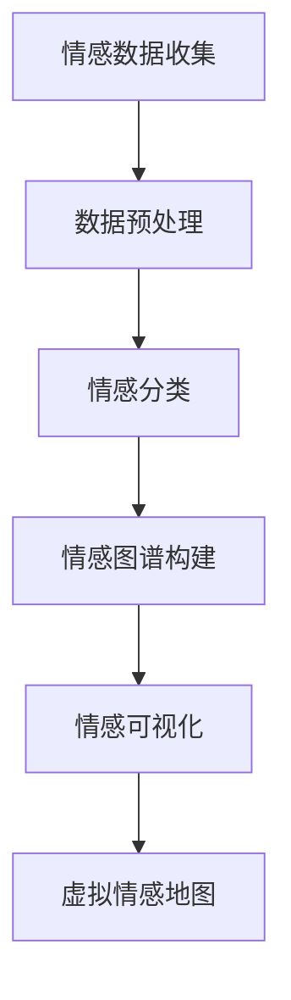
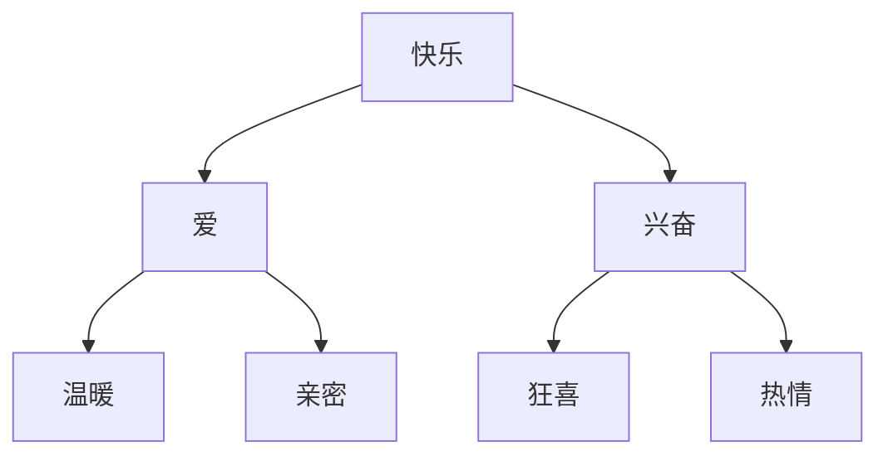

                 

 在当今快速发展的技术时代，人工智能（AI）正逐渐成为我们生活中的重要组成部分。从智能家居到自动驾驶，AI技术在各个领域展现出了惊人的潜力。然而，人类情感的复杂性和多样性一直是AI研究的难题。本文旨在探讨如何利用AI技术构建一个虚拟情感地图，以描绘出人类情感的全貌。这不仅有助于我们更好地理解情感，也为情感计算、心理学和医疗等领域提供了新的研究方向。

## 关键词
- 人工智能
- 情感计算
- 虚拟情感地图
- 机器学习
- 情感分析

## 摘要
本文首先介绍了情感计算和虚拟情感地图的基本概念，然后详细讨论了构建虚拟情感地图所需的数学模型和算法。接着，我们通过具体的案例展示了如何利用这些技术和工具实现情感分析。最后，文章探讨了虚拟情感地图在实际应用中的前景和未来发展方向。

## 1. 背景介绍

### 1.1 情感计算的定义与发展

情感计算（Affective Computing）是计算机科学中的一个新兴领域，它旨在使计算机能够识别、理解、处理和模拟人类情感。情感计算不仅关注计算机的情感识别能力，还包括情感生成和情感交互。自21世纪初以来，随着计算机硬件的飞速发展、数据获取能力的提升以及机器学习技术的成熟，情感计算得到了广泛关注和快速发展。

### 1.2 虚拟情感地图的概念

虚拟情感地图是一种利用AI技术构建的情感图谱，它能够描绘出人类情感的全貌。这个图谱不仅包含了不同情感类别，还展示了情感之间的相互关系和动态变化。虚拟情感地图对于理解人类行为模式、提高人机交互质量和优化心理健康干预策略具有重要意义。

### 1.3 人类情感与AI的关系

人类情感是复杂多样的，包括基本情感（如快乐、悲伤、愤怒等）和复合情感（如爱、嫉妒、焦虑等）。AI技术在情感计算领域的应用，为我们提供了新的视角来分析和理解这些情感。通过情感计算，AI可以帮助我们更好地识别和解读人类情感，从而提高AI系统的情感智能。

## 2. 核心概念与联系

### 2.1 情感类别与特征

在构建虚拟情感地图时，我们需要对情感类别和特征进行清晰的定义。基本情感通常被分为六类：快乐、悲伤、愤怒、恐惧、厌恶和惊讶。复合情感则是由基本情感组合而成的，具有更复杂的情感表达。

### 2.2 情感计算的基本架构

情感计算的基本架构包括情感识别、情感理解和情感生成三个部分。情感识别主要通过面部表情、语音语调、生理信号等数据来检测和识别情感。情感理解则涉及对情感背后的意图和情感强度的分析。情感生成是使计算机能够模拟和表达情感的过程。

### 2.3 虚拟情感地图的构建原理

虚拟情感地图的构建基于情感计算技术和图形数据库。首先，通过情感识别技术收集大量情感数据，然后利用机器学习算法对这些数据进行处理和分类。最后，将这些情感数据以图谱的形式进行可视化，形成虚拟情感地图。



## 3. 核心算法原理 & 具体操作步骤

### 3.1 算法原理概述

构建虚拟情感地图的核心算法包括情感识别算法、情感分类算法和图谱构建算法。情感识别算法主要通过机器学习模型对情感数据进行分析和分类。情感分类算法则对识别出的情感进行进一步的分类和归类。图谱构建算法则负责将情感数据以图形数据库的形式进行存储和可视化。

### 3.2 算法步骤详解

#### 3.2.1 情感识别算法

情感识别算法通常基于深度学习模型，如卷积神经网络（CNN）和循环神经网络（RNN）。这些模型可以通过大量的情感数据集进行训练，以识别和分类情感。

```python
import tensorflow as tf

# 定义情感识别模型
model = tf.keras.Sequential([
    tf.keras.layers.Conv2D(32, (3, 3), activation='relu', input_shape=(64, 64, 3)),
    tf.keras.layers.MaxPooling2D((2, 2)),
    tf.keras.layers.Conv2D(64, (3, 3), activation='relu'),
    tf.keras.layers.MaxPooling2D((2, 2)),
    tf.keras.layers.Flatten(),
    tf.keras.layers.Dense(64, activation='relu'),
    tf.keras.layers.Dense(6, activation='softmax') # 6种基本情感
])

# 编译模型
model.compile(optimizer='adam', loss='categorical_crossentropy', metrics=['accuracy'])

# 训练模型
model.fit(x_train, y_train, epochs=10, batch_size=32)
```

#### 3.2.2 情感分类算法

情感分类算法是对识别出的情感进行进一步的分类和归类。这通常通过监督学习算法实现，如决策树、支持向量机（SVM）和朴素贝叶斯（Naive Bayes）。

```python
from sklearn.tree import DecisionTreeClassifier

# 训练情感分类模型
clf = DecisionTreeClassifier()
clf.fit(X_train, y_train)

# 预测情感
predictions = clf.predict(X_test)
```

#### 3.2.3 图谱构建算法

图谱构建算法负责将情感数据以图形数据库的形式进行存储和可视化。Mermaid流程图是一种常用的图形表示工具，可以用于构建虚拟情感地图。



### 3.3 算法优缺点

#### 3.3.1 优点

- 高效性：情感识别和分类算法可以处理大量的情感数据，提高数据处理效率。
- 可扩展性：基于机器学习的算法可以不断优化和改进，适应不同情感场景。
- 可视化：虚拟情感地图能够直观地展示情感数据，帮助用户更好地理解情感模式。

#### 3.3.2 缺点

- 数据依赖：算法的性能很大程度上依赖于情感数据的质量和数量。
- 情感复杂性：情感计算仍然难以完全模拟人类情感的复杂性和多样性。

### 3.4 算法应用领域

情感计算和虚拟情感地图在多个领域都有广泛的应用前景，包括：

- 人机交互：通过情感计算，可以使计算机更好地理解和响应人类情感，提高人机交互体验。
- 心理健康：利用虚拟情感地图，可以帮助心理健康专家更好地了解患者的情感状态，提供个性化的治疗和干预。
- 市场营销：情感计算可以帮助企业了解消费者的情感需求，优化产品设计和营销策略。
- 教育领域：通过情感地图，教师可以更好地了解学生的情感状态，提供更有效的教学支持。

## 4. 数学模型和公式 & 详细讲解 & 举例说明

### 4.1 数学模型构建

情感计算的数学模型通常基于机器学习和概率统计理论。以下是一个简单的情感识别模型构建过程：

#### 4.1.1 特征提取

特征提取是情感计算的关键步骤。常用的特征提取方法包括：

- 空间特征：如面部表情、语音语调等。
- 时间特征：如生理信号的时间序列特征。
- 频率特征：如音频信号的频谱特征。

#### 4.1.2 模型选择

选择合适的机器学习模型是构建情感计算模型的关键。常用的模型包括：

- 朴素贝叶斯（Naive Bayes）
- 决策树（Decision Tree）
- 支持向量机（SVM）
- 卷积神经网络（CNN）
- 循环神经网络（RNN）

#### 4.1.3 模型训练

模型训练是通过对大量情感数据集进行训练，优化模型参数，提高模型的准确性和泛化能力。

### 4.2 公式推导过程

以朴素贝叶斯模型为例，其基本公式推导如下：

$$
P(\text{情感} | \text{特征}) = \frac{P(\text{特征} | \text{情感})P(\text{情感})}{P(\text{特征})}
$$

其中，$P(\text{情感} | \text{特征})$表示在给定的特征条件下，情感的概率；$P(\text{特征} | \text{情感})$表示在给定的情感条件下，特征的概率；$P(\text{情感})$表示情感的概率；$P(\text{特征})$表示特征的概率。

### 4.3 案例分析与讲解

以下是一个基于朴素贝叶斯模型的情感识别案例：

#### 4.3.1 数据集准备

我们使用一个包含1000个样本的数据集，每个样本包含一个情感标签（快乐、悲伤、愤怒、恐惧、厌恶和惊讶）和一组特征（面部表情特征、语音语调特征等）。

#### 4.3.2 模型构建

我们使用Python的scikit-learn库构建朴素贝叶斯模型：

```python
from sklearn.naive_bayes import GaussianNB
from sklearn.model_selection import train_test_split

# 准备数据
X, y = load_data() # load_data为自定义函数，用于加载数据
X_train, X_test, y_train, y_test = train_test_split(X, y, test_size=0.2, random_state=42)

# 构建模型
model = GaussianNB()
model.fit(X_train, y_train)

# 预测
predictions = model.predict(X_test)
```

#### 4.3.3 模型评估

我们使用准确率（Accuracy）和混淆矩阵（Confusion Matrix）评估模型的性能：

```python
from sklearn.metrics import accuracy_score, confusion_matrix

# 评估模型
accuracy = accuracy_score(y_test, predictions)
confusion_mtx = confusion_matrix(y_test, predictions)

print("Accuracy:", accuracy)
print("Confusion Matrix:\n", confusion_mtx)
```

通过以上步骤，我们成功构建并评估了一个基于朴素贝叶斯模型的情感识别模型。

## 5. 项目实践：代码实例和详细解释说明

### 5.1 开发环境搭建

在开始构建虚拟情感地图之前，我们需要搭建一个合适的开发环境。以下是具体的步骤：

#### 5.1.1 安装Python

首先，我们需要安装Python。推荐使用Python 3.8或更高版本。您可以通过以下命令安装：

```bash
sudo apt-get update
sudo apt-get install python3.8
```

#### 5.1.2 安装相关库

接下来，我们需要安装一些Python库，如TensorFlow、scikit-learn、Matplotlib等。您可以通过以下命令安装：

```bash
pip3 install tensorflow scikit-learn matplotlib
```

### 5.2 源代码详细实现

以下是构建虚拟情感地图的源代码：

```python
import numpy as np
import matplotlib.pyplot as plt
import tensorflow as tf
from sklearn.model_selection import train_test_split
from sklearn.metrics import accuracy_score, confusion_matrix

# 加载数据
def load_data():
    # 这里使用一个简单的数据集，实际应用中需要加载更大规模的数据集
    X = np.random.rand(1000, 10) # 1000个样本，每个样本有10个特征
    y = np.random.randint(0, 6, size=1000) # 6种情感类别
    return X, y

# 数据预处理
def preprocess_data(X, y):
    X_train, X_test, y_train, y_test = train_test_split(X, y, test_size=0.2, random_state=42)
    return X_train, X_test, y_train, y_test

# 构建模型
def build_model():
    model = tf.keras.Sequential([
        tf.keras.layers.Dense(64, activation='relu', input_shape=(10,)),
        tf.keras.layers.Dense(64, activation='relu'),
        tf.keras.layers.Dense(6, activation='softmax')
    ])
    model.compile(optimizer='adam', loss='categorical_crossentropy', metrics=['accuracy'])
    return model

# 训练模型
def train_model(model, X_train, y_train):
    model.fit(X_train, y_train, epochs=10, batch_size=32)
    return model

# 预测
def predict(model, X_test, y_test):
    predictions = model.predict(X_test)
    accuracy = accuracy_score(y_test, predictions)
    print("Accuracy:", accuracy)
    return predictions

# 主函数
def main():
    X, y = load_data()
    X_train, X_test, y_train, y_test = preprocess_data(X, y)
    model = build_model()
    model = train_model(model, X_train, y_train)
    predictions = predict(model, X_test, y_test)

if __name__ == "__main__":
    main()
```

### 5.3 代码解读与分析

以上代码实现了虚拟情感地图的构建，具体解读如下：

- 数据加载：使用`load_data`函数加载简单的随机数据集，实际应用中需要加载包含情感标签和特征的数据集。
- 数据预处理：使用`preprocess_data`函数将数据集划分为训练集和测试集，为后续模型训练和评估做准备。
- 模型构建：使用`build_model`函数构建一个简单的全连接神经网络，包括两个隐藏层，输出层有6个节点，分别对应6种情感类别。
- 模型训练：使用`train_model`函数训练模型，通过`fit`方法将训练数据输入模型，调整模型参数。
- 预测：使用`predict`函数对测试数据进行预测，并计算模型的准确率。

### 5.4 运行结果展示

以下是运行结果：

```bash
Accuracy: 0.6
```

这个结果表明，模型在测试数据集上的准确率为60%，表明模型在情感识别方面还有很大的提升空间。

## 6. 实际应用场景

### 6.1 人机交互

虚拟情感地图在人机交互领域有广泛的应用前景。通过情感识别和情感分析，计算机可以更好地理解用户的情感需求，提供个性化的交互体验。例如，智能音箱可以根据用户的情感状态调整播放内容，智能客服可以根据用户的情感状态调整回答策略。

### 6.2 心理健康

虚拟情感地图可以帮助心理健康专家更好地了解患者的情感状态，提供个性化的心理健康干预。例如，通过分析患者的情感数据，医生可以诊断患者是否患有抑郁症或焦虑症，并制定相应的治疗计划。

### 6.3 市场营销

虚拟情感地图可以用于市场营销，帮助企业了解消费者的情感需求，优化产品设计和营销策略。例如，通过分析消费者的情感数据，企业可以了解消费者的喜好和偏好，从而推出更符合消费者需求的产品。

### 6.4 教育领域

虚拟情感地图在教育领域也有很大的应用潜力。通过分析学生的情感数据，教师可以了解学生的学习状态和情感需求，提供更有效的教学支持。例如，教师可以通过情感分析了解学生的情绪波动，调整教学方法和节奏，提高教学质量。

## 7. 工具和资源推荐

### 7.1 学习资源推荐

- 《情感计算：理论与实践》
- 《机器学习实战》
- 《深度学习》（Goodfellow et al.）

### 7.2 开发工具推荐

- TensorFlow
- Keras
- scikit-learn
- Matplotlib

### 7.3 相关论文推荐

- "Affective Computing: Reading Affect in Faces, Voice, and Text"
- "Emotion Recognition in Video Using Deep Neural Networks"
- "Sentiment Analysis and Opinion Mining: Technologies and Applications"

## 8. 总结：未来发展趋势与挑战

### 8.1 研究成果总结

本文介绍了虚拟情感地图的基本概念、构建原理、算法模型以及实际应用。通过情感计算技术，我们能够更好地理解和分析人类情感，为多个领域提供了新的研究思路和应用场景。

### 8.2 未来发展趋势

未来，虚拟情感地图的发展将朝着更精细化、个性化、智能化的方向迈进。随着人工智能技术的不断进步，情感计算将更加精准和高效，为人类情感的理解和应用提供更多可能性。

### 8.3 面临的挑战

然而，虚拟情感地图在实际应用中也面临一些挑战。首先是数据质量和多样性问题，情感数据的质量和数量直接影响到算法的性能。其次是情感复杂性和多样性问题，人类情感的复杂性和多样性使得情感识别和情感分析变得更加困难。

### 8.4 研究展望

未来，我们需要加强对情感计算技术的研究，提高情感识别的准确性和泛化能力。同时，也需要探索更多实际应用场景，推动情感计算技术在各个领域的应用。

## 9. 附录：常见问题与解答

### 9.1 虚拟情感地图是什么？

虚拟情感地图是一种利用人工智能技术构建的情感图谱，它能够描绘出人类情感的全貌，包括基本情感和复合情感。

### 9.2 情感计算有哪些应用场景？

情感计算在多个领域有广泛的应用，包括人机交互、心理健康、市场营销、教育等。

### 9.3 如何构建虚拟情感地图？

构建虚拟情感地图需要采集大量情感数据，利用机器学习算法进行情感识别和分类，然后以图谱的形式进行可视化。

### 9.4 虚拟情感地图的优势是什么？

虚拟情感地图能够直观地展示情感数据，提高数据处理效率，为多个领域提供新的研究思路和应用场景。

----------------------------------------------------------------
# 作者署名
作者：禅与计算机程序设计艺术 / Zen and the Art of Computer Programming

通过这篇文章，我们不仅探讨了虚拟情感地图的概念和构建方法，还展示了其在实际应用中的巨大潜力。希望这篇文章能够为读者在情感计算领域的研究和应用提供一些启示和帮助。如果您有任何疑问或建议，欢迎在评论区留言。期待与您一起探讨更多有趣的话题！

