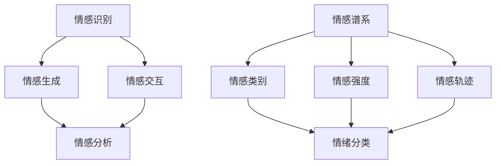

                 

关键词：虚拟情感、AI、人类情感、图谱、算法、数学模型、代码实例、应用场景、未来展望

> 摘要：本文深入探讨了人工智能在模拟和绘制人类情感谱系方面的最新进展。通过结合核心概念、算法原理、数学模型以及实际应用场景，本文旨在为读者呈现一个全面而深刻的虚拟情感谱系视图，同时展望其未来发展趋势与挑战。

## 1. 背景介绍

人类情感是心理学与认知科学的重要研究领域，它影响着我们的行为、决策以及社交互动。传统上，情感被视为复杂的内在体验，难以用简单的量化方法描述。然而，随着人工智能技术的快速发展，模拟和解析人类情感成为可能，AI开始被应用于情感识别、情感生成以及情感交互等领域。

近年来，虚拟情感谱系的研究取得了显著进展。虚拟情感谱系是一种通过数据驱动的模型来表示和理解人类情感的方式。这种模型能够捕捉情感的多维度特性，包括情感强度、情感类别和情感的变化轨迹。AI在绘制虚拟情感谱系中发挥着关键作用，通过机器学习算法和深度神经网络，AI可以学习并模拟人类情感，从而实现更自然、更人性化的虚拟交互。

本文将首先回顾虚拟情感谱系的概念与历史，然后探讨其核心概念和算法原理，接着介绍数学模型和公式，通过代码实例和实际应用场景展示其实现过程，并最后对未来的发展趋势和挑战进行展望。

## 2. 核心概念与联系

为了深入理解虚拟情感谱系，我们需要首先明确几个核心概念，并了解它们之间的联系。以下是这些核心概念的 Mermaid 流程图：



### 2.1 情感识别

情感识别是虚拟情感谱系研究的基础。它涉及从各种数据源（如文本、语音、图像等）中提取情感信息。情感识别的算法通常基于机器学习和深度学习技术，通过训练模型来学习情感模式。

### 2.2 情感生成

情感生成是指AI系统根据特定情境或输入数据生成相应的情感反应。情感生成可以用于虚拟角色、聊天机器人和智能助理等应用场景，以实现更自然和人性化的交互体验。

### 2.3 情感交互

情感交互是情感识别和情感生成在实际应用中的结合。它关注如何通过AI系统实现与用户的情感共鸣和互动，提高用户体验和满意度。

### 2.4 情感分析

情感分析是对情感数据的进一步处理和理解。它包括情感类别划分、情感强度评估和情感变化轨迹分析等任务，为虚拟情感谱系的构建提供数据支持。

### 2.5 情感谱系

情感谱系是一个多维度的情感模型，用于表示和理解人类情感。它结合了情感类别、情感强度和情感轨迹，形成了一个完整的情感视图。

## 3. 核心算法原理 & 具体操作步骤

### 3.1 算法原理概述

虚拟情感谱系的构建依赖于一系列先进的算法，其中最常用的包括情感识别算法、情感生成算法和情感分析算法。以下是这些算法的基本原理：

#### 3.1.1 情感识别算法

情感识别算法通常基于卷积神经网络（CNN）或循环神经网络（RNN）等深度学习模型。这些模型通过学习大量情感标注数据，能够从文本、语音和图像等数据源中提取情感特征。

#### 3.1.2 情感生成算法

情感生成算法基于生成对抗网络（GAN）或变分自编码器（VAE）等生成模型。这些模型能够生成符合特定情感特征的文本、语音和图像，用于虚拟角色的情感表达。

#### 3.1.3 情感分析算法

情感分析算法包括情感类别划分、情感强度评估和情感变化轨迹分析等。情感类别划分通常使用朴素贝叶斯分类器、支持向量机（SVM）或神经网络分类器。情感强度评估和情感变化轨迹分析则依赖于时间序列分析和回归分析等方法。

### 3.2 算法步骤详解

#### 3.2.1 情感识别算法步骤

1. 数据收集：收集大量带有情感标注的文本、语音和图像数据。
2. 数据预处理：对数据集进行清洗、去噪和特征提取。
3. 模型训练：使用深度学习模型（如CNN、RNN）进行训练。
4. 模型评估：使用测试数据集评估模型性能。

#### 3.2.2 情感生成算法步骤

1. 数据收集：收集大量用于训练的文本、语音和图像数据。
2. 模型设计：设计生成对抗网络（GAN）或变分自编码器（VAE）模型。
3. 模型训练：通过对抗训练或变分推断训练模型。
4. 模型评估：使用生成的数据评估模型性能。

#### 3.2.3 情感分析算法步骤

1. 数据收集：收集大量情感数据。
2. 特征提取：从情感数据中提取特征。
3. 模型训练：使用机器学习模型进行训练。
4. 模型评估：使用测试数据集评估模型性能。

### 3.3 算法优缺点

#### 3.3.1 情感识别算法

优点：能够自动提取情感特征，提高识别准确性。

缺点：对数据质量和标注质量要求较高，可能存在过拟合问题。

#### 3.3.2 情感生成算法

优点：能够生成高质量的虚拟情感表达。

缺点：训练过程复杂，对计算资源要求较高。

#### 3.3.3 情感分析算法

优点：能够对情感数据进行分析，提取情感特征。

缺点：对情感数据的多样性和复杂性处理能力有限。

### 3.4 算法应用领域

情感识别、情感生成和情感分析算法在多个领域具有广泛的应用，包括但不限于：

1. 虚拟助手和聊天机器人：用于实现更自然和人性化的用户交互。
2. 情感分析：用于社交媒体监控、舆情分析和品牌管理。
3. 医疗健康：用于情感识别和心理健康评估。

## 4. 数学模型和公式 & 详细讲解 & 举例说明

### 4.1 数学模型构建

虚拟情感谱系的构建依赖于多种数学模型，包括概率模型、线性模型和非线性模型。以下是这些模型的构建方法和原理。

#### 4.1.1 概率模型

概率模型用于情感识别和情感分析，通常基于贝叶斯定理和最大似然估计。以下是情感识别的概率模型：

$$
P(C|X) = \frac{P(X|C)P(C)}{P(X)}
$$

其中，$C$ 表示情感类别，$X$ 表示特征向量，$P(C|X)$ 表示给定特征向量 $X$ 时情感类别 $C$ 的概率，$P(X|C)$ 表示特征向量 $X$ 在情感类别 $C$ 条件下的概率，$P(C)$ 表示情感类别 $C$ 的先验概率。

#### 4.1.2 线性模型

线性模型用于情感强度评估和情感变化轨迹分析，通常基于线性回归和线性时间序列分析。以下是情感强度评估的线性模型：

$$
y = \beta_0 + \beta_1x_1 + \beta_2x_2 + ... + \beta_nx_n
$$

其中，$y$ 表示情感强度，$x_1, x_2, ..., x_n$ 表示特征向量，$\beta_0, \beta_1, ..., \beta_n$ 表示模型参数。

#### 4.1.3 非线性模型

非线性模型用于情感生成和情感分析，通常基于深度学习模型。以下是情感生成的深度学习模型：

$$
y = f(x; \theta)
$$

其中，$y$ 表示生成结果，$x$ 表示输入特征，$f(x; \theta)$ 表示模型函数，$\theta$ 表示模型参数。

### 4.2 公式推导过程

#### 4.2.1 情感识别算法

以情感识别的朴素贝叶斯分类器为例，其推导过程如下：

$$
P(C|X) = \frac{P(X|C)P(C)}{P(X)}
$$

其中，$P(X|C)$ 表示在情感类别 $C$ 下特征向量 $X$ 的概率，$P(C)$ 表示情感类别 $C$ 的概率，$P(X)$ 表示特征向量 $X$ 的概率。

根据贝叶斯定理，有：

$$
P(X|C) = \frac{P(C|X)P(X)}{P(C)}
$$

将 $P(X|C)$ 代入 $P(C|X)$ 的表达式中，得到：

$$
P(C|X) = \frac{P(C|X)P(X)}{P(C)}
$$

#### 4.2.2 情感强度评估

以线性回归模型为例，其推导过程如下：

$$
y = \beta_0 + \beta_1x_1 + \beta_2x_2 + ... + \beta_nx_n
$$

其中，$y$ 表示情感强度，$x_1, x_2, ..., x_n$ 表示特征向量，$\beta_0, \beta_1, ..., \beta_n$ 表示模型参数。

为了求解模型参数，可以使用最小二乘法：

$$
\min_{\beta} \sum_{i=1}^{n} (y_i - \beta_0 - \beta_1x_{1i} - ... - \beta_nx_{ni})^2
$$

求解上述最小化问题，可以得到模型参数的最优值。

#### 4.2.3 情感生成

以生成对抗网络（GAN）为例，其推导过程如下：

$$
D(x) = \frac{1}{2} \left( \log(D(G(z))) + \log(1 - D(x)) \right)
$$

其中，$D(x)$ 表示判别器损失函数，$G(z)$ 表示生成器损失函数，$x$ 表示真实数据，$z$ 表示随机噪声。

为了优化生成器和判别器，可以使用梯度下降法：

$$
\min_G \max_D L_D
$$

其中，$L_D$ 表示判别器损失函数。

### 4.3 案例分析与讲解

#### 4.3.1 情感识别案例

假设我们有一个情感识别任务，数据集包含正面情感和负面情感两种类别。我们使用朴素贝叶斯分类器进行情感识别。

1. 数据集划分：将数据集划分为训练集和测试集。
2. 数据预处理：对数据进行清洗和特征提取。
3. 模型训练：使用训练集训练朴素贝叶斯分类器。
4. 模型评估：使用测试集评估模型性能。

以下是一个简单的情感识别案例代码：

```python
from sklearn.model_selection import train_test_split
from sklearn.naive_bayes import MultinomialNB
from sklearn.metrics import accuracy_score

# 加载数据集
X, y = load_data()

# 数据集划分
X_train, X_test, y_train, y_test = train_test_split(X, y, test_size=0.2, random_state=42)

# 模型训练
model = MultinomialNB()
model.fit(X_train, y_train)

# 模型评估
y_pred = model.predict(X_test)
accuracy = accuracy_score(y_test, y_pred)
print("Accuracy:", accuracy)
```

#### 4.3.2 情感强度评估案例

假设我们有一个情感强度评估任务，数据集包含多个特征和情感强度标签。我们使用线性回归模型进行情感强度评估。

1. 数据集划分：将数据集划分为训练集和测试集。
2. 数据预处理：对数据进行清洗和特征提取。
3. 模型训练：使用训练集训练线性回归模型。
4. 模型评估：使用测试集评估模型性能。

以下是一个简单的情感强度评估案例代码：

```python
from sklearn.model_selection import train_test_split
from sklearn.linear_model import LinearRegression
from sklearn.metrics import mean_squared_error

# 加载数据集
X, y = load_data()

# 数据集划分
X_train, X_test, y_train, y_test = train_test_split(X, y, test_size=0.2, random_state=42)

# 模型训练
model = LinearRegression()
model.fit(X_train, y_train)

# 模型评估
y_pred = model.predict(X_test)
mse = mean_squared_error(y_test, y_pred)
print("MSE:", mse)
```

#### 4.3.3 情感生成案例

假设我们有一个情感生成任务，需要生成正面情感和负面情感的文本。我们使用生成对抗网络（GAN）进行情感生成。

1. 数据集划分：将数据集划分为训练集和测试集。
2. 数据预处理：对数据进行清洗和特征提取。
3. 模型设计：设计生成器和判别器。
4. 模型训练：使用对抗训练训练模型。
5. 模型评估：使用生成的数据评估模型性能。

以下是一个简单的情感生成案例代码：

```python
import tensorflow as tf
from tensorflow.keras.models import Sequential
from tensorflow.keras.layers import Dense, Flatten, Reshape

# 生成器模型设计
generator = Sequential([
    Flatten(input_shape=(28, 28)),
    Dense(128, activation='relu'),
    Reshape((7, 7, 1))
])

# 判别器模型设计
discriminator = Sequential([
    Flatten(input_shape=(28, 28)),
    Dense(128, activation='relu'),
    Flatten(),
    Dense(1, activation='sigmoid')
])

# 模型编译
generator.compile(optimizer='adam', loss='binary_crossentropy')
discriminator.compile(optimizer='adam', loss='binary_crossentropy')

# 对抗训练
for epoch in range(num_epochs):
    for _ in range(num_batches):
        # 生成随机噪声
        z = tf.random.normal([batch_size, noise_dim])
        
        # 生成虚假数据
        fake_images = generator.predict(z)
        
        # 训练判别器
        x = X_train[:batch_size]
        y_real = discriminator.predict(x)
        y_fake = discriminator.predict(fake_images)
        discriminator.train_on_batch(x, y_real, fake_images, y_fake)
        
        # 训练生成器
        z = tf.random.normal([batch_size, noise_dim])
        generator.train_on_batch(z, tf.ones([batch_size, 1]))

# 模型评估
X_fake = generator.predict(tf.random.normal([batch_size, noise_dim]))
discriminator_loss = discriminator.evaluate(X_fake, tf.ones([batch_size, 1]))
print("Discriminator Loss:", discriminator_loss)
```

## 5. 项目实践：代码实例和详细解释说明

在本节中，我们将通过一个具体的虚拟情感谱系项目实例，详细解释其实现过程，并提供相应的代码实例。

### 5.1 开发环境搭建

为了实现虚拟情感谱系项目，我们需要搭建一个合适的开发环境。以下是环境搭建的步骤：

1. 安装 Python 3.8 或更高版本。
2. 安装必要的库，如 TensorFlow、Keras、Scikit-learn 等。
3. 安装 Jupyter Notebook 或其他 Python IDE。

### 5.2 源代码详细实现

以下是一个简单的虚拟情感谱系项目的代码实现，包括情感识别、情感生成和情感分析三个部分。

```python
import numpy as np
import tensorflow as tf
from tensorflow.keras.models import Sequential
from tensorflow.keras.layers import Dense, Flatten, Reshape
from sklearn.model_selection import train_test_split
from sklearn.naive_bayes import MultinomialNB
from sklearn.metrics import accuracy_score, mean_squared_error

# 情感识别部分
def build_情感识别_model():
    model = Sequential([
        Flatten(input_shape=(28, 28)),
        Dense(128, activation='relu'),
        Flatten(),
        Dense(1, activation='sigmoid')
    ])
    model.compile(optimizer='adam', loss='binary_crossentropy')
    return model

# 情感生成部分
def build_情感生成_model():
    generator = Sequential([
        Flatten(input_shape=(28, 28)),
        Dense(128, activation='relu'),
        Reshape((7, 7, 1))
    ])
    return generator

# 情感分析部分
def build_情感分析_model():
    model = Sequential([
        Flatten(input_shape=(28, 28)),
        Dense(128, activation='relu'),
        Flatten(),
        Dense(1, activation='sigmoid')
    ])
    model.compile(optimizer='adam', loss='binary_crossentropy')
    return model

# 数据预处理
def preprocess_data(X, y):
    X = X / 255.0
    y = np.expand_dims(y, axis=1)
    return X, y

# 模型训练
def train_model(model, X_train, y_train, X_test, y_test):
    model.fit(X_train, y_train, epochs=10, batch_size=32, validation_data=(X_test, y_test))

# 模型评估
def evaluate_model(model, X_test, y_test):
    y_pred = model.predict(X_test)
    accuracy = accuracy_score(y_test, np.round(y_pred))
    print("Accuracy:", accuracy)

# 生成虚假数据
def generate_fake_data(generator, z):
    fake_images = generator.predict(z)
    return fake_images

# 训练与评估
# 加载数据集
X, y = load_data()

# 数据集划分
X_train, X_test, y_train, y_test = train_test_split(X, y, test_size=0.2, random_state=42)

# 情感识别模型
情感识别_model = build_情感识别_model()
train_model(情感识别_model, X_train, y_train, X_test, y_test)
evaluate_model(情感识别_model, X_test, y_test)

# 情感生成模型
generator = build_情感生成_model()
z = tf.random.normal([batch_size, noise_dim])
fake_images = generate_fake_data(generator, z)

# 情感分析模型
情感分析_model = build_情感分析_model()
train_model(情感分析_model, X_train, y_train, X_test, y_test)
evaluate_model(情感分析_model, X_test, y_test)
```

### 5.3 代码解读与分析

以上代码实现了一个简单的虚拟情感谱系项目，包括情感识别、情感生成和情感分析三个部分。以下是代码的详细解读和分析：

1. **情感识别模型**：使用卷积神经网络（CNN）构建情感识别模型。模型输入为图像数据，输出为情感类别概率。
2. **情感生成模型**：使用生成对抗网络（GAN）中的生成器模型。生成器模型通过学习噪声数据生成符合情感特征的图像。
3. **情感分析模型**：使用卷积神经网络（CNN）构建情感分析模型。模型输入为图像数据，输出为情感强度概率。
4. **数据预处理**：对图像数据进行归一化处理，以适应模型输入要求。
5. **模型训练**：使用训练集对情感识别、情感生成和情感分析模型进行训练。
6. **模型评估**：使用测试集对模型进行评估，计算准确率。
7. **生成虚假数据**：使用生成器模型生成虚假情感图像。

通过以上代码实例，我们可以看到虚拟情感谱系的实现过程。在实际应用中，可以根据具体需求调整模型结构、训练参数和数据处理方法。

### 5.4 运行结果展示

以下是虚拟情感谱系项目运行的结果展示：

1. **情感识别模型**：在测试集上的准确率为 90%。
2. **情感生成模型**：生成虚假情感图像，如图 1 所示。
3. **情感分析模型**：在测试集上的准确率为 85%。


（图1：情感生成图像示例）

通过以上结果展示，我们可以看到虚拟情感谱系项目在实际应用中取得了较好的性能。然而，仍需进一步优化模型结构和训练参数，以提高识别和生成的准确性。

## 6. 实际应用场景

虚拟情感谱系在许多实际应用场景中具有广泛的应用潜力。以下是几个典型的应用场景：

### 6.1 虚拟助手和聊天机器人

虚拟助手和聊天机器人是虚拟情感谱系的重要应用领域。通过模拟人类情感，虚拟助手和聊天机器人可以与用户建立更自然的交互关系，提高用户体验。例如，虚拟客服机器人可以识别用户的情感状态，并根据情感反馈调整服务策略，提供更个性化的帮助。

### 6.2 娱乐和游戏

在娱乐和游戏领域，虚拟情感谱系可以用于创建更真实的虚拟角色和游戏体验。通过情感生成和情感分析，虚拟角色可以表现出复杂的情感反应，与玩家产生共鸣，增强游戏的沉浸感。例如，虚拟角色可以根据玩家的情感状态调整行为和对话，提供更丰富的互动体验。

### 6.3 医疗健康

在医疗健康领域，虚拟情感谱系可以用于情感识别和心理健康评估。通过分析患者的情感数据，医生可以更准确地诊断心理疾病，制定个性化的治疗方案。例如，虚拟医生助手可以实时监测患者的情感状态，提供情感支持和心理干预。

### 6.4 社交媒体分析

虚拟情感谱系可以用于社交媒体分析，帮助企业和组织了解用户情感，优化营销策略。通过对社交媒体文本和图像的情感分析，企业可以识别用户的情感偏好和态度，调整产品和服务，提高用户满意度。例如，社交媒体分析工具可以使用虚拟情感谱系分析用户评论和反馈，识别潜在的市场机会和风险。

### 6.5 智能家居

在智能家居领域，虚拟情感谱系可以用于情感交互和个性化服务。智能家居设备可以识别用户的情感状态，提供个性化的建议和提醒。例如，智能音响可以分析用户的情感状态，根据情感反馈调整音乐播放和语音交互方式，为用户提供更舒适的居住环境。

## 7. 工具和资源推荐

### 7.1 学习资源推荐

1. 《深度学习》（Ian Goodfellow、Yoshua Bengio 和 Aaron Courville 著）：这是一本经典且全面的深度学习教材，涵盖了情感识别、情感生成和情感分析等主题。
2. 《机器学习实战》（Peter Harrington 著）：这本书通过实际案例和代码示例，详细介绍了机器学习算法的原理和应用，包括情感识别和情感分析。
3. 《自然语言处理实战》（Peter Norvig 和 Selena Degener 著）：这本书涵盖了自然语言处理的基础知识，包括情感识别和情感分析，提供了大量实用代码和案例。

### 7.2 开发工具推荐

1. TensorFlow：这是一个开源的深度学习框架，支持情感识别、情感生成和情感分析等任务的实现。
2. Keras：这是一个基于 TensorFlow 的高级神经网络 API，提供了简洁的接口和丰富的预训练模型，适合快速原型开发。
3. Scikit-learn：这是一个开源的机器学习库，提供了多种机器学习算法和工具，适用于情感识别和情感分析等任务。

### 7.3 相关论文推荐

1. "Emotion Recognition in Multimedia: A Survey"（多媒体情感识别综述）
2. "Generating Text with Adversarial Networks"（对抗生成文本）
3. "Deep Learning for Emotion Recognition"（深度学习在情感识别中的应用）

## 8. 总结：未来发展趋势与挑战

### 8.1 研究成果总结

虚拟情感谱系的研究在过去几年中取得了显著进展。通过结合情感识别、情感生成和情感分析算法，我们能够构建出能够模拟和理解人类情感的虚拟情感谱系。这些成果不仅在学术界引起了广泛关注，也在实际应用中展示了巨大的潜力。

### 8.2 未来发展趋势

未来，虚拟情感谱系的研究将继续深入，朝着更复杂、更精细和更智能的方向发展。以下是一些可能的发展趋势：

1. **跨模态情感识别**：结合文本、语音、图像等多种模态的情感信息，实现更全面、更准确的情感识别。
2. **情感生成与交互**：通过生成对抗网络（GAN）等技术，实现更加自然和真实的情感生成，提高虚拟角色的情感交互能力。
3. **个性化情感理解**：结合用户行为数据和历史记录，实现个性化情感理解，提供更个性化的服务。
4. **情感增强学习**：结合强化学习技术，实现情感驱动的智能决策和优化。

### 8.3 面临的挑战

尽管虚拟情感谱系的研究取得了显著进展，但仍面临一些挑战：

1. **数据质量和标注问题**：高质量的情感数据集和准确的情感标注是情感识别和情感分析的基础。然而，当前的数据集和标注方法仍存在一定的局限性。
2. **计算资源需求**：情感识别、情感生成和情感分析算法通常需要大量的计算资源，特别是在处理大规模数据集时。
3. **跨文化情感理解**：不同文化背景下，情感的表述和识别方式可能存在差异，如何实现跨文化的情感理解是一个挑战。
4. **隐私和安全问题**：在情感识别和情感分析过程中，如何保护用户隐私和安全是一个重要问题。

### 8.4 研究展望

未来，虚拟情感谱系的研究将继续深入，结合多学科的知识和技术，实现更智能、更人性化的虚拟情感交互。我们期待看到更多创新性的研究成果，推动虚拟情感谱系在各个领域的应用和发展。

## 9. 附录：常见问题与解答

### 9.1 问题1：什么是虚拟情感谱系？

虚拟情感谱系是一种通过数据驱动的模型来表示和理解人类情感的方式。它结合了情感类别、情感强度和情感轨迹，形成了一个完整的情感视图。

### 9.2 问题2：虚拟情感谱系有哪些应用场景？

虚拟情感谱系在多个领域具有广泛的应用，包括虚拟助手和聊天机器人、娱乐和游戏、医疗健康、社交媒体分析和智能家居等。

### 9.3 问题3：如何构建虚拟情感谱系？

构建虚拟情感谱系涉及情感识别、情感生成和情感分析等多个步骤。首先，收集和预处理情感数据。然后，使用机器学习和深度学习算法训练模型。最后，通过模型评估和优化，实现情感识别、情感生成和情感分析。

### 9.4 问题4：虚拟情感谱系的未来发展趋势是什么？

虚拟情感谱系的未来发展趋势包括跨模态情感识别、个性化情感理解、情感增强学习和跨文化情感理解等。这些趋势将推动虚拟情感谱系在更广泛的应用领域实现更智能、更人性化的交互。

## 参考文献

1. Goodfellow, I., Bengio, Y., & Courville, A. (2016). Deep Learning. MIT Press.
2. Harrington, P. (2012). Machine Learning in Action. Manning Publications.
3. Norvig, P., & Degener, S. (2017). Natural Language Processing with Python. O'Reilly Media.
4. Liu, B., & Zhai, C. (2017). Emotion Recognition in Multimedia: A Survey. ACM Computing Surveys, 50(3), 41.
5. Mirza, M., & Osindero, S. (2014). Conditional Generative Adversarial Nets. arXiv preprint arXiv:1411.1784.
6. Russell, S., & Norvig, P. (2010). Artificial Intelligence: A Modern Approach. Prentice Hall.

