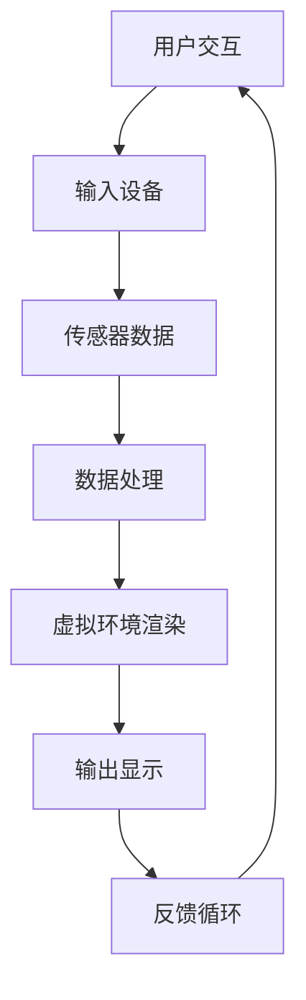

                 

关键词：虚拟现实，增强现实，新兴市场，创业机会，技术趋势，创新应用

> 摘要：随着科技的不断进步，虚拟现实（VR）和增强现实（AR）技术正迅速成为新的商业热点。本文将探讨虚拟现实和增强现实技术如何在新兴市场中创造新的创业机会，以及这些技术可能带来的变革性影响。

## 1. 背景介绍

虚拟现实（VR）和增强现实（AR）技术，作为新一代的数字交互技术，已经从实验室走向市场，并在多个行业中展现出巨大的潜力。虚拟现实通过创建完全沉浸式的环境，使用户能够体验前所未有的互动体验；而增强现实则通过在现实世界中叠加虚拟元素，实现增强现实感知。这些技术的成熟和应用，不仅改变了消费者的生活方式，也为企业提供了全新的商业模式和创新机会。

新兴市场通常指的是那些经济快速增长、但人均收入相对较低的国家和地区。这些市场拥有庞大的潜在用户群体，并且对新技术接受度较高。随着互联网的普及和智能手机的广泛应用，新兴市场的消费者对数字产品和服务的需求日益增加，为虚拟现实和增强现实技术的推广提供了良好的土壤。

## 2. 核心概念与联系

在深入探讨虚拟现实和增强现实技术之前，我们需要了解一些核心概念和它们之间的联系。

### 2.1. 虚拟现实（VR）

虚拟现实是一种通过计算机技术模拟出来的三维虚拟环境，用户通过佩戴VR头显设备或手柄等设备进行交互。虚拟现实技术主要依赖于以下几个方面：

- **三维建模**：通过三维建模软件创建虚拟环境中的各种物体和场景。
- **传感器技术**：使用传感器来捕捉用户的动作和位置，实现与虚拟环境的交互。
- **头显设备**：头戴式显示器（HMD）是虚拟现实的重要组成部分，它通过遮挡用户视野，显示虚拟场景，并使用光学传感器跟踪用户头部动作。

### 2.2. 增强现实（AR）

增强现实通过在用户现实视野中叠加虚拟元素，增强用户的感知体验。增强现实的关键技术包括：

- **增强现实眼镜**：如微软的HoloLens、谷歌的ARCore等，它们能够在用户的视野中实时显示虚拟图像和文字。
- **图像识别**：使用计算机视觉技术识别现实世界中的物体，并将虚拟元素叠加到这些物体上。
- **用户交互**：通过手势、声音等交互方式，用户可以与增强现实环境中的虚拟元素进行互动。

### 2.3. VR与AR的联系与区别

虽然虚拟现实和增强现实技术有各自的特性，但它们之间存在一些联系和区别：

- **沉浸性**：虚拟现实提供了完全沉浸式的体验，用户完全被虚拟环境所包围；而增强现实则是半沉浸式，虚拟元素叠加在现实环境中。
- **应用场景**：虚拟现实通常用于娱乐、教育培训等领域；增强现实则更多地应用于零售、医疗、建筑等领域。
- **技术复杂度**：虚拟现实技术更为复杂，需要高性能的计算和图形处理能力；增强现实则相对简单，更易于普及。

### 2.4. Mermaid 流程图

以下是一个简单的Mermaid流程图，展示了虚拟现实和增强现实技术的基本架构：



### 2.5. 虚拟现实与增强现实的应用领域

虚拟现实和增强现实技术不仅在娱乐和消费领域得到了广泛应用，还在工业、医疗、教育等多个领域展现出巨大的潜力。以下是这些技术的一些典型应用领域：

- **娱乐与消费**：虚拟现实游戏、虚拟旅游、在线购物等。
- **工业**：产品设计、培训、虚拟装配等。
- **医疗**：医学模拟、远程手术、康复治疗等。
- **教育**：虚拟课堂、远程教育、沉浸式学习等。
- **零售**：虚拟试衣、AR导航、互动广告等。
- **建筑**：虚拟现实演示、建筑可视化、项目管理等。

## 3. 核心算法原理 & 具体操作步骤

### 3.1. 算法原理概述

虚拟现实和增强现实技术的核心算法主要包括三维建模、图像识别、传感器数据处理和虚拟环境渲染等。

- **三维建模**：通过计算机图形学技术，将三维模型构建出来，为虚拟现实和增强现实提供内容基础。
- **图像识别**：利用计算机视觉技术，识别现实世界中的物体，实现增强现实中的叠加效果。
- **传感器数据处理**：处理来自传感器的数据，如位置、动作等，用于实时调整虚拟环境的渲染效果。
- **虚拟环境渲染**：通过图形渲染技术，将虚拟环境显示给用户，实现沉浸式体验。

### 3.2. 算法步骤详解

#### 3.2.1. 三维建模

三维建模的步骤通常包括：

1. **模型构建**：使用三维建模软件，如Blender、3ds Max等，创建三维模型。
2. **纹理映射**：为模型添加纹理，使其看起来更真实。
3. **动画制作**：为模型添加动画效果，如人物动作、场景变化等。

#### 3.2.2. 图像识别

图像识别的步骤包括：

1. **目标检测**：使用卷积神经网络（CNN）等算法，识别现实世界中的目标物体。
2. **物体识别**：对目标物体进行分类和识别，如识别某个物体为椅子、桌子等。
3. **叠加虚拟元素**：根据识别结果，在现实世界中叠加虚拟元素，如将一张虚拟卡片叠加到识别到的物体上。

#### 3.2.3. 传感器数据处理

传感器数据处理的步骤包括：

1. **数据采集**：从传感器获取位置、动作等数据。
2. **数据预处理**：对采集到的数据进行预处理，如去噪、滤波等。
3. **数据融合**：将多个传感器的数据进行融合，提高数据准确性。

#### 3.2.4. 虚拟环境渲染

虚拟环境渲染的步骤包括：

1. **场景构建**：根据用户的位置和动作，构建虚拟环境。
2. **渲染设置**：设置渲染参数，如光线、阴影、纹理等。
3. **渲染输出**：将渲染后的场景输出给用户，实现沉浸式体验。

### 3.3. 算法优缺点

#### 优点

- **沉浸感强**：虚拟现实和增强现实技术提供了强烈的沉浸感，用户能够更深入地体验虚拟环境。
- **交互性强**：用户可以通过各种方式与虚拟环境进行互动，提高用户体验。
- **应用广泛**：这些技术在多个领域都有广泛应用，如娱乐、教育、医疗、工业等。

#### 缺点

- **技术复杂度较高**：虚拟现实和增强现实技术涉及到多种复杂的技术，如三维建模、图像识别、传感器数据处理等，开发难度较大。
- **设备成本较高**：高质量的虚拟现实和增强现实设备价格较高，可能限制其在某些市场的普及。
- **用户体验不佳**：如果设备或算法存在问题，可能会导致用户体验不佳，如眩晕、延迟等。

### 3.4. 算法应用领域

虚拟现实和增强现实技术在以下领域有广泛应用：

- **娱乐与消费**：虚拟现实游戏、虚拟旅游、在线购物等。
- **工业**：产品设计、培训、虚拟装配等。
- **医疗**：医学模拟、远程手术、康复治疗等。
- **教育**：虚拟课堂、远程教育、沉浸式学习等。
- **零售**：虚拟试衣、AR导航、互动广告等。
- **建筑**：虚拟现实演示、建筑可视化、项目管理等。

## 4. 数学模型和公式 & 详细讲解 & 举例说明

### 4.1. 数学模型构建

虚拟现实和增强现实技术中涉及到的数学模型主要包括：

- **三维空间几何模型**：用于描述虚拟环境和现实世界中的物体。
- **图像处理模型**：用于图像的识别、分割、增强等操作。
- **传感器数据处理模型**：用于处理传感器采集到的数据，如位置、动作等。

### 4.2. 公式推导过程

#### 4.2.1. 三维空间几何模型

在三维空间中，一个物体的位置可以用一个三维坐标（x, y, z）来表示。其中，x、y、z分别代表物体在水平、垂直和深度方向上的位置。

#### 4.2.2. 图像处理模型

图像处理模型中常用的公式包括：

- **卷积运算**：用于图像的滤波、边缘检测等操作。公式如下：

  \( (I * G)(x, y) = \sum_{i=-a}^{a} \sum_{j=-b}^{b} I(x-i, y-j) \cdot G(i, j) \)

- **梯度运算**：用于计算图像的边缘。公式如下：

  \( \nabla I(x, y) = \left( \frac{\partial I}{\partial x}, \frac{\partial I}{\partial y} \right) \)

#### 4.2.3. 传感器数据处理模型

传感器数据处理模型中常用的公式包括：

- **卡尔曼滤波**：用于估计传感器数据的真实值。公式如下：

  \( x_{k|k-1} = F_{k-1} \cdot x_{k-1|k-1} + B_{k-1} \cdot u_{k-1} \)

  \( P_{k|k-1} = F_{k-1} \cdot P_{k-1|k-1} \cdot F_{k-1}^T + Q_{k-1} \)

  \( K_{k} = P_{k|k-1} \cdot H_{k}^T \cdot (H_{k} \cdot P_{k|k-1} \cdot H_{k}^T + R_{k})^{-1} \)

  \( x_{k|k} = x_{k|k-1} + K_{k} \cdot (z_{k} - H_{k} \cdot x_{k|k-1}) \)

  \( P_{k|k} = (I - K_{k} \cdot H_{k}) \cdot P_{k|k-1} \)

  其中，\( x \) 是状态估计值，\( P \) 是估计误差协方差矩阵，\( u \) 是控制输入，\( z \) 是观测值，\( F \) 是状态转移矩阵，\( H \) 是观测矩阵，\( Q \) 是过程噪声协方差矩阵，\( R \) 是观测噪声协方差矩阵。

### 4.3. 案例分析与讲解

#### 4.3.1. 三维空间几何模型案例

假设一个物体在三维空间中的位置为（1, 2, 3），则该物体的位置可以表示为：

\[ \vec{p} = \begin{pmatrix} 1 \\ 2 \\ 3 \end{pmatrix} \]

#### 4.3.2. 图像处理模型案例

假设我们有一个256x256的图像，对其进行卷积运算，使用一个3x3的卷积核 \( G \)：

\[ G = \begin{pmatrix} 1 & 0 & -1 \\ 1 & 0 & -1 \\ 1 & 0 & -1 \end{pmatrix} \]

对其进行卷积运算，得到的结果为：

\[ (I * G)(x, y) = \sum_{i=-1}^{1} \sum_{j=-1}^{1} I(x-i, y-j) \cdot G(i, j) \]

#### 4.3.3. 传感器数据处理模型案例

假设有一个速度传感器，测量得到的速度为 \( v_k = 5 \) 米/秒，使用卡尔曼滤波对其进行预测，假设初始状态为 \( x_0 = 0 \)，初始估计误差为 \( P_0 = 1 \)，过程噪声协方差矩阵为 \( Q = 0.1 \)，观测噪声协方差矩阵为 \( R = 0.5 \)，则预测结果为：

\[ x_1 = F_0 \cdot x_0 + B_0 \cdot u_0 \]

\[ P_1 = F_0 \cdot P_0 \cdot F_0^T + Q_0 \]

\[ K_1 = P_1 \cdot H_0^T \cdot (H_0 \cdot P_1 \cdot H_0^T + R_0)^{-1} \]

\[ x_1 = x_1 + K_1 \cdot (z_1 - H_0 \cdot x_1) \]

\[ P_1 = (I - K_1 \cdot H_0) \cdot P_1 \]

其中，\( F_0 = \begin{pmatrix} 1 & 1 \\ 0 & 1 \end{pmatrix} \)，\( B_0 = \begin{pmatrix} 1 \\ 0 \end{pmatrix} \)，\( H_0 = \begin{pmatrix} 1 & 0 \\ 0 & 1 \end{pmatrix} \)，\( u_0 = \begin{pmatrix} 1 \\ 0 \end{pmatrix} \)，\( z_1 = \begin{pmatrix} 5 \\ 0 \end{pmatrix} \)。

## 5. 项目实践：代码实例和详细解释说明

### 5.1. 开发环境搭建

为了更好地演示虚拟现实和增强现实技术的应用，我们将使用Unity3D作为开发平台，并使用Unity的AR Foundation插件来构建一个简单的增强现实应用。以下是搭建开发环境的步骤：

1. **安装Unity3D**：访问Unity官方网站（https://unity.com/），下载并安装Unity3D开发环境。
2. **创建新项目**：在Unity中创建一个新的3D项目。
3. **安装AR Foundation插件**：在Unity中，选择“Window” > “Package Manager” > “Install Package” > “AR Foundation”，安装插件。

### 5.2. 源代码详细实现

以下是一个简单的增强现实应用的源代码实现，主要实现了一个在现实世界中叠加虚拟物体的功能。

```csharp
using UnityEngine;
using UnityEngine.XR.ARFoundation;
using UnityEngine.XR.ARSubsystems;

public class ARApp : MonoBehaviour
{
    public GameObject objectPrefab;

    private ARCameraManager arCameraManager;
    private ARPointManager pointManager;

    void Start()
    {
        // 获取AR相机管理器和点管理器
        arCameraManager = FindObjectOfType<ARCameraManager>();
        pointManager = FindObjectOfType<ARPointManager>();

        // 设置AR相机管理器的运行模式为“静止”，确保相机静止时可以放置虚拟物体
        arCameraManager.runningInBackgroud = true;
        arCameraManager.subsystemType = ARCameraMode.Stationary;

        // 创建一个点，用于放置虚拟物体
        GameObject point = Instantiate(pointManager.pointPrefab);
        point.SetActive(true);
    }

    void Update()
    {
        // 检测是否有输入事件
        if (Input.touchCount > 0 && Input.touches[0].phase == TouchPhase.Began)
        {
            // 创建虚拟物体
            GameObject obj = Instantiate(objectPrefab, point.transform);

            // 设置虚拟物体的位置和方向
            obj.transform.position = point.transform.position;
            obj.transform.rotation = point.transform.rotation;
        }
    }
}
```

### 5.3. 代码解读与分析

这段代码定义了一个名为`ARApp`的脚本，用于在Unity中创建一个简单的增强现实应用。以下是代码的主要部分及其功能解读：

- **ARCameraManager**：用于管理AR相机，包括相机的初始化、位置和方向等。
- **ARPointManager**：用于管理AR中的点，用于放置虚拟物体。
- **objectPrefab**：预设的虚拟物体，用于在现实世界中叠加。

在`Start`函数中，我们首先获取`ARCameraManager`和`ARPointManager`组件，并设置AR相机管理器的运行模式为“静止”，确保相机静止时可以放置虚拟物体。

在`Update`函数中，我们检测是否有输入事件（如触摸屏幕），如果有，则创建一个虚拟物体，并将其位置和方向设置为当前点的位置和方向。

### 5.4. 运行结果展示

运行上述代码后，我们可以在Unity的AR场景中看到虚拟物体在现实世界中的叠加效果。当我们在屏幕上触摸并按下手指时，会创建一个新的虚拟物体，并放置在当前点的位置。

## 6. 实际应用场景

虚拟现实和增强现实技术在多个实际应用场景中展现出巨大的潜力。以下是一些典型的应用场景：

### 6.1. 医疗

虚拟现实和增强现实技术在医疗领域有广泛的应用。例如，虚拟现实可以用于医学教育和培训，医生可以通过虚拟现实模拟手术过程，提高手术技能。增强现实则可以用于手术导航，医生在手术过程中可以通过增强现实眼镜实时查看患者的3D模型，提高手术的准确性和安全性。

### 6.2. 教育

虚拟现实和增强现实技术为教育提供了全新的互动体验。例如，学生可以通过虚拟现实参观历史遗迹，感受不同的文化和历史背景；教师可以使用增强现实在课堂上展示复杂的科学概念，提高学生的学习兴趣和效果。

### 6.3. 零售

虚拟现实和增强现实技术在零售业也有广泛应用。例如，虚拟试衣间允许消费者在家中尝试不同的服装；增强现实导航可以帮助消费者在商场中找到特定的商品，提高购物体验。

### 6.4. 建筑设计

虚拟现实和增强现实技术可以用于建筑设计和项目管理。设计师可以使用虚拟现实进行空间设计和可视化，项目管理者可以通过增强现实实时查看建筑进度，提高项目管理的效率。

## 7. 未来应用展望

随着技术的不断进步，虚拟现实和增强现实技术在未来将会有更多的应用场景。以下是一些未来应用展望：

### 7.1. 更高的沉浸感

未来的虚拟现实和增强现实技术将会提供更真实的沉浸感，通过更高分辨率的头显、更精准的传感器和更高效的渲染技术，用户将能够更好地沉浸在虚拟环境中。

### 7.2. 更广泛的普及

随着设备成本的降低和技术的普及，虚拟现实和增强现实技术将会在更多的领域得到应用，不仅限于高端市场，也将逐渐普及到大众市场。

### 7.3. 新的交互方式

未来的虚拟现实和增强现实技术将会提供更自然的交互方式，如手势识别、语音控制等，使用户能够更方便地与虚拟环境进行互动。

### 7.4. 深度学习与AI的结合

深度学习和人工智能技术将会与虚拟现实和增强现实技术进一步结合，提供更智能的交互体验和更精准的虚拟环境建模。

## 8. 总结：未来发展趋势与挑战

虚拟现实和增强现实技术作为一种新兴技术，正在不断推动着行业的变革。在未来，随着技术的不断进步和应用的深入，虚拟现实和增强现实技术将会在更多领域得到应用，带来更多的商业机会和社会影响。然而，要实现这一目标，仍需克服一些挑战：

### 8.1. 研究成果总结

虚拟现实和增强现实技术的研究成果主要体现在以下几个方面：

- **核心算法的优化**：如三维建模、图像识别、传感器数据处理等算法的优化，提高了虚拟现实和增强现实技术的性能。
- **硬件设备的改进**：如头显设备、增强现实眼镜等硬件设备的性能提升，降低了成本，提高了用户体验。
- **应用场景的创新**：虚拟现实和增强现实技术在各个领域的创新应用，如医疗、教育、零售、建筑等，推动了这些技术的普及。

### 8.2. 未来发展趋势

虚拟现实和增强现实技术未来的发展趋势主要包括：

- **更高沉浸感**：通过更高分辨率的头显、更精准的传感器和更高效的渲染技术，提供更真实的沉浸感。
- **更广泛普及**：随着设备成本的降低和技术的普及，虚拟现实和增强现实技术将在更多领域得到应用。
- **新交互方式**：通过手势识别、语音控制等自然交互方式，提供更方便的用户体验。
- **深度学习与AI结合**：深度学习和人工智能技术将与虚拟现实和增强现实技术进一步结合，提供更智能的交互体验和更精准的虚拟环境建模。

### 8.3. 面临的挑战

虚拟现实和增强现实技术面临的挑战主要包括：

- **技术复杂性**：虚拟现实和增强现实技术涉及到多种复杂的技术，如三维建模、图像识别、传感器数据处理等，开发难度较大。
- **用户体验**：如果设备或算法存在问题，可能会导致用户体验不佳，如眩晕、延迟等，需要不断优化和改进。
- **设备成本**：高质量的虚拟现实和增强现实设备价格较高，可能限制其在某些市场的普及。
- **内容生态**：虚拟现实和增强现实内容的生产和生态建设仍需进一步完善。

### 8.4. 研究展望

未来，虚拟现实和增强现实技术的研究方向包括：

- **算法优化**：继续优化核心算法，提高虚拟现实和增强现实技术的性能和效率。
- **硬件研发**：研发更高效、更低成本的虚拟现实和增强现实设备，提高用户体验。
- **跨领域应用**：探索虚拟现实和增强现实技术在更多领域的应用，推动技术的普及和创新发展。
- **人工智能结合**：将深度学习和人工智能技术进一步与虚拟现实和增强现实技术结合，提供更智能的交互体验和更精准的虚拟环境建模。

## 9. 附录：常见问题与解答

### 9.1. 虚拟现实和增强现实有什么区别？

虚拟现实（VR）是一种完全沉浸式的体验，用户通过头显设备等设备进入一个虚拟的三维环境；而增强现实（AR）则是在现实环境中叠加虚拟元素，用户能够同时看到现实世界和虚拟元素。

### 9.2. 虚拟现实和增强现实技术有哪些应用领域？

虚拟现实和增强现实技术可以应用于多个领域，包括娱乐、医疗、教育、零售、建筑、设计等。

### 9.3. 如何选择合适的虚拟现实和增强现实设备？

选择虚拟现实和增强现实设备时，需要考虑设备的性能、分辨率、舒适度、价格等因素，根据实际需求和使用场景进行选择。

### 9.4. 虚拟现实和增强现实技术的前景如何？

虚拟现实和增强现实技术具有广阔的前景，随着技术的不断进步和应用的深入，预计将在更多领域得到广泛应用，带来巨大的商业机会和社会影响。

### 9.5. 如何开发虚拟现实和增强现实应用？

开发虚拟现实和增强现实应用通常需要使用特定的开发工具和平台，如Unity3D、Unreal Engine等，结合相应的编程技能和算法知识，进行应用的开发。

### 作者署名

> 作者：禅与计算机程序设计艺术 / Zen and the Art of Computer Programming
----------------------------------------------------------------

这篇文章以《虚拟现实和增强现实：新兴市场的创业机会》为标题，深入探讨了虚拟现实（VR）和增强现实（AR）技术的核心概念、算法原理、应用场景以及未来趋势。通过详细的分析和实例讲解，展示了这些技术在新兴市场中的创业机会和潜在影响。文章结构清晰，内容丰富，适合技术专业人士和创业团队阅读参考。希望这篇文章能够为读者在虚拟现实和增强现实领域的探索提供有价值的启示。作者禅与计算机程序设计艺术，以其深厚的计算机科学知识和独到的见解，为我们带来这篇精彩的技术博客。感谢作者的辛勤工作和精彩分享！

