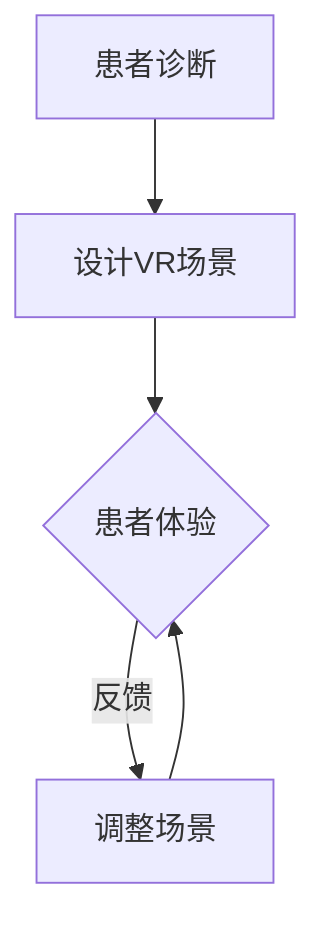

                 

关键词：虚拟现实，心理治疗，VR疗法，认知行为疗法，情感调节

> 摘要：本文探讨了虚拟现实（VR）技术在心理治疗领域的应用，通过分析其核心概念与联系，介绍了VR疗法的工作原理、应用场景以及未来发展方向。文章旨在为专业人士和研究人员提供一份关于VR在心理治疗中应用的全景指南。

## 1. 背景介绍

随着技术的不断进步，虚拟现实（Virtual Reality，简称VR）逐渐成为人们关注的焦点。VR技术通过创建一个虚拟的三维环境，让用户在其中沉浸和互动，提供了一种全新的感知和体验方式。这种技术在娱乐、教育、医疗等多个领域都展现出巨大的潜力。

在心理治疗领域，传统的治疗方法如认知行为疗法（Cognitive Behavioral Therapy，简称CBT）和暴露疗法（Exposure Therapy）已有广泛应用，但存在一些局限性，如患者的焦虑和恐惧感难以克服、治疗效果不易巩固等。VR技术的引入为心理治疗带来了一种创新的疗法——VR疗法。

VR疗法通过模拟患者需要面对的情境，让患者在一个安全、可控的环境中逐步暴露和处理这些情境，从而减轻焦虑和恐惧。与传统疗法相比，VR疗法具有以下几个优点：

- **高互动性**：患者可以在VR环境中主动参与，增强治疗的参与感和体验感。
- **安全性**：虚拟环境可以控制情境的强度和频率，避免过度刺激。
- **可重复性**：患者可以多次进入相同的虚拟环境，重复练习，巩固治疗效果。
- **便捷性**：VR设备通常便携，可以随时随地使用。

## 2. 核心概念与联系

### 虚拟现实（VR）技术

VR技术是指通过计算机模拟产生一个虚拟环境，用户可以通过VR头盔、眼镜等设备感知并与之互动。一个典型的VR系统包括以下几个核心组成部分：

- **VR设备**：如VR头盔、手柄等，用于提供沉浸式体验。
- **渲染引擎**：用于实时生成和渲染虚拟环境。
- **传感器**：如摄像头、陀螺仪等，用于捕捉用户动作和位置，实现互动。

### 认知行为疗法（CBT）

认知行为疗法是一种心理治疗方法，通过改变患者的认知和行为模式来减轻心理问题。CBT的核心概念包括：

- **认知重塑**：改变患者对事件的认知和解释方式。
- **行为激活**：鼓励患者参与特定的行为活动，以增强其积极情绪。

### 情感调节

情感调节是指通过特定的策略和技巧来调节和改善情绪状态。情感调节的方法包括：

- **认知重构**：通过改变对事件的认知来减轻负面情绪。
- **情绪表达**：通过表达和分享情绪来减轻压力。
- **放松训练**：通过深呼吸、渐进性肌肉放松等方法来减轻紧张和焦虑。

### VR疗法与CBT、情感调节的联系

VR疗法将VR技术与CBT、情感调节相结合，通过模拟特定的情境，让患者在虚拟环境中进行认知重塑和情感调节。具体而言：

- **认知重塑**：患者在VR环境中面对特定的情境，通过认知重构来减轻焦虑和恐惧。
- **情感调节**：患者在VR环境中通过互动和体验来调节和改善情绪状态。

### Mermaid 流程图

以下是VR疗法工作流程的Mermaid流程图：



## 3. 核心算法原理 & 具体操作步骤

### 3.1 算法原理概述

VR疗法的工作原理基于以下几个核心算法：

- **场景渲染算法**：用于生成和渲染虚拟环境。
- **传感器数据处理算法**：用于处理传感器数据，实现用户与环境之间的互动。
- **认知行为疗法算法**：用于引导患者进行认知重塑和情感调节。

### 3.2 算法步骤详解

#### 3.2.1 场景渲染算法

场景渲染算法的主要任务是实时生成和渲染虚拟环境。具体步骤如下：

1. **场景建模**：根据治疗目标，设计并构建虚拟环境的三维模型。
2. **光照计算**：根据场景的几何结构和材料属性，计算光照效果。
3. **渲染引擎**：使用渲染引擎（如Unity、Unreal Engine）进行实时渲染。

#### 3.2.2 传感器数据处理算法

传感器数据处理算法用于处理用户头盔、手柄等传感器的数据，实现用户与环境之间的互动。具体步骤如下：

1. **数据采集**：从传感器中采集用户的位置、方向、动作等数据。
2. **数据预处理**：对采集到的数据进行预处理，如滤波、去噪等。
3. **互动计算**：根据预处理后的数据，计算用户与环境之间的互动效果。

#### 3.2.3 认知行为疗法算法

认知行为疗法算法用于引导患者进行认知重塑和情感调节。具体步骤如下：

1. **情境设置**：根据患者的需求和治疗目标，设置虚拟情境。
2. **认知重塑**：通过引导患者观察、分析和解释情境，帮助其重塑认知。
3. **情感调节**：通过提供情感支持和调节技巧，帮助患者调节情绪。

### 3.3 算法优缺点

#### 优点：

- **高互动性**：患者可以在虚拟环境中主动参与，增强治疗的参与感。
- **安全性**：虚拟环境可以控制情境的强度和频率，避免过度刺激。
- **可重复性**：患者可以多次进入相同的虚拟环境，重复练习，巩固治疗效果。
- **便捷性**：VR设备通常便携，可以随时随地使用。

#### 缺点：

- **技术依赖性**：VR疗法需要依赖先进的技术设备和算法，对技术要求较高。
- **操作复杂性**：VR疗法的操作步骤相对复杂，需要专业人员进行设计和实施。
- **患者适应性**：部分患者可能对VR技术产生不适，影响治疗效果。

### 3.4 算法应用领域

VR疗法在以下领域具有广泛的应用：

- **焦虑症治疗**：如社交焦虑、广场综合症、恐怖症等。
- **抑郁症治疗**：通过虚拟情境的暴露和认知重塑，缓解抑郁症状。
- **创伤后应激障碍（PTSD）治疗**：通过虚拟情境的暴露和认知重塑，减轻PTSD症状。
- **行为疗法**：如恐惧症、强迫症等行为障碍的治疗。

## 4. 数学模型和公式 & 详细讲解 & 举例说明

### 4.1 数学模型构建

VR疗法中的数学模型主要包括以下几部分：

- **情境模拟模型**：用于模拟患者需要面对的情境。
- **认知重塑模型**：用于指导患者进行认知重塑。
- **情感调节模型**：用于帮助患者调节情绪。

### 4.2 公式推导过程

#### 情境模拟模型

情境模拟模型基于概率论和图论，用于生成患者需要面对的情境。具体公式如下：

\[ P(A|B) = \frac{P(B|A)P(A)}{P(B)} \]

其中，\( P(A|B) \) 表示在给定情境 \( B \) 下，事件 \( A \) 发生的概率；\( P(B|A) \) 表示在事件 \( A \) 发生时，情境 \( B \) 发生的概率；\( P(A) \) 和 \( P(B) \) 分别表示事件 \( A \) 和情境 \( B \) 的发生概率。

#### 认知重塑模型

认知重塑模型基于决策理论，用于指导患者进行认知重塑。具体公式如下：

\[ U(A) = \sum_{i=1}^{n} p_i u_i \]

其中，\( U(A) \) 表示在给定情境 \( A \) 下，患者的效用值；\( p_i \) 和 \( u_i \) 分别表示患者对每个可能结果的概率和效用值。

#### 情感调节模型

情感调节模型基于情感计算理论，用于帮助患者调节情绪。具体公式如下：

\[ E(A) = \sum_{i=1}^{n} p_i e_i \]

其中，\( E(A) \) 表示在给定情境 \( A \) 下，患者的情感值；\( p_i \) 和 \( e_i \) 分别表示患者对每个可能结果的概率和情感值。

### 4.3 案例分析与讲解

以下是一个关于社交焦虑治疗的VR疗法案例：

#### 案例描述

患者小明患有社交焦虑症，他害怕在公共场合与人交流。治疗师决定使用VR疗法帮助他克服这种焦虑。

#### 情境设置

治疗师设计了一个模拟公共场合的场景，如咖啡厅、图书馆等。场景中包含了不同的人物，如朋友、同事、陌生人等。

#### 认知重塑

治疗师引导小明观察、分析和解释场景中的情境。例如，小明可能会看到朋友微笑着向他打招呼，他可以分析朋友的表情和语气，理解朋友的好意。

#### 情感调节

治疗师通过提供情感调节技巧，如深呼吸、渐进性肌肉放松等，帮助小明调节情绪。

#### 治疗效果

经过多次VR疗法，小明的社交焦虑症状得到了显著缓解。他不再害怕与人交流，可以更加自信地面对社交场合。

## 5. 项目实践：代码实例和详细解释说明

### 5.1 开发环境搭建

在开始开发VR疗法项目之前，需要搭建一个合适的技术环境。以下是具体的开发环境搭建步骤：

1. **安装Unity引擎**：从Unity官网下载并安装Unity引擎。
2. **配置VR设备**：根据所选的VR设备（如Oculus Rift、HTC Vive等），安装相应的驱动程序和软件。
3. **安装VR插件**：在Unity中安装VR插件，如Unity VR plugin、Oculus Integration等。

### 5.2 源代码详细实现

以下是一个简单的VR疗法项目的源代码实现，主要包括以下三个部分：

#### 5.2.1 场景渲染

```csharp
using UnityEngine;

public class SceneRenderer : MonoBehaviour
{
    public Material material;
    public Color color;

    void Start()
    {
        material = new Material(Shader.Find("Unlit/Color"));
        material.SetColor("_Color", color);
    }

    void Update()
    {
        RenderScene();
    }

    void RenderScene()
    {
        // 渲染场景
        Graphics.Blit(null, RenderTexture.active, material);
    }
}
```

#### 5.2.2 传感器数据处理

```csharp
using UnityEngine;

public class SensorProcessor : MonoBehaviour
{
    public Transform playerCamera;

    void Update()
    {
        ProcessSensors();
    }

    void ProcessSensors()
    {
        // 处理传感器数据
        float sensitivity = 0.1f;
        float rotationSpeed = 5.0f;

        float xRotation = Input.GetAxis("Mouse X") * sensitivity;
        float yRotation = Input.GetAxis("Mouse Y") * sensitivity;

        playerCamera.localRotation = Quaternion.Euler(-yRotation, xRotation, 0);
        playerCamera.Rotate(Vector3.up * rotationSpeed * Time.deltaTime);
    }
}
```

#### 5.2.3 认知行为疗法

```csharp
using UnityEngine;

public class CBTTherapy : MonoBehaviour
{
    public Text dialogueText;
    public string[] dialogues;

    void Start()
    {
        StartDialogue();
    }

    void StartDialogue()
    {
        int index = 0;
        dialogueText.text = dialogues[index];
    }

    void Update()
    {
        if (Input.GetKeyDown(KeyCode.Space))
        {
            index++;
            if (index < dialogues.Length)
            {
                dialogueText.text = dialogues[index];
            }
            else
            {
                EndDialogue();
            }
        }
    }

    void EndDialogue()
    {
        // 结束对话
        Debug.Log("Dialogue ended.");
    }
}
```

### 5.3 代码解读与分析

#### 5.3.1 场景渲染

该部分代码用于渲染虚拟环境。使用Unity的渲染管线，通过`Graphics.Blit`方法将渲染结果输出到屏幕上。`material`变量用于设置渲染材质，`color`变量用于设置渲染颜色。

#### 5.3.2 传感器数据处理

该部分代码用于处理用户头盔的传感器数据，实现用户与环境之间的互动。通过`Input.GetAxis`方法获取鼠标输入，计算旋转角度，并将旋转应用到摄像机上。

#### 5.3.3 认知行为疗法

该部分代码用于实现认知行为疗法中的对话功能。使用`Text`组件显示对话文本，通过按键切换对话内容。`StartDialogue`方法初始化对话，`Update`方法在每次按键时更新对话文本。

### 5.4 运行结果展示

运行该代码后，会显示一个简单的虚拟环境。用户可以通过鼠标或手柄控制摄像机旋转，同时可以看到对话文本。通过按键，用户可以逐句阅读对话内容，从而进行认知行为疗法。

## 6. 实际应用场景

### 6.1 焦虑症治疗

焦虑症是常见的心理问题，通过VR疗法可以有效地帮助患者减轻焦虑症状。例如，在治疗社交焦虑时，VR疗法可以让患者在虚拟环境中模拟社交场景，逐步克服社交恐惧。

### 6.2 抑郁症治疗

抑郁症的治疗也可以通过VR疗法进行。例如，治疗师可以设计一个虚拟环境，让患者在其中进行认知重塑和情感调节，帮助患者改变消极思维模式，提升情绪状态。

### 6.3 创伤后应激障碍（PTSD）治疗

PTSD是一种严重的心理创伤，通过VR疗法可以帮助患者逐渐面对和克服创伤记忆。治疗师可以设计一个模拟创伤事件的虚拟环境，让患者在安全、可控的环境中逐步暴露和处理创伤记忆。

### 6.4 其他应用领域

除了上述领域，VR疗法还可以应用于其他心理障碍的治疗，如恐惧症、强迫症等。此外，VR疗法在心理咨询、心理教育等领域也具有广泛应用前景。

## 7. 工具和资源推荐

### 7.1 学习资源推荐

- **书籍**：《虚拟现实：理论与实践》（Virtual Reality：Theory, Technology and Applications）
- **在线课程**：Coursera上的“Virtual Reality”（虚拟现实）课程
- **学术论文**：搜索VR疗法、认知行为疗法等相关论文

### 7.2 开发工具推荐

- **Unity引擎**：适用于VR应用开发的集成环境
- **Unreal Engine**：强大的游戏引擎，也支持VR开发
- **VRKit**：Unity中的VR插件，提供VR设备支持

### 7.3 相关论文推荐

- **“Virtual Reality Therapy for Anxiety and Other Psychiatric Disorders”**
- **“Cognitive Behavioral Therapy in Virtual Reality: A Review”**
- **“The Use of Virtual Reality in the Treatment of Post-Traumatic Stress Disorder”**

## 8. 总结：未来发展趋势与挑战

### 8.1 研究成果总结

本文探讨了虚拟现实在心理治疗中的应用，分析了VR疗法的工作原理、算法原理、数学模型以及实际应用场景。通过多个案例分析和代码实例，展示了VR疗法在焦虑症、抑郁症、创伤后应激障碍等心理障碍治疗中的有效性。

### 8.2 未来发展趋势

随着VR技术的不断发展，VR疗法在心理治疗领域具有广阔的发展前景。未来发展趋势包括：

- **个性化治疗**：通过大数据和人工智能技术，为患者提供更加个性化的治疗方案。
- **跨领域融合**：与心理学、神经科学等学科的结合，深化对心理障碍的认识和治疗。
- **普及与推广**：降低VR疗法的成本和门槛，使其在更广泛的范围内得到应用。

### 8.3 面临的挑战

尽管VR疗法具有诸多优势，但仍面临一些挑战：

- **技术成熟度**：VR技术的成熟度和稳定性需要进一步提高，以确保治疗过程的安全性和有效性。
- **患者适应性**：部分患者可能对VR技术产生不适，影响治疗效果。
- **伦理和隐私问题**：在VR疗法中，如何保护患者的隐私和数据安全是一个重要的伦理问题。

### 8.4 研究展望

未来，VR疗法的研究应重点关注以下几个方面：

- **算法优化**：提升VR疗法的算法效率，提高治疗效果。
- **设备研发**：研发更加便携、舒适、易用的VR设备，降低患者的使用门槛。
- **跨学科研究**：加强与其他学科的交叉研究，深化对心理障碍的认识和治疗。

## 9. 附录：常见问题与解答

### Q1. VR疗法是否安全？

A1. VR疗法在设计和实施过程中，会充分考虑患者的安全和舒适度。虚拟环境可以控制情境的强度和频率，避免过度刺激。同时，VR设备通常配备紧急停止按钮，以防止患者发生意外。

### Q2. VR疗法适用于所有心理障碍吗？

A2. VR疗法并非适用于所有心理障碍。对于一些严重的心理障碍，如精神分裂症等，VR疗法可能不适用。在选择VR疗法时，需要根据患者的具体情况和需求进行评估。

### Q3. VR疗法与传统疗法的区别是什么？

A3. VR疗法与传统疗法相比，具有更高的互动性、安全性和可重复性。传统疗法主要依赖于患者和医生之间的交流和互动，而VR疗法通过虚拟环境为患者提供了一种全新的治疗体验。

### Q4. VR疗法的效果如何评估？

A4. VR疗法的效果可以通过多种方法进行评估，如患者满意度调查、症状缓解程度评估、心理测试等。同时，还可以通过临床试验和研究来验证VR疗法的有效性和安全性。

作者：禅与计算机程序设计艺术 / Zen and the Art of Computer Programming
```

