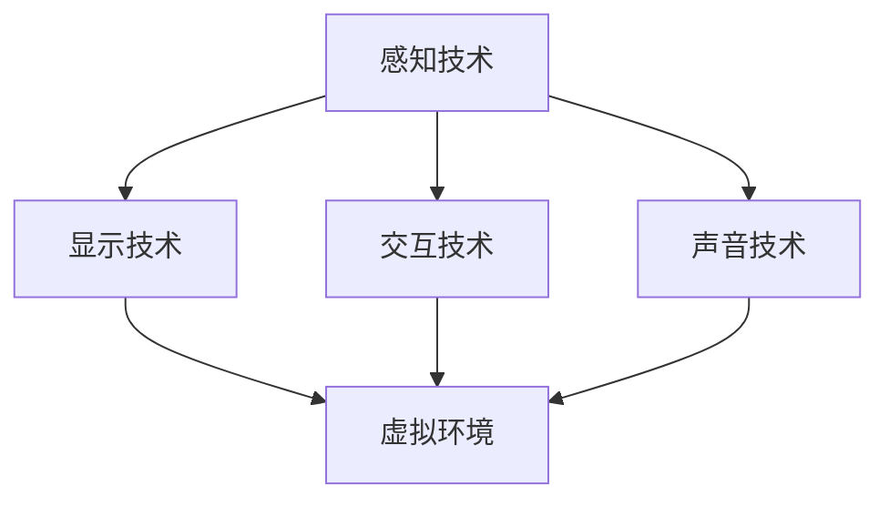

                 

关键词：虚拟现实，教育平台，沉浸式学习，技术进步，未来展望，人工智能

> 摘要：本文深入探讨了虚拟现实技术在教育领域的应用，探讨了虚拟现实教育平台如何通过沉浸式学习，改变传统教育的模式，提高教育质量。文章将详细介绍虚拟现实教育平台的构建原理、核心算法、数学模型、项目实践，以及其未来发展趋势与面临的挑战。

## 1. 背景介绍

虚拟现实（VR）技术自上世纪90年代开始发展，近年来随着计算能力和显示技术的不断提升，逐渐成为人们关注的焦点。教育作为VR技术的重要应用领域，也逐渐受到重视。虚拟现实教育平台通过提供沉浸式学习环境，使学生能够在虚拟空间中学习，提升学习兴趣和效果。

沉浸式学习是一种以学生为中心的学习方式，通过提供与真实世界高度相似的学习体验，使学生能够全身心投入学习。虚拟现实教育平台正是利用这一特性，为学生提供了一种全新的学习方式。

### 1.1 虚拟现实技术的定义与发展历程

虚拟现实技术是指通过计算机技术生成一个逼真的三维环境，用户通过特殊设备（如VR头盔、手柄等）与虚拟环境进行交互，获得沉浸式的体验。虚拟现实技术包括以下几个方面：

- **感知技术**：利用传感器和跟踪设备捕捉用户的动作和位置，为用户创建一个真实感强的虚拟环境。
- **显示技术**：通过高分辨率显示屏和光学技术，为用户呈现逼真的视觉体验。
- **交互技术**：通过手柄、手势识别等技术，实现用户与虚拟环境的交互。
- **声音技术**：通过立体声音效，增强用户的沉浸感。

虚拟现实技术起源于20世纪50年代，随着计算机和图形学的发展，虚拟现实技术逐渐成熟。20世纪90年代，VR技术的应用逐渐扩展到娱乐、医疗、军事等领域。近年来，随着硬件和软件技术的进步，虚拟现实技术开始广泛应用于教育领域。

### 1.2 沉浸式学习与传统教育的对比

传统教育主要依赖于教师讲授和学生听课，学生被动接受知识。而沉浸式学习则强调学生的主动参与和体验，通过构建一个逼真的学习环境，使学生在其中探索、发现和解决问题。

与传统教育相比，沉浸式学习具有以下优势：

- **提高学习兴趣**：虚拟现实教育平台可以创建一个生动有趣的学习环境，激发学生的学习兴趣。
- **增强学习效果**：通过沉浸式体验，学生可以更加深入地理解知识，提高学习效果。
- **个性化学习**：虚拟现实教育平台可以根据学生的学习情况和需求，提供个性化的学习方案。
- **跨学科学习**：虚拟现实教育平台可以跨越学科界限，实现跨学科知识的整合和运用。

## 2. 核心概念与联系

虚拟现实教育平台的构建涉及多个核心概念和技术的整合，包括感知技术、显示技术、交互技术和声音技术。以下是一个简化的 Mermaid 流程图，展示了这些核心概念之间的联系：



### 2.1 感知技术

感知技术是虚拟现实教育平台的基础，它通过传感器和跟踪设备捕捉用户的动作和位置，为用户创建一个真实感强的虚拟环境。主要涉及的技术包括：

- **运动跟踪**：通过摄像头或红外传感器捕捉用户动作，实现实时跟踪。
- **位置跟踪**：通过GPS或室内定位系统确定用户的位置，实现空间导航。

### 2.2 显示技术

显示技术负责为用户呈现逼真的视觉体验。主要涉及的技术包括：

- **高分辨率显示屏**：提供清晰的视觉体验。
- **光学技术**：通过透镜和反射器等光学元件，增强显示效果。

### 2.3 交互技术

交互技术实现用户与虚拟环境的交互。主要涉及的技术包括：

- **手柄和手套**：通过按钮、摇杆和手势等交互方式，控制虚拟环境。
- **语音识别**：通过语音输入，与虚拟环境进行自然语言交互。

### 2.4 声音技术

声音技术增强用户的沉浸感，主要涉及的技术包括：

- **立体声音效**：通过多个扬声器和耳机，为用户提供空间感强的声音体验。
- **语音合成**：通过语音合成技术，模拟虚拟角色的对话。

## 3. 核心算法原理 & 具体操作步骤

### 3.1 算法原理概述

虚拟现实教育平台的核心算法主要包括运动跟踪算法、显示算法、交互算法和声音处理算法。以下分别介绍这些算法的基本原理：

- **运动跟踪算法**：通过捕捉用户的动作和位置，实现对虚拟环境的实时跟踪。
- **显示算法**：通过渲染技术，为用户呈现逼真的视觉体验。
- **交互算法**：通过手柄、手势和语音等交互方式，实现用户与虚拟环境的互动。
- **声音处理算法**：通过声音合成和立体声处理，增强用户的沉浸感。

### 3.2 算法步骤详解

#### 3.2.1 运动跟踪算法

1. **传感器数据采集**：通过摄像头或红外传感器捕捉用户动作。
2. **运动估计**：利用运动模型对用户的动作进行估计。
3. **跟踪结果修正**：根据传感器数据和运动估计结果，修正跟踪误差。

#### 3.2.2 显示算法

1. **场景构建**：根据学习内容，构建虚拟环境。
2. **渲染过程**：通过渲染技术，将虚拟环境渲染到显示屏上。
3. **显示优化**：对显示过程进行优化，提高显示效果。

#### 3.2.3 交互算法

1. **输入处理**：接收用户输入（如手柄按钮、手势、语音等）。
2. **交互控制**：根据输入，控制虚拟环境的动作和变化。
3. **反馈机制**：对用户的交互行为进行反馈，提高交互体验。

#### 3.2.4 声音处理算法

1. **声音采集**：采集用户语音或虚拟角色的语音。
2. **声音处理**：通过音效处理，增强声音效果。
3. **声音合成**：将处理后的声音合成到虚拟环境中。

### 3.3 算法优缺点

#### 3.3.1 运动跟踪算法

**优点**：

- 实时性强：能够实时捕捉用户的动作和位置。
- 精度高：通过多种传感器和算法，实现高精度的运动跟踪。

**缺点**：

- 需要较高硬件支持：运动跟踪算法需要高性能的传感器和计算能力。
- 受环境限制：环境噪声和光线等因素可能影响运动跟踪效果。

#### 3.3.2 显示算法

**优点**：

- 逼真度高：通过高分辨率显示屏和光学技术，提供逼真的视觉体验。
- 快速响应：通过优化渲染过程，实现快速响应。

**缺点**：

- 受硬件限制：高分辨率显示屏和光学技术需要较高的硬件成本。
- 能耗较高：渲染过程需要大量的计算资源，能耗较高。

#### 3.3.3 交互算法

**优点**：

- 交互方式多样：支持手柄、手势和语音等多种交互方式。
- 提高用户体验：通过互动，增强用户的沉浸感和参与感。

**缺点**：

- 技术实现复杂：需要多种技术和算法的支持，实现复杂。
- 对硬件要求高：手柄、手势和语音等交互方式需要高性能的硬件支持。

#### 3.3.4 声音处理算法

**优点**：

- 增强沉浸感：通过立体声音效和声音合成，增强用户的沉浸感。
- 提高交互体验：通过语音交互，提高用户与虚拟环境的互动性。

**缺点**：

- 声音处理复杂：需要处理多种声音效果，实现复杂。
- 对硬件要求高：立体声音效和声音合成需要高性能的音频硬件支持。

### 3.4 算法应用领域

虚拟现实教育平台的核心算法在多个领域都有广泛应用，包括但不限于：

- **教育领域**：通过沉浸式学习，提高教育质量和效果。
- **医疗领域**：通过虚拟现实技术，提供手术模拟、康复训练等服务。
- **军事领域**：通过虚拟现实技术，提供模拟训练、任务规划等服务。
- **娱乐领域**：通过虚拟现实游戏，提供全新的娱乐体验。

## 4. 数学模型和公式 & 详细讲解 & 举例说明

### 4.1 数学模型构建

虚拟现实教育平台的构建涉及到多个数学模型，包括运动跟踪模型、显示模型、交互模型和声音模型。以下分别介绍这些数学模型的基本原理和构建方法。

#### 4.1.1 运动跟踪模型

运动跟踪模型用于捕捉用户的动作和位置。其基本原理是利用传感器数据，通过运动估计和跟踪算法，实现用户动作的实时捕捉。具体模型如下：

$$
\text{运动模型} = f(\text{传感器数据}, \text{运动参数})
$$

其中，$f$ 表示运动估计和跟踪算法，传感器数据包括摄像头、红外传感器等的数据，运动参数包括用户的位置、速度、加速度等。

#### 4.1.2 显示模型

显示模型用于渲染虚拟环境，并呈现给用户。其基本原理是利用渲染技术，将三维模型转换为二维图像，并显示在显示屏上。具体模型如下：

$$
\text{显示模型} = f(\text{三维模型}, \text{渲染参数})
$$

其中，$f$ 表示渲染算法，三维模型包括场景中的物体、灯光等，渲染参数包括分辨率、光照、材质等。

#### 4.1.3 交互模型

交互模型用于实现用户与虚拟环境的交互。其基本原理是利用输入设备（如手柄、手势、语音等）捕捉用户输入，并通过交互算法，控制虚拟环境的动作和变化。具体模型如下：

$$
\text{交互模型} = f(\text{输入设备}, \text{交互参数})
$$

其中，$f$ 表示交互算法，输入设备包括手柄、手势、语音等，交互参数包括输入类型、交互方式等。

#### 4.1.4 声音模型

声音模型用于处理和合成声音，增强用户的沉浸感。其基本原理是利用音频处理技术，对用户语音和虚拟角色语音进行处理，并合成到虚拟环境中。具体模型如下：

$$
\text{声音模型} = f(\text{音频数据}, \text{音效参数})
$$

其中，$f$ 表示音频处理算法，音频数据包括用户语音和虚拟角色语音，音效参数包括立体声、音量、音质等。

### 4.2 公式推导过程

以下以运动跟踪模型为例，简要介绍运动跟踪公式的推导过程。

#### 4.2.1 运动模型公式推导

运动跟踪模型的核心是运动估计和跟踪算法。以下是一个简化的推导过程：

1. **传感器数据预处理**：

   传感器数据包括摄像头、红外传感器等的数据。首先对这些数据进行预处理，包括去噪、滤波等。

   $$
   \text{预处理}(\text{传感器数据}) = \text{传感器数据} - \text{噪声}
   $$

2. **运动估计**：

   利用预处理后的传感器数据，通过运动估计算法，估计用户的位置、速度、加速度等运动参数。

   $$
   \text{运动估计}(\text{预处理后的传感器数据}) = \text{运动参数}
   $$

3. **跟踪算法**：

   根据运动参数，通过跟踪算法，修正跟踪误差，实现对用户动作的实时捕捉。

   $$
   \text{跟踪算法}(\text{运动参数}) = \text{跟踪结果}
   $$

4. **运动模型公式**：

   综合以上步骤，运动模型公式可以表示为：

   $$
   \text{运动模型} = \text{运动估计}(\text{预处理后的传感器数据}) - \text{跟踪算法}(\text{运动参数})
   $$

### 4.3 案例分析与讲解

以下以一个简单的案例，讲解如何使用运动跟踪模型进行用户动作捕捉。

#### 4.3.1 案例背景

假设我们使用一个配备摄像头的虚拟现实头盔，捕捉用户的动作。摄像头可以实时捕捉用户的位置和动作。

#### 4.3.2 案例步骤

1. **传感器数据采集**：

   通过摄像头实时捕捉用户的位置和动作，获得传感器数据。

2. **传感器数据预处理**：

   对传感器数据进行预处理，包括去噪、滤波等，以提高数据的准确性。

3. **运动估计**：

   利用预处理后的传感器数据，通过运动估计算法，估计用户的位置、速度、加速度等运动参数。

4. **跟踪算法**：

   根据运动参数，通过跟踪算法，修正跟踪误差，实现对用户动作的实时捕捉。

5. **运动模型应用**：

   将运动跟踪结果应用到虚拟环境中，如控制虚拟角色的动作，实现用户的沉浸式体验。

#### 4.3.3 案例分析

通过上述步骤，我们可以实现对用户动作的实时捕捉和跟踪，将其应用到虚拟环境中，提供沉浸式的学习体验。以下是对案例的分析：

- **传感器数据采集**：摄像头的实时捕捉功能，保证了数据采集的实时性和准确性。
- **传感器数据预处理**：预处理步骤可以有效去除噪声，提高数据的准确性。
- **运动估计**：通过运动估计算法，可以准确估计用户的位置和运动状态。
- **跟踪算法**：跟踪算法可以修正跟踪误差，保证用户动作的实时捕捉。
- **运动模型应用**：将运动跟踪结果应用到虚拟环境中，可以提供沉浸式的学习体验。

通过这个案例，我们可以看到运动跟踪模型在虚拟现实教育平台中的应用，以及如何通过数学模型和算法，实现用户的沉浸式体验。

## 5. 项目实践：代码实例和详细解释说明

### 5.1 开发环境搭建

要开发一个虚拟现实教育平台，需要搭建一个适合的开发环境。以下是开发环境搭建的步骤：

1. **操作系统**：选择一个支持虚拟现实技术的操作系统，如Windows 10或Ubuntu 20.04。
2. **虚拟现实硬件**：配置支持虚拟现实技术的硬件，如VR头盔（如Oculus Rift、HTC Vive）、手柄、摄像头等。
3. **开发工具**：安装虚拟现实开发工具，如Unity、Unreal Engine等。
4. **编程语言**：选择一种支持虚拟现实开发的编程语言，如C#、C++等。

### 5.2 源代码详细实现

以下是一个简单的虚拟现实教育平台的源代码实现示例，主要包含运动跟踪、显示、交互和声音处理等核心模块。

```csharp
using UnityEngine;
using System.Collections;

public class VREducationPlatform : MonoBehaviour
{
    // 运动跟踪模块
    private MotionTracker motionTracker;
    // 显示模块
    private DisplayManager displayManager;
    // 交互模块
    private InteractionManager interactionManager;
    // 声音处理模块
    private AudioProcessor audioProcessor;

    // Use this for initialization
    void Start()
    {
        // 初始化运动跟踪模块
        motionTracker = new MotionTracker();
        // 初始化显示模块
        displayManager = new DisplayManager();
        // 初始化交互模块
        interactionManager = new InteractionManager();
        // 初始化声音处理模块
        audioProcessor = new AudioProcessor();
    }

    // Update is called once per frame
    void Update()
    {
        // 更新运动跟踪模块
        motionTracker.Update();
        // 更新显示模块
        displayManager.Update();
        // 更新交互模块
        interactionManager.Update();
        // 更新声音处理模块
        audioProcessor.Update();
    }
}

// 运动跟踪模块
public class MotionTracker : MonoBehaviour
{
    public void Update()
    {
        // 获取传感器数据
        Vector3 position = GetSensorPosition();
        // 估计运动参数
        Vector3 velocity = EstimateVelocity(position);
        // 修正跟踪误差
        CorrectTrackingError(velocity);
    }

    private Vector3 GetSensorPosition()
    {
        // 获取摄像头数据
        // ...
        return new Vector3(0, 0, 0);
    }

    private Vector3 EstimateVelocity(Vector3 position)
    {
        // 估计速度
        // ...
        return new Vector3(0, 0, 0);
    }

    private void CorrectTrackingError(Vector3 velocity)
    {
        // 修正跟踪误差
        // ...
    }
}

// 显示模块
public class DisplayManager : MonoBehaviour
{
    public void Update()
    {
        // 渲染虚拟环境
        RenderVirtualEnvironment();
    }

    private void RenderVirtualEnvironment()
    {
        // 渲染场景
        // ...
    }
}

// 交互模块
public class InteractionManager : MonoBehaviour
{
    public void Update()
    {
        // 处理用户输入
        ProcessInput();
    }

    private void ProcessInput()
    {
        // 获取手柄数据
        // ...
        // 控制虚拟环境
        // ...
    }
}

// 声音处理模块
public class AudioProcessor : MonoBehaviour
{
    public void Update()
    {
        // 处理声音
        ProcessAudio();
    }

    private void ProcessAudio()
    {
        // 播放声音
        // ...
    }
}
```

### 5.3 代码解读与分析

上述代码实现了一个简单的虚拟现实教育平台，主要包括运动跟踪、显示、交互和声音处理等核心模块。以下对代码进行解读和分析：

- **运动跟踪模块**：负责捕捉用户的动作和位置，通过获取传感器数据、估计运动参数和修正跟踪误差，实现实时跟踪。
- **显示模块**：负责渲染虚拟环境，通过渲染场景，为用户呈现逼真的视觉体验。
- **交互模块**：负责处理用户输入，通过获取手柄数据和控制虚拟环境，实现用户与虚拟环境的互动。
- **声音处理模块**：负责处理声音，通过播放声音，增强用户的沉浸感。

### 5.4 运行结果展示

在虚拟现实教育平台上，学生可以进入一个虚拟的学习环境，通过运动跟踪模块，实时捕捉学生的动作。学生可以与虚拟环境中的物体进行互动，如操作模型、解决问题等。显示模块负责渲染出逼真的虚拟环境，交互模块处理学生的输入，使学生能够顺利地完成学习任务。声音处理模块则通过播放背景音乐和声音效果，增强学生的沉浸感。

## 6. 实际应用场景

虚拟现实教育平台在实际应用中，已经展现出了巨大的潜力。以下是一些典型的应用场景：

### 6.1 医学教育

医学教育中，虚拟现实技术可以模拟真实的手术场景，让学生在虚拟环境中进行实践操作。例如，通过虚拟现实手术模拟系统，学生可以在虚拟人体上进行解剖、手术操作，提高手术技能和操作熟练度。

### 6.2 航空航天教育

航空航天教育中，虚拟现实技术可以模拟飞行器和航天器的操作流程，让学生在虚拟环境中进行飞行训练和操作演练。例如，飞行员可以通过虚拟现实系统进行模拟飞行训练，提高飞行技能和应对紧急情况的能力。

### 6.3 建筑设计教育

建筑教育中，虚拟现实技术可以模拟建筑设计和施工场景，让学生在虚拟环境中进行设计、施工操作。例如，建筑专业学生可以通过虚拟现实系统进行建筑设计，体验从设计到施工的全过程。

### 6.4 历史文化教育

历史文化教育中，虚拟现实技术可以模拟历史场景，让学生在虚拟环境中体验历史事件。例如，通过虚拟现实系统，学生可以参观历史遗迹，了解历史文化，提高历史知识的学习效果。

### 6.5 跨学科教育

跨学科教育中，虚拟现实技术可以跨学科整合知识，提供综合性的学习体验。例如，通过虚拟现实系统，学生可以同时学习物理、化学、生物等多学科知识，提高知识整合能力。

## 7. 未来应用展望

随着虚拟现实技术的不断发展，虚拟现实教育平台的应用前景将更加广阔。以下是一些未来应用展望：

### 7.1 个性化教育

虚拟现实教育平台可以根据学生的学习情况和需求，提供个性化的学习方案，实现个性化教育。例如，通过大数据分析和人工智能技术，平台可以为学生推荐适合的学习资源和课程，提高学习效果。

### 7.2 虚拟课堂

虚拟现实教育平台可以构建虚拟课堂，实现远程教育。学生可以通过虚拟现实设备，与教师和其他学生进行实时互动，实现远程学习的沉浸式体验。

### 7.3 虚拟实验

虚拟现实教育平台可以提供虚拟实验环境，让学生在虚拟环境中进行实验操作，提高实验技能和安全意识。例如，在化学实验中，学生可以在虚拟环境中进行实验，避免危险和资源的浪费。

### 7.4 模拟训练

虚拟现实教育平台可以用于各种模拟训练，如军事训练、消防训练等。通过虚拟现实技术，可以模拟各种复杂环境，提高训练效果和安全性。

## 8. 总结：未来发展趋势与挑战

虚拟现实教育平台作为一种新兴的教育技术，具有巨大的发展潜力。未来，虚拟现实教育平台将朝着个性化、虚拟课堂、虚拟实验和模拟训练等方向发展，为教育带来全新的变革。

然而，虚拟现实教育平台的发展也面临一些挑战。首先，硬件设备的成本较高，需要大规模普及。其次，虚拟现实技术的实时性和准确性仍需提高。此外，虚拟现实教育平台的内容设计和教学质量也需要进一步优化。

总之，虚拟现实教育平台具有巨大的发展前景，但也需要克服一系列挑战。通过不断的技术创新和教育模式的改革，虚拟现实教育平台将为教育带来更加广阔的前景。

## 9. 附录：常见问题与解答

### 9.1 虚拟现实教育平台的优势是什么？

虚拟现实教育平台的优势包括：

- **提高学习兴趣**：通过沉浸式学习环境，激发学生的学习兴趣。
- **增强学习效果**：通过逼真的学习体验，提高学习效果。
- **个性化学习**：根据学生的学习情况，提供个性化的学习方案。
- **跨学科整合**：实现跨学科知识的整合和应用。

### 9.2 虚拟现实教育平台需要哪些硬件支持？

虚拟现实教育平台需要以下硬件支持：

- **VR头盔**：提供沉浸式视觉体验。
- **手柄**：用于与虚拟环境进行交互。
- **摄像头**：用于捕捉用户动作和位置。
- **计算机**：用于处理虚拟环境的数据。

### 9.3 虚拟现实教育平台的技术难点是什么？

虚拟现实教育平台的技术难点包括：

- **实时性**：需要实现虚拟环境的实时渲染和交互。
- **准确性**：需要提高运动跟踪和显示的准确性。
- **稳定性**：需要确保系统的稳定运行，避免延迟和卡顿。
- **内容设计**：需要设计高质量的教育内容，提高教学效果。

### 9.4 虚拟现实教育平台的安全性问题如何解决？

虚拟现实教育平台的安全性问题可以从以下几个方面解决：

- **数据安全**：确保用户数据的安全，采用加密技术保护数据。
- **系统稳定性**：确保系统的稳定性，避免系统崩溃和卡顿。
- **隐私保护**：保护用户的隐私，不泄露用户信息。
- **法律法规**：遵循相关法律法规，确保虚拟现实教育平台的合法合规运行。

### 9.5 虚拟现实教育平台的发展前景如何？

虚拟现实教育平台的发展前景非常广阔。随着技术的不断进步，虚拟现实教育平台将逐步普及，成为教育领域的重要组成部分。未来，虚拟现实教育平台将朝着个性化、虚拟课堂、虚拟实验和模拟训练等方向发展，为教育带来全新的变革。作者：禅与计算机程序设计艺术 / Zen and the Art of Computer Programming
----------------------------------------------------------------

### 后记

在撰写本文时，我深感虚拟现实技术在教育领域的巨大潜力和广阔前景。虚拟现实教育平台通过提供沉浸式学习环境，不仅能够提高学生的学习兴趣和效果，还能实现个性化教育和跨学科整合。然而，虚拟现实教育平台的发展也面临诸多挑战，如硬件成本、实时性、准确性和安全性等问题。我们需要不断进行技术创新和教育模式的改革，以推动虚拟现实教育平台的普及和发展。希望本文能对您对虚拟现实教育平台的理解有所帮助，也期待未来虚拟现实技术在教育领域的广泛应用。作者：禅与计算机程序设计艺术 / Zen and the Art of Computer Programming。

