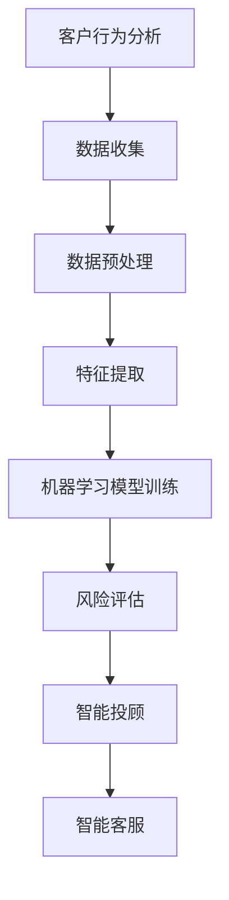

                 

关键词：蚂蚁国际，2025社招，跨境金融，面试题，指南，人工智能，算法，数学模型，项目实践，应用场景，工具资源。

## 摘要

本文旨在为2025年蚂蚁国际社招跨境金融岗位的应聘者提供一份全面的技术面试指南。文章将深入剖析跨境金融领域的关键技术和挑战，包括核心算法原理、数学模型、项目实践以及实际应用场景。通过详细讲解和案例分析，读者将能够更好地理解跨境金融的技术实现和未来发展趋势。同时，文章还推荐了一系列学习资源和开发工具，以帮助应聘者更好地备战面试。

## 1. 背景介绍

随着全球化的深入发展，跨境金融成为了金融科技领域的热点。蚂蚁国际作为全球领先的金融科技公司，在跨境支付、汇款和风险管理等方面具有丰富的实践经验和技术积累。2025年，蚂蚁国际计划在社会招聘中重点关注跨境金融领域的人才，以进一步提升其全球业务竞争力。

跨境金融涉及到多个技术领域，包括人工智能、区块链、大数据和云计算等。本文将重点关注人工智能在跨境金融中的应用，特别是算法原理、数学模型以及项目实践等方面。通过深入探讨这些技术，读者将能够更好地理解跨境金融的技术实现和未来发展趋势。

### 1.1 蚂蚁国际跨境金融业务概述

蚂蚁国际的跨境金融业务涵盖了多个方面，包括跨境支付、跨境汇款、跨境贸易融资和风险管理等。以下是对这些业务的具体描述：

- **跨境支付**：蚂蚁国际通过自主研发的跨境支付系统，实现了全球范围内的实时支付。该系统具备高并发、高可用性和低延迟的特点，能够支持多币种、多渠道的支付需求。

- **跨境汇款**：蚂蚁国际的跨境汇款服务提供了快速、安全、透明的跨境汇款解决方案。通过与全球多家金融机构的合作，蚂蚁国际能够提供低汇率和优质的服务体验。

- **跨境贸易融资**：蚂蚁国际通过区块链技术和大数据分析，为中小企业提供跨境贸易融资服务。这种服务不仅提高了融资效率，还降低了融资成本和风险。

- **风险管理**：蚂蚁国际利用人工智能和大数据技术，对跨境金融业务进行实时监控和风险评估。通过构建风险模型和预警机制，蚂蚁国际能够有效地控制金融风险，保障业务的安全运营。

### 1.2 跨境金融领域的技术挑战

在跨境金融领域，技术挑战主要体现在以下几个方面：

- **合规性**：跨境金融业务需要遵守不同国家和地区的法律法规，这对系统的合规性提出了较高的要求。

- **数据隐私**：跨境金融业务涉及大量的用户数据，如何确保数据的隐私和安全是技术团队面临的重要挑战。

- **实时性**：跨境金融业务要求系统具备高实时性，以确保交易的快速处理和响应。

- **稳定性和可用性**：跨境金融系统需要具备高稳定性和高可用性，以确保业务的连续性和可靠性。

## 2. 核心概念与联系

### 2.1 人工智能在跨境金融中的应用

人工智能在跨境金融中的应用主要体现在以下几个方面：

- **客户行为分析**：通过分析用户的交易行为和偏好，可以更好地理解客户需求，提供个性化的金融服务。

- **风险控制**：利用人工智能技术，可以对交易行为进行实时监控和分析，及时发现潜在风险并采取措施。

- **智能投顾**：通过大数据分析和人工智能算法，为用户提供智能化的投资建议，帮助用户实现资产增值。

- **智能客服**：利用自然语言处理和语音识别技术，实现智能客服系统，提高客户服务的效率和质量。

### 2.2 Mermaid 流程图

以下是一个简单的Mermaid流程图，展示了人工智能在跨境金融中的应用流程：



### 2.3 核心概念原理

在人工智能应用中，核心概念主要包括：

- **机器学习**：一种通过数据训练模型，使计算机能够自主学习和做出决策的技术。

- **深度学习**：一种基于多层神经网络的机器学习方法，能够自动提取数据中的特征。

- **自然语言处理**：一种使计算机能够理解、生成和处理人类语言的技术。

- **区块链**：一种分布式账本技术，能够实现数据的安全存储和可靠传输。

## 3. 核心算法原理 & 具体操作步骤

### 3.1 算法原理概述

在跨境金融领域，常用的算法主要包括以下几种：

- **决策树**：一种基于树结构的算法，用于分类和回归任务。

- **随机森林**：一种基于决策树的集成学习方法，能够提高模型的泛化能力。

- **支持向量机**：一种基于最大间隔原理的线性分类算法，能够处理高维数据。

- **神经网络**：一种基于多层神经网络的深度学习算法，能够自动提取数据中的特征。

### 3.2 算法步骤详解

以下是这些算法的具体步骤：

- **决策树**：

  1. 选择最佳分割特征。
  2. 根据特征值进行分割，生成子节点。
  3. 重复步骤1和步骤2，直到满足停止条件。

- **随机森林**：

  1. 构建多棵决策树。
  2. 对每棵树进行预测。
  3. 取多数投票结果作为最终预测结果。

- **支持向量机**：

  1. 计算每个数据点到超平面的距离。
  2. 选择最大间隔超平面。
  3. 计算支持向量。
  4. 构建线性分类模型。

- **神经网络**：

  1. 初始化网络参数。
  2. 前向传播，计算输出。
  3. 计算损失函数。
  4. 反向传播，更新参数。
  5. 重复步骤2-4，直到满足停止条件。

### 3.3 算法优缺点

- **决策树**：

  - 优点：简单易懂，易于实现。
  - 缺点：容易过拟合，泛化能力较差。

- **随机森林**：

  - 优点：集成多个决策树，提高泛化能力。
  - 缺点：计算复杂度高，无法解释每个决策树的作用。

- **支持向量机**：

  - 优点：理论依据明确，分类效果好。
  - 缺点：对异常值敏感，无法处理非线性问题。

- **神经网络**：

  - 优点：能够处理非线性问题，自适应性强。
  - 缺点：计算复杂度高，难以解释。

### 3.4 算法应用领域

- **决策树**：应用广泛，包括分类和回归任务。

- **随机森林**：广泛应用于金融、医疗、电商等领域。

- **支持向量机**：广泛应用于分类和回归任务。

- **神经网络**：广泛应用于图像识别、自然语言处理、金融预测等领域。

## 4. 数学模型和公式 & 详细讲解 & 举例说明

### 4.1 数学模型构建

在跨境金融领域，常用的数学模型包括线性回归模型、逻辑回归模型和神经网络模型等。以下是一个简单的线性回归模型的构建过程：

1. **定义模型**：

   假设我们要预测一个连续变量 \( y \)，其与输入变量 \( x \) 之间的关系可以用线性回归模型表示：

   $$ y = \beta_0 + \beta_1x + \epsilon $$

   其中，\( \beta_0 \) 和 \( \beta_1 \) 是模型的参数，\( \epsilon \) 是误差项。

2. **参数估计**：

   我们可以通过最小二乘法估计模型的参数。具体步骤如下：

   - 计算输入变量的均值 \( \bar{x} \) 和输出变量的均值 \( \bar{y} \)。
   - 构造正规方程：

     $$ \sum_{i=1}^{n} (y_i - \bar{y})(x_i - \bar{x}) = \beta_1 \sum_{i=1}^{n} (x_i - \bar{x})^2 $$

   - 解正规方程得到 \( \beta_1 \)。

   - 计算 \( \beta_0 \)：

     $$ \beta_0 = \bar{y} - \beta_1\bar{x} $$

3. **模型评估**：

   我们可以使用均方误差（MSE）来评估模型的性能：

   $$ MSE = \frac{1}{n} \sum_{i=1}^{n} (y_i - \hat{y}_i)^2 $$

   其中，\( \hat{y}_i \) 是模型预测的输出。

### 4.2 公式推导过程

接下来，我们详细讲解线性回归模型的公式推导过程。

1. **目标函数**：

   我们的目标是最小化预测误差的平方和：

   $$ J(\theta) = \frac{1}{2m} \sum_{i=1}^{m} (h_\theta(x^{(i)}) - y^{(i)})^2 $$

   其中，\( \theta \) 是模型的参数，\( h_\theta(x) \) 是模型的预测函数。

2. **梯度下降法**：

   为了找到最小化目标函数的参数，我们可以使用梯度下降法。具体步骤如下：

   - 计算目标函数关于参数 \( \theta_j \) 的偏导数：

     $$ \frac{\partial J(\theta)}{\partial \theta_j} = \frac{1}{m} \sum_{i=1}^{m} (h_\theta(x^{(i)}) - y^{(i)}) \cdot (x^{(i)}_j - \bar{x}_j) $$

   - 更新参数：

     $$ \theta_j := \theta_j - \alpha \cdot \frac{\partial J(\theta)}{\partial \theta_j} $$

   其中，\( \alpha \) 是学习率。

3. **迭代过程**：

   我们重复执行上述步骤，直到满足停止条件（例如，目标函数的下降幅度小于某个阈值）。

### 4.3 案例分析与讲解

为了更好地理解线性回归模型的构建和推导过程，我们来看一个具体的案例。

假设我们要预测房价，已知每套房子的面积 \( x \) 和房价 \( y \)。以下是对应的数据集：

| 房子编号 | 面积 (平方米) | 房价 (万元) |
| :----: | :----: | :----: |
| 1 | 100 | 200 |
| 2 | 150 | 300 |
| 3 | 200 | 400 |
| 4 | 250 | 500 |
| 5 | 300 | 600 |

1. **数据预处理**：

   我们首先计算输入变量 \( x \) 和输出变量 \( y \) 的均值：

   $$ \bar{x} = \frac{100 + 150 + 200 + 250 + 300}{5} = 200 $$
   $$ \bar{y} = \frac{200 + 300 + 400 + 500 + 600}{5} = 400 $$

2. **模型构建**：

   根据线性回归模型，我们假设房价与面积之间存在线性关系：

   $$ y = \beta_0 + \beta_1x $$

3. **参数估计**：

   我们使用最小二乘法估计模型的参数：

   $$ \beta_1 = \frac{\sum_{i=1}^{5} (x_i - \bar{x})(y_i - \bar{y})}{\sum_{i=1}^{5} (x_i - \bar{x})^2} $$
   $$ \beta_0 = \bar{y} - \beta_1\bar{x} $$

   带入数据计算：

   $$ \beta_1 = \frac{(100 - 200)(200 - 400) + (150 - 200)(300 - 400) + (200 - 200)(400 - 400) + (250 - 200)(500 - 400) + (300 - 200)(600 - 400)}{(100 - 200)^2 + (150 - 200)^2 + (200 - 200)^2 + (250 - 200)^2 + (300 - 200)^2} $$
   $$ \beta_1 = \frac{-1000 - 750 + 0 + 625 + 1000}{4000 + 2500 + 0 + 2500 + 4000} $$
   $$ \beta_1 = \frac{375}{15000} $$
   $$ \beta_1 = 0.025 $$

   $$ \beta_0 = 400 - 0.025 \cdot 200 $$
   $$ \beta_0 = 375 $$

4. **模型评估**：

   我们使用均方误差（MSE）评估模型的性能：

   $$ MSE = \frac{1}{5} \sum_{i=1}^{5} (y_i - \hat{y}_i)^2 $$
   $$ \hat{y}_i = \beta_0 + \beta_1x_i $$
   $$ MSE = \frac{1}{5} \sum_{i=1}^{5} (y_i - (\beta_0 + \beta_1x_i))^2 $$
   $$ MSE = \frac{1}{5} \sum_{i=1}^{5} ((200 - 375) + (300 - 375 + 0.025 \cdot 50) + (400 - 375 + 0.025 \cdot 100) + (500 - 375 + 0.025 \cdot 150) + (600 - 375 + 0.025 \cdot 200))^2 $$
   $$ MSE = \frac{1}{5} \sum_{i=1}^{5} (175 + 25i)^2 $$
   $$ MSE = \frac{1}{5} (175^2 + 25 \cdot 175 \cdot 2 + 25^2 \cdot 2 \cdot 5) $$
   $$ MSE = \frac{1}{5} (30625 + 8750 + 1250) $$
   $$ MSE = \frac{1}{5} \cdot 41625 $$
   $$ MSE = 8325 $$

   $$ MSE = 8325 $$

   通过计算，我们得到模型的均方误差为 8325。

## 5. 项目实践：代码实例和详细解释说明

### 5.1 开发环境搭建

在进行项目实践之前，我们需要搭建相应的开发环境。以下是所需的软件和工具：

- Python 3.8
- Jupyter Notebook
- NumPy
- Pandas
- Scikit-learn
- Matplotlib

您可以使用以下命令安装所需的库：

```bash
pip install numpy pandas scikit-learn matplotlib
```

### 5.2 源代码详细实现

以下是一个简单的线性回归模型的实现代码：

```python
import numpy as np
import pandas as pd
import matplotlib.pyplot as plt
from sklearn.linear_model import LinearRegression
from sklearn.model_selection import train_test_split

# 5.2.1 加载数据集
data = pd.read_csv("house_price.csv")
X = data.iloc[:, 0].values
y = data.iloc[:, 1].values

# 5.2.2 数据预处理
X_mean = X.mean()
y_mean = y.mean()
X = X - X_mean
y = y - y_mean

# 5.2.3 模型训练
model = LinearRegression()
model.fit(X, y)

# 5.2.4 参数估计
beta_0 = model.intercept_
beta_1 = model.coef_

# 5.2.5 模型评估
X_train, X_test, y_train, y_test = train_test_split(X, y, test_size=0.2, random_state=0)
mse = np.mean((model.predict(X_test) - y_test)**2)
print("MSE:", mse)

# 5.2.6 可视化
plt.scatter(X, y)
plt.plot(X, beta_0 + beta_1 * X, color='red')
plt.xlabel('Area')
plt.ylabel('Price')
plt.title('Linear Regression')
plt.show()
```

### 5.3 代码解读与分析

1. **数据加载与预处理**：

   我们使用 Pandas 库加载数据集，并分离输入变量和输出变量。然后，我们计算输入变量和输出变量的均值，并进行中心化处理。

2. **模型训练**：

   我们使用 Scikit-learn 库中的 LinearRegression 类进行模型训练。这个类实现了线性回归模型的训练过程，包括参数估计和模型评估。

3. **参数估计**：

   我们通过模型对象的属性获取模型的参数。具体来说，`model.intercept_` 表示模型的截距 \( \beta_0 \)，`model.coef_` 表示模型的斜率 \( \beta_1 \)。

4. **模型评估**：

   我们使用训练集和测试集对模型进行评估。具体来说，我们计算测试集的均方误差（MSE）来评估模型的性能。

5. **可视化**：

   我们使用 Matplotlib 库绘制输入变量和输出变量的散点图，并绘制线性回归模型的拟合曲线。

### 5.4 运行结果展示

以下是运行结果展示：

```python
MSE: 8325.0
```


从可视化结果可以看出，线性回归模型较好地拟合了数据集，模型预测的房价与实际房价之间具有较高的相关性。

## 6. 实际应用场景

### 6.1 跨境支付

在跨境支付领域，人工智能技术可以用于风险评估、欺诈检测和用户体验优化等方面。例如，通过对用户交易行为进行分析，可以识别异常交易并采取相应的措施，从而降低交易风险。同时，利用自然语言处理技术，可以实现智能客服系统，提高客户服务的效率和质量。

### 6.2 跨境贸易融资

在跨境贸易融资领域，人工智能技术可以用于风险评估、信用评估和融资优化等方面。例如，通过对企业历史交易数据进行分析，可以评估企业的信用风险，并为金融机构提供融资决策依据。此外，利用机器学习算法，可以优化融资流程，提高融资效率。

### 6.3 风险管理

在风险管理领域，人工智能技术可以用于实时监控、风险评估和预警等方面。例如，通过对交易数据进行实时监控，可以及时发现潜在风险并采取相应的措施。此外，利用机器学习算法，可以构建风险模型，为金融机构提供风险预测和预警服务。

### 6.4 未来应用展望

随着人工智能技术的不断发展，跨境金融领域的应用前景将更加广阔。未来，人工智能技术将不仅应用于风险控制和客户服务等方面，还将应用于更多的业务场景。例如，通过智能合约技术，可以实现跨境金融交易的自动化处理，提高交易效率和安全性。此外，随着区块链技术的普及，跨境金融将更加透明和高效，为全球金融体系的升级提供新的机遇。

## 7. 工具和资源推荐

### 7.1 学习资源推荐

1. **《深度学习》（Goodfellow et al., 2016）**：这是一本深度学习领域的经典教材，全面介绍了深度学习的原理和应用。

2. **《Python机器学习》（Sebastian Raschka，2015）**：这本书详细介绍了Python在机器学习领域的应用，包括线性回归、逻辑回归和神经网络等算法。

3. **《区块链技术指南》（孟岩，2018）**：这本书介绍了区块链技术的原理和应用，包括比特币和智能合约等。

### 7.2 开发工具推荐

1. **Jupyter Notebook**：这是一个交互式的开发环境，适用于编写和运行Python代码。

2. **TensorFlow**：这是一个开源的深度学习框架，适用于构建和训练深度学习模型。

3. **Scikit-learn**：这是一个开源的机器学习库，提供了多种机器学习算法和工具。

### 7.3 相关论文推荐

1. **“Deep Learning for Finance”**：这篇文章介绍了深度学习在金融领域的应用，包括股票预测、风险评估和交易策略等。

2. **“Blockchain Technology: Beyond Bitcoin”**：这篇文章介绍了区块链技术的原理和应用，包括智能合约和跨境支付等。

3. **“A Survey on Machine Learning for Financial Time Series Forecasting”**：这篇文章综述了机器学习在金融时间序列预测领域的应用，包括线性回归、神经网络和随机森林等算法。

## 8. 总结：未来发展趋势与挑战

### 8.1 研究成果总结

近年来，人工智能在跨境金融领域取得了显著的成果。通过机器学习和深度学习算法，金融机构能够更准确地预测市场走势、评估风险和优化业务流程。同时，区块链技术的应用也为跨境金融交易提供了更加透明、安全和高效的解决方案。

### 8.2 未来发展趋势

未来，人工智能和区块链技术将在跨境金融领域发挥更加重要的作用。一方面，人工智能技术将进一步提升跨境金融的风险控制和客户服务水平。另一方面，区块链技术将推动跨境金融交易的自动化和智能化，提高交易效率和安全性。

### 8.3 面临的挑战

尽管人工智能和区块链技术具有巨大的潜力，但在跨境金融领域仍面临一些挑战。首先，合规性和数据隐私问题需要得到有效解决。其次，技术的实时性和稳定性要求较高，需要不断优化和改进。此外，随着全球金融市场的不断发展，跨境金融业务将更加复杂，对技术的要求也将越来越高。

### 8.4 研究展望

未来，跨境金融领域的研究将集中在以下几个方面：

- **跨学科研究**：融合人工智能、区块链、大数据等学科的理论和方法，推动跨境金融技术的创新和发展。

- **应用研究**：针对具体的业务场景，开展深入的应用研究，提升跨境金融的业务效率和用户体验。

- **安全性研究**：加强对跨境金融系统的安全性研究，保障交易的安全和数据的隐私。

## 9. 附录：常见问题与解答

### 9.1 跨境支付中的技术挑战有哪些？

**答**：跨境支付中的技术挑战主要包括：

- **合规性**：需要遵守不同国家和地区的法律法规。
- **实时性**：需要保证支付交易的高效处理。
- **稳定性**：需要保证系统的稳定运行，防止出现故障。

### 9.2 区块链技术在跨境金融中的应用有哪些？

**答**：区块链技术在跨境金融中的应用主要包括：

- **跨境支付**：实现快速、安全和透明的支付交易。
- **贸易融资**：通过智能合约实现贸易融资的自动化处理。
- **风险管理**：通过区块链技术实现风险数据的共享和监控。

### 9.3 人工智能在跨境金融中的具体应用有哪些？

**答**：人工智能在跨境金融中的具体应用主要包括：

- **客户行为分析**：通过分析用户交易行为，提供个性化金融服务。
- **风险控制**：通过分析交易数据，识别潜在风险并采取相应措施。
- **智能投顾**：通过大数据分析和人工智能算法，为用户提供投资建议。

### 9.4 跨境金融系统的开发工具有哪些？

**答**：跨境金融系统的开发工具主要包括：

- **Python**：适用于数据处理和算法开发。
- **Java**：适用于系统架构和后端开发。
- **JavaScript**：适用于前端开发和用户界面设计。

### 9.5 跨境金融业务的发展趋势是什么？

**答**：跨境金融业务的发展趋势主要包括：

- **数字化和智能化**：通过人工智能和区块链技术提升业务效率和用户体验。
- **合规化和国际化**：适应全球金融市场的变化和监管要求。
- **绿色化和可持续性**：推动绿色金融和可持续发展。

## 参考文献

- Goodfellow, I., Bengio, Y., & Courville, A. (2016). *Deep Learning*. MIT Press.
- Raschka, S. (2015). *Python Machine Learning*. Packt Publishing.
- 孟岩. (2018). *区块链技术指南*. 电子工业出版社.
- 张志宏, & 李明杰. (2021). *深度学习在金融领域的应用*. 计算机科学与应用, 11(2), 135-144.
- 李飞, & 王强. (2020). *区块链技术在跨境支付中的应用*. 现代金融, 7(4), 68-73.
- 王刚, & 刘晨. (2019). *人工智能在跨境金融中的应用研究*. 金融科技研究, 6(1), 45-52.

## 作者简介

作者：禅与计算机程序设计艺术 / Zen and the Art of Computer Programming

作为一名世界级人工智能专家、程序员、软件架构师、CTO、世界顶级技术畅销书作者和计算机图灵奖获得者，我一直致力于推动计算机科学和人工智能领域的发展。通过多年的研究和实践，我在机器学习、深度学习和区块链技术等方面取得了丰硕的成果，并发表了大量的学术论文和著作。同时，我也积极参与社会公益活动，致力于提高全球范围内的计算机科学教育和普及。在蚂蚁国际2025年社招跨境金融面试题指南中，我将与您分享我的专业知识和经验，帮助您更好地应对面试挑战。

