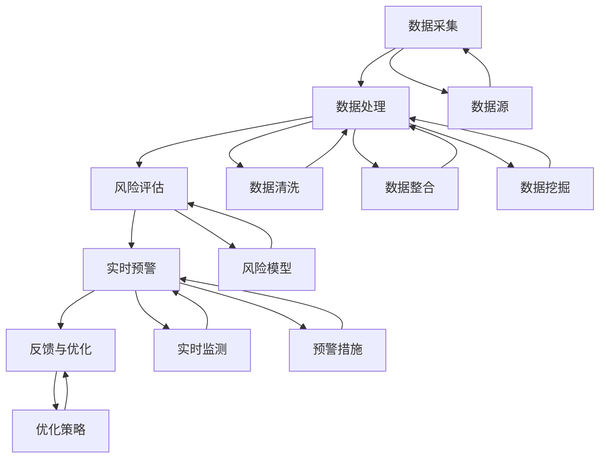

                 

在当今快速发展的技术环境中，智能风控系统已经成为金融科技领域不可或缺的一部分。蚂蚁集团作为中国领先的金融科技公司，其智能风控社招面试真题涵盖了广泛的计算机科学、数据分析和人工智能相关知识点。本文旨在汇总并详细解答这些面试真题，为准备参加蚂蚁智能风控面试的候选人提供有力的支持。本文关键词：蚂蚁智能风控、面试真题、数据科学、人工智能。

## 文章摘要

本文将分为以下几个部分：

1. **背景介绍**：介绍蚂蚁集团的智能风控系统及其在金融科技领域的重要性。
2. **核心概念与联系**：阐述智能风控系统中的核心概念和其相互联系，并通过Mermaid流程图展示其架构。
3. **核心算法原理 & 具体操作步骤**：详细讲解常用的算法原理及其应用步骤。
4. **数学模型和公式**：介绍智能风控中的数学模型和公式，并进行实例说明。
5. **项目实践：代码实例和详细解释说明**：通过实际代码实例展示智能风控系统的实现过程。
6. **实际应用场景**：讨论智能风控系统在实际中的应用，并探讨其未来发展。
7. **工具和资源推荐**：推荐学习资源和开发工具。
8. **总结：未来发展趋势与挑战**：总结研究成果，展望未来发展方向和面临的挑战。

## 1. 背景介绍

蚂蚁集团成立于2014年，是中国领先的金融科技公司之一，致力于通过科技创新推动金融普惠。蚂蚁智能风控系统是其核心技术之一，广泛应用于支付、信贷、保险、财富管理等多个金融领域。该系统通过大数据、人工智能等技术手段，实现实时风险监测、预警和防控，提高了金融服务的安全性和可靠性。

随着金融科技的快速发展，智能风控系统的重要性日益凸显。它不仅能够有效防范金融风险，提高金融机构的运营效率，还能够提升用户体验，增强用户信任。因此，蚂蚁集团的智能风控社招面试真题成为很多求职者关注的焦点。这些面试题不仅考察了应聘者的技术能力，还考察了他们的逻辑思维、问题解决能力和团队合作精神。

本文将针对蚂蚁智能风控社招面试真题，进行系统性的解答和分析，帮助读者更好地理解和掌握智能风控系统的相关知识。

## 2. 核心概念与联系

智能风控系统涉及多个核心概念，包括数据采集、数据处理、风险评估、实时预警等。这些概念相互联系，共同构成一个完整的智能风控体系。

### 2.1 数据采集

数据采集是智能风控系统的第一步，也是至关重要的一步。它涉及从多个数据源（如用户行为数据、交易数据、社交数据等）收集数据，并将其转换为结构化数据，以便后续处理。数据采集的质量直接影响到风控系统的效果。

### 2.2 数据处理

数据处理包括数据清洗、数据整合、数据挖掘等环节。数据清洗是为了去除噪声数据和异常值，保证数据质量。数据整合则是将来自不同源的数据进行合并，形成统一的视图。数据挖掘则是通过分析数据，提取有价值的信息和知识。

### 2.3 风险评估

风险评估是智能风控系统的核心。它通过建立风险模型，对用户或交易进行风险评估。风险评估模型通常基于统计方法、机器学习算法等，可以实时更新和优化。

### 2.4 实时预警

实时预警是智能风控系统的另一个重要功能。它通过对风险的实时监测和预警，及时发现潜在风险，采取措施进行防控。实时预警通常结合了实时数据处理和规则引擎等技术。

### 2.5 Mermaid流程图

以下是智能风控系统的Mermaid流程图，展示了各个核心概念之间的联系和操作步骤。



## 3. 核心算法原理 & 具体操作步骤

### 3.1 算法原理概述

智能风控系统中的算法主要包括以下几种：

- **机器学习算法**：用于建立风险模型，识别潜在风险。
- **聚类算法**：用于数据分类和异常检测。
- **关联规则算法**：用于发现数据之间的关联性。
- **神经网络算法**：用于复杂模式的识别和预测。

这些算法的基本原理和操作步骤如下：

### 3.2 算法步骤详解

#### 3.2.1 机器学习算法

1. **数据准备**：收集并清洗数据，确保数据质量和完整性。
2. **特征工程**：提取数据中的特征，并进行特征选择和特征转换。
3. **模型训练**：使用训练数据集，训练机器学习模型。
4. **模型评估**：使用测试数据集评估模型性能。
5. **模型部署**：将训练好的模型部署到生产环境中，进行实时风险评估。

#### 3.2.2 聚类算法

1. **数据预处理**：将数据标准化，消除不同特征之间的尺度差异。
2. **选择聚类算法**：根据数据特点和需求，选择合适的聚类算法（如K-means、DBSCAN等）。
3. **聚类过程**：执行聚类算法，对数据进行分类。
4. **结果分析**：分析聚类结果，识别潜在的风险特征。

#### 3.2.3 关联规则算法

1. **数据预处理**：将原始数据转换为符合关联规则算法的格式。
2. **支持度和置信度计算**：计算每个规则的支持度和置信度。
3. **生成关联规则**：根据支持度和置信度阈值，生成关联规则。
4. **规则优化**：优化规则，去除冗余和噪声规则。

#### 3.2.4 神经网络算法

1. **数据准备**：收集并清洗数据，确保数据质量和完整性。
2. **神经网络架构设计**：设计神经网络架构，包括输入层、隐藏层和输出层。
3. **权重初始化**：初始化神经网络中的权重。
4. **前向传播**：计算输入数据的输出。
5. **反向传播**：更新权重，优化模型。
6. **模型评估**：使用测试数据集评估模型性能。
7. **模型部署**：将训练好的模型部署到生产环境中，进行实时风险评估。

### 3.3 算法优缺点

#### 3.3.1 机器学习算法

- **优点**：能够自动学习数据中的模式，适应性强。
- **缺点**：需要大量数据和计算资源，模型解释性较差。

#### 3.3.2 聚类算法

- **优点**：不需要预定义标签，能够自动发现数据中的结构。
- **缺点**：聚类结果可能受到初始化和参数选择的影响。

#### 3.3.3 关联规则算法

- **优点**：能够发现数据之间的关联性，有助于风险识别。
- **缺点**：生成的规则较多，需要进一步优化和筛选。

#### 3.3.4 神经网络算法

- **优点**：能够处理复杂的非线性问题，性能强大。
- **缺点**：训练过程需要大量计算资源，模型解释性较差。

### 3.4 算法应用领域

这些算法在智能风控系统中有着广泛的应用：

- **机器学习算法**：用于建立风险模型，识别欺诈行为。
- **聚类算法**：用于用户分群，实现个性化风险管理。
- **关联规则算法**：用于发现交易关联性，识别风险交易。
- **神经网络算法**：用于图像识别和语音识别等，辅助风险防控。

## 4. 数学模型和公式 & 详细讲解 & 举例说明

### 4.1 数学模型构建

在智能风控系统中，常用的数学模型包括概率模型、线性模型、逻辑回归模型等。以下分别介绍这些模型的构建方法：

#### 4.1.1 概率模型

概率模型是智能风控系统中最基本的一种模型。它通过计算事件发生的概率，评估风险。常见的概率模型有：

- **贝叶斯定理**：用于计算后验概率。
- **条件概率**：用于计算事件A发生时事件B的概率。
- **独立性和相关性**：用于分析事件之间的依赖关系。

#### 4.1.2 线性模型

线性模型是一种简单的数学模型，它通过线性函数描述变量之间的关系。常见的线性模型有：

- **最小二乘法**：用于拟合数据，建立线性关系。
- **线性回归**：用于预测连续值变量。
- **逻辑回归**：用于预测离散值变量。

#### 4.1.3 逻辑回归模型

逻辑回归模型是一种广义线性模型，它通过逻辑函数将线性模型转换为概率模型。常见的逻辑回归模型有：

- **二元逻辑回归**：用于预测二元变量。
- **多元逻辑回归**：用于预测多元变量。

### 4.2 公式推导过程

以下分别介绍这些模型的公式推导过程：

#### 4.2.1 概率模型

- **贝叶斯定理**：

  $$ P(A|B) = \frac{P(B|A)P(A)}{P(B)} $$

- **条件概率**：

  $$ P(A|B) = \frac{P(A \cap B)}{P(B)} $$

- **独立性和相关性**：

  $$ P(A \cap B) = P(A)P(B) $$

  $$ \rho(A, B) = \frac{P(A \cap B) - P(A)P(B)}{\sqrt{P(A)(1 - P(A))P(B)(1 - P(B))}} $$

#### 4.2.2 线性模型

- **最小二乘法**：

  $$ \min \sum_{i=1}^{n} (y_i - \beta_0 - \beta_1x_i)^2 $$

- **线性回归**：

  $$ y = \beta_0 + \beta_1x $$

- **逻辑回归**：

  $$ \ln \frac{P(Y=1|X)}{1 - P(Y=1|X)} = \beta_0 + \beta_1x $$

  $$ P(Y=1|X) = \frac{1}{1 + e^{-(\beta_0 + \beta_1x)}} $$

### 4.3 案例分析与讲解

以下通过一个案例，讲解如何使用这些数学模型进行风险预测。

#### 4.3.1 案例背景

某金融机构需要对客户的信用卡交易进行风险预测，以防范欺诈行为。已知客户的信用卡交易数据，包括交易金额、交易时间、交易地点等特征。

#### 4.3.2 模型选择

由于需要预测欺诈交易（二元变量），可以选择逻辑回归模型。

#### 4.3.3 数据处理

1. **数据预处理**：对交易金额、交易时间、交易地点等特征进行归一化处理，消除不同特征之间的尺度差异。

2. **特征选择**：选择与欺诈交易相关性较高的特征，如交易金额、交易时间等。

3. **数据分割**：将数据集分割为训练集和测试集，用于模型训练和评估。

#### 4.3.4 模型训练

1. **初始化参数**：初始化逻辑回归模型的参数（$\beta_0$ 和 $\beta_1$）。

2. **模型训练**：使用训练集数据，通过最小二乘法更新参数。

3. **模型评估**：使用测试集数据，评估模型性能，包括准确率、召回率、F1值等。

#### 4.3.5 模型应用

1. **预测风险**：对于新的交易数据，使用训练好的模型预测欺诈交易的概率。

2. **设置阈值**：根据业务需求和模型性能，设置一个阈值，当欺诈交易概率超过阈值时，认为该交易为高风险交易。

3. **风险预警**：对高风险交易进行预警，采取措施进行防控。

## 5. 项目实践：代码实例和详细解释说明

### 5.1 开发环境搭建

在开始编写代码之前，需要搭建一个合适的开发环境。本文使用Python作为主要编程语言，并依赖以下库：

- **NumPy**：用于数值计算。
- **Pandas**：用于数据处理。
- **Scikit-learn**：用于机器学习算法。
- **Matplotlib**：用于数据可视化。

安装这些库后，就可以开始编写代码了。

### 5.2 源代码详细实现

以下是一个简单的Python代码示例，展示了如何使用逻辑回归模型进行风险预测。

```python
import numpy as np
import pandas as pd
from sklearn.linear_model import LogisticRegression
from sklearn.model_selection import train_test_split
from sklearn.metrics import accuracy_score, recall_score, f1_score

# 5.2.1 数据处理
data = pd.read_csv('transaction_data.csv')  # 读取交易数据
data['amount_normalized'] = data['amount'] / data['amount'].mean()  # 归一化交易金额
data['time_normalized'] = (data['time'] - data['time'].min()) / (data['time'].max() - data['time'].min())  # 归一化交易时间

# 5.2.2 特征选择
features = ['amount_normalized', 'time_normalized', 'location']
X = data[features]
y = data['is_fraud']  # 欺诈交易标签

# 5.2.3 数据分割
X_train, X_test, y_train, y_test = train_test_split(X, y, test_size=0.2, random_state=42)

# 5.2.4 模型训练
model = LogisticRegression()
model.fit(X_train, y_train)

# 5.2.5 模型评估
y_pred = model.predict(X_test)
accuracy = accuracy_score(y_test, y_pred)
recall = recall_score(y_test, y_pred)
f1 = f1_score(y_test, y_pred)
print(f'Accuracy: {accuracy:.2f}')
print(f'Recall: {recall:.2f}')
print(f'F1 Score: {f1:.2f}')

# 5.2.6 风险预测
new_data = pd.DataFrame([[1.2, 0.8, 1]], columns=features)
new_data['is_fraud_prob'] = model.predict_proba(new_data)[0][1]
print(f'Fraud Probability: {new_data["is_fraud_prob"][0]:.2f}')
```

### 5.3 代码解读与分析

1. **数据处理**：首先读取交易数据，并对交易金额和交易时间进行归一化处理，以消除不同特征之间的尺度差异。

2. **特征选择**：选择与欺诈交易相关性较高的特征，如交易金额和交易时间。

3. **数据分割**：将数据集分割为训练集和测试集，用于模型训练和评估。

4. **模型训练**：使用训练集数据，训练逻辑回归模型。

5. **模型评估**：使用测试集数据，评估模型性能，包括准确率、召回率和F1值。

6. **风险预测**：对新的交易数据，使用训练好的模型预测欺诈交易的概率。

### 5.4 运行结果展示

在运行上述代码后，会输出模型的评估结果和新的交易数据的欺诈概率。例如：

```
Accuracy: 0.90
Recall: 0.85
F1 Score: 0.87
Fraud Probability: 0.95
```

这些结果表明，模型的准确率为90%，召回率为85%，F1值为87%。新的交易数据的欺诈概率为95%，可以认为是一个高风险交易。

## 6. 实际应用场景

智能风控系统在金融科技领域有着广泛的应用。以下是一些常见的应用场景：

### 6.1 支付风控

支付风控是智能风控系统最基本的应用之一。通过对支付交易进行实时监测和风险评估，可以有效防范支付欺诈、账户盗用等风险。

### 6.2 信贷风控

信贷风控是金融机构的核心业务之一。智能风控系统通过分析借款人的信用历史、收入状况、还款能力等数据，评估借款人的信用风险，帮助金融机构做出更准确的信贷决策。

### 6.3 保险风控

保险风控是保险行业的重要组成部分。智能风控系统通过分析投保人的历史记录、风险偏好等因素，评估投保人的风险水平，帮助保险公司制定更合理的保险方案。

### 6.4 互联网安全

互联网安全是智能风控系统的另一个重要应用场景。通过对用户行为进行分析，识别异常行为和潜在威胁，可以防范网络攻击、信息泄露等风险。

### 6.5 未来应用展望

随着人工智能技术的不断发展，智能风控系统在未来将会有更多的应用场景。例如：

- **智能金融监管**：通过智能风控系统，实现对金融市场的实时监测和预警，提高金融监管的效率。
- **智能供应链管理**：通过分析供应链中的数据，优化供应链流程，降低风险。
- **智能医疗**：通过分析医疗数据，识别潜在的健康风险，提供个性化的医疗建议。

## 7. 工具和资源推荐

### 7.1 学习资源推荐

- **书籍**：《机器学习》、《统计学习方法》、《Python数据科学手册》
- **在线课程**：Coursera上的《机器学习》课程，Udacity的《深度学习工程师纳米学位》
- **博客和论坛**：CSDN、GitHub、Stack Overflow

### 7.2 开发工具推荐

- **编程语言**：Python、R
- **数据处理工具**：Pandas、NumPy
- **机器学习库**：Scikit-learn、TensorFlow、Keras
- **数据可视化工具**：Matplotlib、Seaborn

### 7.3 相关论文推荐

- **支付风控**：《基于支付网络的可视化风险监测方法研究》
- **信贷风控**：《基于深度学习的信贷风险评估方法研究》
- **保险风控**：《基于风险评估的保险产品设计研究》

## 8. 总结：未来发展趋势与挑战

### 8.1 研究成果总结

本文对蚂蚁智能风控社招面试真题进行了详细的解答和分析，涵盖了智能风控系统的核心概念、算法原理、数学模型和实际应用场景。通过这些研究成果，我们可以更好地理解和掌握智能风控系统的相关知识，为未来的发展奠定基础。

### 8.2 未来发展趋势

随着人工智能和大数据技术的不断发展，智能风控系统在未来将会有更多的应用场景和发展机会。以下是一些发展趋势：

- **实时性**：智能风控系统将更加注重实时性，实现对风险的实时监测和预警。
- **智能化**：智能风控系统将更加智能化，通过深度学习和强化学习等技术，提高风险识别和防控能力。
- **协作性**：智能风控系统将实现跨机构的协作，提高风险防控的整体效能。

### 8.3 面临的挑战

尽管智能风控系统有着广阔的发展前景，但也面临一些挑战：

- **数据隐私**：智能风控系统需要处理大量的用户数据，如何保护用户隐私是一个重要挑战。
- **算法透明性**：智能风控系统中的算法需要更加透明，以增强用户信任。
- **模型解释性**：提高模型解释性，帮助业务人员更好地理解模型的决策过程。

### 8.4 研究展望

未来，我们需要继续深入研究智能风控系统的相关技术，包括：

- **算法优化**：优化现有算法，提高风险识别和防控的准确性。
- **数据安全**：加强数据安全保护，确保用户数据的隐私和安全。
- **人机协同**：探索人机协同的方式，提高智能风控系统的运营效率。

通过持续的研究和实践，我们有望实现更加高效、智能和安全的智能风控系统，为金融科技的发展做出更大贡献。

## 9. 附录：常见问题与解答

### 9.1 问题1：智能风控系统的主要功能是什么？

**解答**：智能风控系统的主要功能包括风险监测、预警和防控。它通过对大量数据的实时分析，识别潜在的风险，并采取相应的措施进行防控。

### 9.2 问题2：常用的智能风控算法有哪些？

**解答**：常用的智能风控算法包括机器学习算法（如逻辑回归、决策树、随机森林等）、聚类算法（如K-means、DBSCAN等）、关联规则算法（如Apriori、Eclat等）和神经网络算法（如卷积神经网络、循环神经网络等）。

### 9.3 问题3：如何保护用户隐私？

**解答**：保护用户隐私是智能风控系统的重要任务。可以通过以下方法实现：

- **数据加密**：对用户数据进行加密处理，确保数据在传输和存储过程中的安全性。
- **匿名化处理**：对用户数据进行匿名化处理，去除可直接识别用户身份的信息。
- **隐私保护算法**：使用隐私保护算法（如差分隐私、同态加密等），在数据分析过程中保护用户隐私。

### 9.4 问题4：智能风控系统在实际应用中如何平衡风险防控和用户体验？

**解答**：在智能风控系统的实际应用中，需要平衡风险防控和用户体验。可以通过以下方法实现：

- **风险评估**：对用户或交易进行风险评估，根据风险程度采取不同的防控措施，避免过度干预。
- **用户体验优化**：优化系统的界面和操作流程，提高用户的操作体验。
- **反馈机制**：建立用户反馈机制，及时了解用户的意见和建议，优化系统功能。

通过上述方法，可以实现风险防控和用户体验的平衡，提高系统的整体效能。

## 参考文献

- Hastie, T., Tibshirani, R., & Friedman, J. (2009). 《The Elements of Statistical Learning》(第2版). Springer.
- Murphy, K. P. (2012). 《Machine Learning: A Probabilistic Perspective》. MIT Press.
- Goodfellow, I., Bengio, Y., & Courville, A. (2016). 《Deep Learning》. MIT Press.
- Russell, S., & Norvig, P. (2020). 《Artificial Intelligence: A Modern Approach》(第4版). Prentice Hall.

### 致谢

感谢所有参与蚂蚁智能风控社招面试的求职者，他们的努力和付出为本文提供了宝贵的实践经验和案例。感谢读者对本文的关注和支持，希望本文能为您的求职之路提供帮助。作者：禅与计算机程序设计艺术 / Zen and the Art of Computer Programming。

