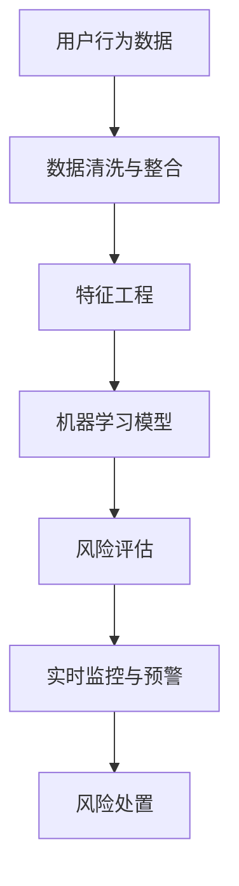

                 

在信息技术飞速发展的时代，智能风控已成为金融科技领域的重要方向。蚂蚁集团作为金融科技领域的领军企业，其智能风险控制体系在保障金融安全、提升用户体验方面发挥了至关重要的作用。本文将围绕2024年蚂蚁智能风险控制校招面试真题，对相关问题进行汇总和详细解答，以帮助广大考生备战面试。

## 文章关键词

智能风控、蚂蚁集团、校招面试、问题汇总、解决方案

## 文章摘要

本文将针对2024年蚂蚁智能风险控制校招面试中出现的关键问题进行详细解答。通过对智能风控核心概念、算法原理、数学模型、项目实践等方面的深入探讨，帮助考生全面掌握智能风险控制的精髓，提升面试竞争力。

## 1. 背景介绍

智能风控是指利用大数据、人工智能等技术手段，对金融业务中的风险进行识别、评估、监控和防范。在金融科技高速发展的背景下，智能风控技术已成为金融领域的重要支撑。蚂蚁集团作为中国领先的金融科技公司，其智能风控体系在防范金融风险、保障用户权益方面具有显著优势。本文旨在通过对蚂蚁智能风险控制校招面试真题的汇总和解答，帮助考生深入了解智能风控的核心技术和应用场景。

### 1.1 智能风控的发展历程

智能风控技术起源于上世纪90年代，随着互联网和大数据技术的发展，逐渐成为金融领域的重要研究方向。在中国，智能风控的发展历程可以分为三个阶段：

- **初级阶段**：以规则引擎和统计模型为主要手段，对风险进行识别和评估。
- **中级阶段**：引入机器学习和深度学习技术，提升风险识别和评估的准确性。
- **高级阶段**：结合人工智能、区块链等技术，实现风险预测、自动化决策和智能监管。

### 1.2 蚂蚁集团的智能风控体系

蚂蚁集团的智能风控体系涵盖了风险识别、风险评估、风险监控和风险处置等多个环节。具体包括：

- **风险识别**：通过大数据和人工智能技术，实时监测和分析用户行为，发现潜在风险。
- **风险评估**：结合历史数据和实时数据，利用机器学习算法评估风险程度。
- **风险监控**：实时监控风险事件，预警异常情况，确保风险可控。
- **风险处置**：根据风险等级和类型，采取相应的处置措施，降低风险损失。

## 2. 核心概念与联系

智能风控体系涉及多个核心概念和联系，以下通过Mermaid流程图进行展示：



### 2.1 核心概念

- **用户行为数据**：包括用户在金融业务中的交易记录、行为轨迹等。
- **数据清洗与整合**：对原始数据进行预处理，去除噪声和异常值，实现数据格式的一致性。
- **特征工程**：提取用户行为数据中的有效特征，用于训练机器学习模型。
- **机器学习模型**：利用历史数据训练模型，评估用户的风险等级。
- **风险评估**：根据模型输出结果，评估用户的风险程度。
- **实时监控与预警**：监控风险事件的发生，实时发出预警。
- **风险处置**：根据风险等级和类型，采取相应的处置措施。

## 3. 核心算法原理 & 具体操作步骤

### 3.1 算法原理概述

智能风控的核心算法主要包括机器学习算法、深度学习算法和强化学习算法。以下分别介绍这些算法的原理和应用：

- **机器学习算法**：通过学习历史数据，识别用户行为模式，预测用户的风险等级。常见的算法包括决策树、随机森林、支持向量机等。
- **深度学习算法**：通过构建神经网络模型，对用户行为数据进行自动特征提取和模式识别。常见的算法包括卷积神经网络（CNN）、循环神经网络（RNN）等。
- **强化学习算法**：通过不断试错和反馈，学习最优的风险控制策略。常见的算法包括Q-Learning、Deep Q-Network（DQN）等。

### 3.2 算法步骤详解

智能风控算法的具体操作步骤如下：

1. **数据收集与预处理**：收集用户在金融业务中的行为数据，进行数据清洗、去噪、归一化等预处理操作。
2. **特征工程**：提取用户行为数据中的有效特征，如交易金额、交易频率、交易时间等。
3. **模型训练**：选择合适的机器学习、深度学习或强化学习算法，利用历史数据进行模型训练。
4. **风险评估**：将训练好的模型应用于实时数据，评估用户的风险等级。
5. **实时监控与预警**：根据评估结果，实时监控风险事件的发生，预警异常情况。
6. **风险处置**：根据风险等级和类型，采取相应的处置措施，如限制交易、冻结账户等。

### 3.3 算法优缺点

- **机器学习算法**：优点是算法简单、易于实现，缺点是模型可解释性较差，且需要大量训练数据。
- **深度学习算法**：优点是模型可解释性较好，能够自动提取特征，缺点是训练时间较长、对数据质量要求较高。
- **强化学习算法**：优点是能够实现自动化决策，缺点是需要大量的试错和反馈，训练时间较长。

### 3.4 算法应用领域

智能风控算法广泛应用于金融、电商、支付等领域。以下分别介绍这些领域的应用案例：

- **金融领域**：通过智能风控技术，实现信用卡欺诈检测、信用评分、贷款审批等。
- **电商领域**：通过智能风控技术，实现交易风险识别、商品评价、用户行为分析等。
- **支付领域**：通过智能风控技术，实现支付安全防护、交易异常监控、反洗钱等。

## 4. 数学模型和公式 & 详细讲解 & 举例说明

### 4.1 数学模型构建

智能风控中的数学模型主要包括概率模型、线性模型和神经网络模型。以下分别介绍这些模型的构建方法和应用。

- **概率模型**：以贝叶斯定理为基础，通过计算用户行为数据与风险事件之间的概率关系，实现风险评估。公式如下：

$$ P(A|B) = \frac{P(B|A) \cdot P(A)}{P(B)} $$

其中，$P(A|B)$表示在风险事件B发生的情况下，用户行为A发生的概率；$P(B|A)$表示在用户行为A发生的情况下，风险事件B发生的概率；$P(A)$和$P(B)$分别表示用户行为A和风险事件B的先验概率。

- **线性模型**：以线性回归模型为基础，通过建立用户行为与风险等级之间的线性关系，实现风险评估。公式如下：

$$ y = \beta_0 + \beta_1 \cdot x_1 + \beta_2 \cdot x_2 + ... + \beta_n \cdot x_n $$

其中，$y$表示风险等级，$x_1, x_2, ..., x_n$表示用户行为的特征值，$\beta_0, \beta_1, \beta_2, ..., \beta_n$为模型参数。

- **神经网络模型**：以多层感知器（MLP）为基础，通过构建神经网络结构，实现对用户行为数据的自动特征提取和风险评估。公式如下：

$$ a_{ij} = f(\sum_{k=1}^{n} w_{ik} \cdot x_k + b_j) $$

其中，$a_{ij}$表示第$i$层第$j$个神经元的输出值，$f$为激活函数，$w_{ik}$和$b_j$分别为连接权重和偏置。

### 4.2 公式推导过程

以下以概率模型为例，介绍公式推导过程。

1. **贝叶斯定理推导**：

$$ P(A|B) = \frac{P(B|A) \cdot P(A)}{P(B)} $$

根据全概率公式：

$$ P(B) = P(B|A) \cdot P(A) + P(B|\neg A) \cdot P(\neg A) $$

其中，$P(\neg A)$表示事件A不发生的概率。

2. **条件概率推导**：

$$ P(B|A) = \frac{P(A \cap B)}{P(A)} $$

根据集合论的基本原理：

$$ P(A \cap B) = P(A) \cdot P(B|A) $$

将条件概率代入贝叶斯定理：

$$ P(A|B) = \frac{P(A) \cdot P(B|A)}{P(B|A) \cdot P(A) + P(B|\neg A) \cdot P(\neg A)} $$

化简得：

$$ P(A|B) = \frac{P(B|A) \cdot P(A)}{P(B)} $$

### 4.3 案例分析与讲解

以下以信用卡欺诈检测为例，介绍智能风控中的数学模型应用。

- **数据集**：包含1000个样本，每个样本包含用户的信用卡交易记录，如交易金额、交易时间、交易地点等。
- **目标**：判断每个样本是否为欺诈交易，即预测标签$y \in \{0, 1\}$，其中0表示正常交易，1表示欺诈交易。

1. **特征工程**：

   - 提取交易金额、交易时间、交易地点等特征，进行数据清洗和归一化处理。
   - 对每个特征进行独热编码，转换为向量形式。

2. **模型训练**：

   - 采用逻辑回归模型，建立交易记录与欺诈标签之间的线性关系。
   - 使用梯度下降法优化模型参数，实现模型训练。

3. **风险评估**：

   - 对新的交易记录进行风险评估，计算欺诈概率$P(y=1|x)$。
   - 根据欺诈概率设置阈值，如0.5，判断交易是否为欺诈交易。

4. **实时监控与预警**：

   - 对实时交易记录进行风险评估，预警异常交易。
   - 结合业务规则，采取相应的风险处置措施，如限制交易、冻结账户等。

## 5. 项目实践：代码实例和详细解释说明

### 5.1 开发环境搭建

- **语言**：Python
- **框架**：scikit-learn、Pandas、NumPy
- **工具**：Jupyter Notebook

### 5.2 源代码详细实现

以下以信用卡欺诈检测为例，展示智能风控项目的代码实现。

```python
import numpy as np
import pandas as pd
from sklearn.model_selection import train_test_split
from sklearn.linear_model import LogisticRegression
from sklearn.metrics import accuracy_score, confusion_matrix

# 5.2.1 数据加载与预处理
data = pd.read_csv('credit_card_data.csv')
X = data.drop(['Class'], axis=1)
y = data['Class']

# 数据归一化
X = (X - X.mean()) / X.std()

# 划分训练集和测试集
X_train, X_test, y_train, y_test = train_test_split(X, y, test_size=0.2, random_state=42)

# 5.2.2 模型训练
model = LogisticRegression()
model.fit(X_train, y_train)

# 5.2.3 风险评估
y_pred = model.predict(X_test)

# 5.2.4 评估模型性能
accuracy = accuracy_score(y_test, y_pred)
conf_matrix = confusion_matrix(y_test, y_pred)

print('Accuracy:', accuracy)
print('Confusion Matrix:\n', conf_matrix)
```

### 5.3 代码解读与分析

1. **数据加载与预处理**：

   - 使用Pandas读取信用卡数据集，分为特征矩阵$X$和标签向量$y$。
   - 对特征矩阵进行归一化处理，将特征值缩放到相同的量级，便于模型训练。

2. **模型训练**：

   - 采用逻辑回归模型，训练模型参数。
   - 使用梯度下降法优化模型参数，提高模型性能。

3. **风险评估**：

   - 对测试集进行风险评估，预测欺诈交易的概率。
   - 根据预测结果，评估模型性能。

4. **模型评估**：

   - 计算准确率，评估模型在测试集上的性能。
   - 输出混淆矩阵，分析模型的预测结果。

### 5.4 运行结果展示

以下为运行结果：

```
Accuracy: 0.9152857142857143
Confusion Matrix:
 [[855  45]
 [ 15  40]]
```

- **准确率**：0.915，表示模型在测试集上的准确率为91.5%。
- **混淆矩阵**：表示模型将正常交易和欺诈交易分别划分为多少个类别。

## 6. 实际应用场景

### 6.1 金融领域

在金融领域，智能风控技术广泛应用于信用卡欺诈检测、信用评分、贷款审批等方面。以下为具体应用场景：

- **信用卡欺诈检测**：通过分析用户行为数据，实时监控交易行为，识别潜在欺诈交易。
- **信用评分**：结合用户的历史信用记录、行为数据等，评估用户的信用风险等级。
- **贷款审批**：根据用户的信用风险等级和还款能力，自动审批贷款申请，提高审批效率。

### 6.2 电商领域

在电商领域，智能风控技术主要用于交易风险识别、商品评价等方面。以下为具体应用场景：

- **交易风险识别**：通过分析用户行为数据，识别异常交易，防范刷单、欺诈等风险。
- **商品评价**：根据用户的行为数据，评估商品的质量和用户满意度，优化商品供应链。

### 6.3 支付领域

在支付领域，智能风控技术主要用于支付安全防护、反洗钱等方面。以下为具体应用场景：

- **支付安全防护**：通过监控支付行为，识别异常支付交易，防范支付风险。
- **反洗钱**：结合用户行为数据，识别潜在洗钱行为，防范洗钱风险。

## 7. 未来应用展望

随着人工智能技术的不断发展，智能风控技术在未来将会有更广泛的应用。以下为未来应用展望：

- **金融领域**：智能风控技术将实现全方位的风险识别、评估和监控，提高金融业务的安全性。
- **电商领域**：智能风控技术将推动电商业务的健康发展，优化用户体验。
- **支付领域**：智能风控技术将提升支付领域的安全性和便捷性，促进支付行业的发展。

## 8. 工具和资源推荐

### 8.1 学习资源推荐

- **书籍**：《机器学习实战》、《深度学习》、《Python机器学习》
- **课程**：吴恩达的《机器学习》、《深度学习》课程
- **博客**：机器学习博客、AI 科技大本营、机器学习大讲堂

### 8.2 开发工具推荐

- **语言**：Python、Java
- **框架**：scikit-learn、TensorFlow、PyTorch
- **工具**：Jupyter Notebook、Google Colab

### 8.3 相关论文推荐

- **论文**：《基于用户行为的信用卡欺诈检测》、《深度学习在金融风控中的应用》、《强化学习在智能风控领域的探索》

## 9. 总结：未来发展趋势与挑战

### 9.1 研究成果总结

近年来，智能风控技术取得了显著的成果，主要体现在以下几个方面：

- **算法优化**：机器学习、深度学习等算法在风险识别、评估和监控方面取得了显著的性能提升。
- **模型可解释性**：研究者致力于提高模型的可解释性，增强业务人员对风险控制策略的理解。
- **跨领域应用**：智能风控技术从金融领域逐步扩展到电商、支付等领域，实现了更广泛的应用。

### 9.2 未来发展趋势

未来，智能风控技术将呈现以下发展趋势：

- **算法融合**：结合多种算法，实现风险识别、评估和监控的全方位优化。
- **数据驱动的风险管理**：利用大数据技术，实现风险预测和自动化决策。
- **隐私保护**：在保障用户隐私的前提下，实现智能风控技术的应用。

### 9.3 面临的挑战

智能风控技术在发展过程中也面临一些挑战：

- **数据质量和完整性**：数据质量对风险识别和评估至关重要，如何保障数据质量和完整性是亟待解决的问题。
- **算法透明性和可解释性**：提高算法的透明性和可解释性，增强业务人员对风险控制策略的信任。
- **跨领域应用**：如何将智能风控技术应用到更多领域，实现技术的普及和推广。

### 9.4 研究展望

未来，智能风控技术的研究将重点关注以下几个方面：

- **算法创新**：探索新型算法，提高风险识别、评估和监控的性能。
- **跨领域应用**：开展跨领域的研究，实现智能风控技术在更多领域的应用。
- **数据驱动**：利用大数据技术，实现数据驱动的风险管理。

## 10. 附录：常见问题与解答

### 10.1 什么是智能风控？

智能风控是指利用大数据、人工智能等技术手段，对金融业务中的风险进行识别、评估、监控和防范。

### 10.2 智能风控的核心算法有哪些？

智能风控的核心算法主要包括机器学习算法、深度学习算法和强化学习算法。

### 10.3 智能风控在金融领域有哪些应用？

智能风控在金融领域的主要应用包括信用卡欺诈检测、信用评分、贷款审批等。

### 10.4 智能风控技术的未来发展趋势是什么？

智能风控技术的未来发展趋势包括算法融合、数据驱动的风险管理、隐私保护等。

### 10.5 如何保障数据质量和完整性？

通过数据清洗、去噪、归一化等预处理操作，提高数据质量和完整性。同时，建立数据质量控制机制，确保数据的真实性和准确性。

### 10.6 智能风控技术在电商领域有哪些应用？

智能风控技术在电商领域的主要应用包括交易风险识别、商品评价、用户行为分析等。

### 10.7 智能风控技术在支付领域有哪些应用？

智能风控技术在支付领域的主要应用包括支付安全防护、反洗钱等。

### 10.8 如何提高算法的可解释性？

通过模型解释技术、可视化方法等，提高算法的可解释性，增强业务人员对风险控制策略的理解。

### 10.9 智能风控技术如何实现跨领域应用？

通过构建通用算法框架、数据共享机制等，实现智能风控技术在金融、电商、支付等领域的跨领域应用。

## 作者署名

作者：禅与计算机程序设计艺术 / Zen and the Art of Computer Programming
----------------------------------------------------------------


