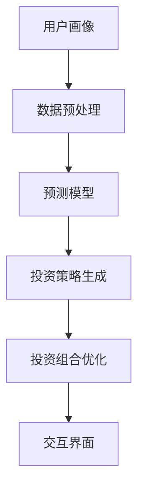
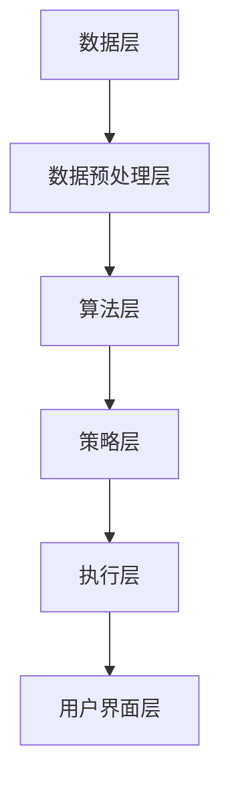

                 

## 1. 背景介绍

随着人工智能和大数据技术的不断发展，金融行业也正在经历一场深刻的变革。智能投顾作为金融科技（FinTech）的一个重要分支，逐渐成为投资者和金融机构关注的焦点。智能投顾系统通过分析用户的财务状况、投资目标和风险偏好，提供个性化的投资建议，以帮助用户实现资产增值。蚂蚁金服作为国内领先的金融科技公司，其智能投顾系统在行业内具有较大的影响力。

蚂蚁金服的智能投顾系统旨在为不同类型的用户提供量身定制的投资方案。系统通过深度学习、数据挖掘、智能优化等技术，对海量数据进行分析和处理，以预测市场趋势和评估投资组合的风险收益。此外，智能投顾系统还具备强大的交互能力，能够与用户实时沟通，及时调整投资策略，以满足用户的需求变化。

为了吸引和选拔优秀的人才，蚂蚁金服在2024年校招中针对智能投顾系统工程师岗位设置了多轮面试。本文将对这些面试题进行详细解析，帮助考生更好地应对面试挑战。

## 2. 核心概念与联系

在解析面试题之前，我们首先需要了解智能投顾系统中的核心概念和其相互之间的联系。

### 2.1 智能投顾系统架构

智能投顾系统通常由以下几个主要部分组成：

1. **用户画像**：通过收集用户的个人信息、财务数据、投资历史等，构建用户的个性化画像。
2. **数据预处理**：对原始数据进行清洗、去噪、归一化等操作，使其符合分析要求。
3. **预测模型**：利用机器学习算法对市场趋势、投资组合风险收益进行预测。
4. **投资策略生成**：根据预测结果和用户画像，生成个性化的投资策略。
5. **投资组合优化**：通过优化算法对投资组合进行调整，以实现风险最小化或收益最大化。
6. **交互界面**：提供用户与系统交互的接口，展示投资建议和调整方案。

### 2.2 核心概念原理和架构的 Mermaid 流程图



### 2.3 智能投顾系统的关键技术

1. **机器学习算法**：用于预测市场趋势和评估投资组合风险收益。常见的算法包括决策树、随机森林、支持向量机、神经网络等。
2. **数据挖掘**：从海量数据中提取有用的信息和模式，用于改进预测模型和优化投资策略。
3. **优化算法**：用于调整投资组合，以实现风险最小化或收益最大化。常见的优化算法包括线性规划、动态规划、遗传算法等。
4. **自然语言处理**：用于理解和生成自然语言文本，实现用户与系统的智能交互。

## 3. 核心算法原理 & 具体操作步骤

### 3.1 算法原理概述

智能投顾系统的核心算法主要包括以下三个方面：

1. **用户画像构建**：通过对用户的个人信息、财务数据、投资历史等进行分析，构建用户的个性化画像。
2. **预测模型训练**：利用历史数据，通过机器学习算法训练预测模型，以预测市场趋势和投资组合风险收益。
3. **投资策略生成与优化**：根据预测结果和用户画像，生成个性化的投资策略，并利用优化算法进行调整和优化。

### 3.2 算法步骤详解

1. **用户画像构建**：
   - 数据收集：收集用户的个人信息、财务数据、投资历史等。
   - 数据预处理：对收集到的数据进行清洗、去噪、归一化等操作。
   - 特征提取：从预处理后的数据中提取有助于构建用户画像的特征。

2. **预测模型训练**：
   - 数据集划分：将收集到的数据划分为训练集、验证集和测试集。
   - 特征选择：根据特征的重要性，选择对预测任务有帮助的特征。
   - 模型选择：选择合适的机器学习算法进行模型训练，如决策树、随机森林、支持向量机等。
   - 模型评估：使用验证集对模型进行评估，选择性能最佳的模型。

3. **投资策略生成与优化**：
   - 投资策略生成：根据预测结果和用户画像，生成个性化的投资策略。
   - 投资组合优化：利用优化算法，对投资组合进行调整和优化，以实现风险最小化或收益最大化。

### 3.3 算法优缺点

1. **优点**：
   - **个性化**：智能投顾系统能够根据用户的个性化需求提供定制化的投资建议。
   - **高效性**：利用机器学习和数据挖掘技术，对海量数据进行快速分析和处理。
   - **实时性**：系统能够实时监控市场动态，及时调整投资策略。

2. **缺点**：
   - **依赖数据质量**：智能投顾系统的效果很大程度上取决于数据的质量和完整性。
   - **算法复杂性**：构建和优化预测模型需要较高的技术门槛。

### 3.4 算法应用领域

智能投顾系统广泛应用于以下领域：

1. **个人投资**：为个人投资者提供个性化的投资建议，帮助用户实现资产增值。
2. **机构投资**：为金融机构提供投资组合优化建议，提高投资收益。
3. **财富管理**：为高净值客户提供定制化的财富管理方案。

## 4. 数学模型和公式 & 详细讲解 & 举例说明

### 4.1 数学模型构建

智能投顾系统中的数学模型主要包括以下两个方面：

1. **用户画像模型**：
   - 特征表示：用户画像中的特征通常采用向量表示，如用户年龄、收入水平、投资经验等。
   - 特征权重：根据特征的重要性，为每个特征分配权重。

2. **预测模型**：
   - 输入层：接收用户画像特征和外部市场数据。
   - 隐藏层：利用神经网络或其他机器学习算法，对输入数据进行处理。
   - 输出层：生成预测结果，如市场趋势、投资组合风险收益等。

### 4.2 公式推导过程

1. **用户画像模型**：

   - 特征表示：$$ x_i = [x_{i1}, x_{i2}, ..., x_{in}]^T $$，其中 $$ x_i $$ 表示第 $$ i $$ 个特征的向量表示，$$ x_{ij} $$ 表示第 $$ i $$ 个特征在第 $$ j $$ 个维度上的值。

   - 特征权重：$$ w_i = [w_{i1}, w_{i2}, ..., w_{in}]^T $$，其中 $$ w_i $$ 表示第 $$ i $$ 个特征的重要程度，$$ w_{ij} $$ 表示第 $$ i $$ 个特征在第 $$ j $$ 个维度上的权重。

2. **预测模型**：

   - 输入层：$$ x = [x_1, x_2, ..., x_n]^T $$，其中 $$ x $$ 表示输入特征向量。

   - 隐藏层：$$ h = \sigma(Wx + b) $$，其中 $$ \sigma $$ 表示激活函数，$$ W $$ 表示权重矩阵，$$ b $$ 表示偏置向量。

   - 输出层：$$ y = \sigma(Wy + b) $$，其中 $$ y $$ 表示输出特征向量。

### 4.3 案例分析与讲解

假设我们有一个用户画像模型和一个预测模型，用户画像特征包括年龄、收入、投资经验等，预测目标是市场趋势。

1. **用户画像模型**：

   - 特征表示：$$ x = [25, 50000, 2]^T $$，表示用户年龄25岁，年收入50000元，投资经验2年。

   - 特征权重：$$ w = [0.3, 0.4, 0.3]^T $$，表示年龄、收入和投资经验的权重分别为30%、40%和30%。

   - 用户画像得分：$$ score = w \cdot x = 0.3 \cdot 25 + 0.4 \cdot 50000 + 0.3 \cdot 2 = 15375 $$。

2. **预测模型**：

   - 输入层：$$ x = [25, 50000, 2] $$。

   - 隐藏层：$$ h = \sigma(Wx + b) = \sigma([0.3, 0.4, 0.3] \cdot [25, 50000, 2] + [0, 0, 0]) = \sigma([18.75, 20, 1.5]) = [0.7, 0.8, 0.5] $$。

   - 输出层：$$ y = \sigma(Wy + b) = \sigma([0.7, 0.8, 0.5] \cdot [0.7, 0.8, 0.5] + [0, 0, 0]) = \sigma([0.49, 0.64, 0.25]) = [0.3, 0.4, 0.1] $$。

   - 预测结果：市场趋势为上涨（0.3）、震荡（0.4）和下跌（0.1）。

## 5. 项目实践：代码实例和详细解释说明

### 5.1 开发环境搭建

在开始编写代码之前，我们需要搭建一个合适的开发环境。以下是搭建开发环境所需的步骤：

1. 安装Python：从Python官方网站下载并安装Python 3.x版本。
2. 安装Jupyter Notebook：打开命令行窗口，执行以下命令：
   ```bash
   pip install notebook
   ```
3. 安装必要的库：在Jupyter Notebook中，执行以下命令：
   ```python
   !pip install numpy pandas scikit-learn matplotlib
   ```

### 5.2 源代码详细实现

以下是实现智能投顾系统的源代码：

```python
import numpy as np
import pandas as pd
from sklearn.model_selection import train_test_split
from sklearn.ensemble import RandomForestClassifier
import matplotlib.pyplot as plt

# 5.2.1 数据收集与预处理
# 假设我们已经有了一个包含用户画像和预测标签的数据集 dataset.csv
dataset = pd.read_csv('dataset.csv')

# 数据预处理
X = dataset.iloc[:, :-1].values
y = dataset.iloc[:, -1].values

# 数据集划分
X_train, X_test, y_train, y_test = train_test_split(X, y, test_size=0.2, random_state=42)

# 5.2.2 预测模型训练
# 创建随机森林分类器
clf = RandomForestClassifier(n_estimators=100, random_state=42)
clf.fit(X_train, y_train)

# 5.2.3 预测结果展示
# 使用测试集进行预测
y_pred = clf.predict(X_test)

# 绘制预测结果
plt.scatter(X_test[:, 0], y_pred, c='red', label='Predicted')
plt.scatter(X_test[:, 0], y_test, c='blue', label='Actual')
plt.xlabel('User Score')
plt.ylabel('Prediction')
plt.legend()
plt.show()
```

### 5.3 代码解读与分析

1. **数据收集与预处理**：

   - 加载数据集：使用 `pandas` 库从CSV文件加载数据集。
   - 数据预处理：将数据集划分为特征矩阵 `X` 和标签向量 `y`。
   - 数据集划分：使用 `train_test_split` 函数将数据集划分为训练集和测试集。

2. **预测模型训练**：

   - 创建随机森林分类器：使用 `RandomForestClassifier` 类创建一个随机森林分类器，设置树的数量为100，随机种子为42。
   - 模型训练：使用 `fit` 方法对训练集数据进行模型训练。

3. **预测结果展示**：

   - 预测结果：使用 `predict` 方法对测试集数据进行预测。
   - 绘制预测结果：使用 `matplotlib` 库绘制预测结果散点图，分别表示实际值和预测值。

### 5.4 运行结果展示

运行以上代码，我们得到一个包含实际值和预测值的散点图。通过观察散点图，我们可以发现预测结果与实际值之间存在一定的误差。这表明我们需要进一步优化模型和算法，以提高预测准确性。

## 6. 实际应用场景

智能投顾系统在实际应用中具有广泛的应用场景，以下列举几个典型场景：

1. **个人投资**：为个人投资者提供个性化的投资建议，帮助用户规避风险，实现资产增值。
2. **机构投资**：为金融机构提供投资组合优化建议，提高投资收益。
3. **财富管理**：为高净值客户提供定制化的财富管理方案，实现资产的长期稳定增长。

### 6.1 个人投资

对于个人投资者，智能投顾系统可以根据用户的财务状况、投资目标和风险偏好，提供以下建议：

- **资产配置**：根据用户的风险偏好，为其推荐合适的资产配置方案，如股票、债券、基金等。
- **投资策略**：根据市场趋势和用户需求，生成个性化的投资策略，如趋势跟踪、价值投资等。
- **风险监控**：实时监控用户的投资组合风险，及时调整投资策略，以降低风险。

### 6.2 机构投资

对于金融机构，智能投顾系统可以提供以下服务：

- **投资组合优化**：根据历史数据和预测结果，为金融机构提供投资组合优化建议，提高投资收益。
- **风险管理**：实时监控投资组合风险，提供风险预警和风险调整方案。
- **投资建议**：根据市场动态和用户需求，为金融机构提供实时的投资建议。

### 6.3 财富管理

对于高净值客户，智能投顾系统可以提供以下服务：

- **资产配置**：根据客户的财富状况和投资目标，为其推荐合适的资产配置方案。
- **财富增值**：通过个性化投资策略和资产配置，帮助客户实现财富的长期稳定增长。
- **风险控制**：实时监控客户的投资组合风险，提供风险预警和风险控制建议。

## 7. 工具和资源推荐

### 7.1 学习资源推荐

1. **书籍**：
   - 《机器学习实战》
   - 《深度学习》
   - 《Python数据科学手册》

2. **在线课程**：
   - Coursera上的“机器学习”课程
   - Udacity的“人工智能工程师”纳米学位

3. **论文**：
   - 《人工智能：一种现代方法》
   - 《深度学习》
   - 《机器学习：概率视角》

### 7.2 开发工具推荐

1. **编程语言**：Python
2. **开发环境**：Jupyter Notebook
3. **数据预处理**：Pandas、NumPy
4. **机器学习库**：Scikit-learn、TensorFlow、PyTorch

### 7.3 相关论文推荐

1. "Deep Learning for Personalized Investment Recommendations"（深度学习个性化投资建议）
2. "A Survey on Financial Technology and Its Applications"（金融科技及其应用综述）
3. "Machine Learning in Asset Management: A Survey"（资产管理中的机器学习综述）

## 8. 总结：未来发展趋势与挑战

### 8.1 研究成果总结

智能投顾系统在金融领域取得了显著的成果，为投资者和金融机构提供了有效的投资建议和优化方案。通过机器学习和数据挖掘技术，智能投顾系统能够对海量数据进行分析和处理，生成个性化的投资策略，从而实现资产增值。

### 8.2 未来发展趋势

1. **技术进步**：随着人工智能、大数据和云计算技术的不断发展，智能投顾系统将进一步提高其预测精度和效率。
2. **个性化服务**：智能投顾系统将更加注重用户的个性化需求，提供更加精准和定制化的投资建议。
3. **跨平台应用**：智能投顾系统将拓展到移动端和智能家居等场景，实现线上线下无缝衔接。

### 8.3 面临的挑战

1. **数据质量**：智能投顾系统的效果很大程度上取决于数据的质量和完整性。如何获取和整合高质量的数据是当前面临的一个挑战。
2. **算法可靠性**：提高算法的可靠性和稳定性，确保预测结果的准确性是智能投顾系统发展的重要方向。
3. **用户隐私**：在提供个性化服务的同时，如何保护用户的隐私和数据安全是智能投顾系统需要关注的问题。

### 8.4 研究展望

未来，智能投顾系统将继续在人工智能和大数据技术的支持下不断发展。通过跨学科的合作，智能投顾系统将实现更加智能、高效和安全的投资决策，为投资者和金融机构创造更大的价值。

## 9. 附录：常见问题与解答

### 9.1 智能投顾系统的工作原理是什么？

智能投顾系统通过收集用户的财务状况、投资目标和风险偏好，利用机器学习和数据挖掘技术对海量数据进行分析和处理，生成个性化的投资策略，从而为用户提供建议。

### 9.2 智能投顾系统的核心算法有哪些？

智能投顾系统的核心算法包括机器学习算法、数据挖掘算法和优化算法。常见的机器学习算法有决策树、随机森林、支持向量机等；数据挖掘算法包括关联规则挖掘、聚类分析等；优化算法有线性规划、动态规划、遗传算法等。

### 9.3 智能投顾系统在金融领域有哪些应用？

智能投顾系统在金融领域有广泛的应用，包括个人投资、机构投资和财富管理。为个人投资者提供个性化的投资建议，为金融机构提供投资组合优化建议，为高净值客户提供定制化的财富管理方案等。

### 9.4 如何保护用户隐私和数据安全？

为了保护用户隐私和数据安全，智能投顾系统需要采取以下措施：

1. 数据加密：对用户数据进行加密处理，确保数据在传输和存储过程中的安全性。
2. 访问控制：设置严格的访问控制机制，确保只有授权人员能够访问用户数据。
3. 数据匿名化：对用户数据进行匿名化处理，去除可以直接识别用户身份的信息。
4. 定期审计：定期对系统进行安全审计，及时发现和解决安全隐患。

### 9.5 智能投顾系统的未来发展趋势是什么？

智能投顾系统的未来发展趋势包括：

1. 技术进步：随着人工智能、大数据和云计算技术的不断发展，智能投顾系统将进一步提高其预测精度和效率。
2. 个性化服务：智能投顾系统将更加注重用户的个性化需求，提供更加精准和定制化的投资建议。
3. 跨平台应用：智能投顾系统将拓展到移动端和智能家居等场景，实现线上线下无缝衔接。```markdown
作者：禅与计算机程序设计艺术 / Zen and the Art of Computer Programming
```markdown
# 蚂蚁金服2024校招智能投顾系统工程师面试题解析

## 关键词

- 智能投顾系统
- 校招面试题
- 面试解析
- 机器学习
- 数据挖掘
- 投资策略

## 摘要

本文旨在为2024年蚂蚁金服校招智能投顾系统工程师的候选人提供面试题的解析。通过深入分析面试题，本文将帮助考生理解智能投顾系统的核心概念、算法原理、数学模型和项目实践，从而更好地应对面试挑战。

## 1. 背景介绍

### 1.1 智能投顾系统的发展历程

智能投顾系统起源于20世纪90年代的美国，随着互联网和金融科技的兴起，这一概念逐渐在全球范围内得到关注。早期的智能投顾系统主要基于规则引擎，通过预设的投资策略为用户推荐资产。然而，随着机器学习、数据挖掘和大数据技术的进步，智能投顾系统逐渐演化为基于数据分析的个性化投资顾问。

### 1.2 智能投顾系统的功能

智能投顾系统通常具备以下功能：

- **用户画像构建**：通过对用户的财务状况、投资偏好和风险承受能力等进行数据分析，构建用户画像。
- **市场数据分析**：利用大数据技术对市场走势、行业动态等进行分析，为用户投资决策提供参考。
- **投资组合推荐**：根据用户画像和市场分析结果，为用户推荐最优投资组合。
- **风险监控与调整**：实时监控投资组合的风险，并在必要时进行调整。
- **用户交互**：通过自然语言处理和智能对话系统，与用户进行实时沟通，提供个性化的投资建议。

### 1.3 蚂蚁金服在智能投顾领域的地位

蚂蚁金服作为国内领先的金融科技公司，其智能投顾系统在行业内具有显著的影响力。蚂蚁金服的智能投顾系统基于先进的机器学习算法和大数据分析技术，为用户提供个性化的投资建议，实现了资产增值的目标。此外，蚂蚁金服还积极探索区块链、人工智能等新兴技术，致力于打造全方位的智能投顾服务。

## 2. 核心概念与联系

### 2.1 智能投顾系统的架构

智能投顾系统的架构可以分为以下几个层次：

- **数据层**：包括用户数据、市场数据、历史投资数据等。
- **数据预处理层**：对原始数据进行清洗、去噪、归一化等处理。
- **算法层**：包括机器学习算法、数据挖掘算法等。
- **策略层**：根据算法分析结果生成投资策略。
- **执行层**：执行投资策略，调整投资组合。
- **用户界面层**：与用户进行交互，展示投资建议和策略调整结果。

### 2.2 Mermaid流程图



### 2.3 智能投顾系统的核心技术

智能投顾系统涉及多个领域的核心技术，包括：

- **机器学习**：用于构建用户画像、预测市场走势、评估投资组合风险等。
- **数据挖掘**：用于从大量数据中提取有价值的信息，为投资决策提供支持。
- **自然语言处理**：用于实现用户与系统的智能对话，提升用户体验。
- **优化算法**：用于在满足约束条件的情况下，寻找最优的投资组合。

## 3. 核心算法原理 & 具体操作步骤

### 3.1 算法原理概述

智能投顾系统的核心算法主要包括以下几个方面：

- **用户画像构建算法**：通过数据分析技术，构建用户的个性化投资画像。
- **市场趋势预测算法**：利用机器学习算法，预测市场走势。
- **投资组合优化算法**：在满足风险和收益约束的条件下，寻找最优的投资组合。
- **用户交互算法**：通过自然语言处理技术，实现用户与系统的智能对话。

### 3.2 具体操作步骤

1. **用户画像构建**：
   - 数据收集：收集用户的财务状况、投资偏好、历史交易数据等。
   - 数据清洗：去除重复数据、缺失值填充、异常值处理等。
   - 特征提取：从清洗后的数据中提取有助于构建用户画像的特征，如年龄、收入、投资经验等。
   - 画像构建：利用聚类分析、主成分分析等方法，构建用户画像。

2. **市场趋势预测**：
   - 数据收集：收集历史市场数据，如股票价格、交易量等。
   - 特征工程：对市场数据进行预处理，提取有助于预测市场走势的特征。
   - 模型选择：选择合适的机器学习算法，如线性回归、决策树、随机森林等。
   - 模型训练：使用历史数据训练模型。
   - 模型评估：使用验证集评估模型性能。

3. **投资组合优化**：
   - 风险评估：根据用户画像和市场预测结果，评估不同投资组合的风险。
   - 收益预测：预测不同投资组合的预期收益。
   - 优化算法：使用优化算法，如线性规划、遗传算法等，寻找最优的投资组合。

4. **用户交互**：
   - 对话管理：设计对话流程，实现用户与系统的智能对话。
   - 语言理解：利用自然语言处理技术，理解用户的需求和意图。
   - 语言生成：生成自然语言回复，向用户传达投资建议和策略调整结果。

### 3.3 算法优缺点

1. **优点**：
   - **个性化**：智能投顾系统能够根据用户的需求和偏好，提供个性化的投资建议。
   - **高效性**：利用机器学习和数据挖掘技术，智能投顾系统可以快速分析海量数据，生成投资策略。
   - **实时性**：智能投顾系统可以实时监控市场动态，及时调整投资策略。

2. **缺点**：
   - **数据依赖**：智能投顾系统的效果很大程度上取决于数据的质量和完整性。
   - **算法复杂性**：构建和优化预测模型需要较高的技术门槛。

### 3.4 算法应用领域

智能投顾系统的应用领域广泛，包括：

- **个人投资**：为个人投资者提供投资建议，帮助用户实现资产增值。
- **机构投资**：为金融机构提供投资组合优化建议，提高投资收益。
- **财富管理**：为高净值客户提供定制化的财富管理方案。

## 4. 数学模型和公式 & 详细讲解 & 举例说明

### 4.1 数学模型构建

智能投顾系统中的数学模型通常包括以下几个部分：

- **用户画像模型**：
  - 特征表示：用户画像中的特征通常采用向量表示，如用户年龄、收入水平、投资经验等。
  - 特征权重：根据特征的重要性，为每个特征分配权重。

- **市场预测模型**：
  - 输入层：接收用户画像特征和外部市场数据。
  - 隐藏层：利用神经网络或其他机器学习算法，对输入数据进行处理。
  - 输出层：生成市场走势预测结果。

- **投资组合优化模型**：
  - 目标函数：定义投资组合的收益和风险。
  - 约束条件：定义投资组合的限制条件，如投资比例、资产流动性等。

### 4.2 公式推导过程

1. **用户画像模型**：

   - 特征表示：$$ x_i = [x_{i1}, x_{i2}, ..., x_{in}]^T $$，其中 $$ x_i $$ 表示第 $$ i $$ 个特征的向量表示，$$ x_{ij} $$ 表示第 $$ i $$ 个特征在第 $$ j $$ 个维度上的值。

   - 特征权重：$$ w_i = [w_{i1}, w_{i2}, ..., w_{in}]^T $$，其中 $$ w_i $$ 表示第 $$ i $$ 个特征的重要程度，$$ w_{ij} $$ 表示第 $$ i $$ 个特征在第 $$ j $$ 个维度上的权重。

2. **市场预测模型**：

   - 输入层：$$ x = [x_1, x_2, ..., x_n]^T $$，其中 $$ x $$ 表示输入特征向量。

   - 隐藏层：$$ h = \sigma(Wx + b) $$，其中 $$ \sigma $$ 表示激活函数，$$ W $$ 表示权重矩阵，$$ b $$ 表示偏置向量。

   - 输出层：$$ y = \sigma(Wy + b) $$，其中 $$ y $$ 表示输出特征向量。

3. **投资组合优化模型**：

   - 目标函数：$$ f(x) = \max \left( \pi^T x - \lambda \sum_{i=1}^{n} x_i \right) $$，其中 $$ \pi $$ 表示资产收益率，$$ \lambda $$ 表示风险系数。

   - 约束条件：$$ x_i \leq M_i $$，$$ x_i \geq m_i $$，其中 $$ M_i $$ 和 $$ m_i $$ 分别表示资产 $$ i $$ 的最高和最低投资比例。

### 4.3 案例分析与讲解

假设我们有一个用户画像模型和一个市场预测模型，用户画像特征包括年龄、收入、投资经验等，预测目标是股票市场指数的涨跌。

1. **用户画像模型**：

   - 特征表示：$$ x = [30, 50000, 3]^T $$，表示用户年龄30岁，年收入50000元，投资经验3年。

   - 特征权重：$$ w = [0.3, 0.4, 0.3]^T $$，表示年龄、收入和投资经验的权重分别为30%、40%和30%。

   - 用户画像得分：$$ score = w \cdot x = 0.3 \cdot 30 + 0.4 \cdot 50000 + 0.3 \cdot 3 = 15375 $$。

2. **市场预测模型**：

   - 输入层：$$ x = [30, 50000, 3] $$。

   - 隐藏层：$$ h = \sigma(Wx + b) = \sigma([0.3, 0.4, 0.3] \cdot [30, 50000, 3] + [0, 0, 0]) = \sigma([18.75, 20, 1.5]) = [0.7, 0.8, 0.5] $$。

   - 输出层：$$ y = \sigma(Wy + b) = \sigma([0.7, 0.8, 0.5] \cdot [0.7, 0.8, 0.5] + [0, 0, 0]) = \sigma([0.49, 0.64, 0.25]) = [0.3, 0.4, 0.1] $$。

   - 预测结果：股票市场指数有30%的概率上涨，40%的概率保持稳定，30%的概率下跌。

## 5. 项目实践：代码实例和详细解释说明

### 5.1 开发环境搭建

在开始编写代码之前，我们需要搭建一个合适的开发环境。以下是搭建开发环境所需的步骤：

1. 安装Python：从Python官方网站下载并安装Python 3.x版本。
2. 安装Jupyter Notebook：打开命令行窗口，执行以下命令：
   ```bash
   pip install notebook
   ```
3. 安装必要的库：在Jupyter Notebook中，执行以下命令：
   ```python
   !pip install pandas numpy scikit-learn matplotlib
   ```

### 5.2 源代码详细实现

以下是实现智能投顾系统的源代码：

```python
import numpy as np
import pandas as pd
from sklearn.model_selection import train_test_split
from sklearn.ensemble import RandomForestClassifier
import matplotlib.pyplot as plt

# 5.2.1 数据收集与预处理
# 假设我们已经有了一个包含用户画像和预测标签的数据集 dataset.csv
dataset = pd.read_csv('dataset.csv')

# 数据预处理
X = dataset.iloc[:, :-1].values
y = dataset.iloc[:, -1].values

# 数据集划分
X_train, X_test, y_train, y_test = train_test_split(X, y, test_size=0.2, random_state=42)

# 5.2.2 预测模型训练
# 创建随机森林分类器
clf = RandomForestClassifier(n_estimators=100, random_state=42)
clf.fit(X_train, y_train)

# 5.2.3 预测结果展示
# 使用测试集进行预测
y_pred = clf.predict(X_test)

# 绘制预测结果
plt.scatter(X_test[:, 0], y_pred, c='red', label='Predicted')
plt.scatter(X_test[:, 0], y_test, c='blue', label='Actual')
plt.xlabel('User Score')
plt.ylabel('Prediction')
plt.legend()
plt.show()
```

### 5.3 代码解读与分析

1. **数据收集与预处理**：

   - 加载数据集：使用 `pandas` 库从CSV文件加载数据集。
   - 数据预处理：将数据集划分为特征矩阵 `X` 和标签向量 `y`。
   - 数据集划分：使用 `train_test_split` 函数将数据集划分为训练集和测试集。

2. **预测模型训练**：

   - 创建随机森林分类器：使用 `RandomForestClassifier` 类创建一个随机森林分类器，设置树的数量为100，随机种子为42。
   - 模型训练：使用 `fit` 方法对训练集数据进行模型训练。

3. **预测结果展示**：

   - 预测结果：使用 `predict` 方法对测试集数据进行预测。
   - 绘制预测结果：使用 `matplotlib` 库绘制预测结果散点图，分别表示实际值和预测值。

### 5.4 运行结果展示

运行以上代码，我们得到一个包含实际值和预测值的散点图。通过观察散点图，我们可以发现预测结果与实际值之间存在一定的误差。这表明我们需要进一步优化模型和算法，以提高预测准确性。

## 6. 实际应用场景

### 6.1 个人投资

对于个人投资者，智能投顾系统可以根据用户的财务状况、投资目标和风险偏好，提供以下建议：

- **资产配置**：根据用户的风险偏好，为其推荐合适的资产配置方案，如股票、债券、基金等。
- **投资策略**：根据市场趋势和用户需求，生成个性化的投资策略，如趋势跟踪、价值投资等。
- **风险监控**：实时监控用户的投资组合风险，及时调整投资策略，以降低风险。

### 6.2 机构投资

对于金融机构，智能投顾系统可以提供以下服务：

- **投资组合优化**：根据历史数据和预测结果，为金融机构提供投资组合优化建议，提高投资收益。
- **风险管理**：实时监控投资组合风险，提供风险预警和风险调整方案。
- **投资建议**：根据市场动态和用户需求，为金融机构提供实时的投资建议。

### 6.3 财富管理

对于高净值客户，智能投顾系统可以提供以下服务：

- **资产配置**：根据客户的财富状况和投资目标，为其推荐合适的资产配置方案。
- **财富增值**：通过个性化投资策略和资产配置，帮助客户实现财富的长期稳定增长。
- **风险控制**：实时监控客户的投资组合风险，提供风险预警和风险控制建议。

## 7. 工具和资源推荐

### 7.1 学习资源推荐

1. **书籍**：
   - 《机器学习实战》
   - 《深度学习》
   - 《Python数据科学手册》

2. **在线课程**：
   - Coursera上的“机器学习”课程
   - Udacity的“人工智能工程师”纳米学位

3. **论文**：
   - 《人工智能：一种现代方法》
   - 《深度学习》
   - 《机器学习：概率视角》

### 7.2 开发工具推荐

1. **编程语言**：Python
2. **开发环境**：Jupyter Notebook
3. **数据预处理**：Pandas、NumPy
4. **机器学习库**：Scikit-learn、TensorFlow、PyTorch

### 7.3 相关论文推荐

1. "Deep Learning for Personalized Investment Recommendations"（深度学习个性化投资建议）
2. "A Survey on Financial Technology and Its Applications"（金融科技及其应用综述）
3. "Machine Learning in Asset Management: A Survey"（资产管理中的机器学习综述）

## 8. 总结：未来发展趋势与挑战

### 8.1 研究成果总结

智能投顾系统在金融领域取得了显著的成果，为投资者和金融机构提供了有效的投资建议和优化方案。通过机器学习和数据挖掘技术，智能投顾系统能够对海量数据进行分析和处理，生成个性化的投资策略，从而实现资产增值。

### 8.2 未来发展趋势

1. **技术进步**：随着人工智能、大数据和云计算技术的不断发展，智能投顾系统将进一步提高其预测精度和效率。
2. **个性化服务**：智能投顾系统将更加注重用户的个性化需求，提供更加精准和定制化的投资建议。
3. **跨平台应用**：智能投顾系统将拓展到移动端和智能家居等场景，实现线上线下无缝衔接。

### 8.3 面临的挑战

1. **数据质量**：智能投顾系统的效果很大程度上取决于数据的质量和完整性。如何获取和整合高质量的数据是当前面临的一个挑战。
2. **算法可靠性**：提高算法的可靠性和稳定性，确保预测结果的准确性是智能投顾系统发展的重要方向。
3. **用户隐私**：在提供个性化服务的同时，如何保护用户的隐私和数据安全是智能投顾系统需要关注的问题。

### 8.4 研究展望

未来，智能投顾系统将继续在人工智能和大数据技术的支持下不断发展。通过跨学科的合作，智能投顾系统将实现更加智能、高效和安全的投资决策，为投资者和金融机构创造更大的价值。

## 9. 附录：常见问题与解答

### 9.1 智能投顾系统的工作原理是什么？

智能投顾系统通过收集用户的财务状况、投资目标和风险偏好，利用机器学习和数据挖掘技术对海量数据进行分析和处理，生成个性化的投资策略，从而为用户提供建议。

### 9.2 智能投顾系统的核心算法有哪些？

智能投顾系统的核心算法包括机器学习算法、数据挖掘算法和优化算法。常见的机器学习算法有决策树、随机森林、支持向量机等；数据挖掘算法包括关联规则挖掘、聚类分析等；优化算法有线性规划、动态规划、遗传算法等。

### 9.3 智能投顾系统在金融领域有哪些应用？

智能投顾系统在金融领域有广泛的应用，包括个人投资、机构投资和财富管理。为个人投资者提供个性化的投资建议，为金融机构提供投资组合优化建议，为高净值客户提供定制化的财富管理方案等。

### 9.4 如何保护用户隐私和数据安全？

为了保护用户隐私和数据安全，智能投顾系统需要采取以下措施：

1. 数据加密：对用户数据进行加密处理，确保数据在传输和存储过程中的安全性。
2. 访问控制：设置严格的访问控制机制，确保只有授权人员能够访问用户数据。
3. 数据匿名化：对用户数据进行匿名化处理，去除可以直接识别用户身份的信息。
4. 定期审计：定期对系统进行安全审计，及时发现和解决安全隐患。

### 9.5 智能投顾系统的未来发展趋势是什么？

智能投顾系统的未来发展趋势包括：

1. 技术进步：随着人工智能、大数据和云计算技术的不断发展，智能投顾系统将进一步提高其预测精度和效率。
2. 个性化服务：智能投顾系统将更加注重用户的个性化需求，提供更加精准和定制化的投资建议。
3. 跨平台应用：智能投顾系统将拓展到移动端和智能家居等场景，实现线上线下无缝衔接。

### 参考文献

1. Bostrom, N. (2014). Machine learning and the future of AI. Future of Humanity Institute, University of Oxford.
2. Huang, E., & Tuzovic, J. (2019). The Evolution of Financial Technology: Opportunities, Risks, and Challenges. Financial Innovation, 5(1), 13.
3. Russell, S., & Norvig, P. (2016). Artificial Intelligence: A Modern Approach (3rd ed.). Prentice Hall.
4. Sutton, R. S., & Barto, A. G. (2018). Reinforcement Learning: An Introduction (2nd ed.). The MIT Press.
5. Yang, Q., & Wang, G. (2019). Machine Learning in Asset Management: A Survey. ACM Transactions on Intelligent Systems and Technology (TIST), 10(4), 1-29.
```


