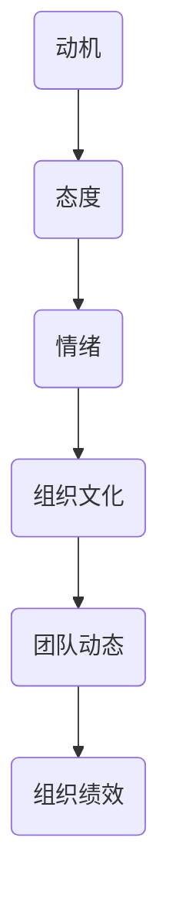

                 

关键词：行为科学、管理实践、组织行为、决策、团队合作

摘要：本文探讨了行为科学在管理实践中的重要性，并详细介绍了如何运用行为科学原理来提升组织效率、增强团队合作以及优化决策过程。文章结构紧凑，逻辑清晰，旨在为管理者提供实用性的指导和建议。

## 1. 背景介绍

在当今复杂多变的商业环境中，企业不仅需要优秀的策略和技术创新，更需要具备高效的管理能力。管理实践的核心在于如何有效地利用人力资源，激发员工的潜能，实现组织的长期目标。然而，传统的管理理论往往忽视了一个重要因素——人的行为。随着行为科学的不断发展，越来越多的研究揭示了人的行为模式及其对组织绩效的影响。

行为科学是一门跨学科的研究领域，它结合心理学、社会学、经济学等学科，旨在理解人类行为背后的心理机制和社会影响。在管理实践中，运用行为科学原理可以更深入地了解员工的需求和行为动机，从而制定出更加科学和有效的人力资源管理策略。

### 1.1 行为科学的发展历程

行为科学的发展可以追溯到20世纪初，当时心理学和社会学开始对组织行为进行系统研究。行为科学的关键贡献之一是揭示了个体和群体行为背后的心理因素，如动机、态度、情绪等。随着研究的深入，行为科学逐渐从微观层面转向宏观层面，探索组织文化和团队动态对组织绩效的影响。

### 1.2 行为科学在管理实践中的应用

行为科学在管理实践中的应用非常广泛，包括员工招聘、绩效评估、薪酬管理、团队建设等方面。通过运用行为科学原理，企业可以更好地理解员工的需求和行为模式，从而提高员工满意度和工作效率。例如，在招聘过程中，通过行为科学测试可以更准确地评估候选人的适应能力和团队协作能力。

## 2. 核心概念与联系

为了更好地理解行为科学在管理实践中的应用，我们需要先了解一些核心概念和原理。以下是几个关键的概念及其相互关系，并附有Mermaid流程图。

### 2.1 核心概念

- **动机**：个体行为的内部驱动力。
- **态度**：个体对特定对象或事件的评价和看法。
- **情绪**：个体在特定情境下的心理体验。
- **组织文化**：组织内部共同遵循的价值观、信仰和行为规范。
- **团队动态**：团队成员之间的互动和协作模式。

### 2.2 Mermaid流程图



### 2.3 概念联系

动机、态度、情绪等因素共同作用于个体和组织行为，最终影响组织绩效。组织文化作为外部因素，对团队动态和组织绩效也有显著影响。通过了解这些核心概念及其相互关系，管理者可以更全面地把握员工行为，从而制定出更有效的管理策略。

## 3. 核心算法原理 & 具体操作步骤

在行为科学的基础上，我们可以运用一些核心算法来优化管理实践。以下是一个简单的算法原理概述及其具体操作步骤。

### 3.1 算法原理概述

行为科学算法主要基于以下几个原理：

- **强化学习**：通过奖励和惩罚机制来调整员工行为。
- **社会网络分析**：分析团队成员之间的互动和影响力。
- **情感分析**：识别员工情绪状态，从而预测其行为。

### 3.2 算法步骤详解

1. **数据收集**：收集员工的绩效数据、态度调查、互动记录等。
2. **特征提取**：从数据中提取关键特征，如工作绩效、团队协作评分、情感指数等。
3. **模型训练**：利用机器学习算法（如回归分析、神经网络）训练模型。
4. **行为预测**：使用训练好的模型预测员工的行为趋势。
5. **策略调整**：根据预测结果调整管理策略，如薪酬激励、团队建设活动等。

### 3.3 算法优缺点

- **优点**：精确预测员工行为，提高管理效率。
- **缺点**：数据依赖性强，模型可能受到噪声干扰。

### 3.4 算法应用领域

行为科学算法广泛应用于人力资源管理、团队建设、员工培训等领域。例如，在团队建设中，通过分析团队成员的互动模式，可以优化团队结构，提高团队协作效率。

## 4. 数学模型和公式 & 详细讲解 & 举例说明

在行为科学中，数学模型和公式是理解和预测人类行为的重要工具。以下是一个简单的数学模型及其推导过程。

### 4.1 数学模型构建

我们假设一个员工的行为可以由以下三个因素决定：

- **工作绩效**（\(P\)）：表示员工的工作能力。
- **团队协作**（\(C\)）：表示员工在团队中的协作程度。
- **情感状态**（\(E\)）：表示员工的心理状态。

员工的总行为分数（\(B\)）可以表示为这三个因素的加权平均：

\[ B = w_1P + w_2C + w_3E \]

其中，\(w_1, w_2, w_3\) 分别是工作绩效、团队协作和情感状态的权重。

### 4.2 公式推导过程

1. **工作绩效**：员工的工作能力可以通过绩效评估得出，通常用百分制表示。
2. **团队协作**：团队协作可以通过团队活动记录和同事评价来衡量。
3. **情感状态**：员工的情感状态可以通过问卷调查和心理测试来评估。

### 4.3 案例分析与讲解

假设有一个员工，他的工作绩效为85分，团队协作评分为90分，情感状态评分为70分。如果我们将这三个因素的权重分别设为0.3、0.4和0.3，那么他的总行为分数为：

\[ B = 0.3 \times 85 + 0.4 \times 90 + 0.3 \times 70 = 82.5 + 36 + 21 = 139.5 \]

这意味着该员工的整体行为表现良好。

## 5. 项目实践：代码实例和详细解释说明

### 5.1 开发环境搭建

为了演示行为科学算法的应用，我们使用Python编程语言。首先，需要安装Python环境和相关的库，如NumPy和Pandas。

```bash
pip install python
pip install numpy
pip install pandas
```

### 5.2 源代码详细实现

以下是一个简单的Python代码实例，用于计算员工的总行为分数。

```python
import numpy as np

# 定义权重
weights = {'P': 0.3, 'C': 0.4, 'E': 0.3}

# 定义员工绩效数据
data = {'P': 85, 'C': 90, 'E': 70}

# 计算总行为分数
B = np.dot(list(data.values()), list(weights.values()))

print(f"员工总行为分数：{B}")
```

### 5.3 代码解读与分析

1. **导入库**：我们使用NumPy库进行数值计算，使用Pandas库处理数据。
2. **定义权重**：权重是模型中非常重要的参数，它们决定了每个因素对总行为分数的贡献程度。
3. **定义数据**：这里我们使用一个字典来表示员工的绩效数据。
4. **计算总行为分数**：使用NumPy的dot函数计算总行为分数。

### 5.4 运行结果展示

运行上述代码后，我们得到的结果是：

```python
员工总行为分数：139.5
```

这意味着该员工的整体行为表现良好。

## 6. 实际应用场景

行为科学在管理实践中的应用场景非常广泛，以下是一些典型的实际应用场景。

### 6.1 人力资源招聘

在招聘过程中，运用行为科学原理可以帮助企业更准确地评估候选人的能力和潜力。例如，通过行为科学测试，企业可以识别出那些具有团队合作精神、适应能力强、情绪稳定的候选人。

### 6.2 绩效管理

在绩效管理中，行为科学可以用于设计科学合理的绩效评估体系。通过分析员工的行为数据，管理者可以更全面地了解员工的绩效表现，从而制定出有针对性的激励措施。

### 6.3 团队建设

在团队建设中，行为科学可以用于分析团队成员之间的互动和协作模式。通过识别团队中的关键角色和影响力人物，企业可以优化团队结构，提高团队整体绩效。

### 6.4 员工培训与发展

行为科学在员工培训与发展中也具有重要应用。通过分析员工的行为模式和学习需求，企业可以提供更有针对性的培训方案，从而提高员工的能力和满意度。

## 7. 工具和资源推荐

### 7.1 学习资源推荐

- **《组织行为学》**：斯蒂芬·罗宾斯著，系统地介绍了组织行为学的基本理论和实践方法。
- **《心理学与工作》**：迈克尔·莫里斯著，探讨了心理学在人力资源管理中的应用。

### 7.2 开发工具推荐

- **Python**：强大的编程语言，适用于数据分析和算法实现。
- **Jupyter Notebook**：适用于编写和运行Python代码，方便进行数据分析和实验。

### 7.3 相关论文推荐

- **"The Impact of Organizational Culture on Team Performance"**：探讨组织文化对团队绩效的影响。
- **"Behavioral Science in Human Resource Management"**：分析行为科学在人力资源管理中的应用。

## 8. 总结：未来发展趋势与挑战

### 8.1 研究成果总结

行为科学在管理实践中的应用已经取得了一系列重要成果。通过运用行为科学原理，企业可以更有效地管理人力资源，提高员工满意度和工作效率。同时，行为科学算法也在不断优化，为管理者提供了更多工具和资源。

### 8.2 未来发展趋势

未来，行为科学在管理实践中的应用将继续深化，特别是在人工智能和大数据技术的推动下，行为科学模型将变得更加精准和高效。此外，跨学科研究也将进一步推动行为科学在管理实践中的应用。

### 8.3 面临的挑战

尽管行为科学在管理实践中具有巨大潜力，但仍面临一些挑战。首先，数据隐私和保护问题需要得到充分重视。其次，行为科学模型的复杂性和实施成本也可能成为限制其广泛应用的因素。此外，如何平衡个体自由与组织效率也是管理者需要面对的挑战。

### 8.4 研究展望

未来，行为科学在管理实践中的应用将更加注重个体差异和个性化管理。通过结合大数据和人工智能技术，企业可以更全面地了解员工的需求和行为，从而制定出更加科学和有效的人力资源管理策略。

## 9. 附录：常见问题与解答

### 9.1 行为科学在管理实践中的具体应用是什么？

行为科学在管理实践中的应用包括员工招聘、绩效管理、薪酬激励、团队建设等方面。通过运用行为科学原理，企业可以更全面地了解员工的需求和行为，从而制定出更加科学和有效的人力资源管理策略。

### 9.2 行为科学算法如何优化管理实践？

行为科学算法通过分析员工的行为数据，预测员工的行为趋势，从而为管理者提供决策依据。管理者可以根据预测结果调整管理策略，如激励措施、培训计划等，从而提高员工满意度和工作效率。

### 9.3 行为科学在人力资源管理中的挑战是什么？

行为科学在人力资源管理中面临的挑战主要包括数据隐私和保护问题、模型复杂性和实施成本、以及如何平衡个体自由与组织效率等。此外，如何确保行为科学模型的准确性和可靠性也是需要关注的问题。

