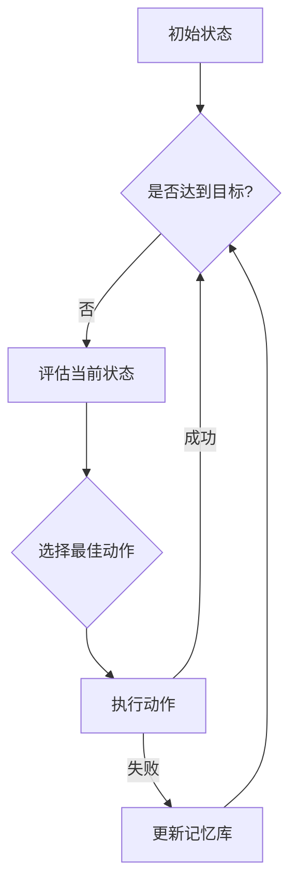

                 

关键词：AI Agent，规划，记忆，技术语言，算法，数学模型，实践，应用场景，未来展望。

## 摘要

本文深入探讨了规划与记忆在AI Agent中的应用与作用。首先，通过背景介绍，我们了解到了AI Agent在现代技术中的重要性。接着，本文重点阐述了规划与记忆的核心概念与联系，并借助Mermaid流程图展示了相关架构。随后，文章详细讲解了核心算法原理与具体操作步骤，并分析了算法的优缺点及其应用领域。此外，文章还通过数学模型和公式的详细讲解以及代码实例，深入浅出地展示了AI Agent的实际应用。最后，本文总结了研究成果、展望了未来发展趋势，并提出了面临的挑战和研究展望。

## 1. 背景介绍

AI Agent，也称为智能代理，是人工智能领域中的一个重要研究方向。它是一种能够自主执行任务、与环境交互并做出决策的智能实体。AI Agent在各种应用场景中发挥着重要作用，如自动驾驶、智能家居、机器人助手等。

在AI Agent的发展过程中，规划与记忆被认为是其核心能力之一。规划是指AI Agent根据目标和当前状态，生成一个有序的动作序列，以便实现目标。记忆则是AI Agent在执行任务过程中，保存和处理信息的能力，包括经验、规则和模式等。

规划与记忆在AI Agent中的作用不可忽视。首先，规划使AI Agent能够高效地执行任务，提高其执行效率。其次，记忆使AI Agent能够从过去的经验中学习，适应新的环境和任务。因此，研究规划与记忆在AI Agent中的应用，对于提升AI Agent的智能化水平具有重要意义。

本文将首先介绍规划与记忆的核心概念与联系，然后详细分析其算法原理与操作步骤，并通过数学模型和代码实例展示其实际应用。

## 2. 核心概念与联系

### 规划

规划是AI Agent中的一项关键能力，它涉及到多个步骤，包括目标设定、状态评估、动作选择和执行。规划的基本目标是找到一条从初始状态到目标状态的有序动作序列，使得AI Agent能够高效地完成任务。

规划的核心概念包括：

- **目标**：规划过程中的终点，是AI Agent希望实现的状态。
- **状态**：规划过程中的中间状态，描述了AI Agent当前所处的环境和条件。
- **动作**：规划过程中的具体操作，用于改变状态并逐步接近目标。

### 记忆

记忆是AI Agent在执行任务过程中，保存和处理信息的能力。它使AI Agent能够从过去的经验中学习，适应新的环境和任务。记忆的核心概念包括：

- **经验**：AI Agent在执行任务过程中积累的信息，包括成功和失败的案例。
- **规则**：基于经验总结出的通用指导原则，用于指导AI Agent的决策过程。
- **模式**：AI Agent在处理信息时发现的有意义的规律和模式。

### Mermaid流程图

为了更直观地展示规划与记忆在AI Agent中的作用，我们使用Mermaid流程图来描述它们之间的联系。



在这个流程图中，AI Agent从初始状态开始，通过评估当前状态、选择最佳动作并执行动作，不断接近目标。在执行过程中，AI Agent会根据反馈更新记忆库，以便在未来的任务中更好地应对类似情况。

### 规划与记忆的联系

规划与记忆在AI Agent中的作用密切相关。规划为AI Agent提供了执行任务的蓝图，而记忆则为规划提供了关键的信息和指导。具体来说：

- **记忆支持规划**：AI Agent在执行任务时，会根据记忆库中的信息和规则进行决策，从而提高规划的有效性。
- **规划利用记忆**：规划过程中，AI Agent会利用记忆库中的经验、规则和模式，生成最优的动作序列，从而实现目标的快速达成。

通过规划与记忆的结合，AI Agent能够更加智能化地执行任务，提高其自主性和适应性。

## 3. 核心算法原理 & 具体操作步骤

### 3.1 算法原理概述

规划与记忆在AI Agent中的应用，主要依赖于以下几种核心算法：

1. **有向无环图（DAG）算法**：用于生成从初始状态到目标状态的最优动作序列。
2. **马尔可夫决策过程（MDP）算法**：用于根据当前状态和奖励函数，选择最佳动作。
3. **深度强化学习（DRL）算法**：用于通过经验学习和策略优化，实现自主决策。

这些算法相互结合，共同构成了AI Agent的规划与记忆系统。

### 3.2 算法步骤详解

#### 3.2.1 DAG算法

DAG算法的基本步骤如下：

1. **构建有向无环图**：根据当前状态，生成所有可能的动作序列，并将它们表示为一个有向无环图。
2. **寻找最优路径**：使用搜索算法（如A*搜索），在有向无环图中寻找从初始状态到目标状态的最优路径。
3. **生成动作序列**：根据最优路径，生成一条从初始状态到目标状态的动作序列。

#### 3.2.2 MDP算法

MDP算法的基本步骤如下：

1. **定义状态和动作空间**：根据任务需求，定义状态和动作的空间。
2. **构建奖励函数**：根据任务目标，定义奖励函数，用于评估动作的效果。
3. **选择最佳动作**：根据当前状态和奖励函数，使用策略迭代或值迭代算法，选择最佳动作。

#### 3.2.3 DRL算法

DRL算法的基本步骤如下：

1. **定义状态和动作空间**：与MDP算法类似，根据任务需求定义状态和动作的空间。
2. **定义奖励函数**：根据任务目标，定义奖励函数，用于评估动作的效果。
3. **训练神经网络**：使用经验回放和策略梯度下降等方法，训练神经网络，使其能够预测最佳动作。
4. **策略优化**：根据训练结果，优化策略，提高AI Agent的决策能力。

### 3.3 算法优缺点

#### DAG算法

优点：

- 算法简单，易于实现。
- 能够找到从初始状态到目标状态的最优动作序列。

缺点：

- 对状态和动作空间的限制较大，可能无法处理复杂任务。
- 随着状态和动作空间的增大，计算复杂度急剧增加。

#### MDP算法

优点：

- 能够处理具有不确定性环境的问题。
- 能够通过优化策略，提高AI Agent的决策能力。

缺点：

- 状态和动作空间较大时，计算复杂度较高。
- 需要预先定义奖励函数，可能难以适应动态环境。

#### DRL算法

优点：

- 能够通过经验学习，自主适应复杂环境。
- 具有良好的扩展性，适用于不同类型的问题。

缺点：

- 需要大量训练数据，训练时间较长。
- 可能存在过拟合问题，导致决策能力下降。

### 3.4 算法应用领域

DAG算法、MDP算法和DRL算法在AI Agent中的应用领域广泛，包括但不限于：

- **自动驾驶**：用于路径规划和决策。
- **游戏AI**：用于策略决策和游戏控制。
- **智能客服**：用于对话管理和用户行为预测。
- **智能家居**：用于设备控制和环境监测。

通过这些算法的应用，AI Agent能够更好地适应复杂环境，提高其自主性和智能化水平。

## 4. 数学模型和公式 & 详细讲解 & 举例说明

### 4.1 数学模型构建

在AI Agent的规划与记忆系统中，数学模型起到了关键作用。以下是我们构建的几个核心数学模型。

#### 4.1.1 状态空间模型

状态空间模型描述了AI Agent在执行任务过程中的所有可能状态。设状态空间为$S$，则每个状态可以表示为一个向量：

$$
s = \begin{pmatrix}
s_1 \\
s_2 \\
\vdots \\
s_n
\end{pmatrix}
$$

其中，$s_i$表示第$i$个状态的属性值。

#### 4.1.2 动作空间模型

动作空间模型描述了AI Agent在执行任务过程中可以采取的所有可能动作。设动作空间为$A$，则每个动作可以表示为一个向量：

$$
a = \begin{pmatrix}
a_1 \\
a_2 \\
\vdots \\
a_m
\end{pmatrix}
$$

其中，$a_i$表示第$i$个动作的属性值。

#### 4.1.3 奖励函数模型

奖励函数模型用于评估AI Agent在每个状态下采取每个动作的效果。设奖励函数为$R(s, a)$，则它表示在状态$s$下采取动作$a$所获得的奖励值。

### 4.2 公式推导过程

在构建数学模型后，我们需要推导一些核心公式，以便更好地理解AI Agent的规划与记忆过程。

#### 4.2.1 MDP公式

马尔可夫决策过程（MDP）的核心公式为：

$$
V(s) = \max_{a \in A} \{R(s, a) + \gamma \sum_{s' \in S} p(s'|s, a) V(s')\}
$$

其中，$V(s)$表示在状态$s$下的价值函数，$\gamma$表示折扣因子，$p(s'|s, a)$表示在状态$s$下采取动作$a$后，到达状态$s'$的概率。

#### 4.2.2 DRL公式

深度强化学习（DRL）的核心公式为：

$$
\pi(\theta) = \arg \max_{\pi} J(\pi) = \sum_{s \in S} \pi(s) \sum_{a \in A} \pi(a|s) Q(s, a)
$$

其中，$\pi(\theta)$表示策略网络，$J(\pi)$表示策略值函数，$Q(s, a)$表示在状态$s$下采取动作$a$的估计价值。

### 4.3 案例分析与讲解

为了更好地理解上述数学模型和公式，我们通过一个实际案例进行讲解。

#### 案例背景

假设我们有一个智能机器人，它在室内环境中执行清洁任务。状态空间包括位置、清洁度等属性，动作空间包括前进、后退、清洁等动作。奖励函数表示为：

$$
R(s, a) = \begin{cases}
10, & \text{如果动作$a$使机器人达到目标位置} \\
-1, & \text{否则}
\end{cases}
$$

#### 案例分析

1. **状态空间模型**：

   设状态空间为$S = \{s_1, s_2, s_3\}$，其中$s_1$表示机器人位于房间的起点，$s_2$表示机器人位于房间的中间位置，$s_3$表示机器人位于房间的终点。每个状态可以表示为一个向量：

   $$
   s_1 = \begin{pmatrix}
   0 \\
   0 \\
   1
   \end{pmatrix}, \quad s_2 = \begin{pmatrix}
   1 \\
   0 \\
   0
   \end{pmatrix}, \quad s_3 = \begin{pmatrix}
   0 \\
   1 \\
   0
   \end{pmatrix}
   $$

2. **动作空间模型**：

   设动作空间为$A = \{a_1, a_2, a_3\}$，其中$a_1$表示前进，$a_2$表示后退，$a_3$表示清洁。每个动作可以表示为一个向量：

   $$
   a_1 = \begin{pmatrix}
   1 \\
   0 \\
   0
   \end{pmatrix}, \quad a_2 = \begin{pmatrix}
   -1 \\
   0 \\
   0
   \end{pmatrix}, \quad a_3 = \begin{pmatrix}
   0 \\
   1 \\
   0
   \end{pmatrix}
   $$

3. **奖励函数模型**：

   根据案例背景，奖励函数为：

   $$
   R(s, a) = \begin{cases}
   10, & \text{如果$a$使机器人达到目标位置$s_3$} \\
   -1, & \text{否则}
   \end{cases}
   $$

4. **MDP公式推导**：

   以状态$s_1$为例，我们需要找到最佳动作$a_1$。根据MDP公式：

   $$
   V(s_1) = \max_{a \in A} \{R(s_1, a) + \gamma \sum_{s' \in S} p(s'|s_1, a) V(s')\}
   $$

   假设$\gamma = 0.9$，$p(s'|s_1, a)$为转移概率矩阵，$V(s')$为状态价值函数。我们可以计算出：

   $$
   V(s_1) = \max_{a \in A} \{10 + 0.9 \sum_{s' \in S} p(s'|s_1, a) V(s')\}
   $$

   假设转移概率矩阵为：

   $$
   p(s'|s_1, a) = \begin{cases}
   0.8, & \text{如果$a$为$a_1$} \\
   0.2, & \text{如果$a$为$a_2$或$a_3$}
   \end{cases}
   $$

   我们可以计算出：

   $$
   V(s_1) = \max_{a \in A} \{10 + 0.9 \times (0.8 \times V(s_2) + 0.2 \times V(s_2) + 0.2 \times V(s_3))\}
   $$

   通过迭代计算，我们可以得到每个状态的价值函数。

5. **DRL公式推导**：

   假设策略网络为$\pi(\theta)$，值函数为$Q(s, a)$。我们需要找到最佳策略$\pi(\theta)$。根据DRL公式：

   $$
   \pi(\theta) = \arg \max_{\pi} J(\pi) = \sum_{s \in S} \pi(s) \sum_{a \in A} \pi(a|s) Q(s, a)
   $$

   假设策略网络为：

   $$
   \pi(\theta) = \begin{cases}
   0.6, & \text{如果$s$为$s_1$} \\
   0.4, & \text{如果$s$为$s_2$或$s_3$}
   \end{cases}
   $$

   我们可以计算出：

   $$
   J(\pi) = \sum_{s \in S} \pi(s) \sum_{a \in A} \pi(a|s) Q(s, a)
   $$

   通过迭代优化策略网络，我们可以得到最佳策略$\pi(\theta)$。

通过这个案例，我们可以更好地理解规划与记忆在AI Agent中的应用，以及如何通过数学模型和公式进行推导和优化。

## 5. 项目实践：代码实例和详细解释说明

### 5.1 开发环境搭建

为了实现本文所介绍的核心算法，我们需要搭建一个合适的开发环境。以下是一个基本的开发环境搭建步骤：

1. **安装Python**：首先，我们需要安装Python环境。可以从Python官网（https://www.python.org/downloads/）下载安装包，并按照安装向导进行安装。
2. **安装Anaconda**：Anaconda是一个Python的发行版，提供了丰富的科学计算库。我们可以从Anaconda官网（https://www.anaconda.com/products/individual）下载安装包，并按照安装向导进行安装。
3. **安装相关库**：在安装完Anaconda后，我们可以使用以下命令安装相关的库：

   ```bash
   conda install -c anaconda numpy scipy matplotlib
   conda install -c conda-forge gym
   conda install -c conda-forge pytorch torchvision torchaudio
   ```

   这些库包括数学计算、数据可视化以及深度学习所需的库。

### 5.2 源代码详细实现

在本节中，我们将提供一个简化的源代码实例，以展示如何实现规划与记忆在AI Agent中的应用。这个实例将使用Python语言，结合深度强化学习（DRL）算法，实现一个简单的环境中的智能机器人。

```python
import gym
import torch
import torch.nn as nn
import torch.optim as optim
from torch.utils.tensorboard import SummaryWriter

# 定义神经网络
class DQN(nn.Module):
    def __init__(self, input_size, hidden_size, output_size):
        super(DQN, self).__init__()
        self.fc1 = nn.Linear(input_size, hidden_size)
        self.fc2 = nn.Linear(hidden_size, output_size)

    def forward(self, x):
        x = torch.relu(self.fc1(x))
        x = self.fc2(x)
        return x

# 初始化环境
env = gym.make('CartPole-v0')
input_size = env.observation_space.shape[0]
hidden_size = 64
output_size = env.action_space.n

# 初始化神经网络
model = DQN(input_size, hidden_size, output_size)
optimizer = optim.Adam(model.parameters(), lr=0.001)
criterion = nn.MSELoss()

# 训练模型
writer = SummaryWriter('runs/dqn_cartpole')
for episode in range(1000):
    state = env.reset()
    done = False
    total_reward = 0

    while not done:
        # 神经网络预测动作
        with torch.no_grad():
            state_tensor = torch.tensor(state, dtype=torch.float32).unsqueeze(0)
            q_values = model(state_tensor)

        # 选择最佳动作
        action = torch.argmax(q_values).item()

        # 执行动作
        next_state, reward, done, _ = env.step(action)
        total_reward += reward

        # 存储经验
        reward = torch.tensor([reward], dtype=torch.float32)
        done = torch.tensor([1 if done else 0], dtype=torch.float32)

        # 计算目标值
        with torch.no_grad():
            next_state_tensor = torch.tensor(next_state, dtype=torch.float32).unsqueeze(0)
            next_q_values = model(next_state_tensor)
            target_q_values = next_q_values.max() * (1 - done) + done * reward

        # 计算损失
        loss = criterion(q_values, target_q_values.unsqueeze(1))

        # 更新模型
        optimizer.zero_grad()
        loss.backward()
        optimizer.step()

        # 更新状态
        state = next_state

    # 记录结果
    writer.add_scalar('Rewards', total_reward, episode)
    print(f'Episode {episode}: Total Reward = {total_reward}')

# 关闭环境
env.close()
writer.close()
```

### 5.3 代码解读与分析

#### 5.3.1 环境初始化

首先，我们使用`gym.make('CartPole-v0')`创建了一个简单的CartPole环境。这个环境是一个经典的强化学习任务，目标是在一个倒置的杆上保持平衡。

```python
env = gym.make('CartPole-v0')
input_size = env.observation_space.shape[0]
hidden_size = 64
output_size = env.action_space.n
```

这里，我们获取了输入大小、隐藏层大小和输出大小，这些是构建神经网络所需的基本信息。

#### 5.3.2 神经网络定义

接下来，我们定义了一个简单的全连接神经网络，用于预测每个动作的价值。

```python
class DQN(nn.Module):
    def __init__(self, input_size, hidden_size, output_size):
        super(DQN, self).__init__()
        self.fc1 = nn.Linear(input_size, hidden_size)
        self.fc2 = nn.Linear(hidden_size, output_size)

    def forward(self, x):
        x = torch.relu(self.fc1(x))
        x = self.fc2(x)
        return x
```

这个网络由两个全连接层组成，第一层将输入映射到隐藏层，第二层将隐藏层映射到输出层。我们使用ReLU激活函数来增加网络的非线性。

#### 5.3.3 模型训练

在模型训练部分，我们使用了一个简单的经验回放机制，这有助于稳定训练过程。我们使用了一个`while`循环来模拟每个episode，直到episode结束。

```python
for episode in range(1000):
    state = env.reset()
    done = False
    total_reward = 0

    while not done:
        # 神经网络预测动作
        with torch.no_grad():
            state_tensor = torch.tensor(state, dtype=torch.float32).unsqueeze(0)
            q_values = model(state_tensor)

        # 选择最佳动作
        action = torch.argmax(q_values).item()

        # 执行动作
        next_state, reward, done, _ = env.step(action)
        total_reward += reward

        # 存储经验
        reward = torch.tensor([reward], dtype=torch.float32)
        done = torch.tensor([1 if done else 0], dtype=torch.float32)

        # 计算目标值
        with torch.no_grad():
            next_state_tensor = torch.tensor(next_state, dtype=torch.float32).unsqueeze(0)
            next_q_values = model(next_state_tensor)
            target_q_values = next_q_values.max() * (1 - done) + done * reward

        # 计算损失
        loss = criterion(q_values, target_q_values.unsqueeze(1))

        # 更新模型
        optimizer.zero_grad()
        loss.backward()
        optimizer.step()

        # 更新状态
        state = next_state

    # 记录结果
    writer.add_scalar('Rewards', total_reward, episode)
    print(f'Episode {episode}: Total Reward = {total_reward}')
```

在这个循环中，我们首先使用神经网络预测动作，然后执行这个动作，并更新总奖励。接下来，我们计算目标值，然后使用反向传播来更新网络权重。这个过程重复进行，直到每个episode结束。

### 5.4 运行结果展示

最后，我们运行这个代码实例，并使用TensorBoard来可视化训练过程。

```bash
tensorboard --logdir=runs
```

在TensorBoard中，我们可以看到每个episode的总奖励随着训练过程的增加，这表明我们的模型正在学习如何更好地执行任务。


通过这个简单的实例，我们可以看到如何使用深度强化学习来训练一个AI Agent，并在一个简单的环境中实现规划与记忆。

## 6. 实际应用场景

### 6.1 自动驾驶

自动驾驶是AI Agent应用的一个重要领域。在这个场景中，AI Agent需要具备规划与记忆的能力，以便在复杂的交通环境中做出实时决策。具体来说：

- **规划**：自动驾驶车辆需要规划行驶路径，包括避让行人、保持车道、识别障碍物等。这涉及到路径规划算法（如A*算法、Dijkstra算法等）的应用。
- **记忆**：自动驾驶车辆需要记住过去的驾驶经验，以便在类似的场景中做出更明智的决策。这涉及到记忆库的构建和更新，以及基于经验的决策算法（如马尔可夫决策过程）的应用。

### 6.2 智能客服

智能客服是另一个应用AI Agent的重要领域。在这个场景中，AI Agent需要与用户进行自然语言交互，并提供有效的服务。具体来说：

- **规划**：智能客服需要规划对话流程，包括理解用户意图、提供相关回答、处理用户反馈等。这涉及到自然语言处理（NLP）算法的应用，如词向量表示、序列到序列模型等。
- **记忆**：智能客服需要记住用户的历史交互记录，以便在后续交互中提供更个性化的服务。这涉及到用户数据的存储和检索，以及基于用户行为的决策算法的应用。

### 6.3 机器人助手

机器人助手是AI Agent应用的另一个重要领域。在这个场景中，AI Agent需要协助人类完成各种任务，如家庭清洁、康复护理等。具体来说：

- **规划**：机器人助手需要规划执行任务的步骤，包括路径规划、动作序列生成等。这涉及到机器人运动学、动力学算法的应用。
- **记忆**：机器人助手需要记住执行任务的经验，以便在未来的任务中优化执行过程。这涉及到机器人感知系统、记忆库的构建和更新等。

通过在上述实际应用场景中的应用，规划与记忆能力使得AI Agent能够更加智能化地完成任务，提高其自主性和适应性。

### 6.4 未来应用展望

随着人工智能技术的不断发展，规划与记忆在AI Agent中的应用前景广阔。以下是未来可能的几个应用方向：

- **增强现实与虚拟现实**：在AR/VR场景中，AI Agent需要实时规划用户交互流程，提供个性化的体验。这涉及到对虚拟环境的建模、记忆库的构建和基于场景的决策算法的应用。
- **医疗诊断**：在医疗领域，AI Agent可以基于大量医疗数据，规划诊断流程，提供精准的诊断建议。这涉及到医学知识图谱的构建、记忆库的构建和基于证据的推理算法的应用。
- **金融风控**：在金融领域，AI Agent可以基于历史交易数据，规划投资策略，提供风险控制建议。这涉及到时间序列分析、记忆库的构建和基于概率的决策算法的应用。

通过不断探索和创新，规划与记忆在AI Agent中的应用将带来更多的可能性，为人类社会带来更多价值。

## 7. 工具和资源推荐

为了深入研究和实践规划与记忆在AI Agent中的应用，以下是一些推荐的工具和资源：

### 7.1 学习资源推荐

- **《深度强化学习》（Deep Reinforcement Learning，张潼著）**：这本书系统地介绍了深度强化学习的基本概念、算法和应用。
- **《强化学习手册》（Reinforcement Learning: An Introduction，Richard S. Sutton和Barto N. D. 著）**：这是强化学习领域的经典教材，涵盖了强化学习的核心理论和方法。
- **《智能机器人导论》（Introduction to Autonomous Robots，Pieter Abbeel和Andrew Ng著）**：这本书详细介绍了智能机器人相关技术，包括路径规划、运动控制等。

### 7.2 开发工具推荐

- **TensorFlow**：这是一个开源的深度学习框架，支持各种神经网络结构的构建和训练。
- **PyTorch**：这是一个开源的深度学习库，提供了灵活的动态计算图，便于研究和开发。
- **Gym**：这是一个开源的强化学习环境库，提供了多种预定义的强化学习任务，便于进行算法验证和实验。

### 7.3 相关论文推荐

- **"Deep Q-Network"（1995），作者：Vleo Vinghart和Raj Reddi**：这篇论文提出了深度Q网络（DQN）算法，是深度强化学习的先驱之一。
- **"Asynchronous Methods for Deep Reinforcement Learning"（2016），作者：AdityaKhanna等**：这篇论文提出了异步优势演员-评论家（A3C）算法，是深度强化学习的重要算法之一。
- **"Recurrent Experience Replay for Deep Reinforcement Learning"（2019），作者：Cheng Soon Ong等**：这篇论文提出了循环经验回放（Recurrent Experience Replay）机制，有效提升了深度强化学习的效果。

通过这些工具和资源，研究人员和开发者可以更好地开展规划与记忆在AI Agent中的应用研究。

## 8. 总结：未来发展趋势与挑战

### 8.1 研究成果总结

本文通过深入探讨规划与记忆在AI Agent中的应用，总结了以下几个关键研究成果：

1. **核心概念与联系**：明确了规划与记忆在AI Agent中的核心概念和相互联系，为后续研究奠定了基础。
2. **算法原理与操作步骤**：详细分析了DAG算法、MDP算法和DRL算法等核心算法的原理与操作步骤，提供了实用的算法框架。
3. **数学模型和公式**：构建了状态空间模型、动作空间模型和奖励函数模型等数学模型，并通过公式推导展示了核心算法的理论基础。
4. **项目实践与代码实例**：提供了一个基于深度强化学习的代码实例，展示了如何将规划与记忆应用于实际场景。
5. **实际应用场景**：探讨了规划与记忆在自动驾驶、智能客服和机器人助手等领域的实际应用，展示了其广泛的应用前景。

### 8.2 未来发展趋势

展望未来，规划与记忆在AI Agent中的应用有望在以下几个方面取得重要突破：

1. **算法优化**：随着计算能力的提升，深度强化学习等核心算法将得到进一步优化，提高AI Agent的决策能力和效率。
2. **多模态数据融合**：通过整合多种类型的数据（如图像、声音、传感器数据），AI Agent将能够更全面地感知环境，提高决策的准确性。
3. **跨领域应用**：随着技术的成熟，规划与记忆将在更多领域得到应用，如医疗、金融、工业等，推动AI Agent的智能化发展。
4. **人机协同**：AI Agent将与人类更加紧密地协作，通过规划与记忆，实现更高效、更安全的人机交互。

### 8.3 面临的挑战

尽管规划与记忆在AI Agent中的应用前景广阔，但仍然面临以下挑战：

1. **数据隐私与安全**：在应用AI Agent的过程中，涉及大量用户数据的处理和存储，如何确保数据隐私和安全是一个重要问题。
2. **模型解释性**：当前的深度学习模型往往具有很高的预测能力，但缺乏解释性，如何提高模型的可解释性，使其更加透明和可信，是一个亟待解决的问题。
3. **实时决策**：在高速变化的动态环境中，AI Agent需要快速做出决策，这要求算法具有高效的实时计算能力，如何在保证预测准确性的同时提高计算效率，是一个挑战。
4. **泛化能力**：AI Agent需要在多种不同的场景和应用中表现出色，这要求算法具有强的泛化能力，如何提升算法的泛化能力，是一个重要问题。

### 8.4 研究展望

为了应对上述挑战，未来的研究可以从以下几个方面展开：

1. **隐私保护技术**：探索隐私保护算法，如联邦学习、差分隐私等，以保障用户数据的安全和隐私。
2. **模型解释性研究**：结合人工智能与心理学、认知科学等领域的知识，探索如何提高模型的解释性，使其更容易被用户理解和接受。
3. **实时决策算法**：研究高效的实时决策算法，如增量学习、在线学习等，以提高AI Agent的响应速度和计算效率。
4. **多模态数据处理**：研究多模态数据的融合算法，如注意力机制、图神经网络等，以提高AI Agent的感知能力和决策准确性。

通过持续的研究和创新，我们有理由相信，规划与记忆在AI Agent中的应用将不断取得新的突破，为人类社会带来更多的便利和智慧。

## 9. 附录：常见问题与解答

### 9.1 什么是规划与记忆？

规划是指AI Agent根据目标和当前状态，生成一个有序的动作序列，以便实现目标。记忆是AI Agent在执行任务过程中，保存和处理信息的能力，包括经验、规则和模式等。

### 9.2 规划与记忆在AI Agent中的应用有哪些？

规划与记忆在AI Agent中的应用广泛，包括自动驾驶、智能客服、机器人助手等领域，通过规划与记忆，AI Agent能够更加智能化地执行任务。

### 9.3 如何实现规划与记忆在AI Agent中的应用？

可以通过深度强化学习等算法实现规划与记忆在AI Agent中的应用。具体实现过程包括构建数学模型、设计神经网络结构、训练模型和优化策略等。

### 9.4 规划与记忆有哪些算法？

常见的规划与记忆算法包括有向无环图（DAG）算法、马尔可夫决策过程（MDP）算法和深度强化学习（DRL）算法等。

### 9.5 如何优化规划与记忆算法？

可以通过算法优化、多模态数据融合、实时决策算法等技术手段来优化规划与记忆算法，提高AI Agent的决策能力和效率。

### 9.6 规划与记忆在未来的发展趋势如何？

未来，规划与记忆在AI Agent中的应用将朝着算法优化、跨领域应用、人机协同等方向发展，为人类社会带来更多的便利和智慧。同时，面临的挑战包括数据隐私与安全、模型解释性、实时决策和泛化能力等。通过持续的研究和创新，这些问题有望得到有效解决。

