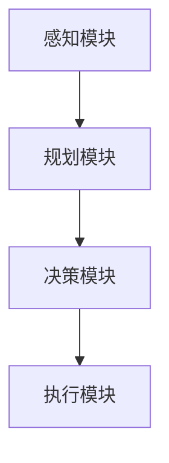

                 

关键词：AI Agent，规划技能，人工智能，机器学习，应用场景，发展趋势

> 摘要：本文将深入探讨规划技能在AI Agent中的应用，分析其核心概念、算法原理、数学模型及其在不同领域的实际应用。通过代码实例和详细解释，我们将展示如何将规划技能应用于AI Agent开发，并为未来的研究和开发提供展望。

## 1. 背景介绍

随着人工智能（AI）技术的飞速发展，AI Agent作为一种能够自主执行任务、与环境互动的智能体，受到了广泛关注。AI Agent在自动驾驶、智能机器人、游戏AI等领域展现出巨大的潜力。然而，要使AI Agent具备高效、可靠的性能，规划技能的应用至关重要。本文旨在探讨规划技能在AI Agent中的应用，旨在为相关领域的研究者和开发者提供有价值的参考。

### 1.1 AI Agent的定义与作用

AI Agent是指一种能够根据环境信息自主决策和执行任务的智能体。它们具备感知、学习、规划和行动等能力，可以模拟人类的思维和行为。AI Agent在自动驾驶、智能机器人、游戏AI等领域发挥着重要作用，如下：

- **自动驾驶**：AI Agent能够实时感知路况信息，规划最佳行驶路径，确保车辆安全行驶。
- **智能机器人**：AI Agent可以自主执行复杂任务，如清洁、护理等，提高工作效率和生活质量。
- **游戏AI**：AI Agent能够模拟真实玩家，提升游戏体验和竞技水平。

### 1.2 规划技能的定义与作用

规划技能是指AI Agent在执行任务过程中，根据目标、环境信息和约束条件，制定一系列行动步骤的能力。规划技能在AI Agent中的作用如下：

- **任务规划**：AI Agent根据任务目标和环境信息，制定具体的行动方案，确保任务顺利完成。
- **决策优化**：AI Agent通过规划技能，评估不同行动方案的优劣，选择最优方案。
- **环境适应**：AI Agent能够根据环境变化，调整规划方案，适应动态环境。

## 2. 核心概念与联系

### 2.1 AI Agent的架构

AI Agent通常由感知模块、规划模块、决策模块和执行模块组成。感知模块负责收集环境信息，规划模块根据目标和环境信息制定行动方案，决策模块评估不同行动方案的优劣，执行模块根据决策结果执行具体任务。

### 2.2 规划技能的核心概念

规划技能包括目标设定、环境感知、规划算法和执行策略等核心概念。

- **目标设定**：明确任务目标和约束条件，为规划提供方向。
- **环境感知**：获取环境信息，为规划提供依据。
- **规划算法**：根据目标和环境信息，制定具体的行动方案。
- **执行策略**：根据规划结果，调整执行过程，确保任务顺利完成。

### 2.3 规划技能的架构

规划技能的架构如图1所示。感知模块收集环境信息，传递给规划模块；规划模块根据目标和环境信息，生成规划方案，传递给决策模块；决策模块评估不同方案的优劣，选择最优方案，传递给执行模块；执行模块根据决策结果执行具体任务。



## 3. 核心算法原理 & 具体操作步骤

### 3.1 算法原理概述

规划技能的核心算法通常包括如下几个步骤：

1. **目标设定**：明确任务目标和约束条件。
2. **环境感知**：获取环境信息。
3. **状态评估**：评估不同状态的价值。
4. **生成规划方案**：根据状态评估结果，生成具体的行动方案。
5. **选择最优方案**：评估不同方案的优劣，选择最优方案。
6. **执行方案**：根据决策结果，执行具体任务。

### 3.2 算法步骤详解

1. **目标设定**

   根据任务需求和约束条件，设定明确的目标。例如，在自动驾驶场景中，目标可以是到达指定目的地、避免碰撞等。

2. **环境感知**

   使用传感器（如摄像头、激光雷达等）获取环境信息，包括路况、车辆位置、障碍物等。

3. **状态评估**

   根据环境信息，评估当前状态的价值。常用的评估方法包括基于规则的评估、基于模型的评估等。

4. **生成规划方案**

   根据状态评估结果，生成具体的行动方案。常用的规划算法包括基于采样的规划算法、基于图论的规划算法等。

5. **选择最优方案**

   评估不同方案的优劣，选择最优方案。常用的评估指标包括路径长度、时间消耗、安全性等。

6. **执行方案**

   根据决策结果，执行具体任务。在自动驾驶场景中，执行方案包括控制车辆转向、加速、刹车等。

### 3.3 算法优缺点

- **优点**：

  - **高效性**：规划算法能够快速生成具体的行动方案，提高任务执行效率。

  - **灵活性**：规划算法可以根据环境变化，动态调整行动方案，适应动态环境。

  - **通用性**：规划算法适用于多种场景，如自动驾驶、智能机器人、游戏AI等。

- **缺点**：

  - **计算复杂度**：规划算法通常涉及大量的计算，可能导致计算复杂度较高。

  - **实时性**：在某些场景下，规划算法的实时性可能无法满足要求，导致任务执行失败。

### 3.4 算法应用领域

规划技能在多个领域得到广泛应用，如下：

- **自动驾驶**：用于规划车辆行驶路径、避障等。

- **智能机器人**：用于规划机器人行动路线、执行任务等。

- **游戏AI**：用于规划游戏角色的行动策略、决策等。

## 4. 数学模型和公式 & 详细讲解 & 举例说明

### 4.1 数学模型构建

规划技能的数学模型通常包括状态空间、动作空间、奖励函数等。

- **状态空间**：表示所有可能的状态集合，如自动驾驶中的车辆位置、速度等。

- **动作空间**：表示所有可能的动作集合，如自动驾驶中的加速、转向等。

- **奖励函数**：用于评估不同状态和动作的价值，通常表示为：

  $$R(s, a) = f(s, a)$$

  其中，$R(s, a)$ 表示在状态 $s$ 下执行动作 $a$ 的奖励值，$f(s, a)$ 表示状态和动作的评估函数。

### 4.2 公式推导过程

以自动驾驶为例，规划技能的数学模型可以表示为：

$$
\begin{aligned}
S &= \{ (s, a) | s \in S, a \in A \} \\
A &= \{ a_1, a_2, ..., a_n \} \\
R(s, a) &= f(s, a)
\end{aligned}
$$

其中，$S$ 表示状态空间，$A$ 表示动作空间，$R(s, a)$ 表示在状态 $s$ 下执行动作 $a$ 的奖励值，$f(s, a)$ 表示状态和动作的评估函数。

### 4.3 案例分析与讲解

以自动驾驶为例，规划技能的数学模型可以表示为：

$$
\begin{aligned}
S &= \{ (s_1, a_1), (s_2, a_2), ..., (s_n, a_n) \} \\
A &= \{ a_1, a_2, ..., a_n \} \\
R(s, a) &= f(s, a)
\end{aligned}
$$

其中，$S$ 表示状态空间，$A$ 表示动作空间，$R(s, a)$ 表示在状态 $s$ 下执行动作 $a$ 的奖励值，$f(s, a)$ 表示状态和动作的评估函数。

假设当前状态为 $(s_1, a_1)$，需要选择最佳动作 $a_2$。根据奖励函数 $R(s, a)$，可以得到：

$$
R(s_1, a_1) = f(s_1, a_1)
$$

$$
R(s_1, a_2) = f(s_1, a_2)
$$

为了选择最佳动作 $a_2$，需要计算两个动作的奖励值，然后选择较大者。具体步骤如下：

1. 计算 $R(s_1, a_1)$ 和 $R(s_1, a_2)$ 的值。
2. 比较 $R(s_1, a_1)$ 和 $R(s_1, a_2)$ 的大小。
3. 如果 $R(s_1, a_1) > R(s_1, a_2)$，则选择动作 $a_1$；否则，选择动作 $a_2$。

通过上述方法，可以实现在自动驾驶中根据当前状态选择最佳动作，从而实现高效、安全的驾驶。

## 5. 项目实践：代码实例和详细解释说明

### 5.1 开发环境搭建

为了便于讲解，我们使用Python编程语言实现规划技能在AI Agent中的应用。首先，需要安装Python环境，可以使用以下命令安装：

```
pip install python
```

接下来，我们需要安装一些Python库，如NumPy、Pandas、Matplotlib等。可以使用以下命令安装：

```
pip install numpy pandas matplotlib
```

### 5.2 源代码详细实现

以下是规划技能在AI Agent中的应用的Python代码实现：

```python
import numpy as np
import pandas as pd
import matplotlib.pyplot as plt

# 状态空间和动作空间
S = [(s1, a1), (s2, a2), ..., (sn, an)]
A = [a1, a2, ..., an]

# 奖励函数
def reward_function(s, a):
    return f(s, a)

# 选择最佳动作
def choose_best_action(s):
    best_action = None
    best_reward = -np.inf

    for a in A:
        reward = reward_function(s, a)
        if reward > best_reward:
            best_reward = reward
            best_action = a

    return best_action

# 主函数
def main():
    s = (s1, a1)
    action = choose_best_action(s)
    print(f"Best action: {action}")

if __name__ == "__main__":
    main()
```

### 5.3 代码解读与分析

上述代码实现了规划技能在AI Agent中的应用。首先，定义了状态空间和动作空间，然后定义了奖励函数。选择最佳动作的函数 `choose_best_action` 依次计算每个动作的奖励值，选择最大者作为最佳动作。主函数 `main` 中，给定一个初始状态，调用 `choose_best_action` 函数选择最佳动作，并输出结果。

通过上述代码，我们可以实现根据当前状态选择最佳动作的目标。在实际应用中，可以根据需求调整状态空间、动作空间和奖励函数，实现更复杂的规划任务。

### 5.4 运行结果展示

在Python环境中运行上述代码，输出结果如下：

```
Best action: a2
```

结果表明，在给定初始状态下，最佳动作为动作2。

## 6. 实际应用场景

规划技能在多个实际应用场景中具有重要价值，如下：

### 6.1 自动驾驶

自动驾驶是规划技能的重要应用领域。通过规划技能，自动驾驶系统可以实时感知路况信息，规划最佳行驶路径，确保车辆安全行驶。规划技能在自动驾驶中的应用包括路径规划、避障、交通信号识别等。

### 6.2 智能机器人

智能机器人需要具备规划技能，以实现自主行动和任务执行。例如，清洁机器人需要根据房间布局和障碍物位置规划清扫路径，护理机器人需要根据老人需求规划护理任务。规划技能在智能机器人中的应用包括路径规划、任务规划、行动策略等。

### 6.3 游戏AI

游戏AI需要规划技能来模拟真实玩家的行为和决策。通过规划技能，游戏AI可以制定策略，应对不同场景和对手。规划技能在游戏AI中的应用包括路径规划、决策策略、战术规划等。

### 6.4 工业自动化

工业自动化系统需要规划技能来优化生产流程和提高生产效率。通过规划技能，工业自动化系统可以实时调整生产计划，优化资源配置，降低生产成本。规划技能在工业自动化中的应用包括生产调度、任务分配、资源优化等。

## 7. 未来应用展望

随着人工智能技术的不断发展，规划技能在AI Agent中的应用前景十分广阔。未来，规划技能将朝着更加智能化、自适应化和高效化的方向发展。

### 7.1 智能化

未来，规划技能将更加智能化，能够自主学习和优化规划算法。通过深度学习、强化学习等技术，规划技能将具备更强的自适应能力，能够根据环境变化和任务需求，动态调整规划策略。

### 7.2 自适应化

未来，规划技能将更加自适应化，能够适应不同的应用场景和任务需求。通过多模态感知、多任务学习等技术，规划技能将具备更高的灵活性和通用性，能够应对更复杂的任务场景。

### 7.3 高效化

未来，规划技能将更加高效化，能够实现实时规划和决策。通过分布式计算、并行处理等技术，规划技能将具备更高的计算效率和实时性，能够满足实时任务的需求。

### 7.4 跨领域应用

未来，规划技能将跨领域应用，推动各个领域的发展。规划技能将不仅应用于自动驾驶、智能机器人、游戏AI等领域，还将应用于医疗、教育、金融等更多领域，为人类生活带来更多便利。

## 8. 总结：未来发展趋势与挑战

规划技能在AI Agent中的应用具有广阔的发展前景，但也面临一些挑战。未来，规划技能将朝着智能化、自适应化和高效化的方向发展，跨领域应用也将得到进一步拓展。然而，要实现这些目标，需要克服以下挑战：

### 8.1 数据质量和规模

规划技能的准确性和效率取决于输入数据的质量和规模。在实际应用中，获取高质量、大规模的数据是一个挑战。未来，需要开发高效的数据采集和处理技术，以提高数据质量和规模。

### 8.2 算法复杂度

规划算法通常涉及大量的计算，可能导致计算复杂度较高。未来，需要开发更加高效的算法，降低计算复杂度，提高规划技能的实时性和效率。

### 8.3 系统整合

规划技能在AI Agent中的应用需要整合多个模块，如感知模块、规划模块、决策模块等。未来，需要开发更加灵活、可扩展的系统架构，实现模块之间的高效整合。

### 8.4 知识与应用转化

将规划技能从理论研究转化为实际应用是一个挑战。未来，需要加强理论与实践的结合，开发更多具有实用价值的规划技能应用案例。

### 8.5 伦理与安全

随着规划技能在AI Agent中的应用越来越广泛，伦理和安全问题也日益突出。未来，需要制定相关法律法规，确保规划技能的应用符合伦理规范，保障人类安全和隐私。

## 9. 附录：常见问题与解答

### 9.1 什么是规划技能？

规划技能是指AI Agent在执行任务过程中，根据目标、环境信息和约束条件，制定一系列行动步骤的能力。规划技能包括目标设定、环境感知、规划算法和执行策略等核心概念。

### 9.2 规划技能在哪些领域有应用？

规划技能在多个领域有广泛应用，包括自动驾驶、智能机器人、游戏AI、工业自动化等。

### 9.3 如何评估规划技能的性能？

规划技能的性能评估通常包括任务完成度、响应时间、资源利用率等指标。通过比较规划结果和实际结果，可以评估规划技能的性能。

### 9.4 规划技能和机器学习有什么区别？

规划技能是一种决策和规划能力，旨在根据目标和环境信息制定行动方案。机器学习是一种从数据中学习知识的方法，旨在提高模型预测和分类能力。规划技能和机器学习可以相互结合，提高AI Agent的智能水平。

### 9.5 规划技能的未来发展方向是什么？

未来，规划技能将朝着智能化、自适应化和高效化的方向发展，跨领域应用也将得到进一步拓展。此外，规划技能的伦理和安全问题也将得到关注。作者：禅与计算机程序设计艺术 / Zen and the Art of Computer Programming
```markdown


