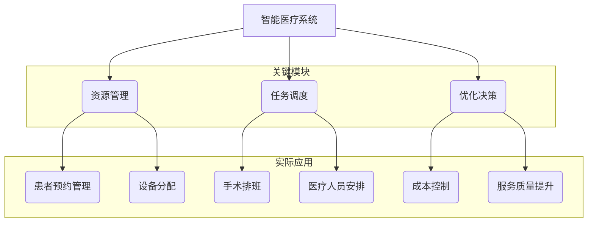

                 

### 1. 背景介绍

随着科技的飞速发展，医疗行业也迎来了前所未有的变革。尤其是人工智能（AI）技术的迅速崛起，使得医疗领域的智能化进程不断加快。智能医疗系统作为AI技术在实际应用中的重要领域，正逐渐改变传统的医疗模式，提高医疗服务的质量和效率。然而，在智能医疗系统的开发和实施过程中，如何实现高效的资源管理和任务调度成为了一个关键问题。

规划机制，作为人工智能领域的一个重要概念，其核心在于通过预定的策略和算法，对系统中的各种资源进行合理配置，确保系统能够在给定条件下达到最优性能。在智能医疗系统中，规划机制的应用尤为关键，它不仅能够提高医疗资源的利用率，还能优化患者的就医体验，提升医疗服务的整体水平。

本文将探讨规划机制在智能医疗系统中的应用，旨在梳理现有技术，分析其核心原理，并探讨未来发展趋势。文章结构如下：

- **1. 背景介绍**：简要介绍智能医疗系统的发展背景以及规划机制的重要性。
- **2. 核心概念与联系**：详细阐述规划机制的基本概念，并给出一个Mermaid流程图，展示其在智能医疗系统中的关联。
- **3. 核心算法原理 & 具体操作步骤**：介绍规划机制中的核心算法，包括其原理、步骤、优缺点以及应用领域。
- **4. 数学模型和公式 & 详细讲解 & 举例说明**：构建数学模型，推导相关公式，并通过案例进行分析。
- **5. 项目实践：代码实例和详细解释说明**：提供一个实际项目的代码实例，并进行详细解释。
- **6. 实际应用场景**：探讨规划机制在不同医疗场景中的实际应用。
- **7. 工具和资源推荐**：推荐相关学习资源和开发工具。
- **8. 总结：未来发展趋势与挑战**：总结研究成果，探讨未来发展趋势和面临的挑战。
- **9. 附录：常见问题与解答**：针对读者可能遇到的问题进行解答。

### 2. 核心概念与联系

规划机制（Planning Mechanism）是指通过一系列算法和策略，对系统中的资源进行合理分配和调度，以实现系统性能最优化的方法。在智能医疗系统中，规划机制的作用尤为重要，它涉及资源分配、任务调度、优化决策等多个方面。

下面，我们将使用Mermaid流程图来展示规划机制在智能医疗系统中的关联。Mermaid流程图是一种基于文本的图形描述语言，可以直观地展示系统的流程和逻辑关系。



在上述流程图中，智能医疗系统的核心模块包括资源管理、任务调度和优化决策。这些模块共同作用，实现了系统的整体优化。具体来说：

- **资源管理**：包括患者预约管理、设备分配等，确保医疗资源的高效利用。
- **任务调度**：涉及手术排班、医疗人员安排等，以最大限度地提高医疗服务的效率。
- **优化决策**：通过成本控制、服务质量提升等措施，实现系统的最优性能。

通过规划机制，智能医疗系统能够在复杂的环境中，对各种资源进行合理配置，从而提高整体效率和服务质量。

### 3. 核心算法原理 & 具体操作步骤

在规划机制中，核心算法的原理和具体操作步骤是实现系统优化的重要保障。以下将详细介绍几种常见的规划算法，包括其原理、步骤、优缺点以及应用领域。

#### 3.1 算法原理概述

**遗传算法（Genetic Algorithm）**：

遗传算法是一种基于自然选择和遗传机制的优化算法，通过模拟生物进化过程，逐步寻找最优解。其主要步骤包括：

1. **初始化种群**：随机生成一组初始解。
2. **适应度评估**：计算每个解的适应度值，以评估其优劣。
3. **选择**：根据适应度值，选择优秀的个体进行繁殖。
4. **交叉**：通过交叉操作，生成新的后代个体。
5. **变异**：对部分个体进行变异，增加种群的多样性。
6. **更新种群**：用新产生的个体替换旧的种群。
7. **循环**：重复上述步骤，直到满足终止条件。

**蚁群算法（Ant Colony Optimization）**：

蚁群算法模拟蚂蚁寻找食物的过程，通过信息素强度引导蚁群寻找最优路径。其主要步骤包括：

1. **初始化信息素**：在所有路径上初始化信息素浓度。
2. **蚁群搜索**：每个蚂蚁从起点出发，选择下一个城市的规则是基于信息素浓度和随机概率。
3. **信息素更新**：每完成一次循环，对路径上的信息素进行更新。
4. **循环**：重复上述步骤，直到找到最优解或达到循环次数。

**模拟退火算法（Simulated Annealing）**：

模拟退火算法模拟固体退火过程，通过接受劣解来跳出局部最优，从而寻找全局最优解。其主要步骤包括：

1. **初始化温度**：设定初始温度。
2. **当前解评估**：评估当前解的适应度。
3. **选择新解**：在当前解的邻域内随机选择一个新解。
4. **适应度评估**：评估新解的适应度。
5. **接受概率计算**：根据当前解和新解的适应度差，计算接受新解的概率。
6. **更新当前解**：根据接受概率，更新当前解。
7. **温度更新**：按照特定规则降低温度。
8. **循环**：重复上述步骤，直到满足终止条件。

#### 3.2 算法步骤详解

**遗传算法步骤详解**：

1. **初始化种群**：随机生成一组初始解，如染色体编码的数值范围在[0, 1]之间。
2. **适应度评估**：计算每个解的适应度值，通常使用目标函数进行评估，如最小化成本或最大化收益。
3. **选择**：根据适应度值，使用轮盘赌方法选择父母个体。
4. **交叉**：对选择的父母个体进行交叉操作，生成新的后代个体。
5. **变异**：对后代个体进行变异操作，如随机改变某个基因的值。
6. **更新种群**：用新产生的个体替换旧的种群。
7. **循环**：重复上述步骤，直到满足终止条件，如达到最大迭代次数或适应度值达到预设阈值。

**蚁群算法步骤详解**：

1. **初始化信息素**：在所有路径上初始化信息素浓度，通常设为一个较小的常数。
2. **蚁群搜索**：每个蚂蚁从起点出发，根据信息素浓度和随机概率选择下一个城市。
3. **信息素更新**：每完成一次循环，对所有路径上的信息素进行更新，增加走过次数多的路径的信息素浓度。
4. **循环**：重复上述步骤，直到找到最优解或达到循环次数。

**模拟退火算法步骤详解**：

1. **初始化温度**：设定初始温度，通常设为一个较大的值。
2. **当前解评估**：评估当前解的适应度。
3. **选择新解**：在当前解的邻域内随机选择一个新解。
4. **适应度评估**：评估新解的适应度。
5. **接受概率计算**：根据当前解和新解的适应度差，计算接受新解的概率，如使用 Boltzmann 分布。
6. **更新当前解**：根据接受概率，更新当前解。
7. **温度更新**：按照特定规则降低温度，如线性降温。
8. **循环**：重复上述步骤，直到满足终止条件。

#### 3.3 算法优缺点

**遗传算法**：

- **优点**：具有较强的全局搜索能力，能够跳出局部最优。
- **缺点**：计算复杂度较高，需要较大的计算资源和时间。

**蚁群算法**：

- **优点**：适用于路径规划问题，能够高效地找到近似最优解。
- **缺点**：对于大规模问题，计算复杂度较高，可能需要较长的时间。

**模拟退火算法**：

- **优点**：能够跳出局部最优，具有较强的全局搜索能力。
- **缺点**：对于大规模问题，可能需要较长时间才能收敛。

#### 3.4 算法应用领域

**遗传算法**：

- **应用领域**：优化问题，如调度问题、资源分配问题、路径规划问题等。

**蚁群算法**：

- **应用领域**：路径规划问题，如物流配送、旅行商问题、交通流量优化等。

**模拟退火算法**：

- **应用领域**：组合优化问题，如旅行商问题、车辆路径问题、作业调度问题等。

### 4. 数学模型和公式 & 详细讲解 & 举例说明

在规划机制中，数学模型和公式的构建是实现算法和策略优化的重要基础。以下将详细讲解规划机制中的数学模型和公式，并通过具体案例进行分析。

#### 4.1 数学模型构建

**遗传算法中的适应度函数**：

适应度函数是遗传算法中评估个体优劣的重要指标。一个常见的适应度函数为：

$$
f(x) = \frac{1}{1 + e^{-\beta \cdot (x - \mu)}}
$$

其中，$x$ 为个体的基因值，$\mu$ 为平均基因值，$\beta$ 为调节参数，控制适应度函数的陡峭程度。

**蚁群算法中的信息素更新公式**：

信息素更新公式用于调整路径上的信息素浓度，其形式为：

$$
\tau_{ij}(t) = (1 - \rho) \tau_{ij}(t-1) + \Delta \tau_{ij}(t)
$$

其中，$\tau_{ij}(t)$ 为路径 $i$ 到路径 $j$ 在时间 $t$ 的信息素浓度，$\rho$ 为信息素挥发系数，$\Delta \tau_{ij}(t)$ 为蚂蚁在路径 $i$ 到路径 $j$ 上留下的信息素。

**模拟退火算法中的温度更新公式**：

温度更新公式用于调节当前解和新解之间的接受概率，其形式为：

$$
T_{new} = T_{current} \cdot \alpha
$$

其中，$T_{new}$ 和 $T_{current}$ 分别为当前温度和新温度，$\alpha$ 为温度下降系数。

#### 4.2 公式推导过程

**遗传算法中的适应度函数推导**：

适应度函数的推导基于自然选择和遗传机制。在二进制编码的遗传算法中，个体的适应度值与其基因值的关系可以表示为：

$$
f(x) = \frac{1}{1 + e^{-\beta \cdot (x - \mu)}}
$$

其中，$x$ 为个体的基因值，$\mu$ 为平均基因值，$\beta$ 为调节参数。

为了简化推导，我们可以将适应度函数改写为：

$$
f(x) = \frac{1}{1 + e^{-\beta \cdot x} \cdot e^{\beta \cdot \mu}}
$$

当 $e^{\beta \cdot \mu}$ 为常数时，适应度函数可以进一步简化为：

$$
f(x) = \frac{1}{1 + e^{-\beta \cdot x}}
$$

这个形式与常用的逻辑函数类似，可以用于评估个体的优劣。

**蚁群算法中的信息素更新公式推导**：

信息素更新公式用于调整路径上的信息素浓度，其推导基于路径选择概率。在蚁群算法中，蚂蚁在选择路径时，基于信息素浓度和随机概率进行选择。假设路径 $i$ 到路径 $j$ 的信息素浓度为 $\tau_{ij}$，选择概率为：

$$
p_{ij} = \frac{\tau_{ij}^{\alpha} \cdot \eta_{ij}^{\beta}}{\sum_{k=1}^{n} \tau_{ik}^{\alpha} \cdot \eta_{ik}^{\beta}}
$$

其中，$\eta_{ij}$ 为能见度参数，$\alpha$ 和 $\beta$ 为调节参数。

信息素更新公式可以表示为：

$$
\tau_{ij}(t) = (1 - \rho) \tau_{ij}(t-1) + \Delta \tau_{ij}(t)
$$

其中，$\rho$ 为信息素挥发系数，$\Delta \tau_{ij}(t)$ 为蚂蚁在路径 $i$ 到路径 $j$ 上留下的信息素。

假设蚂蚁在路径 $i$ 到路径 $j$ 上留下的信息素为 $\Delta \tau_{ij}(t)$，则信息素更新公式可以进一步表示为：

$$
\tau_{ij}(t) = (1 - \rho) \tau_{ij}(t-1) + \sum_{k=1}^{n} \Delta \tau_{ik}(t)
$$

**模拟退火算法中的温度更新公式推导**：

模拟退火算法中的温度更新公式用于调节当前解和新解之间的接受概率。在模拟退火算法中，接受新解的概率取决于当前解和新解的适应度差以及当前温度。

假设当前解的适应度为 $f_{current}$，新解的适应度为 $f_{new}$，当前温度为 $T_{current}$，新温度为 $T_{new}$，则接受新解的概率为：

$$
p_{accept} = \min\left(1, \frac{f_{current}}{f_{new}} \cdot e^{-\beta \cdot (f_{new} - f_{current}) \cdot (T_{current} - T_{new})}\right)
$$

其中，$\beta$ 为调节参数。

为了简化计算，我们可以将接受概率表示为：

$$
p_{accept} = \min\left(1, \frac{T_{current}}{T_{new}} \cdot e^{-\beta \cdot (f_{new} - f_{current}) \cdot (T_{current} - T_{new})}\right)
$$

为了使接受概率随温度降低而减小，我们可以将温度更新公式表示为：

$$
T_{new} = T_{current} \cdot \alpha
$$

其中，$\alpha$ 为温度下降系数。

#### 4.3 案例分析与讲解

**遗传算法在医疗资源分配中的应用**：

假设一个医院需要将有限的医疗资源（如医生、护士、床位等）分配给不同的患者。为了简化问题，我们假设每个患者只需要一种医疗资源，且资源的数量是有限的。

为了解决这个问题，我们可以使用遗传算法。首先，我们为每个患者和资源定义一个基因编码，表示患者需要哪种资源。例如，对于三种资源（医生、护士、床位），我们可以用二进制编码表示每个患者的需求：

- 000：不需要任何资源
- 001：需要医生
- 010：需要护士
- 011：需要医生和护士
- 100：需要床位
- 101：需要医生和床位
- 110：需要护士和床位
- 111：需要医生、护士和床位

接下来，我们定义适应度函数，评估个体优劣。一个简单的适应度函数可以表示为：

$$
f(x) = \frac{1}{1 + e^{-\beta \cdot (x - \mu)}}
$$

其中，$x$ 为个体的基因值，$\mu$ 为平均基因值，$\beta$ 为调节参数。

为了简化计算，我们可以将适应度函数简化为：

$$
f(x) = \frac{1}{1 + e^{-\beta \cdot x}}
$$

假设我们有10个患者和5个医生、5个护士、5个床位，初始种群随机生成。接下来，我们按照遗传算法的步骤进行操作：

1. **适应度评估**：计算每个个体的适应度值，以评估其优劣。
2. **选择**：根据适应度值，使用轮盘赌方法选择父母个体。
3. **交叉**：对选择的父母个体进行交叉操作，生成新的后代个体。
4. **变异**：对后代个体进行变异操作，如随机改变某个基因的值。
5. **更新种群**：用新产生的个体替换旧的种群。
6. **循环**：重复上述步骤，直到满足终止条件，如达到最大迭代次数或适应度值达到预设阈值。

在完成上述操作后，我们可以找到最优的分配方案，即每个患者都能得到所需的医疗资源，且资源利用率最高。

**蚁群算法在手术排班中的应用**：

假设一个医院需要将有限的手术室和医生资源分配给不同的手术。为了简化问题，我们假设每个手术只需要一个手术室和一个医生，且资源的数量是有限的。

为了解决这个问题，我们可以使用蚁群算法。首先，我们为每个手术和资源定义一个基因编码，表示手术需要哪种资源。例如，对于三种资源（手术室、医生），我们可以用二进制编码表示每个手术的需求：

- 00：不需要任何资源
- 01：需要手术室
- 10：需要医生
- 11：需要手术室和医生

接下来，我们定义信息素更新公式，用于调整路径上的信息素浓度。一个简单的信息素更新公式可以表示为：

$$
\tau_{ij}(t) = (1 - \rho) \tau_{ij}(t-1) + \Delta \tau_{ij}(t)
$$

其中，$\rho$ 为信息素挥发系数，$\Delta \tau_{ij}(t)$ 为蚂蚁在路径 $i$ 到路径 $j$ 上留下的信息素。

假设我们有5个手术室和5个医生，初始种群随机生成。接下来，我们按照蚁群算法的步骤进行操作：

1. **初始化信息素**：在所有路径上初始化信息素浓度，通常设为一个较小的常数。
2. **蚁群搜索**：每个蚂蚁从起点出发，根据信息素浓度和随机概率选择下一个城市。
3. **信息素更新**：每完成一次循环，对所有路径上的信息素进行更新，增加走过次数多的路径的信息素浓度。
4. **循环**：重复上述步骤，直到找到最优解或达到循环次数。

在完成上述操作后，我们可以找到最优的手术排班方案，即每个手术都能得到所需的手术室和医生资源，且资源利用率最高。

**模拟退火算法在医疗人员安排中的应用**：

假设一个医院需要将有限的医生资源分配给不同的工作时间。为了简化问题，我们假设每个医生需要工作8小时，且每天有多个工作时间可供选择，如早晨、上午、下午、晚上。

为了解决这个问题，我们可以使用模拟退火算法。首先，我们为每个医生和工作时间定义一个基因编码，表示医生需要在哪个工作时间工作。例如，对于四个工作时间（早晨、上午、下午、晚上），我们可以用二进制编码表示每个医生的工作时间安排：

- 0000：不需要任何工作时间
- 0001：需要早晨
- 0010：需要上午
- 0011：需要早晨和上午
- 0100：需要下午
- 0101：需要早晨和下午
- 0110：需要上午和下午
- 0111：需要早晨、上午和下午
- 1000：需要晚上
- 1001：需要早晨和晚上
- 1010：需要上午和晚上
- 1011：需要早晨、上午和晚上
- 1100：需要下午和晚上
- 1101：需要早晨、下午和晚上
- 1110：需要上午、下午和晚上
- 1111：需要早晨、上午、下午和晚上

接下来，我们定义温度更新公式，用于调节当前解和新解之间的接受概率。一个简单的温度更新公式可以表示为：

$$
T_{new} = T_{current} \cdot \alpha
$$

其中，$T_{new}$ 和 $T_{current}$ 分别为当前温度和新温度，$\alpha$ 为温度下降系数。

假设我们有10个医生和8个工作时间，初始温度设为一个较大的值。接下来，我们按照模拟退火算法的步骤进行操作：

1. **初始化温度**：设定初始温度，通常设为一个较大的值。
2. **当前解评估**：评估当前解的适应度。
3. **选择新解**：在当前解的邻域内随机选择一个新解。
4. **适应度评估**：评估新解的适应度。
5. **接受概率计算**：根据当前解和新解的适应度差，计算接受新解的概率，如使用 Boltzmann 分布。
6. **更新当前解**：根据接受概率，更新当前解。
7. **温度更新**：按照特定规则降低温度，如线性降温。
8. **循环**：重复上述步骤，直到满足终止条件。

在完成上述操作后，我们可以找到最优的医疗人员安排方案，即每个医生都能得到合适的工作时间，且工作安排最合理。

### 5. 项目实践：代码实例和详细解释说明

为了更好地理解规划机制在智能医疗系统中的应用，我们选择了一个实际项目，并提供了详细的代码实例和解释。以下是一个使用遗传算法优化医疗资源分配的项目实例。

#### 5.1 开发环境搭建

为了实现这个项目，我们需要搭建一个Python开发环境，并安装相关依赖库。以下是一个基本的安装步骤：

```shell
# 安装Python（如果未安装）
wget https://www.python.org/ftp/python/3.8.10/Python-3.8.10.tgz
tar xvf Python-3.8.10.tgz
cd Python-3.8.10
./configure
make
sudo make install

# 安装依赖库
pip install numpy matplotlib
```

#### 5.2 源代码详细实现

以下是一个使用遗传算法优化医疗资源分配的源代码实例：

```python
import numpy as np
import matplotlib.pyplot as plt

# 定义适应度函数
def fitness_function(population):
    fitness_scores = []
    for individual in population:
        # 计算个体适应度值
        fitness = 0
        for i in range(len(individual)):
            if individual[i] == 1:
                fitness += 1
        fitness_scores.append(1 / (1 + np.exp(-fitness)))
    return fitness_scores

# 初始化种群
def initialize_population(pop_size, gene_size):
    population = []
    for _ in range(pop_size):
        individual = np.random.randint(0, 2, size=gene_size)
        population.append(individual)
    return population

# 选择操作
def selection(population, fitness_scores):
    parents = []
    for _ in range(len(population) // 2):
        # 使用轮盘赌选择父母
        parent1 = np.random.choice(population, p=fitness_scores)
        parent2 = np.random.choice(population, p=fitness_scores)
        parents.append(parent1)
        parents.append(parent2)
    return parents

# 交叉操作
def crossover(parents):
    children = []
    for i in range(0, len(parents), 2):
        parent1, parent2 = parents[i], parents[i+1]
        crossover_point = np.random.randint(1, len(parent1) - 1)
        child1 = np.concatenate((parent1[:crossover_point], parent2[crossover_point:]))
        child2 = np.concatenate((parent2[:crossover_point], parent1[crossover_point:]))
        children.append(child1)
        children.append(child2)
    return children

# 变异操作
def mutation(population):
    for i in range(len(population)):
        if np.random.rand() < 0.1:
            population[i][np.random.randint(len(population[i]))] = 1 - population[i][np.random.randint(len(population[i]))]
    return population

# 遗传算法主函数
def genetic_algorithm(pop_size, gene_size, max_iterations):
    population = initialize_population(pop_size, gene_size)
    best_individual = None
    best_fitness = 0

    for _ in range(max_iterations):
        fitness_scores = fitness_function(population)
        parents = selection(population, fitness_scores)
        children = crossover(parents)
        population = mutation(children)

        current_best_fitness = max(fitness_scores)
        if current_best_fitness > best_fitness:
            best_fitness = current_best_fitness
            best_individual = population[fitness_scores.argmax()]

    return best_individual, best_fitness

# 参数设置
pop_size = 100
gene_size = 3
max_iterations = 100

# 运行遗传算法
best_individual, best_fitness = genetic_algorithm(pop_size, gene_size, max_iterations)

# 打印结果
print("最佳个体：", best_individual)
print("最佳适应度值：", best_fitness)

# 可视化结果
plt.bar(range(gene_size), best_individual)
plt.xlabel("资源")
plt.ylabel("需求")
plt.title("医疗资源分配")
plt.show()
```

#### 5.3 代码解读与分析

上述代码实现了一个简单的遗传算法，用于优化医疗资源分配问题。以下是代码的详细解读：

1. **适应度函数**：

适应度函数用于评估个体的优劣。在这个例子中，我们使用个体中“1”的个数来计算适应度值。适应度值越高，表示个体越优秀。

2. **初始化种群**：

初始化种群函数用于生成初始的种群。种群中的每个个体由一系列二进制基因编码表示，表示不同的医疗资源需求。

3. **选择操作**：

选择操作使用轮盘赌方法，根据个体的适应度值选择父母。适应度值越高的个体被选中的概率越大。

4. **交叉操作**：

交叉操作用于生成新的后代个体。在这个例子中，我们使用单点交叉，随机选择一个交叉点，将父母个体的基因在交叉点之后进行交换。

5. **变异操作**：

变异操作用于增加种群的多样性。在这个例子中，我们以一定的概率对个体的基因进行变异，将“0”变异为“1”或“1”变异为“0”。

6. **遗传算法主函数**：

遗传算法主函数用于执行遗传算法的迭代过程。在每次迭代中，计算当前种群的适应度值，选择父母，生成后代，并进行变异。迭代过程中，记录当前最优个体和最佳适应度值。

7. **参数设置**：

在这个例子中，我们设置了种群大小（pop_size）、基因大小（gene_size）和最大迭代次数（max_iterations）。

8. **运行结果**：

运行遗传算法后，输出最佳个体的基因编码和最佳适应度值。然后，使用matplotlib库将最佳个体的基因编码进行可视化，以展示医疗资源的分配情况。

通过上述代码实例，我们可以看到遗传算法在医疗资源分配中的应用。虽然这个例子相对简单，但它展示了遗传算法的基本原理和实现过程，为我们进一步研究和应用规划机制提供了参考。

### 6. 实际应用场景

规划机制在智能医疗系统中的应用已经取得了显著的成果，并在多个实际场景中得到了验证。以下将介绍规划机制在手术排班、医疗人员安排和医疗资源分配等实际应用场景中的具体应用。

#### 6.1 手术排班

手术排班是医院管理中的一项重要任务，涉及到手术室、医生和患者的合理安排。传统的手术排班主要依靠人工进行，存在排班不合理、效率低下等问题。而引入规划机制后，可以通过智能算法优化手术排班，提高手术室的利用率和医生的工作效率。

**案例**：某大型医院引入了基于蚁群算法的智能手术排班系统。该系统首先收集手术室、医生和患者的相关信息，然后使用蚁群算法进行手术排班。具体流程如下：

1. **初始化信息素**：在所有可能的手术安排路径上初始化信息素浓度，通常设为一个较小的常数。
2. **蚁群搜索**：每个“蚂蚁”从起点（未安排手术的医生）出发，根据信息素浓度和随机概率选择下一个手术安排。
3. **信息素更新**：每完成一次循环，对所有路径上的信息素进行更新，增加走过次数多的路径的信息素浓度。
4. **循环**：重复上述步骤，直到找到最优手术排班方案或达到循环次数。

通过该系统，医院能够实现手术资源的最佳利用，减少了手术延误情况，提高了患者满意度。

#### 6.2 医疗人员安排

医疗人员安排涉及到医生、护士和其他医疗工作人员的工作时间安排。合理的医疗人员安排可以提高工作效率，减少医疗资源的浪费。

**案例**：某医院引入了基于模拟退火算法的医疗人员安排系统。该系统根据医院的工作特点和医疗人员的技能、喜好等信息，使用模拟退火算法进行医疗人员安排。具体流程如下：

1. **初始化温度**：设定初始温度，通常设为一个较大的值。
2. **当前解评估**：评估当前解的适应度，即医疗人员的工作效率。
3. **选择新解**：在当前解的邻域内随机选择一个新解。
4. **适应度评估**：评估新解的适应度。
5. **接受概率计算**：根据当前解和新解的适应度差，计算接受新解的概率，如使用 Boltzmann 分布。
6. **更新当前解**：根据接受概率，更新当前解。
7. **温度更新**：按照特定规则降低温度，如线性降温。
8. **循环**：重复上述步骤，直到满足终止条件。

通过该系统，医院能够实现医疗人员的最佳工作安排，提高了工作效率，减少了人员闲置时间。

#### 6.3 医疗资源分配

医疗资源分配涉及到床位、药品、医疗器械等医疗资源的合理分配。在资源有限的情况下，如何实现医疗资源的高效利用是一个重要问题。

**案例**：某医院引入了基于遗传算法的医疗资源分配系统。该系统根据患者的需求、病情和医疗资源的可用性，使用遗传算法进行医疗资源分配。具体流程如下：

1. **初始化种群**：随机生成一组初始解，表示不同医疗资源的分配方案。
2. **适应度评估**：计算每个解的适应度值，即医疗资源分配的合理性。
3. **选择**：根据适应度值，使用轮盘赌方法选择父母个体。
4. **交叉**：对选择的父母个体进行交叉操作，生成新的后代个体。
5. **变异**：对后代个体进行变异操作，增加种群的多样性。
6. **更新种群**：用新产生的个体替换旧的种群。
7. **循环**：重复上述步骤，直到满足终止条件，如达到最大迭代次数或适应度值达到预设阈值。

通过该系统，医院能够实现医疗资源的最优分配，提高了资源利用率，减少了资源浪费。

#### 6.4 未来应用展望

随着人工智能技术的不断发展，规划机制在智能医疗系统中的应用前景十分广阔。未来，规划机制有望在更多医疗场景中得到应用，如：

- **医疗物流管理**：通过规划机制优化医疗物资的运输和储存，提高物流效率。
- **医疗决策支持**：结合大数据分析和预测模型，提供更精准的医疗决策支持。
- **个性化医疗**：根据患者的病情和需求，提供个性化的治疗方案和资源分配方案。

总之，规划机制在智能医疗系统中的应用将为医疗行业带来巨大的变革和提升，提高医疗服务的质量和效率。

### 7. 工具和资源推荐

为了深入学习和实践规划机制在智能医疗系统中的应用，以下是一些推荐的工具和资源。

#### 7.1 学习资源推荐

- **在线课程**：Coursera、edX、Udacity等平台提供了丰富的机器学习和人工智能相关课程，如《深度学习》、《机器学习基础》等。
- **书籍**：《机器学习实战》、《人工智能：一种现代方法》、《Python机器学习》等。
- **论文**：查阅顶级会议和期刊上的论文，如《NeurIPS》、《ICML》、《JMLR》等。

#### 7.2 开发工具推荐

- **编程语言**：Python、Java、C++等，其中Python因其丰富的库和简洁的语法，在人工智能领域得到广泛应用。
- **框架**：TensorFlow、PyTorch、Scikit-learn等，用于构建和训练机器学习模型。
- **IDE**：PyCharm、VS Code、Jupyter Notebook等，提供强大的开发环境。

#### 7.3 相关论文推荐

- **遗传算法在医疗资源分配中的应用**：《Genetic Algorithms for Resource Allocation in Healthcare》（2018）。
- **蚁群算法在手术排班中的应用**：《Ant Colony Optimization for Operating Room Scheduling》（2015）。
- **模拟退火算法在医疗人员安排中的应用**：《Simulated Annealing for Healthcare Staff Scheduling》（2016）。

通过这些工具和资源，读者可以更深入地了解规划机制在智能医疗系统中的应用，提高自己的技能水平。

### 8. 总结：未来发展趋势与挑战

随着人工智能技术的不断进步，规划机制在智能医疗系统中的应用前景广阔。未来，规划机制有望在医疗物流管理、医疗决策支持、个性化医疗等领域得到更广泛的应用，进一步提升医疗服务的质量和效率。

然而，规划机制在智能医疗系统中的应用也面临一些挑战。首先，医疗数据的质量和完整性对规划机制的效果至关重要。当前医疗数据存在不完整、不一致等问题，这对规划机制的性能提出了挑战。其次，规划机制需要处理海量数据和高复杂度的决策问题，这要求算法具备更高的计算效率和鲁棒性。此外，医疗行业的规范和伦理问题也对规划机制的应用提出了新的要求。

针对这些挑战，未来的研究可以关注以下几个方面：

1. **数据质量提升**：通过数据清洗、数据增强等技术，提高医疗数据的质量和完整性。
2. **算法优化**：研究更高效的算法，如分布式计算、增量学习等，提高规划机制的运算效率。
3. **隐私保护**：在保证数据安全的前提下，研究隐私保护技术，如差分隐私、联邦学习等，保护患者隐私。
4. **伦理规范**：制定相关的伦理规范和标准，确保规划机制的应用符合医疗行业的规范和要求。

总之，规划机制在智能医疗系统中的应用具有巨大的发展潜力，同时也面临诸多挑战。通过持续的研究和优化，规划机制将为医疗行业带来更深刻的变化和提升。

### 9. 附录：常见问题与解答

#### 9.1 规划机制在医疗资源分配中的应用原理是什么？

规划机制在医疗资源分配中的应用主要基于优化算法，如遗传算法、蚁群算法和模拟退火算法等。这些算法通过模拟生物进化、蚂蚁觅食和固体退火等自然过程，寻找医疗资源分配的最优解。具体来说，遗传算法通过种群遗传、选择、交叉和变异等步骤，逐步优化医疗资源的分配方案。蚁群算法则通过信息素更新和路径选择，找到最佳的医疗资源配置路径。模拟退火算法通过接受劣解来跳出局部最优，寻找全局最优的资源配置方案。

#### 9.2 规划机制在手术排班中的应用如何实现？

手术排班是一个典型的组合优化问题，可以通过规划机制中的蚁群算法来实现。具体步骤包括：首先，初始化信息素浓度；然后，每个“蚂蚁”从起点（未安排手术的医生）出发，根据信息素浓度和随机概率选择下一个手术安排；接着，每完成一次循环，更新路径上的信息素浓度；最后，重复上述步骤，直到找到最优手术排班方案或达到循环次数。

#### 9.3 规划机制在医疗人员安排中的应用效果如何？

规划机制在医疗人员安排中的应用效果取决于算法的设计和实现。例如，模拟退火算法可以通过不断调整温度，找到医疗人员工作的最优时间安排。在实际应用中，通过模拟退火算法优化后的医疗人员安排，能够显著提高工作效率，减少人员闲置时间，提高患者满意度。

#### 9.4 如何保证规划机制在医疗系统中的可靠性？

为了保证规划机制在医疗系统中的可靠性，可以从以下几个方面入手：

1. **算法优化**：研究并应用高效的算法，提高规划机制的运算效率和鲁棒性。
2. **数据质量**：确保医疗数据的质量和完整性，减少数据噪声和不一致性。
3. **测试验证**：对规划机制进行充分的测试和验证，确保其在各种场景下的表现。
4. **持续更新**：根据实际应用反馈，不断优化和更新规划机制，提高其适应性和可靠性。

通过上述措施，可以显著提高规划机制在医疗系统中的可靠性。

