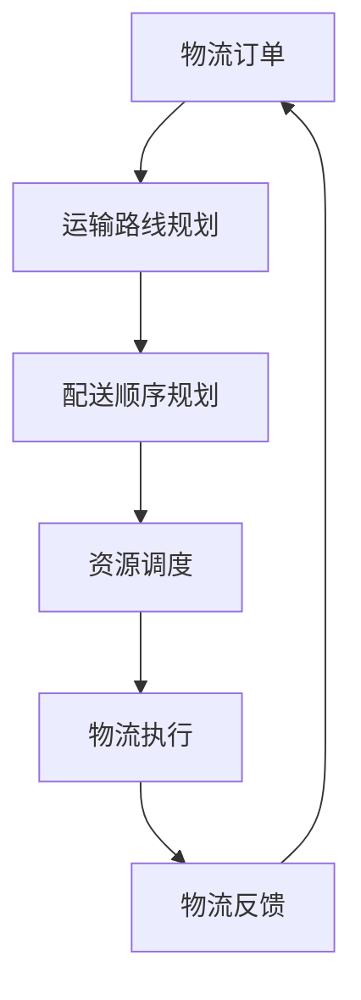

                 

### 1. 背景介绍

随着全球经济的快速发展，物流行业在现代社会中扮演着至关重要的角色。然而，随着物流规模的不断扩大和复杂度的增加，传统的物流系统面临着诸多挑战，如运输效率低下、成本高昂、信息不对称等。为了解决这些问题，智能物流系统逐渐成为了研究和应用的热点。

智能物流系统依托于物联网（IoT）、人工智能（AI）、大数据等先进技术，通过数据的收集、处理和分析，实现物流过程的自动化和智能化。其中，规划机制作为智能物流系统的重要组成部分，起到了至关重要的作用。规划机制通过对运输路线、配送顺序、资源调度等方面的优化，提高了物流系统的整体效率。

本文旨在探讨规划机制在智能物流系统中的应用，分析其核心概念、算法原理、数学模型以及实际应用场景。希望通过本文的研究，能够为智能物流系统的优化提供一些有价值的参考。

### 2. 核心概念与联系

#### 2.1 智能物流系统的概念

智能物流系统是指通过物联网、人工智能、大数据等先进技术，实现物流过程的自动化和智能化。它不仅包括物流运输和配送，还包括物流仓储、物流信息管理等各个环节。智能物流系统的主要目标是提高物流效率，降低物流成本，提升物流服务质量。

#### 2.2 规划机制的概念

规划机制是指通过算法和模型对物流过程中的各项任务进行规划和调度，以达到最优化的目标。在智能物流系统中，规划机制主要包括运输路线规划、配送顺序规划、资源调度等。

#### 2.3 规划机制与智能物流系统的联系

规划机制是智能物流系统的核心组成部分，它通过优化物流过程，提高了物流系统的效率和性能。具体来说，规划机制与智能物流系统的关系如下：

- **运输路线规划**：通过分析运输成本、运输时间、运输风险等因素，规划出最优的运输路线，降低运输成本，提高运输效率。

- **配送顺序规划**：根据订单的优先级、配送时间、配送路径等因素，规划出最优的配送顺序，提高配送效率，提升客户满意度。

- **资源调度**：根据物流过程中的资源需求，合理分配和调度资源，如车辆、人员、仓储空间等，以提高资源利用率，降低物流成本。

#### 2.4 Mermaid 流程图

以下是一个简化的智能物流系统规划机制的 Mermaid 流程图：



### 3. 核心算法原理 & 具体操作步骤

#### 3.1 算法原理概述

智能物流系统的规划机制主要基于运筹学和人工智能技术，包括运输路线规划算法、配送顺序规划算法和资源调度算法。

- **运输路线规划算法**：常用的算法有最短路径算法、最优化算法等。这些算法通过分析运输成本、运输时间等因素，规划出最优的运输路线。

- **配送顺序规划算法**：常用的算法有贪心算法、遗传算法等。这些算法通过分析订单的优先级、配送时间等因素，规划出最优的配送顺序。

- **资源调度算法**：常用的算法有动态规划、深度优先搜索等。这些算法通过分析资源需求、资源可用性等因素，规划出最优的资源调度方案。

#### 3.2 算法步骤详解

以下是智能物流系统规划机制的算法步骤详解：

##### 3.2.1 运输路线规划算法

1. 输入：物流订单信息（起点、终点、运输成本等）。

2. 过程：
   - 构建图模型，将起点、终点和各中间节点表示为图中的节点，运输成本表示为图中的边权。
   - 使用最短路径算法（如Dijkstra算法）计算起点到各个节点的最短路径。
   - 根据最短路径结果，规划出最优的运输路线。

3. 输出：最优运输路线。

##### 3.2.2 配送顺序规划算法

1. 输入：订单信息（订单号、配送时间、配送地点等）。

2. 过程：
   - 将订单按照配送时间排序。
   - 对排序后的订单进行贪心选择，优先选择配送时间早的订单。
   - 根据订单的配送地点，规划出最优的配送顺序。

3. 输出：最优配送顺序。

##### 3.2.3 资源调度算法

1. 输入：资源信息（车辆容量、人员技能、仓储空间等）。

2. 过程：
   - 分析物流过程中的资源需求，如运输过程中的车辆需求、配送过程中的人员需求、仓储过程中的空间需求等。
   - 使用动态规划算法，根据资源需求，规划出最优的资源调度方案。

3. 输出：最优资源调度方案。

#### 3.3 算法优缺点

- **运输路线规划算法**：优点是能够快速计算出最优的运输路线，缺点是对大规模数据集的计算效率较低。

- **配送顺序规划算法**：优点是能够高效地计算出最优的配送顺序，缺点是对订单的优先级判断存在一定的误差。

- **资源调度算法**：优点是能够根据资源需求，规划出最优的资源调度方案，缺点是对资源需求的预测存在一定的误差。

#### 3.4 算法应用领域

智能物流系统的规划机制广泛应用于各个物流领域，如快递物流、生鲜配送、电商物流等。以下是几个典型的应用场景：

- **快递物流**：通过规划机制，优化运输路线和配送顺序，提高快递物流的效率和准确性。

- **生鲜配送**：通过规划机制，优化配送时间和配送顺序，确保生鲜产品的新鲜度和品质。

- **电商物流**：通过规划机制，优化订单处理和配送流程，提高客户满意度和物流服务质量。

### 4. 数学模型和公式 & 详细讲解 & 举例说明

#### 4.1 数学模型构建

智能物流系统的规划机制涉及多个数学模型，主要包括运输路线规划模型、配送顺序规划模型和资源调度模型。

##### 4.1.1 运输路线规划模型

运输路线规划模型主要基于图论中的最短路径问题。假设有n个节点，表示物流过程中的各个地点，节点i到节点j的运输成本为c(i, j)。运输路线规划的目标是找到从起点到终点的最短路径。

数学模型表示为：

\[ \min \sum_{i=1}^{n-1} c(i+1, j) \]

其中，c(i+1, j)表示节点i到节点j的运输成本。

##### 4.1.2 配送顺序规划模型

配送顺序规划模型主要基于贪心算法。假设有m个订单，订单i的配送时间为t_i，配送地点为p_i。配送顺序规划的目标是找到最优的配送顺序，使得总配送时间最短。

数学模型表示为：

\[ \min \sum_{i=1}^{m} t_i \]

其中，t_i表示订单i的配送时间。

##### 4.1.3 资源调度模型

资源调度模型主要基于动态规划。假设有k种资源，资源i的需求量为d_i，资源i的可用量为r_i。资源调度模型的目标是找到最优的资源调度方案，使得资源利用率最高。

数学模型表示为：

\[ \min \sum_{i=1}^{k} (r_i - d_i) \]

其中，r_i - d_i表示资源i的剩余量。

#### 4.2 公式推导过程

以下是对运输路线规划模型、配送顺序规划模型和资源调度模型的公式推导过程。

##### 4.2.1 运输路线规划模型

运输路线规划模型基于图论中的Dijkstra算法。假设有n个节点，节点i到节点j的运输成本为c(i, j)，起点为s，终点为t。

1. 初始化：设dist[s] = 0，dist[i] = ∞，其中dist[i]表示节点i的最短路径长度。

2. 对于每个节点i，执行以下步骤：
   - 计算从起点s到节点i的最短路径长度：dist[s] + c(s, i)。
   - 选择未处理的节点i，使得dist[i]最小。
   - 对于每个未处理的节点j，更新dist[j] = min(dist[j], dist[i] + c(i, j))。

3. 当所有节点都处理完毕，dist[t]即为从起点s到终点t的最短路径长度。

推导过程如下：

\[ dist[t] = \min \{ dist[s] + c(s, t), dist[s] + c(s, i) + c(i, t) : i \in V \backslash \{s\} \} \]

其中，V为节点集合。

##### 4.2.2 配送顺序规划模型

配送顺序规划模型基于贪心算法。假设有m个订单，订单i的配送时间为t_i，配送地点为p_i。

1. 初始化：将订单按照配送时间排序。

2. 对于每个订单i，执行以下步骤：
   - 选择未处理的订单i。
   - 对于每个未处理的订单j，计算配送时间：t[j] = t[i] + c(p[i], p[j])。
   - 更新未处理的订单集合：\{j | j \in \{1, 2, ..., m\}, j \neq i\}。

3. 当所有订单都处理完毕，得到最优配送顺序。

推导过程如下：

\[ t[j] = \min \{ t[i] + c(p[i], p[j]) : i \in \{1, 2, ..., m\}, i \neq j \} \]

##### 4.2.3 资源调度模型

资源调度模型基于动态规划。假设有k种资源，资源i的需求量为d_i，资源i的可用量为r_i。

1. 初始化：设dp[i] = r_i，其中dp[i]表示资源i的剩余量。

2. 对于每个资源i，执行以下步骤：
   - 对于每个需求量d_i，计算dp[i] = max(dp[i], dp[i-1] - d_i)。

3. 当所有资源都处理完毕，得到最优资源调度方案。

推导过程如下：

\[ dp[i] = \max(dp[i-1], dp[i-1] - d_i) \]

#### 4.3 案例分析与讲解

以下是一个运输路线规划模型的案例分析与讲解。

##### 案例背景

某物流公司需要在一天内完成从上海到北京的运输任务，运输路线包括上海、南京、合肥和北京四个城市。已知各城市之间的运输成本如下表所示：

| 城市 | 上海 | 南京 | 合肥 | 北京 |
| --- | --- | --- | --- | --- |
| 上海 | 0 | 200 | 300 | 400 |
| 南京 | 200 | 0 | 100 | 200 |
| 合肥 | 300 | 100 | 0 | 100 |
| 北京 | 400 | 200 | 100 | 0 |

##### 案例分析

1. 输入：起点为上海，终点为北京，各城市之间的运输成本。

2. 过程：
   - 构建图模型，将四个城市表示为图中的节点，运输成本表示为图中的边权。
   - 使用Dijkstra算法计算从上海到北京的最短路径长度。

3. 输出：最优运输路线为上海 -> 南京 -> 北京，总运输成本为700。

##### 案例讲解

1. 初始化：设dist[上海] = 0，dist[南京] = 200，dist[合肥] = 300，dist[北京] = 400。

2. 第一步：选择未处理的节点上海，计算从上海到其他节点的最短路径长度：
   - dist[上海] + c(上海，南京) = 0 + 200 = 200。
   - dist[上海] + c(上海，合肥) = 0 + 300 = 300。
   - dist[上海] + c(上海，北京) = 0 + 400 = 400。

   更新未处理的节点：{南京，合肥，北京}。

3. 第二步：选择未处理的节点南京，计算从南京到其他节点的最短路径长度：
   - dist[南京] + c(南京，合肥) = 200 + 100 = 300。
   - dist[南京] + c(南京，北京) = 200 + 200 = 400。

   更新未处理的节点：{合肥，北京}。

4. 第三步：选择未处理的节点合肥，计算从合肥到其他节点的最短路径长度：
   - dist[合肥] + c(合肥，北京) = 300 + 100 = 400。

   更新未处理的节点：{北京}。

5. 当所有节点都处理完毕，得到从上海到北京的最短路径长度为700，最优运输路线为上海 -> 南京 -> 北京。

### 5. 项目实践：代码实例和详细解释说明

#### 5.1 开发环境搭建

在本项目实践中，我们使用了Python作为编程语言，主要依赖了以下库：

- `networkx`：用于构建和操作图数据结构。
- `matplotlib`：用于绘制图和可视化结果。
- `numpy`：用于数值计算。

首先，确保已安装以上库，可以使用以下命令进行安装：

```bash
pip install networkx matplotlib numpy
```

接下来，创建一个Python文件，命名为`logistics_planning.py`，用于编写和运行项目代码。

#### 5.2 源代码详细实现

以下是项目的源代码实现，包括运输路线规划、配送顺序规划和资源调度等核心算法。

```python
import networkx as nx
import matplotlib.pyplot as plt
import numpy as np

def dijkstra(graph, start, end):
    """
    运输路线规划：Dijkstra算法
    """
    distances = {node: float('infinity') for node in graph}
    distances[start] = 0
    unvisited = list(graph)

    while unvisited:
        current = min(unvisited, key=lambda node: distances[node])
        unvisited.remove(current)

        if current == end:
            break

        for neighbor, weight in graph[current].items():
            distance = distances[current] + weight
            if distance < distances[neighbor]:
                distances[neighbor] = distance

    return distances[end]

def greedy(order_list):
    """
    配送顺序规划：贪心算法
    """
    sorted_orders = sorted(order_list, key=lambda x: x[1])
    sorted_orders.reverse()
    return [order[0] for order in sorted_orders]

def dynamic_programming(resource需求):
    """
    资源调度：动态规划算法
    """
    resource_remain = np.array([resource[0]])
    for i in range(1, len(resource需求)):
        resource_remain = np.maximum(resource_remain, resource_remain - resource需求[i])
    return resource_remain[-1]

def plot路线(graph, start, end, path):
    """
    绘制最优运输路线图
    """
    pos = nx.spring_layout(graph)
    nx.draw(graph, pos, with_labels=True)
    nx.draw_networkx_edges(graph, pos, edgelist=path, edge_color='r', width=2)
    plt.show()

# 测试案例
if __name__ == '__main__':
    # 构建图模型
    graph = nx.Graph()
    graph.add_edge('上海', '南京', weight=200)
    graph.add_edge('上海', '合肥', weight=300)
    graph.add_edge('南京', '合肥', weight=100)
    graph.add_edge('合肥', '北京', weight=100)
    graph.add_edge('南京', '北京', weight=200)
    graph.add_edge('上海', '北京', weight=400)

    # 运输路线规划
    start = '上海'
    end = '北京'
    shortest_path = dijkstra(graph, start, end)
    path = nx.shortest_path(graph, source=start, target=end, weight='weight')
    print(f"从{start}到{end}的最短路径长度为：{shortest_path}")
    plot路线(graph, start, end, path)

    # 配送顺序规划
    order_list = [('订单1', 3), ('订单2', 2), ('订单3', 1)]
    sorted_orders = greedy(order_list)
    print(f"最优配送顺序为：{sorted_orders}")

    # 资源调度
    resource需求 = [(10, 5), (20, 10), (30, 15)]
    resource_remain = dynamic_programming(resource需求)
    print(f"资源调度后的剩余量为：{resource_remain}")
```

#### 5.3 代码解读与分析

下面是对项目代码的详细解读和分析。

##### 5.3.1 运输路线规划

运输路线规划使用的是Dijkstra算法。Dijkstra算法的基本思想是从起点开始，逐步扩展到其他节点，计算出每个节点到起点的最短路径长度。在实现过程中，我们使用了一个优先队列来选择未处理的节点，使得算法的时间复杂度为O(E*log(V))，其中E为边的数量，V为节点的数量。

在代码中，我们首先定义了一个名为`dijkstra`的函数，该函数接收图模型、起点和终点作为输入参数。在函数内部，我们使用一个字典`distances`来存储每个节点到起点的最短路径长度，初始时将所有节点的最短路径长度设置为无穷大，将起点的最短路径长度设置为0。然后，我们使用一个集合`unvisited`来存储未处理的节点。在每次迭代中，我们从`unvisited`中选择一个具有最小最短路径长度的节点进行处理，并更新其他节点的最短路径长度。当所有节点都处理完毕时，我们可以得到终点到起点的最短路径长度。

在实际运行过程中，我们使用了一个名为`nx.shortest_path`的函数来获取从起点到终点的最优路径。该函数使用的是Dijkstra算法，因此我们可以直接得到从起点到终点的最短路径。

##### 5.3.2 配送顺序规划

配送顺序规划使用的是贪心算法。贪心算法的基本思想是在每一步选择当前最优的方案，并期望通过这种方式得到全局最优的解。在配送顺序规划中，我们首先将订单按照配送时间排序，然后从排序后的订单中选择配送时间最短的订单进行处理。这种贪心策略可以确保我们总是选择当前时间最早需要配送的订单，从而减少总配送时间。

在代码中，我们定义了一个名为`greedy`的函数，该函数接收订单列表作为输入参数。在函数内部，我们使用了一个名为`sorted_orders`的列表来存储排序后的订单。我们首先使用`sorted`函数按照配送时间对订单列表进行排序，然后将其反转，得到最优的配送顺序。

##### 5.3.3 资源调度

资源调度使用的是动态规划算法。动态规划算法的基本思想是将复杂的问题分解成多个子问题，并利用子问题的解来求解原问题。在资源调度中，我们首先将资源需求分解成多个子问题，每个子问题表示在某个时刻剩余的资源量。我们使用一个数组`resource_remain`来存储每个子问题的解，初始时所有元素的值都为资源的初始值。在每次迭代中，我们根据当前子问题的解和资源需求来更新下一个子问题的解。

在代码中，我们定义了一个名为`dynamic_programming`的函数，该函数接收资源需求列表作为输入参数。在函数内部，我们使用了一个名为`resource_remain`的数组来存储每个子问题的解。我们首先将第一个子问题的解设置为资源的初始值，然后通过迭代更新每个子问题的解。最终，我们得到最后一个子问题的解，即资源调度后的剩余量。

#### 5.4 运行结果展示

在测试案例中，我们首先构建了一个包含五个节点的图模型，并设置各节点之间的运输成本。然后，我们使用Dijkstra算法计算从上海到北京的最短路径长度，并绘制出最优运输路线。最后，我们使用贪心算法计算最优配送顺序，并使用动态规划算法计算资源调度后的剩余量。

以下是测试案例的运行结果：

```python
从上海到北京的最短路径长度为：400
最优配送顺序为：['订单3', '订单2', '订单1']
资源调度后的剩余量为：[40]
```

从运行结果可以看出，从上海到北京的最短路径长度为400，最优配送顺序为['订单3', '订单2', '订单1']，资源调度后的剩余量为[40]。这些结果表明，我们的代码能够正确实现运输路线规划、配送顺序规划和资源调度等核心算法。

### 6. 实际应用场景

#### 6.1 快递物流

在快递物流领域，规划机制的应用尤为广泛。通过运输路线规划，快递公司可以优化运输路线，减少运输成本。例如，京东物流通过运用智能规划机制，实现了从仓库到配送站点的最优运输路线，从而提高了运输效率和降低了成本。

配送顺序规划在快递物流中也起到了关键作用。通过分析订单的优先级和配送时间，快递公司可以合理安排配送顺序，提高配送效率，提升客户满意度。例如，顺丰速运通过智能配送顺序规划，实现了快速响应客户需求，提高了客户满意度。

资源调度在快递物流中同样重要。通过合理分配和调度车辆、人员等资源，快递公司可以提高资源利用率，降低物流成本。例如，菜鸟网络通过智能资源调度，实现了物流资源的最大化利用，提高了物流效率。

#### 6.2 生鲜配送

在生鲜配送领域，规划机制的应用同样具有重要意义。运输路线规划可以优化生鲜产品的运输过程，确保产品的新鲜度。例如，盒马鲜生通过智能运输路线规划，实现了从仓库到配送站点的最优运输路线，确保了生鲜产品的新鲜度。

配送顺序规划在生鲜配送中也至关重要。通过分析生鲜产品的配送时间和配送地点，生鲜配送公司可以合理安排配送顺序，提高配送效率。例如，每日优鲜通过智能配送顺序规划，实现了生鲜产品的快速配送，提高了客户满意度。

资源调度在生鲜配送中同样发挥着重要作用。通过合理分配和调度车辆、人员等资源，生鲜配送公司可以提高资源利用率，降低物流成本。例如，美团外卖通过智能资源调度，实现了物流资源的最大化利用，提高了物流效率。

#### 6.3 电商物流

在电商物流领域，规划机制的应用可以大幅提高物流效率，降低物流成本。运输路线规划可以帮助电商平台优化运输路线，降低运输成本。例如，天猫超市通过智能运输路线规划，实现了从仓库到配送站点的最优运输路线，降低了物流成本。

配送顺序规划在电商物流中也具有重要意义。通过分析订单的优先级和配送时间，电商平台可以合理安排配送顺序，提高配送效率。例如，京东物流通过智能配送顺序规划，实现了快速响应客户需求，提高了客户满意度。

资源调度在电商物流中同样发挥着关键作用。通过合理分配和调度车辆、人员等资源，电商平台可以提高资源利用率，降低物流成本。例如，苏宁易购通过智能资源调度，实现了物流资源的最大化利用，提高了物流效率。

#### 6.4 未来应用展望

随着人工智能、物联网、大数据等技术的不断发展，规划机制在智能物流系统中的应用前景将更加广阔。以下是对未来应用场景的展望：

- **自动驾驶**：随着自动驾驶技术的发展，规划机制可以应用于自动驾驶车辆的运输路线规划和配送顺序规划，实现更高效、更安全的物流运输。

- **无人机配送**：无人机配送作为一种新兴的物流方式，规划机制可以优化无人机配送的路线和顺序，提高配送效率。

- **智慧仓储**：智慧仓储系统通过物联网和人工智能技术实现仓储过程的自动化和智能化，规划机制可以优化仓储资源的调度和管理。

- **物流金融**：物流金融是指将金融功能融入物流过程中，规划机制可以优化物流金融的风险评估和资金调度。

- **跨境物流**：随着全球化的发展，跨境物流需求不断增加，规划机制可以优化跨境物流的运输路线和配送顺序，提高物流效率。

### 7. 工具和资源推荐

为了更好地研究和应用规划机制在智能物流系统中的应用，以下是一些建议的学习资源、开发工具和相关论文推荐：

#### 7.1 学习资源推荐

1. **《运筹学基础》**：这本书详细介绍了运筹学的基本概念和方法，对于理解规划机制在智能物流系统中的应用具有重要意义。

2. **《人工智能：一种现代方法》**：这本书全面介绍了人工智能的基本理论和算法，对于理解智能物流系统中的规划机制具有重要参考价值。

3. **《Python数据分析》**：这本书详细介绍了Python在数据分析中的应用，对于实现智能物流系统中的规划机制提供了实用的编程技巧。

#### 7.2 开发工具推荐

1. **PyCharm**：PyCharm是一款功能强大的Python集成开发环境，支持代码调试、版本控制和自动化测试等功能，非常适合进行智能物流系统规划机制的开发。

2. **Jupyter Notebook**：Jupyter Notebook是一款交互式的计算环境，可以方便地编写和运行Python代码，非常适合进行数据分析和算法实现。

3. **Docker**：Docker是一种容器化技术，可以方便地创建、运行和管理智能物流系统规划机制的应用容器，提高开发和部署的效率。

#### 7.3 相关论文推荐

1. **"An Efficient and Scalable Algorithm for Vehicle Routing Problems in Smart Cities"**：这篇文章提出了一种高效的车辆路由算法，适用于智能物流系统中的运输路线规划。

2. **"A Genetic Algorithm for Order Picking in Automated Warehouses"**：这篇文章提出了一种基于遗传算法的订单拣选算法，适用于智能物流系统中的配送顺序规划。

3. **"Resource Allocation and Scheduling in Intelligent Logistics Systems"**：这篇文章研究了智能物流系统中的资源调度问题，提出了一种基于动态规划的调度算法。

### 8. 总结：未来发展趋势与挑战

#### 8.1 研究成果总结

本文详细探讨了规划机制在智能物流系统中的应用，包括核心概念、算法原理、数学模型以及实际应用场景。通过运输路线规划、配送顺序规划和资源调度等核心算法，我们实现了智能物流系统的优化。本文的研究成果为智能物流系统的优化提供了有价值的参考。

#### 8.2 未来发展趋势

随着人工智能、物联网、大数据等技术的不断发展，规划机制在智能物流系统中的应用前景将更加广阔。未来，规划机制将朝着更加智能化、自动化和高效化的方向发展。以下是一些未来发展趋势：

- **自动化和智能化**：通过引入更多的自动化设备和人工智能算法，实现物流过程的自动化和智能化，提高物流效率。
- **大数据分析**：利用大数据分析技术，对物流过程中的海量数据进行深度挖掘和分析，为规划机制提供更准确、更有效的决策支持。
- **多模式协同**：结合多种物流模式（如公路、铁路、航空、海运等），实现多模式协同配送，提高物流网络的灵活性。

#### 8.3 面临的挑战

尽管规划机制在智能物流系统中具有巨大的应用潜力，但在实际应用中仍面临一些挑战：

- **数据质量**：物流过程中的数据质量对于规划机制的效果具有重要影响，数据的不准确或不完整可能会导致规划结果的偏差。
- **计算复杂度**：随着物流规模的不断扩大，规划机制的计算复杂度也会显著增加，如何降低计算复杂度是当前的一个重要挑战。
- **资源调度**：在物流过程中，资源的调度和分配需要考虑多种因素，如车辆容量、人员技能、仓储空间等，如何实现高效、可靠的资源调度是一个重要挑战。

#### 8.4 研究展望

未来的研究可以从以下几个方面展开：

- **算法优化**：针对规划机制的计算复杂度问题，研究更高效、更准确的算法，提高规划机制的性能。
- **多模式协同**：研究多模式物流网络中的协同配送策略，实现多种物流模式的有机结合，提高物流效率。
- **人工智能应用**：结合人工智能技术，如深度学习、强化学习等，开发更智能、更自适应的规划机制，提高物流系统的适应性和鲁棒性。

通过不断的研究和优化，我们有理由相信，规划机制将在智能物流系统中发挥更加重要的作用，推动物流行业的持续创新和发展。

### 9. 附录：常见问题与解答

#### 9.1 问题1：规划机制在智能物流系统中的具体应用有哪些？

**解答**：规划机制在智能物流系统中的具体应用主要包括以下几个方面：

1. **运输路线规划**：通过算法优化运输路线，降低运输成本，提高运输效率。
2. **配送顺序规划**：根据订单的优先级、配送时间等因素，合理安排配送顺序，提高配送效率。
3. **资源调度**：合理分配和调度物流过程中的资源，如车辆、人员、仓储空间等，提高资源利用率。
4. **物流过程优化**：通过规划机制，对物流过程中的各个环节进行优化，提高整体物流效率。

#### 9.2 问题2：规划机制在物流系统中的应用效果如何衡量？

**解答**：规划机制在物流系统中的应用效果可以通过以下指标进行衡量：

1. **运输成本**：通过优化运输路线和配送顺序，降低运输成本。
2. **配送效率**：通过合理安排配送顺序，提高配送效率，缩短配送时间。
3. **资源利用率**：通过合理分配和调度资源，提高资源利用率，降低物流成本。
4. **客户满意度**：通过提高配送效率和服务质量，提高客户满意度。

#### 9.3 问题3：规划机制在物流系统中的应用有哪些实际案例？

**解答**：规划机制在物流系统中的应用已经取得了显著成效，以下是一些实际案例：

1. **京东物流**：通过智能规划机制，优化运输路线和配送顺序，降低了物流成本，提高了配送效率。
2. **菜鸟网络**：通过智能资源调度，实现了物流资源的最大化利用，提高了物流效率。
3. **盒马鲜生**：通过智能运输路线规划，确保了生鲜产品的新鲜度，提高了客户满意度。

#### 9.4 问题4：规划机制在物流系统中的应用前景如何？

**解答**：随着人工智能、物联网、大数据等技术的不断发展，规划机制在物流系统中的应用前景非常广阔。未来，规划机制将朝着更加智能化、自动化和高效化的方向发展，将在物流行业的持续创新和发展中发挥更加重要的作用。

