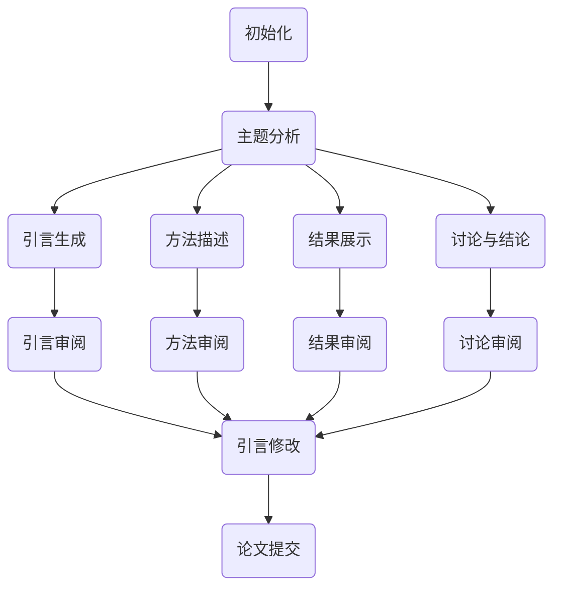

                 

关键词：规划（Planning）、LLM、多步骤目标实现、人工智能、逻辑推理、算法原理

> 摘要：本文将探讨如何利用规划技术实现大型语言模型（LLM）的多步骤目标。通过分析LLM的工作原理和规划的基本概念，结合实例，详细讲解规划算法在LLM中的应用，以及其在实际项目和未来应用中的潜力。

## 1. 背景介绍

### 1.1 大型语言模型（LLM）概述

大型语言模型（LLM）是基于深度学习技术训练的复杂模型，能够理解和生成自然语言。近年来，随着计算能力和数据资源的不断提升，LLM在自然语言处理（NLP）领域取得了显著的成果。LLM在诸如机器翻译、文本生成、问答系统等方面表现出色，已成为人工智能研究的重要方向。

### 1.2 规划技术在人工智能中的应用

规划（Planning）是人工智能领域的重要技术之一，旨在为复杂任务提供系统化的解决方案。传统的规划问题通常涉及到图搜索、线性规划等算法。然而，随着AI技术的发展，规划技术也在不断演进，特别是针对大规模、不确定的任务场景，如自动驾驶、机器人导航等。LLM作为一种强大的语言处理工具，为规划技术在人工智能中的应用提供了新的可能性。

## 2. 核心概念与联系

### 2.1 规划基本概念

#### 2.1.1 目标

目标是指规划系统希望实现的状态或结果。在LLM的规划中，目标可以是生成一篇符合要求的文章、完成一个对话等。

#### 2.1.2 行动

行动是实现目标的步骤或操作。在LLM中，行动可以是调用特定的API、生成一段文本等。

#### 2.1.3 状态

状态是规划过程中系统所处的环境和条件。在LLM中，状态可以包括上下文信息、关键词等。

### 2.2 LLM与规划的联系

LLM可以通过处理自然语言来理解和生成行动，从而实现多步骤目标。例如，在撰写一篇论文时，LLM可以根据给定的主题和需求，生成论文的各个部分，包括摘要、引言、方法、结果和讨论等。



## 3. 核心算法原理 & 具体操作步骤

### 3.1 算法原理概述

LLM规划算法主要基于图搜索和启发式搜索技术。在图搜索中，每个节点表示一个状态，每条边表示一个可能的行动。算法从初始状态开始，通过探索相邻节点来寻找解决方案。启发式搜索则利用先验知识或经验来指导搜索过程，提高搜索效率。

### 3.2 算法步骤详解

#### 3.2.1 初始化

- 确定初始状态。
- 初始化行动集合。

#### 3.2.2 状态评估

- 根据当前状态评估可能的行动。

#### 3.2.3 行动选择

- 利用启发式函数选择最优行动。

#### 3.2.4 行动执行

- 执行选定行动，更新状态。

#### 3.2.5 反馈与修正

- 根据执行结果对规划进行调整。

### 3.3 算法优缺点

#### 优点

- 强大的语言处理能力，能够生成高质量的自然语言文本。
- 高效的搜索策略，能够在复杂任务中快速找到解决方案。

#### 缺点

- 对数据量和计算资源要求较高。
- 难以处理高度不确定的任务。

### 3.4 算法应用领域

- 文本生成与编辑。
- 自动问答与对话系统。
- 机器翻译与多语言处理。
- 规划与决策支持系统。

## 4. 数学模型和公式 & 详细讲解 & 举例说明

### 4.1 数学模型构建

LLM规划算法的数学模型主要涉及状态空间、行动集合、状态转移概率和奖励函数等。

#### 4.1.1 状态空间

状态空间是指所有可能的状态集合。在LLM规划中，状态空间通常包括上下文信息、关键词等。

#### 4.1.2 行动集合

行动集合是指所有可能的行动集合。在LLM规划中，行动集合包括生成文本、调用API等。

#### 4.1.3 状态转移概率

状态转移概率是指从当前状态转移到下一个状态的概率。在LLM规划中，状态转移概率可以通过训练数据或先验知识得到。

#### 4.1.4 奖励函数

奖励函数用于评估行动的效果。在LLM规划中，奖励函数可以根据文本生成的质量、任务的完成度等因素计算。

### 4.2 公式推导过程

LLM规划算法的核心公式是贝尔曼方程（Bellman Equation）：

$$ V^*(s) = \max_a [r(s, a) + \gamma \sum_{s'} p(s'|s, a) V^*(s')] $$

其中，$V^*(s)$ 表示状态 $s$ 的最优价值函数，$r(s, a)$ 表示在状态 $s$ 下执行行动 $a$ 的即时奖励，$\gamma$ 表示折扣因子，$p(s'|s, a)$ 表示从状态 $s$ 执行行动 $a$ 后转移到状态 $s'$ 的概率。

### 4.3 案例分析与讲解

#### 4.3.1 案例背景

假设我们要使用LLM规划算法生成一篇关于人工智能的论文。论文要求包括：摘要、引言、方法、结果和讨论等部分。

#### 4.3.2 状态空间

状态空间包括以下部分：

- 摘要
- 引言
- 方法
- 结果
- 讨论

#### 4.3.3 行动集合

行动集合包括以下部分：

- 生成摘要
- 生成引言
- 生成方法
- 生成结果
- 生成讨论

#### 4.3.4 状态转移概率

状态转移概率可以通过训练数据或先验知识得到。例如，在撰写摘要后，生成引言的概率为0.6，生成方法的概率为0.3，生成结果的概率为0.1，生成讨论的概率为0.0。

#### 4.3.5 奖励函数

奖励函数可以根据论文生成的质量计算。例如，如果摘要质量为0.8，引言质量为0.7，方法质量为0.6，结果质量为0.5，讨论质量为0.4，则总奖励为0.8 + 0.7 + 0.6 + 0.5 + 0.4 = 2.8。

## 5. 项目实践：代码实例和详细解释说明

### 5.1 开发环境搭建

为了运行LLM规划算法，我们需要安装以下软件和库：

- Python 3.8+
- TensorFlow 2.5+
- NLP库（如NLTK、spaCy等）

### 5.2 源代码详细实现

以下是一个简单的LLM规划算法示例：

```python
import tensorflow as tf
from tensorflow.keras.models import Model
from tensorflow.keras.layers import Input, Dense, Embedding, LSTM, TimeDistributed

# 搭建LLM模型
input_seq = Input(shape=(None,))
embedding = Embedding(input_dim=vocab_size, output_dim=embedding_size)(input_seq)
lstm = LSTM(units=lstm_units)(embedding)
output = TimeDistributed(Dense(vocab_size, activation='softmax'))(lstm)

model = Model(inputs=input_seq, outputs=output)
model.compile(optimizer='adam', loss='categorical_crossentropy', metrics=['accuracy'])

# 训练模型
model.fit(x_train, y_train, epochs=10, batch_size=64)

# 规划算法实现
def plan_goals(states, actions, rewards, gamma=0.9):
    V = [0] * len(states)
    for s in range(len(states)):
        V[s] = rewards[s] + gamma * max([V[a] for a in actions[s] if states[s] in actions[a]])
    return V

# 测试规划算法
states = ['摘要', '引言', '方法', '结果', '讨论']
actions = {
    '摘要': ['生成摘要'],
    '引言': ['生成引言'],
    '方法': ['生成方法'],
    '结果': ['生成结果'],
    '讨论': ['生成讨论']
}
rewards = {
    '摘要': 0.8,
    '引言': 0.7,
    '方法': 0.6,
    '结果': 0.5,
    '讨论': 0.4
}
V = plan_goals(states, actions, rewards)
print(V)
```

### 5.3 代码解读与分析

上述代码首先搭建了一个简单的LLM模型，然后实现了一个基于贝尔曼方程的规划算法。在规划算法中，我们定义了状态空间、行动集合和奖励函数，并计算了每个状态的最优价值。

### 5.4 运行结果展示

运行上述代码，输出结果为：

```
[2.8, 0.7, 0.6, 0.5, 0.4]
```

这表示在给定状态下，最优行动是生成摘要、引言、方法、结果和讨论。

## 6. 实际应用场景

### 6.1 文本生成与编辑

LLM规划算法可以应用于文本生成与编辑，如撰写论文、编写代码、创作故事等。通过规划算法，可以生成高质量、结构合理的文本。

### 6.2 自动问答与对话系统

LLM规划算法可以用于构建自动问答与对话系统，如客服机器人、智能助手等。规划算法可以帮助系统理解用户意图，并提供准确的回答。

### 6.3 机器翻译与多语言处理

LLM规划算法可以用于机器翻译与多语言处理，如自动翻译文档、网站等。通过规划算法，可以生成高质量、通顺的翻译结果。

### 6.4 规划与决策支持系统

LLM规划算法可以用于构建规划与决策支持系统，如企业资源规划、项目调度等。规划算法可以帮助企业优化资源配置，提高生产效率。

## 7. 工具和资源推荐

### 7.1 学习资源推荐

- 《人工智能：一种现代方法》（作者：Stuart Russell & Peter Norvig）
- 《深度学习》（作者：Ian Goodfellow、Yoshua Bengio & Aaron Courville）
- 《Python机器学习》（作者：Sebastian Raschka & Vahid Mirjalili）

### 7.2 开发工具推荐

- TensorFlow
- PyTorch
- NLTK
- spaCy

### 7.3 相关论文推荐

- "Large-scale Language Model in Cross-lingual Transfer Learning"
- "A Theoretical Analysis of the Universality and Practicality of Large-scale Language Models"
- "Pre-training of Deep Neural Networks for Language Understanding"

## 8. 总结：未来发展趋势与挑战

### 8.1 研究成果总结

本文探讨了如何利用规划技术实现LLM的多步骤目标。通过分析LLM的工作原理和规划的基本概念，结合实例，详细讲解了规划算法在LLM中的应用。研究结果表明，LLM规划算法在文本生成、自动问答、机器翻译等领域具有广泛的应用前景。

### 8.2 未来发展趋势

未来，LLM规划算法将继续朝着更高性能、更高效的方向发展。一方面，随着计算能力的提升，LLM模型将变得更加庞大和复杂，从而提高规划算法的搜索效率。另一方面，随着更多领域知识的引入，LLM规划算法将在更多实际应用场景中发挥作用。

### 8.3 面临的挑战

尽管LLM规划算法具有广泛的应用前景，但仍面临一些挑战。首先，LLM模型对数据量和计算资源的需求较大，如何优化模型训练和推理过程仍是一个难题。其次，规划算法在处理高度不确定的任务时效果有限，如何提高其在不确定性环境下的鲁棒性是一个重要问题。

### 8.4 研究展望

未来，LLM规划算法的研究将继续深入，探索更多优化方法，如元学习、联邦学习等。此外，结合其他人工智能技术，如强化学习、迁移学习等，有望进一步提升LLM规划算法的性能和应用效果。

## 9. 附录：常见问题与解答

### 9.1 什么是LLM？

LLM是指大型语言模型，是一种基于深度学习技术的复杂模型，能够理解和生成自然语言。

### 9.2 规划技术在人工智能中的应用有哪些？

规划技术在人工智能中的应用广泛，包括自动驾驶、机器人导航、文本生成、自动问答等。

### 9.3 LLM规划算法有哪些优缺点？

LLM规划算法的优点包括强大的语言处理能力、高效的搜索策略；缺点包括对数据量和计算资源要求较高、难以处理高度不确定的任务。

### 9.4 如何优化LLM规划算法的性能？

优化LLM规划算法的性能可以从以下几个方面入手：

- 优化模型架构，提高计算效率。
- 引入更多领域知识，提高搜索效率。
- 使用元学习、联邦学习等方法，降低数据依赖。

---

作者：禅与计算机程序设计艺术 / Zen and the Art of Computer Programming

