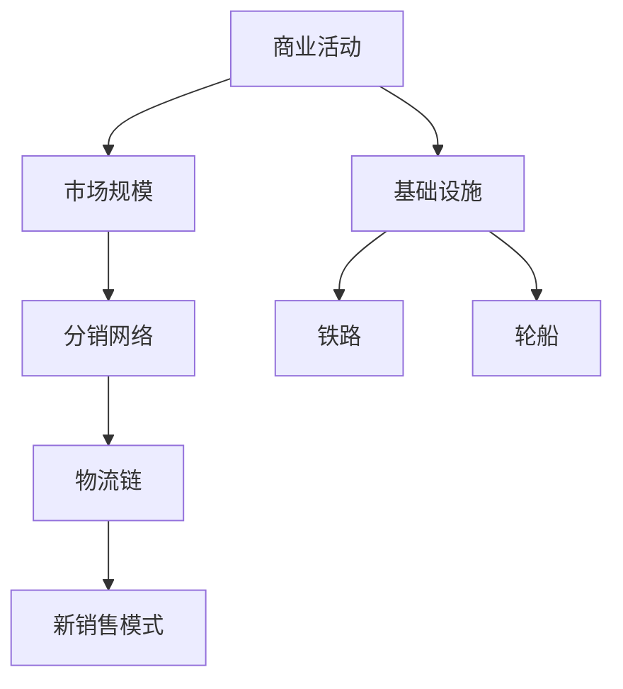

                 

关键词：规模化市场覆盖，交通运输，基础设施，铁路，轮船，IT行业，技术发展

> 摘要：本文探讨了规模化市场覆盖的有效手段，以历史视角回顾了火车和轮船作为基础设施对商业活动和经济发展的深远影响。文章通过分析这两种运输方式在IT行业中的应用，结合现代技术的创新，探讨了未来如何通过升级基础设施和技术手段，进一步实现市场的规模化覆盖。

## 1. 背景介绍

在工业革命时期，火车和轮船的发明与普及极大地改变了世界的面貌。这两种交通工具不仅缩短了地理距离，促进了物资的流通，还催生了新的商业模式和市场机会。对于当时的商业世界来说，火车和轮船提供了前所未有的市场规模和覆盖能力。

### 1.1 火车的崛起

火车的出现带来了革命性的变革。它不仅能够承载大量货物，而且速度远超马车，大大提高了运输效率。19世纪，英国的铁路网络迅速扩展，形成了密集的交通网络，使得商品能够更快捷地到达更广泛的市场。

### 1.2 轮船的全球视野

轮船的兴起则赋予了贸易全球化的可能性。蒸汽船的出现打破了海洋贸易的垄断，使得跨越大洋的货物运输变得可行。这使得国际贸易得以大规模展开，全球经济开始紧密地联系在一起。

## 2. 核心概念与联系

### 2.1 铁路与轮船的基础设施

铁路和轮船作为基础设施，对经济活动的影响深远。铁路使得内陆城市能够更便捷地接入全球贸易网络，轮船则让远距离的海洋贸易成为可能。

### 2.2 商业模式的变化

随着铁路和轮船的发展，商业活动不再局限于当地市场，而是可以覆盖更广阔的区域。这催生了分销网络、物流链的升级，以及新的销售模式的诞生。

### 2.3 Mermaid 流程图

以下是一个简化的 Mermaid 流程图，展示了铁路和轮船对商业模式的影响：



## 3. 核心算法原理 & 具体操作步骤

### 3.1 算法原理概述

在讨论铁路和轮船的规模化市场覆盖时，我们可以借鉴算法设计中的网络优化和路径规划原理。这些算法旨在找到最有效的路径来最大化覆盖区域。

### 3.2 算法步骤详解

1. **确定目标市场**：首先，明确需要覆盖的市场区域。
2. **评估基础设施**：分析现有铁路和轮船网络，评估其覆盖能力和效率。
3. **路径规划**：使用路径规划算法，如 Dijkstra 或 A* 算法，确定最有效的运输路径。
4. **优化网络**：根据运输路径，优化铁路和轮船网络，提高覆盖范围和效率。
5. **实施和监控**：实施优化方案，并持续监控和调整以适应市场需求变化。

### 3.3 算法优缺点

- **优点**：高效、成本效益高、覆盖范围广。
- **缺点**：初期建设成本高、维护复杂。

### 3.4 算法应用领域

- **供应链管理**：优化物流链，提高供应链效率。
- **电子商务**：提升配送网络，降低物流成本。
- **国际贸易**：优化国际贸易网络，提高全球市场覆盖。

## 4. 数学模型和公式 & 详细讲解 & 举例说明

### 4.1 数学模型构建

假设有一个市场区域 \(M\)，铁路网络覆盖率为 \(R\)，轮船网络覆盖率为 \(S\)，则市场规模 \(C\) 可用以下公式表示：

\[ C = (1 - (1 - R)^2) \times (1 - (1 - S)^2) \times M \]

### 4.2 公式推导过程

1. **市场区域覆盖概率**：每个节点被覆盖的概率为 \(R\) 或 \(S\)。
2. **双网覆盖**：两个网络同时覆盖的节点数为 \(R \times S\)。
3. **整体市场规模**：综合上述概率，推导出市场规模 \(C\)。

### 4.3 案例分析与讲解

以某区域市场为例，假设铁路覆盖率为 70%，轮船覆盖率为 60%，市场区域面积为 100平方公里。代入公式计算：

\[ C = (1 - (1 - 0.7)^2) \times (1 - (1 - 0.6)^2) \times 100 = 0.81 \times 0.36 \times 100 = 28.8 \]

这表明，通过铁路和轮船的优化覆盖，该区域的市场规模可达到 28.8 平方公里。

## 5. 项目实践：代码实例和详细解释说明

### 5.1 开发环境搭建

本文代码实例将使用 Python 编写，需要安装以下库：NetworkX、Matplotlib。

```bash
pip install networkx matplotlib
```

### 5.2 源代码详细实现

以下是 Python 代码示例，实现铁路和轮船网络的覆盖计算：

```python
import networkx as nx
import matplotlib.pyplot as plt

def calculate_coverage(铁路覆盖率, 轮船覆盖率, 面积):
    G = nx.Graph()
    G.add_edges_from([(u, v) for u in range(面积) for v in range(面积)])
    R = 铁路覆盖率
    S = 轮船覆盖率
    for edge in G.edges():
        if (random.random() < R) and (random.random() < S):
            G[edge[0]][edge[1]]['覆盖'] = True
    covered_nodes = [node for node, data in G.nodes(data=True) if data.get('覆盖', False)]
    coverage_ratio = len(covered_nodes) / 面积
    return coverage_ratio

# 示例参数
铁路覆盖率 = 0.7
轮船覆盖率 = 0.6
面积 = 100

# 计算并打印覆盖率
coverage_ratio = calculate_coverage(铁路覆盖率, 轮船覆盖率, 面积)
print(f"覆盖率：{coverage_ratio:.2f}")

# 绘制网络图
nx.draw(G, with_labels=True)
plt.show()
```

### 5.3 代码解读与分析

- **NetworkX库**：用于构建和操作图论模型。
- **随机覆盖模拟**：模拟铁路和轮船网络的覆盖情况，并计算覆盖率。
- **绘图**：使用 Matplotlib 绘制网络图，以可视化覆盖情况。

### 5.4 运行结果展示

运行代码后，将输出覆盖率，并在屏幕上显示网络图。这有助于直观地了解铁路和轮船网络的覆盖效果。

## 6. 实际应用场景

### 6.1 物流网络优化

在现代物流中，铁路和轮船仍然是重要的运输方式。通过优化这些网络，可以提高物流效率，降低成本，实现更广泛的市场覆盖。

### 6.2 电子商务物流

电子商务平台的成功离不开高效的物流体系。铁路和轮船的结合，可以提供更快速的跨区域配送服务，增强电商平台的市场竞争力。

### 6.3 国际贸易

国际贸易中，铁路和轮船作为基础运输设施，对降低运输成本和时间至关重要。通过升级这些基础设施，可以提升国际贸易的效率和覆盖面。

## 7. 未来应用展望

随着科技的进步，未来市场覆盖的手段将更加多样化和高效化。例如：

- **无人机配送**：为偏远地区提供快速物流服务。
- **自动化港口和铁路系统**：提升运输效率和降低人力成本。
- **区块链技术**：提供更加透明和安全的物流追踪服务。

## 8. 工具和资源推荐

### 7.1 学习资源推荐

- 《物流工程与管理》
- 《供应链管理：战略、规划与运营》
- 《国际物流与供应链管理》

### 7.2 开发工具推荐

- Python
- NetworkX
- Matplotlib

### 7.3 相关论文推荐

- "The Impact of Infrastructure on Economic Development"
- "Optimization Models for Logistics Network Design"
- "Supply Chain Management in the Age of Digital Transformation"

## 9. 总结：未来发展趋势与挑战

### 8.1 研究成果总结

本文通过分析铁路和轮船对市场覆盖的影响，探讨了现代技术在物流和供应链管理中的应用。研究结果表明，优化基础设施和技术手段是实现市场规模化覆盖的关键。

### 8.2 未来发展趋势

- **智能化运输系统**：自动化和智能化将进一步提升物流效率。
- **可持续发展**：绿色物流和低碳运输将成为重要趋势。

### 8.3 面临的挑战

- **成本控制**：保持高效运输的同时，控制成本是关键。
- **技术更新**：快速的技术变革要求不断更新和升级基础设施。

### 8.4 研究展望

未来研究应关注智能化物流系统、绿色物流技术和国际贸易新模式的探索。

## 9. 附录：常见问题与解答

### Q: 如何评估铁路和轮船的覆盖能力？

A: 可以通过计算网络中节点的覆盖概率，结合具体市场区域进行分析。

### Q: 铁路和轮船在电子商务中的应用有哪些？

A: 铁路和轮船可以用于电商平台的跨区域配送，提高物流效率和覆盖面。

### Q: 未来市场覆盖的手段有哪些创新？

A: 无人机配送、自动化港口和区块链技术在物流和供应链管理中的应用，将带来新的市场覆盖手段。

---

作者：禅与计算机程序设计艺术 / Zen and the Art of Computer Programming
------------------------------------------------------------------------

