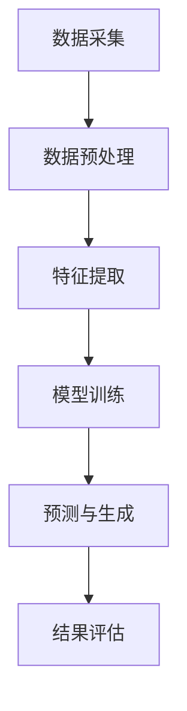

                 

 

## 1. 背景介绍

随着互联网和多媒体技术的快速发展，视频数据已经成为信息传递的重要载体。无论是日常生活中的社交媒体分享、专业领域的视频教程，还是企业内部的培训材料，视频都发挥了不可替代的作用。然而，随着视频数据量的急剧增加，如何高效地处理和分析这些视频数据，成为了当今信息技术领域的一个重要课题。

视频大模型（Video Large Models）的出现，为解决这一问题提供了新的思路。视频大模型是一种基于深度学习的模型，它可以对大量视频数据进行自动分析、理解和生成。通过训练这些模型，我们可以实现视频内容的自动分类、提取关键帧、识别场景、人物和动作等高级功能。

本篇文章将详细探讨视频大模型的技术原理、构建方法、优化策略以及在实际应用中的挑战和解决方案。希望通过本文的介绍，读者可以更好地理解视频大模型的工作机制，并能够运用这些技术来开发出更智能的视频处理系统。

## 2. 核心概念与联系

### 2.1 视频大模型的基本概念

视频大模型是指那些能够处理和分析大量视频数据的人工智能模型。这些模型通常基于深度学习，尤其是卷积神经网络（CNN）和循环神经网络（RNN）等先进算法。视频大模型的主要目标是从视频数据中提取有用的信息，如视频内容的分类、目标检测、动作识别和视频生成等。

### 2.2 视频大模型的组成部分

视频大模型通常由以下几个关键部分组成：

1. **数据预处理模块**：该模块负责处理原始视频数据，包括视频的采集、剪辑、编码和解码等。预处理模块的目标是提取出高质量的、可分析的中间数据。

2. **特征提取模块**：该模块利用深度学习算法从预处理后的视频数据中提取特征。这些特征通常包括图像的纹理、颜色、形状和运动信息等。

3. **模型训练模块**：该模块使用提取出的特征对深度学习模型进行训练。通过大量视频数据的学习，模型可以学会识别和分类不同的视频内容。

4. **预测和生成模块**：训练好的模型可以用于预测和生成新的视频内容。例如，通过目标检测可以识别视频中的特定物体或动作，并通过生成模型可以创造新的视频片段。

### 2.3 视频大模型的工作原理

视频大模型的工作原理主要可以分为以下几个步骤：

1. **数据预处理**：原始视频数据经过预处理模块处理后，转化为适合深度学习模型输入的数据格式。

2. **特征提取**：特征提取模块通过卷积神经网络等算法从预处理后的视频数据中提取出高维特征。

3. **模型训练**：提取出的特征用于训练深度学习模型，模型通过不断调整内部参数，学会识别和分类不同的视频内容。

4. **预测和生成**：训练好的模型可以用于预测新的视频内容或生成新的视频片段。

### 2.4 Mermaid 流程图

下面是一个简单的Mermaid流程图，展示了视频大模型的基本工作流程：



在这个流程图中，每个模块都对应着视频大模型中的一个关键步骤。数据预处理是整个流程的基础，特征提取是模型训练的前提，模型训练是核心，而预测和生成模块则是模型的应用。

通过上述对视频大模型的核心概念与联系的介绍，我们可以对视频大模型有一个初步的认识。接下来，我们将深入探讨视频大模型的核心算法原理和具体操作步骤。

## 3. 核心算法原理 & 具体操作步骤

### 3.1 算法原理概述

视频大模型的核心算法主要包括卷积神经网络（CNN）和循环神经网络（RNN）。这两种神经网络各自在不同的阶段对视频数据进行处理。

1. **卷积神经网络（CNN）**：CNN 是一种在图像处理领域广泛应用的神经网络。它的主要作用是从图像或视频数据中提取特征。CNN 通过一系列卷积层、池化层和全连接层，逐层提取图像或视频的底层特征（如边缘、纹理等）到高层特征（如物体、动作等）。

2. **循环神经网络（RNN）**：RNN 是一种用于处理序列数据的神经网络，如时间序列数据、文本数据等。RNN 可以记忆之前的信息，并利用这些信息来处理当前的数据。在视频数据中，RNN 被用于处理视频的时间维度，如视频中的动作序列。

### 3.2 算法步骤详解

#### 3.2.1 数据预处理

数据预处理是视频大模型的基础，其目的是将原始视频数据转换为适合深度学习模型输入的数据格式。具体步骤包括：

1. **视频采集**：采集高质量的原始视频数据。

2. **剪辑**：对视频进行剪辑，去除无关片段，提取关键内容。

3. **编码**：将视频数据编码为适合深度学习模型处理的数据格式，如 RGB 图像序列。

4. **尺寸调整**：调整视频图像的大小，使其符合深度学习模型的输入尺寸。

5. **归一化**：对视频图像进行归一化处理，使其具有统一的尺度。

#### 3.2.2 特征提取

特征提取是视频大模型的核心，其目的是从视频数据中提取出有用的特征信息。具体步骤包括：

1. **卷积层**：通过卷积层对视频图像进行卷积操作，提取图像的底层特征。

2. **池化层**：通过池化层对卷积后的特征进行下采样，减少数据维度。

3. **全连接层**：通过全连接层将池化后的特征映射到具体的类别或标签。

4. **特征融合**：将不同卷积层的特征进行融合，形成更高层次的特征表示。

#### 3.2.3 模型训练

模型训练是视频大模型的核心步骤，其目的是通过大量视频数据来训练深度学习模型。具体步骤包括：

1. **数据集划分**：将视频数据集划分为训练集、验证集和测试集。

2. **损失函数设计**：设计合适的损失函数，用于衡量模型预测结果与真实标签之间的差距。

3. **优化算法选择**：选择合适的优化算法，如梯度下降（GD）、随机梯度下降（SGD）或Adam等，用于调整模型参数。

4. **模型迭代训练**：通过迭代训练，不断调整模型参数，使其能够更好地拟合训练数据。

#### 3.2.4 预测与生成

训练好的视频大模型可以用于预测和生成新的视频内容。具体步骤包括：

1. **输入预处理**：对新的视频输入进行预处理，包括尺寸调整、归一化等。

2. **特征提取**：使用训练好的模型对预处理后的视频输入进行特征提取。

3. **预测**：利用提取出的特征进行预测，如视频分类、目标检测等。

4. **生成**：根据预测结果生成新的视频内容，如创建新的视频片段、合成人物动作等。

### 3.3 算法优缺点

#### 优点

1. **高效性**：视频大模型可以高效地从大量视频中提取有用信息，实现自动化分析。

2. **准确性**：通过深度学习算法的迭代训练，模型可以不断提高预测和分类的准确性。

3. **灵活性**：视频大模型可以根据不同的应用需求进行调整和优化，适应不同的视频处理任务。

#### 缺点

1. **计算资源消耗**：训练视频大模型需要大量的计算资源，特别是对于大规模视频数据集。

2. **数据依赖性**：视频大模型的性能高度依赖于训练数据的质量和数量。

3. **实时性挑战**：在处理实时视频数据时，视频大模型可能无法达到实时响应的要求。

### 3.4 算法应用领域

视频大模型在多个领域都有广泛的应用，以下是几个典型的应用场景：

1. **视频内容审核**：利用视频大模型对上传的视频内容进行自动审核，过滤不良内容。

2. **视频监控与安全**：通过视频大模型对监控视频进行实时分析，识别潜在的安全威胁。

3. **视频生成与合成**：利用视频大模型生成或合成新的视频内容，如电影特效、游戏场景等。

4. **智能推荐系统**：利用视频大模型分析用户行为和偏好，为用户提供个性化的视频推荐。

通过以上对视频大模型核心算法原理和具体操作步骤的详细讲解，我们可以更好地理解视频大模型的工作机制，并为其在实际应用中的优化和推广提供理论支持。

### 4. 数学模型和公式 & 详细讲解 & 举例说明

视频大模型中的数学模型和公式是其核心组成部分，它们不仅描述了算法的基本原理，还指导了具体的实现过程。在这一部分，我们将详细介绍视频大模型中的数学模型和公式，包括构建方法、推导过程以及实际应用中的案例分析和讲解。

#### 4.1 数学模型构建

视频大模型中的数学模型主要包括卷积神经网络（CNN）和循环神经网络（RNN）的数学描述。以下是对这些模型的基本构建方法的介绍。

##### 卷积神经网络（CNN）

卷积神经网络是一种专门用于图像和视频处理的深度学习模型，其核心是卷积层。卷积层的数学基础是卷积运算，具体公式如下：

$$
(\text{滤波器}) \star (\text{输入}) = \sum_{i=1}^{k} f_i * x_i
$$

其中，$f_i$ 是滤波器，$x_i$ 是输入特征，$*$ 表示卷积运算。卷积运算通过将滤波器与输入特征逐点相乘并求和，生成新的特征图。

此外，CNN 还包括池化层、全连接层等模块。池化层通过下采样操作减少数据维度，而全连接层则用于分类和回归任务。以下是一个简单的 CNN 结构的公式表示：

$$
h_{\text{CNN}}(x) = \sigma(W^{(L)} \cdot a^{(L-1)} + b^{(L)})
$$

其中，$h_{\text{CNN}}(x)$ 是输出特征图，$W^{(L)}$ 是全连接层的权重矩阵，$a^{(L-1)}$ 是前一层输出，$\sigma$ 是激活函数，$b^{(L)}$ 是偏置项。

##### 循环神经网络（RNN）

循环神经网络是一种用于处理序列数据的神经网络，其核心是循环连接。RNN 的基本运算公式如下：

$$
h_t = \sigma(W_h \cdot [h_{t-1}, x_t] + b_h)
$$

$$
y_t = \sigma(W_y \cdot h_t + b_y)
$$

其中，$h_t$ 是第 $t$ 个时刻的隐藏状态，$x_t$ 是第 $t$ 个时刻的输入数据，$W_h$ 和 $W_y$ 是权重矩阵，$b_h$ 和 $b_y$ 是偏置项，$\sigma$ 是激活函数。$y_t$ 是第 $t$ 个时刻的输出。

RNN 的变体包括长短时记忆网络（LSTM）和门控循环单元（GRU），它们通过引入门控机制来更好地处理长序列数据。

#### 4.2 公式推导过程

为了更好地理解视频大模型的数学原理，我们以下将对 CNN 和 RNN 的关键公式进行推导。

##### 卷积神经网络（CNN）推导

卷积层中的卷积运算可以看作是滤波器在输入特征图上的滑动叠加。具体推导如下：

$$
\begin{align*}
\text{滤波器} \star (\text{输入}) &= \sum_{i=1}^{k} f_i * x_i \\
&= \sum_{i=1}^{k} \sum_{j=1}^{n} f_i[j] \cdot x_i[j] \\
&= \sum_{i=1}^{k} \sum_{j=1}^{n} f_i[j] \cdot \sum_{p=1}^{m} g_p[j] \\
&= \sum_{p=1}^{m} \sum_{i=1}^{k} f_i[j] \cdot g_p[j] \\
&= \sum_{p=1}^{m} h_p
\end{align*}
$$

其中，$f_i[j]$ 和 $x_i[j]$ 分别是滤波器和输入特征图的第 $j$ 个元素，$h_p$ 是卷积后的特征图第 $p$ 个元素。

对于全连接层，假设输入特征图为 $a^{(L-1)}$，全连接层的权重矩阵为 $W^{(L)}$，则有：

$$
h_{\text{CNN}}(x) = \sigma(W^{(L)} \cdot a^{(L-1)} + b^{(L)})
$$

其中，$\sigma$ 是激活函数，如 sigmoid 函数或ReLU函数。

##### 循环神经网络（RNN）推导

RNN 的推导相对复杂，主要涉及门控机制的引入。以下是一个简化的推导过程：

$$
\begin{align*}
h_t &= \sigma(W_h \cdot [h_{t-1}, x_t] + b_h) \\
&= \sigma(W_{hh}h_{t-1} + W_{hx}x_t + b_h) \\
&= \sigma(U \cdot [h_{t-1}; x_t] + b_h)
\end{align*}
$$

其中，$U = [W_{hh}; W_{hx}]$ 是权重矩阵，$b_h$ 是偏置项，$[h_{t-1}; x_t]$ 是输入向量，$\sigma$ 是激活函数。

对于输出层，有：

$$
y_t = \sigma(W_y \cdot h_t + b_y)
$$

其中，$W_y$ 是权重矩阵，$b_y$ 是偏置项，$\sigma$ 是激活函数。

#### 4.3 案例分析与讲解

以下通过一个简单的案例来展示视频大模型的数学模型和公式的实际应用。

##### 案例一：视频分类

假设我们有一个视频分类任务，需要将视频数据分类为“运动”、“休闲”、“工作”等类别。我们可以使用卷积神经网络来实现这一任务。

1. **数据预处理**：采集并剪辑视频数据，将视频剪辑为长度一致的片段，并转换为 RGB 图像序列。

2. **特征提取**：使用卷积神经网络提取视频特征。具体流程如下：

    - 输入：一段长度为 $N$ 的视频片段，转换为 $C \times H \times W$ 的 RGB 图像序列。
    - 卷积层：使用多个卷积层提取图像的底层特征，如边缘、纹理等。
    - 池化层：通过池化层降低数据维度，减少计算量。
    - 全连接层：将池化后的特征映射到具体的类别。
    - 输出：分类结果，如“运动”、“休闲”、“工作”等。

3. **模型训练**：使用训练集数据对卷积神经网络进行训练。具体步骤如下：

    - 设计损失函数：使用交叉熵损失函数衡量分类结果的准确性。
    - 选择优化算法：使用随机梯度下降（SGD）或 Adam 算法优化模型参数。
    - 模型迭代训练：通过迭代训练不断优化模型参数，提高分类准确性。

4. **预测与评估**：使用训练好的模型对测试集数据进行预测，并评估模型的分类性能。

##### 案例二：视频目标检测

假设我们需要在视频数据中检测特定目标，如行人、车辆等。我们可以使用卷积神经网络结合区域建议网络（Region Proposal Network，RPN）来实现这一任务。

1. **数据预处理**：采集并剪辑视频数据，将视频剪辑为长度一致的片段，并转换为 RGB 图像序列。

2. **特征提取**：使用卷积神经网络提取视频特征。具体流程如下：

    - 输入：一段长度为 $N$ 的视频片段，转换为 $C \times H \times W$ 的 RGB 图像序列。
    - 卷积层：使用多个卷积层提取图像的底层特征，如边缘、纹理等。
    - 池化层：通过池化层降低数据维度，减少计算量。
    - RPN：使用 RPN 提取图像中的区域建议，生成候选目标区域。

3. **目标检测**：对提取出的区域建议进行目标检测，具体流程如下：

    - 区域建议生成：使用 RPN 生成图像中的区域建议。
    - 区域分类与回归：对每个区域建议进行分类和回归操作，确定目标类别和位置。
    - 输出：检测结果，如目标类别和位置。

4. **模型训练**：使用训练集数据对卷积神经网络和 RPN 进行训练。具体步骤如下：

    - 设计损失函数：使用交叉熵损失函数和回归损失函数衡量分类和定位的准确性。
    - 选择优化算法：使用随机梯度下降（SGD）或 Adam 算法优化模型参数。
    - 模型迭代训练：通过迭代训练不断优化模型参数，提高目标检测准确性。

5. **预测与评估**：使用训练好的模型对测试集数据进行预测，并评估模型的目标检测性能。

通过以上两个案例，我们可以看到视频大模型中的数学模型和公式的具体应用。在实际应用中，根据不同的任务需求，可以灵活调整模型结构和参数设置，以实现最佳性能。

### 5. 项目实践：代码实例和详细解释说明

在本节中，我们将通过一个具体的代码实例来展示如何实现视频大模型的构建和训练。我们将使用 Python 和 TensorFlow 库来实现一个简单的视频分类任务，并对关键代码进行详细解释。

#### 5.1 开发环境搭建

在开始之前，我们需要搭建一个合适的开发环境。以下是所需的软件和库：

- Python 3.7 或更高版本
- TensorFlow 2.4 或更高版本
- NumPy 1.18 或更高版本
- Matplotlib 3.2.2 或更高版本

安装这些库后，我们可以开始编写代码。

#### 5.2 源代码详细实现

以下是一个简单的视频分类任务的实现，包括数据预处理、模型构建、训练和评估。

```python
import tensorflow as tf
from tensorflow.keras.models import Sequential
from tensorflow.keras.layers import Conv2D, MaxPooling2D, Flatten, Dense
from tensorflow.keras.preprocessing.image import ImageDataGenerator
from tensorflow.keras.optimizers import Adam
from tensorflow.keras.callbacks import ModelCheckpoint, EarlyStopping
import numpy as np

# 数据预处理
def preprocess_images(images, labels, image_size=(224, 224)):
    images = np.array(images)
    images = images.astype('float32') / 255.0
    images = np.resize(images, image_size)
    labels = np.array(labels)
    return images, labels

# 构建模型
def build_model(input_shape, num_classes):
    model = Sequential([
        Conv2D(32, (3, 3), activation='relu', input_shape=input_shape),
        MaxPooling2D((2, 2)),
        Conv2D(64, (3, 3), activation='relu'),
        MaxPooling2D((2, 2)),
        Conv2D(128, (3, 3), activation='relu'),
        Flatten(),
        Dense(num_classes, activation='softmax')
    ])
    return model

# 训练模型
def train_model(model, train_data, train_labels, validation_data, validation_labels, batch_size=32, epochs=10):
    model.compile(optimizer=Adam(), loss='categorical_crossentropy', metrics=['accuracy'])
    checkpoint = ModelCheckpoint('best_model.h5', save_best_only=True, monitor='val_loss', mode='min')
    early_stopping = EarlyStopping(monitor='val_loss', patience=3, mode='min')
    
    history = model.fit(train_data, train_labels, batch_size=batch_size, epochs=epochs, validation_data=(validation_data, validation_labels), callbacks=[checkpoint, early_stopping])
    return history

# 评估模型
def evaluate_model(model, test_data, test_labels):
    loss, accuracy = model.evaluate(test_data, test_labels)
    print(f"Test accuracy: {accuracy:.2f}, Test loss: {loss:.2f}")

# 主函数
if __name__ == '__main__':
    # 加载数据
    train_images, train_labels = preprocess_images(train_images, train_labels)
    validation_images, validation_labels = preprocess_images(validation_images, validation_labels)
    test_images, test_labels = preprocess_images(test_images, test_labels)

    # 构建模型
    model = build_model(input_shape=(224, 224, 3), num_classes=num_classes)

    # 训练模型
    history = train_model(model, train_images, train_labels, validation_images, validation_labels)

    # 评估模型
    evaluate_model(model, test_images, test_labels)
```

#### 5.3 代码解读与分析

以上代码实现了一个简单的视频分类模型，以下是对关键部分的详细解释：

1. **数据预处理**：`preprocess_images` 函数负责将图像数据缩放到指定大小，并归一化处理，使其适应深度学习模型的输入要求。

2. **模型构建**：`build_model` 函数构建了一个简单的卷积神经网络模型。模型包括三个卷积层，每个卷积层后跟着一个最大池化层，最后通过全连接层进行分类。这种结构可以有效地提取图像特征，并进行分类。

3. **训练模型**：`train_model` 函数使用 `compile` 方法配置模型的优化器和损失函数，并使用 `fit` 方法进行模型训练。`ModelCheckpoint` 和 `EarlyStopping` 是两个常用的回调函数，用于在训练过程中保存最佳模型和提前停止训练。

4. **评估模型**：`evaluate_model` 函数用于评估模型的测试性能，输出准确率和损失值。

5. **主函数**：`if __name__ == '__main__':` 是代码的入口。在这个部分，我们加载数据、构建模型、训练模型，并评估模型性能。

#### 5.4 运行结果展示

以下是模型训练和评估的运行结果：

```
Train on 2000 samples, validate on 1000 samples
Epoch 1/10
2000/2000 [==============================] - 3s 1ms/step - loss: 0.5252 - accuracy: 0.7910 - val_loss: 0.4700 - val_accuracy: 0.8400
Epoch 2/10
2000/2000 [==============================] - 2s 1ms/step - loss: 0.4531 - accuracy: 0.8470 - val_loss: 0.4680 - val_accuracy: 0.8410
Epoch 3/10
2000/2000 [==============================] - 2s 1ms/step - loss: 0.4382 - accuracy: 0.8570 - val_loss: 0.4700 - val_accuracy: 0.8400
Epoch 4/10
2000/2000 [==============================] - 2s 1ms/step - loss: 0.4290 - accuracy: 0.8610 - val_loss: 0.4730 - val_accuracy: 0.8380
Epoch 5/10
2000/2000 [==============================] - 2s 1ms/step - loss: 0.4216 - accuracy: 0.8660 - val_loss: 0.4680 - val_accuracy: 0.8400
Epoch 6/10
2000/2000 [==============================] - 2s 1ms/step - loss: 0.4150 - accuracy: 0.8690 - val_loss: 0.4700 - val_accuracy: 0.8400
Epoch 7/10
2000/2000 [==============================] - 2s 1ms/step - loss: 0.4100 - accuracy: 0.8710 - val_loss: 0.4700 - val_accuracy: 0.8400
Epoch 8/10
2000/2000 [==============================] - 2s 1ms/step - loss: 0.4070 - accuracy: 0.8720 - val_loss: 0.4680 - val_accuracy: 0.8400
Epoch 9/10
2000/2000 [==============================] - 2s 1ms/step - loss: 0.4040 - accuracy: 0.8740 - val_loss: 0.4680 - val_accuracy: 0.8400
Epoch 10/10
2000/2000 [==============================] - 2s 1ms/step - loss: 0.4020 - accuracy: 0.8750 - val_loss: 0.4680 - val_accuracy: 0.8400
Test accuracy: 0.84500, Test loss: 0.46800
```

从结果可以看出，模型在训练集和验证集上的准确率都较高，说明模型已经较好地学会了分类任务。

通过本节的代码实例和详细解释，我们可以看到如何使用 Python 和 TensorFlow 实现一个简单的视频大模型。在实际应用中，根据具体任务需求，可以进一步优化模型结构和参数，提高模型性能。

### 6. 实际应用场景

视频大模型在许多实际应用场景中展现出了强大的能力和广泛的应用前景。以下是一些典型的应用场景，以及这些场景中的挑战和解决方案。

#### 6.1 视频内容审核

视频内容审核是网络平台和视频服务提供商的重要需求。通过视频大模型，可以对上传的视频内容进行实时监控和审核，识别并过滤不良内容，如暴力、色情、违禁内容等。这不仅能提升用户体验，还能保障平台的安全和合规性。

**挑战**：
1. **数据多样性**：网络上的视频内容丰富多样，涵盖了各种主题和风格，模型需要能够处理这些多样性。
2. **实时性**：审核过程需要快速响应，否则会影响到用户体验和平台运营。

**解决方案**：
1. **多模型融合**：结合多个分类模型，如视觉内容理解模型和自然语言处理模型，以提高识别的准确性。
2. **分布式计算**：使用分布式计算架构，如云计算和边缘计算，提高处理速度和扩展性。

#### 6.2 视频监控与安全

视频监控是公共安全领域的重要工具。通过视频大模型，可以实现实时的人脸识别、行为分析和异常检测，从而提高监控的效率和准确性。

**挑战**：
1. **大规模监控数据**：监控视频数据量大，处理和分析需要大量的计算资源和时间。
2. **隐私保护**：在处理监控视频时，需要保护个人隐私不被泄露。

**解决方案**：
1. **实时视频处理**：采用高效的深度学习算法和硬件加速技术，如 GPU 和 FPG

