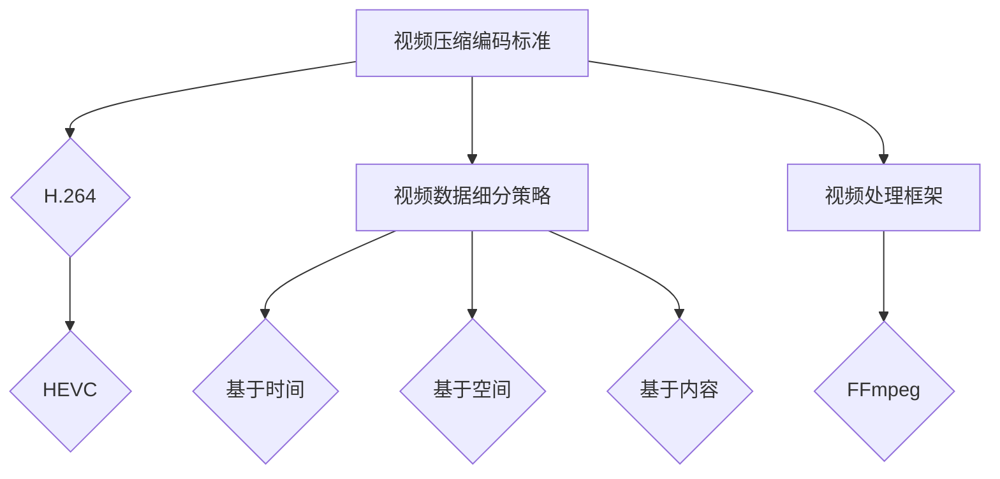

                 

关键词：视频压缩技术、视频数据细分、H.264、HEVC、神经网络、编解码器、质量评估、视频处理框架

> 摘要：本文将探讨视频数据压缩与细分技术的重要性，分析当前最常用的视频压缩编码标准如H.264和HEVC，介绍新兴的神经网络压缩算法，以及视频数据细分的策略和其在实际应用中的表现。此外，文章还将展望未来的发展趋势和挑战。

## 1. 背景介绍

随着视频成为互联网内容的主要形式，视频数据的压缩和细分技术显得尤为重要。视频压缩技术旨在减少视频数据的大小，以便更高效地存储和传输。而视频数据细分技术则关注如何将视频数据分割成更小的部分，以便于索引、搜索和并行处理。

### 1.1 视频压缩的重要性

视频压缩技术对多媒体领域的影响是深远的。它不仅能够减少存储空间的需求，提高数据传输的效率，还能够提升用户观看体验。对于互联网视频服务提供商而言，视频压缩技术是实现高质量流媒体服务的关键。

### 1.2 视频数据细分的意义

视频数据细分有助于优化存储结构，提高搜索效率，并支持视频编辑和转码等操作。此外，它还能为视频内容的个性化推荐提供数据支持。

## 2. 核心概念与联系

为了更好地理解视频压缩与细分技术，我们需要掌握以下几个核心概念，并了解它们之间的联系。

### 2.1 视频压缩编码标准

视频压缩编码标准是一种算法集合，用于将视频数据转换成更小的格式。当前最常用的标准是H.264和HEVC。

### 2.2 视频数据细分策略

视频数据细分策略涉及如何将视频数据分割成更小的片段或场景。常见的策略包括基于时间、空间和内容的细分。

### 2.3 视频处理框架

视频处理框架是支持视频压缩和细分操作的一套工具和库。例如，FFmpeg是一个广泛使用的开源视频处理框架。

下面是一个简单的 Mermaid 流程图，用于展示这些概念之间的联系：



## 3. 核心算法原理 & 具体操作步骤

### 3.1 算法原理概述

视频压缩算法的基本原理是去除视频数据中的冗余信息，通过预测、变换和量化等步骤，将原始视频数据转换成更小的编码数据。

### 3.2 算法步骤详解

1. **预测**：通过预测当前帧与之前帧之间的差异，减少需要编码的数据量。
2. **变换**：将预测误差通过变换（如DCT变换）转换为频域表示，以便进一步压缩。
3. **量化**：通过量化步骤，降低变换后的数据精度，从而实现数据压缩。
4. **编码**：将量化后的数据编码为比特流，以便传输或存储。

### 3.3 算法优缺点

- **H.264**：具有良好的压缩效果，广泛用于互联网视频服务。但压缩效率较低，对硬件要求较高。
- **HEVC**：提供了更高的压缩效率，但解码复杂性较高，对硬件性能要求更高。

### 3.4 算法应用领域

视频压缩算法广泛应用于视频会议、流媒体、视频监控等领域。

## 4. 数学模型和公式

### 4.1 数学模型构建

视频压缩中的数学模型主要包括预测模型、变换模型和量化模型。预测模型通常使用线性预测器或运动估计器；变换模型使用DCT或小波变换；量化模型使用量化矩阵。

### 4.2 公式推导过程

预测误差公式为：\( e(x, y) = v(x, y) - p(x, y) \)

其中，\( v(x, y) \) 为实际像素值，\( p(x, y) \) 为预测像素值。

### 4.3 案例分析与讲解

假设我们有一个简单的视频序列，通过DCT变换和量化操作，可以显著减少数据量。

$$
\text{DCT系数} = \text{DCT}(v(x, y)) = \sum_{u=-\infty}^{\infty} \sum_{v=-\infty}^{\infty} \text{DCT}_{u,v}(v(x, y))
$$

$$
\text{量化} = \text{Quantize}(\text{DCT系数})
$$

通过量化，我们可以将DCT系数映射到一个更小的值域中，从而减少数据量。

## 5. 项目实践：代码实例和详细解释说明

### 5.1 开发环境搭建

在Python环境中安装FFmpeg和OpenCV库，以便进行视频处理。

### 5.2 源代码详细实现

以下是一个简单的Python代码示例，用于实现视频压缩：

```python
import cv2
import numpy as np

# 读取视频
cap = cv2.VideoCapture('input_video.mp4')

# 创建输出视频文件
fourcc = cv2.VideoWriter_fourcc(*'mp4v')
out = cv2.VideoWriter('output_video.mp4', fourcc, 20.0, (640, 480))

while cap.isOpened():
    ret, frame = cap.read()
    if not ret:
        break

    # 压缩视频帧
    compressed_frame = cv2.resize(frame, (320, 240))

    # 写入输出视频文件
    out.write(compressed_frame)

# 释放资源
cap.release()
out.release()
```

### 5.3 代码解读与分析

该代码首先读取输入视频，然后对每一帧进行压缩（如尺寸缩小），最后将压缩后的帧写入输出视频。这种方式虽然简单，但可以显著减少视频数据的大小。

### 5.4 运行结果展示

运行上述代码后，我们可以在输出文件中看到压缩后的视频，其数据量明显减小。

## 6. 实际应用场景

### 6.1 视频会议

视频会议系统常使用视频压缩技术，以提高传输效率，减少带宽需求。

### 6.2 流媒体服务

流媒体服务提供商使用视频压缩技术，以确保高质量的视频传输，同时控制数据成本。

### 6.3 视频监控

视频监控系统中，视频压缩技术用于减少存储空间，提高数据传输效率。

## 7. 未来应用展望

随着人工智能技术的发展，神经网络压缩算法有望进一步优化视频压缩效率。同时，视频数据细分技术也将得到更广泛的应用，支持个性化推荐、视频编辑等更多功能。

## 8. 总结：未来发展趋势与挑战

### 8.1 研究成果总结

近年来，视频压缩与细分技术取得了显著进展，包括H.264和HEVC等编码标准的发布，以及神经网络压缩算法的出现。

### 8.2 未来发展趋势

未来，视频压缩技术将朝着更高压缩效率、更低延迟、更广泛的硬件支持方向发展。

### 8.3 面临的挑战

视频压缩技术面临的挑战包括处理高分辨率视频、支持更多格式、适应不同网络环境等。

### 8.4 研究展望

随着5G和人工智能技术的发展，视频压缩与细分技术有望实现更高效、更智能的应用。

## 9. 附录：常见问题与解答

### 9.1 视频压缩如何影响观看体验？

视频压缩可以减少数据传输时间，提高观看体验。但过度压缩可能导致视频质量下降，出现模糊或噪声。

### 9.2 视频数据细分有哪些具体应用？

视频数据细分可以用于视频编辑、内容推荐、视频检索等领域，提高数据处理效率和个性化服务。

---

作者：禅与计算机程序设计艺术 / Zen and the Art of Computer Programming
```

### 文章结构模板

```
# 视频数据的压缩与细分技术解析

> 关键词：视频压缩技术、视频数据细分、H.264、HEVC、神经网络、编解码器、质量评估、视频处理框架

> 摘要：本文将探讨视频数据压缩与细分技术的重要性，分析当前最常用的视频压缩编码标准如H.264和HEVC，介绍新兴的神经网络压缩算法，以及视频数据细分的策略和其在实际应用中的表现。此外，文章还将展望未来的发展趋势和挑战。

## 1. 背景介绍

### 1.1 视频压缩的重要性

- ...
- ...

### 1.2 视频数据细分的意义

- ...
- ...

## 2. 核心概念与联系

### 2.1 视频压缩编码标准

- H.264
- HEVC

### 2.2 视频数据细分策略

- 基于时间
- 基于空间
- 基于内容

### 2.3 视频处理框架

- FFmpeg


## 3. 核心算法原理 & 具体操作步骤

### 3.1 算法原理概述

- 预测、变换、量化、编码

### 3.2 算法步骤详解

- 预测
- 变换
- 量化
- 编码

### 3.3 算法优缺点

- H.264
- HEVC

### 3.4 算法应用领域

- 视频会议
- 流媒体服务
- 视频监控

## 4. 数学模型和公式

### 4.1 数学模型构建

- 预测模型、变换模型、量化模型

### 4.2 公式推导过程

- 预测误差公式

### 4.3 案例分析与讲解

- DCT变换与量化

## 5. 项目实践：代码实例和详细解释说明

### 5.1 开发环境搭建

- Python环境
- FFmpeg
- OpenCV

### 5.2 源代码详细实现

- Python代码示例

### 5.3 代码解读与分析

- 代码解析

### 5.4 运行结果展示

- 压缩前后对比

## 6. 实际应用场景

### 6.1 视频会议

- ...
- ...

### 6.2 流媒体服务

- ...
- ...

### 6.3 视频监控

- ...
- ...

## 7. 未来应用展望

- 神经网络压缩算法
- 视频数据细分技术

## 8. 总结：未来发展趋势与挑战

### 8.1 研究成果总结

- H.264和HEVC
- 神经网络压缩算法

### 8.2 未来发展趋势

- 更高压缩效率
- 更广的硬件支持

### 8.3 面临的挑战

- 高分辨率视频压缩
- 多格式支持

### 8.4 研究展望

- 5G
- 人工智能

## 9. 附录：常见问题与解答

### 9.1 视频压缩如何影响观看体验？

- 数据传输时间
- 视频质量

### 9.2 视频数据细分有哪些具体应用？

- 视频编辑
- 内容推荐
- 视频检索

---

作者：禅与计算机程序设计艺术 / Zen and the Art of Computer Programming
```

