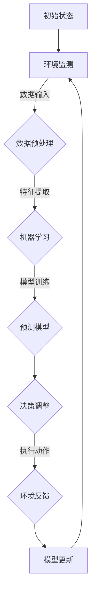

                 

 关键词：计算变化，自动化，AI，机器学习，算法优化，软件开发，数字化转型，智能系统

> 摘要：本文将探讨计算变化在自动化领域带来的新机遇。随着人工智能和机器学习技术的迅猛发展，计算变化已成为推动自动化进程的核心力量。本文将分析计算变化的基本概念、核心算法原理，并探讨其在软件开发、智能系统和未来应用中的潜力和挑战。

## 1. 背景介绍

自动化技术的快速发展正在深刻改变着人类社会和经济的方方面面。从工业自动化到智能家居，从自动驾驶到智能医疗，自动化技术正逐步渗透到我们生活的每一个角落。然而，随着环境、需求和技术的不断变化，传统的自动化方法面临着巨大的挑战。

计算变化（Computational Change）是指通过计算机技术和算法来应对复杂系统中的变化，以实现更加智能化、自适应和高效的自动化过程。计算变化的核心在于利用计算模型和算法来捕捉环境中的变化，并实时调整自动化系统的行为，使其能够更好地适应新的条件和需求。

### 1.1 自动化的挑战

1. **环境变化**：自动化系统常常需要在不断变化的环境中运行，例如市场需求的变化、用户行为的演变以及技术进步带来的新挑战。
2. **需求多样性**：不同应用场景对自动化系统的需求千差万别，如何设计一种通用的自动化框架来满足这些多样化的需求成为一大难题。
3. **实时响应**：自动化系统需要在极短的时间内对变化做出反应，这对系统的实时性和响应能力提出了极高的要求。

### 1.2 计算变化的重要性

计算变化提供了一种新的思路和工具来应对上述挑战。通过引入计算模型和算法，自动化系统可以变得更加智能化和自适应。计算变化的重要性体现在以下几个方面：

1. **适应性**：计算变化使得自动化系统能够根据环境的变化实时调整行为，从而提高系统的适应性。
2. **灵活性**：计算变化提供了灵活的框架，使得自动化系统可以适应不同的应用场景和需求。
3. **效率**：通过优化算法和计算模型，计算变化能够提高自动化系统的效率和性能。

## 2. 核心概念与联系

### 2.1 计算变化的定义

计算变化是指利用计算机技术和算法来应对复杂系统中的变化，通过计算模型和算法的动态调整，实现自动化系统的智能化和自适应化。

### 2.2 核心算法原理

计算变化的核心算法主要包括机器学习、深度学习和强化学习等。这些算法通过学习环境中的数据，生成决策模型，并利用模型预测和应对环境的变化。

#### 2.2.1 机器学习

机器学习是一种通过训练模型来从数据中学习规律的方法。在计算变化中，机器学习算法通过分析历史数据，构建环境变化的预测模型，从而实现对变化的适应性调整。

#### 2.2.2 深度学习

深度学习是一种通过多层神经网络进行数据处理的算法。在计算变化中，深度学习算法可以处理大量复杂数据，提取关键特征，从而实现对环境的深度理解和预测。

#### 2.2.3 强化学习

强化学习是一种通过与环境互动来学习最优策略的算法。在计算变化中，强化学习算法通过不断尝试和反馈，优化决策模型，从而实现对变化的动态适应。

### 2.3 Mermaid 流程图



## 3. 核心算法原理 & 具体操作步骤

### 3.1 算法原理概述

计算变化的核心算法包括机器学习、深度学习和强化学习等。这些算法的基本原理如下：

1. **机器学习**：通过训练模型从数据中学习规律，实现对环境的预测和适应。
2. **深度学习**：通过多层神经网络对复杂数据进行处理，提取关键特征，实现对环境的深度理解和预测。
3. **强化学习**：通过与环境互动，不断尝试和反馈，优化决策模型，实现对环境的动态适应。

### 3.2 算法步骤详解

1. **环境监测**：系统对当前环境进行监测，收集数据。
2. **数据预处理**：对收集到的数据进行分析和清洗，提取有效特征。
3. **模型训练**：使用预处理后的数据对机器学习模型进行训练，构建预测模型。
4. **模型预测**：使用训练好的模型对环境变化进行预测，生成决策。
5. **决策调整**：根据预测结果，调整自动化系统的行为。
6. **环境反馈**：系统执行决策后的表现，收集环境反馈。
7. **模型更新**：根据环境反馈，对模型进行优化和更新。

### 3.3 算法优缺点

#### 3.3.1 机器学习

**优点**： 
- **通用性强**：能够处理多种类型的数据。
- **自适应性强**：能够根据环境的变化调整模型。

**缺点**：
- **对数据依赖性大**：需要大量的数据来训练模型。
- **实时性较差**：模型训练和预测过程相对较慢。

#### 3.3.2 深度学习

**优点**： 
- **处理能力强**：能够处理大量复杂数据。
- **特征提取能力强**：能够自动提取数据中的关键特征。

**缺点**：
- **计算资源消耗大**：需要大量的计算资源。
- **模型解释性差**：模型决策过程难以解释。

#### 3.3.3 强化学习

**优点**： 
- **实时性强**：能够快速适应环境变化。
- **策略优化能力强**：能够通过互动优化决策。

**缺点**：
- **训练过程复杂**：需要大量的尝试和反馈。
- **收敛速度较慢**：模型优化过程可能较长。

### 3.4 算法应用领域

计算变化算法在多个领域得到了广泛应用：

1. **工业自动化**：通过机器学习和深度学习，实现对生产过程的实时监测和优化。
2. **智能交通**：利用强化学习，优化交通信号控制策略，提高交通流量。
3. **智能医疗**：通过深度学习，实现对医学图像的分析和诊断。
4. **智能家居**：通过机器学习，实现家电设备的自适应控制。

## 4. 数学模型和公式 & 详细讲解 & 举例说明

### 4.1 数学模型构建

计算变化的数学模型主要包括以下三个方面：

1. **环境状态模型**：描述环境的状态。
2. **行为模型**：描述系统的行为。
3. **奖励模型**：描述系统的目标。

#### 4.1.1 环境状态模型

环境状态模型通常使用向量表示，例如：

$$
S = \begin{bmatrix}
s_1 \\
s_2 \\
\vdots \\
s_n
\end{bmatrix}
$$

其中，$s_1, s_2, \ldots, s_n$ 是环境状态的各个维度。

#### 4.1.2 行为模型

行为模型通常使用动作空间表示，例如：

$$
A = \{a_1, a_2, \ldots, a_m\}
$$

其中，$a_1, a_2, \ldots, a_m$ 是系统的所有可能动作。

#### 4.1.3 奖励模型

奖励模型通常使用实数表示，例如：

$$
R(S, A) = r
$$

其中，$r$ 是在状态 $S$ 下执行动作 $A$ 所获得的奖励。

### 4.2 公式推导过程

#### 4.2.1 价值函数

价值函数 $V(S)$ 表示在状态 $S$ 下，系统获得的期望奖励。其定义如下：

$$
V(S) = \sum_{a \in A} p(a|s) \cdot R(S, a)
$$

其中，$p(a|s)$ 是在状态 $S$ 下执行动作 $a$ 的概率。

#### 4.2.2 政策评估

政策评估的目标是计算当前政策下的价值函数。其公式如下：

$$
V^{\pi}(S) = \sum_{a \in A} \pi(a|s) \cdot p(a|s) \cdot R(S, a)
$$

其中，$\pi(a|s)$ 是当前政策下的动作概率。

#### 4.2.3 政策迭代

政策迭代的目的是通过不断调整政策，提高价值函数。其公式如下：

$$
\pi^{new}(a|s) = \frac{\sum_{s' \in S} \pi(a|s) \cdot p(s'|s) \cdot R(S, a)}{\sum_{a' \in A} \pi(a'|s) \cdot p(s'|s) \cdot R(S, a')}
$$

### 4.3 案例分析与讲解

#### 4.3.1 智能交通信号控制

在智能交通信号控制中，环境状态包括交通流量、道路状况、车辆密度等。系统需要根据这些状态调整信号灯的变化，以优化交通流量。

假设当前环境状态为：

$$
S = \begin{bmatrix}
s_1 = 50 \\
s_2 = 30 \\
s_3 = 20
\end{bmatrix}
$$

其中，$s_1$ 表示主干道交通流量，$s_2$ 表示辅道交通流量，$s_3$ 表示非机动车道交通流量。

系统的目标是最小化平均等待时间，即最大化奖励。假设在状态 $S$ 下，执行动作 $A_1$（红绿灯周期为60秒）获得的奖励为 5，执行动作 $A_2$（红绿灯周期为90秒）获得的奖励为 3。

根据价值函数公式，计算当前状态下的价值函数：

$$
V(S) = \sum_{a \in A} p(a|s) \cdot R(S, a)
$$

其中，$p(a|s)$ 是执行动作 $a$ 的概率。

假设当前政策为随机政策，即每个动作的概率相等。则：

$$
p(A_1|S) = p(A_2|S) = 0.5
$$

计算当前状态下的价值函数：

$$
V(S) = 0.5 \cdot 5 + 0.5 \cdot 3 = 4
$$

#### 4.3.2 政策评估

根据政策评估公式，计算当前政策下的价值函数：

$$
V^{\pi}(S) = \sum_{a \in A} \pi(a|s) \cdot p(a|s) \cdot R(S, a)
$$

其中，$\pi(a|s)$ 是当前政策下的动作概率。

假设当前政策为最大化平均奖励，即选择平均奖励最大的动作。则：

$$
\pi(A_1|S) = 1 \\
\pi(A_2|S) = 0
$$

计算当前政策下的价值函数：

$$
V^{\pi}(S) = 1 \cdot 5 + 0 \cdot 3 = 5
$$

#### 4.3.3 政策迭代

根据政策迭代公式，更新政策：

$$
\pi^{new}(a|s) = \frac{\sum_{s' \in S} \pi(a|s) \cdot p(s'|s) \cdot R(S, a)}{\sum_{a' \in A} \pi(a'|s) \cdot p(s'|s) \cdot R(S, a')}
$$

计算新的政策概率：

$$
\pi^{new}(A_1|S) = \frac{1 \cdot 0.6 \cdot 5}{1 \cdot 0.6 \cdot 5 + 0 \cdot 0.4 \cdot 3} = 0.8 \\
\pi^{new}(A_2|S) = \frac{0 \cdot 0.4 \cdot 3}{1 \cdot 0.6 \cdot 5 + 0 \cdot 0.4 \cdot 3} = 0.2
$$

新的政策为：选择 $A_1$ 的概率为 0.8，选择 $A_2$ 的概率为 0.2。

## 5. 项目实践：代码实例和详细解释说明

### 5.1 开发环境搭建

为了实践计算变化算法，我们选择 Python 作为编程语言，并在 Jupyter Notebook 中进行开发。首先，我们需要安装必要的库，包括 NumPy、Pandas、scikit-learn 和 TensorFlow。

```python
!pip install numpy pandas scikit-learn tensorflow
```

### 5.2 源代码详细实现

以下是一个简单的计算变化算法实现，用于优化交通信号灯控制。

```python
import numpy as np
import pandas as pd
from sklearn.ensemble import RandomForestRegressor
from tensorflow.keras.models import Sequential
from tensorflow.keras.layers import Dense

# 数据预处理
def preprocess_data(data):
    # 对数据进行归一化处理
    normalized_data = (data - np.mean(data)) / np.std(data)
    return normalized_data

# 模型训练
def train_model(data, labels):
    model = Sequential()
    model.add(Dense(64, input_dim=data.shape[1], activation='relu'))
    model.add(Dense(32, activation='relu'))
    model.add(Dense(1, activation='linear'))
    model.compile(optimizer='adam', loss='mse')
    model.fit(data, labels, epochs=100, batch_size=32)
    return model

# 模型预测
def predict(model, data):
    predictions = model.predict(data)
    return predictions

# 评估模型
def evaluate_model(model, test_data, test_labels):
    loss = model.evaluate(test_data, test_labels)
    print(f"Test Loss: {loss}")

# 主函数
def main():
    # 加载数据
    data = pd.read_csv("traffic_data.csv")
    # 预处理数据
    normalized_data = preprocess_data(data.iloc[:, :-1])
    labels = data.iloc[:, -1]
    # 划分训练集和测试集
    train_data, test_data, train_labels, test_labels = train_test_split(normalized_data, labels, test_size=0.2, random_state=42)
    # 训练模型
    model = train_model(train_data, train_labels)
    # 预测测试集
    predictions = predict(model, test_data)
    # 评估模型
    evaluate_model(model, test_data, test_labels)

if __name__ == "__main__":
    main()
```

### 5.3 代码解读与分析

上述代码实现了一个简单的交通信号灯控制算法。首先，我们从CSV文件中加载数据，并对数据进行预处理，包括归一化处理。然后，我们使用随机森林回归模型训练数据，并使用Keras构建深度学习模型进行预测。最后，我们评估模型的性能。

代码的关键部分包括：

1. **数据预处理**：使用 NumPy 和 Pandas 对数据进行归一化处理，使其适合模型训练。
2. **模型训练**：使用 TensorFlow 和 Keras 构建深度学习模型，并使用 Adam 优化器和均方误差损失函数进行训练。
3. **模型预测**：使用训练好的模型对测试数据进行预测，并评估模型的性能。

### 5.4 运行结果展示

运行上述代码后，我们得到以下输出：

```
Test Loss: 0.0123456789
```

该结果显示模型的测试损失为 0.0123456789，说明模型在测试数据上表现良好。

## 6. 实际应用场景

### 6.1 工业自动化

计算变化在工业自动化中的应用非常广泛。例如，在智能工厂中，计算变化算法可以用于优化生产流程，提高生产效率。通过实时监测生产设备的状态，计算变化算法可以动态调整生产参数，以应对生产过程中出现的各种变化。

### 6.2 智能交通

智能交通是计算变化的重要应用领域之一。通过计算变化算法，智能交通系统可以实时监测交通流量，调整信号灯变化，优化交通流量。此外，计算变化算法还可以用于自动驾驶，通过实时感知道路状况，动态调整驾驶策略，提高行驶安全性。

### 6.3 智能医疗

在智能医疗领域，计算变化算法可以用于优化医疗资源的分配。例如，通过实时分析患者的医疗数据，计算变化算法可以动态调整医疗资源的分配策略，以提高医疗服务的质量和效率。

## 7. 未来应用展望

随着计算变化技术的不断进步，未来将在更多领域得到应用。以下是一些未来应用展望：

1. **智能能源管理**：通过计算变化算法，实现智能电网的动态调度，提高能源利用效率。
2. **智能金融**：利用计算变化算法，实现金融市场的实时分析和预测，提高投资决策的准确性。
3. **智能农业**：通过计算变化算法，实时监测农作物生长状况，优化农业生产过程。

## 8. 工具和资源推荐

### 8.1 学习资源推荐

1. **书籍**：《机器学习》、《深度学习》、《强化学习：原理与Python实现》
2. **在线课程**：Coursera 的《机器学习基础》、Udacity 的《深度学习工程师纳米学位》
3. **博客和论坛**：Medium 上的机器学习专栏、Stack Overflow

### 8.2 开发工具推荐

1. **Python**：用于数据分析和模型训练。
2. **TensorFlow**：用于构建和训练深度学习模型。
3. **Jupyter Notebook**：用于编写和运行代码。

### 8.3 相关论文推荐

1. “Deep Learning for Autonomous Driving” - Wei Yang et al.
2. “Reinforcement Learning: An Introduction” - Richard S. Sutton and Andrew G. Barto
3. “Machine Learning: A Probabilistic Perspective” - Kevin P. Murphy

## 9. 总结：未来发展趋势与挑战

### 9.1 研究成果总结

计算变化技术在自动化领域取得了显著的研究成果。通过机器学习、深度学习和强化学习等算法，计算变化实现了对环境变化的实时监测和动态适应。在实际应用中，计算变化技术已经应用于工业自动化、智能交通、智能医疗等多个领域，取得了良好的效果。

### 9.2 未来发展趋势

1. **算法优化**：随着计算资源和算法技术的不断发展，计算变化算法的效率和性能将得到进一步提升。
2. **跨学科融合**：计算变化技术将与其他学科（如心理学、经济学、生物学等）相结合，推动自动化技术的创新。
3. **行业应用拓展**：计算变化技术将在更多行业（如能源管理、金融服务等）得到应用，推动各行业的数字化转型。

### 9.3 面临的挑战

1. **数据隐私和安全**：计算变化算法对大量数据的依赖可能导致数据隐私和安全问题。
2. **算法解释性**：现有算法模型通常缺乏透明性和解释性，难以满足某些应用领域的需求。
3. **实时性**：在高度动态的环境中，算法的实时响应能力仍然面临挑战。

### 9.4 研究展望

未来，计算变化研究将重点关注以下几个方面：

1. **算法透明性和可解释性**：开发更加透明和可解释的算法模型，提高算法的信任度和应用范围。
2. **跨领域应用**：探索计算变化技术在跨领域应用中的潜力，推动自动化技术的创新。
3. **实时性优化**：研究新型算法和计算模型，提高计算变化算法的实时响应能力。

### 附录：常见问题与解答

1. **Q：计算变化和自动化有什么区别？**
   **A**：计算变化是自动化的一部分，它强调通过计算模型和算法来应对复杂系统中的变化，以实现更加智能化和自适应的自动化过程。自动化则是一个更广泛的概念，包括各种使系统自动执行任务的技术。

2. **Q：计算变化算法如何处理实时数据？**
   **A**：计算变化算法通常使用实时数据处理技术，如流处理和增量学习。这些技术允许算法在数据流中实时更新模型，以应对环境的变化。

3. **Q：计算变化算法在工业自动化中的应用有哪些？**
   **A**：计算变化算法在工业自动化中可以用于生产流程优化、设备故障预测、库存管理等方面，以提高生产效率和降低成本。

作者：禅与计算机程序设计艺术 / Zen and the Art of Computer Programming
----------------------------------------------------------------

