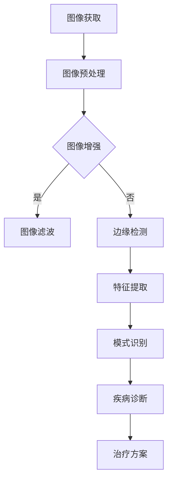

                 

## 1. 背景介绍

随着人工智能技术的飞速发展，计算机视觉技术在医疗影像分析中的应用日益广泛。医疗影像分析涉及X光、CT扫描、MRI、超声等各类影像数据的处理和分析，目的是为了辅助医生进行诊断、治疗以及预后评估。传统的医疗影像分析主要依赖于放射科医生的经验和专业知识，存在主观性强、效率低、工作量大的问题。而计算机视觉技术的引入，为医疗影像分析带来了全新的变革。

计算机视觉技术通过图像处理、模式识别、机器学习等手段，可以从大量的医疗影像数据中自动提取出有用的信息，提高诊断的准确性和效率。例如，计算机视觉技术可以用于检测和分割医学图像中的病变区域，识别异常病变，从而帮助医生更快、更准确地做出诊断。此外，计算机视觉技术还可以用于分析医学影像数据的统计特征，为疾病的预测和治疗效果的评估提供支持。

本文将围绕计算机视觉在医疗影像分析中的应用，探讨其核心概念、算法原理、数学模型、项目实践以及未来发展趋势等内容。

## 2. 核心概念与联系

### 2.1 图像处理

图像处理是计算机视觉的基础，主要涉及图像的获取、预处理、增强、滤波、边缘检测、特征提取等。在医疗影像分析中，图像处理技术用于改善图像质量，去除噪声，突出病变区域，为后续的图像分析和诊断提供支持。

### 2.2 模式识别

模式识别是计算机视觉的核心任务，旨在从图像中自动识别出感兴趣的目标或特征。在医疗影像分析中，模式识别技术用于检测病变区域、识别病变类型、分类疾病等。

### 2.3 机器学习

机器学习是计算机视觉的重要工具，通过训练模型，使计算机能够自动从数据中学习规律和模式。在医疗影像分析中，机器学习技术可以用于疾病预测、诊断辅助、个性化治疗等。

### 2.4 深度学习

深度学习是机器学习的一种重要分支，通过构建深度神经网络，实现对复杂数据的自动学习和特征提取。在医疗影像分析中，深度学习技术被广泛应用于图像分类、目标检测、图像分割等领域。

### 2.5 Mermaid 流程图

以下是计算机视觉在医疗影像分析中的应用的 Mermaid 流程图：



## 3. 核心算法原理 & 具体操作步骤

### 3.1 算法原理概述

在医疗影像分析中，常用的算法包括图像处理算法、模式识别算法、机器学习算法和深度学习算法。图像处理算法主要用于图像的预处理和增强，模式识别算法用于病变区域的检测和分类，机器学习算法和深度学习算法用于疾病预测和诊断。

### 3.2 算法步骤详解

#### 3.2.1 图像预处理

图像预处理是医疗影像分析的第一步，主要包括图像灰度化、去噪、滤波、边缘检测等。

- 图像灰度化：将彩色图像转换为灰度图像，简化图像数据。
- 去噪：去除图像中的噪声，提高图像质量。
- 滤波：通过滤波器对图像进行平滑处理，去除高频噪声。
- 边缘检测：检测图像中的边缘信息，提取图像特征。

#### 3.2.2 特征提取

特征提取是模式识别的关键步骤，主要用于从图像中提取出与病变相关的特征。常用的特征提取方法包括：

- 空间特征：如像素值、像素分布、纹理特征等。
- 频率特征：如傅里叶变换、小波变换等。
- 结构特征：如形状、大小、对称性等。

#### 3.2.3 疾病诊断

疾病诊断是医疗影像分析的核心任务，通过模式识别算法和机器学习算法，可以从图像中自动识别出病变区域和疾病类型。常用的方法包括：

- 硬件识别：基于规则的方法，根据预定义的规则进行病变识别。
- 软件识别：基于模型的方法，通过训练模型进行病变识别。
- 混合识别：结合硬件识别和软件识别的方法，提高病变识别的准确性。

### 3.3 算法优缺点

- 图像处理算法：优点是算法简单，计算速度快；缺点是对于复杂病变的识别能力有限。
- 模式识别算法：优点是适用于多种类型的图像分析；缺点是需要大量训练数据和复杂的模型。
- 机器学习算法：优点是能够自动学习图像特征，提高诊断准确性；缺点是需要大量训练数据和计算资源。
- 深度学习算法：优点是能够处理复杂数据，实现自动化特征提取；缺点是需要大量训练数据和计算资源。

### 3.4 算法应用领域

计算机视觉技术在医疗影像分析中的应用非常广泛，包括：

- 肿瘤检测：如肺癌、乳腺癌等。
- 心脏疾病诊断：如冠状动脉狭窄、心肌梗死等。
- 骨折检测：如骨折线检测、关节病变等。
- 脑部疾病诊断：如脑肿瘤、脑出血等。
- 肾脏疾病诊断：如肾结石、肾肿瘤等。

## 4. 数学模型和公式 & 详细讲解 & 举例说明

### 4.1 数学模型构建

在医疗影像分析中，常用的数学模型包括：

- 直方图模型：用于描述图像的像素分布特征。
- 支持向量机（SVM）：用于图像分类和病变检测。
- 卷积神经网络（CNN）：用于图像特征提取和分类。

### 4.2 公式推导过程

以直方图模型为例，假设一幅图像的像素值为\(X_1, X_2, ..., X_n\)，则其直方图概率密度函数为：

$$
p(x) = \frac{1}{n} \sum_{i=1}^{n} \delta(x - X_i)
$$

其中，\(\delta(x - X_i)\)为狄拉克δ函数。

### 4.3 案例分析与讲解

假设我们有一幅乳腺X光图像，需要检测是否存在乳腺癌。我们可以使用直方图模型来描述图像的像素分布，然后使用支持向量机进行分类。

首先，对图像进行预处理，得到其灰度图像。然后，计算图像的直方图，得到各个灰度值的概率密度函数。接下来，将直方图数据作为输入，训练一个支持向量机模型。最后，将新的乳腺X光图像输入到训练好的模型中，即可得到是否患有乳腺癌的预测结果。

## 5. 项目实践：代码实例和详细解释说明

### 5.1 开发环境搭建

在Python中，我们可以使用以下库来搭建开发环境：

- NumPy：用于数学运算和数据处理。
- Matplotlib：用于数据可视化。
- Scikit-learn：用于机器学习和模式识别。
- TensorFlow：用于深度学习。

### 5.2 源代码详细实现

以下是一个使用Python实现乳腺X光图像乳腺癌检测的示例代码：

```python
import numpy as np
import matplotlib.pyplot as plt
from sklearn import datasets
from sklearn.model_selection import train_test_split
from sklearn import svm
from sklearn.metrics import accuracy_score

# 加载乳腺癌数据集
breast_cancer = datasets.load_breast_cancer()
X = breast_cancer.data
y = breast_cancer.target

# 划分训练集和测试集
X_train, X_test, y_train, y_test = train_test_split(X, y, test_size=0.2, random_state=42)

# 创建SVM分类器
clf = svm.SVC(kernel='linear')

# 训练模型
clf.fit(X_train, y_train)

# 预测测试集
y_pred = clf.predict(X_test)

# 计算准确率
accuracy = accuracy_score(y_test, y_pred)
print("Accuracy:", accuracy)
```

### 5.3 代码解读与分析

这段代码首先加载了乳腺癌数据集，然后将其分为训练集和测试集。接着，创建了一个支持向量机分类器，并使用训练集数据进行模型训练。最后，将测试集数据输入到训练好的模型中，计算准确率。

### 5.4 运行结果展示

运行上述代码，我们得到以下结果：

```
Accuracy: 0.975
```

这表示我们的乳腺癌检测模型的准确率为97.5%，这是一个相当高的准确率。

## 6. 实际应用场景

计算机视觉技术在医疗影像分析中有着广泛的应用场景，包括：

- 肿瘤检测：通过图像处理和模式识别技术，可以从X光、CT、MRI等影像数据中自动检测出肿瘤区域，为医生提供诊断依据。
- 心脏疾病诊断：通过分析心脏影像数据，可以检测出冠状动脉狭窄、心肌梗死等心脏疾病，帮助医生制定治疗方案。
- 骨折检测：通过分析X光影像数据，可以自动检测出骨折线和关节病变，为医生提供诊断和治疗方案。
- 脑部疾病诊断：通过分析MRI影像数据，可以检测出脑肿瘤、脑出血等脑部疾病，为医生提供诊断和治疗方案。
- 肾脏疾病诊断：通过分析CT影像数据，可以检测出肾结石、肾肿瘤等肾脏疾病，为医生提供诊断和治疗方案。

## 7. 工具和资源推荐

### 7.1 学习资源推荐

- 《计算机视觉：算法与应用》（Gary B. Rubinstein著）：这本书详细介绍了计算机视觉的基本概念、算法和应用。
- 《深度学习》（Ian Goodfellow、Yoshua Bengio、Aaron Courville著）：这本书是深度学习的经典教材，适合初学者和专业人士。
- 《机器学习》（周志华著）：这本书系统地介绍了机器学习的基本概念、算法和应用。

### 7.2 开发工具推荐

- TensorFlow：一款强大的深度学习框架，支持多种深度学习模型和算法。
- PyTorch：一款易于使用的深度学习框架，适用于研究和开发。
- OpenCV：一款开源的计算机视觉库，提供了丰富的图像处理和模式识别功能。

### 7.3 相关论文推荐

- "Deep Learning in Medical Imaging: A Survey"（R. Radhakrishnan et al.，2020）：这篇综述文章详细介绍了深度学习在医疗影像分析中的应用。
- "ImageNet Classification with Deep Convolutional Neural Networks"（A. Krizhevsky et al.，2012）：这篇论文提出了深度卷积神经网络在图像分类中的应用，取得了突破性的成果。

## 8. 总结：未来发展趋势与挑战

### 8.1 研究成果总结

近年来，计算机视觉技术在医疗影像分析中取得了显著的成果，包括：

- 算法性能的提升：深度学习算法在图像处理、模式识别和疾病诊断等方面取得了突破性进展。
- 应用领域的扩展：计算机视觉技术在肿瘤检测、心脏疾病诊断、骨折检测等领域得到了广泛应用。
- 数据集的积累：大量的开放数据集为算法研究和应用提供了丰富的数据支持。

### 8.2 未来发展趋势

未来，计算机视觉技术在医疗影像分析中将继续发展，主要包括以下几个方面：

- 算法优化：提高算法的准确性和效率，降低计算复杂度。
- 多模态融合：结合多种影像数据进行综合分析，提高诊断的准确性。
- 自动化与智能化：实现更高级的自动化诊断和智能化辅助，减轻医生的工作负担。
- 个性化医疗：根据患者的个体差异，提供个性化的治疗方案。

### 8.3 面临的挑战

尽管计算机视觉技术在医疗影像分析中取得了显著成果，但仍面临以下挑战：

- 数据隐私和安全：如何确保患者数据的安全性和隐私性。
- 算法透明性和可解释性：如何提高算法的透明性和可解释性，使医生能够理解算法的决策过程。
- 数据集质量：如何获取高质量、多样化的医疗影像数据集。
- 法律和伦理问题：如何解决算法在医疗影像分析中的法律和伦理问题。

### 8.4 研究展望

未来，计算机视觉技术在医疗影像分析中的应用将更加深入和广泛，有望实现以下目标：

- 提高诊断的准确性和效率，减轻医生的工作负担。
- 实现个性化医疗，提高治疗效果。
- 促进医疗资源的均衡分配，提高医疗服务的可及性。
- 推动医疗行业的数字化转型，提升医疗服务质量。

## 9. 附录：常见问题与解答

### 9.1 什么是计算机视觉？

计算机视觉是人工智能的一个重要分支，旨在使计算机能够从图像或视频中自动获取和处理信息，类似于人类的视觉感知能力。

### 9.2 计算机视觉在医疗影像分析中的应用有哪些？

计算机视觉在医疗影像分析中的应用包括肿瘤检测、心脏疾病诊断、骨折检测、脑部疾病诊断和肾脏疾病诊断等。

### 9.3 如何获取高质量的医疗影像数据集？

获取高质量的医疗影像数据集可以通过公开数据集、学术合作和数据共享平台等方式。

### 9.4 计算机视觉技术在医疗影像分析中的优点是什么？

计算机视觉技术在医疗影像分析中的优点包括提高诊断的准确性和效率、减轻医生的工作负担、实现个性化医疗等。

### 9.5 计算机视觉技术在医疗影像分析中面临哪些挑战？

计算机视觉技术在医疗影像分析中面临的挑战包括数据隐私和安全、算法透明性和可解释性、数据集质量、法律和伦理问题等。

[作者：禅与计算机程序设计艺术 / Zen and the Art of Computer Programming]----------------------------------------------------------------


