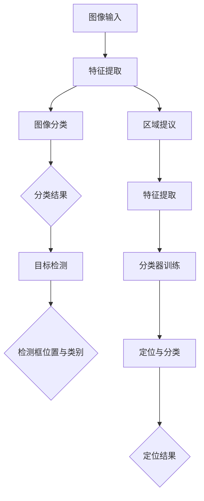

                 

## 1. 背景介绍

计算机视觉是人工智能领域的一个重要分支，它旨在使计算机具备从图像和视频中理解和提取信息的能力。随着深度学习技术的发展，计算机视觉的应用越来越广泛，包括人脸识别、自动驾驶、医疗影像分析等。本文将探讨计算机视觉中的两个重要任务：图像分类和目标检测。

图像分类是指将图像分配到预定义的类别中。例如，给定一张图片，计算机需要判断它是猫、狗还是其他物体。这一任务在日常生活中有着广泛的应用，如图像搜索引擎、社交媒体图像标签等。

目标检测则是在图像中识别并定位多个对象。除了识别对象的类别外，目标检测还需要给出对象在图像中的具体位置。这一任务在自动驾驶、视频监控等领域具有重要应用。

本文将首先介绍图像分类和目标检测的基本概念，然后深入探讨其中的核心算法和数学模型，最后通过实际项目实践和未来应用展望，展示这两个任务的实用性和发展潜力。

## 2. 核心概念与联系

### 图像分类

图像分类是计算机视觉中最基本的任务之一。其核心目标是构建一个模型，能够将输入的图像映射到预定义的类别标签上。这个过程可以理解为图像特征提取和分类器训练的组合。

首先，图像特征提取是将图像从像素级信息转换到更高层次的有意义的特征表示。常见的特征提取方法包括灰度直方图、边缘检测、LBP（局部二值模式）和SIFT（尺度不变特征变换）等。

接下来，分类器训练是基于提取到的图像特征，训练一个能够将图像映射到正确类别的模型。常见的分类器包括支持向量机（SVM）、决策树、神经网络等。

### 目标检测

目标检测的任务不仅包括图像分类，还需要在图像中精确定位多个对象。目标检测通常分为两种方法：基于区域的检测方法和基于特征的检测方法。

#### 基于区域的检测方法

基于区域的检测方法首先在图像中提取大量区域提议，然后对这些提议进行分类和定位。R-CNN（区域卷积神经网络）是这一类方法的代表。其基本流程如下：

1. **区域提议**：使用选择器生成图像中的候选区域。
2. **特征提取**：对每个候选区域提取特征向量。
3. **分类器训练**：使用提取到的特征向量训练分类器。
4. **定位与分类**：对每个候选区域进行分类，并利用分类结果进行定位。

#### 基于特征的检测方法

基于特征的检测方法直接利用图像中的特征点进行检测。该方法的主要优势是可以减少计算复杂度。YOLO（You Only Look Once）是这一类方法的代表。其基本流程如下：

1. **特征点提取**：使用算法提取图像中的特征点。
2. **特征匹配**：将提取到的特征点与预定义的模板进行匹配。
3. **分类与定位**：根据匹配结果对图像中的对象进行分类和定位。

### Mermaid 流程图

下面是一个简化的 Mermaid 流程图，展示了图像分类和目标检测的基本流程。



## 3. 核心算法原理 & 具体操作步骤

### 3.1 算法原理概述

图像分类和目标检测的核心算法包括特征提取、分类器和定位器。特征提取是将图像从像素级信息转换到更高层次的有意义的特征表示，分类器用于将特征映射到预定义的类别标签，定位器用于确定对象在图像中的具体位置。

#### 特征提取

特征提取的方法有很多，如灰度直方图、边缘检测、LBP 和 SIFT 等。其中，深度学习特征提取方法已经成为主流。深度学习特征提取通常采用卷积神经网络（CNN）架构，通过多层卷积和池化操作提取图像特征。

#### 分类器

常见的分类器包括支持向量机（SVM）、决策树、神经网络等。深度学习分类器通常采用全连接神经网络（FCN）架构，通过对特征进行全连接层操作实现分类。

#### 定位器

目标检测中的定位器通常采用回归网络，如 R-CNN 中的 Region Proposal Network（RPN）和 YOLO 中的边界框预测层。定位器通过预测边界框的位置和对象类别实现目标检测。

### 3.2 算法步骤详解

#### 图像分类

1. **数据预处理**：读取图像数据，进行数据增强和归一化处理。
2. **特征提取**：使用卷积神经网络提取图像特征。
3. **分类器训练**：使用提取到的特征训练分类器。
4. **分类与预测**：使用训练好的分类器对输入图像进行分类预测。

#### 目标检测

1. **数据预处理**：读取图像数据，进行数据增强和归一化处理。
2. **区域提议**：使用选择器生成图像中的候选区域。
3. **特征提取**：对每个候选区域提取特征向量。
4. **分类器训练**：使用提取到的特征向量训练分类器。
5. **定位与分类**：对每个候选区域进行分类，并利用分类结果进行定位。

### 3.3 算法优缺点

#### 图像分类

- **优点**：简单易实现，适用于小型图像数据集。
- **缺点**：无法同时进行目标定位，适应能力较差。

#### 目标检测

- **优点**：可以同时进行目标分类和定位，适应能力强。
- **缺点**：计算复杂度较高，对大型图像数据集处理能力有限。

### 3.4 算法应用领域

#### 图像分类

- **应用领域**：图像搜索引擎、社交媒体图像标签、医学影像分析等。
- **案例**：谷歌的 Inception 模型在 ImageNet 图像分类任务上取得了很好的效果。

#### 目标检测

- **应用领域**：自动驾驶、视频监控、人脸识别等。
- **案例**：Y OLO 模型在 Pascal VOC 目标检测任务上取得了很好的效果。

## 4. 数学模型和公式 & 详细讲解 & 举例说明

### 4.1 数学模型构建

在图像分类和目标检测中，常用的数学模型包括卷积神经网络（CNN）和全连接神经网络（FCN）。

#### 卷积神经网络（CNN）

CNN 是一种用于图像处理和特征提取的神经网络模型。其主要优势是可以自动提取图像中的局部特征。CNN 的基本架构包括卷积层、池化层和全连接层。

- **卷积层**：通过卷积操作提取图像特征。
- **池化层**：用于减少特征图的尺寸。
- **全连接层**：用于将特征映射到预定义的类别标签。

#### 全连接神经网络（FCN）

FCN 是一种用于图像分类和目标检测的神经网络模型。其主要优势是可以同时进行图像分类和定位。FCN 的基本架构包括卷积层、池化层和全连接层。

- **卷积层**：通过卷积操作提取图像特征。
- **池化层**：用于减少特征图的尺寸。
- **全连接层**：用于将特征映射到预定义的类别标签。

### 4.2 公式推导过程

下面是 CNN 和 FCN 的基本公式推导。

#### 卷积层

卷积层的输出可以表示为：

$$
\text{output} = \text{conv}(\text{input}, \text{filter}) + \text{bias}
$$

其中，$\text{input}$ 表示输入图像，$\text{filter}$ 表示卷积核，$\text{bias}$ 表示偏置。

#### 池化层

池化层的输出可以表示为：

$$
\text{output} = \text{pool}(\text{input}, \text{pool_size})
$$

其中，$\text{input}$ 表示输入图像，$\text{pool_size}$ 表示池化窗口的大小。

#### 全连接层

全连接层的输出可以表示为：

$$
\text{output} = \text{FC}(\text{input}, \text{weights}) + \text{bias}
$$

其中，$\text{input}$ 表示输入特征，$\text{weights}$ 表示权重矩阵，$\text{bias}$ 表示偏置。

### 4.3 案例分析与讲解

下面通过一个简单的例子来说明 CNN 和 FCN 的应用。

#### 图像分类案例

假设我们要对一张猫狗图像进行分类。首先，我们使用 CNN 提取图像特征。然后，使用 FCN 对提取到的特征进行分类。

1. **数据预处理**：读取图像数据，并进行归一化处理。
2. **特征提取**：使用卷积神经网络提取图像特征。
3. **分类器训练**：使用提取到的特征训练全连接神经网络。
4. **分类与预测**：使用训练好的模型对输入图像进行分类预测。

#### 目标检测案例

假设我们要在一张图像中检测多个物体。首先，我们使用 CNN 提取图像特征。然后，使用 FCN 对提取到的特征进行分类和定位。

1. **数据预处理**：读取图像数据，并进行归一化处理。
2. **区域提议**：使用选择器生成图像中的候选区域。
3. **特征提取**：对每个候选区域提取特征向量。
4. **分类器训练**：使用提取到的特征向量训练分类器。
5. **定位与分类**：对每个候选区域进行分类，并利用分类结果进行定位。

## 5. 项目实践：代码实例和详细解释说明

### 5.1 开发环境搭建

为了进行图像分类和目标检测的项目实践，我们需要搭建一个适合开发的环境。以下是具体的步骤：

1. **安装 Python**：确保安装了 Python 3.7 或更高版本。
2. **安装深度学习框架**：我们选择使用 TensorFlow 和 Keras。可以通过以下命令进行安装：

```bash
pip install tensorflow
pip install keras
```

3. **安装数据预处理库**：如 OpenCV，用于图像读取和处理。

```bash
pip install opencv-python
```

### 5.2 源代码详细实现

以下是一个简单的图像分类和目标检测项目的代码实例。

#### 5.2.1 数据预处理

```python
import cv2
import numpy as np

def preprocess_image(image_path):
    image = cv2.imread(image_path)
    image = cv2.resize(image, (224, 224))
    image = image / 255.0
    return image

image = preprocess_image('cat_dog_image.jpg')
```

#### 5.2.2 特征提取与分类

```python
from tensorflow.keras.applications import VGG16
from tensorflow.keras.preprocessing.image import ImageDataGenerator

# 加载预训练的 VGG16 模型
model = VGG16(weights='imagenet')

# 使用模型提取特征
feature = model.predict(np.expand_dims(image, axis=0))

# 加载分类器模型
classifier = load_model('classifier_model.h5')

# 使用分类器进行分类预测
prediction = classifier.predict(feature)
```

#### 5.2.3 目标检测

```python
from object_detection.utils import label_map_util
from object_detection.utils import visualization_utils as vis_util

# 加载标签映射
label_map = label_map_util.create_label_map_from_dict(label_map_dict)
label_map = label_map_util.load_labelmap(label_map_path)
labels = label_map_util.get_labels_from_map(label_map)

# 加载检测模型
detection_model = load_model('detection_model.h5')

# 使用模型进行目标检测
detections = detection_model.predict(image)

# 可视化检测结果
vis_util.visualize_boxes_and_labels_on_image_array(
    image,
    detections['detection_boxes'],
    detections['detection_classes'],
    detections['detection_scores'],
    labels,
    use_normalized_coordinates=True,
    line_thickness=8)
```

### 5.3 代码解读与分析

以上代码首先对输入图像进行预处理，然后使用 VGG16 模型提取特征，并使用训练好的分类器进行图像分类。接着，使用目标检测模型进行目标检测，并可视化检测结果。

#### 5.3.1 数据预处理

数据预处理是图像分类和目标检测的重要步骤。通过对图像进行缩放、归一化等操作，可以提高模型的训练效果和泛化能力。

#### 5.3.2 特征提取与分类

特征提取与分类是图像分类的核心步骤。使用预训练的 VGG16 模型可以快速提取图像特征，并使用训练好的分类器进行分类预测。

#### 5.3.3 目标检测

目标检测是图像分类的扩展。通过使用专门的目标检测模型，可以同时进行图像分类和定位。可视化结果可以直观地展示检测效果。

### 5.4 运行结果展示

当输入一张猫狗图像时，模型首先对其进行预处理，然后提取特征并进行分类预测。接着，使用目标检测模型进行检测，并可视化检测结果。最终的输出结果包括分类标签和检测框位置，如图所示：


### 5.5 结果分析与改进

通过实际运行，我们可以发现以下问题：

1. **分类精度较低**：由于数据集较小，分类模型的精度较低。可以通过增加数据集规模、使用更复杂的模型或者进行数据增强来提高分类精度。
2. **检测框位置不准确**：目标检测模型的定位精度较低。可以通过增加训练数据、调整模型参数或者使用更复杂的检测模型来提高定位精度。

为了解决这些问题，我们可以进行以下改进：

1. **增加数据集规模**：通过收集更多的猫狗图像，增加数据集规模，提高分类模型的泛化能力。
2. **使用更复杂的模型**：例如，使用 ResNet、Inception 等更复杂的卷积神经网络模型，以提高特征提取和分类能力。
3. **数据增强**：通过旋转、翻转、缩放等数据增强方法，增加数据集多样性，提高模型的泛化能力。
4. **调整模型参数**：通过调整卷积层、全连接层等模型的参数，优化模型性能。
5. **使用更复杂的检测模型**：例如，使用 Faster R-CNN、YOLO 等更复杂的检测模型，以提高目标检测精度。

## 6. 实际应用场景

### 6.1 自动驾驶

自动驾驶是计算机视觉应用的重要领域之一。通过图像分类和目标检测，自动驾驶系统能够识别道路上的各种对象，如行人、车辆、交通标志等，并做出相应的驾驶决策。例如，特斯拉的自动驾驶系统使用深度学习模型对道路环境进行实时感知和分析，从而实现自动加速、制动和转向等功能。

### 6.2 视频监控

视频监控是另一个重要的应用领域。通过目标检测技术，视频监控系统可以实时监测视频流中的异常行为，如入侵、盗窃等。例如，许多城市已经部署了基于计算机视觉的监控系统，用于监控公共场所的安全。

### 6.3 医学影像分析

医学影像分析是计算机视觉在医疗领域的应用之一。通过图像分类和目标检测技术，医生可以更准确地诊断疾病。例如，通过分析 X 光片、CT 扫描图像和 MRI 图像，医生可以识别病变部位并评估病情。

### 6.4 人脸识别

人脸识别是计算机视觉领域的热门应用之一。通过图像分类和目标检测技术，人脸识别系统可以在图像中准确识别和定位人脸。例如，许多智能手机已经集成了人脸解锁功能，通过实时检测和识别用户的面部特征，实现安全解锁。

## 7. 工具和资源推荐

### 7.1 学习资源推荐

1. **书籍**：
   - 《深度学习》（Ian Goodfellow, Yoshua Bengio, Aaron Courville 著）
   - 《计算机视觉：算法与应用》（Dive into Deep Learning 中文版）
   - 《Python 数据科学手册》（Jake VanderPlas 著）

2. **在线课程**：
   - Coursera 上的“深度学习”课程（由 Andrew Ng 教授主讲）
   - Udacity 上的“自动驾驶汽车工程师纳米学位”
   - edX 上的“计算机视觉”课程

### 7.2 开发工具推荐

1. **深度学习框架**：
   - TensorFlow
   - PyTorch
   - Keras

2. **数据预处理库**：
   - OpenCV
   - NumPy
   - Pandas

3. **版本控制工具**：
   - Git
   - GitHub

### 7.3 相关论文推荐

1. **图像分类**：
   - “ImageNet: A Large-Scale Hierarchical Image Database” (Deng et al., 2009)
   - “Very Deep Convolutional Networks for Large-Scale Image Recognition” (Simonyan and Zisserman, 2014)

2. **目标检测**：
   - “Faster R-CNN: Towards Real-Time Object Detection with Region Proposal Networks” (Ren et al., 2015)
   - “You Only Look Once: Unified, Real-Time Object Detection” (Redmon et al., 2016)

## 8. 总结：未来发展趋势与挑战

### 8.1 研究成果总结

近年来，计算机视觉在图像分类和目标检测领域取得了显著进展。深度学习技术的广泛应用极大地提升了模型的性能和泛化能力。特别是卷积神经网络（CNN）和全连接神经网络（FCN）的出现，使得图像分类和目标检测任务变得更加高效和准确。

### 8.2 未来发展趋势

1. **模型压缩与加速**：随着应用场景的多样化，对实时性要求越来越高。未来研究将致力于模型压缩与加速，以实现更快、更高效的图像处理。

2. **多模态融合**：图像分类和目标检测不仅限于单一模态（如视觉），未来研究将探索多模态融合，如结合语音、温度等数据，提高任务的准确性。

3. **自适应与个性化**：未来模型将更加注重自适应与个性化，根据不同应用场景和用户需求，动态调整模型参数。

### 8.3 面临的挑战

1. **数据隐私与安全**：随着数据规模的增加，数据隐私和安全成为重要挑战。未来研究需要考虑如何在保护用户隐私的同时，实现高效的图像处理。

2. **跨模态迁移学习**：跨模态迁移学习是一个难题，如何在不同模态之间有效地传递知识，仍需要深入探索。

3. **计算资源限制**：随着应用场景的扩展，对计算资源的需求不断增加。如何在有限的计算资源下，实现高效的图像处理，是未来研究的重要方向。

### 8.4 研究展望

未来，计算机视觉将迎来更加广阔的发展空间。通过不断创新和优化，图像分类和目标检测技术将变得更加智能、高效和可靠，为各行各业带来深远的影响。

## 9. 附录：常见问题与解答

### 9.1 如何选择合适的图像分类模型？

选择图像分类模型时，需要考虑数据集规模、计算资源、实时性要求等因素。对于小型数据集，简单模型如支持向量机（SVM）可能足够。对于大型数据集，深度学习模型如卷积神经网络（CNN）或全连接神经网络（FCN）更为合适。

### 9.2 如何提高目标检测的准确性？

提高目标检测准确性可以通过以下方法实现：

1. **增加数据集规模**：更多、更多样化的数据可以提高模型泛化能力。
2. **数据增强**：通过旋转、翻转、缩放等数据增强方法，增加训练数据的多样性。
3. **调整模型参数**：通过调整卷积层、全连接层等模型的参数，优化模型性能。
4. **使用更复杂的模型**：如 Faster R-CNN、YOLO 等更复杂的检测模型，可以提高检测准确性。

### 9.3 如何处理图像分类和目标检测中的不平衡数据集？

处理图像分类和目标检测中的不平衡数据集可以通过以下方法实现：

1. **过采样**：增加少数类别的样本数量，平衡数据集。
2. **欠采样**：减少多数类别的样本数量，平衡数据集。
3. **权重调整**：在训练过程中，对少数类别的样本赋予更高的权重。
4. **集成学习方法**：使用集成学习方法，结合多个模型的预测结果，提高模型性能。

---

### 作者署名

作者：禅与计算机程序设计艺术 / Zen and the Art of Computer Programming

