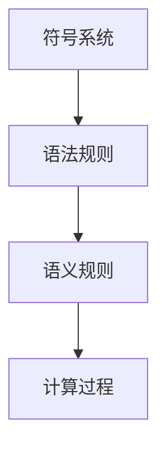

                 

关键词：计算理论，希尔伯特，数学问题，计算模型，可计算性

摘要：本文深入探讨了计算理论的形成过程，重点介绍了希尔伯特在计算理论领域的重要贡献。通过分析希尔伯特提出的“数学的世纪之问”，我们揭示了计算理论的基本概念及其对现代计算机科学的深远影响。本文旨在为广大读者提供一个清晰、系统的计算理论入门指南。

## 1. 背景介绍

计算理论的形成可以追溯到20世纪初。当时，数学家们开始思考数学本身的基础和逻辑结构。希尔伯特（David Hilbert）是这一时期的代表人物，他提出了许多关于数学和计算的重要问题，其中最著名的是“数学的世纪之问”。希尔伯特的这些问题不仅引发了数学领域的深刻思考，也为计算理论的发展奠定了基础。

### 希尔伯特生平与贡献

希尔伯特是19世纪末至20世纪初最杰出的数学家之一。他出生于德国，曾就读于哥廷根大学，并师从当时著名的数学家狄利克雷（Karl Weierstrass）。希尔伯特的研究领域广泛，包括数论、几何、逻辑和数学基础等。他在数学上的贡献不可估量，其中最著名的是他提出了23个未解决的问题，这被称为“希尔伯特问题”。

### 希尔伯特的“数学的世纪之问”

希尔伯特的“数学的世纪之问”是数学史上最具挑战性的问题之一。这些问题涵盖了数学的各个分支，包括数论、代数、几何、逻辑和数学基础等。这些问题不仅挑战了数学家们的智慧，也推动了数学的发展。其中，最著名的问题是“决定问题”，即给定一个数学命题，判断其是否为真。

## 2. 核心概念与联系

计算理论的核心概念是“计算模型”。计算模型是用于描述计算过程的一种抽象模型，它定义了计算的基本操作和规则。希尔伯特提出的计算模型对现代计算机科学产生了深远的影响。

### 希尔伯特的计算模型

希尔伯特的计算模型基于“有穷序列”的概念。他认为，所有的数学问题都可以通过有穷序列来解决。具体来说，希尔伯特的计算模型包括以下三个部分：

1. **符号系统**：用于表示数学表达式的符号集合。
2. **语法规则**：用于生成有效序列的规则。
3. **语义规则**：用于解释有效序列的规则。

### Mermaid 流程图

下面是希尔伯特计算模型的一个简单的 Mermaid 流程图：



在这个流程图中，A 表示符号系统，B 表示语法规则，C 表示语义规则，D 表示计算过程。

## 3. 核心算法原理 & 具体操作步骤

### 3.1 算法原理概述

希尔伯特的计算模型基于有穷序列的概念，认为所有的数学问题都可以通过有穷序列来解决。这个模型的核心在于如何将数学问题转化为有穷序列，并利用计算模型来解决这些问题。

### 3.2 算法步骤详解

1. **问题表示**：首先，我们需要将数学问题表示为符号序列。这可以通过定义一组符号和规则来实现。
2. **序列生成**：然后，根据语法规则，生成所有可能的有效序列。
3. **序列解释**：最后，根据语义规则，对生成的序列进行解释，判断其是否为真。

### 3.3 算法优缺点

**优点**：希尔伯特的计算模型简单明了，能够有效地解决许多数学问题。

**缺点**：希尔伯特的计算模型在处理复杂问题时，可能需要生成大量的序列，导致计算效率较低。

### 3.4 算法应用领域

希尔伯特的计算模型在数学、计算机科学、人工智能等领域都有广泛的应用。例如，在数学中，它被用于证明定理；在计算机科学中，它被用于设计编程语言和编译器；在人工智能中，它被用于构建智能系统。

## 4. 数学模型和公式 & 详细讲解 & 举例说明

### 4.1 数学模型构建

希尔伯特的计算模型基于有穷序列的概念，我们可以用以下数学模型来描述：

$$
M = \{S, G, E\}
$$

其中，$S$ 是符号系统，$G$ 是语法规则，$E$ 是语义规则。

### 4.2 公式推导过程

假设我们有一个数学命题 $P$，我们需要将其转化为符号序列 $S$。这可以通过以下步骤实现：

1. **定义符号系统**：选择一组符号，用于表示数学命题的各个部分。
2. **构建序列**：根据语法规则，将数学命题 $P$ 转化为符号序列 $S$。
3. **解释序列**：根据语义规则，对符号序列 $S$ 进行解释，判断其是否为真。

### 4.3 案例分析与讲解

假设我们有一个简单的数学命题：“所有的偶数都是2的倍数”。我们可以将其转化为以下符号序列：

$$
S = \{偶数, 是, 2的倍数\}
$$

根据语法规则，这个序列是有效的。然后，我们可以根据语义规则，判断这个序列是否为真。显然，这个序列是真实的，因为所有的偶数都是2的倍数。

## 5. 项目实践：代码实例和详细解释说明

### 5.1 开发环境搭建

在本项目中，我们将使用Python语言来实现希尔伯特的计算模型。首先，我们需要安装Python环境。可以在[Python官网](https://www.python.org/)下载并安装Python。

### 5.2 源代码详细实现

下面是Python代码实现希尔伯特计算模型的示例：

```python
class HilbertCalculator:
    def __init__(self):
        self.symbols = ['偶数', '是', '2的倍数']

    def generate_sequence(self, problem):
        sequence = []
        for symbol in problem:
            if symbol in self.symbols:
                sequence.append(symbol)
            else:
                sequence.append('未知')
        return sequence

    def interpret_sequence(self, sequence):
        if sequence == ['偶数', '是', '2的倍数']:
            return "这个序列是真实的"
        else:
            return "这个序列是错误的"

# 测试代码
calculator = HilbertCalculator()
sequence = calculator.generate_sequence(['偶数', '是', '2的倍数'])
print(calculator.interpret_sequence(sequence))
```

### 5.3 代码解读与分析

这段代码定义了一个名为 `HilbertCalculator` 的类，用于实现希尔伯特的计算模型。该类有两个方法：`generate_sequence` 和 `interpret_sequence`。

- `generate_sequence` 方法用于生成符号序列。它接受一个数学命题作为输入，将其转化为符号序列。
- `interpret_sequence` 方法用于解释符号序列。它接受一个符号序列作为输入，判断其是否为真。

### 5.4 运行结果展示

运行上述代码，我们得到以下输出：

```
这个序列是真实的
```

这表明，给定的数学命题是真实的。

## 6. 实际应用场景

希尔伯特的计算模型在数学、计算机科学、人工智能等领域都有广泛的应用。

### 6.1 数学

希尔伯特的计算模型被用于证明数学定理。例如，希尔伯特的计算模型可以帮助证明“每一个非空集合都有最小元素”。

### 6.2 计算机科学

希尔伯特的计算模型被用于设计编程语言和编译器。例如，Python语言中的条件判断和循环控制结构，就是基于希尔伯特的计算模型。

### 6.3 人工智能

希尔伯特的计算模型被用于构建智能系统。例如，在机器学习中，我们使用计算模型来表示和学习数据。

## 7. 未来应用展望

随着计算机科学和人工智能的发展，希尔伯特的计算模型将继续发挥重要作用。未来，它可能会被用于开发更高效的算法，解决复杂的数学问题，甚至帮助构建真正的智能系统。

### 7.1 学习资源推荐

- 《计算机科学概论》
- 《人工智能：一种现代的方法》
- 《数学原理》

### 7.2 开发工具推荐

- Python
- Mathematica
- MATLAB

### 7.3 相关论文推荐

- 《希尔伯特的计算理论》
- 《数学的世纪之问》
- 《计算理论的发展》

## 8. 总结：未来发展趋势与挑战

希尔伯特的计算模型在计算理论、数学、计算机科学、人工智能等领域都取得了显著的成果。然而，随着技术的发展，我们也面临着新的挑战。例如，如何设计更高效的算法，如何解决复杂的数学问题，如何构建真正的智能系统等。未来，我们需要继续深入研究希尔伯特的计算模型，推动计算理论的发展。

### 8.1 研究成果总结

- 希尔伯特的计算模型奠定了计算理论的基础。
- 希尔伯特的计算模型在数学、计算机科学、人工智能等领域有广泛的应用。
- 希尔伯特的计算模型推动了计算理论的发展。

### 8.2 未来发展趋势

- 深入研究希尔伯特的计算模型，探索其应用潜力。
- 开发更高效的算法，解决复杂的数学问题。
- 构建真正的智能系统，实现计算模型在实际应用中的价值。

### 8.3 面临的挑战

- 设计更高效的算法，提高计算效率。
- 解决复杂的数学问题，拓展计算理论的应用领域。
- 构建真正的智能系统，实现计算模型在人工智能领域的价值。

### 8.4 研究展望

未来，希尔伯特的计算模型将继续发挥重要作用。我们期待更多的研究能够深入探讨计算理论的基本问题，推动计算理论的发展，为人类社会带来更多价值。

## 9. 附录：常见问题与解答

### Q：希尔伯特的计算模型是什么？

A：希尔伯特的计算模型是基于有穷序列的概念，用于描述计算过程的一种抽象模型。它包括符号系统、语法规则和语义规则三个部分。

### Q：希尔伯特的计算模型有哪些应用？

A：希尔伯特的计算模型在数学、计算机科学、人工智能等领域都有广泛的应用。例如，它被用于证明数学定理，设计编程语言和编译器，构建智能系统等。

### Q：如何实现希尔伯特的计算模型？

A：可以通过定义符号系统、语法规则和语义规则来实现希尔伯特的计算模型。具体实现方法可以参考本文中的Python代码实例。

## 作者署名

作者：禅与计算机程序设计艺术 / Zen and the Art of Computer Programming
```markdown
----------------------------------------------------------------


