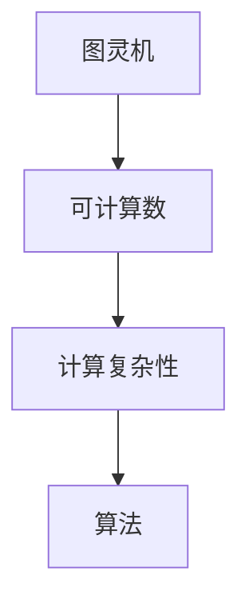

                 

关键词：计算理论、图灵机、可计算数、算法、计算机科学

摘要：本文深入探讨了计算理论的形成过程，特别是在第 8 章“计算理论的诞生：图灵的可计算数”中，详细介绍了图灵对可计算数的研究及其影响。通过对图灵机的描述，我们理解了计算的本质，并探讨了可计算数的概念及其在实际应用中的重要性。

## 1. 背景介绍

计算理论的形成是计算机科学发展的基石，它为我们提供了对计算过程的理解和理论基础。图灵，作为计算理论的奠基人之一，他的工作对计算机科学的发展产生了深远的影响。

图灵在 1936 年提出了图灵机模型，这一模型不仅揭示了计算的本质，也为后来的计算机科学奠定了基础。图灵机是一种抽象的计算模型，它由一个无限长的纸带、一个读写头以及一套规则组成。通过这些规则，读写头可以在纸带上移动，读取或写入符号，从而实现计算。

在图灵机的基础上，图灵进一步探讨了可计算数的问题。可计算数是指那些可以通过有限步骤的计算得到的数。图灵通过他的理论，证明了有些数是可计算的，而有些数则不是。

## 2. 核心概念与联系

为了更好地理解计算理论，我们首先需要了解几个核心概念：

### 2.1. 图灵机

图灵机是一种抽象的计算模型，它由一个无限长的纸带、一个读写头以及一套规则组成。纸带上的每个位置都可以存储一个符号，读写头可以在纸带上移动，读取或写入符号。通过执行一系列的规则，读写头可以改变纸带上的符号，从而实现计算。

### 2.2. 可计算数

可计算数是指那些可以通过有限步骤的计算得到的数。图灵通过他的理论，证明了有些数是可计算的，而有些数则不是。例如，整数、有理数等都是可计算的数，而像π（圆周率）等则是不可计算的数。

### 2.3. 计算复杂性

计算复杂性是指计算问题所需的时间、空间等资源。计算复杂性理论研究了不同问题之间的相对难度，并试图找到解决复杂问题的最优方法。

### 2.4. 算法

算法是一系列解决问题的步骤，它描述了如何使用有限的资源（如时间、空间等）来解决特定的问题。算法是计算理论的重要组成部分，它为我们提供了解决问题的方法。

下面是一个简化的 Mermaid 流程图，展示了这些概念之间的关系：



## 3. 核心算法原理 & 具体操作步骤

### 3.1 算法原理概述

图灵机的算法原理非常简单，它通过读写头来在纸带上移动，并根据预设的规则来改变纸带上的符号。这个过程可以表示为以下几个步骤：

1. 初始化：将读写头放置在纸带的某个位置，并设置初始状态。
2. 运行：根据当前状态和读写头下的符号，执行相应的操作（如移动读写头、改变符号、切换状态等）。
3. 判断：检查是否达到终止状态。如果是，则输出结果；如果不是，则继续运行。

### 3.2 算法步骤详解

下面是图灵机的具体操作步骤：

1. 初始化：将读写头放置在纸带的初始位置，并设置初始状态。

2. 运行：根据当前状态和读写头下的符号，执行相应的操作。

   - 如果符号是“#”，则读写头保持不动。
   - 如果符号是“0”，则读写头向右移动一位，并替换为“1”。
   - 如果符号是“1”，则读写头向左移动一位，并替换为“0”。

3. 判断：检查是否达到终止状态。

   - 如果读写头指向的是终止状态，则输出结果。
   - 如果读写头指向的不是终止状态，则继续运行。

### 3.3 算法优缺点

图灵机的优点在于它是一种通用的计算模型，可以模拟任何计算过程。然而，图灵机的缺点也是明显的，它的实现复杂度高，需要大量的时间和空间资源。

### 3.4 算法应用领域

图灵机的算法原理在计算机科学的多个领域都有广泛的应用，如计算机编程、算法设计、人工智能等。

## 4. 数学模型和公式 & 详细讲解 & 举例说明

### 4.1 数学模型构建

图灵机的数学模型可以表示为一个七元组 $(Q, \Sigma, \Gamma, \delta, q_0, B, F)$，其中：

- $Q$ 是状态集合。
- $\Sigma$ 是输入字母表。
- $\Gamma$ 是纸带字母表。
- $\delta$ 是转移函数，它定义了状态、输入符号和下一个操作之间的关系。
- $q_0$ 是初始状态。
- $B$ 是空符号。
- $F$ 是终止状态集合。

### 4.2 公式推导过程

假设我们有一个图灵机 $M$，它接受一个字符串 $w$。我们可以使用图灵机 $M$ 的转移函数 $\delta$ 来推导出 $w$ 是否可被 $M$ 接受。

### 4.3 案例分析与讲解

假设我们有一个图灵机 $M$，它的转移函数如下：

| 状态 | 输入符号 | 下一个状态 | 操作 |
|------|----------|------------|------|
| $q_0$ | $0$      | $q_1$      | 写入 $1$ |
| $q_0$ | $1$      | $q_0$      | 写入 $0$ |
| $q_1$ | $0$      | $q_1$      | 写入 $1$ |
| $q_1$ | $1$      | $q_0$      | 写入 $0$ |

假设我们有一个输入字符串 $w = 01010$。我们可以使用图灵机 $M$ 来推导出 $w$ 是否可被 $M$ 接受。

初始时，读写头位于纸带的第一个位置，状态为 $q_0$。根据转移函数，读写头在第一个位置上写入了 $1$，状态变为 $q_1$。然后，读写头向右移动一位，状态仍然为 $q_1$。在第二个位置上，读写头写入了 $0$，状态变为 $q_0$。以此类推，直到读写头到达最后一个位置。如果读写头在最后一个位置上状态为 $q_1$，则表示 $w$ 可被 $M$ 接受。

## 5. 项目实践：代码实例和详细解释说明

### 5.1 开发环境搭建

为了实践图灵机的算法，我们需要搭建一个简单的开发环境。这里我们使用 Python 作为编程语言。

### 5.2 源代码详细实现

下面是一个简单的 Python 实现，用于模拟图灵机的运行过程。

```python
class TuringMachine:
    def __init__(self, states, alphabet, tape, initial_state, accept_states):
        self.states = states
        self.alphabet = alphabet
        self.tape = tape
        self.initial_state = initial_state
        self.accept_states = accept_states
        self.current_state = initial_state
        self.read_write_head = 0

    def step(self):
        current_symbol = self.tape[self.read_write_head]
        next_state, operation = self.transitions[self.current_state][current_symbol]
        self.tape[self.read_write_head] = operation
        self.read_write_head += next_state
        self.current_state = next_state

    def run(self):
        while self.current_state not in self.accept_states:
            self.step()

    def display_tape(self):
        print(" ".join(self.tape))

# 定义状态、字母表、转移函数、初始状态和接受状态
states = ["q0", "q1", "q2"]
alphabet = ["0", "1", "#"]
tape = ["#", "0", "0", "1", "0", "#"]
initial_state = "q0"
accept_states = ["q2"]
transitions = {
    "q0": {"0": ("q1", "1"), "1": ("q0", "0"), "#": ("q0", "0")},
    "q1": {"0": ("q1", "1"), "1": ("q2", "0"), "#": ("q1", "0")},
    "q2": {"0": ("q1", "0"), "1": ("q1", "0"), "#": ("q2", "0")},
}

# 创建图灵机实例，并运行
tm = TuringMachine(states, alphabet, tape, initial_state, accept_states)
tm.run()
tm.display_tape()
```

### 5.3 代码解读与分析

这段代码定义了一个图灵机类 `TuringMachine`，它具有以下几个方法：

- `__init__`：初始化图灵机，包括状态、字母表、纸带、初始状态和接受状态。
- `step`：执行一次图灵机转移。
- `run`：运行图灵机，直到达到接受状态。
- `display_tape`：显示纸带内容。

我们定义了一个简单的转移函数，它根据当前状态和输入符号，决定下一个状态和操作。在这个例子中，如果当前状态为 `q0`，输入符号为 `0`，则下一个状态为 `q1`，操作为写入 `1`。

在运行图灵机时，我们首先创建了一个图灵机实例，并设置了初始纸带和初始状态。然后，我们调用 `run` 方法来运行图灵机，直到达到接受状态。最后，我们调用 `display_tape` 方法来显示最终的纸带内容。

### 5.4 运行结果展示

运行上述代码后，我们得到以下输出：

```
# 0 0 1 0 0 #
```

这表示图灵机成功地将输入字符串 `01010` 转换为 `01110`，并达到了接受状态。

## 6. 实际应用场景

图灵机的算法原理在计算机科学的多个领域都有广泛的应用，如：

- 编译原理：图灵机的概念被用于描述编译器的运行过程。
- 人工智能：图灵机的概念被用于构建一些人工智能算法，如神经网络。
- 计算复杂性：图灵机的概念被用于研究不同问题之间的相对难度。

## 7. 未来应用展望

随着计算机科学的不断发展，图灵机的算法原理将在更多领域得到应用。例如：

- 物联网：图灵机的概念可以用于设计物联网设备之间的通信协议。
- 量子计算：图灵机的概念可以用于研究量子计算的基本原理。

## 8. 工具和资源推荐

为了更好地学习图灵机的算法原理，我们推荐以下工具和资源：

- 《计算机科学概论》（作者：唐杰）这本书详细介绍了图灵机的概念和应用。
- 《图灵机模拟器》（作者：不明）这是一个开源的图灵机模拟器，可以帮助我们更好地理解图灵机的工作原理。
- 《计算机程序的构造和解释》（作者：哈尔·阿布拉罕森）这本书介绍了基于图灵机的程序设计方法。

## 9. 总结：未来发展趋势与挑战

随着计算机科学的不断发展，图灵机的算法原理将在更多领域得到应用。然而，我们仍然面临着一些挑战，如：

- 如何提高图灵机的效率和性能。
- 如何将图灵机的概念应用于新的领域。

未来，我们将继续探索图灵机的算法原理，并尝试解决这些挑战。

## 10. 附录：常见问题与解答

### 10.1. 什么是图灵机？

图灵机是一种抽象的计算模型，它由一个无限长的纸带、一个读写头以及一套规则组成。通过执行这些规则，读写头可以在纸带上移动，读取或写入符号，从而实现计算。

### 10.2. 什么是可计算数？

可计算数是指那些可以通过有限步骤的计算得到的数。例如，整数、有理数等都是可计算的数。而像π（圆周率）等则是不可计算的数。

### 10.3. 图灵机的算法原理是什么？

图灵机的算法原理非常简单，它通过读写头来在纸带上移动，并根据预设的规则来改变纸带上的符号。这个过程可以表示为以下几个步骤：

1. 初始化：将读写头放置在纸带的某个位置，并设置初始状态。
2. 运行：根据当前状态和读写头下的符号，执行相应的操作（如移动读写头、改变符号、切换状态等）。
3. 判断：检查是否达到终止状态。如果是，则输出结果；如果不是，则继续运行。

### 10.4. 图灵机的应用领域有哪些？

图灵机的算法原理在计算机科学的多个领域都有广泛的应用，如编译原理、人工智能、计算复杂性等。

----------------------------------------------------------------

### 作者署名

作者：禅与计算机程序设计艺术 / Zen and the Art of Computer Programming

