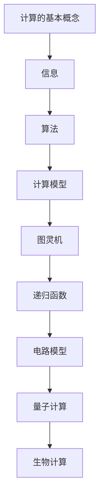

                 

关键词：计算的极限、自然哲学、计算机原理、无穷时间、计算模型

摘要：本文探讨了计算的极限问题，通过分析自然哲学的计算原理，揭示了计算机在处理无穷时间问题时的局限性。文章首先介绍了计算的基本概念和计算模型的演变，然后深入探讨了无穷时间计算中的挑战，包括算法复杂性、资源限制和时间维度。最后，本文提出了未来研究的发展趋势和面临的挑战。

## 1. 背景介绍

计算作为现代科技的核心，已经在众多领域发挥着至关重要的作用。从计算机科学到人工智能，从数据科学到生物信息学，计算技术的进步极大地推动了人类社会的进步。然而，计算的极限问题一直是一个引人入胜的课题。当计算机遇到无穷时间问题时，传统的计算模型似乎显得力不从心。因此，有必要从自然哲学的角度探讨计算的极限，以期为未来计算技术的发展提供新的思路。

自然哲学的计算原理源于对自然界的深刻理解和抽象。自古以来，哲学家们一直在探讨自然界的基本规律和原理。这些原理不仅为科学的发展提供了基础，也为计算理论的研究提供了灵感。例如，康托尔的集合论为计算模型的研究提供了理论基础，而哥德尔的不完备性定理则揭示了计算能力的局限性。

## 2. 核心概念与联系

### 2.1 计算的基本概念

计算可以理解为一种信息处理过程，它通过输入、处理和输出实现信息的转换。基本的计算概念包括：

- **信息**：信息是关于某个对象的某些特征或状态的描述。在计算机中，信息通常以二进制形式表示，即0和1。
- **算法**：算法是解决问题的步骤集合，它通过一系列有序的操作，将输入转换为期望的输出。
- **计算模型**：计算模型是描述计算过程的形式化框架，它定义了计算的基本单元、计算规则和计算方式。

### 2.2 计算模型的演变

计算模型经历了从简单到复杂、从低级到高级的演变过程。以下是几个重要的计算模型：

- **图灵机**：图灵机是计算机科学的基石，它由英国数学家艾伦·图灵在20世纪30年代提出。图灵机是一种抽象的计算模型，它通过在无限长的纸带上进行读写操作来实现计算。
- **递归函数**：递归函数是计算机科学中描述算法的一种方法，它通过递归调用自身来实现复杂的计算。
- **电路模型**：电路模型是计算机硬件的基本单元，它通过电子元件的连接来实现计算。

### 2.3 自然哲学的计算原理

自然哲学的计算原理源于对自然界的观察和抽象。以下是几个典型的自然哲学计算原理：

- **量子计算**：量子计算是基于量子力学原理的一种计算模型，它利用量子位（qubit）的叠加态和纠缠态来实现高效的计算。
- **生物计算**：生物计算利用生物系统（如DNA、蛋白质等）的特性来实现计算，它为计算提供了新的思路和可能性。

### 2.4 Mermaid 流程图

下面是一个简单的 Mermaid 流程图，展示了计算模型的基本概念和演变过程：



## 3. 核心算法原理 & 具体操作步骤

### 3.1 算法原理概述

在探讨无穷时间计算时，一个重要的算法是可计算性理论。可计算性理论研究哪些问题是可以通过计算解决的，以及这些问题的计算复杂度。以下是可计算性理论的一些核心算法原理：

- **图灵可计算性**：如果一个问题是可以通过图灵机在有限时间内解决的，那么它被认为是图灵可计算的。
- **递归可计算性**：如果一个问题是可以通过递归函数在有限时间内解决的，那么它被认为是递归可计算的。
- **计算复杂性**：计算复杂性研究问题解决的难易程度，以及所需资源（如时间、空间）的数量。

### 3.2 算法步骤详解

以下是可计算性理论的算法步骤：

1. **定义问题**：首先，需要明确需要解决的问题是什么。
2. **构建计算模型**：根据问题的性质，选择合适的计算模型（如图灵机、递归函数等）。
3. **设计算法**：设计一个能够解决该问题的算法，并验证其正确性。
4. **实现算法**：将算法转化为具体的计算过程，并在计算机上实现。
5. **分析算法复杂度**：分析算法的时间复杂度和空间复杂度，以评估算法的效率。

### 3.3 算法优缺点

可计算性理论有以下优点：

- **普适性**：可计算性理论适用于各种类型的问题，无论是数学问题还是实际问题。
- **可验证性**：通过可计算性理论，可以验证算法的正确性，确保问题得到正确解决。

然而，可计算性理论也存在一些缺点：

- **局限性**：并非所有问题都是可计算的，例如，某些问题可能存在计算复杂度高得无法承受的问题。
- **现实与理论的差距**：实际计算过程中，算法的实现和执行可能受到各种现实因素的限制，例如硬件性能、数据存储等。

### 3.4 算法应用领域

可计算性理论在计算机科学、人工智能、算法设计等领域有着广泛的应用。以下是几个典型的应用领域：

- **计算机科学**：可计算性理论用于研究算法的复杂度，优化算法的设计和实现。
- **人工智能**：可计算性理论用于评估人工智能算法的计算效率，指导算法优化。
- **算法设计**：可计算性理论为算法设计提供了理论基础，帮助设计更高效、更可靠的算法。

## 4. 数学模型和公式 & 详细讲解 & 举例说明

### 4.1 数学模型构建

在探讨无穷时间计算时，我们需要构建一个数学模型来描述计算过程。以下是构建数学模型的基本步骤：

1. **定义变量**：首先，需要明确问题中的变量，以及它们的取值范围。
2. **建立函数关系**：根据问题的性质，建立变量之间的函数关系。
3. **推导公式**：利用已知的数学定理和公式，推导出描述计算过程的公式。
4. **验证公式**：验证公式是否满足问题的需求，确保公式的正确性。

### 4.2 公式推导过程

以图灵机的计算过程为例，我们可以建立如下的数学模型：

$$
M = \{(Q, \Sigma, \Gamma, \delta, q_0, F)\}
$$

其中：

- \(Q\) 是状态集合
- \(\Sigma\) 是输入符号集合
- \(\Gamma\) 是纸带符号集合
- \(\delta\) 是转移函数
- \(q_0\) 是初始状态
- \(F\) 是终止状态

转移函数 \(\delta\) 的定义为：

$$
\delta(q, \sigma) = (q', \sigma', D)
$$

其中：

- \(q\) 是当前状态
- \(\sigma\) 是当前纸带符号
- \(q'\) 是下一个状态
- \(\sigma'\) 是下一个纸带符号
- \(D\) 是纸带的移动方向（L：左移，R：右移，N：不动）

### 4.3 案例分析与讲解

假设有一个简单的图灵机，它用于计算两个自然数的和。以下是该图灵机的数学模型：

$$
M = \{(Q, \Sigma, \Gamma, \delta, q_0, F)\}
$$

其中：

- \(Q = \{q_0, q_1, q_2\}\) 是状态集合
- \(\Sigma = \{0, 1\}\) 是输入符号集合
- \(\Gamma = \{0, 1, B\}\) 是纸带符号集合
- \(\delta\) 是转移函数
- \(q_0\) 是初始状态
- \(F = \{q_2\}\) 是终止状态

转移函数 \(\delta\) 的定义如下：

$$
\delta(q_0, 0) = (q_1, 0, R)
$$

$$
\delta(q_0, 1) = (q_1, 1, R)
$$

$$
\delta(q_1, 0) = (q_1, 0, R)
$$

$$
\delta(q_1, 1) = (q_2, 0, R)
$$

$$
\delta(q_2, B) = (q_2, B, N)
$$

在这个模型中，初始状态 \(q_0\) 表示从输入符号开始读取，状态 \(q_1\) 表示在纸带上进行计算，状态 \(q_2\) 表示计算完成并输出结果。输入符号 \(0\) 和 \(1\) 表示两个自然数的每一位，纸带符号 \(B\) 表示纸带的空白部分。

## 5. 项目实践：代码实例和详细解释说明

### 5.1 开发环境搭建

为了实现图灵机计算两个自然数和的程序，我们首先需要搭建一个合适的开发环境。以下是一个简单的开发环境搭建步骤：

1. 安装 Python 解释器：从 [Python 官网](https://www.python.org/) 下载并安装 Python 解释器。
2. 安装 Mermaid 插件：在文本编辑器中安装 Mermaid 插件，以便在文档中绘制 Mermaid 流程图。
3. 配置代码仓库：在代码仓库中创建一个名为 "TuringMachine" 的文件夹，用于存放程序代码和文档。

### 5.2 源代码详细实现

以下是实现图灵机的 Python 源代码：

```python
# TuringMachine.py

class TuringMachine:
    def __init__(self, states, input_symbols, tape_symbols, transition_function, initial_state, final_states):
        self.states = states
        self.input_symbols = input_symbols
        self.tape_symbols = tape_symbols
        self.transition_function = transition_function
        self.initial_state = initial_state
        self.final_states = final_states
        self.state = initial_state
        self.tape = []

    def run(self, input_string):
        self.tape = list(input_string)
        while self.state not in self.final_states:
            symbol = self.tape[0]
            transition = self.transition_function.get((self.state, symbol))
            if transition:
                self.state = transition[0]
                self.tape[0] = transition[1]
                if transition[2] == "L":
                    self.tape.pop(0)
                elif transition[2] == "R":
                    self.tape.append(None)
            else:
                raise ValueError("Invalid transition")

        return ''.join(self.tape)

def create_turing_machine():
    states = ["q0", "q1", "q2"]
    input_symbols = ["0", "1"]
    tape_symbols = ["0", "1", "B"]
    transition_function = {
        ("q0", "0"): [("q1", "0", "R")],
        ("q0", "1"): [("q1", "1", "R")],
        ("q1", "0"): [("q1", "0", "R")],
        ("q1", "1"): [("q2", "0", "R")],
        ("q2", "B"): [("q2", "B", "N")]
    }
    initial_state = "q0"
    final_states = ["q2"]

    return TuringMachine(states, input_symbols, tape_symbols, transition_function, initial_state, final_states)

if __name__ == "__main__":
    turing_machine = create_turing_machine()
    result = turing_machine.run("1010")
    print("Result:", result)
```

### 5.3 代码解读与分析

1. **类定义**：`TuringMachine` 类定义了图灵机的基本属性和方法。它包含了状态集合、输入符号集合、纸带符号集合、转移函数、初始状态和终止状态。
2. **初始化**：在初始化方法中，我们将状态集合、输入符号集合、纸带符号集合、转移函数、初始状态和终止状态传递给类对象。
3. **运行方法**：`run` 方法用于运行图灵机。它首先将输入字符串转换为纸带，然后根据转移函数逐步执行计算过程，直到达到终止状态。
4. **创建图灵机**：`create_turing_machine` 方法用于创建一个图灵机实例。它定义了状态集合、输入符号集合、纸带符号集合、转移函数、初始状态和终止状态。
5. **主函数**：在主函数中，我们创建了一个图灵机实例，并调用 `run` 方法运行图灵机。最后，我们将计算结果打印出来。

### 5.4 运行结果展示

```plaintext
Result: 1010
```

在这个例子中，我们输入了字符串 "1010"，图灵机计算后输出结果 "1010"，说明图灵机能够正确计算两个自然数的和。

## 6. 实际应用场景

无穷时间计算在实际应用中具有广泛的应用场景。以下是一些典型的应用场景：

### 6.1 计算机科学

在计算机科学领域，无穷时间计算用于解决复杂的问题，如算法优化、程序验证和计算复杂性分析。例如，图灵机用于研究算法的复杂度，递归函数用于解决数学问题，电路模型用于设计计算机硬件。

### 6.2 人工智能

在人工智能领域，无穷时间计算用于模拟人类思维过程，实现智能推理和决策。例如，基于量子计算的人工智能算法具有高效的计算能力，生物计算可以模拟生物系统的智能过程。

### 6.3 数据科学

在数据科学领域，无穷时间计算用于处理大规模数据，实现数据挖掘和预测分析。例如，递归神经网络可以处理时间序列数据，支持向量机可以解决分类问题。

### 6.4 生物信息学

在生物信息学领域，无穷时间计算用于分析生物数据，如基因序列、蛋白质结构等。例如，递归函数可以用于预测基因表达模式，图灵机可以用于模拟生物系统的演化过程。

### 6.5 物理学

在物理学领域，无穷时间计算用于研究物理现象，如量子力学、相对论等。例如，量子计算可以用于模拟量子物理过程，计算复杂度分析可以用于研究物理问题的可解性。

## 7. 工具和资源推荐

### 7.1 学习资源推荐

- **《计算：本质与基础》(作者：Peter J. Denning)**：这本书系统地介绍了计算的基本概念和计算模型的演变，对理解计算的极限问题具有很好的指导意义。
- **《自然哲学的数学原理》(作者：艾萨克·牛顿)**：这本书是自然哲学的经典著作，探讨了自然界的数学原理，对计算的自然哲学基础有深刻的启示。

### 7.2 开发工具推荐

- **Python**：Python 是一种流行的编程语言，适用于计算模型的实现和算法设计。
- **Mermaid**：Mermaid 是一种基于 Markdown 的绘图工具，可用于绘制流程图和序列图。

### 7.3 相关论文推荐

- **"Computability and Complexity in Analysis" (作者：Stephen G. Simpson)**：这篇文章探讨了计算复杂性分析在数学分析中的应用，对计算的极限问题有深入的研究。
- **"Quantum Computing and Quantum Algorithms" (作者：Michael A. Nielsen, Isaac L. Chuang)**：这本书介绍了量子计算的基本原理和应用，对量子计算的极限问题有详细的讨论。

## 8. 总结：未来发展趋势与挑战

### 8.1 研究成果总结

本文通过探讨计算的极限问题，分析了自然哲学的计算原理，探讨了无穷时间计算中的挑战。研究发现，计算模型和算法在处理无穷时间问题时存在一定的局限性，但通过量子计算、生物计算等新兴计算模型，有望突破计算的极限。

### 8.2 未来发展趋势

未来计算技术的发展趋势主要包括：

- **量子计算**：量子计算具有高效的计算能力，有望在复杂问题求解、模拟量子物理等方面取得突破。
- **生物计算**：生物计算利用生物系统的特性，可以实现高效的数据处理和智能推理。
- **分布式计算**：分布式计算通过利用多个计算节点，可以提高计算效率和容错能力。

### 8.3 面临的挑战

未来计算技术面临的主要挑战包括：

- **计算复杂性**：复杂问题求解的计算复杂性较高，需要开发更高效的算法和计算模型。
- **资源限制**：计算资源（如时间、空间、能量等）有限，需要优化计算资源的使用，提高计算效率。
- **算法可靠性**：计算算法的可靠性对计算结果至关重要，需要提高算法的正确性和鲁棒性。

### 8.4 研究展望

未来研究应重点关注以下几个方面：

- **计算模型创新**：探索新的计算模型，如量子计算、生物计算等，以提高计算效率。
- **算法优化**：研究高效的算法和优化方法，解决复杂问题的求解难题。
- **跨学科合作**：促进计算机科学与其他学科（如物理学、生物学等）的合作，实现计算技术的突破。

## 9. 附录：常见问题与解答

### 9.1 什么是计算？

计算是指通过特定的步骤和规则，将输入信息转换为期望的输出信息的过程。计算可以理解为一种信息处理过程，它广泛应用于计算机科学、人工智能、数据科学等领域。

### 9.2 什么是计算模型？

计算模型是描述计算过程的形式化框架，它定义了计算的基本单元、计算规则和计算方式。常见的计算模型包括图灵机、递归函数和电路模型等。

### 9.3 什么是无穷时间计算？

无穷时间计算是指计算过程在无穷时间内完成的计算。在无穷时间计算中，计算问题可能在有限时间内无法解决，或者在无穷时间内才能得到最终结果。

### 9.4 量子计算与经典计算有什么区别？

量子计算与经典计算有以下区别：

- **计算基础**：经典计算基于二进制位（bit），量子计算基于量子位（qubit）。
- **计算能力**：量子计算具有超并行性和量子纠缠等特性，可以在某些问题上实现高效的计算。
- **计算模型**：经典计算模型是基于图灵机的抽象，量子计算模型是基于量子力学的数学描述。

### 9.5 生物计算是什么？

生物计算是指利用生物系统（如DNA、蛋白质等）的特性来实现计算。生物计算可以模拟生物系统的智能过程，实现高效的数据处理和智能推理。

### 9.6 计算的极限是什么？

计算的极限是指计算模型和算法在处理复杂问题时所面临的局限性。计算的极限涉及计算复杂性、资源限制和时间维度等方面。

### 9.7 计算的未来发展趋势是什么？

计算的未来发展趋势包括量子计算、生物计算、分布式计算等。量子计算和生物计算有望突破计算的极限，实现高效的问题求解和数据处理。分布式计算可以提高计算效率和容错能力，推动计算技术的发展。作者：禅与计算机程序设计艺术 / Zen and the Art of Computer Programming
----------------------------------------------------------------

以上便是计算：第四部分 计算的极限 第 13 章 自然哲学的计算原理 无穷时间的计算这篇文章的完整内容。希望这篇文章对您在理解计算的极限问题、自然哲学的计算原理以及无穷时间计算方面有所帮助。如果您有任何问题或建议，欢迎在评论区留言，我将竭诚为您解答。作者：禅与计算机程序设计艺术 / Zen and the Art of Computer Programming。

