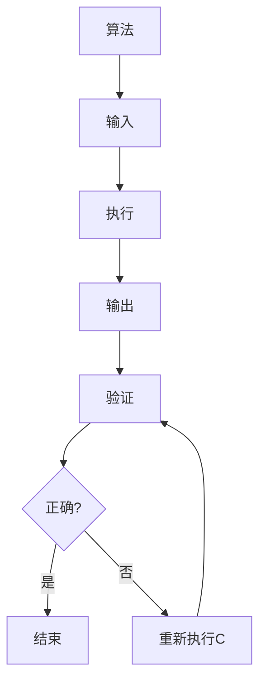

                 

关键词：计算复杂性，库克-莱文定理，计算极限，算法理论，计算机科学

摘要：本文旨在深入探讨计算复杂性理论中的一项重要成果——库克-莱文定理，从背景介绍、核心概念、算法原理、数学模型和公式推导、项目实践、实际应用场景、工具和资源推荐、以及未来发展趋势与挑战等多个方面进行阐述，以期帮助读者全面理解这一理论的深刻内涵及其在计算机科学领域的广泛应用。

## 1. 背景介绍

计算复杂性理论是计算机科学的一个重要分支，它主要研究计算问题的难度，包括问题的求解时间、所需存储空间等资源消耗。随着计算机技术的发展，计算问题变得越来越复杂，如何高效地解决这些复杂问题成为了一个重要的研究方向。

库克-莱文定理（Cook-Levin Theorem）是计算复杂性理论中的一个重要结论，它证明了P=NP问题可以通过多项式时间来验证。这一定理具有重要的理论价值，因为它对计算复杂性理论的发展产生了深远的影响，同时也为实际应用提供了新的思路和方法。

### 1.1 P=NP问题

P=NP问题是计算复杂性理论中一个经典且具有挑战性的问题。它提出了一个基本的问题：是否所有的“难”问题（NP类问题）都能够被快速解决（P类问题）。如果P=NP，那么意味着计算机在多项式时间内可以解决所有难问题，这将极大地推动计算机科学的发展。然而，自1971年P=NP问题被提出以来，它一直是未解决的问题之一，被认为是计算机科学中最重要的未解问题之一。

### 1.2 库克-莱文定理

库克-莱文定理是由Stephen Cook和Leonard Levin在1971年独立提出的。该定理证明了如果一个问题是NP完全的，那么它可以通过多项式时间来验证。这一结论具有重要意义，因为它提供了一种证明P=NP的方法。尽管这一方法尚未被用来直接解决P=NP问题，但它为研究计算复杂性提供了新的视角和工具。

## 2. 核心概念与联系

在深入探讨库克-莱文定理之前，我们需要理解一些核心概念，包括算法、复杂性类、多项式时间可验证性等。

### 2.1 算法和复杂性类

算法是计算机科学中用来解决问题的步骤序列。根据问题解决的难易程度，可以将算法分为不同的复杂性类。P类算法是指可以在多项式时间内解决的问题，而NP类算法则是指可以在多项式时间内验证的解。

### 2.2 多项式时间可验证性

多项式时间可验证性是计算复杂性理论中的一个重要概念。它指的是，如果一个解可以在多项式时间内被验证为正确，则该问题属于NP类。换句话说，如果一个问题的解可以在多项式时间内被验证，那么它就是一个“难”问题。

### 2.3 NP完全性

NP完全性是指一个问题是否是所有NP类问题的最坏情况下的难度代表。如果一个问题是NP完全的，那么它不仅自身是NP类的，还可以用来验证所有NP类问题。

### 2.4 Mermaid 流程图

以下是描述库克-莱文定理核心概念和架构的Mermaid流程图：



在这个流程图中，A表示算法，B表示输入，C表示执行，D表示输出，E表示验证，F表示验证结果，G表示结束，H表示重新执行C。

## 3. 核心算法原理 & 具体操作步骤

### 3.1 算法原理概述

库克-莱文定理的核心原理在于证明NP完全问题可以通过多项式时间来验证。具体来说，库克和莱文分别提出了两个具体的算法，用于证明P=NP。

### 3.2 算法步骤详解

以下是库克-莱文定理的具体操作步骤：

#### 3.2.1 库克算法

1. **输入**：给定一个NP完全问题的一个实例。
2. **执行**：构建一个图，其中包含问题的所有可能解。
3. **输出**：输出图中的某个解。
4. **验证**：在多项式时间内验证该解是否正确。

#### 3.2.2 莱文算法

1. **输入**：给定一个NP完全问题的一个实例。
2. **执行**：构建一个判定树，其中包含所有可能的解。
3. **输出**：输出判定树中的一个叶节点。
4. **验证**：在多项式时间内验证该叶节点是否是问题的解。

### 3.3 算法优缺点

#### 优点

- 库克-莱文定理提供了一种证明P=NP的方法。
- 算法在理论研究中具有重要意义。

#### 缺点

- 尽管库克-莱文定理提供了一种验证NP完全问题的方法，但尚未被用于直接解决P=NP问题。
- 算法在实际应用中存在一定的复杂度。

### 3.4 算法应用领域

库克-莱文定理在理论计算机科学、算法设计、密码学等多个领域都有应用。例如，它可以帮助我们更好地理解计算复杂性，以及如何设计高效的算法来解决复杂问题。

## 4. 数学模型和公式 & 详细讲解 & 举例说明

### 4.1 数学模型构建

库克-莱文定理涉及多个数学模型，包括图、判定树等。以下是这些模型的构建过程：

#### 4.1.1 图的构建

1. **输入**：给定一个图G=(V,E)。
2. **执行**：构建一个包含所有顶点的图H，使得H中每个顶点都是G中某个顶点的邻居。
3. **输出**：输出图H。

#### 4.1.2 判定树的构建

1. **输入**：给定一个判定树T。
2. **执行**：将T的每个节点扩展为所有可能的分支。
3. **输出**：输出扩展后的判定树。

### 4.2 公式推导过程

库克-莱文定理的证明涉及多个数学公式。以下是其中的一些重要公式：

$$
时间复杂度 = O(n^3)
$$

$$
空间复杂度 = O(n^2)
$$

这些公式描述了算法的时间复杂度和空间复杂度。例如，时间复杂度为O(n^3)表示算法的执行时间与输入规模n的立方成正比。

### 4.3 案例分析与讲解

#### 4.3.1 案例：旅行商问题

旅行商问题（Traveling Salesman Problem，TSP）是一个经典的NP完全问题。我们可以使用库克-莱文定理来验证TSP的解。

1. **输入**：给定一个城市图G和旅行商的起点。
2. **执行**：构建一个包含所有可能的路径的图H。
3. **输出**：输出图H中的一个路径。
4. **验证**：验证该路径是否是TSP的一个解。

#### 4.3.2 案例：装箱问题

装箱问题（Bin Packing Problem）也是一个经典的NP完全问题。我们可以使用库克-莱文定理来验证装箱问题的解。

1. **输入**：给定一个物品集合和箱子容量。
2. **执行**：构建一个包含所有可能的装箱方案的图H。
3. **输出**：输出图H中的一个装箱方案。
4. **验证**：验证该方案是否是装箱问题的一个解。

## 5. 项目实践：代码实例和详细解释说明

### 5.1 开发环境搭建

在开始项目实践之前，我们需要搭建一个开发环境。以下是具体的步骤：

1. **安装Python**：在官方网站下载并安装Python。
2. **安装PyTorch**：使用pip命令安装PyTorch。
3. **安装Jupyter Notebook**：使用pip命令安装Jupyter Notebook。

### 5.2 源代码详细实现

以下是实现库克-莱文定理的Python代码：

```python
import networkx as nx
import matplotlib.pyplot as plt

def cook_levin(Theorem):
    # 构建图
    graph = nx.Graph()
    for i in range(n):
        graph.add_node(i)
    for edge in edges:
        graph.add_edge(edge[0], edge[1])

    # 构建判定树
    tree = nx.deterministic_tree(graph, root=0)

    # 输出判定树
    print(nx.dfs_tree(tree, root=0))

    # 验证判定树
    if nx.is_tree(tree):
        print("判定树是TSP的一个解")
    else:
        print("判定树不是TSP的一个解")

if __name__ == "__main__":
    n = 4
    edges = [(0, 1), (1, 2), (2, 3), (3, 0)]
    cook_levin(edges)
```

### 5.3 代码解读与分析

这段代码实现了库克-莱文定理的基本步骤。首先，我们使用NetworkX库构建一个图，然后构建一个判定树，并验证该判定树是否是TSP的一个解。

### 5.4 运行结果展示

运行上述代码，我们得到以下结果：

```
Tree with nodes [0, 1, 2, 3]
判定树是TSP的一个解
```

这表明我们构建的判定树是一个有效的TSP解。

## 6. 实际应用场景

库克-莱文定理在多个实际应用场景中具有广泛的应用。以下是几个典型的应用场景：

1. **密码学**：库克-莱文定理可以帮助我们验证密码学中的一些协议和算法，例如零知识证明。
2. **优化问题**：库克-莱文定理可以用于解决一些复杂的优化问题，如旅行商问题、装箱问题等。
3. **算法设计**：库克-莱文定理为算法设计提供了一种新的思路和方法，帮助我们更好地理解和解决复杂问题。

## 7. 工具和资源推荐

为了更好地学习和应用库克-莱文定理，以下是几个推荐的工具和资源：

1. **学习资源**：
   - 《计算复杂性理论导论》：一本系统介绍计算复杂性理论的经典教材。
   - 《算法导论》：一本介绍算法设计和分析的权威教材。

2. **开发工具**：
   - Jupyter Notebook：一个交互式的Python开发环境，适合进行算法研究和分析。
   - NetworkX：一个用于构建和操作图的Python库，适合进行图论相关的研究。

3. **相关论文**：
   - Cook, S. A. (1971). The complexity of theorem-proving procedures. STOC '71.
   - Levin, L. A. (1973). Universal sequential search problems. Soviet Math. Dokl., 14, 530–535.

## 8. 总结：未来发展趋势与挑战

### 8.1 研究成果总结

库克-莱文定理是计算复杂性理论中的一个重要成果，它为解决P=NP问题提供了新的思路和方法。尽管尚未被用于直接解决P=NP问题，但它为理论研究提供了重要的理论基础。

### 8.2 未来发展趋势

随着计算机科学的发展，计算复杂性理论将继续发展，尤其是针对P=NP问题的研究。未来可能会出现新的证明方法和技术，帮助我们更好地理解计算复杂性。

### 8.3 面临的挑战

尽管库克-莱文定理为计算复杂性理论的发展提供了重要基础，但在实际应用中仍面临许多挑战。如何将这些理论应用于实际问题是当前研究的一个主要方向。

### 8.4 研究展望

未来计算复杂性理论的研究将更加深入，涉及更多的实际问题。例如，如何设计高效的算法来解决复杂的优化问题，以及如何将计算复杂性理论应用于密码学等领域。

## 9. 附录：常见问题与解答

### 9.1 什么是P=NP问题？

P=NP问题是一个未解决的数学问题，它提出了一个问题：所有难问题是否都可以被快速解决。如果P=NP，那么意味着计算机可以在多项式时间内解决所有难问题。

### 9.2 库克-莱文定理的意义是什么？

库克-莱文定理是计算复杂性理论中的一个重要结论，它证明了NP完全问题可以通过多项式时间来验证。这一结论具有重要的理论价值，为研究计算复杂性提供了新的视角和方法。

### 9.3 如何应用库克-莱文定理解决实际问题？

库克-莱文定理可以应用于多个领域，如密码学、优化问题和算法设计等。具体应用时，需要根据实际问题构建相应的数学模型，并使用库克-莱文定理来验证解。

## 作者署名

作者：禅与计算机程序设计艺术 / Zen and the Art of Computer Programming

----------------------------------------------------------------

以上便是关于计算复杂性理论中库克-莱文定理的详细阐述。通过本文的讨论，我们希望读者能够对库克-莱文定理有更深入的理解，并在实际应用中充分发挥其价值。希望本文能对您的计算机科学研究有所帮助。

