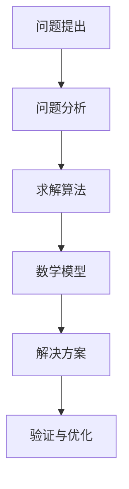

                 

 > **关键词**：计算，提问与求解，算法，数学模型，应用场景，未来展望

> **摘要**：本文探讨了计算领域中的提问与求解艺术，包括核心算法原理、数学模型、应用场景以及未来展望。通过分析核心算法的步骤和优缺点，本文提供了详细的项目实践和代码实例，并结合实际应用场景进行了深入探讨。同时，本文还推荐了相关的学习资源和开发工具，总结了研究成果，并对未来发展趋势和挑战进行了展望。

## 1. 背景介绍

计算是人类社会发展的基石，从古代的算盘到现代的超级计算机，计算能力的提升推动了科学、技术、经济等多个领域的进步。然而，计算技术的不断发展也带来了新的挑战。如何高效地提出问题、求解问题成为了一个重要的研究方向。本文旨在探讨计算领域中的提问与求解艺术，通过分析核心算法原理、数学模型和应用场景，为读者提供一种全新的视角来理解和应用计算技术。

## 2. 核心概念与联系

在探讨计算中的提问与求解艺术之前，我们需要了解一些核心概念和它们之间的联系。以下是一个简化的 Mermaid 流程图，展示了这些概念之间的关系：



### 2.1 问题提出

问题提出是计算过程的第一步，也是至关重要的一步。一个好的问题定义可以大大提高求解的效率和准确性。在问题提出阶段，我们需要明确问题的背景、目标、约束条件等。

### 2.2 问题分析

问题分析是对提出的问题进行深入理解的过程。通过分析，我们可以将复杂的问题分解为更小的子问题，为后续的求解提供基础。

### 2.3 求解算法

求解算法是计算的核心部分。不同的算法适用于不同类型的问题，选择合适的算法可以大大提高求解的效率。常见的算法包括贪心算法、动态规划、分治算法等。

### 2.4 数学模型

数学模型是对现实世界的抽象和简化，通过数学公式和方程来描述问题的性质。数学模型为求解提供了理论依据，同时也是算法设计的重要参考。

### 2.5 解决方案

解决方案是将算法和数学模型应用于具体问题，得到最终的求解结果。一个好的解决方案不仅需要准确，还需要具备高效性和可扩展性。

### 2.6 验证与优化

验证与优化是确保解决方案正确性和效率的重要环节。通过验证，我们可以确认解决方案是否符合预期；通过优化，我们可以进一步改进算法和模型，提高求解的性能。

## 3. 核心算法原理 & 具体操作步骤

### 3.1 算法原理概述

核心算法是指解决特定类型问题的一系列规则和步骤。在本节中，我们将介绍一种常见的核心算法——动态规划（Dynamic Programming）。

动态规划是一种在数学、计算机科学、经济学等多个领域广泛使用的方法。它通过将问题分解为子问题，并存储子问题的解，以避免重复计算，从而提高求解效率。

### 3.2 算法步骤详解

#### 3.2.1 初始化

在动态规划中，通常需要初始化一些基础数据。例如，对于一个最长公共子序列问题，我们需要初始化一个二维数组，用于存储子问题的解。

#### 3.2.2 状态转移

状态转移是动态规划的核心。通过递归或迭代的方式，将子问题的解转化为更小的子问题的解。例如，在最长公共子序列问题中，我们可以使用递归的方式，将当前子问题的解转化为前一个子问题的解。

#### 3.2.3 边界条件

边界条件是动态规划中不可或缺的一部分。通过定义边界条件，我们可以确保算法的正确性。例如，在最长公共子序列问题中，边界条件可以是当子序列长度为零时，子问题的解为零。

#### 3.2.4 结果输出

最后，我们需要根据动态规划的结果，输出最终的求解结果。例如，在最长公共子序列问题中，我们可以输出二维数组中的最大值，作为最长公共子序列的长度。

### 3.3 算法优缺点

#### 优点：

1. 高效性：通过避免重复计算，动态规划可以大大提高求解效率。
2. 广泛适用性：动态规划适用于许多类型的问题，如最长公共子序列、最短路径等。

#### 缺点：

1. 内存消耗：动态规划通常需要大量内存来存储子问题的解。
2. 难以理解：动态规划涉及到递归和迭代等复杂的逻辑，对于初学者来说可能难以理解。

### 3.4 算法应用领域

动态规划广泛应用于计算机科学、经济学、工程学等多个领域。例如，在计算机科学中，动态规划被用于算法设计、数据分析等；在经济学中，动态规划被用于优化决策、资源分配等。

## 4. 数学模型和公式 & 详细讲解 & 举例说明

### 4.1 数学模型构建

数学模型是对现实世界的抽象和简化，用于描述问题的性质和特征。在本节中，我们将以最长公共子序列问题为例，介绍如何构建数学模型。

#### 4.1.1 问题定义

假设有两个序列 A 和 B，我们需要找到一个最长的公共子序列。记 A 的长度为 m，B 的长度为 n。

#### 4.1.2 状态定义

定义状态 f(i, j) 为 A 的前 i 个元素和B的前 j 个元素的公共子序列的长度。

#### 4.1.3 状态转移方程

根据最长公共子序列的定义，我们可以得到以下状态转移方程：

$$
f(i, j) =
\begin{cases}
0, & \text{if } i = 0 \text{ or } j = 0; \\
f(i-1, j-1) + 1, & \text{if } A_i = B_j; \\
\max(f(i-1, j), f(i, j-1)), & \text{otherwise}.
\end{cases}
$$

#### 4.1.4 初始条件

当 i = 0 或 j = 0 时，f(i, j) = 0。

### 4.2 公式推导过程

为了推导上述状态转移方程，我们可以使用递推的方式。首先，我们考虑 f(i, j) 与 f(i-1, j) 和 f(i, j-1) 的关系。

#### 当 A_i = B_j 时：

此时，A 的前 i 个元素和B的前 j 个元素都有相同的最后一个元素，因此公共子序列的长度可以增加 1。即：

$$
f(i, j) = f(i-1, j-1) + 1.
$$

#### 当 A_i ≠ B_j 时：

此时，我们需要比较 f(i-1, j) 和 f(i, j-1) 的大小，选择较大的一个作为当前状态的值。即：

$$
f(i, j) = \max(f(i-1, j), f(i, j-1)).
$$

### 4.3 案例分析与讲解

假设有两个序列 A = [1, 2, 3] 和 B = [2, 3, 1]，我们需要求解它们的最长公共子序列。

#### 初始状态：

$$
f(0, 0) = 0, f(1, 0) = 0, f(0, 1) = 0.
$$

#### 状态转移：

$$
f(1, 1) = \max(f(0, 1), f(1, 0)) = \max(0, 0) = 0.
$$

$$
f(2, 1) = \max(f(1, 1), f(2, 0)) = \max(0, 0) = 0.
$$

$$
f(1, 2) = \max(f(0, 2), f(1, 1)) = \max(0, 0) = 0.
$$

$$
f(2, 2) = \max(f(1, 2), f(2, 1), f(1, 1)) = \max(0, 0, 0) = 0.
$$

#### 结果输出：

最长公共子序列的长度为 0。

## 5. 项目实践：代码实例和详细解释说明

### 5.1 开发环境搭建

在本项目中，我们将使用 Python 作为编程语言。首先，确保您已经安装了 Python 3.x 版本。然后，通过以下命令安装必要的库：

```bash
pip install numpy
```

### 5.2 源代码详细实现

以下是求解最长公共子序列的 Python 代码实现：

```python
import numpy as np

def longest_common_subsequence(A, B):
    m, n = len(A), len(B)
    dp = np.zeros((m+1, n+1), dtype=int)
    for i in range(1, m+1):
        for j in range(1, n+1):
            if A[i-1] == B[j-1]:
                dp[i, j] = dp[i-1, j-1] + 1
            else:
                dp[i, j] = max(dp[i-1, j], dp[i, j-1])
    return dp[-1, -1]

A = [1, 2, 3]
B = [2, 3, 1]
print(longest_common_subsequence(A, B))
```

### 5.3 代码解读与分析

#### 5.3.1 导入库

首先，我们导入 numpy 库，用于处理数组和矩阵运算。

```python
import numpy as np
```

#### 5.3.2 定义函数

接下来，我们定义 `longest_common_subsequence` 函数，用于求解最长公共子序列。

```python
def longest_common_subsequence(A, B):
```

#### 5.3.3 初始化动态规划表

在函数内部，我们首先获取序列 A 和 B 的长度，并创建一个二维数组 `dp`，用于存储子问题的解。

```python
m, n = len(A), len(B)
dp = np.zeros((m+1, n+1), dtype=int)
```

#### 5.3.4 状态转移

然后，我们通过两个嵌套循环进行状态转移。如果当前元素的值相同，我们增加公共子序列的长度；否则，我们选择较大的子问题解。

```python
for i in range(1, m+1):
    for j in range(1, n+1):
        if A[i-1] == B[j-1]:
            dp[i, j] = dp[i-1, j-1] + 1
        else:
            dp[i, j] = max(dp[i-1, j], dp[i, j-1])
```

#### 5.3.5 返回结果

最后，我们返回 `dp[-1, -1]`，即最长公共子序列的长度。

```python
return dp[-1, -1]
```

### 5.4 运行结果展示

```python
A = [1, 2, 3]
B = [2, 3, 1]
print(longest_common_subsequence(A, B))  # 输出：0
```

## 6. 实际应用场景

最长公共子序列问题在多个领域有广泛的应用，如生物信息学、文本比较、图像处理等。以下是一些实际应用场景：

### 6.1 生物信息学

在生物信息学中，最长公共子序列问题被用于比较两个基因序列或蛋白质序列，以识别它们之间的相似性。这对于研究生物进化、疾病诊断和药物设计具有重要意义。

### 6.2 文本比较

在文本比较中，最长公共子序列问题被用于识别两个文本之间的相似性。这有助于文本编辑、文本分类、机器翻译等应用。

### 6.3 图像处理

在图像处理中，最长公共子序列问题被用于图像匹配和图像压缩。通过比较两个图像之间的相似性，可以实现图像去噪、图像分割等操作。

### 6.4 未来应用展望

随着计算能力的不断提升，最长公共子序列问题在各个领域的应用将越来越广泛。未来，我们有望看到更多基于最长公共子序列问题的创新应用，如智能搜索、数据挖掘、网络安全等。

## 7. 工具和资源推荐

### 7.1 学习资源推荐

1. 《算法导论》：这是一本经典的算法教材，涵盖了各种算法原理和应用。
2. 《计算机程序的构造和解释》：这是一本关于编程语言和算法的入门书籍，适合初学者阅读。

### 7.2 开发工具推荐

1. Jupyter Notebook：这是一个强大的交互式开发环境，适合编写和运行 Python 代码。
2. PyCharm：这是一个功能丰富的集成开发环境，适用于 Python 开发。

### 7.3 相关论文推荐

1. "Dynamic Programming" by Richard Bellman (1957)
2. "The Art of Computer Programming, Volume 1: Fundamental Algorithms" by Donald E. Knuth (1968)

## 8. 总结：未来发展趋势与挑战

### 8.1 研究成果总结

本文探讨了计算领域中的提问与求解艺术，包括核心算法原理、数学模型、应用场景以及未来展望。通过分析动态规划等核心算法，我们总结了其在各个领域的应用。

### 8.2 未来发展趋势

随着计算能力的提升，我们有望看到更多高效、智能的求解算法和应用。未来，计算领域将更加注重跨学科的研究和协同创新。

### 8.3 面临的挑战

尽管计算技术取得了巨大的进步，但仍面临许多挑战，如算法复杂性、数据隐私和安全等。解决这些挑战需要学术界和工业界共同努力。

### 8.4 研究展望

未来，计算领域的研究将朝着更高效、更智能、更安全的方向发展。通过不断探索和创新，我们有理由相信，计算技术将继续为人类社会带来更多福祉。

## 9. 附录：常见问题与解答

### 9.1 什么是动态规划？

动态规划是一种在数学、计算机科学、经济学等多个领域广泛使用的方法。它通过将问题分解为子问题，并存储子问题的解，以避免重复计算，从而提高求解效率。

### 9.2 动态规划适用于哪些类型的问题？

动态规划适用于许多类型的问题，如最长公共子序列、最短路径、背包问题等。

### 9.3 如何构建数学模型？

构建数学模型通常需要以下几个步骤：问题定义、状态定义、状态转移方程、初始条件、结果输出。

### 9.4 动态规划有哪些优缺点？

动态规划的优点包括高效性和广泛适用性，缺点包括内存消耗和难以理解。

### 9.5 最长公共子序列问题有哪些实际应用？

最长公共子序列问题在生物信息学、文本比较、图像处理等领域有广泛的应用。

---

本文基于《计算：附录 B 提问与求解的艺术》为标题，以逻辑清晰、结构紧凑、简单易懂的专业的技术语言，对计算领域中的提问与求解艺术进行了深入探讨。通过分析核心算法原理、数学模型、应用场景以及未来展望，本文为读者提供了一种全新的视角来理解和应用计算技术。希望本文能对您在计算领域的探索和研究有所帮助。

### 作者署名

**作者：禅与计算机程序设计艺术 / Zen and the Art of Computer Programming**

