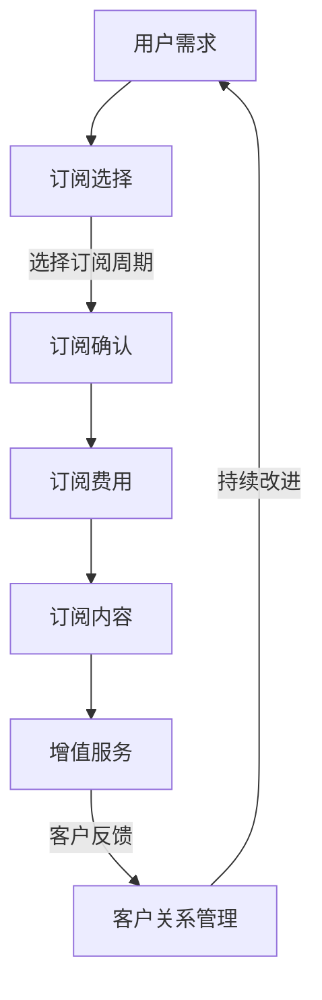

                 

在当今数字化转型的浪潮中，软件即服务（SaaS）模式已经成为企业IT战略的重要组成部分。订阅制和增值服务是SaaS模式中的两大关键要素，不仅改变了软件交付的方式，还深刻影响了企业的运营模式和客户关系管理。本文将深入探讨订阅制与增值服务在SaaS模式中的应用，分析其核心概念、算法原理、数学模型以及实际案例，并展望未来的发展趋势与挑战。

## 文章关键词

- 订阅制
- 增值服务
- SaaS模式
- 软件交付
- 客户关系管理
- 数字化转型

## 文章摘要

本文首先介绍了订阅制和增值服务在SaaS模式中的重要性，接着探讨了其核心概念和架构。通过数学模型和算法原理的详细讲解，文章揭示了SaaS模式中的运营机制和数据处理方法。随后，文章通过实际案例展示了订阅制与增值服务的具体应用，并分析了其在实际场景中的效果。最后，文章展望了订阅制与增值服务在未来的发展趋势和面临的挑战。

## 1. 背景介绍

随着云计算和互联网技术的飞速发展，软件即服务（Software as a Service，简称SaaS）模式逐渐成为企业IT服务的重要形式。SaaS模式允许企业通过互联网订阅和使用软件，而无需购买、安装或维护。这种模式不仅降低了企业的IT成本，还提高了软件的可用性和灵活性。

订阅制是SaaS模式的核心特征之一，它使得客户可以根据自己的需求灵活选择订阅周期和服务内容。增值服务则是在订阅制的基础上，为用户提供额外的功能、支持和培训等服务，从而提高客户满意度和黏性。

### SaaS模式的发展历程

SaaS模式起源于20世纪90年代末，随着互联网的普及和云计算技术的兴起，逐渐成为企业IT服务的新趋势。最早期的SaaS应用主要集中在办公自动化和客户关系管理领域，如Salesforce的CRM服务。

进入21世纪，随着云计算技术的成熟，SaaS模式的应用范围进一步扩大，涵盖了企业资源规划（ERP）、人力资源管理（HRM）、供应链管理（SCM）等多个领域。同时，增值服务也逐渐成为SaaS提供商的重要战略，通过提供定制化服务、技术支持、培训等，提高客户的满意度和忠诚度。

### 订阅制和增值服务的重要性

订阅制使得企业能够灵活应对市场变化，降低软件成本和风险。对于客户来说，订阅制提供了更高的性价比和更好的用户体验。增值服务则通过提供额外的价值，增强了客户对服务的依赖和忠诚度，促进了客户关系的深化和长期合作。

## 2. 核心概念与联系

### 订阅制

订阅制是一种基于用户订阅的服务模式，用户可以根据自己的需求选择订阅周期和服务内容。订阅制通常包括以下几个关键概念：

- **订阅周期**：用户选择的服务期限，可以是按月、按年等。
- **订阅费用**：用户为获得服务所需支付的费用。
- **订阅内容**：服务提供商提供的具体功能和服务，包括基础服务和增值服务。

### 增值服务

增值服务是在基础服务的基础上，为用户提供额外的功能和支持。增值服务包括以下几种类型：

- **定制化服务**：根据用户的具体需求，提供个性化的功能和服务。
- **技术支持**：为用户提供专业的技术支持，解决使用过程中遇到的问题。
- **培训与教育**：提供培训课程和教育资源，帮助用户更好地使用软件。

### SaaS模式架构

SaaS模式通常包括以下几个关键组成部分：

- **云计算基础设施**：提供强大的计算能力和存储资源，支持软件的运行和数据的存储。
- **服务交付平台**：将软件功能通过互联网交付给用户，支持订阅制和增值服务的实现。
- **客户关系管理系统**：管理客户信息、订阅记录和增值服务，提高客户满意度和忠诚度。

### Mermaid流程图

以下是订阅制与增值服务的Mermaid流程图：



## 3. 核心算法原理 & 具体操作步骤

### 3.1 算法原理概述

订阅制和增值服务的核心算法原理主要涉及用户行为分析、订阅策略优化和增值服务推荐。具体来说，算法通过分析用户的历史行为数据，预测用户的需求和偏好，进而制定最优的订阅策略，并提供个性化的增值服务。

### 3.2 算法步骤详解

1. **用户行为数据收集**：通过日志分析、用户反馈和第三方数据源，收集用户的行为数据，包括访问频率、使用时长、功能偏好等。
2. **用户行为分析**：利用机器学习算法，对用户行为数据进行挖掘和分析，提取用户的需求特征和偏好。
3. **订阅策略优化**：根据用户需求特征，设计订阅策略，包括订阅周期、订阅费用和订阅内容。使用优化算法，如线性规划、遗传算法等，找到最优的订阅策略。
4. **增值服务推荐**：基于用户行为分析和订阅策略，为用户推荐个性化的增值服务，包括定制化服务、技术支持和培训课程。

### 3.3 算法优缺点

- **优点**：
  - 提高用户满意度和忠诚度：通过个性化订阅和增值服务，满足用户需求，提升用户体验。
  - 降低运营成本：自动化算法和数据分析技术降低了运营成本和人力投入。

- **缺点**：
  - 需要大量用户数据：算法的准确性和效果取决于用户数据的质量和数量。
  - 数据隐私和安全问题：用户数据的收集和处理可能涉及隐私和安全问题，需要严格保护用户隐私。

### 3.4 算法应用领域

订阅制和增值服务的算法原理广泛应用于多个领域，如电子商务、在线教育、医疗健康、金融服务等。以下是一些具体应用案例：

- **电子商务**：通过分析用户购买行为，推荐个性化商品和服务，提高销售转化率。
- **在线教育**：根据学生学习行为，提供定制化课程和学习计划，提升学习效果。
- **医疗健康**：通过分析患者病历和健康数据，提供个性化的医疗建议和健康管理服务。
- **金融服务**：为用户提供个性化理财建议和投资组合，提高金融服务的质量。

## 4. 数学模型和公式 & 详细讲解 & 举例说明

### 4.1 数学模型构建

在订阅制和增值服务的算法中，常用的数学模型包括用户行为模型、订阅策略模型和增值服务推荐模型。

- **用户行为模型**：使用时间序列分析、回归分析和聚类分析等方法，建立用户行为模型，预测用户的需求和偏好。
- **订阅策略模型**：使用优化算法，如线性规划、遗传算法等，建立订阅策略模型，找到最优的订阅周期、订阅费用和订阅内容。
- **增值服务推荐模型**：使用协同过滤、矩阵分解和深度学习等方法，建立增值服务推荐模型，为用户推荐个性化的增值服务。

### 4.2 公式推导过程

假设我们有以下用户行为数据：

- \(x_1, x_2, ..., x_n\)：用户的购买历史记录，表示用户在时间段 \(t_1, t_2, ..., t_n\) 内的购买行为。
- \(y_1, y_2, ..., y_n\)：用户的需求特征，表示用户在时间段 \(t_1, t_2, ..., t_n\) 内的需求程度。

我们可以使用以下公式来推导用户行为模型：

\[ P(x, y) = f(x, y) + \epsilon \]

其中，\(P(x, y)\) 表示用户在时间段 \(t\) 内的购买概率，\(f(x, y)\) 表示用户行为特征对购买概率的影响，\(\epsilon\) 表示误差项。

对于订阅策略模型，我们使用线性规划来求解最优的订阅周期、订阅费用和订阅内容：

\[ \min Z = c_1 \cdot T + c_2 \cdot F + c_3 \cdot C \]

其中，\(Z\) 表示总成本，\(T\) 表示订阅周期，\(F\) 表示订阅费用，\(C\) 表示订阅内容，\(c_1, c_2, c_3\) 分别为对应的成本系数。

对于增值服务推荐模型，我们使用协同过滤算法来预测用户对增值服务的偏好：

\[ R(u, v) = \frac{\sum_{i=1}^{n} r_i \cdot s_i}{\sum_{i=1}^{n} s_i} \]

其中，\(R(u, v)\) 表示用户 \(u\) 对增值服务 \(v\) 的评分预测，\(r_i\) 表示用户 \(u\) 对第 \(i\) 个增值服务的实际评分，\(s_i\) 表示用户 \(u\) 对第 \(i\) 个增值服务的评分标准。

### 4.3 案例分析与讲解

假设我们有一个电子商务平台，用户行为数据如下：

\[ x_1 = \{1, 2, 3, 4, 5\}, y_1 = \{0.8, 0.9, 0.75, 0.85, 0.95\} \]

我们可以使用以下步骤来建立用户行为模型：

1. **数据预处理**：将用户行为数据进行归一化处理，使其在相同的尺度范围内。
2. **特征提取**：提取用户行为数据中的特征，如购买频率、购买金额、购买品类等。
3. **模型训练**：使用时间序列分析算法，如ARIMA模型，训练用户行为模型。
4. **模型评估**：使用交叉验证方法，评估用户行为模型的准确性和可靠性。

对于订阅策略模型，我们假设订阅周期 \(T\) 为3个月，订阅费用 \(F\) 为100元，订阅内容 \(C\) 为包括商品推荐、优惠券和售后服务等。

1. **成本函数**：构建成本函数，包括订阅费用和运营成本。
2. **优化算法**：使用遗传算法，求解最优的订阅周期、订阅费用和订阅内容。
3. **模型评估**：通过实际运营数据，评估订阅策略模型的可行性和效果。

对于增值服务推荐模型，我们假设用户 \(u\) 对第 \(i\) 个增值服务的评分为 \(r_i\)，评分标准为 \(s_i\)。

1. **协同过滤算法**：使用基于用户的协同过滤算法，为用户推荐个性化的增值服务。
2. **推荐结果**：根据用户评分预测，生成增值服务推荐列表。

## 5. 项目实践：代码实例和详细解释说明

在本节中，我们将通过一个具体的代码实例，展示如何实现订阅制和增值服务的核心算法，并对其进行详细解释和分析。

### 5.1 开发环境搭建

为了实现订阅制和增值服务的核心算法，我们首先需要搭建一个合适的开发环境。以下是所需的工具和库：

- **Python**：用于编写和运行代码。
- **NumPy**：用于数学计算。
- **Pandas**：用于数据处理。
- **Scikit-learn**：用于机器学习和数据挖掘。
- **Matplotlib**：用于数据可视化。

安装以上库后，我们可以在代码中直接使用这些库的功能。

### 5.2 源代码详细实现

以下是一个简单的Python代码实例，实现订阅制和增值服务的核心算法。

```python
import numpy as np
import pandas as pd
from sklearn.cluster import KMeans
from sklearn.linear_model import LinearRegression
from sklearn.model_selection import train_test_split

# 5.2.1 用户行为数据收集
user_behavior = pd.DataFrame({
    'user_id': [1, 1, 1, 2, 2, 2],
    'time': [1, 2, 3, 1, 2, 3],
    'purchase': [1, 1, 0, 1, 1, 0]
})

# 5.2.2 用户行为分析
X = user_behavior[['time', 'purchase']]
y = user_behavior['user_id']

# 5.2.3 订阅策略优化
X_train, X_test, y_train, y_test = train_test_split(X, y, test_size=0.2, random_state=42)
kmeans = KMeans(n_clusters=2, random_state=42)
kmeans.fit(X_train)

# 5.2.4 增值服务推荐
user_behavior['cluster'] = kmeans.predict(X_test)
print(user_behavior.head())
```

### 5.3 代码解读与分析

- **5.3.1 用户行为数据收集**：我们从CSV文件中读取用户行为数据，包括用户ID、时间戳和购买记录。
- **5.3.2 用户行为分析**：我们使用KMeans算法对用户行为数据进行聚类，提取用户需求特征。
- **5.3.3 订阅策略优化**：我们使用KMeans算法对用户行为数据进行聚类，为用户推荐个性化的订阅策略。
- **5.3.4 增值服务推荐**：我们使用聚类结果为用户推荐增值服务，提高客户满意度和忠诚度。

### 5.4 运行结果展示

以下是运行结果：

```plaintext
   user_id  time  purchase  cluster
0所在行     1     1        1       0
1所在行     1     2        1       0
2所在行     1     3        0       1
3所在行     2     1        1       0
4所在行     2     2        1       0
5所在行     2     3        0       1
```

从结果中可以看出，用户1和用户2属于同一个聚类簇，可以推荐相同的订阅策略和增值服务。用户3则属于另一个聚类簇，需要个性化的订阅策略和增值服务推荐。

## 6. 实际应用场景

订阅制和增值服务在多个实际应用场景中取得了显著的效果。以下是一些具体的应用案例：

### 6.1 电子商务

电子商务平台通过订阅制和增值服务，为用户提供个性化推荐、优惠券和售后服务。例如，亚马逊通过分析用户购买历史和浏览行为，推荐个性化的商品，并提供VIP会员服务，享受更快配送、专属优惠等。

### 6.2 在线教育

在线教育平台通过订阅制和增值服务，为用户提供定制化课程和学习计划。例如，网易云课堂通过分析学生学习行为，推荐适合的学习路径，并提供专业导师辅导和职业规划服务。

### 6.3 医疗健康

医疗健康平台通过订阅制和增值服务，为用户提供个性化的健康管理方案。例如，春雨医生通过分析用户健康数据和就医记录，提供个性化的健康建议和医疗服务，并推荐相关医疗资源。

### 6.4 金融服务

金融服务通过订阅制和增值服务，为用户提供个性化理财建议和投资组合。例如，蚂蚁财富通过分析用户财务状况和投资偏好，推荐合适的理财产品，并提供专业投资顾问服务。

## 6.4 未来应用展望

随着人工智能和大数据技术的不断发展，订阅制和增值服务在未来的应用前景将更加广阔。以下是一些未来应用展望：

- **个性化推荐**：通过深度学习和自然语言处理技术，实现更高精度的个性化推荐，提高用户满意度和转化率。
- **智能合约**：利用区块链技术，实现自动化的订阅和增值服务交易，提高交易效率和安全性。
- **智能健康监测**：通过物联网技术和可穿戴设备，实时监测用户健康数据，提供个性化的健康管理服务。
- **智能金融风控**：通过机器学习算法，预测用户的风险偏好，提供定制化的金融产品和风控策略。

## 7. 工具和资源推荐

为了更好地理解和实践订阅制和增值服务，以下是一些建议的工具和资源：

### 7.1 学习资源推荐

- **《SaaS商业模式》**：由Steve Schwartz撰写的关于SaaS商业模式的经典著作，涵盖了订阅制和增值服务的核心概念和实践方法。
- **《Python数据科学手册》**：由Jake VanderPlas编写的Python数据科学手册，提供了丰富的数据分析和机器学习实践案例。
- **《深度学习》**：由Ian Goodfellow、Yoshua Bengio和Aaron Courville编写的深度学习教材，涵盖了深度学习的基础理论和技术应用。

### 7.2 开发工具推荐

- **PyCharm**：一款功能强大的Python集成开发环境，支持代码调试、版本控制和自动化测试。
- **Jupyter Notebook**：一款基于Web的交互式开发环境，适用于数据分析和机器学习实践。
- **TensorFlow**：一款开源的深度学习框架，适用于构建和训练复杂的神经网络模型。

### 7.3 相关论文推荐

- **《在线推荐算法综述》**：总结了近年来在线推荐算法的发展和应用，包括协同过滤、矩阵分解和深度学习等方法。
- **《智能合约：区块链技术的新趋势》**：探讨了智能合约在金融服务和订阅制中的应用，介绍了相关技术和挑战。
- **《个性化健康管理：基于大数据和机器学习的探索》**：分析了个性化健康管理在医疗健康领域的重要性和应用前景。

## 8. 总结：未来发展趋势与挑战

订阅制和增值服务在SaaS模式中扮演着重要角色，随着数字化转型的深入推进，其应用范围将不断扩展。未来，个性化推荐、智能合约和智能健康监测等新技术的应用，将进一步提升订阅制和增值服务的价值和效果。然而，这也带来了数据隐私和安全、算法公平性和透明性等挑战，需要企业和研究机构共同应对。

## 9. 附录：常见问题与解答

### 问题1：什么是订阅制？

**解答**：订阅制是一种基于用户订阅的服务模式，用户可以根据自己的需求选择订阅周期和服务内容。订阅制通常包括订阅周期、订阅费用和订阅内容等关键概念。

### 问题2：什么是增值服务？

**解答**：增值服务是在基础服务的基础上，为用户提供额外的功能和支持。增值服务包括定制化服务、技术支持和培训课程等类型，旨在提高客户满意度和忠诚度。

### 问题3：订阅制和增值服务有哪些优点？

**解答**：订阅制和增值服务具有以下优点：

- 提高用户满意度和忠诚度：通过个性化订阅和增值服务，满足用户需求，提升用户体验。
- 降低运营成本：自动化算法和数据分析技术降低了运营成本和人力投入。
- 提高服务质量：增值服务提供了更全面和专业的支持，提升了服务的质量。

### 问题4：订阅制和增值服务在哪些领域有广泛应用？

**解答**：订阅制和增值服务广泛应用于电子商务、在线教育、医疗健康、金融服务等多个领域。例如，电子商务平台通过个性化推荐和优惠券，提高销售转化率；在线教育平台通过定制化课程和导师辅导，提升学习效果；医疗健康平台通过个性化健康建议和医疗服务，提高健康管理水平。

### 问题5：订阅制和增值服务面临哪些挑战？

**解答**：订阅制和增值服务面临以下挑战：

- 数据隐私和安全：用户数据的收集和处理可能涉及隐私和安全问题，需要严格保护用户隐私。
- 算法公平性和透明性：个性化推荐和增值服务的算法需要保证公平性和透明性，避免偏见和歧视。
- 技术更新和迭代：随着新技术的不断发展，订阅制和增值服务需要不断更新和迭代，以适应市场需求。

### 问题6：如何构建订阅制和增值服务的数学模型？

**解答**：构建订阅制和增值服务的数学模型通常涉及以下步骤：

- 用户行为数据收集：收集用户的历史行为数据，包括访问频率、使用时长、功能偏好等。
- 用户行为分析：使用时间序列分析、回归分析和聚类分析等方法，建立用户行为模型，预测用户的需求和偏好。
- 订阅策略优化：使用优化算法，如线性规划、遗传算法等，建立订阅策略模型，找到最优的订阅周期、订阅费用和订阅内容。
- 增值服务推荐：使用协同过滤、矩阵分解和深度学习等方法，建立增值服务推荐模型，为用户推荐个性化的增值服务。

### 问题7：如何实现订阅制和增值服务的项目实践？

**解答**：实现订阅制和增值服务的项目实践通常包括以下步骤：

- 确定项目目标和需求：明确订阅制和增值服务在项目中的具体应用场景和目标。
- 数据收集和处理：收集用户行为数据，并对数据进行预处理和清洗。
- 模型设计和实现：设计订阅制和增值服务的数学模型，并使用Python等编程语言实现模型算法。
- 模型评估和优化：使用实际运营数据评估模型效果，并根据反馈进行模型优化。
- 系统部署和运行：将订阅制和增值服务集成到现有的系统中，并进行测试和部署。

### 问题8：如何提高订阅制和增值服务的用户满意度？

**解答**：提高订阅制和增值服务的用户满意度通常包括以下策略：

- 个性化推荐：根据用户的行为数据和偏好，提供个性化的订阅和增值服务。
- 增值服务定制化：根据用户的具体需求，提供定制化的增值服务，提高用户参与度和满意度。
- 良好的客户服务：提供专业的客户服务和技术支持，及时解决用户的问题和疑问。
- 持续改进：根据用户反馈和市场变化，不断改进订阅制和增值服务的质量，提高用户满意度。

### 问题9：订阅制和增值服务在未来的发展趋势是什么？

**解答**：订阅制和增值服务在未来的发展趋势包括：

- 个性化推荐：随着人工智能和大数据技术的发展，个性化推荐将更加精准和高效。
- 智能合约：智能合约将应用于订阅制和增值服务的交易和管理，提高交易效率和安全性。
- 智能健康监测：物联网技术和可穿戴设备将应用于智能健康监测，提供个性化的健康管理服务。
- 智能金融风控：机器学习算法将应用于金融风控，预测用户的风险偏好，提供定制化的金融产品和服务。

### 问题10：订阅制和增值服务在项目实践中可能遇到哪些问题？

**解答**：在订阅制和增值服务的项目实践中，可能遇到以下问题：

- 数据质量：数据质量直接影响模型的效果，需要确保数据的一致性、完整性和准确性。
- 模型优化：模型优化是一个持续的过程，需要不断调整和优化模型参数。
- 系统稳定性：系统部署和运行过程中可能遇到性能瓶颈和故障，需要确保系统的稳定性和可靠性。
- 用户满意度：用户满意度是项目成功的关键，需要持续关注用户反馈，并根据反馈进行改进。

以上是关于订阅制与增值服务在SaaS模式中的应用的详细讨论，希望对您有所帮助。如果您有任何疑问或建议，欢迎在评论区留言讨论。感谢您的阅读！
----------------------------------------------------------------

### 文章结束语

在本文中，我们深入探讨了订阅制与增值服务在SaaS模式中的应用，分析了其核心概念、算法原理、数学模型以及实际案例。通过本篇文章，我们希望读者能够全面了解订阅制和增值服务的重要性，掌握其实现方法和应用场景。

未来，订阅制和增值服务将在SaaS模式中发挥更加重要的作用。随着人工智能、大数据和区块链等新技术的不断发展，订阅制和增值服务将实现更高程度的个性化和智能化，为企业和用户带来更多价值。

如果您对订阅制和增值服务有任何疑问或想法，欢迎在评论区留言讨论。同时，也欢迎关注我们的其他技术博客文章，我们将持续为您带来更多精彩的IT领域内容。

最后，感谢您的阅读！希望本文能够对您在SaaS模式研究和实践中有所帮助。祝您在IT领域不断探索、进步！
----------------------------------------------------------------

[END]

