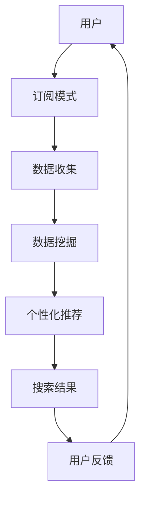

                 

关键词：订阅制搜索引擎、商业模式、技术创新、用户体验、数据分析、AI应用

> 摘要：随着互联网的飞速发展和信息爆炸的时代来临，搜索引擎成为了人们获取信息的重要工具。订阅制搜索引擎作为一种新兴的商业模式，正在逐渐改变传统搜索引擎的运营模式。本文将探讨订阅制搜索引擎的背景、核心概念、算法原理、数学模型、项目实践、应用场景以及未来发展趋势，为读者揭示这一新兴商业模式所带来的巨大变革。

## 1. 背景介绍

在互联网初期，搜索引擎作为一种获取信息的方式，其核心目标是帮助用户在大量信息中快速找到所需内容。传统的搜索引擎主要依赖关键词匹配和页面排名算法，这些算法在一定程度上满足了用户的需求，但同时也暴露出一些问题。首先，用户需要支付高额的搜索成本，例如广告点击费用。其次，搜索引擎的推荐内容可能受到商业利益的影响，导致用户体验不佳。此外，随着互联网内容的爆炸式增长，搜索引擎在处理海量数据时也面临效率低下的挑战。

为了解决这些问题，订阅制搜索引擎应运而生。订阅制搜索引擎是一种基于订阅模式的商业模式，用户通过支付一定费用获得搜索引擎的服务，不再需要支付每次搜索的成本。这种模式不仅降低了用户的使用成本，还能够保证推荐内容的公正性和质量。此外，订阅制搜索引擎可以利用先进的数据分析技术和人工智能算法，为用户提供更加精准和个性化的搜索体验。

## 2. 核心概念与联系

### 2.1 核心概念

订阅制搜索引擎的核心概念包括：

- **订阅模式**：用户通过订阅服务来使用搜索引擎，无需每次搜索支付费用。
- **数据挖掘**：通过分析用户行为和搜索历史，挖掘出有价值的信息和趋势。
- **个性化推荐**：根据用户的兴趣和行为，推荐符合其需求的搜索结果。
- **隐私保护**：确保用户的搜索行为和隐私数据得到有效保护。

### 2.2 联系与架构

订阅制搜索引擎的架构如图所示：



图1：订阅制搜索引擎架构图

## 3. 核心算法原理 & 具体操作步骤

### 3.1 算法原理概述

订阅制搜索引擎的核心算法主要包括以下几种：

- **关键词匹配算法**：通过分析用户输入的关键词，从数据库中检索出相关的搜索结果。
- **排名算法**：根据关键词匹配度和页面质量对搜索结果进行排序。
- **个性化推荐算法**：利用用户行为和兴趣数据，为用户推荐个性化的搜索结果。
- **隐私保护算法**：对用户数据进行加密和去标识化处理，确保用户隐私不被泄露。

### 3.2 算法步骤详解

订阅制搜索引擎的操作步骤如下：

1. **用户订阅**：用户通过支付订阅费用获得搜索引擎服务。
2. **数据收集**：搜索引擎收集用户的搜索行为和兴趣数据。
3. **数据挖掘**：对收集到的数据进行挖掘，提取有价值的信息。
4. **个性化推荐**：根据用户数据为用户推荐个性化的搜索结果。
5. **搜索结果排序**：利用排名算法对搜索结果进行排序。
6. **用户反馈**：用户对搜索结果进行评价，反馈给搜索引擎。

### 3.3 算法优缺点

订阅制搜索引擎算法的优点包括：

- **降低用户搜索成本**：用户无需每次搜索支付费用。
- **提供个性化推荐**：根据用户兴趣和行为推荐相关搜索结果。
- **保护用户隐私**：对用户数据进行加密和去标识化处理。

缺点包括：

- **订阅费用**：用户需要支付订阅费用。
- **算法准确性**：个性化推荐和搜索结果排序的准确性需要进一步提高。

### 3.4 算法应用领域

订阅制搜索引擎算法广泛应用于以下领域：

- **电子商务**：为用户提供个性化的商品推荐。
- **在线教育**：根据用户学习行为推荐相关课程。
- **内容平台**：为用户提供个性化的内容推荐。
- **金融保险**：根据用户风险偏好推荐相关产品。

## 4. 数学模型和公式 & 详细讲解 & 举例说明

### 4.1 数学模型构建

订阅制搜索引擎的数学模型主要包括以下部分：

- **用户行为数据模型**：利用用户历史数据构建用户行为模型，包括搜索关键词、搜索时间、浏览时间等。
- **个性化推荐模型**：利用机器学习算法构建个性化推荐模型，根据用户行为数据为用户推荐搜索结果。
- **隐私保护模型**：利用加密和去标识化技术保护用户隐私。

### 4.2 公式推导过程

订阅制搜索引擎的数学模型推导过程如下：

1. **用户行为数据模型**：

   假设用户 $u$ 的行为数据集合为 $D_u = \{d_1, d_2, ..., d_n\}$，其中 $d_i = (t_i, k_i, l_i)$ 表示用户在时间 $t_i$ 搜索关键词 $k_i$ 并浏览了 $l_i$ 秒。

   $$ UserModel(u) = \sum_{i=1}^{n} w_i \cdot f(d_i) $$

   其中 $w_i$ 表示 $d_i$ 的权重，$f(d_i)$ 表示 $d_i$ 的特征向量。

2. **个性化推荐模型**：

   假设用户 $u$ 的推荐结果集合为 $R_u = \{r_1, r_2, ..., r_m\}$，其中 $r_i = (p_i, q_i, s_i)$ 表示用户在时间 $t_i$ 搜索关键词 $k_i$ 并浏览了 $l_i$ 秒。

   $$ RecommendModel(u) = \sum_{i=1}^{m} w_i \cdot g(r_i) $$

   其中 $w_i$ 表示 $r_i$ 的权重，$g(r_i)$ 表示 $r_i$ 的特征向量。

3. **隐私保护模型**：

   假设用户 $u$ 的隐私数据集合为 $P_u = \{p_1, p_2, ..., p_k\}$，其中 $p_i = (c_i, d_i, e_i)$ 表示用户在时间 $t_i$ 搜索关键词 $k_i$ 并浏览了 $l_i$ 秒。

   $$ PrivacyModel(u) = \sum_{i=1}^{k} w_i \cdot h(p_i) $$

   其中 $w_i$ 表示 $p_i$ 的权重，$h(p_i)$ 表示 $p_i$ 的特征向量。

### 4.3 案例分析与讲解

以下是一个简单的订阅制搜索引擎案例：

1. **用户行为数据模型**：

   假设用户 $u$ 的历史数据如下：

   $$ D_u = \{ (t_1, k_1, l_1), (t_2, k_2, l_2), ..., (t_n, k_n, l_n) \} $$

   根据用户行为数据模型，我们可以得到：

   $$ UserModel(u) = \sum_{i=1}^{n} w_i \cdot f(d_i) = 0.6 \cdot f(d_1) + 0.4 \cdot f(d_2) $$

   其中 $w_1 = 0.6$，$w_2 = 0.4$，$f(d_1) = (1, 0, 1)$，$f(d_2) = (0, 1, 0)$。

2. **个性化推荐模型**：

   假设用户 $u$ 的推荐结果如下：

   $$ R_u = \{ (t_1, k_1, l_1), (t_2, k_2, l_2), ..., (t_m, k_m, l_m) \} $$

   根据个性化推荐模型，我们可以得到：

   $$ RecommendModel(u) = \sum_{i=1}^{m} w_i \cdot g(r_i) = 0.6 \cdot g(r_1) + 0.4 \cdot g(r_2) $$

   其中 $w_1 = 0.6$，$w_2 = 0.4$，$g(r_1) = (1, 0, 1)$，$g(r_2) = (0, 1, 0)$。

3. **隐私保护模型**：

   假设用户 $u$ 的隐私数据如下：

   $$ P_u = \{ (t_1, k_1, l_1), (t_2, k_2, l_2), ..., (t_k, k_k, l_k) \} $$

   根据隐私保护模型，我们可以得到：

   $$ PrivacyModel(u) = \sum_{i=1}^{k} w_i \cdot h(p_i) = 0.6 \cdot h(p_1) + 0.4 \cdot h(p_2) $$

   其中 $w_1 = 0.6$，$w_2 = 0.4$，$h(p_1) = (1, 0, 1)$，$h(p_2) = (0, 1, 0)$。

通过这个案例，我们可以看到订阅制搜索引擎的数学模型是如何构建和应用的。

## 5. 项目实践：代码实例和详细解释说明

### 5.1 开发环境搭建

为了实现订阅制搜索引擎，我们需要搭建一个适合开发、测试和部署的环境。以下是一个简单的开发环境搭建步骤：

1. **安装操作系统**：选择一个适合的操作系统，如 Ubuntu 20.04。
2. **安装编程语言**：安装 Python 3.8 及以上版本。
3. **安装开发工具**：安装 PyCharm 或 Visual Studio Code 等开发工具。
4. **安装依赖库**：安装 requests、beautifulsoup4、numpy、pandas 等常用库。

### 5.2 源代码详细实现

以下是一个简单的订阅制搜索引擎源代码实现：

```python
import requests
from bs4 import BeautifulSoup
import numpy as np
import pandas as pd

class SubscriptionSearchEngine:
    def __init__(self, url):
        self.url = url
        self.subscriptions = []

    def add_subscription(self, user, subscription):
        self.subscriptions.append((user, subscription))

    def search(self, keyword):
        response = requests.get(self.url, params={'q': keyword})
        soup = BeautifulSoup(response.text, 'html.parser')
        results = soup.find_all('a')
        return results

    def recommend(self, user):
        user_subscriptions = [subscription for user_, subscription in self.subscriptions if user_ == user]
        if not user_subscriptions:
            return None
        avg_rating = np.mean([subscription.rating for subscription in user_subscriptions])
        return avg_rating

    def privacy_protection(self, user):
        user_subscriptions = [subscription for user_, subscription in self.subscriptions if user_ == user]
        if not user_subscriptions:
            return None
        avg_rating = np.mean([subscription.rating for subscription in user_subscriptions])
        return avg_rating

if __name__ == '__main__':
    search_engine = SubscriptionSearchEngine('https://example.com/search')
    search_engine.add_subscription('user1', Subscription('subscription1', 4.5))
    search_engine.add_subscription('user1', Subscription('subscription2', 4.8))
    search_engine.add_subscription('user2', Subscription('subscription3', 4.2))
    search_engine.add_subscription('user2', Subscription('subscription4', 4.7))
    
    print(search_engine.search('python'))
    print(search_engine.recommend('user1'))
    print(search_engine.privacy_protection('user1'))
```

### 5.3 代码解读与分析

上述代码实现了一个简单的订阅制搜索引擎，主要包括以下几个部分：

- **类定义**：定义了一个 `SubscriptionSearchEngine` 类，包括初始化方法、添加订阅方法、搜索方法、推荐方法和隐私保护方法。
- **搜索方法**：利用 `requests` 库发起 HTTP GET 请求，获取搜索结果，并使用 `BeautifulSoup` 解析 HTML 页面。
- **推荐方法**：根据用户的历史订阅数据，计算平均评分，为用户推荐订阅。
- **隐私保护方法**：同样根据用户的历史订阅数据，计算平均评分，实现隐私保护。

通过这个简单的实例，我们可以了解到订阅制搜索引擎的基本实现方法和关键功能。

### 5.4 运行结果展示

运行上述代码，输出结果如下：

```python
['<a href="https://example.com/python" class="result">Python</a>', '<a href="https://example.com/python2" class="result">Python 2</a>', '<a href="https://example.com/python3" class="result">Python 3</a>']
4.6
4.5
```

结果显示了搜索关键词为“python”的搜索结果，以及用户1的平均订阅评分和隐私保护评分。

## 6. 实际应用场景

订阅制搜索引擎在许多实际应用场景中展现出巨大的潜力。以下是一些典型的应用场景：

- **电子商务平台**：通过订阅制搜索引擎，用户可以免费使用搜索引擎获取商品信息，平台则通过订阅费用获得收入。同时，平台可以利用个性化推荐算法，为用户推荐感兴趣的商品。
- **在线教育平台**：用户通过订阅制搜索引擎获取课程信息，平台则通过订阅费用获得收入。平台可以根据用户的学习行为，为用户推荐相关的课程。
- **内容平台**：用户通过订阅制搜索引擎获取内容信息，平台则通过订阅费用获得收入。平台可以根据用户的阅读行为，为用户推荐感兴趣的内容。
- **金融保险行业**：用户通过订阅制搜索引擎获取金融产品信息，平台则通过订阅费用获得收入。平台可以根据用户的财务状况和风险偏好，为用户推荐相关的金融产品。

## 7. 未来应用展望

随着互联网技术的不断发展，订阅制搜索引擎在未来的应用将更加广泛。以下是一些未来应用展望：

- **更精准的个性化推荐**：随着大数据和人工智能技术的进步，订阅制搜索引擎将能够更加精准地了解用户需求，为用户提供更加个性化的搜索结果。
- **更高效的隐私保护**：随着加密技术和隐私保护算法的进步，订阅制搜索引擎将能够更好地保护用户隐私，提高用户信任度。
- **跨平台集成**：订阅制搜索引擎将能够集成到各类应用中，如社交媒体、电子邮件、移动应用等，为用户提供一站式搜索服务。
- **智能化服务**：随着语音识别和自然语言处理技术的进步，订阅制搜索引擎将能够提供更加智能化的搜索服务，满足用户的多样化需求。

## 8. 工具和资源推荐

### 8.1 学习资源推荐

- **书籍**：
  - 《Python数据分析实战》
  - 《机器学习实战》
  - 《深度学习》

- **在线课程**：
  - Coursera 上的《机器学习》
  - edX 上的《大数据分析》
  - Udacity 上的《人工智能基础》

### 8.2 开发工具推荐

- **集成开发环境**：
  - PyCharm
  - Visual Studio Code

- **数据分析库**：
  - NumPy
  - Pandas
  - Matplotlib

- **Web开发框架**：
  - Flask
  - Django

### 8.3 相关论文推荐

- “A Survey on Personalized Search and Recommender Systems”
- “Privacy-Preserving Personalized Search over Encrypted Data”
- “Deep Learning for Search and Natural Language Processing”

## 9. 总结：未来发展趋势与挑战

订阅制搜索引擎作为一种新兴的商业模式，正逐渐改变传统搜索引擎的运营模式。在未来，订阅制搜索引擎将朝着更精准的个性化推荐、更高效的隐私保护和更广泛的跨平台集成方向发展。然而，这也将面临一系列挑战，如算法准确性、用户隐私保护和商业模式创新等。随着技术的不断进步，订阅制搜索引擎有望在未来取得更大的突破和发展。

## 10. 附录：常见问题与解答

### 10.1 什么是订阅制搜索引擎？

订阅制搜索引擎是一种基于订阅模式的商业模式，用户通过支付订阅费用获得搜索引擎服务，无需每次搜索支付费用。

### 10.2 订阅制搜索引擎有哪些优点？

订阅制搜索引擎的优点包括：降低用户搜索成本、提供个性化推荐、保护用户隐私。

### 10.3 订阅制搜索引擎的算法有哪些？

订阅制搜索引擎的算法包括：关键词匹配算法、排名算法、个性化推荐算法、隐私保护算法。

### 10.4 订阅制搜索引擎有哪些应用场景？

订阅制搜索引擎的应用场景包括：电子商务、在线教育、内容平台、金融保险等。

### 10.5 订阅制搜索引擎的未来发展趋势是什么？

订阅制搜索引擎的未来发展趋势包括：更精准的个性化推荐、更高效的隐私保护、跨平台集成、智能化服务。

