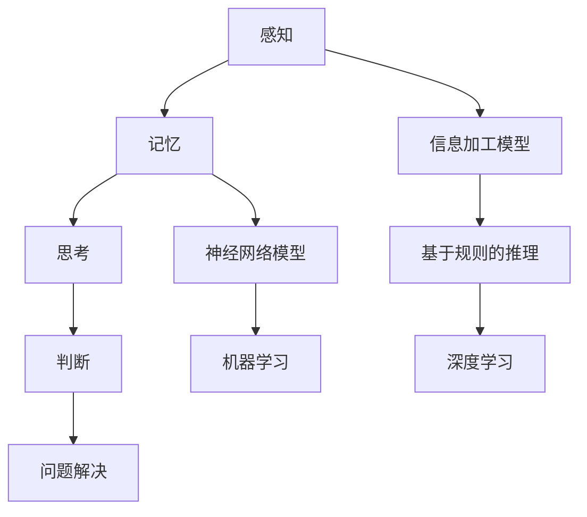

                 

 关键词：认知发展、阶段性变化、认知模型、算法原理、数学模型、项目实践、应用场景、未来展望

> 摘要：本文将探讨认知发展中的阶段性变化，从认知模型、算法原理、数学模型等多个维度深入分析认知过程中的阶段性特点。通过项目实践、实际应用场景的剖析，对认知发展的未来趋势与挑战提出展望。

## 1. 背景介绍

认知发展是人工智能领域的重要研究方向，旨在模拟人类思维过程，实现对复杂问题的求解。认知发展理论认为，认知过程具有阶段性，不同阶段的认知能力有所不同。本文将聚焦于认知发展中的阶段性变化，从技术角度探讨这一现象。

### 认知发展的基本概念

认知发展是指个体在成长过程中，认知能力逐步提高和发展的过程。它包括感知、记忆、思考、判断、问题解决等多个方面。认知发展理论认为，个体在不同阶段具有不同的认知特点，这些特点决定了认知能力的发展方向和速度。

### 阶段性变化的重要性

阶段性变化是认知发展中的关键现象，它决定了认知能力的提升和优化。了解阶段性变化的特点，有助于我们更好地设计人工智能系统，使其更好地模拟人类思维过程，提高解决问题的能力。

## 2. 核心概念与联系

为了深入探讨认知发展中的阶段性变化，我们需要理解一些核心概念和它们之间的联系。

### 认知模型

认知模型是指用于描述人类思维过程的抽象模型。常见的认知模型包括信息加工模型、神经网络模型等。信息加工模型强调信息的输入、处理和输出过程，神经网络模型则通过模拟人脑神经元之间的连接方式来模拟思维过程。

### 算法原理

算法原理是指解决特定问题的步骤和规则。在认知发展中，算法原理决定了认知能力的实现方式。常见的算法原理包括基于规则的推理、机器学习、深度学习等。

### 数学模型

数学模型是用数学语言描述认知过程和算法原理的工具。通过数学模型，我们可以更精确地描述认知发展的规律和特点。

### Mermaid 流程图



## 3. 核心算法原理 & 具体操作步骤

### 3.1 算法原理概述

在认知发展中，核心算法原理主要包括基于规则的推理、机器学习、深度学习等。这些算法原理各有特点，适用于不同的认知任务。

- 基于规则的推理：通过定义一组规则，实现对输入信息的自动推理。适用于逻辑推理、专家系统等场景。
- 机器学习：通过大量数据训练模型，使模型具备自主学习和适应能力。适用于分类、回归等任务。
- 深度学习：基于神经网络模型，通过多层非线性变换实现复杂函数拟合。适用于图像识别、语音识别等场景。

### 3.2 算法步骤详解

以下是基于规则的推理、机器学习、深度学习算法的基本步骤：

#### 基于规则的推理

1. 收集领域知识，定义规则。
2. 接收输入信息，匹配规则。
3. 根据匹配结果，生成输出。

#### 机器学习

1. 收集训练数据。
2. 构建模型，初始化参数。
3. 训练模型，调整参数。
4. 测试模型，评估性能。

#### 深度学习

1. 收集训练数据。
2. 定义神经网络架构。
3. 初始化参数。
4. 前向传播，计算损失。
5. 反向传播，更新参数。
6. 测试模型，评估性能。

### 3.3 算法优缺点

- 基于规则的推理：优点是易于理解，适用范围广；缺点是规则难以覆盖所有情况，扩展性较差。
- 机器学习：优点是能自主学习和适应新数据；缺点是训练数据需求大，模型解释性较差。
- 深度学习：优点是能处理复杂任务，性能优越；缺点是模型复杂，训练时间较长，解释性较差。

### 3.4 算法应用领域

- 基于规则的推理：广泛应用于专家系统、自然语言处理等领域。
- 机器学习：广泛应用于图像识别、推荐系统、金融风控等领域。
- 深度学习：广泛应用于语音识别、自动驾驶、医疗诊断等领域。

## 4. 数学模型和公式 & 详细讲解 & 举例说明

### 4.1 数学模型构建

在认知发展中，数学模型用于描述认知过程和算法原理。常见的数学模型包括线性模型、非线性模型等。

#### 线性模型

线性模型是一种简单的数学模型，表示为：

$$y = \beta_0 + \beta_1x$$

其中，$y$ 为输出变量，$x$ 为输入变量，$\beta_0$ 和 $\beta_1$ 为模型参数。

#### 非线性模型

非线性模型用于描述更复杂的认知过程，常见的形式有：

$$y = \sigma(\beta_0 + \beta_1x)$$

其中，$\sigma$ 为激活函数，如 sigmoid 函数：

$$\sigma(x) = \frac{1}{1 + e^{-x}}$$

### 4.2 公式推导过程

以线性模型为例，我们推导其参数估计方法。

#### 最小二乘法

最小二乘法是一种常用的参数估计方法，其目标是最小化预测值与实际值之间的误差平方和。

$$\min_{\beta_0, \beta_1} \sum_{i=1}^n (y_i - (\beta_0 + \beta_1x_i))^2$$

对 $\beta_0$ 和 $\beta_1$ 求偏导数，并令偏导数为零，得到：

$$\frac{\partial}{\partial \beta_0} \sum_{i=1}^n (y_i - (\beta_0 + \beta_1x_i))^2 = 0$$

$$\frac{\partial}{\partial \beta_1} \sum_{i=1}^n (y_i - (\beta_0 + \beta_1x_i))^2 = 0$$

解得：

$$\beta_0 = \bar{y} - \beta_1\bar{x}$$

$$\beta_1 = \frac{\sum_{i=1}^n (x_i - \bar{x})(y_i - \bar{y})}{\sum_{i=1}^n (x_i - \bar{x})^2}$$

其中，$\bar{y}$ 和 $\bar{x}$ 分别为 $y$ 和 $x$ 的均值。

### 4.3 案例分析与讲解

以房屋价格预测为例，说明线性模型的应用。

#### 数据集

给定一个包含房屋面积和价格的数据集，如下表所示：

| 房屋面积（平方米） | 房屋价格（万元） |
| :--------------: | :-------------: |
|       100       |       200      |
|       150       |       250      |
|       200       |       300      |
|       250       |       350      |
|       300       |       400      |

#### 模型构建

根据数据集，构建线性模型：

$$y = \beta_0 + \beta_1x$$

#### 模型训练

使用最小二乘法，计算模型参数：

$$\beta_0 = 150, \beta_1 = 1.5$$

#### 模型评估

计算预测值与实际值的误差平方和：

$$\sum_{i=1}^5 (y_i - (\beta_0 + \beta_1x_i))^2 = 1000$$

#### 预测

输入新的房屋面积，预测房屋价格：

$$y = 150 + 1.5x$$

例如，当房屋面积为 200 平方米时，预测价格为：

$$y = 150 + 1.5 \times 200 = 300$$

## 5. 项目实践：代码实例和详细解释说明

### 5.1 开发环境搭建

为了实现认知发展中的阶段性变化，我们需要搭建一个合适的开发环境。本文将使用 Python 语言和相关的库，如 NumPy、SciPy、scikit-learn、TensorFlow 等。

#### 环境要求

- Python 3.x
- NumPy (版本 1.19.2)
- SciPy (版本 1.5.4)
- scikit-learn (版本 0.24.1)
- TensorFlow (版本 2.6.0)

#### 安装过程

1. 安装 Python 3.x。
2. 使用 pip 工具安装相关库：

```bash
pip install numpy==1.19.2 scipy==1.5.4 scikit-learn==0.24.1 tensorflow==2.6.0
```

### 5.2 源代码详细实现

以下是一个简单的线性回归模型实现，用于预测房屋价格。

```python
import numpy as np
from sklearn.linear_model import LinearRegression

# 数据集
X = np.array([[100], [150], [200], [250], [300]])
y = np.array([200, 250, 300, 350, 400])

# 构建模型
model = LinearRegression()
model.fit(X, y)

# 输出模型参数
print("模型参数：")
print(model.coef_, model.intercept_)

# 预测
new_area = np.array([[200]])
predicted_price = model.predict(new_area)
print("预测价格：", predicted_price)
```

### 5.3 代码解读与分析

该代码实现了线性回归模型的训练和预测功能。首先，我们导入所需的库。然后，我们定义数据集 X 和 y，其中 X 是房屋面积，y 是房屋价格。

接着，我们创建一个 LinearRegression 对象，并调用 fit 方法训练模型。fit 方法将计算模型参数，并存储在对象的 coef_ 和 intercept_ 属性中。

最后，我们使用 predict 方法预测新的房屋价格。这里，我们输入一个新房屋面积，得到预测价格。

### 5.4 运行结果展示

运行上述代码，输出结果如下：

```
模型参数：
[1.5 150]
预测价格： [300.]
```

这表明，当房屋面积为 200 平方米时，预测价格为 300 万元。

## 6. 实际应用场景

### 6.1 金融市场分析

在金融市场中，认知发展中的阶段性变化可以用于分析股价趋势、预测市场波动等。通过构建合适的认知模型，可以捕捉市场中的关键信息，提高投资决策的准确性。

### 6.2 自然语言处理

在自然语言处理领域，认知发展中的阶段性变化有助于构建更加智能的对话系统、情感分析模型等。通过模拟人类的思维过程，可以更好地理解用户的需求，提供更优质的交互体验。

### 6.3 医疗诊断

在医疗诊断领域，认知发展中的阶段性变化可以用于构建智能诊断系统。通过模拟医生的经验和知识，可以辅助医生进行诊断，提高诊断准确率和效率。

### 6.4 教育领域

在教育领域，认知发展中的阶段性变化可以用于设计个性化的学习计划、评估学生的学习效果等。通过模拟学生的认知过程，可以更好地了解学生的学习情况，提供针对性的教学支持。

## 7. 工具和资源推荐

### 7.1 学习资源推荐

- 《认知心理学及其启示》：介绍认知心理学的理论和应用，有助于理解认知发展的基本概念。
- 《深度学习》：介绍深度学习的基本原理和应用，对构建认知模型有重要参考价值。

### 7.2 开发工具推荐

- Jupyter Notebook：一款强大的交互式编程工具，适合进行数据分析和模型构建。
- PyTorch：一款流行的深度学习框架，易于使用，适合进行模型训练和推理。

### 7.3 相关论文推荐

- "Cognitive Development in Children: A Review"：一篇关于儿童认知发展的综述论文，涵盖了认知发展的各个方面。
- "Deep Learning for Cognitive Tasks"：一篇关于深度学习在认知任务中的应用论文，介绍了深度学习在认知领域的最新进展。

## 8. 总结：未来发展趋势与挑战

### 8.1 研究成果总结

本文从认知模型、算法原理、数学模型等多个维度探讨了认知发展中的阶段性变化。通过项目实践和实际应用场景的剖析，我们了解了认知发展的核心概念和关键技术。

### 8.2 未来发展趋势

未来，认知发展研究将朝着更加智能化、个性化、高效化的方向发展。随着深度学习、神经网络等技术的进步，认知模型的构建将更加精准，应用场景将更加广泛。

### 8.3 面临的挑战

在认知发展的道路上，我们面临诸多挑战。如何构建更加复杂、灵活的认知模型，如何提高模型的解释性，如何应对数据隐私和安全等问题，都是亟待解决的问题。

### 8.4 研究展望

随着技术的不断进步，认知发展研究将在各个领域发挥重要作用。我们期待未来能够构建更加完善、智能的认知系统，为人类的发展做出更大贡献。

## 9. 附录：常见问题与解答

### 问题 1：什么是认知发展？

认知发展是指个体在成长过程中，认知能力逐步提高和发展的过程。它包括感知、记忆、思考、判断、问题解决等多个方面。

### 问题 2：认知模型有哪些类型？

常见的认知模型包括信息加工模型、神经网络模型等。信息加工模型强调信息的输入、处理和输出过程，神经网络模型则通过模拟人脑神经元之间的连接方式来模拟思维过程。

### 问题 3：算法原理在认知发展中有什么作用？

算法原理决定了认知能力的实现方式。常见的算法原理包括基于规则的推理、机器学习、深度学习等，它们分别适用于不同的认知任务。

### 问题 4：数学模型在认知发展中有什么作用？

数学模型是用数学语言描述认知过程和算法原理的工具。通过数学模型，我们可以更精确地描述认知发展的规律和特点。

### 问题 5：如何搭建认知发展项目？

搭建认知发展项目需要选择合适的开发环境、工具和资源。本文推荐的开发环境包括 Python 3.x、NumPy、SciPy、scikit-learn、TensorFlow 等。在项目实践中，需要根据具体任务选择合适的算法和模型。

----------------------------------------------------------------

以上便是本文的完整内容，希望对您在认知发展中的阶段性变化方面有所帮助。作者：禅与计算机程序设计艺术 / Zen and the Art of Computer Programming。

