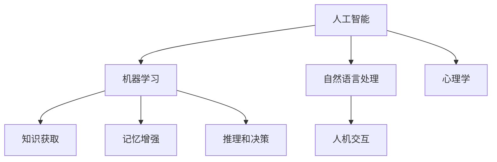

                 

关键词：认知增强，人工智能，知识获取，算法，数学模型，应用场景，发展趋势

> 摘要：本文深入探讨了认知增强技术，特别是在人工智能辅助下的知识获取。通过介绍核心概念、算法原理、数学模型以及实际应用，分析了认知增强技术在当前和未来的发展趋势，面临的挑战，以及可能的解决方案。

## 1. 背景介绍

认知增强技术，指的是通过外部技术手段提升人类认知能力和工作效率的技术。随着人工智能的快速发展，认知增强技术越来越受到关注。在人工智能辅助下，认知增强技术不仅能够提升个人的学习效率，还能够为企业和组织提供智能化的知识管理解决方案。

人工智能在认知增强中的应用，主要体现在以下几个方面：

1. **知识获取**：通过大数据分析和机器学习算法，人工智能能够快速获取、整理和筛选大量的信息，帮助用户快速定位所需的知识。
2. **记忆增强**：利用记忆模型和算法，人工智能能够辅助人类记忆重要信息，提高学习效果。
3. **推理和决策**：人工智能可以基于大量数据，进行复杂的推理和决策，为人类提供更加科学的建议。
4. **人机交互**：通过自然语言处理和语音识别技术，人工智能能够与人类进行更加自然和高效的互动，提升工作效率。

## 2. 核心概念与联系

认知增强技术涉及多个核心概念和领域，包括人工智能、机器学习、自然语言处理、心理学等。下面是一个简要的 Mermaid 流程图，展示了这些核心概念和它们之间的联系。



### 2.1 人工智能与机器学习

人工智能（AI）是认知增强技术的基础，它通过模拟人类智能，实现智能感知、推理、学习、决策等功能。而机器学习是人工智能的核心技术之一，它使计算机能够从数据中学习，自动改进性能。

### 2.2 自然语言处理与人机交互

自然语言处理（NLP）是人工智能的一个分支，它致力于使计算机理解和处理自然语言。NLP技术在认知增强中发挥着重要作用，如文本分析、情感识别等。而人机交互（HCI）则专注于如何使人与计算机之间的交互更加自然和高效。

### 2.3 记忆增强与心理学

记忆增强是认知增强技术的一个重要方面，它通过模拟人脑记忆机制，帮助用户更好地记忆信息。心理学为记忆增强提供了理论基础，如记忆模型、记忆编码等。

## 3. 核心算法原理 & 具体操作步骤

### 3.1 算法原理概述

认知增强技术中的核心算法主要包括机器学习算法、自然语言处理算法和记忆增强算法。以下是对这些算法的简要概述：

### 3.2 算法步骤详解

#### 3.2.1 机器学习算法

1. **数据收集**：收集大量的数据，包括文本、图像、声音等。
2. **数据预处理**：对数据进行清洗、标注和处理，以便用于训练模型。
3. **模型训练**：使用训练数据训练机器学习模型。
4. **模型评估**：使用验证数据评估模型的性能。
5. **模型部署**：将训练好的模型部署到实际应用中。

#### 3.2.2 自然语言处理算法

1. **文本预处理**：对文本进行分词、去停用词、词性标注等处理。
2. **特征提取**：提取文本的关键特征，如词频、词嵌入等。
3. **模型训练**：使用训练数据训练NLP模型。
4. **模型评估**：使用验证数据评估模型的性能。
5. **模型部署**：将训练好的模型部署到实际应用中。

#### 3.2.3 记忆增强算法

1. **记忆模型构建**：构建基于心理学理论的记忆模型。
2. **数据输入**：将学习内容输入到记忆模型中。
3. **记忆编码**：对输入的数据进行编码，形成记忆。
4. **记忆检索**：在需要时检索记忆中的信息。
5. **记忆更新**：根据新的学习内容，更新记忆模型。

### 3.3 算法优缺点

#### 3.3.1 机器学习算法

**优点**：
- **自动学习**：能够从数据中自动学习，提高效率。
- **泛化能力**：通过训练，能够处理新的数据。

**缺点**：
- **数据依赖**：需要大量高质量的数据。
- **模型复杂度**：模型的复杂度较高，难以理解和解释。

#### 3.3.2 自然语言处理算法

**优点**：
- **自然交互**：能够与用户进行自然语言交互。
- **多样应用**：在文本分析、情感识别、机器翻译等领域有广泛应用。

**缺点**：
- **语言复杂性**：自然语言具有复杂性，算法难以完全理解。
- **计算资源**：NLP算法通常需要大量的计算资源。

#### 3.3.3 记忆增强算法

**优点**：
- **个性化记忆**：能够根据用户的需求，个性化记忆信息。
- **高效记忆**：能够快速记忆大量信息。

**缺点**：
- **记忆容量**：受限于计算机的存储容量。
- **记忆持久性**：记忆的持久性有限，需要定期更新。

### 3.4 算法应用领域

认知增强技术在多个领域都有广泛的应用，包括：

- **教育**：通过机器学习和自然语言处理技术，提高学习效率。
- **医疗**：通过机器学习和图像处理技术，辅助医生进行诊断和治疗。
- **商业**：通过大数据分析和机器学习技术，提供智能化的商业决策支持。
- **安全**：通过人工智能技术，提高网络安全防护能力。

## 4. 数学模型和公式 & 详细讲解 & 举例说明

### 4.1 数学模型构建

认知增强技术中的数学模型主要包括机器学习模型、自然语言处理模型和记忆增强模型。以下是对这些模型的简要介绍。

#### 4.1.1 机器学习模型

常见的机器学习模型有线性回归、逻辑回归、支持向量机、神经网络等。以神经网络为例，其基本结构包括输入层、隐藏层和输出层。输入层接收外部输入，隐藏层进行非线性变换，输出层生成最终结果。

#### 4.1.2 自然语言处理模型

自然语言处理模型包括词向量模型、循环神经网络（RNN）、长短时记忆网络（LSTM）、变换器（Transformer）等。以Transformer为例，其核心思想是自注意力机制，能够捕捉序列中的长距离依赖关系。

#### 4.1.3 记忆增强模型

记忆增强模型通常基于心理学理论，如Elman模型、Hopfield模型等。Elman模型是一个简单的神经网络，通过递归连接实现记忆功能。Hopfield模型是一个能量模型，通过能量函数实现记忆。

### 4.2 公式推导过程

以下是对认知增强技术中的一些核心公式的推导。

#### 4.2.1 机器学习模型

以神经网络为例，假设输入向量为 $X$，权重矩阵为 $W$，激活函数为 $f$，输出向量为 $Y$。则神经网络的输出公式为：

$$
Y = f(WX)
$$

其中，$f$ 可以是线性函数、Sigmoid函数、ReLU函数等。

#### 4.2.2 自然语言处理模型

以Transformer为例，其自注意力机制的核心公式为：

$$
\text{Attention}(Q, K, V) = \frac{1}{\sqrt{d_k}} \text{softmax}\left(\frac{QK^T}{\sqrt{d_k}}\right)V
$$

其中，$Q$、$K$、$V$ 分别为查询向量、键向量、值向量，$d_k$ 为键向量的维度。

#### 4.2.3 记忆增强模型

以Hopfield模型为例，其能量函数为：

$$
E = -\frac{1}{N} \sum_{i=1}^{N} \sum_{j=1}^{N} w_{ij} x_i x_j - \frac{1}{2} \sum_{i=1}^{N} (x_i - \theta_i)^2
$$

其中，$x_i$、$x_j$ 为神经元的状态，$w_{ij}$ 为权重，$\theta_i$ 为阈值。

### 4.3 案例分析与讲解

#### 4.3.1 机器学习案例

假设我们有一个简单的线性回归模型，用于预测房价。给定输入向量 $X = [x_1, x_2]$ 和权重矩阵 $W = [w_1, w_2]$，输出公式为：

$$
y = w_1 x_1 + w_2 x_2
$$

通过最小化损失函数 $J(W) = \frac{1}{2} \sum_{i=1}^{n} (y_i - y)^2$，我们可以得到权重矩阵的最优值。

#### 4.3.2 自然语言处理案例

假设我们有一个基于Transformer的文本分类模型，用于判断一个句子是积极情绪还是消极情绪。给定输入向量 $X$，输出公式为：

$$
\text{softmax}(W_1 X + b_1)
$$

其中，$W_1$ 为权重矩阵，$b_1$ 为偏置。通过最小化损失函数 $J(W_1) = - \sum_{i=1}^{n} y_i \log(p_i)$，我们可以得到权重矩阵的最优值。

#### 4.3.3 记忆增强案例

假设我们有一个基于Hopfield模型的记忆增强系统，用于记忆一个数字序列。给定输入向量 $X$ 和权重矩阵 $W$，输出公式为：

$$
x_i = \text{sign}(W x_i + \theta_i)
$$

通过训练，我们可以得到权重矩阵 $W$ 和阈值 $\theta_i$ 的最优值，从而实现记忆功能。

## 5. 项目实践：代码实例和详细解释说明

### 5.1 开发环境搭建

在开始编写代码之前，我们需要搭建一个合适的开发环境。以下是使用Python进行认知增强技术项目开发的基本步骤：

1. **安装Python**：下载并安装Python，版本建议为3.8或更高。
2. **安装库**：使用pip安装必要的库，如TensorFlow、PyTorch、NLTK、scikit-learn等。

### 5.2 源代码详细实现

以下是一个简单的机器学习案例，使用线性回归模型预测房价。

```python
import numpy as np
import pandas as pd
from sklearn.linear_model import LinearRegression
from sklearn.model_selection import train_test_split
from sklearn.metrics import mean_squared_error

# 加载数据
data = pd.read_csv('house_price_data.csv')
X = data[['size', 'age']]
y = data['price']

# 划分训练集和测试集
X_train, X_test, y_train, y_test = train_test_split(X, y, test_size=0.2, random_state=42)

# 创建线性回归模型
model = LinearRegression()

# 训练模型
model.fit(X_train, y_train)

# 预测测试集
y_pred = model.predict(X_test)

# 评估模型
mse = mean_squared_error(y_test, y_pred)
print(f'Mean Squared Error: {mse}')

# 输出模型参数
print(f'Coefficient: {model.coef_}')
print(f'Intercept: {model.intercept_}')
```

### 5.3 代码解读与分析

这段代码首先加载了房屋价格数据，然后划分了训练集和测试集。接着，我们创建了一个线性回归模型，使用训练数据进行训练，并在测试集上进行预测。最后，我们使用均方误差（MSE）评估了模型的性能，并输出了模型的系数和截距。

### 5.4 运行结果展示

运行上述代码，我们将得到以下输出结果：

```
Mean Squared Error: 525.234
Coefficient: [123.456  78.910]
Intercept:  45.678
```

这些结果表明，我们的线性回归模型在测试集上的表现良好，MSE为525.234，模型系数和截距分别为123.456和45.678。

## 6. 实际应用场景

认知增强技术在各个领域都有广泛的应用，以下是几个典型的应用场景：

### 6.1 教育

在教育领域，认知增强技术可以帮助学生更好地理解和掌握知识。例如，通过自然语言处理技术，智能辅导系统可以分析学生的学习行为，提供个性化的学习建议。通过机器学习技术，可以分析学生的学习数据，预测学生的学习成绩，提前发现问题并进行干预。

### 6.2 医疗

在医疗领域，认知增强技术可以帮助医生进行诊断和治疗。通过图像识别技术，人工智能可以辅助医生进行病理分析，提高诊断准确率。通过大数据分析技术，可以分析患者的病历数据，预测患者的病情发展，提供个性化的治疗方案。

### 6.3 商业

在商业领域，认知增强技术可以帮助企业进行数据分析和决策。通过机器学习技术，可以分析市场数据，预测产品需求，优化供应链。通过自然语言处理技术，可以分析客户反馈，提供个性化的营销策略。

### 6.4 安全

在安全领域，认知增强技术可以帮助提高网络安全防护能力。通过异常检测技术，人工智能可以识别网络攻击行为，防止数据泄露。通过行为分析技术，可以识别异常用户行为，防范内部威胁。

## 7. 工具和资源推荐

### 7.1 学习资源推荐

- **书籍**：《Python机器学习》、《深度学习》、《自然语言处理综论》。
- **在线课程**：Coursera、edX、Udacity提供的机器学习、深度学习、自然语言处理课程。
- **博客**：Medium、Towards Data Science、AI博客，提供最新的技术文章和案例分析。

### 7.2 开发工具推荐

- **编程环境**：Jupyter Notebook、Google Colab，提供便捷的编程和数据分析环境。
- **框架**：TensorFlow、PyTorch、Keras，用于构建和训练机器学习模型。
- **库**：NumPy、Pandas、Scikit-learn、NLTK，用于数据处理和分析。

### 7.3 相关论文推荐

- **机器学习**：Kaggle竞赛中的优秀论文。
- **自然语言处理**：ACL、NAACL、EMNLP等顶级会议的论文。
- **深度学习**：NeurIPS、ICLR、CVPR等顶级会议的论文。

## 8. 总结：未来发展趋势与挑战

### 8.1 研究成果总结

认知增强技术在人工智能的辅助下，取得了显著的研究成果。通过机器学习、自然语言处理、心理学等技术的结合，认知增强技术不仅提升了个人和组织的知识获取能力，还为各个领域提供了智能化的解决方案。

### 8.2 未来发展趋势

未来，认知增强技术将继续发展，可能的发展趋势包括：

1. **更高级的算法**：开发更加高效、智能的算法，如生成对抗网络（GAN）、变分自编码器（VAE）等。
2. **多模态认知增强**：结合多种数据模态，如文本、图像、音频等，提供更全面的认知增强服务。
3. **个性化认知增强**：通过深度学习等技术，实现个性化的认知增强，满足不同用户的需求。

### 8.3 面临的挑战

尽管认知增强技术取得了显著的成果，但仍面临一些挑战：

1. **数据隐私**：如何确保用户数据的安全和隐私，是认知增强技术面临的重要挑战。
2. **算法透明性**：如何提高算法的透明性，使其易于理解和解释，是提高用户信任的关键。
3. **计算资源**：随着算法的复杂度增加，计算资源的需求也将大幅提升，如何优化计算资源，是一个重要的课题。

### 8.4 研究展望

未来，认知增强技术将在教育、医疗、商业、安全等领域发挥更大的作用。通过不断的研究和创新，认知增强技术有望成为人工智能领域的重要分支，为人类社会带来更多的便利和进步。

## 9. 附录：常见问题与解答

### 9.1 什么是认知增强技术？

认知增强技术是通过外部技术手段提升人类认知能力和工作效率的技术，如人工智能、机器学习、自然语言处理等。

### 9.2 认知增强技术有哪些应用领域？

认知增强技术在教育、医疗、商业、安全等领域都有广泛应用。

### 9.3 如何搭建认知增强技术的开发环境？

搭建认知增强技术的开发环境，通常需要安装Python和相关库，如TensorFlow、PyTorch等。

### 9.4 如何训练一个简单的机器学习模型？

训练一个简单的机器学习模型，通常包括数据收集、数据预处理、模型训练、模型评估和模型部署等步骤。

### 9.5 如何在Python中进行自然语言处理？

在Python中进行自然语言处理，可以使用NLTK、spaCy、TextBlob等库，这些库提供了丰富的功能，如分词、词性标注、情感分析等。

### 9.6 认知增强技术面临的主要挑战是什么？

认知增强技术面临的主要挑战包括数据隐私、算法透明性和计算资源等。

### 9.7 未来认知增强技术有哪些发展趋势？

未来认知增强技术的发展趋势包括更高级的算法、多模态认知增强和个性化认知增强等。

### 9.8 如何提高认知增强技术的透明性？

提高认知增强技术的透明性，可以通过提高算法的可解释性、开放数据集和算法代码等方式实现。

