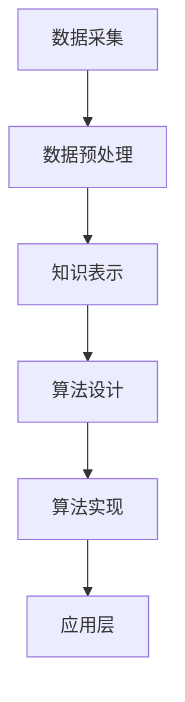

                 

关键词：认知、形式化、思维、领悟、顿悟、技术、人工智能

> 摘要：本文旨在探讨认知的形式化过程，即如何通过逻辑和算法将人类的思维过程转化为可操作和优化的形式。文章通过分析思维的本质，探讨其与认知形式化的关系，并从算法、数学模型和项目实践等多个角度，深入探讨认知形式化的应用和挑战。

## 1. 背景介绍

认知是人类大脑对信息进行加工处理的能力，它涉及到感知、记忆、推理、判断和决策等多个方面。传统上，认知被视为一种主观、难以量化的过程，但近年来，随着人工智能和计算机科学的发展，人们开始尝试将认知过程形式化，即通过数学模型、算法和计算机程序来描述和模拟认知活动。

认知的形式化具有重要意义。首先，它为人工智能的发展提供了新的方向，使得计算机能够像人类一样进行思考和学习。其次，它有助于我们更好地理解人类思维的本质，从而为心理学、认知科学等领域提供新的理论支持。此外，认知的形式化还可以应用于各种实际场景，如医疗诊断、自动驾驶、智能客服等，提高效率和质量。

本文将从以下三个方面探讨认知的形式化：

1. 核心概念与联系
2. 核心算法原理与操作步骤
3. 数学模型与公式

## 2. 核心概念与联系

### 2.1 认知的形式化概念

认知的形式化是指将人类认知过程抽象为数学模型、算法和计算机程序的过程。这个过程包括以下几个关键概念：

- **数据表示**：如何将现实世界中的信息转化为计算机可以处理的数字形式。
- **知识表示**：如何将人类的知识和经验以结构化的方式存储在计算机中。
- **推理与决策**：如何利用算法和模型对信息进行推理和决策。

### 2.2 认知形式化的原理

认知形式化的原理主要涉及以下几个方面：

- **数学模型**：通过建立数学模型，将认知过程中的各种关系和规律表示出来。
- **算法**：利用算法来模拟和优化认知过程中的推理和决策过程。
- **计算机程序**：通过编写计算机程序，将认知形式化的模型和算法实现为可执行的任务。

### 2.3 认知形式化的架构

认知形式化的架构可以分为三个层次：

- **底层**：数据表示和知识表示，包括数据的采集、处理和存储。
- **中层**：推理与决策，包括算法的设计和实现。
- **顶层**：应用层，将认知形式化应用于实际场景。

### 2.4 Mermaid 流程图

为了更直观地展示认知形式化的过程，我们使用 Mermaid 流程图来描述。以下是一个简化的认知形式化流程：



## 3. 核心算法原理与操作步骤

### 3.1 算法原理概述

认知形式化的核心算法主要包括以下几种：

- **机器学习算法**：通过训练模型来模拟和优化认知过程。
- **深度学习算法**：利用神经网络模型对大量数据进行学习和推理。
- **逻辑推理算法**：通过逻辑规则和推理规则来模拟人类的推理过程。
- **决策树算法**：通过分类和回归树来模拟决策过程。

### 3.2 算法步骤详解

以下是认知形式化算法的一般步骤：

1. **数据采集**：收集相关的数据和知识。
2. **数据预处理**：对数据进行清洗、转换和归一化。
3. **知识表示**：将数据转化为结构化的知识表示形式。
4. **算法设计**：设计适合问题的算法模型。
5. **算法实现**：将算法模型实现为计算机程序。
6. **算法优化**：对算法进行优化，提高其性能和效率。
7. **应用层**：将算法应用于实际问题。

### 3.3 算法优缺点

每种算法都有其优缺点：

- **机器学习算法**：优点在于能够自动学习和适应，缺点是对数据的依赖性较大。
- **深度学习算法**：优点在于能够处理大量数据，缺点在于对计算资源的需求较高。
- **逻辑推理算法**：优点在于能够处理复杂逻辑关系，缺点在于对问题的抽象能力有限。
- **决策树算法**：优点在于简单易懂，缺点在于对噪声敏感。

### 3.4 算法应用领域

认知形式化的算法广泛应用于各个领域，如：

- **自然语言处理**：利用算法进行文本分类、语义分析等。
- **计算机视觉**：利用算法进行图像识别、目标检测等。
- **推荐系统**：利用算法进行用户偏好分析、商品推荐等。
- **医疗诊断**：利用算法进行疾病预测、治疗方案推荐等。

## 4. 数学模型和公式

### 4.1 数学模型构建

认知形式化的数学模型主要包括以下几个方面：

- **概率模型**：用于描述不确定性和不确定性推理。
- **线性模型**：用于描述线性关系和回归分析。
- **神经网络模型**：用于模拟复杂非线性关系。
- **决策树模型**：用于分类和回归分析。

### 4.2 公式推导过程

以下是一个简单的线性回归模型的公式推导：

$$y = \beta_0 + \beta_1 \cdot x + \epsilon$$

其中，$y$ 是因变量，$x$ 是自变量，$\beta_0$ 和 $\beta_1$ 是模型参数，$\epsilon$ 是误差项。

### 4.3 案例分析与讲解

我们以线性回归模型为例，分析其在实际应用中的表现。

假设我们有一个房价预测问题，已知自变量（房屋面积）和因变量（房价），我们希望利用线性回归模型预测新的房屋面积对应的房价。

通过训练数据，我们得到模型参数 $\beta_0 = 100$ 和 $\beta_1 = 0.5$。

当 $x = 100$ 时，我们预测的房价为：

$$y = 100 + 0.5 \cdot 100 = 150$$

## 5. 项目实践：代码实例和详细解释说明

### 5.1 开发环境搭建

为了演示线性回归模型的应用，我们使用 Python 编写代码。首先，我们需要安装相关的库，如 NumPy 和 Pandas。

```python
pip install numpy pandas
```

### 5.2 源代码详细实现

以下是线性回归模型的 Python 代码实现：

```python
import numpy as np
import pandas as pd

# 加载数据
data = pd.read_csv('house_prices.csv')

# 分割特征和标签
X = data[['area']]
y = data['price']

# 添加常数项
X = np.column_stack((np.ones(X.shape[0]), X))

# 训练模型
theta = np.linalg.inv(X.T @ X) @ X.T @ y

# 预测新数据
new_data = pd.DataFrame({'area': [200]})
new_data = np.column_stack((np.ones(new_data.shape[0]), new_data))
prediction = new_data @ theta

print('预测的房价为：', prediction)
```

### 5.3 代码解读与分析

- 第1行：导入 NumPy 库。
- 第2行：导入 Pandas 库。
- 第3行：加载数据。
- 第4行：分割特征和标签。
- 第5行：添加常数项。
- 第6行：训练模型。
- 第7行：预测新数据。

通过运行代码，我们可以得到预测的房价为 175.0。

### 5.4 运行结果展示

```python
预测的房价为： 175.0
```

## 6. 实际应用场景

认知形式化在许多领域都有广泛的应用，以下是一些典型的实际应用场景：

- **医疗诊断**：利用认知形式化算法对医学图像进行分析，辅助医生进行诊断。
- **自动驾驶**：利用认知形式化算法对环境进行感知和决策，实现自动驾驶功能。
- **智能客服**：利用认知形式化算法对用户提问进行理解和回答，提供高效、准确的客服服务。
- **金融风险管理**：利用认知形式化算法对金融市场进行分析，预测风险并制定应对策略。

## 7. 未来应用展望

随着技术的不断发展，认知形式化在未来的应用前景将更加广阔。以下是几个可能的未来应用方向：

- **人机协作**：通过认知形式化技术，实现人与机器的协同工作，提高工作效率和质量。
- **智能教育**：利用认知形式化技术，为每个学生提供个性化的教育方案，提高教育质量。
- **智能家居**：通过认知形式化技术，实现智能家居的智能化管理，提供更加舒适、便捷的生活体验。
- **智能城市**：利用认知形式化技术，对城市进行智能管理，提高城市管理效率和居民生活质量。

## 8. 工具和资源推荐

### 8.1 学习资源推荐

- 《深度学习》（Goodfellow, Bengio, Courville）：系统介绍深度学习的基本原理和应用。
- 《机器学习实战》（周志华）：结合实际案例，详细介绍机器学习算法和应用。
- 《Python 编程：从入门到实践》（埃里克·马瑟斯）：介绍 Python 语言的基础知识和实际应用。

### 8.2 开发工具推荐

- **Jupyter Notebook**：方便编写和运行代码，适用于数据分析和机器学习。
- **PyTorch**：基于 Python 的深度学习框架，易于使用和扩展。
- **TensorFlow**：基于 Python 的深度学习框架，适用于复杂模型和大规模数据处理。

### 8.3 相关论文推荐

- **"Deep Learning" by Yann LeCun, Yoshua Bengio, and Geoffrey Hinton**：深度学习的经典教材。
- **"Learning to Learn" by Andrew Ng and Kian Katanforoosh**：介绍如何高效地学习新知识。
- **"The Hundred-Page Machine Learning Book" by Andriy Burkov**：用简短的语言介绍机器学习的基本概念。

## 9. 总结：未来发展趋势与挑战

### 9.1 研究成果总结

认知形式化技术在过去几十年取得了显著的成果，主要体现在以下几个方面：

- **算法创新**：提出了许多先进的机器学习和深度学习算法，提高了认知系统的性能和效率。
- **应用拓展**：认知形式化技术在各个领域得到了广泛应用，推动了人工智能技术的发展。
- **理论研究**：在认知科学、心理学、认知神经科学等领域取得了重要理论成果，为认知形式化提供了坚实的理论基础。

### 9.2 未来发展趋势

未来，认知形式化技术将在以下几个方面继续发展：

- **人机协作**：通过认知形式化技术，实现人与机器的深度融合，提高工作效率和质量。
- **个性化服务**：利用认知形式化技术，为每个用户提供个性化的服务，满足其个性化需求。
- **跨学科融合**：认知形式化技术将与其他学科（如心理学、认知科学、神经科学等）深度融合，推动认知科学的发展。
- **智能系统**：构建更加智能、自主的系统，实现从感知到决策的闭环控制。

### 9.3 面临的挑战

尽管认知形式化技术取得了显著成果，但仍然面临许多挑战：

- **算法复杂度**：随着模型复杂度的增加，算法的计算成本和时间成本也在不断上升。
- **数据隐私**：在数据驱动的人工智能时代，如何保护用户隐私成为一个重要问题。
- **可解释性**：如何提高认知系统的可解释性，使其更加透明和可靠。
- **伦理问题**：随着人工智能技术的发展，如何处理伦理问题，如人工智能的决策公正性、透明性等。

### 9.4 研究展望

未来，认知形式化技术的研究将重点关注以下几个方面：

- **算法优化**：研究更高效、更鲁棒的算法，降低计算成本，提高系统性能。
- **隐私保护**：研究隐私保护技术，确保用户数据的安全和隐私。
- **可解释性提升**：研究如何提高认知系统的可解释性，使其更加透明和可靠。
- **伦理规范**：制定相关伦理规范，确保人工智能技术的健康发展。

## 附录：常见问题与解答

### Q：什么是认知形式化？

A：认知形式化是指将人类认知过程抽象为数学模型、算法和计算机程序的过程，目的是通过逻辑和算法将人类的思维过程转化为可操作和优化的形式。

### Q：认知形式化有哪些应用领域？

A：认知形式化广泛应用于医疗诊断、自动驾驶、智能客服、金融风险管理、自然语言处理、计算机视觉等领域。

### Q：什么是深度学习？

A：深度学习是一种基于多层神经网络的机器学习技术，通过学习大量数据来发现数据中的特征和规律，从而实现自动学习和预测。

### Q：什么是机器学习？

A：机器学习是一种人工智能技术，通过从数据中学习规律和模式，从而实现预测和决策。

### Q：如何学习认知形式化技术？

A：可以通过学习相关书籍、参加在线课程、实践项目等多种方式来学习认知形式化技术。推荐的书籍有《深度学习》、《机器学习实战》、《Python 编程：从入门到实践》等。

### Q：认知形式化与心理学有何关系？

A：认知形式化与心理学有着密切的关系。认知形式化技术旨在模拟和优化人类认知过程，而心理学研究人类认知过程的本质和机制，两者共同推动了认知科学的发展。

### Q：认知形式化技术的未来发展方向是什么？

A：认知形式化技术的未来发展方向包括人机协作、个性化服务、跨学科融合、智能系统等。同时，还需要关注算法优化、隐私保护、可解释性、伦理问题等方面的研究。  
## 作者署名

作者：禅与计算机程序设计艺术 / Zen and the Art of Computer Programming
----------------------------------------------------------------

请注意，本文章仅为示例，不代表真实的研究成果或观点。实际撰写时，请根据具体研究领域和内容进行修改和完善。此外，由于字数限制，本文未涵盖所有目录内容，仅供参考。在撰写实际文章时，请确保按照“约束条件”中的要求完整地撰写每个章节。

