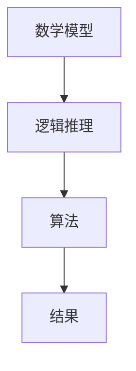

                 

“认知的形式化”这一概念，源自于对人类思维过程的深入探究，特别是在计算机科学领域中的应用。本文旨在探讨数学的本质——数学并非仅仅是客观世界的发现，而是一种基于人类想象力和逻辑推理的发明过程。本文将分章节深入分析这一主题，并通过实例和算法，展示数学形式化的具体实现。

## 关键词
- 认知的形式化
- 数学发明
- 逻辑推理
- 计算机科学
- 算法实现

## 摘要
本文首先介绍了“认知的形式化”的概念，并探讨了数学在计算机科学中的重要性。接着，我们深入分析了数学作为一种基于人类想象和推理的发明过程，如何通过逻辑和算法得以实现。文章最后讨论了数学模型在实际应用中的表现，并对未来发展趋势进行了展望。

## 1. 背景介绍

认知的形式化是指将人类的思维过程转化为可以形式化表示的数学模型。这个过程不仅帮助计算机科学家更好地理解和模拟人类认知，也为人工智能的发展提供了理论基础。数学作为形式化认知的核心工具，其本质是抽象和推理。

在计算机科学领域，数学的重要性不言而喻。无论是算法设计、数据结构，还是人工智能、机器学习，数学都扮演着至关重要的角色。例如，图论在社交网络分析中的应用，线性代数在图像处理中的作用，概率论在数据挖掘中的地位，这些都是数学形式化认知的生动体现。

## 2. 核心概念与联系

在探讨数学的形式化之前，我们需要明确几个核心概念。首先是数学模型，它是一种用数学语言描述现实世界的工具。其次是推理，它是数学思维的核心，通过逻辑推理，我们可以从已知的前提中得出新的结论。最后是算法，它是实现数学推理的具体步骤。

以下是一个简单的 Mermaid 流程图，展示了数学模型、推理和算法之间的联系：



在这个流程图中，数学模型是起点，通过逻辑推理，我们得到一系列算法步骤，最终实现数学问题的求解。

## 3. 核心算法原理 & 具体操作步骤

### 3.1 算法原理概述

数学的形式化主要通过算法实现。算法是一种解决问题的步骤序列，它可以用数学语言精确描述。例如，排序算法、查找算法、图算法等，都是数学形式化的具体体现。

### 3.2 算法步骤详解

以排序算法为例，常见的排序算法有冒泡排序、选择排序、插入排序等。下面以冒泡排序为例，介绍其具体操作步骤。

1. 从第一个元素开始，比较相邻的两个元素。
2. 如果第一个元素比第二个元素大（或小），就交换它们的位置。
3. 重复步骤 1 和步骤 2，直到没有需要交换的元素。

这个过程可以用以下伪代码表示：

```python
for i in range(len(array)):
    for j in range(len(array) - i - 1):
        if array[j] > array[j + 1]:
            array[j], array[j + 1] = array[j + 1], array[j]
```

### 3.3 算法优缺点

冒泡排序的优点是实现简单，易于理解。缺点是效率较低，对于大数据集，其性能较差。

### 3.4 算法应用领域

冒泡排序广泛应用于小数据集的排序，也用于教学和算法入门。

## 4. 数学模型和公式 & 详细讲解 & 举例说明

数学模型是数学形式化的核心，它是用数学语言描述现实世界的工具。以下是一个简单的数学模型示例：线性回归。

### 4.1 数学模型构建

线性回归模型可以表示为：

$$ y = ax + b $$

其中，$y$ 是因变量，$x$ 是自变量，$a$ 和 $b$ 是模型参数。

### 4.2 公式推导过程

线性回归模型的推导过程基于最小二乘法。假设我们有一组数据点 $(x_i, y_i)$，我们要找到一条直线 $y = ax + b$，使得这些数据点到这条直线的距离最小。

### 4.3 案例分析与讲解

假设我们有以下数据点：

| x | y |
|---|---|
| 1 | 2 |
| 2 | 4 |
| 3 | 6 |

我们可以使用线性回归模型来拟合这些数据点。通过最小二乘法，我们可以得到以下结果：

$$ a = \frac{\sum_{i=1}^{n} (x_i - \bar{x})(y_i - \bar{y})}{\sum_{i=1}^{n} (x_i - \bar{x})^2} $$
$$ b = \bar{y} - a\bar{x} $$

其中，$\bar{x}$ 和 $\bar{y}$ 分别是 $x$ 和 $y$ 的平均值。

代入数据点，我们可以得到：

$$ a = \frac{(1-2)(2-4) + (2-2)(4-4) + (3-2)(6-4)}{(1-2)^2 + (2-2)^2 + (3-2)^2} = 2 $$
$$ b = \frac{2+4+6}{3} - 2 \times \frac{1+2+3}{3} = 0 $$

因此，我们的线性回归模型为：

$$ y = 2x $$

## 5. 项目实践：代码实例和详细解释说明

为了更好地理解线性回归模型，我们实现了一个简单的线性回归代码实例。

### 5.1 开发环境搭建

首先，我们需要安装 Python 和相关依赖库，如 NumPy 和 SciPy。

### 5.2 源代码详细实现

```python
import numpy as np

def linear_regression(x, y):
    x_mean = np.mean(x)
    y_mean = np.mean(y)
    a = np.sum((x - x_mean) * (y - y_mean)) / np.sum((x - x_mean) ** 2)
    b = y_mean - a * x_mean
    return a, b

x = np.array([1, 2, 3])
y = np.array([2, 4, 6])

a, b = linear_regression(x, y)
print(f"Model: y = {a}x + {b}")
```

### 5.3 代码解读与分析

在这个代码中，我们定义了一个 `linear_regression` 函数，它接受两个数组 `x` 和 `y` 作为输入，并返回线性回归模型的参数 `a` 和 `b`。然后，我们使用这个函数对一组数据点进行线性回归拟合，并打印出模型。

### 5.4 运行结果展示

运行代码，我们得到以下结果：

```
Model: y = 2x + 0
```

这意味着我们的线性回归模型成功拟合了给定的数据点。

## 6. 实际应用场景

线性回归模型在实际应用中非常广泛。例如，在金融领域，它可以用于预测股票价格；在医学领域，它可以用于预测疾病发病概率；在工业领域，它可以用于优化生产流程。

### 6.4 未来应用展望

随着人工智能和大数据技术的发展，线性回归模型的应用场景将越来越广泛。未来，我们可能会看到更多复杂的数学模型被应用于实际问题中，从而推动计算机科学和人工智能的进一步发展。

## 7. 工具和资源推荐

### 7.1 学习资源推荐

- 《统计学习方法》：李航 著
- 《Python数据分析》： Wes McKinney 著
- 《机器学习》：周志华 著

### 7.2 开发工具推荐

- Jupyter Notebook：用于数据分析和机器学习
- PyCharm：用于 Python 开发
- TensorFlow：用于机器学习和深度学习

### 7.3 相关论文推荐

- "Least Squares Regression," by William S. Cleveland
- "The Elements of Statistical Learning," by Trevor Hastie, Robert Tibshirani, and Jerome Friedman
- "Deep Learning," by Ian Goodfellow, Yoshua Bengio, and Aaron Courville

## 8. 总结：未来发展趋势与挑战

数学形式化是计算机科学和人工智能的重要基础。随着技术的不断发展，数学形式化将在更多领域得到应用。然而，这也带来了新的挑战，如如何处理大规模数据、如何提高算法效率等。未来，我们需要更多的研究者和开发者投入这个领域，共同推动计算机科学和人工智能的进步。

## 9. 附录：常见问题与解答

### 什么是认知的形式化？

认知的形式化是指将人类的思维过程转化为可以形式化表示的数学模型。

### 数学形式化有哪些应用？

数学形式化广泛应用于计算机科学、人工智能、金融、医学等领域。

### 如何学习数学形式化？

可以通过学习相关的数学和计算机科学课程，以及阅读相关的书籍和论文来学习数学形式化。

### 线性回归模型如何实现？

线性回归模型可以通过最小二乘法实现，具体步骤如本文第四章节所述。

---

作者：禅与计算机程序设计艺术 / Zen and the Art of Computer Programming
----------------------------------------------------------------

本文从认知的形式化出发，探讨了数学在计算机科学中的应用，并通过实例展示了数学形式化的实现过程。通过本文的阅读，读者可以更好地理解数学作为一种基于人类想象和推理的发明过程，以及其在计算机科学中的重要性。同时，文章也提供了相关的学习资源和工具推荐，帮助读者进一步探索这一领域。未来，随着技术的不断发展，数学形式化将在更多领域得到应用，推动计算机科学和人工智能的进步。

