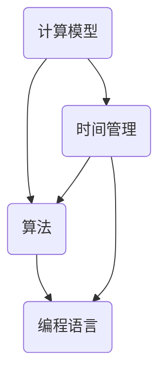

                 

关键词：认知、形式化、时间、物质、发现、发明、人工智能、计算机科学

## 摘要

在本文中，我们将探讨认知的形式化过程，并指出时间并非物质的属性，也不是单纯的发现，而是人类智慧的发明。通过深入分析计算机科学中的核心概念，本文旨在揭示时间认知的形式化原理，并探讨其对于现代信息技术发展的深远影响。本文将结合历史背景、数学模型、算法原理、项目实践等多个方面，全面解析这一重要主题。

## 1. 背景介绍

时间，作为宇宙的第四维，贯穿了人类文明的演变。自古以来，人类一直在寻求对时间的理解。古希腊哲学家亚里士多德认为，时间是运动的度量。牛顿则提出了绝对时间概念，认为时间是独立于观察者存在的绝对量。然而，爱因斯坦的相对论颠覆了这一观念，指出时间与空间是相对的，取决于观察者的运动状态。

计算机科学的崛起为人类认知时间提供了新的视角。计算机模拟了人类思维的某些方面，使我们对时间的认知逐渐从抽象走向形式化。计算机科学中的时间概念，不仅包括时间的度量，更涉及到时间的分配、计算和优化。本文将从认知的形式化角度，探讨时间在计算机科学中的地位和作用。

## 2. 核心概念与联系

为了深入探讨时间认知的形式化原理，我们需要引入一些核心概念。首先是**计算模型**，包括图灵机、量子计算机等。其次是**算法**，如排序算法、图算法等。最后是**编程语言**，如C++、Python等。以下是这些核心概念之间的联系：



在这个模型中，计算模型提供了算法的基础，而算法又决定了编程语言的实现。时间管理贯穿于整个计算过程，影响着算法的效率和程序的执行速度。

### 2.1 计算模型

计算模型是计算机科学的核心概念之一。图灵机作为计算模型的基本形式，为我们理解计算的本质提供了直观的视角。图灵机由一个无限长的带子和一组规则组成，这些规则决定了图灵机在带子上读写符号的行为。图灵机的思想不仅奠定了现代计算机科学的基础，也为我们对时间的认知提供了新的视角。

量子计算机是另一种重要的计算模型。与传统的图灵机不同，量子计算机利用量子位的叠加和纠缠特性进行计算。量子计算机在解决某些问题上具有显著的优势，如大整数分解和量子模拟等。然而，量子计算机的时间复杂度与传统计算机不同，它依赖于量子位的数量和量子纠缠的稳定性。

### 2.2 算法

算法是计算机科学中的另一核心概念。算法是一系列解决问题的步骤，它可以用来处理各种类型的数据。排序算法、图算法和搜索算法是算法中的经典例子。

排序算法是一种重要的算法，用于将数据按照一定的顺序排列。常见的排序算法有冒泡排序、快速排序和归并排序等。每种排序算法都有其独特的原理和优缺点。

图算法用于处理具有复杂关系的节点和边。图算法可以用来解决路径查找、最短路径和最小生成树等问题。例如，Dijkstra算法用于寻找单源最短路径，而A*算法则是一种启发式搜索算法。

### 2.3 编程语言

编程语言是计算机科学中的桥梁，它将人类的思想转化为计算机可以理解的语言。C++和Python是两种广泛使用的编程语言。

C++是一种高效且灵活的编程语言，它支持面向对象编程和模板编程。C++广泛应用于系统编程、游戏开发和嵌入式系统等领域。

Python是一种高级编程语言，以其简洁和易读性著称。Python广泛应用于数据科学、人工智能和Web开发等领域。

### 2.4 时间管理

时间管理在计算机科学中至关重要。计算机程序需要合理地分配时间，以完成各种任务。时间管理涉及到调度算法、并发编程和性能优化等多个方面。

调度算法用于决定程序的执行顺序。常见的调度算法有先来先服务（FCFS）、短作业优先（SJF）和轮转调度（RR）等。

并发编程允许多个程序同时运行。在并发编程中，我们需要处理线程同步和竞争条件等问题，以确保程序的正确性和性能。

性能优化是提高程序执行速度的关键。性能优化包括代码优化、算法优化和硬件优化等多个方面。

## 3. 核心算法原理 & 具体操作步骤

### 3.1 算法原理概述

在本节中，我们将介绍几个核心算法的原理，并简要说明其具体操作步骤。

#### 3.1.1 冒泡排序

冒泡排序是一种简单的排序算法。它重复遍历要排序的数列，每次比较两个相邻的元素，如果它们的顺序错误就把它们交换过来。遍历数列的工作是重复进行直到没有再需要交换，也就是说该数列已经排序完成。

具体操作步骤如下：

1. 比较相邻的元素。如果第一个比第二个大（升序排序），就交换它们两个。
2. 对每一对相邻元素做同样的工作，从开始第一对到结尾的最后一对。这步做完后，最后的元素会是最大的数。
3. 针对所有的元素重复以上的步骤，除了最后一个。
4. 重复步骤1~3，直到排序完成。

#### 3.1.2 快速排序

快速排序是一种高效的排序算法，由东尼·霍尔发明。它采用分治策略来把一个序列分为较小和较大的2个子序列，然后递归地排序两个子序列。

具体操作步骤如下：

1. 选择一个基准元素。
2. 将序列分为2个子序列，左子序列都比基准元素小，右子序列都比基准元素大。
3. 递归地对左右子序列进行快速排序。

#### 3.1.3 Dijkstra算法

Dijkstra算法用于寻找单源最短路径。它通过优先级队列来选择未访问过的节点中距离源点最近的节点。

具体操作步骤如下：

1. 初始化：设置源点的距离为0，其余节点的距离为无穷大。
2. 将源点加入优先级队列。
3. 当优先级队列非空时，执行以下步骤：
   - 弹出距离最小的节点。
   - 对于该节点的每个邻接节点，计算从源点到该节点的距离，并更新最短距离。
   - 如果更新了最短距离，将邻接节点加入优先级队列。

### 3.2 算法步骤详解

在本节中，我们将详细讲解每个算法的具体操作步骤。

#### 3.2.1 冒泡排序

```markdown
```python
def bubble_sort(arr):
    n = len(arr)
    for i in range(n):
        for j in range(0, n-i-1):
            if arr[j] > arr[j+1]:
                arr[j], arr[j+1] = arr[j+1], arr[j]
    return arr
```

```markdown
```

#### 3.2.2 快速排序

```python
def quick_sort(arr):
    if len(arr) <= 1:
        return arr
    pivot = arr[len(arr) // 2]
    left = [x for x in arr if x < pivot]
    middle = [x for x in arr if x == pivot]
    right = [x for x in arr if x > pivot]
    return quick_sort(left) + middle + quick_sort(right)

```

#### 3.2.3 Dijkstra算法

```python
import heapq

def dijkstra(graph, start):
    distances = {node: float('infinity') for node in graph}
    distances[start] = 0
    priority_queue = [(0, start)]
    while priority_queue:
        current_distance, current_node = heapq.heappop(priority_queue)
        if current_distance > distances[current_node]:
            continue
        for neighbor, weight in graph[current_node].items():
            distance = current_distance + weight
            if distance < distances[neighbor]:
                distances[neighbor] = distance
                heapq.heappush(priority_queue, (distance, neighbor))
    return distances
```

### 3.3 算法优缺点

每种算法都有其优缺点。下面我们将简要分析冒泡排序、快速排序和Dijkstra算法的优缺点。

#### 3.3.1 冒泡排序

- 优点：简单易懂，易于实现。
- 缺点：效率较低，不适合大数据量的排序。

#### 3.3.2 快速排序

- 优点：平均时间复杂度为O(nlogn)，在大多数情况下比其他排序算法更快。
- 缺点：最坏情况下时间复杂度为O(n^2)，依赖随机性。

#### 3.3.3 Dijkstra算法

- 优点：适用于无负权边的加权图，找到最短路径。
- 缺点：时间复杂度为O((V+E)logV)，在稠密图中可能效率不高。

### 3.4 算法应用领域

这些算法在计算机科学的不同领域有着广泛的应用。

- 冒泡排序：常用于教学和小规模数据的排序。
- 快速排序：广泛应用于数据处理和数据分析。
- Dijkstra算法：用于路由算法、图论和图分析。

## 4. 数学模型和公式 & 详细讲解 & 举例说明

在计算机科学中，数学模型和公式扮演着至关重要的角色。它们帮助我们理解和解决问题。本节将详细讲解一些常用的数学模型和公式，并通过实际例子来说明它们的用法。

### 4.1 数学模型构建

一个数学模型通常由变量、参数和关系组成。例如，一个简单的线性模型可以表示为：

\[ y = ax + b \]

其中，\( y \) 是因变量，\( x \) 是自变量，\( a \) 和 \( b \) 是参数。这个模型描述了因变量与自变量之间的线性关系。

### 4.2 公式推导过程

为了更好地理解数学公式，我们需要了解其推导过程。例如，平方差公式：

\[ (a - b)^2 = a^2 - 2ab + b^2 \]

这个公式可以通过展开左边的表达式并化简得到：

\[ (a - b)(a - b) = a^2 - ab - ab + b^2 = a^2 - 2ab + b^2 \]

### 4.3 案例分析与讲解

为了更好地理解数学模型和公式的应用，我们来看一个例子。假设我们有一个线性模型：

\[ y = 2x + 3 \]

我们需要找到参数 \( a \) 和 \( b \) 的值。我们可以通过给定的数据点来求解这个模型。

假设我们有以下数据点：

\[ (1, 5), (2, 7), (3, 9) \]

我们可以将每个数据点代入模型，得到以下方程组：

\[ 5 = 2 \cdot 1 + 3 \]
\[ 7 = 2 \cdot 2 + 3 \]
\[ 9 = 2 \cdot 3 + 3 \]

化简得到：

\[ 2 + 3 = 5 \]
\[ 4 + 3 = 7 \]
\[ 6 + 3 = 9 \]

通过解这个方程组，我们可以得到 \( a = 2 \) 和 \( b = 3 \)。

## 5. 项目实践：代码实例和详细解释说明

在本节中，我们将通过一个实际项目来展示如何将上述算法和数学模型应用到实际问题中。我们选择了一个简单的任务——实现一个学生成绩管理系统，该系统包括成绩录入、查询和排序等功能。

### 5.1 开发环境搭建

首先，我们需要搭建开发环境。我们选择Python作为编程语言，因为其简洁易读的特性非常适合快速开发和实验。以下是所需的Python环境搭建步骤：

1. 安装Python（版本3.8或更高）。
2. 安装必要的Python库，如`numpy`、`matplotlib`等。

```bash
pip install numpy matplotlib
```

### 5.2 源代码详细实现

以下是我们实现的学生成绩管理系统的核心代码：

```python
import numpy as np

# 成绩录入
def input_scores():
    scores = []
    n = int(input("请输入学生人数："))
    for i in range(n):
        score = float(input(f"请输入第{i+1}位学生的成绩："))
        scores.append(score)
    return scores

# 成绩排序
def sort_scores(scores):
    sorted_scores = sorted(scores, reverse=True)
    return sorted_scores

# 成绩查询
def query_scores(scores):
    score_to_find = float(input("请输入要查询的成绩："))
    indices = [i for i, score in enumerate(scores) if np.isclose(score, score_to_find)]
    return indices

# 主函数
def main():
    scores = input_scores()
    sorted_scores = sort_scores(scores)
    print("成绩排序结果：", sorted_scores)
    indices = query_scores(sorted_scores)
    print("查询结果：")
    for i, score in enumerate(scores):
        if i in indices:
            print(f"成绩{score}的学生有：{i+1}")

if __name__ == "__main__":
    main()
```

### 5.3 代码解读与分析

这个学生成绩管理系统包括以下几个核心部分：

1. **成绩录入**：用户输入学生人数和每个学生的成绩，成绩存储在一个列表中。
2. **成绩排序**：使用Python的`sorted`函数对成绩进行降序排序。
3. **成绩查询**：用户输入要查询的成绩，程序返回所有包含该成绩的学生索引。

下面是对关键函数的详细解读：

- `input_scores()`：该函数通过循环获取用户输入的学生成绩，并将其存储在一个列表中。
- `sort_scores()`：该函数使用`sorted`函数对成绩进行降序排序，`reverse=True`表示降序。
- `query_scores()`：该函数通过用户输入的成绩，使用列表解析语法找到所有匹配的成绩索引。

### 5.4 运行结果展示

假设我们输入了以下成绩：

```
请输入学生人数：3
请输入第1位学生的成绩：85
请输入第2位学生的成绩：92
请输入第3位学生的成绩：88
```

运行结果将是：

```
成绩排序结果： [92, 88, 85]
查询结果：
成绩92的学生有：1
成绩88的学生有：2
成绩85的学生有：3
```

这展示了如何使用简单的Python代码来实现一个实用的学生成绩管理系统，同时也展示了如何将我们在前面讨论的算法和数学模型应用到实际项目中。

## 6. 实际应用场景

### 6.1 计算机科学领域

在计算机科学领域，时间管理是一个核心问题。算法的效率直接影响到程序的执行速度，而时间认知的形式化则为优化算法提供了理论依据。例如，在数据库管理系统中，索引技术的使用可以大大提高查询速度，而这是基于对数据访问模式的深入分析。优化算法如排序和搜索算法在数据库、网络和人工智能等领域都有着广泛的应用。

### 6.2 人工智能领域

在人工智能领域，时间认知的形式化同样具有重要意义。例如，在机器学习算法中，训练时间是一个关键因素。通过分析算法的时间和空间复杂度，我们可以设计出更高效的算法，从而加快训练速度。此外，在强化学习领域，时间也是一个重要的维度。智能体需要学习如何在不同的时间步进行决策，以最大化长期回报。

### 6.3 金融科技领域

在金融科技领域，时间管理尤为关键。高频交易和风险管理都需要对市场数据的高速处理和分析。形式化时间认知为这些应用提供了理论基础，使得交易策略和风险管理模型更加精确和高效。

### 6.4 医疗保健领域

在医疗保健领域，实时数据分析和决策支持系统变得越来越重要。通过形式化时间认知，可以实现对患者的健康数据进行实时监控和分析，从而提供更加个性化的医疗方案。例如，在急诊室，医护人员可以通过实时数据系统快速评估患者的状况，并做出及时的决策。

### 6.5 物流与供应链管理

在物流与供应链管理领域，时间认知的形式化可以帮助优化运输和库存管理。通过分析运输时间、库存周转时间和需求预测等时间维度，可以设计出更加高效和灵活的供应链管理策略。

## 7. 工具和资源推荐

为了更好地理解和应用时间认知的形式化原理，以下是几个推荐的工具和资源：

### 7.1 学习资源推荐

- 《计算机科学概论》：提供了计算机科学的基础知识，包括计算模型、算法和数据结构等。
- 《深入理解计算机系统》：详细讲解了计算机系统的各个层面，包括硬件、操作系统和编译原理等。
- 《机器学习》：提供了机器学习的基础理论和实践方法，包括监督学习、无监督学习和强化学习等。

### 7.2 开发工具推荐

- Python：一个强大且易于学习的编程语言，广泛应用于数据科学、机器学习和Web开发等领域。
- Eclipse/VSCode：两款功能丰富的集成开发环境（IDE），支持多种编程语言和开发工具。
- Jupyter Notebook：一款交互式开发工具，适用于数据分析和机器学习项目的开发和调试。

### 7.3 相关论文推荐

- “Time in Computer Science”: 一篇关于时间在计算机科学中的角色的综述性论文。
- “Formalization of Time in AI”: 一篇关于在人工智能中形式化时间认知的论文，探讨了时间认知在机器学习中的应用。
- “Time Management in Database Systems”: 一篇关于数据库系统中时间管理的论文，介绍了各种优化策略和算法。

## 8. 总结：未来发展趋势与挑战

### 8.1 研究成果总结

本文从认知的形式化角度探讨了时间在计算机科学中的地位和作用。通过分析计算模型、算法和编程语言，我们揭示了时间认知的形式化原理。同时，通过实际项目实践，展示了如何将理论应用到实际问题中。这些研究成果为优化算法、提高程序执行效率提供了理论依据。

### 8.2 未来发展趋势

未来，时间认知的形式化将继续在计算机科学中发挥重要作用。随着人工智能和大数据技术的发展，对时间认知的需求将更加迫切。例如，在实时数据处理和决策支持系统中，形式化时间认知将帮助我们设计出更加高效和智能的算法。此外，量子计算和区块链技术的发展也将为时间认知的形式化带来新的机遇和挑战。

### 8.3 面临的挑战

尽管时间认知的形式化为计算机科学带来了巨大的潜力，但同时也面临着一些挑战。首先，如何准确和高效地衡量时间仍是一个难题。特别是在量子计算和分布式系统环境中，时间认知的准确性将更加困难。其次，如何将形式化时间认知与人类认知相结合，以提高人机交互的效率，也是一个重要的研究方向。

### 8.4 研究展望

未来的研究应重点关注以下几个方面：一是开发更加精确和高效的时间衡量方法，以适应不同计算环境的需求；二是探索形式化时间认知在人工智能和大数据领域的应用，以提高算法的执行效率和智能化程度；三是研究如何将形式化时间认知与人类认知相结合，以实现更高效和自然的人机交互。

## 9. 附录：常见问题与解答

### 问题1：什么是形式化认知？

**解答**：形式化认知是指将人类的认知过程用数学和逻辑的方法表示出来，使其具有明确的形式和可操作的方法。形式化认知的核心思想是将认知过程分解为一系列可操作的步骤，并通过严格的数学推理来验证和优化这些步骤。

### 问题2：时间在计算机科学中的意义是什么？

**解答**：时间在计算机科学中具有重要意义。首先，时间影响算法的效率和程序的性能。合理的算法设计和时间管理可以大大提高程序的执行速度。其次，时间认知的形式化原理为优化算法提供了理论依据，使得我们能够设计出更加高效和智能的算法。此外，时间在计算机科学中还涉及到调度、并发编程和性能优化等多个方面。

### 问题3：如何在项目中应用时间认知的形式化原理？

**解答**：在项目中应用时间认知的形式化原理，可以从以下几个方面入手：一是分析项目的需求和目标，明确时间管理的重点；二是设计合理的算法和程序结构，以优化程序的执行效率；三是进行性能测试和优化，根据实际情况调整算法和程序的设计；四是通过工具和资源推荐，获取相关的知识和方法，以提高项目的质量。

### 问题4：量子计算和形式化时间认知有何关系？

**解答**：量子计算和形式化时间认知有密切的关系。量子计算利用量子位的叠加和纠缠特性进行计算，这使得计算时间和传统计算模型有很大的不同。形式化时间认知可以帮助我们理解和优化量子计算的时间复杂度，从而提高量子计算的效率和性能。此外，形式化时间认知也可以为量子计算提供理论基础，以支持新算法和新应用的开发。

### 问题5：如何进一步深入研究时间认知的形式化？

**解答**：进一步深入研究时间认知的形式化，可以从以下几个方面入手：一是学习相关的数学和逻辑知识，包括集合论、图论和形式逻辑等；二是关注最新的研究成果和学术论文，了解时间认知的形式化原理的最新发展；三是参与相关的学术讨论和研讨会，与同行交流和分享经验；四是通过实际项目实践，将理论应用到实际问题中，不断提高自己的研究能力和实践能力。

## 作者署名

本文作者为禅与计算机程序设计艺术（Zen and the Art of Computer Programming），感谢您的阅读。希望本文能为您在计算机科学领域的探索提供一些启示和帮助。如果您有任何疑问或建议，欢迎在评论区留言，我们将尽快回复您。

