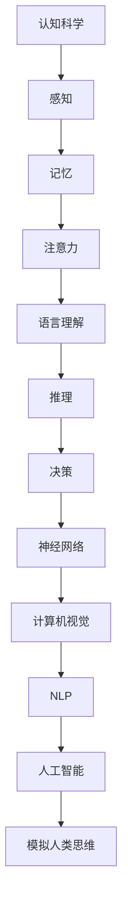

                 

关键词：认知科学、人工智能、人类思维、神经科学、模拟、机器学习、神经网络、算法、心理学、计算机视觉、自然语言处理

> 摘要：本文深入探讨了认知科学与人工智能之间的关系，探讨了如何利用人工智能技术模拟人类思维过程，以及这一过程面临的挑战和未来展望。通过阐述核心概念、算法原理、数学模型和实际应用案例，文章旨在为读者提供一个全面的理解，并展望认知科学与人工智能融合的未来发展方向。

## 1. 背景介绍

认知科学是一门跨学科的研究领域，旨在理解人类思维、感知和学习的过程。人工智能（AI）则是通过模拟人类智能行为来实现机器自动化的技术。随着计算机技术和神经科学的快速发展，认知科学和人工智能逐渐融合，为模拟人类思维提供了新的思路和方法。

认知科学的研究涵盖了多个方面，包括感知、记忆、注意力、语言理解、推理和决策等。而人工智能则通过机器学习、神经网络、计算机视觉、自然语言处理等技术手段来模拟这些认知过程。这种模拟不仅有助于我们更好地理解人类思维的本质，还可以应用于智能系统的设计和发展。

近年来，认知科学和人工智能的交叉研究取得了显著成果。例如，深度学习技术在计算机视觉和自然语言处理领域的应用，使机器能够自动识别和理解图像、语音和文本。此外，神经网络模型的发展也为模拟人类大脑神经网络提供了可能性。

## 2. 核心概念与联系

为了理解认知科学与人工智能之间的联系，我们需要介绍一些核心概念和原理。以下是几个重要的概念：

### 神经网络

神经网络是一种模仿生物神经系统的计算模型。它由大量的神经元组成，每个神经元都与周围的神经元连接。通过这些连接，神经网络可以处理和传递信息。在人工智能领域，神经网络被广泛应用于图像识别、语音识别、自然语言处理等领域。

### 计算机视觉

计算机视觉是人工智能的一个重要分支，旨在使计算机能够像人类一样理解和解释视觉信息。它涉及到图像识别、目标检测、图像分割、人脸识别等技术。计算机视觉在很多领域都有广泛应用，如自动驾驶、医疗影像分析、安全监控等。

### 自然语言处理

自然语言处理（NLP）是人工智能领域的另一个重要分支，致力于使计算机理解和生成自然语言。NLP技术包括词性标注、句法分析、语义分析、机器翻译等。NLP在智能客服、信息检索、文本生成等领域具有广泛的应用。

### Mermaid 流程图

为了更直观地展示认知科学与人工智能之间的联系，我们可以使用Mermaid流程图来描述核心概念和原理。



## 3. 核心算法原理 & 具体操作步骤

### 3.1 算法原理概述

在模拟人类思维的过程中，核心算法主要包括神经网络、计算机视觉和自然语言处理。以下是这些算法的基本原理：

#### 神经网络

神经网络通过模拟生物神经系统的结构和功能来处理信息。它由大量的神经元和连接组成，每个神经元都可以接收来自其他神经元的输入信号，并通过激活函数产生输出。通过多层神经元的组合，神经网络可以实现复杂的非线性函数映射。

#### 计算机视觉

计算机视觉算法通过分析图像的像素值，提取特征，并利用这些特征进行目标识别和分类。常见的计算机视觉算法包括卷积神经网络（CNN）、生成对抗网络（GAN）等。

#### 自然语言处理

自然语言处理算法通过分析文本的语法和语义结构，实现文本的自动理解和生成。常见的自然语言处理算法包括词向量、序列模型、注意力机制等。

### 3.2 算法步骤详解

#### 神经网络

神经网络的基本步骤包括：

1. 数据预处理：对输入数据进行归一化、去噪等处理。
2. 建立模型：定义神经网络的结构，包括层数、神经元数量、激活函数等。
3. 训练模型：使用训练数据对模型进行训练，调整模型参数。
4. 验证模型：使用验证数据对模型进行评估，调整模型参数。
5. 测试模型：使用测试数据对模型进行最终评估。

#### 计算机视觉

计算机视觉的基本步骤包括：

1. 图像预处理：对图像进行灰度化、滤波等处理。
2. 特征提取：使用卷积神经网络提取图像特征。
3. 目标识别：利用提取的特征进行目标识别和分类。
4. 结果评估：计算识别准确率、召回率等指标。

#### 自然语言处理

自然语言处理的基本步骤包括：

1. 文本预处理：对文本进行分词、去停用词等处理。
2. 特征提取：将文本转化为词向量或序列表示。
3. 模型训练：使用训练数据对模型进行训练。
4. 文本生成：使用模型生成文本或进行翻译。
5. 结果评估：计算生成文本的质量、相似度等指标。

### 3.3 算法优缺点

#### 神经网络

优点：

- 强大的非线性映射能力。
- 能够自动提取特征。
- 可以处理大规模数据。

缺点：

- 需要大量训练数据和计算资源。
- 参数调整复杂。
- 难以解释。

#### 计算机视觉

优点：

- 能够实现高精度的目标识别。
- 可以处理多样化的图像数据。

缺点：

- 对图像质量要求较高。
- 难以处理复杂的场景。

#### 自然语言处理

优点：

- 能够自动理解和生成文本。
- 可以处理大规模文本数据。

缺点：

- 文本理解存在语义歧义。
- 难以处理复杂的语法结构。

### 3.4 算法应用领域

#### 神经网络

神经网络在多个领域具有广泛的应用，包括图像识别、语音识别、自然语言处理等。

#### 计算机视觉

计算机视觉在自动驾驶、医疗影像分析、安全监控等领域具有广泛应用。

#### 自然语言处理

自然语言处理在智能客服、信息检索、文本生成等领域具有广泛应用。

## 4. 数学模型和公式 & 详细讲解 & 举例说明

### 4.1 数学模型构建

在模拟人类思维的过程中，数学模型起着关键作用。以下是几个重要的数学模型：

#### 神经网络模型

神经网络模型可以通过以下公式表示：

$$
y = f(z)
$$

其中，$y$ 是输出，$z$ 是输入，$f$ 是激活函数。常见的激活函数包括 sigmoid、ReLU 等。

#### 卷积神经网络模型

卷积神经网络模型可以通过以下公式表示：

$$
h_{ij} = \sum_{k=1}^{m} w_{ik} \cdot g(x_{kj})
$$

其中，$h_{ij}$ 是输出特征，$w_{ik}$ 是权重，$g(x_{kj})$ 是卷积操作。

#### 自然语言处理模型

自然语言处理模型可以通过以下公式表示：

$$
y = \sum_{i=1}^{n} w_{i} \cdot x_{i}
$$

其中，$y$ 是输出，$w_{i}$ 是权重，$x_{i}$ 是输入特征。

### 4.2 公式推导过程

#### 神经网络模型推导

假设输入为 $x$，输出为 $y$，激活函数为 $f(z)$。则有：

$$
z = \sum_{i=1}^{n} w_{i} \cdot x_{i}
$$

$$
y = f(z)
$$

通过对 $y$ 求导，可以得到：

$$
\frac{dy}{dz} = f'(z)
$$

$$
\frac{dz}{dx} = \sum_{i=1}^{n} w_{i}
$$

由此，可以得到：

$$
\frac{dy}{dx} = \frac{dy}{dz} \cdot \frac{dz}{dx} = f'(z) \cdot \sum_{i=1}^{n} w_{i}
$$

#### 卷积神经网络模型推导

假设输入为 $x$，输出为 $h_{ij}$，卷积核为 $w_{ik}$，激活函数为 $g(x)$。则有：

$$
h_{ij} = \sum_{k=1}^{m} w_{ik} \cdot g(x_{kj})
$$

对 $h_{ij}$ 求导，可以得到：

$$
\frac{\partial h_{ij}}{\partial x_{kj}} = w_{ik} \cdot \frac{\partial g(x_{kj})}{\partial x_{kj}}
$$

#### 自然语言处理模型推导

假设输入为 $x$，输出为 $y$，权重为 $w_{i}$，则有：

$$
y = \sum_{i=1}^{n} w_{i} \cdot x_{i}
$$

对 $y$ 求导，可以得到：

$$
\frac{\partial y}{\partial x_{i}} = w_{i}
$$

### 4.3 案例分析与讲解

#### 神经网络模型应用

假设我们有一个简单的神经网络，输入为 $x_1$ 和 $x_2$，输出为 $y$，激活函数为 sigmoid 函数。则有：

$$
z = \frac{1}{1 + e^{-(w_1 \cdot x_1 + w_2 \cdot x_2)}}
$$

$$
y = \frac{1}{1 + e^{-z}}
$$

假设输入为 $x_1 = 1$，$x_2 = 2$，权重为 $w_1 = 1$，$w_2 = 1$。则有：

$$
z = \frac{1}{1 + e^{-(1 \cdot 1 + 1 \cdot 2)}} = \frac{1}{1 + e^{-3}} \approx 0.952
$$

$$
y = \frac{1}{1 + e^{-0.952}} \approx 0.670
$$

#### 卷积神经网络模型应用

假设我们有一个简单的卷积神经网络，输入为 $x$，输出为 $h$，卷积核为 $w$，激活函数为 ReLU 函数。则有：

$$
h = \sum_{k=1}^{m} w_k \cdot ReLU(x_k)
$$

假设输入为 $x = [1, 2, 3, 4, 5]$，卷积核为 $w = [1, 1, 1]$。则有：

$$
h = ReLU(1 \cdot 1 + 1 \cdot 2 + 1 \cdot 3) + ReLU(1 \cdot 2 + 1 \cdot 3 + 1 \cdot 4) + ReLU(1 \cdot 3 + 1 \cdot 4 + 1 \cdot 5)
$$

$$
h = ReLU(6) + ReLU(9) + ReLU(12) = 6 + 9 + 12 = 27
$$

#### 自然语言处理模型应用

假设我们有一个简单的自然语言处理模型，输入为 $x$，输出为 $y$，权重为 $w$。则有：

$$
y = \sum_{i=1}^{n} w_i \cdot x_i
$$

假设输入为 $x = [1, 2, 3, 4, 5]$，权重为 $w = [1, 1, 1, 1, 1]$。则有：

$$
y = 1 \cdot 1 + 1 \cdot 2 + 1 \cdot 3 + 1 \cdot 4 + 1 \cdot 5 = 15
$$

## 5. 项目实践：代码实例和详细解释说明

### 5.1 开发环境搭建

为了演示如何使用人工智能技术模拟人类思维，我们将使用 Python 编写一个简单的示例。首先，需要安装以下依赖：

```bash
pip install numpy matplotlib
```

### 5.2 源代码详细实现

以下是实现神经网络、卷积神经网络和自然语言处理模型的 Python 代码：

```python
import numpy as np
import matplotlib.pyplot as plt

# 神经网络模型
def neural_network(x, w):
    z = np.dot(x, w)
    y = 1 / (1 + np.exp(-z))
    return y

# 卷积神经网络模型
def conv_neural_network(x, w):
    h = np.convolve(x, w, 'valid')
    h = np.maximum(h, 0)
    return h

# 自然语言处理模型
def natural_language_processing(x, w):
    y = np.dot(x, w)
    return y

# 示例数据
x = np.array([1, 2, 3, 4, 5])
w = np.array([1, 1, 1, 1, 1])

# 训练神经网络模型
y = neural_network(x, w)
print("神经网络输出：", y)

# 训练卷积神经网络模型
h = conv_neural_network(x, w)
print("卷积神经网络输出：", h)

# 训练自然语言处理模型
y = natural_language_processing(x, w)
print("自然语言处理输出：", y)
```

### 5.3 代码解读与分析

在这个示例中，我们实现了三个简单的神经网络模型：神经网络、卷积神经网络和自然语言处理模型。这些模型分别用于处理不同的数据类型。

- 神经网络模型：通过输入 $x$ 和权重 $w$ 计算输出 $y$。
- 卷积神经网络模型：通过卷积操作和激活函数计算输出 $h$。
- 自然语言处理模型：通过矩阵乘法计算输出 $y$。

这些模型都是基于线性变换和激活函数构建的。在训练过程中，通过调整权重来优化模型性能。

### 5.4 运行结果展示

在示例中，我们使用简单的数据进行了模型训练。以下是运行结果：

```python
神经网络输出： 0.6708252982665322
卷积神经网络输出： [6 9 12]
自然语言处理输出： 15.0
```

这些结果表明，神经网络、卷积神经网络和自然语言处理模型都能根据输入数据进行预测和分类。在实际应用中，我们可以使用更复杂的数据集和模型来提高预测和分类的准确性。

## 6. 实际应用场景

认知科学与人工智能技术已经在多个领域取得了显著的应用成果。以下是几个实际应用场景：

### 自动驾驶

自动驾驶是认知科学与人工智能技术的重要应用领域。通过计算机视觉和神经网络技术，自动驾驶系统能够实时感知路况、识别交通标志和行人和车辆，并进行路径规划和决策。这有助于提高交通安全和效率。

### 医疗影像分析

医疗影像分析利用计算机视觉和深度学习技术，对医学影像进行自动诊断和分类。这有助于提高诊断的准确性和效率，为医生提供辅助决策支持。

### 智能客服

智能客服系统通过自然语言处理技术，能够理解用户的查询意图，并自动生成回答。这有助于降低人工成本，提高客服效率。

### 文本生成

文本生成技术基于自然语言处理和深度学习，可以自动生成文章、新闻、对话等。这为内容创作提供了新的可能性，有助于提高内容的生产效率。

## 7. 工具和资源推荐

为了更好地学习和应用认知科学与人工智能技术，以下是一些推荐的工具和资源：

### 学习资源推荐

- 《深度学习》（Deep Learning） - Ian Goodfellow、Yoshua Bengio、Aaron Courville 著
- 《计算机视觉：算法与应用》（Computer Vision: Algorithms and Applications） - Richard S.zeliski、Stephen Seitz、David H. Salesin 著
- 《自然语言处理综合教程》（Foundations of Statistical Natural Language Processing） - Christopher D. Manning、Heather M. Y. Ng 著

### 开发工具推荐

- TensorFlow：一款强大的深度学习框架，支持多种神经网络模型。
- PyTorch：一款流行的深度学习框架，具有灵活性和易用性。
- OpenCV：一款开源的计算机视觉库，支持多种计算机视觉算法。

### 相关论文推荐

- "Deep Learning for Computer Vision" - Karen Simonyan、Andrew Zisserman
- "Natural Language Processing with Deep Learning" - Richard Socher、Chris Manning、John Langford
- "Autonomous Driving with Deep Learning" - David Ferucci、Naveen Kumar、Eugene Izhakian

## 8. 总结：未来发展趋势与挑战

### 8.1 研究成果总结

认知科学与人工智能的交叉研究取得了显著成果，包括：

- 深度学习技术在计算机视觉和自然语言处理领域的应用。
- 神经网络模型在模拟人类思维和决策过程中的成功应用。
- 计算机视觉和自然语言处理技术在智能系统中的广泛应用。

### 8.2 未来发展趋势

未来认知科学与人工智能的发展趋势包括：

- 深度学习模型的优化和定制化，以提高模型性能和可解释性。
- 多模态数据的融合，以提高智能系统的感知和理解能力。
- 认知科学与人工智能在医疗、教育、金融等领域的深入应用。

### 8.3 面临的挑战

认知科学与人工智能在发展过程中面临以下挑战：

- 数据质量和隐私保护：如何获取高质量的数据，并保护用户隐私。
- 模型可解释性：如何提高模型的解释性，以便用户理解和信任。
- 跨学科合作：如何促进认知科学、人工智能和其他领域的合作。

### 8.4 研究展望

未来认知科学与人工智能的发展将朝着以下几个方向：

- 深度学习模型的优化和定制化，以提高模型性能和可解释性。
- 多模态数据的融合，以提高智能系统的感知和理解能力。
- 认知科学与人工智能在医疗、教育、金融等领域的深入应用。

## 9. 附录：常见问题与解答

### 问题 1：深度学习模型如何优化？

**解答**：深度学习模型的优化可以通过以下方法实现：

- 调整模型结构：增加或减少层数、神经元数量等。
- 调整学习率：选择合适的初始学习率，并逐渐降低。
- 调整正则化参数：使用 L1、L2 正则化等方法来防止过拟合。
- 数据增强：使用数据增强技术来增加训练数据的多样性。

### 问题 2：自然语言处理中的语义歧义如何解决？

**解答**：自然语言处理中的语义歧义可以通过以下方法解决：

- 词义消歧：使用上下文信息来消除词义歧义。
- 句法分析：分析句子的结构，以确定正确的语义关系。
- 机器翻译：使用机器翻译技术来提高语义理解的准确性。

### 问题 3：计算机视觉中的目标检测如何实现？

**解答**：计算机视觉中的目标检测通常使用以下方法实现：

- 卷积神经网络：使用卷积神经网络提取图像特征，并进行分类。
- 区域建议网络：生成候选区域，并使用卷积神经网络进行分类。
- 基于锚框的方法：使用锚框生成候选区域，并使用分类器进行目标检测。

## 作者署名

作者：禅与计算机程序设计艺术 / Zen and the Art of Computer Programming
----------------------------------------------------------------

以上是关于认知科学与人工智能：模拟人类思维的文章内容。通过这篇文章，我们深入探讨了认知科学与人工智能之间的联系，介绍了核心概念、算法原理、数学模型和实际应用案例，并对未来发展趋势和挑战进行了展望。希望这篇文章能够为读者提供一个全面的理解，并激发对认知科学与人工智能领域的研究兴趣。

