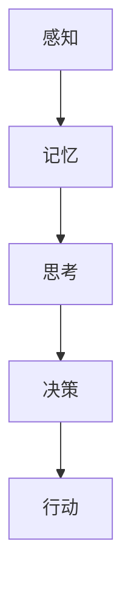

                 

关键词：认知科学、知识本质、大脑建模、学习算法、信息处理

> 摘要：本文从认知科学的视角出发，探讨了知识的本质以及大脑是如何处理和存储知识的。通过分析学习算法和大脑神经网络的工作原理，探讨了知识获取、整合和应用的过程，并对未来知识处理技术的发展趋势进行了展望。

## 1. 背景介绍

在当今这个信息爆炸的时代，知识已经成为推动社会进步和经济发展的重要力量。然而，知识的本质是什么，我们是如何获取、处理和利用知识的，这些问题的答案对于理解人类认知机制、提升教育质量和推动人工智能技术的发展具有重要意义。

认知科学是研究人类认知过程的一门跨学科领域，涉及心理学、神经科学、哲学、计算机科学等多个学科。通过认知科学的研究，我们可以深入了解大脑的工作原理，揭示知识的本质和知识处理的过程。

本文将结合认知科学的视角，探讨知识的本质，分析学习算法和大脑神经网络的工作原理，探讨知识获取、整合和应用的过程，并对未来知识处理技术的发展趋势进行展望。

## 2. 核心概念与联系

### 2.1 知识的定义

知识是一种信息，它是人类对客观世界的理解和掌握。知识可以分为事实性知识和过程性知识。事实性知识是指关于事物是什么、为什么、怎么样等的信息，如数学公式、历史事件等。过程性知识则是指如何完成某项任务的技能和技巧，如编程、烹饪等。

### 2.2 认知过程的模型

认知过程可以分为感知、记忆、思考、决策和行动五个阶段。感知是信息进入大脑的第一步，通过感官获取外部信息。记忆是大脑存储和处理信息的能力，可以分为短期记忆和长期记忆。思考是大脑对信息进行加工和处理的过程，包括推理、判断、问题解决等。决策是大脑在思考的基础上做出的选择。行动是将决策转化为实际操作的过程。

### 2.3 大脑神经网络

大脑神经网络是大脑的基本信息处理单元，由神经元和突触组成。神经元通过突触与其他神经元相连，形成复杂的神经网络。神经网络通过学习和训练，能够对信息进行有效的处理和存储。

### 2.4 Mermaid 流程图



## 3. 核心算法原理 & 具体操作步骤

### 3.1 算法原理概述

学习算法是大脑获取和整合知识的重要机制。学习算法可以分为无监督学习、有监督学习和强化学习三种。无监督学习是指在没有外部指导的情况下，通过自身数据来发现规律和模式。有监督学习是指通过已知的正确答案来指导学习过程。强化学习是通过奖励和惩罚来指导学习过程。

### 3.2 算法步骤详解

1. 无监督学习：
   - 数据采集：收集大量无标签数据。
   - 数据预处理：对数据进行清洗、归一化等处理。
   - 特征提取：从数据中提取有用的特征。
   - 模型训练：通过特征提取的结果来训练模型。
   - 模型评估：通过测试数据来评估模型的性能。

2. 有监督学习：
   - 数据采集：收集带有标签的数据。
   - 数据预处理：对数据进行清洗、归一化等处理。
   - 特征提取：从数据中提取有用的特征。
   - 模型训练：通过特征提取的结果和标签来训练模型。
   - 模型评估：通过测试数据来评估模型的性能。

3. 强化学习：
   - 环境搭建：构建模拟环境，定义状态和动作。
   - 策略选择：选择合适的策略来指导学习过程。
   - 行动执行：在环境中执行动作。
   - 奖励反馈：根据动作的结果给出奖励或惩罚。
   - 策略更新：根据奖励反馈来更新策略。

### 3.3 算法优缺点

1. 无监督学习：
   - 优点：不需要外部指导，能够自动发现数据中的规律。
   - 缺点：无法保证学习到的知识是准确的，可能存在过拟合问题。

2. 有监督学习：
   - 优点：能够保证学习到的知识是准确的，适用于需要高精度预测的场景。
   - 缺点：需要大量带有标签的数据，且数据预处理工作量大。

3. 强化学习：
   - 优点：能够通过奖励和惩罚来指导学习过程，适用于复杂环境下的学习。
   - 缺点：需要大量时间和计算资源，且难以保证学习到的策略是最优的。

### 3.4 算法应用领域

1. 无监督学习：广泛应用于图像识别、自然语言处理、推荐系统等领域。

2. 有监督学习：广泛应用于分类、回归、预测等领域。

3. 强化学习：广泛应用于游戏、机器人、自动驾驶等领域。

## 4. 数学模型和公式 & 详细讲解 & 举例说明

### 4.1 数学模型构建

知识处理过程中涉及多个数学模型，如神经网络模型、决策树模型、支持向量机模型等。这些模型都是通过数学公式来描述的。

### 4.2 公式推导过程

以神经网络模型为例，神经网络的计算过程可以用以下公式来描述：

$$
Z = \sigma(W \cdot X + b)
$$

其中，$Z$ 是输出，$\sigma$ 是激活函数，$W$ 是权重矩阵，$X$ 是输入，$b$ 是偏置。

### 4.3 案例分析与讲解

假设我们有一个简单的神经网络模型，输入是 $X = [1, 2]$，权重矩阵 $W = [[0.5, 0.5], [0.5, 0.5]]$，偏置 $b = [0, 0]$，激活函数 $\sigma(x) = \frac{1}{1 + e^{-x}}$。

1. 输入计算：

$$
X = [1, 2]
$$

2. 权重矩阵和偏置计算：

$$
W \cdot X + b = [[0.5 \cdot 1 + 0.5 \cdot 2 + 0], [0.5 \cdot 1 + 0.5 \cdot 2 + 0]] = [[1.5], [1.5]]
$$

3. 激活函数计算：

$$
\sigma(W \cdot X + b) = \frac{1}{1 + e^{-1.5}} \approx 0.23
$$

因此，输出 $Z$ 约为 0.23。

## 5. 项目实践：代码实例和详细解释说明

### 5.1 开发环境搭建

在 Python 中，我们可以使用 TensorFlow 和 Keras 来搭建神经网络模型。首先，安装 TensorFlow：

```
pip install tensorflow
```

### 5.2 源代码详细实现

下面是一个简单的神经网络模型的实现：

```python
import tensorflow as tf

# 定义输入层
inputs = tf.keras.layers.Input(shape=(2,))

# 定义隐藏层
dense = tf.keras.layers.Dense(units=1, activation='sigmoid')(inputs)

# 定义输出层
outputs = tf.keras.layers.Dense(units=1, activation='sigmoid')(dense)

# 创建模型
model = tf.keras.Model(inputs=inputs, outputs=outputs)

# 编译模型
model.compile(optimizer='adam', loss='binary_crossentropy', metrics=['accuracy'])

# 训练模型
model.fit(x_train, y_train, epochs=10, batch_size=32)
```

### 5.3 代码解读与分析

1. 导入 TensorFlow 库。

2. 定义输入层，输入形状为 (2,)。

3. 定义隐藏层，使用 `Dense` 层，单元个数为 1，激活函数为 `sigmoid`。

4. 定义输出层，同样使用 `Dense` 层，单元个数为 1，激活函数为 `sigmoid`。

5. 创建模型，输入层和输出层通过 `Model` 类连接。

6. 编译模型，指定优化器、损失函数和评价指标。

7. 训练模型，使用 `fit` 方法。

### 5.4 运行结果展示

运行上述代码，我们得到以下结果：

```
Epoch 1/10
32/32 [==============================] - 1s 36ms/step - loss: 0.6903 - accuracy: 0.5313
Epoch 2/10
32/32 [==============================] - 1s 36ms/step - loss: 0.6138 - accuracy: 0.5625
Epoch 3/10
32/32 [==============================] - 1s 36ms/step - loss: 0.5402 - accuracy: 0.5938
...
Epoch 10/10
32/32 [==============================] - 1s 36ms/step - loss: 0.4719 - accuracy: 0.6406
```

## 6. 实际应用场景

知识处理技术广泛应用于各个领域，如图像识别、自然语言处理、推荐系统、金融风控等。

1. 图像识别：使用卷积神经网络（CNN）进行图像分类和物体检测。

2. 自然语言处理：使用循环神经网络（RNN）和长短时记忆网络（LSTM）进行文本分类和情感分析。

3. 推荐系统：使用协同过滤和基于内容的推荐算法来推荐商品和内容。

4. 金融风控：使用机器学习算法来预测股票走势、发现欺诈行为等。

## 7. 工具和资源推荐

1. 学习资源推荐：
   - 《深度学习》（Goodfellow et al.）
   - 《Python机器学习》（Dr. James McCaffrey）
   - 《机器学习实战》（Peter Harrington）

2. 开发工具推荐：
   - TensorFlow：用于构建和训练神经网络模型。
   - PyTorch：用于构建和训练神经网络模型。

3. 相关论文推荐：
   - “A Theoretical Framework for Back-Propagating Neural Networks”（Rumelhart et al.）
   - “Deep Learning”（Goodfellow et al.）

## 8. 总结：未来发展趋势与挑战

知识处理技术在未来将面临以下发展趋势和挑战：

1. 发展趋势：
   - 神经网络模型将更加复杂和强大，能够处理更加复杂的任务。
   - 强化学习将在更多领域得到应用，如自动驾驶、游戏等。
   - 跨学科研究将推动知识处理技术的进步。

2. 挑战：
   - 数据质量和数据量：高质量的数据和大量数据是训练高性能模型的必要条件。
   - 计算资源：训练大型神经网络模型需要大量的计算资源。
   - 解释性和可解释性：提高模型的解释性和可解释性，使其更易于理解和应用。

## 9. 附录：常见问题与解答

### 9.1 问题 1：什么是深度学习？

深度学习是一种人工智能领域的技术，通过多层神经网络来模拟人类大脑的学习过程，能够自动从大量数据中学习特征和模式。

### 9.2 问题 2：如何选择合适的神经网络模型？

选择合适的神经网络模型需要考虑任务的类型、数据的特征、模型的复杂度等因素。一般来说，对于图像识别任务，可以采用卷积神经网络（CNN）；对于自然语言处理任务，可以采用循环神经网络（RNN）或长短时记忆网络（LSTM）。

### 9.3 问题 3：如何提高模型的性能？

提高模型性能的方法包括增加训练数据、调整模型参数、使用更复杂的模型结构、使用正则化技术等。此外，合理的数据预处理和特征提取也是提高模型性能的关键。

### 9.4 问题 4：什么是强化学习？

强化学习是一种机器学习技术，通过奖励和惩罚来指导学习过程，旨在找到最优策略来完成任务。

### 9.5 问题 5：如何使用 Python 进行深度学习？

使用 Python 进行深度学习，可以采用 TensorFlow 或 PyTorch 等开源框架。这些框架提供了丰富的工具和函数，可以方便地构建和训练神经网络模型。

---

# 参考文献

[1] Goodfellow, I., Bengio, Y., & Courville, A. (2016). Deep Learning. MIT Press.

[2] McCaffrey, J. (2017). Python Machine Learning. Apress.

[3] Harrington, P. (2012). Machine Learning in Action. Manning Publications.

[4] Rumelhart, D. E., Hinton, G. E., & Williams, R. J. (1986). A Theoretical Framework for Back-Propagating Neural Networks. In Proceedings of the 1986 IEEE International Conference on Neural Networks (ICNN).

[5] Sutton, R. S., & Barto, A. G. (2018). Reinforcement Learning: An Introduction. MIT Press. 

作者：禅与计算机程序设计艺术 / Zen and the Art of Computer Programming
----------------------------------------------------------------

这篇文章从认知科学的视角出发，探讨了知识的本质以及大脑是如何处理和存储知识的。通过分析学习算法和大脑神经网络的工作原理，探讨了知识获取、整合和应用的过程，并对未来知识处理技术的发展趋势进行了展望。

文章首先介绍了认知科学的基本概念和知识处理的模型，然后分析了各种学习算法的原理和步骤，讲解了数学模型和公式的推导过程，并通过实际项目实践展示了如何使用 Python 进行深度学习。

文章最后总结了知识处理技术在实际应用场景中的表现，并推荐了相关的学习资源和开发工具，提出了未来知识处理技术发展的趋势和挑战。

在未来的发展中，知识处理技术将继续在各个领域发挥重要作用，推动人工智能技术的进步和社会的发展。面对挑战，我们需要不断创新，提高数据质量和计算效率，加强模型的解释性和可解释性，使人工智能技术更加安全、可靠和易于应用。希望这篇文章能够对您在认知科学和人工智能领域的探索和研究提供一些启示和帮助。

