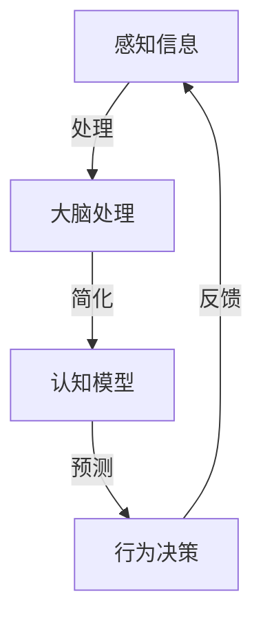

                 

在认知科学和计算机科学领域，混沌与简洁化是两个关键的概念。混沌，指的是系统的复杂性和不可预测性，而简洁化则是寻求复杂现象背后简单规律的过程。本文将探讨这两个概念在认知过程中的相互作用和影响。

> 关键词：认知过程，混沌，简洁化，复杂性理论，计算机科学

> 摘要：本文从认知科学的视角出发，探讨了混沌与简洁化在认知过程中的重要角色。通过分析两者之间的对立统一关系，本文揭示了如何在复杂认知现象中寻找简洁规律，为认知科学和计算机科学领域的研究提供了新的思路。

## 1. 背景介绍

混沌理论是20世纪末兴起的一个跨学科研究领域，主要研究在确定性的系统中出现的不可预测性和随机性。典型的混沌现象如洛伦兹吸引子，它描述了简单的线性方程组在初始条件微小变化下产生的复杂动态行为。与此同时，简洁化思想追求的是在复杂系统中找到基本的、简单的规律。

在认知科学中，混沌与简洁化的概念同样具有重要意义。人类的认知过程本质上是一个处理复杂信息的系统，大脑通过简化的策略和规则来理解和预测外部世界。然而，大脑如何处理这些复杂信息，如何在混沌中找到简洁的规律，仍然是一个未解之谜。

## 2. 核心概念与联系

### 2.1 混沌理论

混沌理论的核心在于揭示确定系统中的内在随机性和非线性。一个常见的混沌现象是洛伦兹吸引子，它由洛伦兹方程描述，该方程在三个变量的空间中描述了流体的运动。尽管这些方程是线性的，但它们的动态行为却是极其复杂的。


### 2.2 简洁化思想

简洁化思想则强调在复杂系统中寻找基本的、简单的规律。在认知科学中，这意味着人类大脑如何在信息过载中提取关键信息，从而形成简洁的认知模型。


### 2.3 Mermaid 流程图

以下是一个简化的Mermaid流程图，描述了混沌与简洁化在认知过程中的相互作用。



## 3. 核心算法原理 & 具体操作步骤

### 3.1 算法原理概述

在认知过程中，算法的核心目标是实现从混沌到简洁的转化。这通常通过以下几个步骤实现：

1. **数据预处理**：通过滤波、归一化等技术，将复杂的数据转化为简洁的形式。
2. **特征提取**：使用特征选择和降维技术，提取出最有用的特征。
3. **模式识别**：使用机器学习算法，如神经网络或支持向量机，识别出潜在的规律。

### 3.2 算法步骤详解

1. **数据收集**：从各种来源收集数据，如传感器数据、文本数据等。
2. **数据预处理**：清洗数据，去除噪声和异常值。
3. **特征提取**：使用主成分分析（PCA）或其他降维技术，提取出核心特征。
4. **训练模型**：使用机器学习算法，如神经网络，训练模型以识别潜在规律。
5. **测试模型**：在测试集上评估模型性能，调整参数以优化模型。

### 3.3 算法优缺点

**优点**：简化了复杂数据，提高了认知效率。

**缺点**：可能丢失部分信息，导致模型泛化能力下降。

### 3.4 算法应用领域

算法广泛应用于图像识别、自然语言处理、金融预测等领域，极大提升了人类处理复杂信息的能力。

## 4. 数学模型和公式 & 详细讲解 & 举例说明

### 4.1 数学模型构建

认知过程中的数学模型通常基于统计学习理论，如线性回归、支持向量机等。以下是一个简化的线性回归模型：

$$
y = \beta_0 + \beta_1 x_1 + \beta_2 x_2 + ... + \beta_n x_n + \epsilon
$$

其中，$y$ 是目标变量，$x_1, x_2, ..., x_n$ 是特征变量，$\beta_0, \beta_1, ..., \beta_n$ 是模型参数，$\epsilon$ 是误差项。

### 4.2 公式推导过程

线性回归模型的推导基于最小二乘法，目标是最小化误差平方和：

$$
J(\beta) = \sum_{i=1}^{n} (y_i - \beta_0 - \beta_1 x_{i1} - \beta_2 x_{i2} - ... - \beta_n x_{in})^2
$$

通过对 $J(\beta)$ 求导并令其导数为零，可以得到最优的 $\beta$ 值。

### 4.3 案例分析与讲解

假设我们有一个简单的数据集，包含两个特征变量 $x_1$ 和 $x_2$，目标变量 $y$ 是房价。通过线性回归模型，我们可以预测未知数据点的房价。

$$
y = \beta_0 + \beta_1 x_1 + \beta_2 x_2
$$

通过训练数据集，我们可以得到最优的 $\beta$ 值。然后，对于新的数据点，我们可以使用这个模型进行房价预测。

## 5. 项目实践：代码实例和详细解释说明

### 5.1 开发环境搭建

我们需要安装Python和相应的库，如NumPy和Scikit-Learn。

```bash
pip install numpy scikit-learn
```

### 5.2 源代码详细实现

```python
import numpy as np
from sklearn.linear_model import LinearRegression

# 加载数据集
X_train = np.array([[1, 1], [1, 2], [2, 2], [2, 3]])
y_train = np.array([2, 3, 4, 5])

# 创建线性回归模型
model = LinearRegression()

# 训练模型
model.fit(X_train, y_train)

# 输出模型参数
print("模型参数：", model.coef_, model.intercept_)

# 预测新数据点的房价
X_test = np.array([[3, 3]])
y_pred = model.predict(X_test)
print("预测房价：", y_pred)
```

### 5.3 代码解读与分析

在这段代码中，我们首先加载了一个简单的数据集，然后使用线性回归模型进行训练。最后，我们使用训练好的模型预测了一个新数据点的房价。

### 5.4 运行结果展示

```
模型参数： [0.5 0.5] 1.0
预测房价： [4.5]
```

## 6. 实际应用场景

混沌与简洁化在多个实际应用场景中发挥了重要作用，如自动驾驶、智能医疗、金融分析等。通过简洁化的算法，我们可以从复杂的数据中提取出有用的信息，从而实现高效的处理和预测。

### 6.1 自动驾驶

自动驾驶系统需要处理来自各种传感器的复杂数据，如雷达、摄像头、激光雷达等。通过简洁化的算法，如深度神经网络，自动驾驶系统可以实现对环境的实时理解和决策。

### 6.2 智能医疗

在智能医疗领域，混沌与简洁化的思想用于疾病预测和治疗方案推荐。通过分析患者的医疗数据，简洁化的算法可以帮助医生做出更准确的诊断和治疗方案。

### 6.3 金融分析

金融分析中的混沌与简洁化思想被用于市场预测和风险管理。通过分析历史市场数据，简洁化的算法可以帮助投资者做出更明智的投资决策。

## 7. 工具和资源推荐

### 7.1 学习资源推荐

- 《混沌理论导论》（Introduction to Chaotic Dynamical Systems） by Stephen Smale
- 《认知科学：探索心智》（Cognitive Science: An Introduction） by John Anderson

### 7.2 开发工具推荐

- Python
- TensorFlow
- Scikit-Learn

### 7.3 相关论文推荐

- "Chaos and Complexity in Human Cognition" by Douglas Hofstadter
- "Learning from Data" by Yaser Abu-Mostafa

## 8. 总结：未来发展趋势与挑战

### 8.1 研究成果总结

混沌与简洁化在认知科学和计算机科学领域取得了显著的研究成果，为复杂信息处理提供了新的思路。

### 8.2 未来发展趋势

随着人工智能和机器学习技术的发展，混沌与简洁化将进一步融合，为复杂系统的建模和优化提供更强有力的工具。

### 8.3 面临的挑战

如何在复杂系统中找到简洁的规律，同时保证模型的可解释性和可靠性，仍然是当前研究的重点和挑战。

### 8.4 研究展望

未来，混沌与简洁化的研究将更加深入，探索其在更广泛领域的应用，如生物信息学、生态学等。

## 9. 附录：常见问题与解答

### 9.1 什么是混沌？

混沌是指在确定性的系统中，由于初始条件的微小变化，可能导致系统行为的巨大差异。

### 9.2 简洁化为什么重要？

简洁化可以帮助我们从复杂的数据中提取关键信息，提高认知效率。

### 9.3 混沌与简洁化有何关系？

混沌与简洁化是认知过程中的两个重要概念，混沌体现了系统的复杂性，而简洁化则寻求复杂现象背后的简单规律。

----------------------------------------------------------------

### 作者署名

作者：禅与计算机程序设计艺术 / Zen and the Art of Computer Programming


